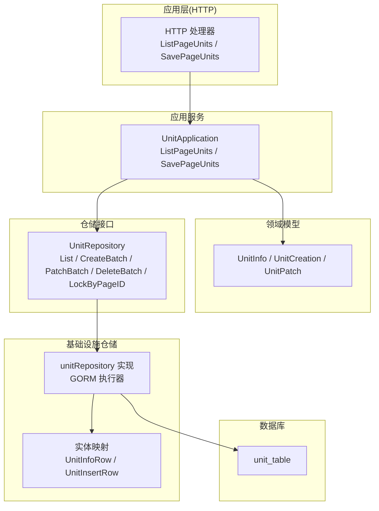
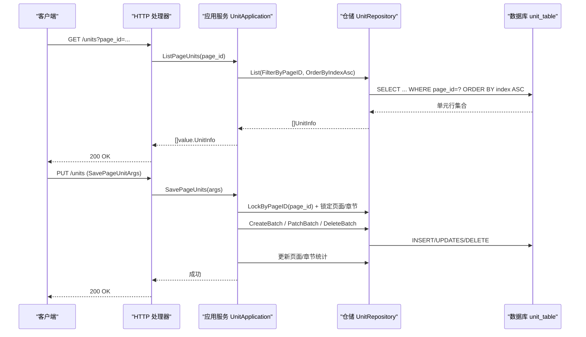
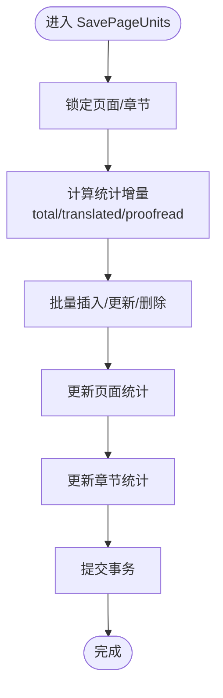
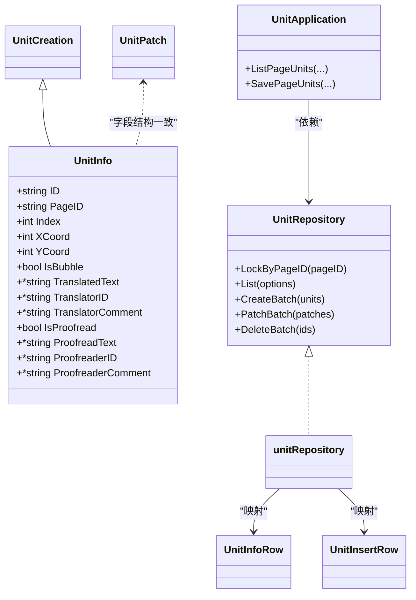

# 单元表设计

<cite>
**本文引用的文件**
- [20260306101216_unit-table.up.sql](file://migrations/20260306101216_unit-table.up.sql)
- [20260306101216_unit-table.down.sql](file://migrations/20260306101216_unit-table.down.sql)
- [unit.go](file://internal/domain/model/unit.go)
- [unit.go](file://internal/domain/repository/unit.go)
- [unit.go](file://internal/application/unit.go)
- [unit.go](file://internal/api/http/unit.go)
- [unit.go](file://internal/infrastructure/repository/unit.go)
- [unit.go](file://internal/infrastructure/repository/entity/unit.go)
- [unit.go](file://internal/application/assembler/unit.go)
- [unit.go](file://internal/infrastructure/repository/query_option/unit.go)
- [unit.go](file://internal/value/unit.go)
- [page.go](file://internal/domain/model/page.go)
- [chapter.go](file://internal/domain/model/chapter.go)
- [workflow.go](file://internal/domain/model/workflow.go)
- [permission.go](file://internal/domain/model/permission.go)
</cite>

## 目录
1. [简介](#简介)
2. [项目结构](#项目结构)
3. [核心组件](#核心组件)
4. [架构总览](#架构总览)
5. [详细组件分析](#详细组件分析)
6. [依赖关系分析](#依赖关系分析)
7. [性能考量](#性能考量)
8. [故障排查指南](#故障排查指南)
9. [结论](#结论)
10. [附录](#附录)

## 简介
本设计文档围绕 poprako-web-ms 项目中的“单元表（unit_table）”展开，系统性阐述其结构设计、字段语义、与系统其他表的交互关系、数据模型与业务含义、查询模式与性能考虑、管理策略与维护建议，以及扩展性与兼容性设计。单元表承载漫画页面上的“翻校单元”数据，是翻译与校对流程的关键载体。

## 项目结构
单元表位于数据库迁移脚本中定义，应用层通过领域模型、仓储接口、应用服务、HTTP 接口与基础设施仓储协同工作，形成清晰的分层架构。

图表来源
- [unit.go:10-91](file://internal/api/http/unit.go#L10-L91)
- [unit.go:18-416](file://internal/application/unit.go#L18-L416)
- [unit.go:5-16](file://internal/domain/repository/unit.go#L5-L16)
- [unit.go:12-179](file://internal/infrastructure/repository/unit.go#L12-L179)
- [unit.go:9-83](file://internal/infrastructure/repository/entity/unit.go#L9-L83)

章节来源
- [unit.go:10-91](file://internal/api/http/unit.go#L10-L91)
- [unit.go:18-416](file://internal/application/unit.go#L18-L416)
- [unit.go:5-16](file://internal/domain/repository/unit.go#L5-L16)
- [unit.go:12-179](file://internal/infrastructure/repository/unit.go#L12-L179)
- [unit.go:9-83](file://internal/infrastructure/repository/entity/unit.go#L9-L83)

## 核心组件
- 数据库表：unit_table
  - 主键：id（TEXT）
  - 外键：page_id 引用 page_table(id)，级联删除
  - 唯一索引：(page_id, index)
  - 索引：page_id
  - 时间戳：created_at、updated_at（Timestamptz，默认 NOW）

- 领域模型
  - UnitInfo：单元完整信息（含坐标、气泡标记、译文/校对文本及人员信息）
  - UnitCreation：创建用信息别名
  - UnitPatch：按需更新的补丁结构，使用 Option 控制字段是否更新

- 应用服务
  - ListPageUnits：按页查询单元并排序
  - SavePageUnits：diff 语义保存（insert/patch/delete），事务内更新页面与章节统计

- 仓储接口与实现
  - UnitRepository：提供批量操作、悲观锁、查询选项
  - unitRepository：基于 GORM 的具体实现，支持条件更新、批量插入/删除、悲观锁

- 实体映射
  - UnitInfoRow/UnitInsertRow：数据库行与领域模型之间的映射

- 值对象与装配
  - value.UnitInfo/UnitPatch：API 层序列化/反序列化结构
  - AssembleUnitInfo：领域模型到值对象的装配

章节来源
- [20260306101216_unit-table.up.sql:1-30](file://migrations/20260306101216_unit-table.up.sql#L1-L30)
- [unit.go:7-149](file://internal/domain/model/unit.go#L7-L149)
- [unit.go:18-416](file://internal/application/unit.go#L18-L416)
- [unit.go:5-16](file://internal/domain/repository/unit.go#L5-L16)
- [unit.go:12-179](file://internal/infrastructure/repository/unit.go#L12-L179)
- [unit.go:14-83](file://internal/infrastructure/repository/entity/unit.go#L14-L83)
- [unit.go:5-59](file://internal/value/unit.go#L5-L59)
- [unit.go:8-26](file://internal/application/assembler/unit.go#L8-L26)

## 架构总览
单元表在系统中的职责与交互如下：

图表来源
- [unit.go:22-91](file://internal/api/http/unit.go#L22-L91)
- [unit.go:81-416](file://internal/application/unit.go#L81-L416)
- [unit.go:5-16](file://internal/domain/repository/unit.go#L5-L16)
- [unit.go:32-179](file://internal/infrastructure/repository/unit.go#L32-L179)

## 详细组件分析

### 数据模型与业务含义
- 基本属性
  - 坐标：x_coord、y_coord（REAL，映射到领域模型的 int）
  - 排序：index（整数，唯一约束与排序依据）
  - 气泡：in_bubble（布尔，标记单元是否位于对话气泡内）
  - 翻译状态：translated_text、translator_id、translator_comment
  - 校对状态：proofreader_text、proofreader_id、proofreader_comment
  - 审阅标记：is_proofread（布尔）

- 关联关系
  - page_id -> page_table.id（外键，级联删除）
  - translator_id / proofreader_id -> user_table.id（可空引用，删除时置空）

- 统计联动
  - 应用服务在保存 diff 后，原子性更新 page_table 与 chapter_table 的统计字段（总数、已翻译数、已校对数），并保证非负。

- 权限控制
  - 查看列表：需具备译者或校对者的分工角色
  - 保存单元：需具备译者或校对者的分工角色

章节来源
- [20260306101216_unit-table.up.sql:1-30](file://migrations/20260306101216_unit-table.up.sql#L1-L30)
- [unit.go:7-149](file://internal/domain/model/unit.go#L7-L149)
- [unit.go:81-416](file://internal/application/unit.go#L81-L416)
- [page.go:54-134](file://internal/domain/model/page.go#L54-L134)
- [chapter.go:83-103](file://internal/domain/model/chapter.go#L83-L103)
- [permission.go:734-794](file://internal/domain/model/permission.go#L734-L794)

### 查询模式与性能考虑
- 查询模式
  - 列表：按 page_id 过滤，按 index 升序排序
  - 批量：CreateBatch/PatchBatch/DeleteBatch
  - 并发：LockByPageID 使用悲观锁，防止并发冲突

- 性能要点
  - 唯一索引 (page_id, index)：确保每页内单元顺序唯一，支持快速定位与去重
  - 索引 page_id：加速按页查询与锁范围
  - Patch 按需更新：仅更新 Option.Some 的字段，减少写放大
  - 事务内批量操作：降低往返次数，提升吞吐

图表来源
- [unit.go:250-416](file://internal/application/unit.go#L250-L416)
- [unit.go:32-179](file://internal/infrastructure/repository/unit.go#L32-L179)

章节来源
- [unit.go:11-22](file://internal/infrastructure/repository/query_option/unit.go#L11-L22)
- [unit.go:32-179](file://internal/infrastructure/repository/unit.go#L32-L179)
- [unit.go:250-416](file://internal/application/unit.go#L250-L416)

### 数据管理策略与维护建议
- 创建与更新
  - 使用 UnitCreation 一次性传入完整信息；使用 UnitPatch 仅传入需要变更的字段，避免覆盖未变更内容
  - 通过 diff 参数（insert/patch/delete）进行幂等保存，适合协作场景

- 并发与一致性
  - 保存前先对页面与章节加悲观锁，再执行批量操作，最后统一更新统计，保证一致性
  - Patch 未命中行不报错，满足多端协作的幂等需求

- 数据完整性
  - 外键约束保证页面删除时单元级联清理
  - 用户引用删除时置空，避免悬挂引用

- 版本与迁移
  - 提供 up/down 脚本，便于环境迁移与回滚

章节来源
- [unit.go:125-416](file://internal/application/unit.go#L125-L416)
- [unit.go:65-179](file://internal/infrastructure/repository/unit.go#L65-L179)
- [20260306101216_unit-table.up.sql:1-30](file://migrations/20260306101216_unit-table.up.sql#L1-L30)
- [20260306101216_unit-table.down.sql:1-1](file://migrations/20260306101216_unit-table.down.sql#L1-L1)

### 扩展性与兼容性设计
- 扩展性
  - 领域模型与值对象分离，便于 API 层灵活调整序列化字段
  - 仓储接口抽象良好，可替换不同存储实现
  - 统一的查询选项模式，易于扩展过滤/排序条件

- 兼容性
  - 坐标字段在数据库为 REAL，领域模型映射为 int，适配前端渲染精度需求
  - 统一的时间戳字段与默认值，保证跨环境一致性
  - 权限模型与工作流状态解耦，便于后续扩展角色与流程

章节来源
- [unit.go:14-36](file://internal/infrastructure/repository/entity/unit.go#L14-L36)
- [unit.go:5-16](file://internal/domain/repository/unit.go#L5-L16)
- [workflow.go:24-36](file://internal/domain/model/workflow.go#L24-L36)

## 依赖关系分析

图表来源
- [unit.go:7-149](file://internal/domain/model/unit.go#L7-L149)
- [unit.go:5-16](file://internal/domain/repository/unit.go#L5-L16)
- [unit.go:12-179](file://internal/infrastructure/repository/unit.go#L12-L179)
- [unit.go:14-83](file://internal/infrastructure/repository/entity/unit.go#L14-L83)
- [unit.go:37-44](file://internal/application/unit.go#L37-L44)

章节来源
- [unit.go:7-149](file://internal/domain/model/unit.go#L7-L149)
- [unit.go:5-16](file://internal/domain/repository/unit.go#L5-L16)
- [unit.go:12-179](file://internal/infrastructure/repository/unit.go#L12-L179)
- [unit.go:14-83](file://internal/infrastructure/repository/entity/unit.go#L14-L83)
- [unit.go:37-44](file://internal/application/unit.go#L37-L44)

## 性能考量
- 索引策略
  - page_id 索引：加速按页查询与锁范围
  - (page_id, index) 唯一索引：保证每页内顺序唯一，支持高效排序与去重

- 写入优化
  - 批量插入/更新/删除：减少网络往返与事务开销
  - Patch 按需更新：仅写入变更字段，降低 IO

- 读取优化
  - 固定排序：index ASC，便于前端顺序渲染
  - 条件过滤：按 page_id 过滤，避免全表扫描

- 并发控制
  - 悲观锁：LockByPageID 在事务内锁定相关行，避免并发写入冲突

章节来源
- [20260306101216_unit-table.up.sql:28-30](file://migrations/20260306101216_unit-table.up.sql#L28-L30)
- [unit.go:32-179](file://internal/infrastructure/repository/unit.go#L32-L179)
- [unit.go:218-236](file://internal/application/unit.go#L218-L236)

## 故障排查指南
- 权限不足
  - 现象：返回 403 Forbidden
  - 原因：当前用户无译者/校对者分工
  - 处理：确认分工状态与分配关系

- 事务失败
  - 现象：保存失败，日志包含事务回滚/提交错误
  - 原因：并发冲突、锁超时、统计字段负值
  - 处理：重试请求；检查统计字段计算逻辑；优化锁粒度

- 统计字段异常
  - 现象：统计字段出现负值
  - 原因：删除单元导致计数回退
  - 处理：确保 diff 计算正确；在应用层做边界保护

- 数据不一致
  - 现象：Patch 未命中行但无错误
  - 说明：这是幂等设计，不影响最终一致性
  - 处理：前端重试或合并多次 diff

章节来源
- [unit.go:42-88](file://internal/api/http/unit.go#L42-L88)
- [unit.go:140-150](file://internal/application/unit.go#L140-L150)
- [unit.go:362-370](file://internal/application/unit.go#L362-L370)
- [unit.go:409-412](file://internal/application/unit.go#L409-L412)

## 结论
单元表作为翻译与校对流程的核心数据结构，通过清晰的领域模型、严格的权限控制、完善的仓储抽象与事务一致性保障，实现了高并发协作下的稳定运行。其索引与批处理设计兼顾了查询效率与写入吞吐。未来可在统计维度扩展更多指标、完善审计日志，并持续优化锁策略与重试机制，以进一步提升可用性与可观测性。

## 附录
- 字段对照表（数据库列名 ↔ 领域模型字段）
  - x_coord/y_coord：REAL → int（坐标）
  - in_bubble：布尔 → IsBubble
  - is_proofread：布尔 → IsProofread
  - translated_text/proofreader_text：TEXT → TranslatedText/ProofreadText
  - translator_id/proofreader_id：TEXT → TranslatorID/ProofreaderID
  - translator_comment/proofreader_comment：TEXT → TranslatorComment/ProofreaderComment

- API 端点
  - GET /units?page_id=...：获取页面单元列表（按 index 升序）
  - PUT /units：保存页面单元 diff（insert/patch/delete）

章节来源
- [unit.go:14-36](file://internal/infrastructure/repository/entity/unit.go#L14-L36)
- [unit.go:10-91](file://internal/api/http/unit.go#L10-L91)