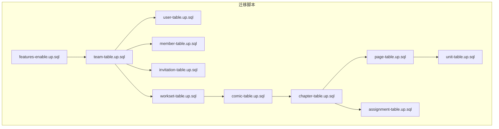
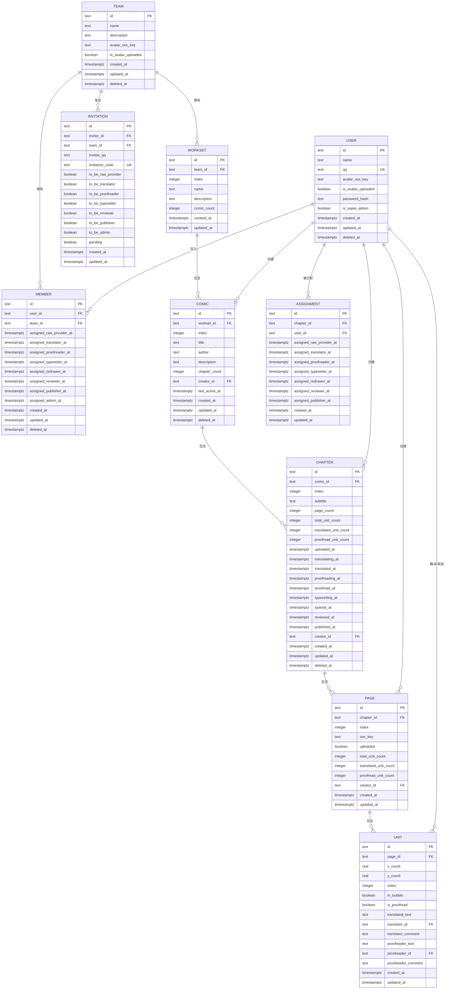
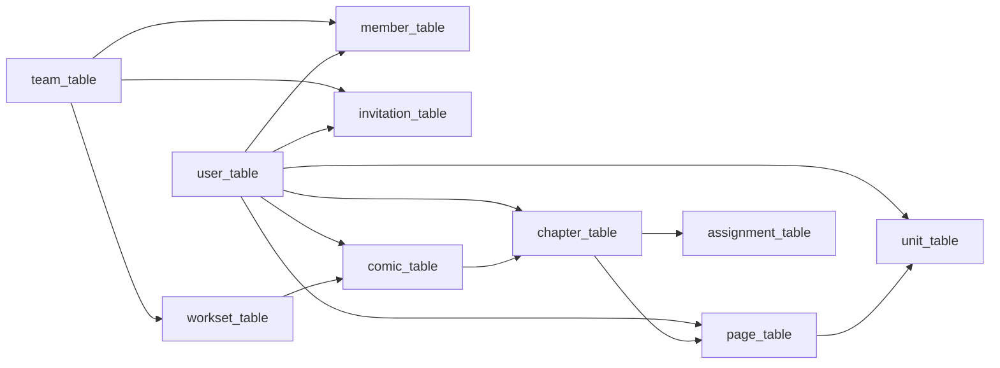

# 数据库表结构

<cite>
**本文档引用的文件**
- [20260301065010_features-enable.up.sql](file://migrations/20260301065010_features-enable.up.sql)
- [20260301065012_team-table.up.sql](file://migrations/20260301065012_team-table.up.sql)
- [20260301065022_user-table.up.sql](file://migrations/20260301065022_user-table.up.sql)
- [20260301075641_member-table.up.sql](file://migrations/20260301075641_member-table.up.sql)
- [20260301075642_invitation-table.up.sql](file://migrations/20260301075642_invitation-table.up.sql)
- [20260306101211_workset-table.up.sql](file://migrations/20260306101211_workset-table.up.sql)
- [20260306101212_comic-table.up.sql](file://migrations/20260306101212_comic-table.up.sql)
- [20260306101213_chapter-table.up.sql](file://migrations/20260306101213_chapter-table.up.sql)
- [20260306101214_page-table.up.sql](file://migrations/20260306101214_page-table.up.sql)
- [20260306101215_assignment-table.up.sql](file://migrations/20260306101215_assignment-table.up.sql)
- [20260306101216_unit-table.up.sql](file://migrations/20260306101216_unit-table.up.sql)
- [team.go](file://internal/infrastructure/repository/entity/team.go)
- [user.go](file://internal/infrastructure/repository/entity/user.go)
- [member.go](file://internal/infrastructure/repository/entity/member.go)
- [invitation.go](file://internal/infrastructure/repository/entity/invitation.go)
- [workset.go](file://internal/infrastructure/repository/entity/workset.go)
</cite>

## 目录
1. [引言](#引言)
2. [项目结构](#项目结构)
3. [核心组件](#核心组件)
4. [架构总览](#架构总览)
5. [详细组件分析](#详细组件分析)
6. [依赖分析](#依赖分析)
7. [性能考量](#性能考量)
8. [故障排查指南](#故障排查指南)
9. [结论](#结论)
10. [附录](#附录)

## 引言
本文件系统性梳理漫画翻译协作平台的数据库表结构，覆盖所有业务表的字段定义、数据类型、约束与索引、主外键关系、默认值与时间戳策略，并结合 Go 领域模型与实体映射，给出从领域到持久层的数据类型转换与验证要点。文档还提供表结构演进与兼容性建议，帮助维护者与开发者理解当前设计并指导后续迭代。

## 项目结构
数据库表结构由一系列迁移脚本定义，采用按功能模块逐步演进的方式创建。各表围绕“团队-成员-邀请-工作集-漫画-章节-页面-任务单元”等核心业务对象展开，形成清晰的层次化关系。实体层通过 GORM 映射将数据库列名与 Go 结构体字段对应，确保 ORM 层与数据库层的一致性。

图表来源
- [20260301065010_features-enable.up.sql:1-2](file://migrations/20260301065010_features-enable.up.sql#L1-L2)
- [20260301065012_team-table.up.sql:1-16](file://migrations/20260301065012_team-table.up.sql#L1-L16)
- [20260301065022_user-table.up.sql:1-52](file://migrations/20260301065022_user-table.up.sql#L1-L52)
- [20260301075641_member-table.up.sql:1-63](file://migrations/20260301075641_member-table.up.sql#L1-L63)
- [20260301075642_invitation-table.up.sql:1-27](file://migrations/20260301075642_invitation-table.up.sql#L1-L27)
- [20260306101211_workset-table.up.sql:1-19](file://migrations/20260306101211_workset-table.up.sql#L1-L19)
- [20260306101212_comic-table.up.sql:1-37](file://migrations/20260306101212_comic-table.up.sql#L1-L37)
- [20260306101213_chapter-table.up.sql:1-38](file://migrations/20260306101213_chapter-table.up.sql#L1-L38)
- [20260306101214_page-table.up.sql:1-25](file://migrations/20260306101214_page-table.up.sql#L1-L25)
- [20260306101215_assignment-table.up.sql:1-26](file://migrations/20260306101215_assignment-table.up.sql#L1-L26)
- [20260306101216_unit-table.up.sql:1-30](file://migrations/20260306101216_unit-table.up.sql#L1-L30)

章节来源
- [20260301065010_features-enable.up.sql:1-2](file://migrations/20260301065010_features-enable.up.sql#L1-L2)
- [20260301065012_team-table.up.sql:1-16](file://migrations/20260301065012_team-table.up.sql#L1-L16)
- [20260301065022_user-table.up.sql:1-52](file://migrations/20260301065022_user-table.up.sql#L1-L52)
- [20260301075641_member-table.up.sql:1-63](file://migrations/20260301075641_member-table.up.sql#L1-L63)
- [20260301075642_invitation-table.up.sql:1-27](file://migrations/20260301075642_invitation-table.up.sql#L1-L27)
- [20260306101211_workset-table.up.sql:1-19](file://migrations/20260306101211_workset-table.up.sql#L1-L19)
- [20260306101212_comic-table.up.sql:1-37](file://migrations/20260306101212_comic-table.up.sql#L1-L37)
- [20260306101213_chapter-table.up.sql:1-38](file://migrations/20260306101213_chapter-table.up.sql#L1-L38)
- [20260306101214_page-table.up.sql:1-25](file://migrations/20260306101214_page-table.up.sql#L1-L25)
- [20260306101215_assignment-table.up.sql:1-26](file://migrations/20260306101215_assignment-table.up.sql#L1-L26)
- [20260306101216_unit-table.up.sql:1-30](file://migrations/20260306101216_unit-table.up.sql#L1-L30)

## 核心组件
本节概述各业务表的职责边界与关键字段，便于快速定位与理解。

- 团队表：存储翻译团队基本信息与头像元数据，支持软删除与按名称唯一约束。
- 用户表：存储用户身份信息、认证凭据、头像与权限标记，支持按名称、QQ 等多维检索。
- 成员表：记录用户在团队中的角色分配时间线，支持软删除与多维度索引。
- 邀请表：管理团队邀请码、目标角色与状态，支持按团队+创建时间查询。
- 工作集表：组织漫画集合，按团队+序号唯一，支持计数字段。
- 漫画表：记录漫画元信息、作者、章节计数与最后活跃时间，支持软删除与多维索引。
- 章节表：记录章节进度与各环节时间戳，支持软删除与多维索引。
- 页面表：记录页面与页码、上传状态与单元统计，支持唯一索引。
- 任务分配表：记录用户在章节上的角色分配时间线，支持唯一组合索引。
- 单元表：记录页面内文本单元的坐标、翻译与审阅状态，支持唯一索引与外键级联。

章节来源
- [20260301065012_team-table.up.sql:1-16](file://migrations/20260301065012_team-table.up.sql#L1-L16)
- [20260301065022_user-table.up.sql:1-52](file://migrations/20260301065022_user-table.up.sql#L1-L52)
- [20260301075641_member-table.up.sql:1-63](file://migrations/20260301075641_member-table.up.sql#L1-L63)
- [20260301075642_invitation-table.up.sql:1-27](file://migrations/20260301075642_invitation-table.up.sql#L1-L27)
- [20260306101211_workset-table.up.sql:1-19](file://migrations/20260306101211_workset-table.up.sql#L1-L19)
- [20260306101212_comic-table.up.sql:1-37](file://migrations/20260306101212_comic-table.up.sql#L1-L37)
- [20260306101213_chapter-table.up.sql:1-38](file://migrations/20260306101213_chapter-table.up.sql#L1-L38)
- [20260306101214_page-table.up.sql:1-25](file://migrations/20260306101214_page-table.up.sql#L1-L25)
- [20260306101215_assignment-table.up.sql:1-26](file://migrations/20260306101215_assignment-table.up.sql#L1-L26)
- [20260306101216_unit-table.up.sql:1-30](file://migrations/20260306101216_unit-table.up.sql#L1-L30)

## 架构总览
下图展示表之间的层级关系与外键约束，体现从团队到工作集、漫画、章节、页面再到任务单元的完整业务链路。

图表来源
- [20260301065012_team-table.up.sql:1-16](file://migrations/20260301065012_team-table.up.sql#L1-L16)
- [20260301065022_user-table.up.sql:1-52](file://migrations/20260301065022_user-table.up.sql#L1-L52)
- [20260301075641_member-table.up.sql:1-63](file://migrations/20260301075641_member-table.up.sql#L1-L63)
- [20260301075642_invitation-table.up.sql:1-27](file://migrations/20260301075642_invitation-table.up.sql#L1-L27)
- [20260306101211_workset-table.up.sql:1-19](file://migrations/20260306101211_workset-table.up.sql#L1-L19)
- [20260306101212_comic-table.up.sql:1-37](file://migrations/20260306101212_comic-table.up.sql#L1-L37)
- [20260306101213_chapter-table.up.sql:1-38](file://migrations/20260306101213_chapter-table.up.sql#L1-L38)
- [20260306101214_page-table.up.sql:1-25](file://migrations/20260306101214_page-table.up.sql#L1-L25)
- [20260306101215_assignment-table.up.sql:1-26](file://migrations/20260306101215_assignment-table.up.sql#L1-L26)
- [20260306101216_unit-table.up.sql:1-30](file://migrations/20260306101216_unit-table.up.sql#L1-L30)

## 详细组件分析

### 团队表（team_table）
- 主键：id（文本型，全局唯一标识）
- 字段与约束
  - name：非空，唯一索引（配合软删除条件）
  - avatar_oss_key：头像 OSS 键
  - is_avatar_uploaded：布尔，默认 false
  - created_at/updated_at/deleted_at：时间戳，默认 NOW()；deleted_at 支持软删除
- 唯一性与索引
  - 唯一索引：name（未软删除时生效）
- 业务含义
  - 存储翻译团队基础信息与头像元数据，支持软删除与按名称唯一约束，避免重名冲突
- 数据字典
  - id：团队 ID
  - name：团队名称
  - description：团队简介
  - avatar_oss_key：头像存储键
  - is_avatar_uploaded：头像是否已上传
  - created_at/updated_at/deleted_at：创建、更新、删除时间

章节来源
- [20260301065012_team-table.up.sql:1-16](file://migrations/20260301065012_team-table.up.sql#L1-L16)

### 用户表（user_table）
- 主键：id（文本型）
- 字段与约束
  - name：非空
  - qq：非空且唯一
  - avatar_oss_key：非空
  - is_avatar_uploaded：布尔，默认 false
  - password_hash：非空（认证凭据）
  - is_super_admin：布尔，默认 false
  - created_at/updated_at：默认 NOW()
  - deleted_at：软删除
- 索引
  - 名称模糊匹配索引（GIN + trgm）
  - qq 唯一索引
  - created_at/updated_at 降序索引（配合软删除过滤）
- 业务含义
  - 用户身份与认证载体，支持按名称搜索、QQ 登录与超级管理员标记
- 数据字典
  - id：用户 ID
  - name：姓名
  - qq：QQ 号（登录标识）
  - avatar_oss_key：头像存储键
  - is_avatar_uploaded：头像是否已上传
  - password_hash：密码哈希
  - is_super_admin：是否超级管理员
  - created_at/updated_at/deleted_at：创建、更新、删除时间

章节来源
- [20260301065022_user-table.up.sql:1-52](file://migrations/20260301065022_user-table.up.sql#L1-L52)

### 成员表（member_table）
- 主键：id（文本型）
- 外键
  - user_id → user_table(id)，级联删除
  - team_id → team_table(id)，级联删除
- 字段与约束
  - 角色分配时间戳字段：raw_provider、translator、proofreader、typesetter、reviewer、publisher、admin
  - created_at/updated_at：默认 NOW()
  - deleted_at：软删除
- 索引
  - user_id、team_id 单列索引
  - 各角色分配时间戳的条件索引（仅非空且未软删除）
- 业务含义
  - 记录用户在团队中的角色分配时间线，支持软删除与多维检索
- 数据字典
  - id：成员记录 ID
  - user_id：用户 ID
  - team_id：团队 ID
  - assigned_*_at：各角色分配时间
  - created_at/updated_at/deleted_at：创建、更新、删除时间

章节来源
- [20260301075641_member-table.up.sql:1-63](file://migrations/20260301075641_member-table.up.sql#L1-L63)

### 邀请表（invitation_table）
- 主键：id（文本型）
- 外键
  - invitor_id → user_table(id)，级联删除
  - team_id → team_table(id)，级联删除
- 字段与约束
  - invitee_qq：被邀请人 QQ
  - invitation_code：非空且唯一
  - 角色标志位：to_be_raw_provider、to_be_translator、to_be_proofreader、to_be_typesetter、to_be_reviewer、to_be_publisher、to_be_admin
  - pending：默认 true（未处理）
  - created_at/updated_at：默认 NOW()
- 索引
  - 团队+创建时间降序索引（仅未处理时有效）
- 业务含义
  - 管理团队邀请流程，支持角色预设与状态跟踪
- 数据字典
  - id：邀请记录 ID
  - invitor_id：邀请人 ID
  - team_id：目标团队 ID
  - invitee_qq：被邀请人 QQ
  - invitation_code：邀请码
  - to_be_*：目标角色
  - pending：是否待处理
  - created_at/updated_at：创建、更新时间

章节来源
- [20260301075642_invitation-table.up.sql:1-27](file://migrations/20260301075642_invitation-table.up.sql#L1-L27)

### 工作集表（workset_table）
- 主键：id（文本型）
- 外键
  - team_id → team_table(id)，级联删除
- 字段与约束
  - index：非负整数，配合 team_id 建立唯一索引
  - name：非空
  - description：简介
  - comic_count：默认 0
  - created_at/updated_at：默认 NOW()
- 索引
  - team_id 单列索引
  - 唯一索引：team_id + index
- 业务含义
  - 组织漫画集合，保证同一团队内的工作集序号唯一
- 数据字典
  - id：工作集 ID
  - team_id：所属团队
  - index：序号
  - name：名称
  - description：简介
  - comic_count：漫画数量
  - created_at/updated_at：创建、更新时间

章节来源
- [20260306101211_workset-table.up.sql:1-19](file://migrations/20260306101211_workset-table.up.sql#L1-L19)

### 漫画表（comic_table）
- 主键：id（文本型）
- 外键
  - workset_id → workset_table(id)，级联删除
  - creator_id → user_table(id)，限制删除（防止误删创建者）
- 字段与约束
  - index：默认 0
  - title/author：非空
  - description：简介
  - chapter_count：默认 0
  - creator_id：非空
  - last_active_at：默认 NOW()
  - created_at/updated_at/deleted_at：软删除
- 索引
  - 唯一索引：team_id + index（未软删除时生效）
  - team_id + created_at 降序索引（未软删除时生效）
  - creator_id 索引（未软删除时生效）
  - team_id + last_active_at 降序索引（未软删除时生效）
- 业务含义
  - 记录漫画元信息与统计，支持按团队与活跃度排序
- 数据字典
  - id：漫画 ID
  - workset_id：所属工作集
  - index：序号
  - title：标题
  - author：作者
  - description：简介
  - chapter_count：章节数量
  - creator_id：创建者
  - last_active_at：最后活跃时间
  - created_at/updated_at/deleted_at：创建、更新、删除时间

章节来源
- [20260306101212_comic-table.up.sql:1-37](file://migrations/20260306101212_comic-table.up.sql#L1-L37)

### 章节表（chapter_table）
- 主键：id（文本型）
- 外键
  - comic_id → comic_table(id)，级联删除
  - creator_id → user_table(id)，限制删除
- 字段与约束
  - index：默认 0
  - subtitle：非空
  - page_count/total_unit_count/translated_unit_count/proofread_unit_count：默认 0
  - 各环节时间戳：uploaded、transalating、translated、proofreading、proofread、typesetting、typeset、reviewed、published
  - creator_id：非空
  - created_at/updated_at/deleted_at：软删除
- 索引
  - 唯一索引：comic_id + index（未软删除时生效）
  - comic_id 索引（未软删除时生效）
- 业务含义
  - 记录章节进度与统计，支持多阶段状态追踪
- 数据字典
  - id：章节 ID
  - comic_id：所属漫画
  - index：序号
  - subtitle：副标题
  - page_count/total_unit_count/translated_unit_count/proofread_unit_count：统计字段
  - uploaded/transalating/translated/proofreading/proofread/typesetting/typeset/reviewed/published：各环节时间
  - creator_id：创建者
  - created_at/updated_at/deleted_at：创建、更新、删除时间

章节来源
- [20260306101213_chapter-table.up.sql:1-38](file://migrations/20260306101213_chapter-table.up.sql#L1-L38)

### 页面表（page_table）
- 主键：id（文本型）
- 外键
  - chapter_id → chapter_table(id)，级联删除
  - creator_id → user_table(id)，限制删除
- 字段与约束
  - index：默认 0
  - oss_key：图片存储键
  - uploaded：布尔，默认 false
  - total_unit_count/translated_unit_count/proofread_unit_count：默认 0
  - creator_id：非空
  - created_at/updated_at：默认 NOW()
- 索引
  - chapter_id 索引
  - 唯一索引：chapter_id + index
- 业务含义
  - 记录页面与页码、上传状态与单元统计
- 数据字典
  - id：页面 ID
  - chapter_id：所属章节
  - index：页码
  - oss_key：图片存储键
  - uploaded：是否已上传
  - total_unit_count/translated_unit_count/proofread_unit_count：统计字段
  - creator_id：创建者
  - created_at/updated_at：创建、更新时间

章节来源
- [20260306101214_page-table.up.sql:1-25](file://migrations/20260306101214_page-table.up.sql#L1-L25)

### 任务分配表（assignment_table）
- 主键：id（文本型）
- 外键
  - chapter_id → chapter_table(id)，级联删除
  - user_id → user_table(id)，级联删除
- 字段与约束
  - 角色分配时间戳字段：raw_provider、translator、proofreader、typesetter、redrawer、reviewer、publisher
  - created_at/updated_at：默认 NOW()
- 索引
  - chapter_id、user_id 单列索引
  - 唯一索引：chapter_id + user_id
- 业务含义
  - 记录用户在章节上的角色分配时间线，避免重复分配
- 数据字典
  - id：分配记录 ID
  - chapter_id：章节 ID
  - user_id：用户 ID
  - assigned_*_at：各角色分配时间
  - created_at/updated_at：创建、更新时间

章节来源
- [20260306101215_assignment-table.up.sql:1-26](file://migrations/20260306101215_assignment-table.up.sql#L1-L26)

### 单元表（unit_table）
- 主键：id（文本型）
- 外键
  - page_id → page_table(id)，级联删除
  - translator_id/proofreader_id → user_table(id)，删除时置空
- 字段与约束
  - x_coord/y_coord：实数坐标
  - index：非负整数
  - in_bubble：布尔，默认 true
  - is_proofread：布尔，默认 false
  - translated_text/translator_comment：翻译相关
  - proofreader_text/proofreader_comment：审阅相关
  - created_at/updated_at：默认 NOW()
- 索引
  - page_id 索引
  - 唯一索引：page_id + index
- 业务含义
  - 记录页面内文本单元的坐标、翻译与审阅状态
- 数据字典
  - id：单元 ID
  - page_id：所属页面
  - x_coord/y_coord：坐标
  - index：序号
  - in_bubble：是否位于气泡内
  - is_proofread：是否已审阅
  - translated_text/translator_id/translator_comment：译者信息与评论
  - proofreader_text/proofreader_id/proofreader_comment：审阅者信息与评论
  - created_at/updated_at：创建、更新时间

章节来源
- [20260306101216_unit-table.up.sql:1-30](file://migrations/20260306101216_unit-table.up.sql#L1-L30)

### 从 Go 领域模型到数据库表的映射
- 团队
  - 实体映射：TeamInfoRow → team_table
  - 关键点：列名与结构体标签一致，软删除使用 deleted_at 过滤
- 用户
  - 实体映射：UserInfoRow/UserCredentialsRow/UserInsertRow → user_table
  - 关键点：密码字段仅在凭证行中出现；软删除过滤；索引与查询路径一致
- 成员
  - 实体映射：MemberProfileRow/MemberWithUserRow/MemberWithTeamRow → member_table（可关联 user_table、team_table）
  - 关键点：角色分配时间戳字段与数据库一致；软删除过滤；多维索引支持高效查询
- 邀请
  - 实体映射：InvitationInfoRow/InvitationInsertRow → invitation_table（可关联 user_table）
  - 关键点：邀请码唯一；角色标志位与 pending 状态；索引优化团队维度查询
- 工作集
  - 实体映射：WorksetInfoRow/WorksetInsertRow → workset_table（可关联 team_table）
  - 关键点：team_id + index 唯一；统计字段 comic_count
- 漫画/章节/页面/单元
  - 实体映射：comic/chapter/page/unit 表与其对应实体行
  - 关键点：外键级联策略与软删除过滤；统计字段与时间戳字段保持一致

章节来源
- [team.go:1-47](file://internal/infrastructure/repository/entity/team.go#L1-L47)
- [user.go:1-58](file://internal/infrastructure/repository/entity/user.go#L1-L58)
- [member.go:1-143](file://internal/infrastructure/repository/entity/member.go#L1-L143)
- [invitation.go:1-98](file://internal/infrastructure/repository/entity/invitation.go#L1-L98)
- [workset.go:1-73](file://internal/infrastructure/repository/entity/workset.go#L1-L73)

## 依赖分析
- 外键关系
  - team_table ← member_table, workset_table, invitation_table
  - user_table ← member_table, invitation_table, comic_table, chapter_table, page_table, unit_table
  - workset_table → comic_table
  - comic_table → chapter_table
  - chapter_table → page_table, assignment_table
  - page_table → unit_table
- 级联策略
  - 成员、邀请、工作集、漫画、章节、页面、单元：ON DELETE CASCADE
  - 创建者引用：ON DELETE RESTRICT（保护数据完整性）
- 约束与索引
  - 唯一索引：team.name、user.qq、invitation.code、workset.team_id+index、comic.team_id+index、chapter.comic_id+index、page.chapter_id+index、assignment.chapter_id+user_id、unit.page_id+index
  - 条件索引：软删除过滤、角色分配时间戳非空过滤
- 软删除
  - 所有涉及软删除的索引均带有 WHERE deleted_at IS NULL 或相应条件

图表来源
- [20260301065012_team-table.up.sql:1-16](file://migrations/20260301065012_team-table.up.sql#L1-L16)
- [20260301065022_user-table.up.sql:1-52](file://migrations/20260301065022_user-table.up.sql#L1-L52)
- [20260301075641_member-table.up.sql:1-63](file://migrations/20260301075641_member-table.up.sql#L1-L63)
- [20260301075642_invitation-table.up.sql:1-27](file://migrations/20260301075642_invitation-table.up.sql#L1-L27)
- [20260306101211_workset-table.up.sql:1-19](file://migrations/20260306101211_workset-table.up.sql#L1-L19)
- [20260306101212_comic-table.up.sql:1-37](file://migrations/20260306101212_comic-table.up.sql#L1-L37)
- [20260306101213_chapter-table.up.sql:1-38](file://migrations/20260306101213_chapter-table.up.sql#L1-L38)
- [20260306101214_page-table.up.sql:1-25](file://migrations/20260306101214_page-table.up.sql#L1-L25)
- [20260306101215_assignment-table.up.sql:1-26](file://migrations/20260306101215_assignment-table.up.sql#L1-L26)
- [20260306101216_unit-table.up.sql:1-30](file://migrations/20260306101216_unit-table.up.sql#L1-L30)

## 性能考量
- 索引策略
  - 名称模糊搜索使用 GIN + trgm，适合全文检索场景
  - 多列唯一索引减少重复与并发冲突
  - 条件索引（软删除、非空时间戳）提升查询效率
- 时间戳与排序
  - created_at/updated_at 降序索引支持分页与最新优先展示
  - last_active_at 支持活跃度排序
- 外键与级联
  - 级联删除简化清理逻辑，但需注意批量删除影响
  - RESTRICT 保护关键引用完整性（如创建者）

## 故障排查指南
- 唯一约束冲突
  - 现象：插入失败，提示违反唯一约束
  - 排查：确认 team.name、user.qq、invitation.code、workset.team_id+index、comic.team_id+index、chapter.comic_id+index、page.chapter_id+index、assignment.chapter_id+user_id、unit.page_id+index 的唯一性
- 软删除导致查询为空
  - 现象：查询无结果
  - 排查：确认查询条件是否包含 deleted_at IS NULL 过滤
- 外键引用错误
  - 现象：插入或更新失败，提示外键约束
  - 排查：确认关联表是否存在且 id 是否正确；RESTRICT 场景下检查是否误删创建者
- 角色分配重复
  - 现象：插入 assignment 失败
  - 排查：assignment 已存在相同 (chapter_id, user_id) 组合，需先更新或删除旧记录

章节来源
- [20260301065012_team-table.up.sql:14-16](file://migrations/20260301065012_team-table.up.sql#L14-L16)
- [20260301065022_user-table.up.sql:19-34](file://migrations/20260301065022_user-table.up.sql#L19-L34)
- [20260301075641_member-table.up.sql:21-62](file://migrations/20260301075641_member-table.up.sql#L21-L62)
- [20260301075642_invitation-table.up.sql:24-27](file://migrations/20260301075642_invitation-table.up.sql#L24-L27)
- [20260306101211_workset-table.up.sql:15-19](file://migrations/20260306101211_workset-table.up.sql#L15-L19)
- [20260306101212_comic-table.up.sql:22-37](file://migrations/20260306101212_comic-table.up.sql#L22-L37)
- [20260306101213_chapter-table.up.sql:31-38](file://migrations/20260306101213_chapter-table.up.sql#L31-L38)
- [20260306101214_page-table.up.sql:20-25](file://migrations/20260306101214_page-table.up.sql#L20-L25)
- [20260306101215_assignment-table.up.sql:18-26](file://migrations/20260306101215_assignment-table.up.sql#L18-L26)
- [20260306101216_unit-table.up.sql:25-30](file://migrations/20260306101216_unit-table.up.sql#L25-L30)

## 结论
该数据库设计以“团队-成员-邀请-工作集-漫画-章节-页面-任务单元”为主线，通过明确的主外键关系、软删除策略与多维索引，支撑了漫画翻译协作平台的核心业务。实体层与数据库层映射清晰，便于维护与扩展。建议在后续版本中持续关注索引维护、软删除过滤一致性与外键级联对数据清理的影响。

## 附录
- 表结构演进与兼容性
  - 特性启用：提前加载 pg_trgm 扩展，为全文检索提供支持
  - 顺序演进：先团队与用户，再成员与邀请，后工作集与漫画，最终细化到章节、页面与单元
  - 兼容性：软删除与条件索引保持向后兼容；唯一索引与外键约束确保数据一致性
- 数据类型转换与验证规则
  - 文本型 ID：统一使用文本类型，便于与前端 UUID 对齐
  - 时间戳：统一使用带时区的时间戳类型，确保跨时区一致性
  - 布尔型：用于开关与状态字段，保持语义清晰
  - 数值型：整型用于序号与计数，实数用于坐标，满足精度需求