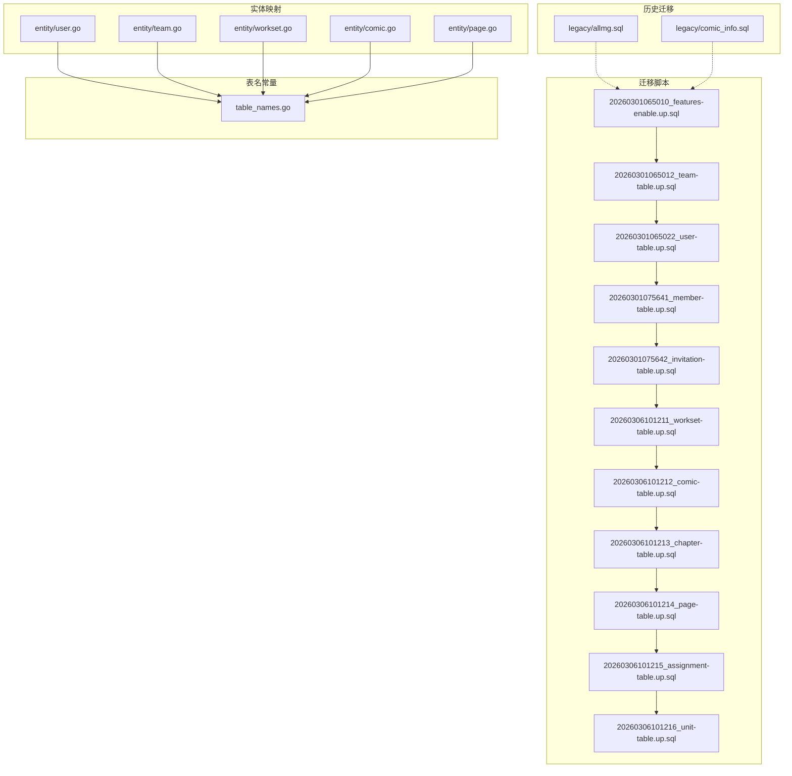
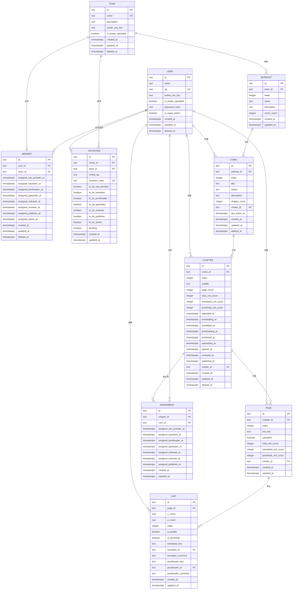
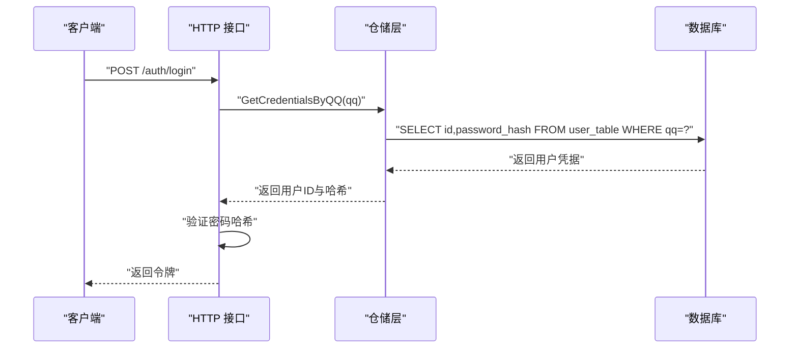
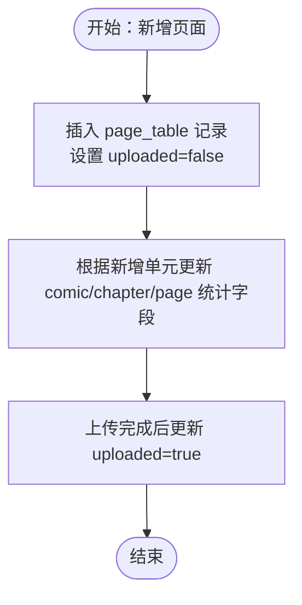
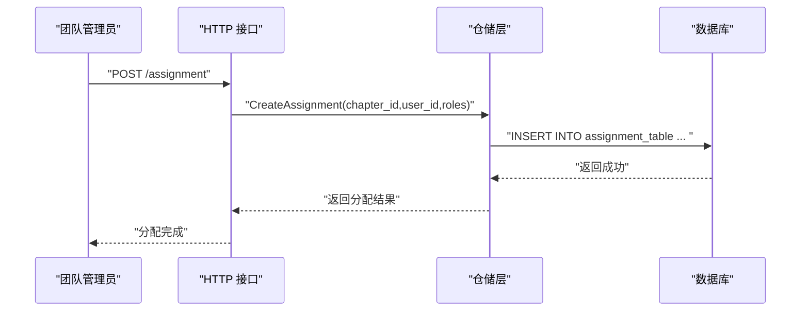
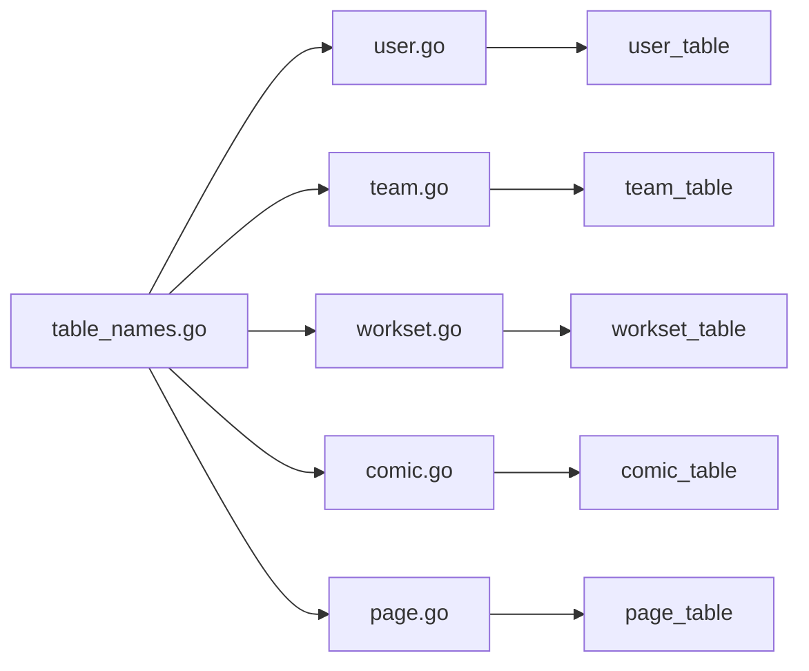

# 数据库设计

<cite>
**本文引用的文件**
- [20260301065010_features-enable.up.sql](file://migrations/20260301065010_features-enable.up.sql)
- [20260301065012_team-table.up.sql](file://migrations/20260301065012_team-table.up.sql)
- [20260301065022_user-table.up.sql](file://migrations/20260301065022_user-table.up.sql)
- [20260301075641_member-table.up.sql](file://migrations/20260301075641_member-table.up.sql)
- [20260301075642_invitation-table.up.sql](file://migrations/20260301075642_invitation-table.up.sql)
- [20260306101211_workset-table.up.sql](file://migrations/20260306101211_workset-table.up.sql)
- [20260306101212_comic-table.up.sql](file://migrations/20260306101212_comic-table.up.sql)
- [20260306101213_chapter-table.up.sql](file://migrations/20260306101213_chapter-table.up.sql)
- [20260306101214_page-table.up.sql](file://migrations/20260306101214_page-table.up.sql)
- [20260306101215_assignment-table.up.sql](file://migrations/20260306101215_assignment-table.up.sql)
- [20260306101216_unit-table.up.sql](file://migrations/20260306101216_unit-table.up.sql)
- [table_names.go](file://internal/infrastructure/repository/table_names.go)
- [user.go](file://internal/infrastructure/repository/entity/user.go)
- [team.go](file://internal/infrastructure/repository/entity/team.go)
- [workset.go](file://internal/infrastructure/repository/entity/workset.go)
- [comic.go](file://internal/infrastructure/repository/entity/comic.go)
- [page.go](file://internal/infrastructure/repository/entity/page.go)
- [allmg.sql](file://legacy/migrations/allmg.sql)
- [comic_info.sql](file://legacy/migrations/comic_info.sql)
</cite>

## 目录
1. [简介](#简介)
2. [项目结构](#项目结构)
3. [核心组件](#核心组件)
4. [架构总览](#架构总览)
5. [详细组件分析](#详细组件分析)
6. [依赖分析](#依赖分析)
7. [性能考虑](#性能考虑)
8. [故障排查指南](#故障排查指南)
9. [结论](#结论)
10. [附录](#附录)

## 简介
本文件面向 poprako-web-ms 的数据库设计与实现，系统性阐述表结构、索引策略、约束关系与数据完整性保障；给出实体模型与数据库表之间的映射关系；绘制数据库关系图与 ER 图；明确迁移管理策略、版本控制与回滚机制；提供查询优化、性能调优与备份恢复建议，并覆盖数据库安全与访问控制要点。

## 项目结构
数据库相关代码主要分布在以下位置：
- 迁移脚本：migrations 目录，按时间戳命名，分别创建扩展、基础表与索引。
- 实体映射：internal/infrastructure/repository/entity 下的各领域实体文件，定义 ORM 映射结构与列名。
- 表名常量：internal/infrastructure/repository/table_names.go，集中导出各表名常量，避免裸字符串。
- 历史迁移：legacy/migrations，包含历史遗留表定义，便于理解演进背景。

图表来源
- [20260301065010_features-enable.up.sql:1-2](file://migrations/20260301065010_features-enable.up.sql#L1-L2)
- [20260301065012_team-table.up.sql:1-16](file://migrations/20260301065012_team-table.up.sql#L1-L16)
- [20260301065022_user-table.up.sql:1-52](file://migrations/20260301065022_user-table.up.sql#L1-L52)
- [20260301075641_member-table.up.sql:1-63](file://migrations/20260301075641_member-table.up.sql#L1-L63)
- [20260301075642_invitation-table.up.sql:1-27](file://migrations/20260301075642_invitation-table.up.sql#L1-L27)
- [20260306101211_workset-table.up.sql:1-19](file://migrations/20260306101211_workset-table.up.sql#L1-L19)
- [20260306101212_comic-table.up.sql:1-37](file://migrations/20260306101212_comic-table.up.sql#L1-L37)
- [20260306101213_chapter-table.up.sql:1-38](file://migrations/20260306101213_chapter-table.up.sql#L1-L38)
- [20260306101214_page-table.up.sql:1-25](file://migrations/20260306101214_page-table.up.sql#L1-L25)
- [20260306101215_assignment-table.up.sql:1-26](file://migrations/20260306101215_assignment-table.up.sql#L1-L26)
- [20260306101216_unit-table.up.sql:1-30](file://migrations/20260306101216_unit-table.up.sql#L1-L30)
- [table_names.go:1-18](file://internal/infrastructure/repository/table_names.go#L1-L18)
- [user.go:1-58](file://internal/infrastructure/repository/entity/user.go#L1-L58)
- [team.go:1-47](file://internal/infrastructure/repository/entity/team.go#L1-L47)
- [workset.go:1-73](file://internal/infrastructure/repository/entity/workset.go#L1-L73)
- [comic.go:1-112](file://internal/infrastructure/repository/entity/comic.go#L1-L112)
- [page.go:1-187](file://internal/infrastructure/repository/entity/page.go#L1-L187)

章节来源
- [20260301065010_features-enable.up.sql:1-2](file://migrations/20260301065010_features-enable.up.sql#L1-L2)
- [table_names.go:1-18](file://internal/infrastructure/repository/table_names.go#L1-L18)

## 核心组件
本节概述数据库中核心表及其职责与关键字段语义，结合迁移脚本与实体映射文件进行说明。

- 用户表 user_table
  - 职责：存储用户基本信息、认证凭据与头像元数据；支持超级管理员标识。
  - 关键字段：主键 id、唯一 qq、密码哈希、头像 OSS 键、是否已上传头像、创建/更新时间、软删除标记 deleted_at。
  - 约束与索引：唯一索引 on qq；基于 trigram 的 GIN 索引 on name；时间倒序索引 on created_at/updated_at；软删除过滤。
  - 初始化：预插入一条超级管理员记录，密码以哈希形式存储。

- 团队表 team_table
  - 职责：组织单位信息，支持头像与描述。
  - 关键字段：主键 id、唯一 name、描述、头像 OSS 键、是否已上传头像、创建/更新/删除时间。
  - 约束与索引：唯一索引 on name（未删除）。

- 成员表 member_table
  - 职责：建立用户与团队的多对多关系，记录成员在不同角色上的任命时间线。
  - 关键字段：主键 id、外键 user_id、team_id；多角色任命时间戳字段；创建/更新/删除时间。
  - 约束与索引：外键 on user_id/team_id；多角色时间戳索引；软删除过滤。

- 邀请表 invitation_table
  - 职责：团队邀请流程，记录邀请发起人、目标团队、被邀请者 QQ、角色偏好与状态。
  - 关键字段：主键 id、invitor_id、team_id、invitee_qq、唯一 invitation_code、角色偏好布尔位、pending 状态、创建/更新时间。
  - 约束与索引：外键 on invitor_id/team_id；复合索引 on team_id+created_at（非待处理）。

- 工作集表 workset_table
  - 职责：团队内漫画集合的分组容器，支持排序索引 index。
  - 关键字段：主键 id、team_id、index、name/description、comic_count、创建/更新时间。
  - 约束与索引：外键 on team_id；唯一索引 on team_id+index。

- 漫画表 comic_table
  - 职责：具体漫画条目，归属工作集，记录作者、章节数、最近活跃时间等。
  - 关键字段：主键 id、workset_id、index/title/author/description、章节数、creator_id、last_active_at、创建/更新/删除时间。
  - 约束与索引：外键 on workset_id/creator_id；软删除过滤的唯一索引 on team_id+index；多维度索引 on team_id+created_at、creator_id、team_id+last_active_at。

- 章节表 chapter_table
  - 职责：漫画分章，记录页面数与各环节里程碑时间点。
  - 关键字段：主键 id、comic_id、index/subtitle、页面数与单元统计、各阶段时间戳、creator_id、创建/更新/删除时间。
  - 约束与索引：外键 on comic_id/creator_id；软删除过滤的唯一索引 on comic_id+index；索引 on comic_id。

- 页面表 page_table
  - 职责：章节内的页面，记录 OSS 存储键、上传状态与单元统计。
  - 关键字段：主键 id、chapter_id、index/oss_key/uploaded、单元统计、creator_id、创建/更新时间。
  - 约束与索引：外键 on chapter_id/creator_id；软删除过滤的唯一索引 on chapter_id+index；索引 on chapter_id。

- 任务分配表 assignment_table
  - 职责：记录用户在章节上的任务分配时间线（多角色）。
  - 关键字段：主键 id、chapter_id、user_id、多角色任命时间戳；创建/更新时间。
  - 约束与索引：外键 on chapter_id/user_id；唯一索引 on chapter_id+user_id；索引 on chapter_id/user_id。

- 单元表 unit_table
  - 职责：页面中的文本单元，支持翻译与校对状态、坐标与层级索引。
  - 关键字段：主键 id、page_id、坐标 x/y、index、是否气泡 in_bubble、是否已校对 is_proofread、翻译/校对文本与评论、译者/校对者 ID、创建/更新时间。
  - 约束与索引：外键 on page_id；软删除过滤的唯一索引 on page_id+index；索引 on page_id。

章节来源
- [20260301065022_user-table.up.sql:1-52](file://migrations/20260301065022_user-table.up.sql#L1-L52)
- [20260301065012_team-table.up.sql:1-16](file://migrations/20260301065012_team-table.up.sql#L1-L16)
- [20260301075641_member-table.up.sql:1-63](file://migrations/20260301075641_member-table.up.sql#L1-L63)
- [20260301075642_invitation-table.up.sql:1-27](file://migrations/20260301075642_invitation-table.up.sql#L1-L27)
- [20260306101211_workset-table.up.sql:1-19](file://migrations/20260306101211_workset-table.up.sql#L1-L19)
- [20260306101212_comic-table.up.sql:1-37](file://migrations/20260306101212_comic-table.up.sql#L1-L37)
- [20260306101213_chapter-table.up.sql:1-38](file://migrations/20260306101213_chapter-table.up.sql#L1-L38)
- [20260306101214_page-table.up.sql:1-25](file://migrations/20260306101214_page-table.up.sql#L1-L25)
- [20260306101215_assignment-table.up.sql:1-26](file://migrations/20260306101215_assignment-table.up.sql#L1-L26)
- [20260306101216_unit-table.up.sql:1-30](file://migrations/20260306101216_unit-table.up.sql#L1-L30)

## 架构总览
下图展示数据库层面的实体关系与外键约束，体现一对一、一对多与多对多关系：

图表来源
- [20260301065022_user-table.up.sql:1-52](file://migrations/20260301065022_user-table.up.sql#L1-L52)
- [20260301065012_team-table.up.sql:1-16](file://migrations/20260301065012_team-table.up.sql#L1-L16)
- [20260301075641_member-table.up.sql:1-63](file://migrations/20260301075641_member-table.up.sql#L1-L63)
- [20260301075642_invitation-table.up.sql:1-27](file://migrations/20260301075642_invitation-table.up.sql#L1-L27)
- [20260306101211_workset-table.up.sql:1-19](file://migrations/20260306101211_workset-table.up.sql#L1-L19)
- [20260306101212_comic-table.up.sql:1-37](file://migrations/20260306101212_comic-table.up.sql#L1-L37)
- [20260306101213_chapter-table.up.sql:1-38](file://migrations/20260306101213_chapter-table.up.sql#L1-L38)
- [20260306101214_page-table.up.sql:1-25](file://migrations/20260306101214_page-table.up.sql#L1-L25)
- [20260306101215_assignment-table.up.sql:1-26](file://migrations/20260306101215_assignment-table.up.sql#L1-L26)
- [20260306101216_unit-table.up.sql:1-30](file://migrations/20260306101216_unit-table.up.sql#L1-L30)

## 详细组件分析

### 用户与团队：认证与组织
- 用户表 user_table
  - 字段与类型：id 主键、name 文本、qq 唯一、avatar_oss_key、is_avatar_uploaded、password_hash、is_super_admin、时间戳与软删除。
  - 约束：唯一索引 on qq；软删除过滤索引 on name、created_at、updated_at。
  - 初始化：预置超级管理员账号，密码以哈希存储。
- 团队表 team_table
  - 字段与类型：id 主键、name 唯一、description、avatar_oss_key、is_avatar_uploaded、时间戳与软删除。
  - 约束：唯一索引 on name（未删除）。
- 成员表 member_table
  - 多角色任命时间戳字段，支持按角色追踪成员职责变更。
  - 约束：外键 on user_id/team_id；软删除过滤索引；多角色时间戳索引。
- 邀请表 invitation_table
  - 角色偏好布尔位与 pending 状态，配合团队与用户外键。
  - 约束：唯一索引 on invitation_code；软删除过滤索引 on team_id+created_at。

图表来源
- [20260301065022_user-table.up.sql:1-52](file://migrations/20260301065022_user-table.up.sql#L1-L52)
- [user.go:38-44](file://internal/infrastructure/repository/entity/user.go#L38-L44)

章节来源
- [20260301065022_user-table.up.sql:1-52](file://migrations/20260301065022_user-table.up.sql#L1-L52)
- [20260301065012_team-table.up.sql:1-16](file://migrations/20260301065012_team-table.up.sql#L1-L16)
- [20260301075641_member-table.up.sql:1-63](file://migrations/20260301075641_member-table.up.sql#L1-L63)
- [20260301075642_invitation-table.up.sql:1-27](file://migrations/20260301075642_invitation-table.up.sql#L1-L27)
- [user.go:1-58](file://internal/infrastructure/repository/entity/user.go#L1-L58)
- [team.go:1-47](file://internal/infrastructure/repository/entity/team.go#L1-L47)

### 漫画内容管线：工作集—漫画—章节—页面—单元
- 工作集 workset_table：按 team_id 分组，index 唯一。
- 漫画 comic_table：归属 workset，记录作者、章节数与最近活跃时间。
- 章节 chapter_table：记录页面数与各阶段里程碑时间。
- 页面 page_table：记录 OSS 键与上传状态、单元统计。
- 单元 unit_table：页面中的文本单元，支持翻译与校对状态。

图表来源
- [20260306101214_page-table.up.sql:1-25](file://migrations/20260306101214_page-table.up.sql#L1-L25)
- [20260306101213_chapter-table.up.sql:1-38](file://migrations/20260306101213_chapter-table.up.sql#L1-L38)
- [20260306101212_comic-table.up.sql:1-37](file://migrations/20260306101212_comic-table.up.sql#L1-L37)
- [20260306101216_unit-table.up.sql:1-30](file://migrations/20260306101216_unit-table.up.sql#L1-L30)

章节来源
- [20260306101211_workset-table.up.sql:1-19](file://migrations/20260306101211_workset-table.up.sql#L1-L19)
- [20260306101212_comic-table.up.sql:1-37](file://migrations/20260306101212_comic-table.up.sql#L1-L37)
- [20260306101213_chapter-table.up.sql:1-38](file://migrations/20260306101213_chapter-table.up.sql#L1-L38)
- [20260306101214_page-table.up.sql:1-25](file://migrations/20260306101214_page-table.up.sql#L1-L25)
- [20260306101216_unit-table.up.sql:1-30](file://migrations/20260306101216_unit-table.up.sql#L1-L30)
- [workset.go:1-73](file://internal/infrastructure/repository/entity/workset.go#L1-L73)
- [comic.go:1-112](file://internal/infrastructure/repository/entity/comic.go#L1-L112)
- [page.go:1-187](file://internal/infrastructure/repository/entity/page.go#L1-L187)

### 任务分配与协作
- 任务分配表 assignment_table：记录用户在章节上的多角色任命时间线，唯一约束确保每人每章仅一次分配。
- 单元表 unit_table：支持译者与校对者的评论与状态，外键允许在用户删除时将关联字段置空，避免破坏数据链路。

图表来源
- [20260306101215_assignment-table.up.sql:1-26](file://migrations/20260306101215_assignment-table.up.sql#L1-L26)
- [20260306101216_unit-table.up.sql:1-30](file://migrations/20260306101216_unit-table.up.sql#L1-L30)

章节来源
- [20260306101215_assignment-table.up.sql:1-26](file://migrations/20260306101215_assignment-table.up.sql#L1-L26)
- [20260306101216_unit-table.up.sql:1-30](file://migrations/20260306101216_unit-table.up.sql#L1-L30)

## 依赖分析
- 表名常量集中管理：通过 table_names.go 导出各表名常量，避免应用层直接使用裸字符串，提升一致性与可维护性。
- 实体映射与表结构对应：实体文件定义了 ORM 映射结构，列名与迁移脚本保持一致，确保读写路径正确。
- 外键与级联策略：
  - 成员、邀请、漫画、章节、页面、任务分配、单元均使用外键约束，部分采用 CASCADE 删除以维护引用完整性。
  - 创建者字段使用 RESTRICT 删除，防止误删创作者导致数据悬挂。
- 历史迁移：legacy 目录包含历史表定义，便于理解演进与兼容性需求。

图表来源
- [table_names.go:1-18](file://internal/infrastructure/repository/table_names.go#L1-L18)
- [user.go:1-58](file://internal/infrastructure/repository/entity/user.go#L1-L58)
- [team.go:1-47](file://internal/infrastructure/repository/entity/team.go#L1-L47)
- [workset.go:1-73](file://internal/infrastructure/repository/entity/workset.go#L1-L73)
- [comic.go:1-112](file://internal/infrastructure/repository/entity/comic.go#L1-L112)
- [page.go:1-187](file://internal/infrastructure/repository/entity/page.go#L1-L187)

章节来源
- [table_names.go:1-18](file://internal/infrastructure/repository/table_names.go#L1-L18)

## 性能考虑
- 索引策略
  - 全文检索：对用户 name 使用 trigram GIN 索引，支持模糊搜索。
  - 时间序列：对 created_at/updated_at 建立时间倒序索引，满足“最新优先”类查询。
  - 软删除过滤：所有索引均包含 WHERE deleted_at IS NULL，避免扫描逻辑删除数据。
  - 复合索引：团队维度的组合索引（如 team_id+created_at）提升分页与筛选效率。
- 查询优化建议
  - 使用 IncludeXXX 查询选项进行条件性 JOIN，减少不必要的连接开销。
  - 对高频过滤字段（team_id、comic_id、chapter_id）建立覆盖索引，避免回表。
  - 合理利用唯一索引（如 team_id+index、invitation_code）降低重复查询成本。
- 性能调优
  - 定期统计信息更新与索引维护，关注执行计划中的索引选择与扫描范围。
  - 对大表进行分区或归档策略（基于时间维度），降低热数据压力。
- 备份与恢复
  - 建议采用逻辑备份（如 pg_dump）与物理备份相结合的方式，定期校验恢复流程。
  - 针对高价值表（用户、团队、漫画）增加备份频率与保留周期。
  - 在迁移前先做备份，迁移后验证数据一致性与索引完整性。

## 故障排查指南
- 常见问题定位
  - 外键冲突：检查引用字段是否有效、是否已被软删除过滤。
  - 唯一约束冲突：确认唯一索引组合（如 team_id+index、invitation_code）是否被占用。
  - 索引失效：核对查询谓词是否命中索引，必要时调整查询或补充索引。
- 日志与监控
  - 记录慢查询日志，识别热点 SQL 并针对性优化。
  - 监控索引使用率与缓存命中率，及时发现异常波动。
- 回滚与修复
  - 迁移回滚：按时间戳逆序执行 down 脚本，逐个撤销变更。
  - 数据修复：通过备份恢复到最近一次健康状态，再重新应用已验证的 up 脚本。

## 结论
本数据库设计围绕“团队—工作集—漫画—章节—页面—单元”的内容生产与协作流程构建，通过清晰的表结构、完善的索引策略与外键约束，保障数据完整性与查询效率。迁移脚本采用时间戳命名，配合实体映射与表名常量，形成从底层到应用层的强一致性。建议持续优化索引与查询计划，完善备份与回滚机制，确保系统在高并发场景下的稳定性与可维护性。

## 附录
- 历史迁移参考
  - legacy/allmg.sql：历史同步表定义，可用于理解早期数据结构与字段含义。
  - legacy/comic_info.sql：漫画信息表定义，辅助理解漫画元数据的历史演进。

章节来源
- [allmg.sql:1-16](file://legacy/migrations/allmg.sql#L1-L16)
- [comic_info.sql:1-16](file://legacy/migrations/comic_info.sql#L1-L16)