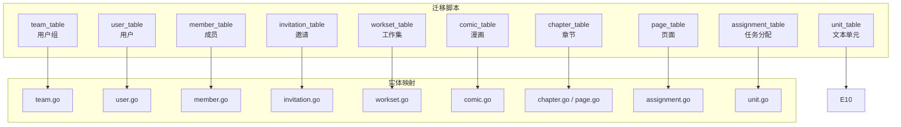
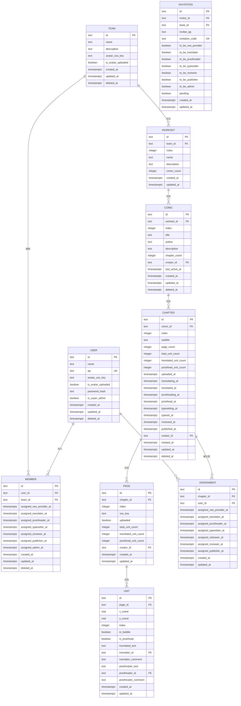
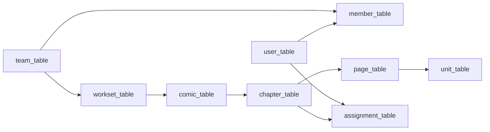

# 数据库设计

<cite>
**本文引用的文件**
- [20260306101212_comic-table.up.sql](file://migrations/20260306101212_comic-table.up.sql)
- [20260306101213_chapter-table.up.sql](file://migrations/20260306101213_chapter-table.up.sql)
- [20260306101214_page-table.up.sql](file://migrations/20260306101214_page-table.up.sql)
- [20260306101215_assignment-table.up.sql](file://migrations/20260306101215_assignment-table.up.sql)
- [20260306101216_unit-table.up.sql](file://migrations/20260306101216_unit-table.up.sql)
- [20260301065012_team-table.up.sql](file://migrations/20260301065012_team-table.up.sql)
- [20260301065022_user-table.up.sql](file://migrations/20260301065022_user-table.up.sql)
- [20260301075641_member-table.up.sql](file://migrations/20260301075641_member-table.up.sql)
- [20260301075642_invitation-table.up.sql](file://migrations/20260301075642_invitation-table.up.sql)
- [20260306101211_workset-table.up.sql](file://migrations/20260306101211_workset-table.up.sql)
- [comic.go](file://internal/infrastructure/repository/entity/comic.go)
- [page.go](file://internal/infrastructure/repository/entity/page.go)
- [unit.go](file://internal/infrastructure/repository/entity/unit.go)
- [team.go](file://internal/infrastructure/repository/entity/team.go)
- [user.go](file://internal/infrastructure/repository/entity/user.go)
- [member.go](file://internal/infrastructure/repository/entity/member.go)
- [assignment.go](file://internal/infrastructure/repository/entity/assignment.go)
- [workset.go](file://internal/infrastructure/repository/entity/workset.go)
</cite>

## 目录
1. [简介](#简介)
2. [项目结构](#项目结构)
3. [核心组件](#核心组件)
4. [架构总览](#架构总览)
5. [详细组件分析](#详细组件分析)
6. [依赖分析](#依赖分析)
7. [性能考虑](#性能考虑)
8. [故障排查指南](#故障排查指南)
9. [结论](#结论)
10. [附录](#附录)

## 简介
本文件面向“漫画翻译协作平台”的数据库设计，系统性梳理数据库架构、表结构、字段定义与约束、表间关系、索引与查询优化策略，并结合迁移脚本与实体映射文件，给出从领域模型到数据库表的完整映射过程，以及仓储模式的实现要点与最佳实践。

## 项目结构
数据库相关的核心内容分布在以下位置：
- 迁移脚本：位于 migrations 目录，按时间戳顺序定义了各表的建表与索引。
- 实体映射：位于 internal/infrastructure/repository/entity，定义了与数据库表一一对应的 Go 结构体，用于 ORM 映射与查询结果组装。

图表来源
- [20260306101212_comic-table.up.sql:1-37](file://migrations/20260306101212_comic-table.up.sql#L1-L37)
- [20260306101213_chapter-table.up.sql:1-38](file://migrations/20260306101213_chapter-table.up.sql#L1-L38)
- [20260306101214_page-table.up.sql:1-25](file://migrations/20260306101214_page-table.up.sql#L1-L25)
- [20260306101215_assignment-table.up.sql:1-26](file://migrations/20260306101215_assignment-table.up.sql#L1-L26)
- [20260306101216_unit-table.up.sql:1-30](file://migrations/20260306101216_unit-table.up.sql#L1-L30)
- [20260301065012_team-table.up.sql:1-16](file://migrations/20260301065012_team-table.up.sql#L1-L16)
- [20260301065022_user-table.up.sql:1-52](file://migrations/20260301065022_user-table.up.sql#L1-L52)
- [20260301075641_member-table.up.sql:1-63](file://migrations/20260301075641_member-table.up.sql#L1-L63)
- [20260301075642_invitation-table.up.sql:1-27](file://migrations/20260301075642_invitation-table.up.sql#L1-L27)
- [20260306101211_workset-table.up.sql:1-19](file://migrations/20260306101211_workset-table.up.sql#L1-L19)
- [team.go:1-47](file://internal/infrastructure/repository/entity/team.go#L1-L47)
- [user.go:1-58](file://internal/infrastructure/repository/entity/user.go#L1-L58)
- [member.go:1-143](file://internal/infrastructure/repository/entity/member.go#L1-L143)
- [invitation.go](file://internal/infrastructure/repository/entity/invitation.go)
- [workset.go:1-73](file://internal/infrastructure/repository/entity/workset.go#L1-L73)
- [comic.go:1-112](file://internal/infrastructure/repository/entity/comic.go#L1-L112)
- [page.go:1-187](file://internal/infrastructure/repository/entity/page.go#L1-L187)
- [unit.go:1-83](file://internal/infrastructure/repository/entity/unit.go#L1-L83)
- [assignment.go:1-191](file://internal/infrastructure/repository/entity/assignment.go#L1-L191)

章节来源
- [20260306101212_comic-table.up.sql:1-37](file://migrations/20260306101212_comic-table.up.sql#L1-L37)
- [20260306101213_chapter-table.up.sql:1-38](file://migrations/20260306101213_chapter-table.up.sql#L1-L38)
- [20260306101214_page-table.up.sql:1-25](file://migrations/20260306101214_page-table.up.sql#L1-L25)
- [20260306101215_assignment-table.up.sql:1-26](file://migrations/20260306101215_assignment-table.up.sql#L1-L26)
- [20260306101216_unit-table.up.sql:1-30](file://migrations/20260306101216_unit-table.up.sql#L1-L30)
- [20260301065012_team-table.up.sql:1-16](file://migrations/20260301065012_team-table.up.sql#L1-L16)
- [20260301065022_user-table.up.sql:1-52](file://migrations/20260301065022_user-table.up.sql#L1-L52)
- [20260301075641_member-table.up.sql:1-63](file://migrations/20260301075641_member-table.up.sql#L1-L63)
- [20260301075642_invitation-table.up.sql:1-27](file://migrations/20260301075642_invitation-table.up.sql#L1-L27)
- [20260306101211_workset-table.up.sql:1-19](file://migrations/20260306101211_workset-table.up.sql#L1-L19)

## 核心组件
本节概述各核心数据表及其职责边界：
- 用户与组织
  - team_table：团队/用户组信息。
  - user_table：用户基本信息与认证凭据。
  - member_table：用户在团队中的成员档案与角色分配时间戳。
  - invitation_table：邀请码与目标角色标记。
- 工作集与漫画
  - workset_table：团队内的漫画集合分组。
  - comic_table：具体漫画条目，关联工作集与创建者。
- 章节与页面
  - chapter_table：漫画章节，记录各阶段时间戳与统计计数。
  - page_table：章节内页面，记录上传状态与单元统计。
- 文本单元与任务
  - unit_table：页面内的文本单元，支持译文与校对文本及批注。
  - assignment_table：用户与章节的任务分配记录。

章节来源
- [20260301065012_team-table.up.sql:1-16](file://migrations/20260301065012_team-table.up.sql#L1-L16)
- [20260301065022_user-table.up.sql:1-52](file://migrations/20260301065022_user-table.up.sql#L1-L52)
- [20260301075641_member-table.up.sql:1-63](file://migrations/20260301075641_member-table.up.sql#L1-L63)
- [20260301075642_invitation-table.up.sql:1-27](file://migrations/20260301075642_invitation-table.up.sql#L1-L27)
- [20260306101211_workset-table.up.sql:1-19](file://migrations/20260306101211_workset-table.up.sql#L1-L19)
- [20260306101212_comic-table.up.sql:1-37](file://migrations/20260306101212_comic-table.up.sql#L1-L37)
- [20260306101213_chapter-table.up.sql:1-38](file://migrations/20260306101213_chapter-table.up.sql#L1-L38)
- [20260306101214_page-table.up.sql:1-25](file://migrations/20260306101214_page-table.up.sql#L1-L25)
- [20260306101216_unit-table.up.sql:1-30](file://migrations/20260306101216_unit-table.up.sql#L1-L30)
- [20260306101215_assignment-table.up.sql:1-26](file://migrations/20260306101215_assignment-table.up.sql#L1-L26)

## 架构总览
下图展示了从领域模型到数据库表的映射关系与层级结构：

图表来源
- [20260301065012_team-table.up.sql:1-16](file://migrations/20260301065012_team-table.up.sql#L1-L16)
- [20260301065022_user-table.up.sql:1-52](file://migrations/20260301065022_user-table.up.sql#L1-L52)
- [20260301075641_member-table.up.sql:1-63](file://migrations/20260301075641_member-table.up.sql#L1-L63)
- [20260301075642_invitation-table.up.sql:1-27](file://migrations/20260301075642_invitation-table.up.sql#L1-L27)
- [20260306101211_workset-table.up.sql:1-19](file://migrations/20260306101211_workset-table.up.sql#L1-L19)
- [20260306101212_comic-table.up.sql:1-37](file://migrations/20260306101212_comic-table.up.sql#L1-L37)
- [20260306101213_chapter-table.up.sql:1-38](file://migrations/20260306101213_chapter-table.up.sql#L1-L38)
- [20260306101214_page-table.up.sql:1-25](file://migrations/20260306101214_page-table.up.sql#L1-L25)
- [20260306101215_assignment-table.up.sql:1-26](file://migrations/20260306101215_assignment-table.up.sql#L1-L26)
- [20260306101216_unit-table.up.sql:1-30](file://migrations/20260306101216_unit-table.up.sql#L1-L30)

## 详细组件分析

### 团队与用户层
- team_table
  - 主键：id
  - 唯一索引：name（未删除）
  - 字段要点：头像 OSS 键、是否已上传头像、软删 deleted_at
- user_table
  - 主键：id；唯一约束：qq
  - 索引：名称模糊匹配 GIN 索引、qq、创建/更新时间倒序索引
  - 字段要点：密码哈希、是否超管、软删 deleted_at
  - 初始化：内置超级管理员账号（迁移脚本中预插入）
- member_table
  - 复合主键：id；外键 user_id、team_id 引用 CASCADE 删除
  - 索引：user_id、team_id；多角色分配时间戳的条件索引
- invitation_table
  - 主键：id；唯一约束：invitation_code
  - 字段要点：邀请发起人、目标团队、被邀请人 QQ、角色标记、待处理状态、时间戳

章节来源
- [20260301065012_team-table.up.sql:1-16](file://migrations/20260301065012_team-table.up.sql#L1-L16)
- [20260301065022_user-table.up.sql:1-52](file://migrations/20260301065022_user-table.up.sql#L1-L52)
- [20260301075641_member-table.up.sql:1-63](file://migrations/20260301075641_member-table.up.sql#L1-L63)
- [20260301075642_invitation-table.up.sql:1-27](file://migrations/20260301075642_invitation-table.up.sql#L1-L27)

### 工作集与漫画层
- workset_table
  - 主键：id；外键 team_id 引用 CASCADE 删除
  - 唯一索引：(team_id, index)
  - 字段要点：索引、名称、描述、漫画数量统计、时间戳
- comic_table
  - 主键：id；外键 workset_id 引用 CASCADE 删除；外键 creator_id 引用 RESTRICT 删除
  - 唯一索引：(team_id, index)（未删除）；复合索引：team_id+created_at DESC、creator_id、team_id+last_active_at DESC
  - 字段要点：作者、描述、章节计数、最后活跃时间、软删 deleted_at

章节来源
- [20260306101211_workset-table.up.sql:1-19](file://migrations/20260306101211_workset-table.up.sql#L1-L19)
- [20260306101212_comic-table.up.sql:1-37](file://migrations/20260306101212_comic-table.up.sql#L1-L37)

### 章节与页面层
- chapter_table
  - 主键：id；外键 comic_id 引用 CASCADE 删除；外键 creator_id 引用 RESTRICT 删除
  - 唯一索引：(comic_id, index)（未删除）
  - 字段要点：章节标题、页面计数、单元统计、多阶段时间戳（上传、翻译、校对、排版、审核、发布等）、软删 deleted_at
- page_table
  - 主键：id；外键 chapter_id 引用 CASCADE 删除；外键 creator_id 引用 RESTRICT 删除
  - 唯一索引：(chapter_id, index)
  - 字段要点：OSS 键、上传标志、单元统计

章节来源
- [20260306101213_chapter-table.up.sql:1-38](file://migrations/20260306101213_chapter-table.up.sql#L1-L38)
- [20260306101214_page-table.up.sql:1-25](file://migrations/20260306101214_page-table.up.sql#L1-L25)

### 文本单元与任务层
- unit_table
  - 主键：id；外键 page_id 引用 CASCADE 删除；外键 translator_id/proofreader_id 引用 SET NULL 删除
  - 唯一索引：(page_id, index)
  - 字段要点：坐标、气泡标识、译文/校对文本与批注、是否已校对、时间戳
- assignment_table
  - 主键：id；外键 chapter_id、user_id 引用 CASCADE 删除
  - 唯一索引：(chapter_id, user_id)
  - 字段要点：多角色分配时间戳、创建/更新时间戳

章节来源
- [20260306101216_unit-table.up.sql:1-30](file://migrations/20260306101216_unit-table.up.sql#L1-L30)
- [20260306101215_assignment-table.up.sql:1-26](file://migrations/20260306101215_assignment-table.up.sql#L1-L26)

### 从领域模型到数据库表的映射
- team.go：TeamInfoRow/TeamInsertRow 映射 team_table。
- user.go：UserInfoRow/UserCredentialsRow/UserInsertRow 映射 user_table。
- member.go：MemberProfileRow/MemberWithUserRow/MemberWithTeamRow/MemberProfileIncludeRow 映射 member_table 并支持 JOIN 用户与团队信息。
- workset.go：WorksetInfoRow/WorksetInsertRow 映射 workset_table。
- comic.go：ComicInfoRow/ComicInsertRow 映射 comic_table，并支持 IncludeWorksetInfo()/IncludeCreatorInfo() 的 JOIN。
- page.go：ChapterInfoRow/ChapterInsertRow/PageInfoRow/PageInsertRow 映射 chapter_table 与 page_table，并支持 IncludeCreatorInfo() 的 JOIN。
- assignment.go：AssignmentInfoRow/AssignmentIncludeRow 映射 assignment_table，并支持 IncludeUserInfo()/IncludeChapterInfo() 的多表 JOIN。
- unit.go：UnitInfoRow/UnitInsertRow 映射 unit_table。

章节来源
- [team.go:1-47](file://internal/infrastructure/repository/entity/team.go#L1-L47)
- [user.go:1-58](file://internal/infrastructure/repository/entity/user.go#L1-L58)
- [member.go:1-143](file://internal/infrastructure/repository/entity/member.go#L1-L143)
- [workset.go:1-73](file://internal/infrastructure/repository/entity/workset.go#L1-L73)
- [comic.go:1-112](file://internal/infrastructure/repository/entity/comic.go#L1-L112)
- [page.go:1-187](file://internal/infrastructure/repository/entity/page.go#L1-L187)
- [assignment.go:1-191](file://internal/infrastructure/repository/entity/assignment.go#L1-L191)
- [unit.go:1-83](file://internal/infrastructure/repository/entity/unit.go#L1-L83)

### 查询选项与仓储模式实现要点
- 查询选项（Query Option）通过在实体行上添加别名列（如 user_*、team_*、chapter_*、comic_*）实现，以支持按需 JOIN，避免 N+1 问题并减少不必要的全表连接。
- 聚合行类型（如 AssignmentIncludeRow、MemberProfileIncludeRow、ChapterWithInfoRow）用于一次性承载多表数据，便于组装领域模型对象。
- 时间戳字段广泛使用 timestamptz，默认值 NOW()，配合倒序索引满足“最新优先”类查询。
- 软删除 deleted_at 字段配合 WHERE 条件索引，确保查询只返回未删除记录。

章节来源
- [page.go:14-187](file://internal/infrastructure/repository/entity/page.go#L14-L187)
- [assignment.go:65-191](file://internal/infrastructure/repository/entity/assignment.go#L65-L191)
- [member.go:49-143](file://internal/infrastructure/repository/entity/member.go#L49-L143)
- [comic.go:11-112](file://internal/infrastructure/repository/entity/comic.go#L11-L112)

## 依赖分析
- 外键与级联策略
  - 组织与成员：team → member（CASCADE），user → member（CASCADE）
  - 工作集与漫画：team → workset（CASCADE），workset → comic（CASCADE）
  - 漫画与章节：comic → chapter（CASCADE）
  - 章节与页面：chapter → page（CASCADE）
  - 页面与单元：page → unit（CASCADE）
  - 用户与各业务表：user → member/assignment/creator（RESTRICT 或 CASCADE 视场景）
- 级联删除与限制
  - 删除团队或用户会级联删除其成员与分配记录，但漫画与章节的删除不会影响用户记录，而是通过 RESTRICT 保护关键引用。
- 索引与查询路径
  - 通过复合索引与条件索引覆盖高频查询（如按团队/时间/创建者/邀请状态等），减少全表扫描。

图表来源
- [20260301065012_team-table.up.sql:1-16](file://migrations/20260301065012_team-table.up.sql#L1-L16)
- [20260301065022_user-table.up.sql:1-52](file://migrations/20260301065022_user-table.up.sql#L1-L52)
- [20260301075641_member-table.up.sql:1-63](file://migrations/20260301075641_member-table.up.sql#L1-L63)
- [20260306101211_workset-table.up.sql:1-19](file://migrations/20260306101211_workset-table.up.sql#L1-L19)
- [20260306101212_comic-table.up.sql:1-37](file://migrations/20260306101212_comic-table.up.sql#L1-L37)
- [20260306101213_chapter-table.up.sql:1-38](file://migrations/20260306101213_chapter-table.up.sql#L1-L38)
- [20260306101214_page-table.up.sql:1-25](file://migrations/20260306101214_page-table.up.sql#L1-L25)
- [20260306101215_assignment-table.up.sql:1-26](file://migrations/20260306101215_assignment-table.up.sql#L1-L26)
- [20260306101216_unit-table.up.sql:1-30](file://migrations/20260306101216_unit-table.up.sql#L1-L30)

## 性能考虑
- 索引设计原则
  - 复合唯一索引：(team_id, index) 用于去重与快速定位；(chapter_id, index) 用于页面有序访问。
  - 复合普通索引：team_id+created_at DESC、team_id+last_active_at DESC、creator_id 等，满足“按团队/时间/创建者”排序与过滤。
  - 条件索引：针对 member 的多角色分配时间戳与 invitation 的待处理状态进行过滤索引，提升筛选效率。
  - 文本搜索：用户名称使用 GIN trigram 索引，支持模糊匹配。
- 查询优化策略
  - 使用 Include* 查询选项按需 JOIN，避免不必要的全连接。
  - 利用默认 NOW() 与 timestamptz 减少应用侧时间计算开销。
  - 软删除统一通过 WHERE deleted_at IS NULL 过滤，配合索引保持高效。
- 存储与传输
  - 图片/资源通过 OSSKey 存储，数据库仅保留键值，降低存储与网络负载。
- 并发与一致性
  - 使用唯一索引防止重复提交（如 (team_id,index)、(chapter_id,index)、(chapter_id,user_id)）。
  - 通过 RESTRICT 保护关键引用，避免误删导致数据不一致。

章节来源
- [20260306101212_comic-table.up.sql:22-37](file://migrations/20260306101212_comic-table.up.sql#L22-L37)
- [20260306101213_chapter-table.up.sql:31-38](file://migrations/20260306101213_chapter-table.up.sql#L31-L38)
- [20260306101214_page-table.up.sql:20-25](file://migrations/20260306101214_page-table.up.sql#L20-L25)
- [20260306101215_assignment-table.up.sql:18-26](file://migrations/20260306101215_assignment-table.up.sql#L18-L26)
- [20260301065022_user-table.up.sql:19-34](file://migrations/20260301065022_user-table.up.sql#L19-L34)

## 故障排查指南
- 常见错误与定位
  - 外键约束失败：检查引用 ID 是否存在且未被软删除；确认 CASCADE/RESTRICT 策略是否符合预期。
  - 唯一冲突：检查 (team_id,index)、(chapter_id,index)、(chapter_id,user_id) 等唯一索引是否重复。
  - 查询性能差：确认是否命中索引；避免在 WHERE 中对索引列进行函数运算；优先使用复合索引前缀。
  - 软删除导致查无数据：确认查询是否包含 WHERE deleted_at IS NULL 条件。
- 事务与并发
  - 对于批量写入（如 CreateBatch），建议使用事务包裹，确保原子性。
  - 对高并发写入场景，优先使用唯一索引与幂等写法，避免重复数据。
- 初始化与回滚
  - 迁移脚本按时间戳顺序执行；若需回滚，可参考 down.sql 文件（如存在）逐个逆向执行。
  - 若迁移脚本缺失 down 文件，可通过备份数据库或导出结构/数据的方式进行恢复。

章节来源
- [20260306101212_comic-table.up.sql:1-37](file://migrations/20260306101212_comic-table.up.sql#L1-L37)
- [20260306101213_chapter-table.up.sql:1-38](file://migrations/20260306101213_chapter-table.up.sql#L1-L38)
- [20260306101214_page-table.up.sql:1-25](file://migrations/20260306101214_page-table.up.sql#L1-L25)
- [20260306101215_assignment-table.up.sql:1-26](file://migrations/20260306101215_assignment-table.up.sql#L1-L26)
- [20260306101216_unit-table.up.sql:1-30](file://migrations/20260306101216_unit-table.up.sql#L1-L30)
- [20260301065012_team-table.up.sql:1-16](file://migrations/20260301065012_team-table.up.sql#L1-L16)
- [20260301065022_user-table.up.sql:1-52](file://migrations/20260301065022_user-table.up.sql#L1-L52)
- [20260301075641_member-table.up.sql:1-63](file://migrations/20260301075641_member-table.up.sql#L1-L63)
- [20260301075642_invitation-table.up.sql:1-27](file://migrations/20260301075642_invitation-table.up.sql#L1-L27)
- [20260306101211_workset-table.up.sql:1-19](file://migrations/20260306101211_workset-table.up.sql#L1-L19)

## 结论
该数据库设计围绕“团队—工作集—漫画—章节—页面—单元”的层级结构展开，通过明确的外键关系与合理的索引策略，支撑了漫画翻译协作平台的核心业务流程。迁移脚本与实体映射文件共同实现了从领域模型到数据库表的稳定映射，配合查询选项与仓储模式，既保证了数据完整性与一致性，也兼顾了查询性能与可维护性。

## 附录
- 数据完整性与并发控制最佳实践
  - 使用唯一索引防止重复；使用软删除与条件索引统一过滤。
  - 对关键引用使用 RESTRICT 保护，对父子关系使用 CASCADE 清理。
  - 批量写入使用事务；高并发场景采用幂等写法与唯一索引。
- 事务处理建议
  - 将涉及多表更新的操作放入单个事务，失败即回滚。
  - 对长事务尽量缩短持有锁的时间，必要时拆分为多个小事务。
- 迁移与版本控制
  - 迁移脚本按时间戳命名，确保可重复执行与顺序执行。
  - 建议为每个 up/down 脚本配套注释说明变更目的与回滚步骤。