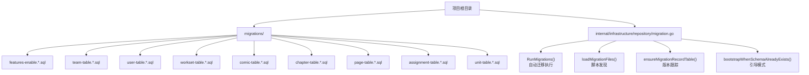
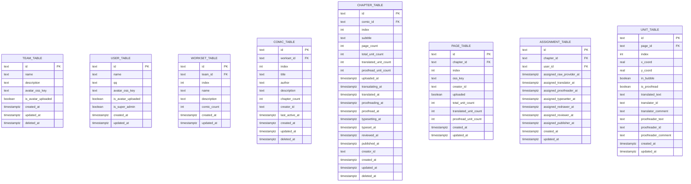
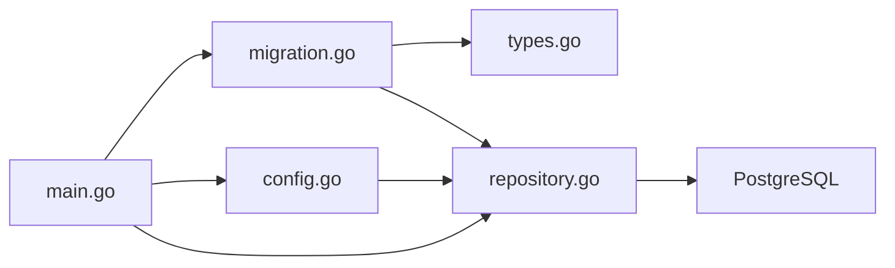

# 数据库迁移管理

<cite>
**本文引用的文件**
- [migration.go](file://internal/infrastructure/repository/migration.go)
- [main.go](file://main.go)
- [config.go](file://internal/config/config.go)
- [repository.go](file://internal/infrastructure/repository/repository.go)
- [types.go](file://internal/domain/repository/types.go)
- [20260301065010_features-enable.up.sql](file://migrations/20260301065010_features-enable.up.sql)
- [20260301065012_team-table.up.sql](file://migrations/20260301065012_team-table.up.sql)
- [20260306101211_workset-table.up.sql](file://migrations/20260306101211_workset-table.up.sql)
- [app_config.json](file://app_config.json)
- [team.go](file://internal/infrastructure/repository/entity/team.go)
- [user.go](file://internal/infrastructure/repository/entity/user.go)
- [workset.go](file://internal/infrastructure/repository/entity/workset.go)
- [justfile](file://justfile)
</cite>

## 更新摘要
**所做更改**
- 新增完整的 Go 语言数据库迁移系统实现章节
- 更新核心组件部分以反映新的迁移执行机制
- 新增自动迁移执行流程和版本跟踪机制
- 更新架构总览以包含新的迁移系统
- 新增迁移系统配置和环境控制章节
- 更新故障排查指南以包含新的迁移系统

## 目录
1. [引言](#引言)
2. [项目结构](#项目结构)
3. [核心组件](#核心组件)
4. [架构总览](#架构总览)
5. [详细组件分析](#详细组件分析)
6. [依赖分析](#依赖分析)
7. [性能考虑](#性能考虑)
8. [故障排查指南](#故障排查指南)
9. [结论](#结论)
10. [附录](#附录)

## 引言
本文件面向 poprako-web-ms 项目的数据库迁移管理，系统性阐述基于 Go 语言的全新迁移系统实现，包括版本控制策略、命名规范与组织结构、迁移脚本编写原则与最佳实践，并提供执行、回滚与版本对比的操作指南。同时覆盖开发、测试、生产三类环境的迁移策略，给出数据备份与恢复建议，以及常见问题的排查与解决路径。

## 项目结构
该项目采用基于 Go 语言的全新迁移系统，迁移脚本位于 migrations 目录，按时间戳前缀分组，每个逻辑变更包含 up/down 两部分。系统通过自动脚本发现、版本跟踪和事务执行实现完整的数据库演进管理。

- 迁移文件组织
  - 目录：migrations/
  - 命名：时间戳_描述.up.sql / 时间戳_描述.down.sql
  - 示例：20260301065010_features-enable.up.sql
- 迁移系统核心
  - 自动脚本发现：通过文件系统扫描 *.up.sql 文件
  - 版本跟踪：使用 app_migration_record_table 记录已执行版本
  - 事务执行：每个迁移脚本在独立事务中执行



**图表来源**
- [migration.go:22-89](file://internal/infrastructure/repository/migration.go#L22-L89)
- [20260301065010_features-enable.up.sql:1-2](file://migrations/20260301065010_features-enable.up.sql#L1-L2)
- [20260301065012_team-table.up.sql:1-16](file://migrations/20260301065012_team-table.up.sql#L1-L16)

**章节来源**
- [migration.go:101-128](file://internal/infrastructure/repository/migration.go#L101-L128)
- [20260301065010_features-enable.up.sql:1-2](file://migrations/20260301065010_features-enable.up.sql#L1-L2)
- [20260301065012_team-table.up.sql:1-16](file://migrations/20260301065012_team-table.up.sql#L1-L16)

## 核心组件
- **Go 语言迁移系统**
  - 完全基于 Go 语言实现的迁移引擎，替代原有的 sqlx 工具链
  - 自动脚本发现：扫描 migrations 目录下的 *.up.sql 文件
  - 版本跟踪：通过 app_migration_record_table 表记录已执行版本
  - 事务执行：每个迁移脚本在独立事务中执行，确保原子性
- **配置与环境控制**
  - 通过 AUTO_RUN_MIGRATIONS 环境变量控制自动迁移执行
  - 支持开发和生产环境的不同迁移策略
  - 数据库连接通过 DATABASE_URL 环境变量注入
- **数据库执行器**
  - 基于 GORM + PostgreSQL 驱动建立连接池
  - 设置最大空闲与最大打开连接数
  - 支持事务上下文传递

**章节来源**
- [migration.go:22-89](file://internal/infrastructure/repository/migration.go#L22-L89)
- [main.go:158-169](file://main.go#L158-L169)
- [config.go:91-100](file://internal/config/config.go#L91-L100)
- [repository.go:11-29](file://internal/infrastructure/repository/repository.go#L11-L29)

## 架构总览
下图展示基于 Go 语言的全新迁移系统在系统中的位置与交互关系：应用启动时加载配置并创建数据库执行器，迁移系统通过自动脚本发现和版本跟踪机制，执行 up 脚本以推进数据库版本。

```mermaid
graph TB
subgraph "应用层"
M["main.go<br/>启动与装配"]
CFG["internal/config/config.go<br/>加载配置/环境"]
APP["应用服务层<br/>业务应用实例"]
END["AUTO_RUN_MIGRATIONS<br/>环境控制"]
end
subgraph "基础设施层"
DBX["internal/infrastructure/repository/repository.go<br/>数据库执行器"]
TBL["app_migration_record_table<br/>版本跟踪表"]
ENT["实体定义<br/>team/user/workset 等"]
end
subgraph "Go 迁移系统"
MG["internal/infrastructure/repository/migration.go<br/>RunMigrations()"]
LDF["loadMigrationFiles()<br/>脚本发现"]
EMT["ensureMigrationRecordTable()<br/>版本跟踪"]
BOOT["bootstrapWhenSchemaAlreadyExists()<br/>引导模式"]
END --> M
M --> CFG
M --> DBX
M --> MG
MG --> LDF
MG --> EMT
MG --> BOOT
DBX --> TBL
DBX --> ENT
```

**图表来源**
- [main.go:28-53](file://main.go#L28-L53)
- [migration.go:22-89](file://internal/infrastructure/repository/migration.go#L22-L89)
- [config.go:91-100](file://internal/config/config.go#L91-L100)
- [repository.go:11-29](file://internal/infrastructure/repository/repository.go#L11-L29)

## 详细组件分析

### Go 语言迁移系统实现
- **自动迁移执行**
  - RunMigrations() 函数自动执行 migrations 目录下的所有 up SQL 脚本
  - 按文件名升序执行（与时间戳命名一致）
  - 每个脚本只执行一次，执行记录写入 app_migration_record_table
- **脚本发现机制**
  - loadMigrationFiles() 通过文件系统扫描 *.up.sql 文件
  - 验证文件命名格式：时间戳_描述.sql
  - 按文件名排序确保执行顺序
- **版本跟踪系统**
  - ensureMigrationRecordTable() 创建版本跟踪表
  - loadAppliedVersionSet() 读取已执行版本集合
  - 防止重复执行已处理的迁移脚本
- **引导模式支持**
  - bootstrapWhenSchemaAlreadyExists() 处理已有数据库结构的情况
  - 自动初始化迁移记录，无需手动干预

**章节来源**
- [migration.go:22-89](file://internal/infrastructure/repository/migration.go#L22-L89)
- [migration.go:101-128](file://internal/infrastructure/repository/migration.go#L101-L128)
- [migration.go:130-148](file://internal/infrastructure/repository/migration.go#L130-L148)
- [migration.go:150-185](file://internal/infrastructure/repository/migration.go#L150-L185)

### 迁移文件命名规范与组织结构
- **命名规范**
  - 时间戳前缀：保证迁移顺序与可追溯性
  - 描述语义：简洁表达迁移目的（如 features-enable、team-table、user-table 等）
  - 分组：同一逻辑变更的 up/down 成对出现，便于对照与回滚
- **组织结构**
  - 每个功能模块或表结构变更独立一组 up/down 文件，便于审查与回滚
  - 文件扩展名：*.up.sql（执行脚本）和 *.down.sql（回滚脚本）
  - 建议使用 14 位时间戳格式：YYYYMMDDHHMMSS

**章节来源**
- [20260301065010_features-enable.up.sql:1-2](file://migrations/20260301065010_features-enable.up.sql#L1-L2)
- [20260301065012_team-table.up.sql:1-16](file://migrations/20260301065012_team-table.up.sql#L1-L16)
- [20260306101211_workset-table.up.sql:1-19](file://migrations/20260306101211_workset-table.up.sql#L1-L19)

### 迁移脚本编写原则与最佳实践
- **原子性与幂等性**
  - up 脚本应幂等，重复执行不应产生副作用
  - 使用 IF NOT EXISTS 语句避免对象重复创建
  - down 脚本应能安全回滚到前一个版本
- **可逆性**
  - 每个 up 脚本必须有对应的 down 脚本
  - 回滚顺序与执行顺序相反
  - down 脚本应删除 up 脚本创建的所有对象
- **兼容性**
  - 避免破坏性变更；如需重命名列或表，先新增后迁移数据再删除旧对象
  - 使用 ALTER TABLE 语句进行安全的结构变更
- **索引与约束**
  - 显式索引与唯一约束应在 up 中创建，在 down 中删除
  - 考虑索引对性能的影响，合理设计索引策略
- **扩展支持**
  - 如启用扩展（如 pg_trgm），在 up 中创建并在 down 中删除
  - 使用 CREATE EXTENSION IF NOT EXISTS 语句

**章节来源**
- [20260301065010_features-enable.up.sql:1-2](file://migrations/20260301065010_features-enable.up.sql#L1-L2)
- [20260301065012_team-table.up.sql:1-16](file://migrations/20260301065012_team-table.up.sql#L1-L16)
- [20260306101211_workset-table.up.sql:1-19](file://migrations/20260306101211_workset-table.up.sql#L1-L19)

### 迁移执行、回滚与版本对比操作指南
- **自动执行迁移**
  - 应用启动时自动执行：通过 shouldRunAutoMigrations() 判断
  - 环境变量控制：AUTO_RUN_MIGRATIONS=0 禁用自动执行
  - 手动触发：调用 RunMigrations() 函数
- **版本跟踪**
  - 版本记录表：app_migration_record_table
  - 字段包含：version、name、applied_at
  - 自动维护执行记录，防止重复执行
- **回滚机制**
  - 当前实现仅支持向前迁移，不提供内置回滚功能
  - 建议通过手动执行 down 脚本或数据库备份恢复
- **版本对比**
  - 通过查询 app_migration_record_table 获取当前版本状态
  - 对比文件系统中的迁移文件数量与数据库记录数量

**章节来源**
- [main.go:47-53](file://main.go#L47-L53)
- [migration.go:91-99](file://internal/infrastructure/repository/migration.go#L91-L99)
- [migration.go:130-148](file://internal/infrastructure/repository/migration.go#L130-L148)

### 数据库环境迁移策略（开发、测试、生产）
- **开发环境**
  - 默认启用自动迁移执行，便于快速迭代
  - 使用本地或容器化数据库
  - 配置 DATABASE_URL 指向开发数据库
- **测试环境**
  - 使用独立测试数据库
  - 执行相同迁移脚本，确保与生产一致
  - 建议在测试阶段验证迁移脚本的幂等性
- **生产环境**
  - 严格审批与演练：先在预生产验证
  - 禁用自动迁移：设置 AUTO_RUN_MIGRATIONS=0
  - 手动执行迁移：在维护窗口执行迁移脚本
  - 记录迁移日志与负责人，便于审计与追踪

**章节来源**
- [main.go:158-169](file://main.go#L158-L169)
- [config.go:91-100](file://internal/config/config.go#L91-L100)

### 数据备份与恢复方案
- **备份策略**
  - 迁移前自动备份：建议使用数据库导出工具保存结构与数据
  - 物理备份：针对生产环境，结合数据库快照或物理备份策略
  - 增量备份：对关键表进行增量备份，缩短 RTO/RPO
- **恢复机制**
  - 回滚优先：若迁移导致异常，优先执行对应的 down 脚本
  - 从备份恢复：若回滚无效，从最近一次备份中恢复数据库
  - 版本回退：通过手动执行 down 脚本回退到稳定版本
- **最佳实践**
  - 迁移窗口最小化，尽量安排在低峰时段
  - 对关键表进行增量备份，缩短 RTO/RPO
  - 建立完整的迁移前检查清单

### 迁移过程中的数据一致性与完整性
- **约束与索引**
  - 在 up 中创建唯一索引、外键与检查约束
  - 在 down 中按相反顺序删除，保持对称性
  - 考虑索引对查询性能的影响
- **默认值与类型**
  - 明确默认值与非空约束
  - 避免后续变更引发数据迁移复杂度
- **事务安全性**
  - 每个迁移脚本在独立事务中执行
  - 失败时自动回滚，确保数据库一致性
- **扩展支持**
  - 如启用全文检索等扩展，确保 down 删除扩展
  - 避免残留扩展影响数据库性能

**章节来源**
- [20260301065012_team-table.up.sql:1-16](file://migrations/20260301065012_team-table.up.sql#L1-L16)
- [20260306101211_workset-table.up.sql:1-19](file://migrations/20260306101211_workset-table.up.sql#L1-L19)

### 迁移脚本示例与对应实体
以下为典型 up/down 脚本与其对应实体/表名的映射关系，便于理解迁移范围与影响面。



**图表来源**
- [team.go:9-23](file://internal/infrastructure/repository/entity/team.go#L9-L23)
- [user.go:9-23](file://internal/infrastructure/repository/entity/user.go#L9-L23)
- [workset.go:9-33](file://internal/infrastructure/repository/entity/workset.go#L9-L33)

**章节来源**
- [team.go:9-47](file://internal/infrastructure/repository/entity/team.go#L9-L47)
- [user.go:9-58](file://internal/infrastructure/repository/entity/user.go#L9-L58)
- [workset.go:9-73](file://internal/infrastructure/repository/entity/workset.go#L9-L73)

## 依赖分析
- **迁移系统与应用的耦合**
  - 迁移系统通过 Go 语言直接与数据库交互，不依赖外部工具链
  - 应用启动时通过 shouldRunAutoMigrations() 决定是否执行迁移
  - 迁移系统独立于业务逻辑，降低耦合度
- **配置与环境变量**
  - DATABASE_URL 必须正确设置，否则无法连接数据库执行迁移
  - AUTO_RUN_MIGRATIONS 控制迁移执行行为
  - APP_ENVIRONMENT 影响迁移策略选择
- **数据库执行器**
  - 通过 GORM + PostgreSQL 驱动建立连接池
  - 迁移脚本在该连接上下文中执行，支持事务



**图表来源**
- [main.go:40-53](file://main.go#L40-L53)
- [migration.go:3-12](file://internal/infrastructure/repository/migration.go#L3-L12)
- [config.go:91-100](file://internal/config/config.go#L91-L100)
- [repository.go:11-29](file://internal/infrastructure/repository/repository.go#L11-L29)

**章节来源**
- [main.go:40-53](file://main.go#L40-L53)
- [migration.go:3-12](file://internal/infrastructure/repository/migration.go#L3-L12)
- [config.go:91-100](file://internal/config/config.go#L91-L100)
- [repository.go:11-29](file://internal/infrastructure/repository/repository.go#L11-L29)

## 性能考虑
- **连接池配置**
  - 通过配置文件设置最小空闲连接与最大打开连接数
  - 避免高并发下的连接争用
  - 迁移执行期间保持合理的连接池大小
- **迁移执行窗口**
  - 将大体量迁移安排在低峰时段
  - 减少对线上业务的影响
  - 考虑迁移脚本的执行时间
- **索引与约束**
  - 大表变更时，优先考虑批量处理与分批提交
  - 避免长时间锁表
  - 合理设计索引策略，平衡查询性能和写入性能
- **内存使用**
  - 迁移系统使用文件系统扫描，内存占用较低
  - 版本跟踪使用内存映射，支持大量迁移版本

**章节来源**
- [app_config.json:6-9](file://app_config.json#L6-L9)
- [config.go:85-89](file://internal/config/config.go#L85-L89)
- [repository.go:25-26](file://internal/infrastructure/repository/repository.go#L25-L26)

## 故障排查指南
- **常见问题**
  - 迁移失败：检查 DATABASE_URL 是否正确，确认数据库可达
  - 权限不足：确保数据库用户具备执行 DDL/DML 的权限
  - 幂等性问题：若重复执行导致异常，检查 up 脚本是否幂等
  - 文件命名错误：检查迁移文件是否符合 时间戳_描述.sql 格式
  - 版本冲突：检查 app_migration_record_table 是否存在重复版本记录
- **排查步骤**
  - 确认当前数据库版本：查询 app_migration_record_table
  - 检查迁移文件完整性：确认所有 *.up.sql 文件存在且可读
  - 验证数据库连接：使用 DATABASE_URL 连接数据库
  - 查看应用日志：获取详细的错误信息和堆栈跟踪
- **回滚策略**
  - 当前系统不提供内置回滚功能
  - 建议通过手动执行 down 脚本或数据库备份恢复
  - 在生产环境禁用自动迁移，改为手动执行
- **环境控制**
  - 开发环境：默认启用自动迁移
  - 测试环境：可选择启用或禁用自动迁移
  - 生产环境：禁用自动迁移，改为手动执行

**章节来源**
- [migration.go:101-128](file://internal/infrastructure/repository/migration.go#L101-L128)
- [migration.go:130-148](file://internal/infrastructure/repository/migration.go#L130-L148)
- [main.go:158-169](file://main.go#L158-L169)

## 结论
本项目采用全新的 Go 语言数据库迁移系统，实现了自动脚本发现、版本跟踪和事务执行的完整迁移管理机制。通过明确的环境控制策略、完善的故障排查流程，以及与现有应用架构的无缝集成，能够有效保障数据库演进过程的安全与稳定。相比原有的 sqlx 工具链，新的迁移系统提供了更好的性能、可靠性和可维护性。

## 附录
- **迁移系统配置**
  - AUTO_RUN_MIGRATIONS：控制自动迁移执行（默认启用）
  - DATABASE_URL：数据库连接字符串
  - APP_ENVIRONMENT：应用环境标识（development/production）
- **迁移文件格式**
  - up 脚本：*.up.sql（执行脚本）
  - down 脚本：*.down.sql（回滚脚本）
  - 命名格式：YYYYMMDDHHMMSS_描述.sql
- **版本跟踪表结构**
  - version：迁移版本号
  - name：迁移文件名
  - applied_at：执行时间戳

**章节来源**
- [main.go:158-169](file://main.go#L158-L169)
- [config.go:91-100](file://internal/config/config.go#L91-L100)
- [migration.go:91-99](file://internal/infrastructure/repository/migration.go#L91-L99)