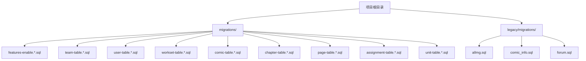
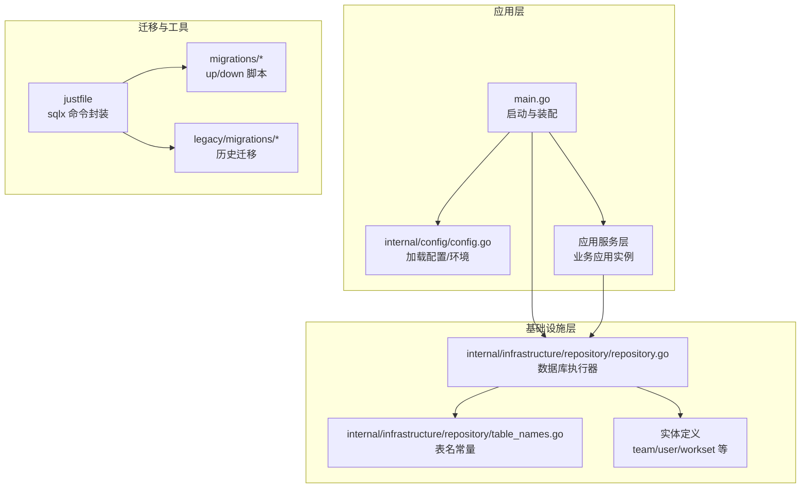
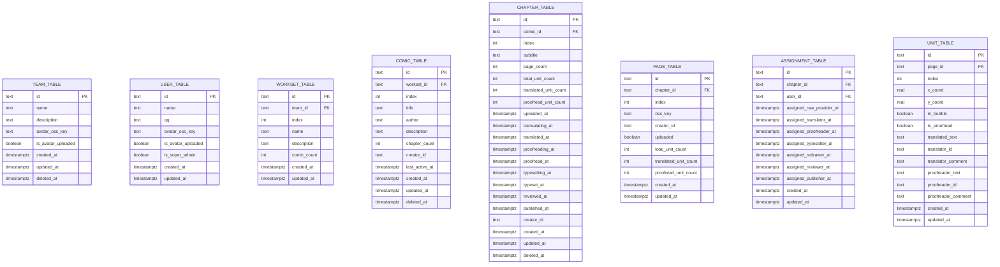
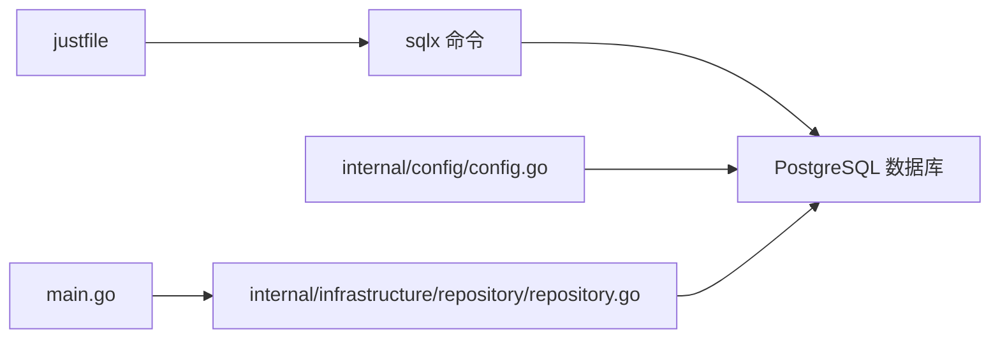

# 数据库迁移管理

<cite>
**本文引用的文件**
- [migrations/20260301065010_features-enable.up.sql](file://migrations/20260301065010_features-enable.up.sql)
- [migrations/20260301065010_features-enable.down.sql](file://migrations/20260301065010_features-enable.down.sql)
- [migrations/20260301065012_team-table.up.sql](file://migrations/20260301065012_team-table.up.sql)
- [migrations/20260301065012_team-table.down.sql](file://migrations/20260301065012_team-table.down.sql)
- [migrations/20260301065022_user-table.up.sql](file://migrations/20260301065022_user-table.up.sql)
- [migrations/20260301065022_user-table.down.sql](file://migrations/20260301065022_user-table.down.sql)
- [migrations/20260306101211_workset-table.up.sql](file://migrations/20260306101211_workset-table.up.sql)
- [migrations/20260306101211_workset-table.down.sql](file://migrations/20260306101211_workset-table.down.sql)
- [migrations/20260306101212_comic-table.up.sql](file://migrations/20260306101212_comic-table.up.sql)
- [migrations/20260306101212_comic-table.down.sql](file://migrations/20260306101212_comic-table.down.sql)
- [migrations/20260306101213_chapter-table.up.sql](file://migrations/20260306101213_chapter-table.up.sql)
- [migrations/20260306101213_chapter-table.down.sql](file://migrations/20260306101213_chapter-table.down.sql)
- [migrations/20260306101214_page-table.up.sql](file://migrations/20260306101214_page-table.up.sql)
- [migrations/20260306101214_page-table.down.sql](file://migrations/20260306101214_page-table.down.sql)
- [migrations/20260306101215_assignment-table.up.sql](file://migrations/20260306101215_assignment-table.up.sql)
- [migrations/20260306101215_assignment-table.down.sql](file://migrations/20260306101215_assignment-table.down.sql)
- [migrations/20260306101216_unit-table.up.sql](file://migrations/20260306101216_unit-table.up.sql)
- [migrations/20260306101216_unit-table.down.sql](file://migrations/20260306101216_unit-table.down.sql)
- [legacy/migrations/allmg.sql](file://legacy/migrations/allmg.sql)
- [legacy/migrations/comic_info.sql](file://legacy/migrations/comic_info.sql)
- [legacy/migrations/forum.sql](file://legacy/migrations/forum.sql)
- [justfile](file://justfile)
- [app_config.json](file://app_config.json)
- [main.go](file://main.go)
- [internal/config/config.go](file://internal/config/config.go)
- [internal/infrastructure/repository/repository.go](file://internal/infrastructure/repository/repository.go)
- [internal/infrastructure/repository/table_names.go](file://internal/infrastructure/repository/table_names.go)
- [internal/infrastructure/repository/entity/team.go](file://internal/infrastructure/repository/entity/team.go)
- [internal/infrastructure/repository/entity/user.go](file://internal/infrastructure/repository/entity/user.go)
- [internal/infrastructure/repository/entity/workset.go](file://internal/infrastructure/repository/entity/workset.go)
- [internal/infrastructure/repository/entity/comic.go](file://internal/infrastructure/repository/entity/comic.go)
- [internal/infrastructure/repository/entity/page.go](file://internal/infrastructure/repository/entity/page.go)
- [internal/infrastructure/repository/entity/assignment.go](file://internal/infrastructure/repository/entity/assignment.go)
- [internal/infrastructure/repository/entity/unit.go](file://internal/infrastructure/repository/entity/unit.go)
</cite>

## 目录
1. [引言](#引言)
2. [项目结构](#项目结构)
3. [核心组件](#核心组件)
4. [架构总览](#架构总览)
5. [详细组件分析](#详细组件分析)
6. [依赖分析](#依赖分析)
7. [性能考虑](#性能考虑)
8. [故障排查指南](#故障排查指南)
9. [结论](#结论)
10. [附录](#附录)

## 引言
本文件面向 poprako-web-ms 项目的数据库迁移管理，系统性阐述版本控制策略、命名规范与组织结构、迁移脚本编写原则与最佳实践，并提供执行、回滚与版本对比的操作指南。同时覆盖开发、测试、生产三类环境的迁移策略，给出数据备份与恢复建议，以及常见问题的排查与解决路径。

## 项目结构
该项目采用基于目录的迁移文件组织方式，迁移脚本位于 migrations 目录，按时间戳前缀分组，每个逻辑变更包含 up/down 两部分。项目还保留 legacy/migrations 目录以兼容历史遗留 SQL 定义。

- 迁移文件组织
  - 目录：migrations/
  - 命名：时间戳_描述.up.sql / 时间戳_描述.down.sql
  - 示例：20260301065010_features-enable.up.sql
- 历史迁移
  - 目录：legacy/migrations/
  - 文件：allmg.sql、comic_info.sql、forum.sql

图表来源
- [migrations/20260301065010_features-enable.up.sql](file://migrations/20260301065010_features-enable.up.sql)
- [migrations/20260301065012_team-table.up.sql](file://migrations/20260301065012_team-table.up.sql)
- [legacy/migrations/allmg.sql](file://legacy/migrations/allmg.sql)

章节来源
- [migrations/20260301065010_features-enable.up.sql](file://migrations/20260301065010_features-enable.up.sql)
- [migrations/20260301065012_team-table.up.sql](file://migrations/20260301065012_team-table.up.sql)
- [legacy/migrations/allmg.sql](file://legacy/migrations/allmg.sql)

## 核心组件
- 迁移工具链
  - 使用 sqlx 进行迁移管理，通过 Justfile 提供便捷命令封装。
  - 关键命令：添加迁移、运行迁移、回滚迁移。
- 配置与环境
  - 应用通过 JSON 配置文件加载基础参数；数据库连接通过 DATABASE_URL 环境变量注入。
  - 支持 development/production 环境切换。
- 数据库执行器
  - 基于 GORM + PostgreSQL 驱动建立连接池，设置最大空闲与最大打开连接数。
- 实体与表名
  - 所有表名集中定义在 table_names.go 中，避免硬编码裸字符串，确保一致性与可维护性。

章节来源
- [justfile](file://justfile)
- [app_config.json](file://app_config.json)
- [internal/config/config.go](file://internal/config/config.go)
- [internal/infrastructure/repository/repository.go](file://internal/infrastructure/repository/repository.go)
- [internal/infrastructure/repository/table_names.go](file://internal/infrastructure/repository/table_names.go)

## 架构总览
下图展示迁移管理在系统中的位置与交互关系：应用启动时加载配置并创建数据库执行器，迁移工具通过 sqlx 与数据库交互，执行 up/down 脚本以推进或回退数据库版本。

图表来源
- [main.go](file://main.go)
- [internal/config/config.go](file://internal/config/config.go)
- [internal/infrastructure/repository/repository.go](file://internal/infrastructure/repository/repository.go)
- [internal/infrastructure/repository/table_names.go](file://internal/infrastructure/repository/table_names.go)
- [justfile](file://justfile)
- [migrations/20260301065010_features-enable.up.sql](file://migrations/20260301065010_features-enable.up.sql)

## 详细组件分析

### 迁移文件命名规范与组织结构
- 命名规范
  - 时间戳前缀：保证迁移顺序与可追溯性。
  - 描述语义：简洁表达迁移目的（如 features-enable、team-table、user-table 等）。
  - 分组：同一逻辑变更的 up/down 成对出现，便于对照与回滚。
- 组织结构
  - 每个功能模块或表结构变更独立一组 up/down 文件，便于审查与回滚。
  - 历史迁移保留在 legacy/migrations，避免与当前迁移混淆。

章节来源
- [migrations/20260301065010_features-enable.up.sql](file://migrations/20260301065010_features-enable.up.sql)
- [migrations/20260301065012_team-table.up.sql](file://migrations/20260301065012_team-table.up.sql)
- [migrations/20260301065022_user-table.up.sql](file://migrations/20260301065022_user-table.up.sql)
- [migrations/20260306101211_workset-table.up.sql](file://migrations/20260306101211_workset-table.up.sql)
- [migrations/20260306101212_comic-table.up.sql](file://migrations/20260306101212_comic-table.up.sql)
- [migrations/20260306101213_chapter-table.up.sql](file://migrations/20260306101213_chapter-table.up.sql)
- [migrations/20260306101214_page-table.up.sql](file://migrations/20260306101214_page-table.up.sql)
- [migrations/20260306101215_assignment-table.up.sql](file://migrations/20260306101215_assignment-table.up.sql)
- [migrations/20260306101216_unit-table.up.sql](file://migrations/20260306101216_unit-table.up.sql)

### 迁移脚本编写原则与最佳实践
- 原子性与幂等性
  - up 脚本应幂等，重复执行不应产生副作用；down 脚本应能安全回滚。
- 可逆性
  - 每个 up 脚本必须有对应的 down 脚本，且回滚顺序与执行顺序相反。
- 兼容性
  - 避免破坏性变更；如需重命名列或表，先新增后迁移数据再删除旧对象。
- 索引与约束
  - 显式索引与唯一约束应在 up 中创建，在 down 中删除，保持对称。
- 扩展与插件
  - 如启用扩展（如文本相似度），在 up 中创建并在 down 中删除。
- 测试先行
  - 在本地或测试环境验证 up/down 正确性后再合并到主干。

章节来源
- [migrations/20260301065010_features-enable.up.sql](file://migrations/20260301065010_features-enable.up.sql)
- [migrations/20260301065010_features-enable.down.sql](file://migrations/20260301065010_features-enable.down.sql)
- [migrations/20260301065012_team-table.up.sql](file://migrations/20260301065012_team-table.up.sql)
- [migrations/20260301065012_team-table.down.sql](file://migrations/20260301065012_team-table.down.sql)

### 迁移执行、回滚与版本对比操作指南
- 添加迁移
  - 使用命令：sqlx migrate add -r <脚本名>
  - 生成一对 up/down 文件，随后补充具体 DDL/DML。
- 执行迁移
  - 使用命令：sqlx migrate run
  - 自动按时间戳顺序执行未应用的 up 脚本。
- 回滚迁移
  - 单步回滚：sqlx migrate revert
  - 全量回滚：sqlx migrate revert --target-version 0
- 版本对比
  - 通过 sqlx 工具查看当前数据库版本与目标版本差异，确认迁移状态。

章节来源
- [justfile](file://justfile)

### 数据库环境迁移策略（开发、测试、生产）
- 开发环境
  - 使用本地或容器化数据库，开启自动迁移执行，便于快速迭代。
  - 配置 DATABASE_URL 指向开发数据库，APP_ENVIRONMENT=development。
- 测试环境
  - 使用独立测试数据库，执行相同迁移脚本，确保与生产一致。
  - 通过 CI/CD 在测试阶段自动运行 sqlx migrate run。
- 生产环境
  - 严格审批与演练：先在预生产验证，再在维护窗口执行。
  - 使用只读回滚策略：down 脚本必须经过充分测试，确保可逆。
  - 记录迁移日志与负责人，便于审计与追踪。

章节来源
- [internal/config/config.go](file://internal/config/config.go)
- [app_config.json](file://app_config.json)

### 数据备份与恢复方案
- 备份
  - 逻辑备份：使用数据库导出工具保存结构与数据，建议在迁移前执行。
  - 物理备份：针对生产环境，结合数据库快照或物理备份策略。
- 恢复
  - 回滚优先：若迁移导致异常，优先执行 down 脚本回滚至稳定版本。
  - 从备份恢复：若回滚无效，从最近一次备份中恢复数据库，再重新执行迁移。
- 最佳实践
  - 迁移窗口最小化，尽量安排在低峰时段。
  - 对关键表进行增量备份，缩短 RTO/RPO。

（本节为通用指导，不直接分析具体文件）

### 迁移过程中的数据一致性与完整性
- 约束与索引
  - 在 up 中创建唯一索引、外键与检查约束；在 down 中按相反顺序删除。
- 默认值与类型
  - 明确默认值与非空约束，避免后续变更引发数据迁移复杂度。
- 扩展支持
  - 如启用全文检索等扩展，确保 down 删除扩展以避免残留。

章节来源
- [migrations/20260301065012_team-table.up.sql](file://migrations/20260301065012_team-table.up.sql)
- [migrations/20260301065012_team-table.down.sql](file://migrations/20260301065012_team-table.down.sql)

### 迁移脚本示例与对应实体
以下为典型 up/down 脚本与其对应实体/表名的映射关系，便于理解迁移范围与影响面。

图表来源
- [internal/infrastructure/repository/table_names.go](file://internal/infrastructure/repository/table_names.go)
- [internal/infrastructure/repository/entity/team.go](file://internal/infrastructure/repository/entity/team.go)
- [internal/infrastructure/repository/entity/user.go](file://internal/infrastructure/repository/entity/user.go)
- [internal/infrastructure/repository/entity/workset.go](file://internal/infrastructure/repository/entity/workset.go)
- [internal/infrastructure/repository/entity/comic.go](file://internal/infrastructure/repository/entity/comic.go)
- [internal/infrastructure/repository/entity/page.go](file://internal/infrastructure/repository/entity/page.go)
- [internal/infrastructure/repository/entity/assignment.go](file://internal/infrastructure/repository/entity/assignment.go)
- [internal/infrastructure/repository/entity/unit.go](file://internal/infrastructure/repository/entity/unit.go)

## 依赖分析
- 迁移工具与应用的耦合
  - 迁移工具链通过 sqlx 与数据库交互，应用启动时并不直接调用迁移，而是依赖环境变量与配置驱动数据库连接。
- 配置与环境变量
  - DATABASE_URL 必须正确设置，否则无法连接数据库执行迁移。
  - APP_ENVIRONMENT 控制环境行为，开发与生产在迁移策略上有所区别。
- 数据库执行器
  - 通过 GORM + PostgreSQL 驱动建立连接池，迁移脚本在该连接上下文中执行。

图表来源
- [justfile](file://justfile)
- [internal/config/config.go](file://internal/config/config.go)
- [internal/infrastructure/repository/repository.go](file://internal/infrastructure/repository/repository.go)
- [main.go](file://main.go)

章节来源
- [justfile](file://justfile)
- [internal/config/config.go](file://internal/config/config.go)
- [internal/infrastructure/repository/repository.go](file://internal/infrastructure/repository/repository.go)
- [main.go](file://main.go)

## 性能考虑
- 连接池配置
  - 通过配置文件设置最小空闲连接与最大打开连接数，避免高并发下的连接争用。
- 迁移执行窗口
  - 将大体量迁移安排在低峰时段，减少对线上业务的影响。
- 索引与约束
  - 大表变更时，优先考虑批量处理与分批提交，避免长时间锁表。

章节来源
- [app_config.json](file://app_config.json)
- [internal/config/config.go](file://internal/config/config.go)
- [internal/infrastructure/repository/repository.go](file://internal/infrastructure/repository/repository.go)

## 故障排查指南
- 常见问题
  - 迁移失败：检查 DATABASE_URL 是否正确，确认数据库可达；查看 sqlx 输出的错误信息定位具体脚本。
  - 权限不足：确保数据库用户具备执行 DDL/DML 的权限。
  - 幂等性问题：若重复执行导致异常，检查 up 脚本是否幂等，必要时补充条件判断。
- 排查步骤
  - 确认当前数据库版本与目标版本，使用 sqlx 查看迁移状态。
  - 逐条执行 up/down 脚本，定位失败点。
  - 若 down 失败，优先从备份恢复，再重新评估迁移策略。
- 回滚策略
  - 单步回滚：sqlx migrate revert
  - 全量回滚：sqlx migrate revert --target-version 0

章节来源
- [justfile](file://justfile)

## 结论
本项目采用清晰的迁移文件命名与组织结构，配合 sqlx 工具链与 Justfile 命令封装，实现了可追溯、可回滚的数据库演进机制。通过明确的环境策略、备份与恢复方案以及故障排查流程，能够有效保障迁移过程的安全与稳定。

## 附录
- 历史迁移参考
  - legacy/migrations 下的历史 SQL 定义可用于理解历史表结构与迁移背景，但不建议直接在新环境中使用，应作为迁移设计的参考与对比依据。

章节来源
- [legacy/migrations/allmg.sql](file://legacy/migrations/allmg.sql)
- [legacy/migrations/comic_info.sql](file://legacy/migrations/comic_info.sql)
- [legacy/migrations/forum.sql](file://legacy/migrations/forum.sql)