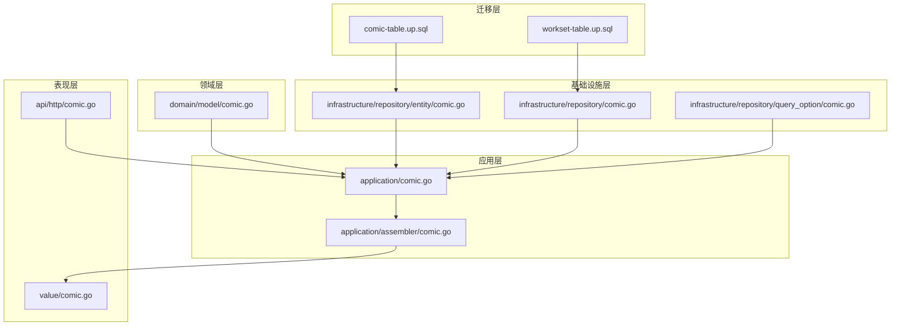
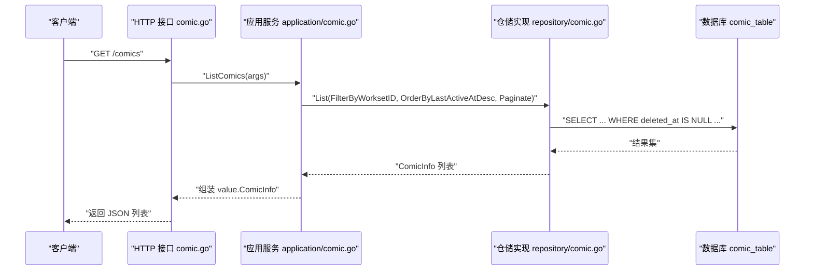
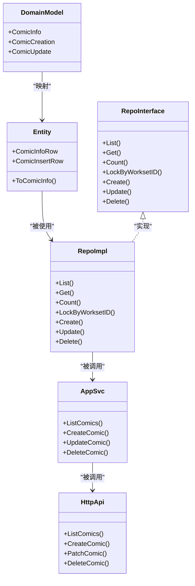
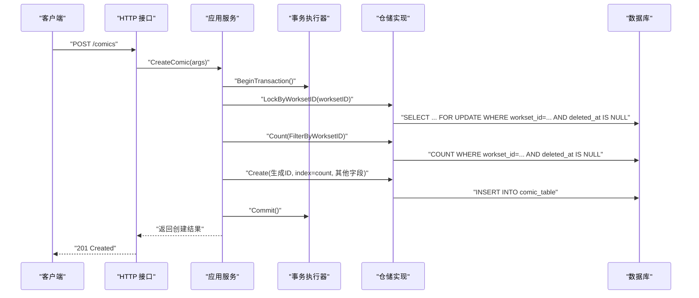

# 漫画表设计

<cite>
**本文引用的文件**
- [migrations/20260306101212_comic-table.up.sql](file://migrations/20260306101212_comic-table.up.sql)
- [internal/domain/model/comic.go](file://internal/domain/model/comic.go)
- [internal/infrastructure/repository/entity/comic.go](file://internal/infrastructure/repository/entity/comic.go)
- [internal/application/assembler/comic.go](file://internal/application/assembler/comic.go)
- [internal/api/http/comic.go](file://internal/api/http/comic.go)
- [internal/application/comic.go](file://internal/application/comic.go)
- [internal/infrastructure/repository/comic.go](file://internal/infrastructure/repository/comic.go)
- [internal/value/comic.go](file://internal/value/comic.go)
- [internal/domain/repository/comic.go](file://internal/domain/repository/comic.go)
- [internal/infrastructure/repository/query_option/comic.go](file://internal/infrastructure/repository/query_option/comic.go)
- [migrations/20260306101211_workset-table.up.sql](file://migrations/20260306101211_workset-table.up.sql)
</cite>

## 目录
1. [简介](#简介)
2. [项目结构](#项目结构)
3. [核心组件](#核心组件)
4. [架构总览](#架构总览)
5. [详细组件分析](#详细组件分析)
6. [依赖关系分析](#依赖关系分析)
7. [性能考量](#性能考量)
8. [故障排查指南](#故障排查指南)
9. [结论](#结论)
10. [附录](#附录)

## 简介
本设计文档围绕 poprako-web-ms 项目中的漫画表（comic_table）进行系统性梳理，重点解释字段定义、数据类型与业务含义；详述外键关系（workset_id、creator_id）的设计思路与约束；分析复合索引（uidx_comic_team_id_index）的作用与查询优化效果；解释软删除机制（deleted_at）的实现与影响；并给出典型查询场景与性能优化建议，以及数据完整性与业务规则约束。

## 项目结构
漫画表相关代码分布在迁移脚本、领域模型、基础设施仓储层、应用装配器与 API 层等模块中，形成清晰的分层架构：
- 迁移层：定义表结构、索引与约束
- 领域层：定义漫画实体与创建/更新参数
- 基础设施层：定义实体映射、仓储接口与查询选项
- 应用层：封装业务流程（鉴权、并发控制、事务）
- 表现层：HTTP 接口定义与参数校验

图表来源
- [migrations/20260306101212_comic-table.up.sql:1-37](file://migrations/20260306101212_comic-table.up.sql#L1-L37)
- [migrations/20260306101211_workset-table.up.sql:1-19](file://migrations/20260306101211_workset-table.up.sql#L1-L19)
- [internal/domain/model/comic.go:1-107](file://internal/domain/model/comic.go#L1-L107)
- [internal/infrastructure/repository/entity/comic.go:1-112](file://internal/infrastructure/repository/entity/comic.go#L1-L112)
- [internal/infrastructure/repository/comic.go:1-140](file://internal/infrastructure/repository/comic.go#L1-L140)
- [internal/infrastructure/repository/query_option/comic.go:1-91](file://internal/infrastructure/repository/query_option/comic.go#L1-L91)
- [internal/application/comic.go:1-354](file://internal/application/comic.go#L1-L354)
- [internal/application/assembler/comic.go:1-35](file://internal/application/assembler/comic.go#L1-L35)
- [internal/api/http/comic.go:1-189](file://internal/api/http/comic.go#L1-L189)
- [internal/value/comic.go:1-124](file://internal/value/comic.go#L1-L124)

章节来源
- [migrations/20260306101212_comic-table.up.sql:1-37](file://migrations/20260306101212_comic-table.up.sql#L1-L37)
- [internal/domain/model/comic.go:1-107](file://internal/domain/model/comic.go#L1-L107)
- [internal/infrastructure/repository/entity/comic.go:1-112](file://internal/infrastructure/repository/entity/comic.go#L1-L112)
- [internal/application/comic.go:1-354](file://internal/application/comic.go#L1-L354)
- [internal/infrastructure/repository/comic.go:1-140](file://internal/infrastructure/repository/comic.go#L1-L140)
- [internal/infrastructure/repository/query_option/comic.go:1-91](file://internal/infrastructure/repository/query_option/comic.go#L1-L91)
- [internal/api/http/comic.go:1-189](file://internal/api/http/comic.go#L1-L189)
- [internal/value/comic.go:1-124](file://internal/value/comic.go#L1-L124)

## 核心组件
- 表结构与索引：定义主键、外键、默认值、时间戳与软删除字段，以及多处索引
- 领域模型：封装漫画信息、创建参数与更新参数
- 实体映射：GORM 映射结构，包含关联字段别名
- 仓储接口与实现：提供查询、创建、更新、删除、加锁与计数能力
- 应用服务：封装鉴权、并发控制、事务与业务规则
- 表现层：HTTP 接口与参数校验
- 查询选项：支持按工作集过滤、按最后活跃时间排序、聚合关联信息

章节来源
- [migrations/20260306101212_comic-table.up.sql:1-37](file://migrations/20260306101212_comic-table.up.sql#L1-L37)
- [internal/domain/model/comic.go:1-107](file://internal/domain/model/comic.go#L1-L107)
- [internal/infrastructure/repository/entity/comic.go:1-112](file://internal/infrastructure/repository/entity/comic.go#L1-L112)
- [internal/infrastructure/repository/comic.go:1-140](file://internal/infrastructure/repository/comic.go#L1-L140)
- [internal/application/comic.go:1-354](file://internal/application/comic.go#L1-L354)
- [internal/api/http/comic.go:1-189](file://internal/api/http/comic.go#L1-L189)
- [internal/value/comic.go:1-124](file://internal/value/comic.go#L1-L124)
- [internal/infrastructure/repository/query_option/comic.go:1-91](file://internal/infrastructure/repository/query_option/comic.go#L1-L91)

## 架构总览
漫画表在系统中的位置与交互如下：

图表来源
- [internal/api/http/comic.go:25-52](file://internal/api/http/comic.go#L25-L52)
- [internal/application/comic.go:76-147](file://internal/application/comic.go#L76-L147)
- [internal/infrastructure/repository/comic.go:34-54](file://internal/infrastructure/repository/comic.go#L34-L54)

## 详细组件分析

### 字段定义、数据类型与业务含义
- id：主键，文本型，唯一标识漫画
- workset_id：外键，指向工作集表，级联删除策略
- index：整型，默认 0，用于在工作集内维护顺序
- title：文本，非空，漫画标题
- author：文本，非空，作者名
- description：文本，漫画描述
- chapter_count：整型，默认 0，章节数量
- creator_id：外键，指向用户表，限制删除策略
- last_active_at：带时区的时间戳，默认当前时间
- created_at/updated_at/deleted_at：带时区的时间戳，软删除使用

业务要点
- 顺序管理：通过 index 在工作集内保持稳定顺序
- 软删除：通过 deleted_at 字段实现逻辑删除，所有查询默认排除已删除记录
- 时间线：last_active_at 记录最后活跃时间，便于排序与审计

章节来源
- [migrations/20260306101212_comic-table.up.sql:1-20](file://migrations/20260306101212_comic-table.up.sql#L1-L20)
- [internal/infrastructure/repository/entity/comic.go:13-29](file://internal/infrastructure/repository/entity/comic.go#L13-L29)

### 外键关系与约束
- workset_id -> workset_table(id)，ON DELETE CASCADE
  - 设计思路：漫画属于工作集，工作集删除时自动清理其下漫画，避免悬挂数据
  - 约束条件：workset_id 非空且必须存在
- creator_id -> user_table(id)，ON DELETE RESTRICT
  - 设计思路：漫画创建者不可随意删除，防止引用失效
  - 约束条件：creator_id 非空且必须存在

与工作集的关系补充
- 工作集表包含 team_id 外键，指向团队表，用于将工作集与团队关联
- 工作集表有唯一索引 (team_id, index)，确保团队内工作集顺序唯一

章节来源
- [migrations/20260306101212_comic-table.up.sql:4](file://migrations/20260306101212_comic-table.up.sql#L4)
- [migrations/20260306101212_comic-table.up.sql:13](file://migrations/20260306101212_comic-table.up.sql#L13)
- [migrations/20260306101211_workset-table.up.sql:4](file://migrations/20260306101211_workset-table.up.sql#L4)

### 复合索引与查询优化
- uidx_comic_team_id_index(team_id, index) WHERE deleted_at IS NULL
  - 作用：确保团队内漫画顺序唯一，避免重复索引导致的冲突
  - 影响：在团队维度上按顺序检索或去重时具备高效性
- idx_comic_team_created_at_desc(team_id, created_at DESC) WHERE deleted_at IS NULL
  - 作用：支持按团队维度倒序列出漫画（最新优先）
  - 影响：满足“最近创建”类查询的高效访问
- idx_comic_creator_id(creator_id) WHERE deleted_at IS NULL
  - 作用：快速定位某创建者的漫画
  - 影响：提升“按创建者筛选”的查询效率
- idx_comic_last_active_at_desc(team_id, last_active_at DESC) WHERE deleted_at IS NULL
  - 作用：按团队维度按最后活跃时间倒序排序
  - 影响：满足“最近活跃”类展示需求

查询路径映射
- 列表查询：应用层通过查询选项组合过滤与排序，仓储层统一追加 WHERE deleted_at IS NULL
- 聚合查询：支持 IncludeWorksetInfo/IncludeCreatorInfo，通过 LEFT JOIN 聚合关联字段

章节来源
- [migrations/20260306101212_comic-table.up.sql:22-28](file://migrations/20260306101212_comic-table.up.sql#L22-L28)
- [internal/infrastructure/repository/query_option/comic.go:13-90](file://internal/infrastructure/repository/query_option/comic.go#L13-L90)
- [internal/infrastructure/repository/comic.go:34-70](file://internal/infrastructure/repository/comic.go#L34-L70)

### 软删除机制（deleted_at）
实现方式
- 删除操作：仓储层对指定 id 的记录设置 deleted_at 为当前时间
- 默认过滤：所有查询（List/Get/Count/LockByWorksetID）均追加 WHERE deleted_at IS NULL
- 并发控制：创建时通过行级锁锁定同一工作集内的现有漫画，避免竞态

影响与注意事项
- 逻辑删除：保留数据历史，便于审计与恢复
- 查询一致性：应用层与仓储层统一处理软删除，避免误读已删除记录
- 索引选择性：WHERE deleted_at IS NULL 的谓词在索引中可利用选择性，提高扫描效率

章节来源
- [internal/infrastructure/repository/comic.go:132-139](file://internal/infrastructure/repository/comic.go#L132-L139)
- [internal/infrastructure/repository/comic.go:36-36](file://internal/infrastructure/repository/comic.go#L36-L36)
- [internal/infrastructure/repository/comic.go:58-58](file://internal/infrastructure/repository/comic.go#L58-L58)
- [internal/infrastructure/repository/comic.go:86-86](file://internal/infrastructure/repository/comic.go#L86-L86)
- [internal/application/comic.go:205-210](file://internal/application/comic.go#L205-L210)

### 典型查询场景与性能优化建议
- 场景一：按工作集获取漫画列表（支持 includes）
  - SQL 路径：过滤 workset_id，按 last_active_at 降序，可选聚合关联信息
  - 性能建议：使用 idx_comic_team_created_at_desc 或 idx_comic_last_active_at_desc，结合分页
- 场景二：按创建者筛选漫画
  - SQL 路径：过滤 creator_id
  - 性能建议：使用 idx_comic_creator_id
- 场景三：创建漫画（顺序自增）
  - SQL 路径：先锁工作集内现有漫画，统计数量后插入
  - 性能建议：利用索引与行级锁减少竞争；避免不必要的锁范围
- 场景四：更新/删除漫画
  - SQL 路径：按 id 更新或设置 deleted_at
  - 性能建议：更新字段尽量只涉及必要列；删除采用软删除

章节来源
- [internal/application/comic.go:76-147](file://internal/application/comic.go#L76-L147)
- [internal/application/comic.go:149-246](file://internal/application/comic.go#L149-L246)
- [internal/infrastructure/repository/comic.go:72-82](file://internal/infrastructure/repository/comic.go#L72-L82)
- [internal/infrastructure/repository/comic.go:119-130](file://internal/infrastructure/repository/comic.go#L119-L130)
- [internal/infrastructure/repository/query_option/comic.go:13-32](file://internal/infrastructure/repository/query_option/comic.go#L13-L32)

### 数据完整性与业务规则约束
- 外键约束：workset_id 必须存在；creator_id 必须存在且不可删除
- 唯一性：复合索引确保团队内漫画顺序唯一
- 默认值：index、chapter_count、created_at、updated_at、last_active_at 设置合理默认
- 参数校验：标题、作者、描述长度限制，工作集 ID 必填
- 并发控制：创建漫画时锁定工作集，避免竞态导致的顺序冲突

章节来源
- [migrations/20260306101212_comic-table.up.sql:4-13](file://migrations/20260306101212_comic-table.up.sql#L4-L13)
- [internal/value/comic.go:30-85](file://internal/value/comic.go#L30-L85)
- [internal/application/comic.go:205-210](file://internal/application/comic.go#L205-L210)

## 依赖关系分析

图表来源
- [internal/domain/model/comic.go:5-107](file://internal/domain/model/comic.go#L5-L107)
- [internal/infrastructure/repository/entity/comic.go:13-112](file://internal/infrastructure/repository/entity/comic.go#L13-L112)
- [internal/domain/repository/comic.go:5-15](file://internal/domain/repository/comic.go#L5-L15)
- [internal/infrastructure/repository/comic.go:14-140](file://internal/infrastructure/repository/comic.go#L14-L140)
- [internal/application/comic.go:19-74](file://internal/application/comic.go#L19-L74)
- [internal/api/http/comic.go:10-189](file://internal/api/http/comic.go#L10-L189)

章节来源
- [internal/domain/model/comic.go:1-107](file://internal/domain/model/comic.go#L1-L107)
- [internal/infrastructure/repository/entity/comic.go:1-112](file://internal/infrastructure/repository/entity/comic.go#L1-L112)
- [internal/domain/repository/comic.go:1-15](file://internal/domain/repository/comic.go#L1-L15)
- [internal/infrastructure/repository/comic.go:1-140](file://internal/infrastructure/repository/comic.go#L1-L140)
- [internal/application/comic.go:1-354](file://internal/application/comic.go#L1-L354)
- [internal/api/http/comic.go:1-189](file://internal/api/http/comic.go#L1-L189)

## 性能考量
- 索引策略
  - 使用复合索引覆盖常用过滤与排序组合，减少全表扫描
  - 软删除谓词（WHERE deleted_at IS NULL）应与索引选择性配合，避免回表过多
- 查询模式
  - 列表查询优先使用排序索引（created_at/last_active_at），并结合分页
  - 聚合查询（includes）需注意 JOIN 成本，建议按需开启
- 并发与锁
  - 创建漫画时的行级锁可降低竞态，但需控制锁持有时间，避免长事务
- 写入路径
  - 更新仅更新必要字段，减少索引更新开销
  - 软删除替代硬删除，避免破坏外键链路

[本节为通用性能建议，不直接分析具体文件]

## 故障排查指南
- 查询不到数据
  - 检查是否传入了正确的 workset_id 或 creator_id
  - 确认 deleted_at 是否被正确过滤（默认排除）
- 创建漫画失败
  - 检查工作集是否存在与权限是否足够
  - 观察是否发生并发冲突（锁等待或唯一约束冲突）
- 更新/删除异常
  - 确认传入的 id 是否正确
  - 检查权限是否满足（基于团队与角色）

章节来源
- [internal/infrastructure/repository/comic.go:36-36](file://internal/infrastructure/repository/comic.go#L36-L36)
- [internal/infrastructure/repository/comic.go:58-58](file://internal/infrastructure/repository/comic.go#L58-L58)
- [internal/application/comic.go:107-114](file://internal/application/comic.go#L107-L114)
- [internal/application/comic.go:277-287](file://internal/application/comic.go#L277-L287)

## 结论
漫画表通过明确的字段定义、严格的外键约束与合理的索引设计，实现了在工作集维度上的有序管理与高效查询。软删除机制保障了数据完整性与审计需求，配合应用层的鉴权与并发控制，满足了实际业务场景的需求。遵循本文的查询与优化建议，可在高并发与大数据量场景下保持良好的性能与稳定性。

[本节为总结性内容，不直接分析具体文件]

## 附录
- 关键流程时序图（创建漫画）

图表来源
- [internal/api/http/comic.go:67-95](file://internal/api/http/comic.go#L67-L95)
- [internal/application/comic.go:149-246](file://internal/application/comic.go#L149-L246)
- [internal/infrastructure/repository/comic.go:72-82](file://internal/infrastructure/repository/comic.go#L72-L82)
- [internal/infrastructure/repository/comic.go:99-117](file://internal/infrastructure/repository/comic.go#L99-L117)