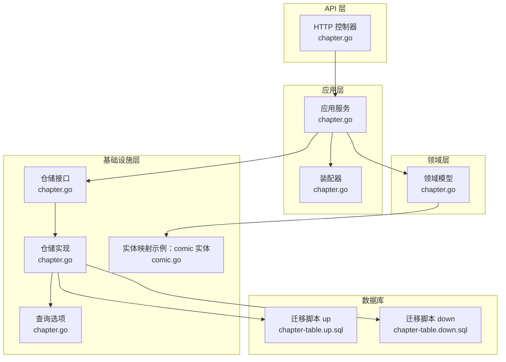
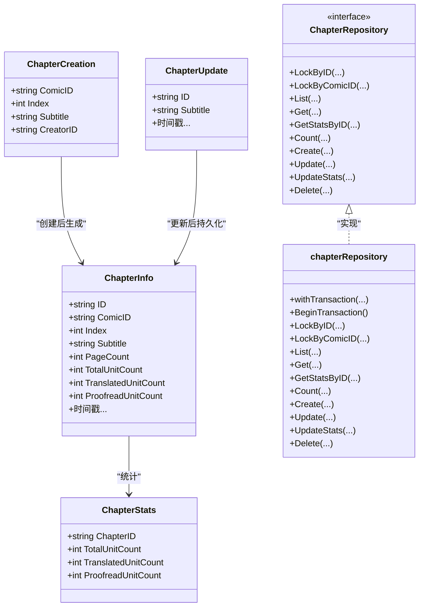
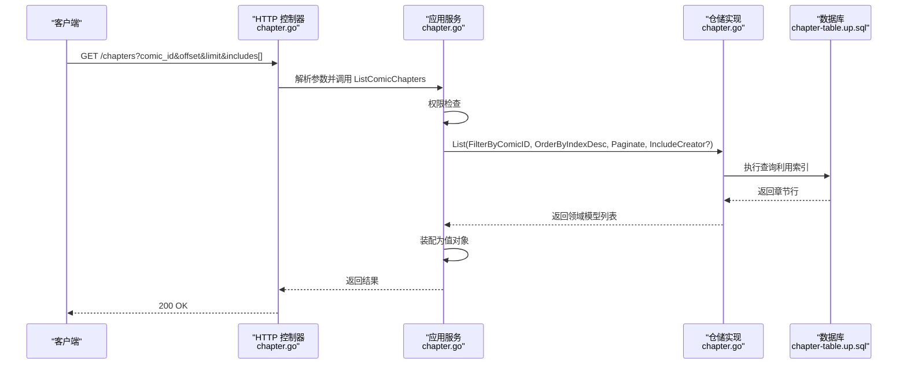
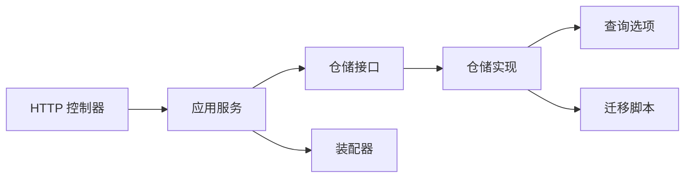
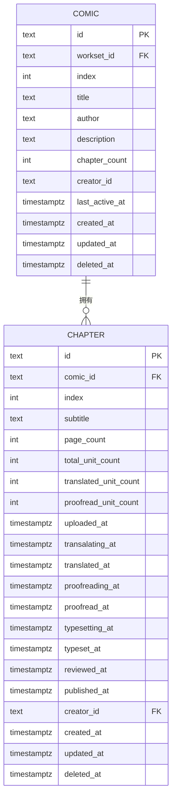

# 章节表设计

<cite>
**本文引用的文件**
- [chapter.go](file://internal/domain/model/chapter.go)
- [chapter.go](file://internal/application/assembler/chapter.go)
- [chapter.go](file://internal/infrastructure/repository/chapter.go)
- [chapter.go](file://internal/domain/repository/chapter.go)
- [chapter.go](file://internal/api/http/chapter.go)
- [chapter.go](file://internal/application/chapter.go)
- [chapter.go](file://internal/value/chapter.go)
- [chapter.go](file://internal/infrastructure/repository/query_option/chapter.go)
- [comic.go](file://internal/infrastructure/repository/entity/comic.go)
- [20260306101213_chapter-table.up.sql](file://migrations/20260306101213_chapter-table.up.sql)
- [20260306101213_chapter-table.down.sql](file://migrations/20260306101213_chapter-table.down.sql)
</cite>

## 目录
1. [简介](#简介)
2. [项目结构](#项目结构)
3. [核心组件](#核心组件)
4. [架构总览](#架构总览)
5. [详细组件分析](#详细组件分析)
6. [依赖分析](#依赖分析)
7. [性能考虑](#性能考虑)
8. [故障排查指南](#故障排查指南)
9. [结论](#结论)
10. [附录](#附录)

## 简介
本设计文档围绕 poprako-web-ms 项目的“章节表”（chapter_table）进行系统化梳理，覆盖表结构设计、字段语义、与漫画表的一对多关系及级联策略、索引与查询优化、状态管理与版本控制、常见查询模式与性能调优建议，以及业务规则与约束条件。文档同时给出面向代码级别的架构图与流程图，帮助开发者快速理解与落地实现。

## 项目结构
章节表位于数据库迁移脚本中定义，应用层通过领域模型、应用服务、装配器、仓储与查询选项协同完成 CRUD、状态更新与统计更新等操作。API 层负责对外暴露接口，值对象负责参数与返回值的校验与序列化。

图表来源
- [chapter.go:1-185](file://internal/api/http/chapter.go#L1-L185)
- [chapter.go:1-330](file://internal/application/chapter.go#L1-L330)
- [chapter.go:1-40](file://internal/application/assembler/chapter.go#L1-L40)
- [chapter.go:1-260](file://internal/domain/model/chapter.go#L1-L260)
- [chapter.go:1-19](file://internal/domain/repository/chapter.go#L1-L19)
- [chapter.go:1-190](file://internal/infrastructure/repository/chapter.go#L1-L190)
- [chapter.go:1-41](file://internal/infrastructure/repository/query_option/chapter.go#L1-L41)
- [comic.go:1-112](file://internal/infrastructure/repository/entity/comic.go#L1-L112)
- [20260306101213_chapter-table.up.sql:1-38](file://migrations/20260306101213_chapter-table.up.sql#L1-L38)
- [20260306101213_chapter-table.down.sql:1-1](file://migrations/20260306101213_chapter-table.down.sql#L1-L1)

章节表所在目录与文件
- 数据库迁移：migrations/20260306101213_chapter-table.up.sql、down.sql
- 领域模型：internal/domain/model/chapter.go
- 应用装配器：internal/application/assembler/chapter.go
- 仓储接口与实现：internal/domain/repository/chapter.go、internal/infrastructure/repository/chapter.go
- 查询选项：internal/infrastructure/repository/query_option/chapter.go
- 应用服务：internal/application/chapter.go
- API 控制器：internal/api/http/chapter.go
- 值对象：internal/value/chapter.go
- 示例实体映射：internal/infrastructure/repository/entity/comic.go

章节来源
- [chapter.go:1-185](file://internal/api/http/chapter.go#L1-L185)
- [chapter.go:1-330](file://internal/application/chapter.go#L1-L330)
- [chapter.go:1-40](file://internal/application/assembler/chapter.go#L1-L40)
- [chapter.go:1-260](file://internal/domain/model/chapter.go#L1-L260)
- [chapter.go:1-19](file://internal/domain/repository/chapter.go#L1-L19)
- [chapter.go:1-190](file://internal/infrastructure/repository/chapter.go#L1-L190)
- [chapter.go:1-41](file://internal/infrastructure/repository/query_option/chapter.go#L1-L41)
- [20260306101213_chapter-table.up.sql:1-38](file://migrations/20260306101213_chapter-table.up.sql#L1-L38)
- [20260306101213_chapter-table.down.sql:1-1](file://migrations/20260306101213_chapter-table.down.sql#L1-L1)

## 核心组件
- 领域模型
  - 章节详情：包含章节标识、所属漫画、排序索引、副标题、页面数与单元统计、各工作流节点的时间戳、创建者、创建与更新时间等。
  - 章节统计：仅包含章节 ID 与其三个关键统计字段。
  - 章节创建参数：漫画 ID、排序索引、副标题、创建者 ID。
  - 章节更新参数：章节 ID、副标题、工作流状态（上传、翻译、校对、排版、审阅、发布）。
- 仓储接口
  - 提供按 ID/ComicID 锁定、列表/单条查询、统计查询、计数、创建、更新、统计更新、软删除等能力。
- 应用服务
  - 对外暴露创建、列表、更新、删除章节的业务方法，内置权限校验、事务控制与错误处理。
- 装配器
  - 将领域模型转换为对外值对象，统一时间戳格式。
- 查询选项
  - 提供按漫画过滤、按索引排序、包含创建者信息等查询组合。
- API 控制器
  - 提供章节列表、创建、更新、删除的 HTTP 接口，参数解析与响应封装。
- 值对象
  - 定义对外参数与返回值结构，含参数校验逻辑。

章节来源
- [chapter.go:1-260](file://internal/domain/model/chapter.go#L1-L260)
- [chapter.go:1-19](file://internal/domain/repository/chapter.go#L1-L19)
- [chapter.go:1-330](file://internal/application/chapter.go#L1-L330)
- [chapter.go:1-40](file://internal/application/assembler/chapter.go#L1-L40)
- [chapter.go:1-41](file://internal/infrastructure/repository/query_option/chapter.go#L1-L41)
- [chapter.go:1-185](file://internal/api/http/chapter.go#L1-L185)
- [chapter.go:1-148](file://internal/value/chapter.go#L1-L148)

## 架构总览
章节表在应用层采用“接口隔离 + 仓储实现 + 查询选项 + 装配器”的分层设计，配合数据库迁移脚本确保表结构与约束稳定。

图表来源
- [chapter.go:1-260](file://internal/domain/model/chapter.go#L1-L260)
- [chapter.go:1-19](file://internal/domain/repository/chapter.go#L1-L19)
- [chapter.go:1-190](file://internal/infrastructure/repository/chapter.go#L1-L190)

## 详细组件分析

### 表结构设计与字段语义
- 主键与外键
  - 主键：id（文本型，作为主键）
  - 外键：comic_id 引用 comic_table(id)，删除策略：CASCADE；creator_id 引用 user_table(id)，删除策略：RESTRICT
- 关键字段
  - 排序索引：index（整型，默认 0），用于章节顺序
  - 副标题：subtitle（非空文本）
  - 页面数：page_count（默认 0）
  - 单元统计：total_unit_count、translated_unit_count、proofread_unit_count（默认 0）
  - 工作流时间戳：uploaded_at、transalating_at、translated_at、proofreading_at、proofread_at、typesetting_at、typeset_at、reviewed_at、published_at（可空）
  - 元数据：creator_id、created_at、updated_at、deleted_at（软删除）

章节来源
- [20260306101213_chapter-table.up.sql:1-38](file://migrations/20260306101213_chapter-table.up.sql#L1-L38)

### 一对多关系与级联删除策略
- 关系：漫画表（comic_table）与章节表（chapter_table）为一对多关系，一个漫画可包含多个章节。
- 级联策略：
  - 当漫画被删除时，章节自动级联删除（ON DELETE CASCADE）
  - 当章节创建者被删除时，禁止删除（ON DELETE RESTRICT），以保护历史记录完整性

章节来源
- [20260306101213_chapter-table.up.sql:4-24](file://migrations/20260306101213_chapter-table.up.sql#L4-L24)

### 索引设计与查询优化
- 唯一索引
  - uidx_chapter_comic_id_index：(comic_id, index) WHERE deleted_at IS NULL，保证同一漫画下章节索引唯一性，避免重复索引导致的并发冲突
- 辅助索引
  - idx_chapter_comic_id：comic_id（WHERE deleted_at IS NULL），用于按漫画筛选章节
- 查询优化建议
  - 列表查询优先按 comic_id 过滤并按 index 排序，利用索引减少扫描
  - 包含 creator 信息时，JOIN user_table 并显式选择所需列，避免 SELECT *
  - 使用分页参数 offset/limit 控制结果集大小
  - 统计查询仅选择必要列，避免不必要的数据传输

章节来源
- [20260306101213_chapter-table.up.sql:31-38](file://migrations/20260306101213_chapter-table.up.sql#L31-L38)
- [chapter.go:11-41](file://internal/infrastructure/repository/query_option/chapter.go#L11-L41)

### 状态管理与版本控制机制
- 状态字段
  - 工作流状态对应九个时间戳字段，分别代表上传、翻译、校对、排版、审阅、发布的阶段性完成时间
- 状态更新策略
  - 通过应用层组装更新参数，依据工作流状态枚举值设置对应时间戳；未传字段保持不变
  - 支持部分字段更新（如仅更新副标题或仅更新某个阶段时间戳）
- 版本控制
  - 使用 updated_at 字段记录最后变更时间，可用于前端缓存失效与审计追踪

章节来源
- [chapter.go:126-260](file://internal/domain/model/chapter.go#L126-L260)
- [chapter.go:223-281](file://internal/application/chapter.go#L223-L281)
- [20260306101213_chapter-table.up.sql:14-28](file://migrations/20260306101213_chapter-table.up.sql#L14-L28)

### 常见查询模式与性能调优
- 按漫画获取章节列表（带分页与可选 creator 信息）
  - 查询选项：FilterByComicID + OrderByIndexDesc + Paginate
  - 若需要 creator 信息，附加 IncludeCreatorInfo
- 获取章节统计
  - 仅查询统计相关列，避免加载冗余字段
- 性能调优要点
  - 合理使用索引：唯一索引保障索引唯一性，辅助索引加速过滤
  - 事务内加锁：创建章节时对漫画加锁，避免并发插入导致索引冲突
  - 避免 N+1 查询：通过 IncludeCreatorInfo 一次性 JOIN 获取关联信息

章节来源
- [chapter.go:167-221](file://internal/application/chapter.go#L167-L221)
- [chapter.go:11-41](file://internal/infrastructure/repository/query_option/chapter.go#L11-L41)
- [chapter.go:46-56](file://internal/infrastructure/repository/chapter.go#L46-L56)

### 业务规则与约束条件
- 参数校验
  - 创建章节：漫画 ID 与副标题必填
  - 更新章节：章节 ID 必填；副标题长度不超过 10；工作流状态必须符合允许的组合
- 权限控制
  - 列表、创建、更新、删除章节均需进行权限检查，基于当前用户、漫画与工作集信息判断
- 并发与一致性
  - 创建章节时对漫画加锁并统计当前章节数量，新章节 index 等于当前数量（0 基索引）
  - 使用事务包裹创建流程，失败回滚
- 软删除
  - 删除章节写入 deleted_at 时间戳，查询默认过滤 deleted_at IS NULL

章节来源
- [chapter.go:63-148](file://internal/value/chapter.go#L63-L148)
- [chapter.go:82-165](file://internal/application/chapter.go#L82-L165)
- [chapter.go:223-329](file://internal/application/chapter.go#L223-L329)
- [chapter.go:182-189](file://internal/infrastructure/repository/chapter.go#L182-L189)

### API 流程与时序图
章节列表接口调用链路如下：

图表来源
- [chapter.go:10-52](file://internal/api/http/chapter.go#L10-L52)
- [chapter.go:167-221](file://internal/application/chapter.go#L167-L221)
- [chapter.go:58-93](file://internal/infrastructure/repository/chapter.go#L58-L93)
- [20260306101213_chapter-table.up.sql:31-38](file://migrations/20260306101213_chapter-table.up.sql#L31-L38)

## 依赖分析
- 组件耦合
  - API 控制器依赖应用服务；应用服务依赖仓储接口与装配器；仓储实现依赖查询选项与数据库表名常量
- 外部依赖
  - GORM 查询构建器、数据库驱动、日志框架
- 循环依赖
  - 未发现循环依赖；分层清晰，接口隔离良好

图表来源
- [chapter.go:1-185](file://internal/api/http/chapter.go#L1-L185)
- [chapter.go:1-330](file://internal/application/chapter.go#L1-L330)
- [chapter.go:1-190](file://internal/infrastructure/repository/chapter.go#L1-L190)
- [chapter.go:1-41](file://internal/infrastructure/repository/query_option/chapter.go#L1-L41)
- [20260306101213_chapter-table.up.sql:1-38](file://migrations/20260306101213_chapter-table.up.sql#L1-L38)

章节来源
- [chapter.go:1-185](file://internal/api/http/chapter.go#L1-L185)
- [chapter.go:1-330](file://internal/application/chapter.go#L1-L330)
- [chapter.go:1-190](file://internal/infrastructure/repository/chapter.go#L1-L190)
- [chapter.go:1-41](file://internal/infrastructure/repository/query_option/chapter.go#L1-L41)

## 性能考虑
- 索引命中
  - 列表查询优先按 comic_id 过滤，确保唯一索引与辅助索引生效
- 事务与锁
  - 创建章节时对漫画加锁，降低并发冲突概率
- 分页与投影
  - 使用分页参数限制结果集；仅选择必要列，减少网络与内存开销
- 统计更新
  - UpdateStats 仅更新统计字段，避免触发其他字段变更带来的额外开销

[本节为通用性能建议，无需特定文件引用]

## 故障排查指南
- 创建章节失败
  - 检查权限是否满足；确认漫画存在且未被删除；查看事务开启与提交是否成功
- 并发创建冲突
  - 观察唯一索引冲突（同一漫画下 index 冲突）；确认是否正确执行漫画级锁
- 查询异常
  - 确认查询选项是否包含 comic_id 过滤；检查排序与分页参数是否合理
- 删除失败
  - 确认章节是否存在且未被软删除；检查权限与外键约束（创建者删除受限）

章节来源
- [chapter.go:82-165](file://internal/application/chapter.go#L82-L165)
- [chapter.go:131-147](file://internal/infrastructure/repository/chapter.go#L131-L147)
- [chapter.go:182-189](file://internal/infrastructure/repository/chapter.go#L182-L189)

## 结论
章节表设计遵循清晰的分层架构与严格的约束条件，结合唯一索引与辅助索引实现高效查询；通过工作流时间戳实现状态管理，配合应用层的权限校验与事务控制，确保数据一致性与业务合规性。建议在高并发场景下强化锁策略与统计更新路径，持续监控查询计划与索引使用情况，以维持系统整体性能与稳定性。

[本节为总结性内容，无需特定文件引用]

## 附录
- 数据模型 ER 图（概念示意）

[本图为概念示意，不直接映射具体源码文件，故不提供图表来源]