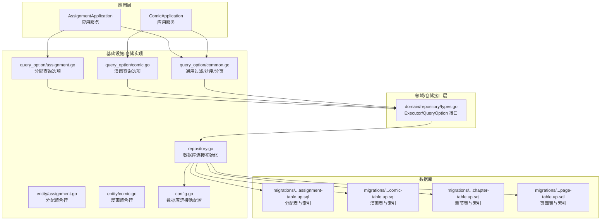
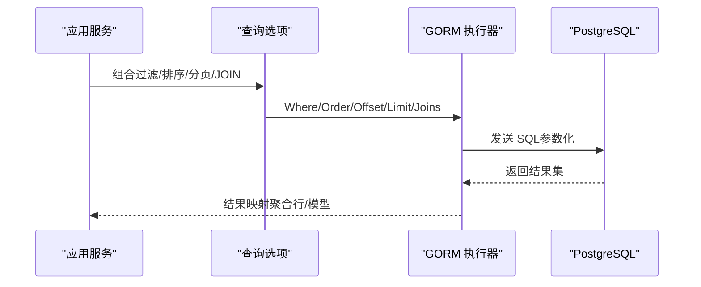
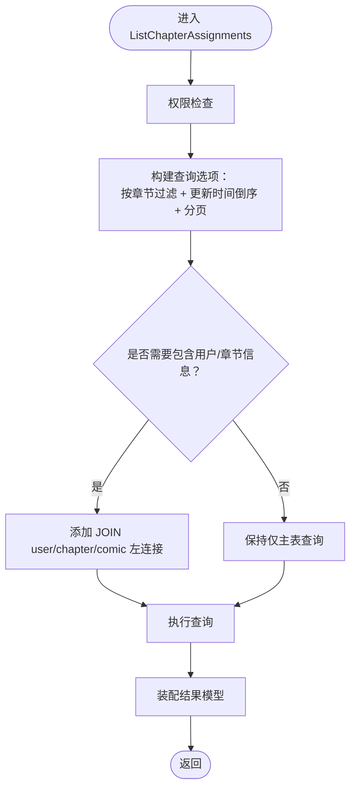
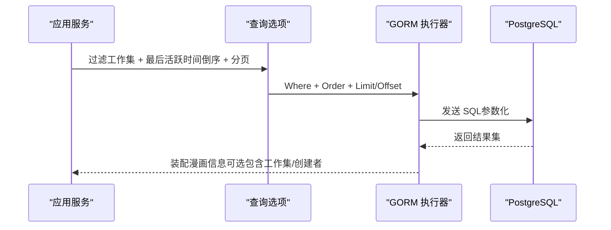
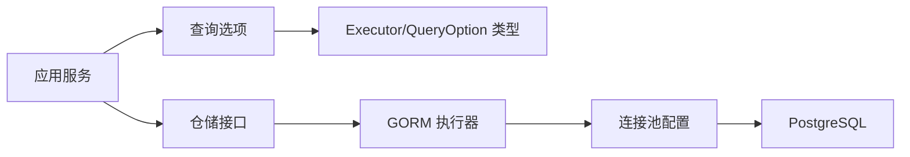

# 索引与性能

<cite>
**本文引用的文件**
- [repository.go](file://internal/infrastructure/repository/repository.go)
- [config.go](file://internal/config/config.go)
- [table_names.go](file://internal/infrastructure/repository/table_names.go)
- [types.go](file://internal/domain/repository/types.go)
- [common.go](file://internal/infrastructure/repository/query_option/common.go)
- [assignment.go](file://internal/infrastructure/repository/query_option/assignment.go)
- [comic.go](file://internal/infrastructure/repository/query_option/comic.go)
- [assignment.go](file://internal/infrastructure/repository/entity/assignment.go)
- [comic.go](file://internal/infrastructure/repository/entity/comic.go)
- [assignment.go](file://internal/application/assignment.go)
- [comic.go](file://internal/application/comic.go)
- [20260306101215_assignment-table.up.sql](file://migrations/20260306101215_assignment-table.up.sql)
- [20260306101212_comic-table.up.sql](file://migrations/20260306101212_comic-table.up.sql)
- [20260306101213_chapter-table.up.sql](file://migrations/20260306101213_chapter-table.up.sql)
- [20260306101214_page-table.up.sql](file://migrations/20260306101214_page-table.up.sql)
</cite>

## 目录
1. [简介](#简介)
2. [项目结构](#项目结构)
3. [核心组件](#核心组件)
4. [架构总览](#架构总览)
5. [详细组件分析](#详细组件分析)
6. [依赖分析](#依赖分析)
7. [性能考量](#性能考量)
8. [故障排查指南](#故障排查指南)
9. [结论](#结论)
10. [附录](#附录)

## 简介
本文件面向漫画翻译协作平台的数据库索引策略与性能优化，系统性梳理主键索引、唯一索引、复合索引与条件过滤索引的设计原则与适用场景；解释查询优化器如何利用索引生成执行计划，以及如何通过执行计划与慢查询日志识别性能瓶颈；给出慢查询分析、索引使用统计与查询性能监控方案；覆盖分区表策略、读写分离配置与缓存层设计建议；展示查询选项模式的实现细节、动态 SQL 构建与参数化查询优化；并涵盖并发控制、事务隔离级别与死锁预防机制。

## 项目结构
后端采用 Go 语言与 GORM ORM，数据访问层通过“查询选项模式”将过滤、排序、分页与 JOIN 聚合封装为可组合的 QueryOption，应用层按需拼装查询链路，迁移脚本集中定义表结构与索引。

**图表来源**
- [repository.go:11-29](file://internal/infrastructure/repository/repository.go#L11-L29)
- [config.go:85-100](file://internal/config/config.go#L85-L100)
- [common.go:15-50](file://internal/infrastructure/repository/query_option/common.go#L15-L50)
- [assignment.go:15-111](file://internal/infrastructure/repository/query_option/assignment.go#L15-L111)
- [comic.go:14-90](file://internal/infrastructure/repository/query_option/comic.go#L14-L90)
- [assignment.go:67-108](file://internal/infrastructure/repository/entity/assignment.go#L67-L108)
- [comic.go:13-47](file://internal/infrastructure/repository/entity/comic.go#L13-L47)
- [20260306101215_assignment-table.up.sql:1-26](file://migrations/20260306101215_assignment-table.up.sql#L1-L26)
- [20260306101212_comic-table.up.sql:1-37](file://migrations/20260306101212_comic-table.up.sql#L1-L37)
- [20260306101213_chapter-table.up.sql:1-38](file://migrations/20260306101213_chapter-table.up.sql#L1-L38)
- [20260306101214_page-table.up.sql:1-25](file://migrations/20260306101214_page-table.up.sql#L1-L25)

**章节来源**
- [repository.go:11-29](file://internal/infrastructure/repository/repository.go#L11-L29)
- [config.go:85-100](file://internal/config/config.go#L85-L100)
- [table_names.go:6-17](file://internal/infrastructure/repository/table_names.go#L6-L17)
- [types.go:5-11](file://internal/domain/repository/types.go#L5-L11)

## 核心组件
- 数据库连接与连接池：通过 GORM 初始化数据库连接，并设置最大打开连接数与最小空闲连接数。
- 查询选项模式：以函数式 QueryOption 组合方式表达过滤、排序、分页与 JOIN 聚合，避免裸字符串与重复逻辑。
- 实体聚合行：为复杂查询结果提供统一的结构化承载，支持按需选择字段与别名。
- 应用服务：根据业务需求组装查询选项，完成鉴权、参数校验与事务控制。

**章节来源**
- [repository.go:11-29](file://internal/infrastructure/repository/repository.go#L11-L29)
- [config.go:85-100](file://internal/config/config.go#L85-L100)
- [common.go:15-50](file://internal/infrastructure/repository/query_option/common.go#L15-L50)
- [assignment.go:67-108](file://internal/infrastructure/repository/entity/assignment.go#L67-L108)
- [comic.go:13-47](file://internal/infrastructure/repository/entity/comic.go#L13-L47)
- [assignment.go:92-157](file://internal/application/assignment.go#L92-L157)
- [comic.go:76-147](file://internal/application/comic.go#L76-L147)

## 架构总览
下图展示从应用层到数据库的调用链与索引使用点，强调查询选项如何驱动 SQL 构造与索引命中。

**图表来源**
- [assignment.go:126-143](file://internal/application/assignment.go#L126-L143)
- [comic.go:118-130](file://internal/application/comic.go#L118-L130)
- [common.go:15-50](file://internal/infrastructure/repository/query_option/common.go#L15-L50)
- [assignment.go:15-100](file://internal/infrastructure/repository/query_option/assignment.go#L15-L100)
- [comic.go:14-66](file://internal/infrastructure/repository/query_option/comic.go#L14-L66)

## 详细组件分析

### 分配表（assignment）索引策略与查询路径
- 主键与唯一约束：主键为自增 ID；复合唯一索引确保同一章节与用户的分配记录唯一。
- 辅助索引：chapter_id 与 user_id 单列索引，支撑按章节或用户过滤。
- 查询模式：应用层通过查询选项按章节或用户过滤，并可按更新时间倒序分页；必要时进行多表 JOIN 聚合用户、章节与漫画信息。

**图表来源**
- [assignment.go:92-157](file://internal/application/assignment.go#L92-L157)
- [assignment.go:15-111](file://internal/infrastructure/repository/query_option/assignment.go#L15-L111)
- [20260306101215_assignment-table.up.sql:1-26](file://migrations/20260306101215_assignment-table.up.sql#L1-L26)

**章节来源**
- [assignment.go:15-111](file://internal/infrastructure/repository/query_option/assignment.go#L15-L111)
- [assignment.go:67-108](file://internal/infrastructure/repository/entity/assignment.go#L67-L108)
- [20260306101215_assignment-table.up.sql:1-26](file://migrations/20260306101215_assignment-table.up.sql#L1-L26)

### 漫画表（comic）索引策略与查询路径
- 唯一索引：(team_id, index) 且 deleted_at IS NULL，保证团队内漫画序号唯一；配合条件索引提升范围查询效率。
- 辅助索引：按 team_id + created_at DESC 与 last_active_at DESC 进行条件过滤，满足“按最后活跃时间排序”的常见查询。
- 查询模式：应用层按工作集过滤，按最后活跃时间倒序排序，并可按需包含工作集与创建者信息。

**图表来源**
- [comic.go:76-147](file://internal/application/comic.go#L76-L147)
- [comic.go:14-66](file://internal/infrastructure/repository/query_option/comic.go#L14-L66)
- [20260306101212_comic-table.up.sql:22-37](file://migrations/20260306101212_comic-table.up.sql#L22-L37)

**章节来源**
- [comic.go:14-90](file://internal/infrastructure/repository/query_option/comic.go#L14-L90)
- [comic.go:13-47](file://internal/infrastructure/repository/entity/comic.go#L13-L47)
- [20260306101212_comic-table.up.sql:1-37](file://migrations/20260306101212_comic-table.up.sql#L1-L37)

### 章节表（chapter）与页面表（page）索引策略
- 章节表：复合唯一索引 (comic_id, index)，条件索引 (comic_id) 用于按漫画分组查询。
- 页面表：复合唯一索引 (chapter_id, index)，单列索引 (chapter_id) 用于按章节分页与统计。

**章节来源**
- [20260306101213_chapter-table.up.sql:31-37](file://migrations/20260306101213_chapter-table.up.sql#L31-L37)
- [20260306101214_page-table.up.sql:20-24](file://migrations/20260306101214_page-table.up.sql#L20-L24)

### 查询选项模式与动态 SQL 构建
- 统一规则：过滤仅作用于当前主表字段；跨表过滤使用带表前缀的 FilterOnXxx；ID 精确过滤复用通用 FilterByID；禁止裸字段，必须使用完整表名前缀。
- 动态 SQL：Where/Order/Joins/Select 以函数式组合，最终由 GORM 参数化执行，避免 SQL 注入与重复构造成本。
- 分页与排序：提供通用的 Offset/Limit 与 created_at/updated_at 升降序选项，便于在不同实体间复用。

**章节来源**
- [common.go:9-13](file://internal/infrastructure/repository/query_option/common.go#L9-L13)
- [common.go:15-50](file://internal/infrastructure/repository/query_option/common.go#L15-L50)
- [assignment.go:15-111](file://internal/infrastructure/repository/query_option/assignment.go#L15-L111)
- [comic.go:14-90](file://internal/infrastructure/repository/query_option/comic.go#L14-L90)

### 并发控制、事务隔离与死锁预防
- 事务：应用层在需要一致性与原子性的操作中开启事务（例如创建漫画流程），并在异常时回滚。
- 锁：在并发创建漫画时对工作集加锁，避免违反唯一索引导致的竞态。
- 死锁预防：避免在事务中交叉锁定不同方向的外键顺序；尽量在同一事务内按固定顺序访问资源；缩短事务持续时间。

**章节来源**
- [comic.go:189-241](file://internal/application/comic.go#L189-L241)

## 依赖分析
- 应用层依赖查询选项模块与仓储接口，通过 QueryOption 组合形成稳定的查询契约。
- 仓储实现依赖 GORM 与数据库连接池配置，连接池参数直接影响并发与资源占用。
- 迁移脚本定义表结构与索引，决定查询优化器的可用索引集合。

**图表来源**
- [types.go:5-11](file://internal/domain/repository/types.go#L5-L11)
- [repository.go:11-29](file://internal/infrastructure/repository/repository.go#L11-L29)
- [config.go:85-100](file://internal/config/config.go#L85-L100)

**章节来源**
- [types.go:5-11](file://internal/domain/repository/types.go#L5-L11)
- [repository.go:11-29](file://internal/infrastructure/repository/repository.go#L11-L29)
- [config.go:85-100](file://internal/config/config.go#L85-L100)

## 性能考量
- 索引设计原则
  - 主键索引：自动为主键创建，保障行级唯一性与快速定位。
  - 唯一索引：用于强约束与去重，如分配记录的 (chapter_id, user_id)、漫画的 (team_id, index)。
  - 复合索引：优先覆盖高频过滤字段与排序字段，如漫画的 (team_id, last_active_at DESC)。
  - 条件索引：利用 WHERE 子句中的过滤条件（如 deleted_at IS NULL）建立部分索引，减少存储与维护开销。
- 查询优化器与执行计划
  - 使用 EXPLAIN/EXPLAIN ANALYZE 分析 SQL 执行计划，确认 WHERE、ORDER BY、JOIN 是否命中预期索引。
  - 关注回表次数、索引扫描范围与排序代价，避免全表扫描与临时排序。
- 慢查询分析与监控
  - 启用慢查询日志阈值，结合执行计划定位热点 SQL。
  - 统计索引使用率与失效索引，定期评估与重构。
- 分区表策略
  - 对超大表按时间维度（如 created_at）进行分区，降低扫描范围与维护成本。
  - 分区裁剪需与查询谓词匹配，避免跨分区全扫描。
- 读写分离
  - 写入集中在主库；读取分散至只读副本，热点读取通过缓存层承接。
  - 读写分离需考虑数据一致性窗口与延迟。
- 缓存层设计
  - L1：进程内缓存（短生命周期、低延迟）。
  - L2：分布式缓存（高并发、持久化）。
  - 缓存键设计遵循“表名:主键:版本号”，支持失效与灰度。
- 参数化查询与 SQL 构建
  - 严格使用参数绑定，避免字符串拼接引发的注入与计划抖动。
  - 通过查询选项模式统一构造 SQL，减少分支与重复代码。
- 并发与事务
  - 合理设置连接池大小，平衡吞吐与资源占用。
  - 控制事务粒度与持续时间，避免长事务阻塞与锁竞争。

[本节为通用性能指导，不直接分析具体文件，故无“章节来源”]

## 故障排查指南
- 现象：查询变慢或出现全表扫描
  - 排查：确认 WHERE 条件是否能命中索引；检查执行计划中是否存在排序或哈希运算。
  - 处置：补充复合索引或调整查询谓词；必要时改写 SQL 或引入物化视图。
- 现象：慢查询频繁
  - 排查：启用慢查询日志，定位耗时 SQL 与调用栈。
  - 处置：优化索引、拆分复杂查询、引入缓存；对热点数据做预聚合。
- 现象：连接池耗尽或高等待
  - 排查：检查最大连接数与空闲连接数配置；观察事务持有时间。
  - 处置：增大连接池上限、缩短事务、优化查询与索引。
- 现象：并发创建漫画失败
  - 排查：确认唯一索引与加锁策略是否正确。
  - 处置：在事务中先加锁再查询计数与插入，捕获唯一约束冲突并回退重试。

**章节来源**
- [repository.go:25-26](file://internal/infrastructure/repository/repository.go#L25-L26)
- [config.go:85-100](file://internal/config/config.go#L85-L100)
- [comic.go:189-241](file://internal/application/comic.go#L189-L241)

## 结论
通过规范的索引设计、查询选项模式与连接池配置，结合慢查询分析与缓存策略，可在保证数据一致性的前提下显著提升系统性能与可维护性。建议持续监控执行计划与索引使用情况，按业务增长迭代索引与查询路径，确保系统在高并发场景下的稳定性与扩展性。

## 附录
- 关键索引清单
  - 分配表：主键、(chapter_id, user_id) 唯一索引、chapter_id 与 user_id 单列索引。
  - 漫画表：主键、(team_id, index) 唯一索引（deleted_at IS NULL）、(team_id, created_at DESC)、(team_id, last_active_at DESC) 条件索引。
  - 章节表：主键、(comic_id, index) 唯一索引、comic_id 条件索引。
  - 页面表：主键、(chapter_id, index) 唯一索引、chapter_id 单列索引。
- 建议的后续优化
  - 引入分区表与物化视图，进一步降低热点查询成本。
  - 增设索引使用统计与执行计划归档，形成性能基线。
  - 在应用层增加查询重试与退避策略，提升对瞬时拥塞的韧性。