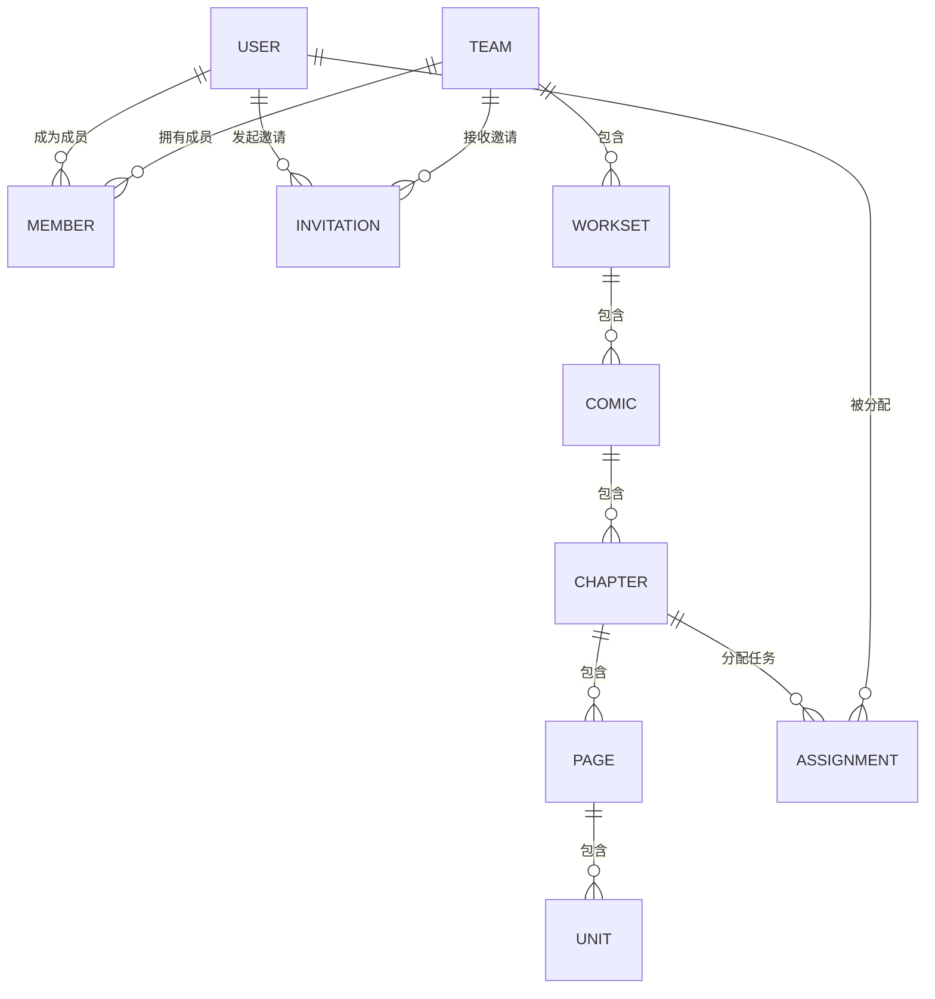
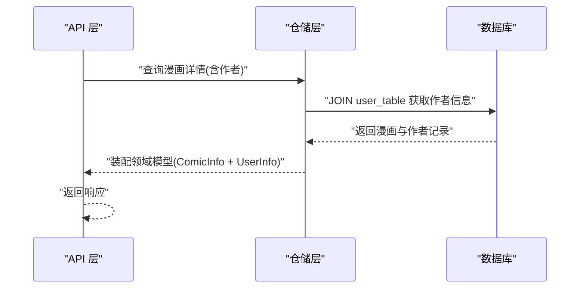
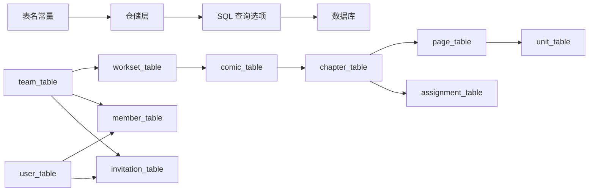

# 表关系设计

<cite>
**本文引用的文件**
- [20260301065012_team-table.up.sql](file://migrations/20260301065012_team-table.up.sql)
- [20260301065022_user-table.up.sql](file://migrations/20260301065022_user-table.up.sql)
- [20260301075641_member-table.up.sql](file://migrations/20260301075641_member-table.up.sql)
- [20260301075642_invitation-table.up.sql](file://migrations/20260301075642_invitation-table.up.sql)
- [20260306101211_workset-table.up.sql](file://migrations/20260306101211_workset-table.up.sql)
- [20260306101212_comic-table.up.sql](file://migrations/20260306101212_comic-table.up.sql)
- [20260306101213_chapter-table.up.sql](file://migrations/20260306101213_chapter-table.up.sql)
- [20260306101214_page-table.up.sql](file://migrations/20260306101214_page-table.up.sql)
- [20260306101215_assignment-table.up.sql](file://migrations/20260306101215_assignment-table.up.sql)
- [20260306101216_unit-table.up.sql](file://migrations/20260306101216_unit-table.up.sql)
- [table_names.go](file://internal/infrastructure/repository/table_names.go)
- [workset.go](file://internal/domain/model/workset.go)
- [comic.go](file://internal/domain/model/comic.go)
- [chapter.go](file://internal/domain/model/chapter.go)
- [page.go](file://internal/domain/model/page.go)
- [unit.go](file://internal/domain/model/unit.go)
</cite>

## 目录
1. [引言](#引言)
2. [项目结构](#项目结构)
3. [核心组件](#核心组件)
4. [架构总览](#架构总览)
5. [详细组件分析](#详细组件分析)
6. [依赖分析](#依赖分析)
7. [性能考虑](#性能考虑)
8. [故障排查指南](#故障排查指南)
9. [结论](#结论)
10. [附录](#附录)

## 引言
本文件系统化梳理漫画翻译协作平台的数据表关系设计，覆盖一对一、一对多与多对多关系的建模原则、外键约束与引用完整性保障、级联删除/更新策略、查询选项设计、关联查询优化与 N+1 问题治理，并结合仓储层的关系映射与复杂查询构建方法，给出实体关系图（ERD）、表间关系图与查询路径分析，确保业务逻辑正确性、数据一致性和性能可预期。

## 项目结构
围绕“团队-工作集-漫画-章节-页面-单元”主链路，以及“用户-成员-邀请”的组织关系，形成清晰的层级与关联。迁移脚本定义了表结构、索引与外键约束；领域模型承载跨层的实体信息；仓储层通过统一表名常量与查询选项实现稳定的映射与检索。

```mermaid
graph TB
subgraph "组织层"
U["用户表<br/>user_table"]
T["团队表<br/>team_table"]
M["成员表<br/>member_table"]
I["邀请表<br/>invitation_table"]
end
subgraph "创作层"
W["工作集表<br/>workset_table"]
C["漫画表<br/>comic_table"]
Ch["章节表<br/>chapter_table"]
P["页面表<br/>page_table"]
Un["单元表<br/>unit_table"]
As["任务分配表<br/>assignment_table"]
end
U --> M
T --> M
U --> I
T --> I
T --> W
W --> C
C --> Ch
Ch --> P
P --> Un
Ch --> As
U <-- As
```

图表来源
- [20260301065012_team-table.up.sql:1-16](file://migrations/20260301065012_team-table.up.sql#L1-L16)
- [20260301065022_user-table.up.sql:1-52](file://migrations/20260301065022_user-table.up.sql#L1-L52)
- [20260301075641_member-table.up.sql:1-63](file://migrations/20260301075641_member-table.up.sql#L1-L63)
- [20260301075642_invitation-table.up.sql:1-27](file://migrations/20260301075642_invitation-table.up.sql#L1-L27)
- [20260306101211_workset-table.up.sql:1-19](file://migrations/20260306101211_workset-table.up.sql#L1-L19)
- [20260306101212_comic-table.up.sql:1-37](file://migrations/20260306101212_comic-table.up.sql#L1-L37)
- [20260306101213_chapter-table.up.sql:1-38](file://migrations/20260306101213_chapter-table.up.sql#L1-L38)
- [20260306101214_page-table.up.sql:1-25](file://migrations/20260306101214_page-table.up.sql#L1-L25)
- [20260306101215_assignment-table.up.sql:1-26](file://migrations/20260306101215_assignment-table.up.sql#L1-L26)
- [20260306101216_unit-table.up.sql:1-30](file://migrations/20260306101216_unit-table.up.sql#L1-L30)

章节来源
- [20260301065012_team-table.up.sql:1-16](file://migrations/20260301065012_team-table.up.sql#L1-L16)
- [20260301065022_user-table.up.sql:1-52](file://migrations/20260301065022_user-table.up.sql#L1-L52)
- [20260301075641_member-table.up.sql:1-63](file://migrations/20260301075641_member-table.up.sql#L1-L63)
- [20260301075642_invitation-table.up.sql:1-27](file://migrations/20260301075642_invitation-table.up.sql#L1-L27)
- [20260306101211_workset-table.up.sql:1-19](file://migrations/20260306101211_workset-table.up.sql#L1-L19)
- [20260306101212_comic-table.up.sql:1-37](file://migrations/20260306101212_comic-table.up.sql#L1-L37)
- [20260306101213_chapter-table.up.sql:1-38](file://migrations/20260306101213_chapter-table.up.sql#L1-L38)
- [20260306101214_page-table.up.sql:1-25](file://migrations/20260306101214_page-table.up.sql#L1-L25)
- [20260306101215_assignment-table.up.sql:1-26](file://migrations/20260306101215_assignment-table.up.sql#L1-L26)
- [20260306101216_unit-table.up.sql:1-30](file://migrations/20260306101216_unit-table.up.sql#L1-L30)

## 核心组件
- 组织关系：用户与团队通过成员表建立多对多关系；邀请表用于跨团队的邀请与角色声明。
- 创作关系：工作集承载漫画集合；漫画包含章节；章节包含页面；页面包含单元；任务分配将用户与章节绑定。
- 关系映射：仓储层通过统一表名常量暴露底层表名，避免应用层硬编码裸字符串，提升可维护性与一致性。

章节来源
- [table_names.go:1-18](file://internal/infrastructure/repository/table_names.go#L1-L18)
- [workset.go:1-82](file://internal/domain/model/workset.go#L1-L82)
- [comic.go:1-107](file://internal/domain/model/comic.go#L1-L107)
- [chapter.go:1-260](file://internal/domain/model/chapter.go#L1-L260)
- [page.go:1-134](file://internal/domain/model/page.go#L1-L134)
- [unit.go:1-149](file://internal/domain/model/unit.go#L1-L149)

## 架构总览
下图展示从“组织层”到“创作层”的端到端关系，标注外键约束与典型查询路径。



图表来源
- [20260301065012_team-table.up.sql:1-16](file://migrations/20260301065012_team-table.up.sql#L1-L16)
- [20260301065022_user-table.up.sql:1-52](file://migrations/20260301065022_user-table.up.sql#L1-L52)
- [20260301075641_member-table.up.sql:1-63](file://migrations/20260301075641_member-table.up.sql#L1-L63)
- [20260301075642_invitation-table.up.sql:1-27](file://migrations/20260301075642_invitation-table.up.sql#L1-L27)
- [20260306101211_workset-table.up.sql:1-19](file://migrations/20260306101211_workset-table.up.sql#L1-L19)
- [20260306101212_comic-table.up.sql:1-37](file://migrations/20260306101212_comic-table.up.sql#L1-L37)
- [20260306101213_chapter-table.up.sql:1-38](file://migrations/20260306101213_chapter-table.up.sql#L1-L38)
- [20260306101214_page-table.up.sql:1-25](file://migrations/20260306101214_page-table.up.sql#L1-L25)
- [20260306101215_assignment-table.up.sql:1-26](file://migrations/20260306101215_assignment-table.up.sql#L1-L26)
- [20260306101216_unit-table.up.sql:1-30](file://migrations/20260306101216_unit-table.up.sql#L1-L30)

## 详细组件分析

### 一对一/一对多/多对多关系设计
- 团队-用户：多对多（成员表），用于表达成员角色与归属。
- 工作集-漫画：一对多（一个工作集包含多个漫画）。
- 漫画-章节：一对多（一个漫画包含多个章节）。
- 章节-页面：一对多（一个章节包含多个页面）。
- 页面-单元：一对多（一个页面包含多个单元）。
- 用户-任务分配：多对多（一个用户可被分配到多个章节，一个章节可有多个用户）。

章节来源
- [20260301075641_member-table.up.sql:1-63](file://migrations/20260301075641_member-table.up.sql#L1-L63)
- [20260306101211_workset-table.up.sql:1-19](file://migrations/20260306101211_workset-table.up.sql#L1-L19)
- [20260306101212_comic-table.up.sql:1-37](file://migrations/20260306101212_comic-table.up.sql#L1-L37)
- [20260306101213_chapter-table.up.sql:1-38](file://migrations/20260306101213_chapter-table.up.sql#L1-L38)
- [20260306101214_page-table.up.sql:1-25](file://migrations/20260306101214_page-table.up.sql#L1-L25)
- [20260306101215_assignment-table.up.sql:1-26](file://migrations/20260306101215_assignment-table.up.sql#L1-L26)

### 外键约束与引用完整性
- 团队与工作集：工作集引用团队，删除团队时级联删除工作集。
- 工作集与漫画：漫画引用工作集，删除工作集时级联删除漫画。
- 漫画与章节：章节引用漫画，删除漫画时级联删除章节。
- 章节与页面：页面引用章节，删除章节时级联删除页面。
- 页面与单元：单元引用页面，删除页面时级联删除单元。
- 用户与漫画/章节/页面/单元/任务分配：均采用受限删除（RESTRICT），防止误删创作者或责任人。
- 成员与邀请：成员引用用户与团队，删除用户或团队时级联删除成员；邀请引用用户与团队，删除用户或团队时级联删除邀请。

章节来源
- [20260306101211_workset-table.up.sql:1-19](file://migrations/20260306101211_workset-table.up.sql#L1-L19)
- [20260306101212_comic-table.up.sql:1-37](file://migrations/20260306101212_comic-table.up.sql#L1-L37)
- [20260306101213_chapter-table.up.sql:1-38](file://migrations/20260306101213_chapter-table.up.sql#L1-L38)
- [20260306101214_page-table.up.sql:1-25](file://migrations/20260306101214_page-table.up.sql#L1-L25)
- [20260306101216_unit-table.up.sql:1-30](file://migrations/20260306101216_unit-table.up.sql#L1-L30)
- [20260301065022_user-table.up.sql:1-52](file://migrations/20260301065022_user-table.up.sql#L1-L52)
- [20260301075641_member-table.up.sql:1-63](file://migrations/20260301075641_member-table.up.sql#L1-L63)
- [20260301075642_invitation-table.up.sql:1-27](file://migrations/20260301075642_invitation-table.up.sql#L1-L27)

### 级联删除/更新策略
- 删除父实体时，子实体按需级联删除（工作集、漫画、章节、页面、单元）。
- 删除用户/团队时，成员与邀请按需级联删除。
- 更新外键时遵循数据库约束，避免悬挂引用。

章节来源
- [20260306101211_workset-table.up.sql:1-19](file://migrations/20260306101211_workset-table.up.sql#L1-L19)
- [20260306101212_comic-table.up.sql:1-37](file://migrations/20260306101212_comic-table.up.sql#L1-L37)
- [20260306101213_chapter-table.up.sql:1-38](file://migrations/20260306101213_chapter-table.up.sql#L1-L38)
- [20260306101214_page-table.up.sql:1-25](file://migrations/20260306101214_page-table.up.sql#L1-L25)
- [20260306101216_unit-table.up.sql:1-30](file://migrations/20260306101216_unit-table.up.sql#L1-L30)
- [20260301075641_member-table.up.sql:1-63](file://migrations/20260301075641_member-table.up.sql#L1-L63)
- [20260301075642_invitation-table.up.sql:1-27](file://migrations/20260301075642_invitation-table.up.sql#L1-L27)

### 查询选项设计与关联查询优化
- 查询选项：通过仓储层的查询选项模块（如 chapter、page、unit 等）统一构建过滤、排序与分页条件，避免在应用层散落 SQL 片段。
- 关联查询：优先使用 JOIN 并配合索引，减少往返次数；对 includes 场景（如包含作者、团队等）进行显式选择加载，避免全表扫描。
- N+1 问题：通过批量预加载（batch load）与一次性 JOIN 获取关联对象，避免逐条查询；对频繁访问的维度（如章节统计、页面统计）在实体中缓存计算结果，降低重复计算成本。
- 索引策略：利用唯一索引与复合索引（如漫画与团队的组合索引、章节与索引的组合索引、页面与章节的组合索引等）加速过滤与排序。

章节来源
- [20260306101212_comic-table.up.sql:22-37](file://migrations/20260306101212_comic-table.up.sql#L22-L37)
- [20260306101213_chapter-table.up.sql:31-38](file://migrations/20260306101213_chapter-table.up.sql#L31-L38)
- [20260306101214_page-table.up.sql:20-25](file://migrations/20260306101214_page-table.up.sql#L20-L25)
- [20260306101215_assignment-table.up.sql:18-26](file://migrations/20260306101215_assignment-table.up.sql#L18-L26)
- [20260306101216_unit-table.up.sql:25-30](file://migrations/20260306101216_unit-table.up.sql#L25-L30)

### 复杂查询构建方法
- 统计聚合：在章节与页面层面维护统计字段（如单元总数、已翻译单元数、已校对单元数），通过 UPDATE 或事务内计算减少运行时聚合开销。
- 时间线查询：利用上传、翻译、校对、排版、审核、发布等时间戳字段，结合索引实现高效的时间范围筛选与状态推进追踪。
- 角色与权限：通过成员表与邀请表的联合查询，确定用户在团队内的角色与权限边界，再结合创作链路（工作集-漫画-章节）进行细粒度授权。

章节来源
- [chapter.go:1-260](file://internal/domain/model/chapter.go#L1-L260)
- [page.go:1-134](file://internal/domain/model/page.go#L1-L134)
- [unit.go:1-149](file://internal/domain/model/unit.go#L1-L149)

### 仓储模式中的关系映射实现
- 表名常量：仓储层导出统一的表名常量，屏蔽底层表名变更风险，确保上层装配与查询稳定。
- 实体映射：领域模型承载 includes 语义（如包含作者、团队），仓储层在查询时根据 includes 决定是否 JOIN 关联表并投影必要字段。
- 查询选项：针对不同实体提供查询选项构造器，统一处理过滤、排序、分页与软删除条件（deleted_at IS NULL）。

章节来源
- [table_names.go:1-18](file://internal/infrastructure/repository/table_names.go#L1-L18)
- [workset.go:1-82](file://internal/domain/model/workset.go#L1-L82)
- [comic.go:1-107](file://internal/domain/model/comic.go#L1-L107)
- [chapter.go:1-260](file://internal/domain/model/chapter.go#L1-L260)
- [page.go:1-134](file://internal/domain/model/page.go#L1-L134)
- [unit.go:1-149](file://internal/domain/model/unit.go#L1-L149)

### 查询路径分析
以下序列图展示“获取漫画详情并包含作者信息”的典型流程，体现 includes 与 JOIN 的协同。



图表来源
- [20260306101212_comic-table.up.sql:1-37](file://migrations/20260306101212_comic-table.up.sql#L1-L37)
- [20260301065022_user-table.up.sql:1-52](file://migrations/20260301065022_user-table.up.sql#L1-L52)

## 依赖分析
- 外键依赖链：团队 → 工作集 → 漫画 → 章节 → 页面 → 单元；章节 → 任务分配；用户 → 成员/邀请/创作实体。
- 索引依赖：唯一索引保障业务唯一性（如漫画与团队索引、页面与章节索引、邀请码唯一等）；复合索引支撑高频查询（如漫画按团队与创建时间排序、页面按章节检索等）。
- 仓储依赖：统一表名常量向上暴露，降低耦合；查询选项模块向下抽象 SQL 构造，提升可测试性与可维护性。



图表来源
- [table_names.go:1-18](file://internal/infrastructure/repository/table_names.go#L1-L18)
- [20260306101211_workset-table.up.sql:1-19](file://migrations/20260306101211_workset-table.up.sql#L1-L19)
- [20260306101212_comic-table.up.sql:1-37](file://migrations/20260306101212_comic-table.up.sql#L1-L37)
- [20260306101213_chapter-table.up.sql:1-38](file://migrations/20260306101213_chapter-table.up.sql#L1-L38)
- [20260306101214_page-table.up.sql:1-25](file://migrations/20260306101214_page-table.up.sql#L1-L25)
- [20260306101216_unit-table.up.sql:1-30](file://migrations/20260306101216_unit-table.up.sql#L1-L30)
- [20260306101215_assignment-table.up.sql:1-26](file://migrations/20260306101215_assignment-table.up.sql#L1-L26)
- [20260301065022_user-table.up.sql:1-52](file://migrations/20260301065022_user-table.up.sql#L1-L52)
- [20260301075641_member-table.up.sql:1-63](file://migrations/20260301075641_member-table.up.sql#L1-L63)
- [20260301075642_invitation-table.up.sql:1-27](file://migrations/20260301075642_invitation-table.up.sql#L1-L27)

## 性能考虑
- 索引优化：为高频过滤与排序字段建立复合索引；对软删除场景添加条件索引（WHERE deleted_at IS NULL）。
- 批量加载：对 includes 场景使用一次性 JOIN 或批量预加载，避免 N+1；对统计类字段进行物化或定期刷新。
- 查询裁剪：仅投影必要字段，避免 SELECT *；对大文本字段（如描述、翻译内容）按需加载。
- 缓存策略：对只读或低频变更的维度（如团队信息、用户头像状态）引入缓存，减少数据库压力。
- 分页与排序：对长列表使用基于游标或基于偏移的分页，结合合适索引控制延迟。

## 故障排查指南
- 外键冲突：尝试删除/更新失败时，检查是否存在子记录未清理；确认是否违反 RESTRICT 约束。
- 唯一约束冲突：当插入漫画或页面时出现唯一冲突，检查组合索引（如团队+索引、章节+索引）是否重复。
- 查询性能异常：确认是否命中复合索引；检查 includes 是否导致过多 JOIN；评估是否需要物化统计字段。
- 软删除影响：涉及软删除的查询需带上 deleted_at 条件，避免返回历史记录。

## 结论
本设计以“组织-创作”双轴为主线，通过明确的一对一/一对多/多对多关系、严谨的外键约束与引用完整性、合理的索引与查询选项设计，实现了可扩展、可维护且高性能的数据层。结合仓储层的统一表名与查询选项抽象，进一步提升了跨层协作的稳定性与可测试性。

## 附录
- 关键索引清单
  - 漫画：团队+索引唯一索引；团队+创建时间降序索引；作者索引；最后活跃时间索引。
  - 章节：漫画+索引唯一索引；漫画索引。
  - 页面：章节+索引唯一索引；章节索引。
  - 任务分配：章节+用户唯一索引；章节索引；用户索引。
  - 单元：页面+索引唯一索引；页面索引。
  - 成员：用户索引；团队索引；各类角色时间索引。
  - 邀请：团队+创建时间降序索引；邀请码唯一索引。
  - 用户：名称 GIN 索引；QQ 唯一索引；创建/更新时间索引。

章节来源
- [20260306101212_comic-table.up.sql:22-37](file://migrations/20260306101212_comic-table.up.sql#L22-L37)
- [20260306101213_chapter-table.up.sql:31-38](file://migrations/20260306101213_chapter-table.up.sql#L31-L38)
- [20260306101214_page-table.up.sql:20-25](file://migrations/20260306101214_page-table.up.sql#L20-L25)
- [20260306101215_assignment-table.up.sql:18-26](file://migrations/20260306101215_assignment-table.up.sql#L18-L26)
- [20260306101216_unit-table.up.sql:25-30](file://migrations/20260306101216_unit-table.up.sql#L25-L30)
- [20260301075641_member-table.up.sql:21-62](file://migrations/20260301075641_member-table.up.sql#L21-L62)
- [20260301075642_invitation-table.up.sql:24-27](file://migrations/20260301075642_invitation-table.up.sql#L24-L27)
- [20260301065022_user-table.up.sql:19-34](file://migrations/20260301065022_user-table.up.sql#L19-L34)