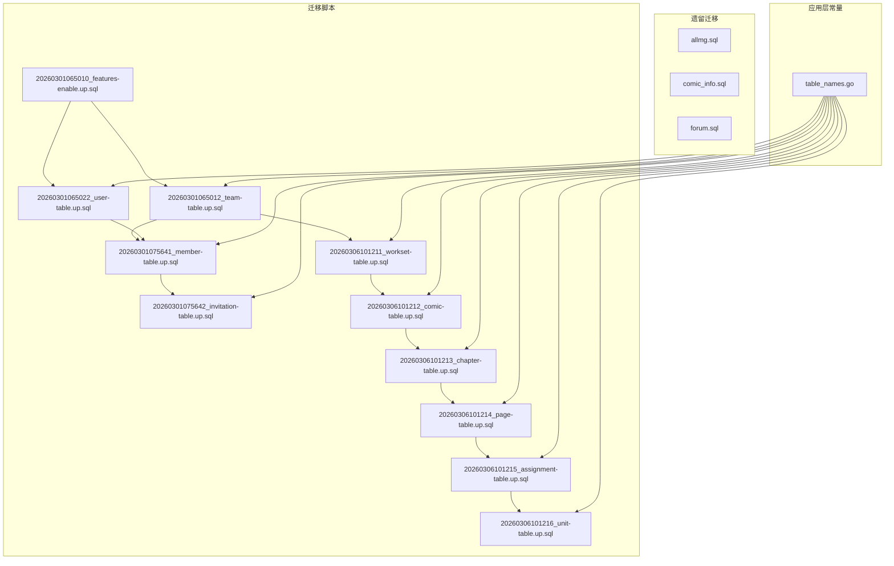
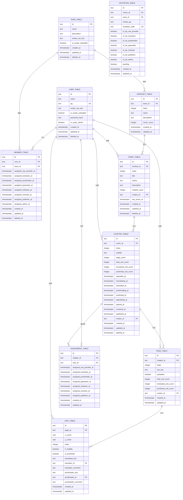
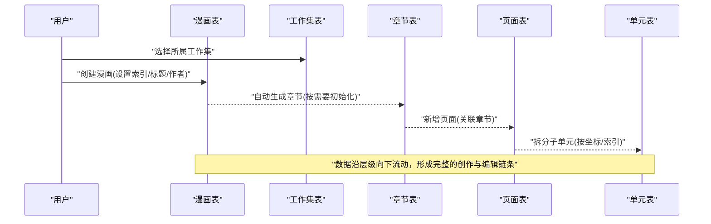
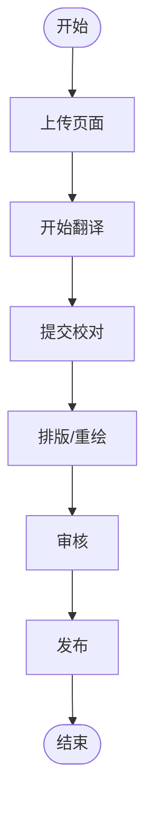
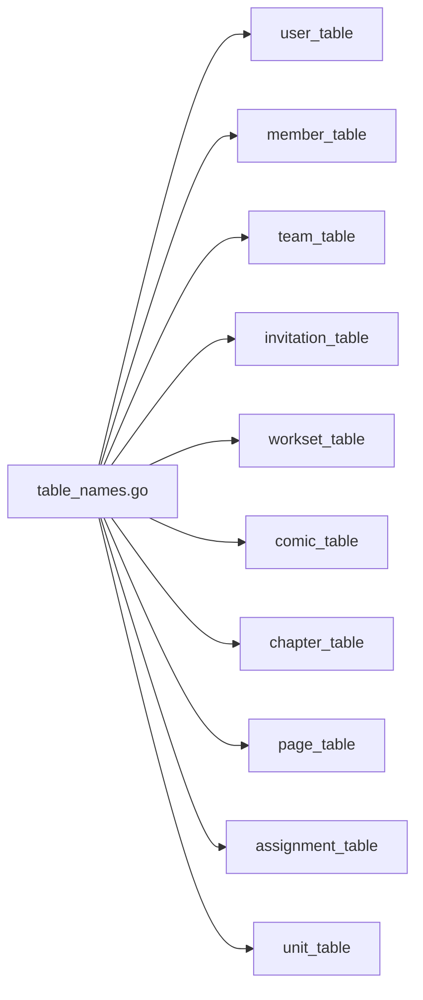

# 表结构总览

<cite>
**本文引用的文件**
- [20260306101211_workset-table.up.sql](file://migrations/20260306101211_workset-table.up.sql)
- [20260306101212_comic-table.up.sql](file://migrations/20260306101212_comic-table.up.sql)
- [20260306101213_chapter-table.up.sql](file://migrations/20260306101213_chapter-table.up.sql)
- [20260306101214_page-table.up.sql](file://migrations/20260306101214_page-table.up.sql)
- [20260306101215_assignment-table.up.sql](file://migrations/20260306101215_assignment-table.up.sql)
- [20260306101216_unit-table.up.sql](file://migrations/20260306101216_unit-table.up.sql)
- [20260301065012_team-table.up.sql](file://migrations/20260301065012_team-table.up.sql)
- [20260301065022_user-table.up.sql](file://migrations/20260301065022_user-table.up.sql)
- [20260301075641_member-table.up.sql](file://migrations/20260301075641_member-table.up.sql)
- [20260301075642_invitation-table.up.sql](file://migrations/20260301075642_invitation-table.up.sql)
- [20260301065010_features-enable.up.sql](file://migrations/20260301065010_features-enable.up.sql)
- [table_names.go](file://internal/infrastructure/repository/table_names.go)
- [allmg.sql](file://legacy/migrations/allmg.sql)
- [comic_info.sql](file://legacy/migrations/comic_info.sql)
- [forum.sql](file://legacy/migrations/forum.sql)
</cite>

## 目录
1. [简介](#简介)
2. [项目结构](#项目结构)
3. [核心表概览](#核心表概览)
4. [架构总览](#架构总览)
5. [详细组件分析](#详细组件分析)
6. [依赖分析](#依赖分析)
7. [性能考量](#性能考量)
8. [故障排查指南](#故障排查指南)
9. [结论](#结论)
10. [附录](#附录)

## 简介
本文件为 poprako-web-ms 项目的数据库表结构总览，聚焦当前已落地的业务表与迁移脚本，提供核心表的基本信息、表间关系、命名规范与设计原则，并给出整体架构图与数据流向示意。同时，对历史遗留表进行简要说明，帮助读者理解演进路径与后续文档导航。

## 项目结构
数据库相关代码主要分布在以下位置：
- migrations：按时间顺序组织的数据库迁移脚本，定义了当前业务表结构与索引。
- legacy/migrations：历史遗留表结构定义，用于理解演进背景。
- internal/infrastructure/repository/table_names.go：导出统一的表名常量，避免在应用层直接使用裸字符串。

图表来源
- [20260301065010_features-enable.up.sql:1-2](file://migrations/20260301065010_features-enable.up.sql#L1-L2)
- [20260301065012_team-table.up.sql:1-16](file://migrations/20260301065012_team-table.up.sql#L1-L16)
- [20260301065022_user-table.up.sql:1-52](file://migrations/20260301065022_user-table.up.sql#L1-L52)
- [20260301075641_member-table.up.sql:1-63](file://migrations/20260301075641_member-table.up.sql#L1-L63)
- [20260301075642_invitation-table.up.sql:1-27](file://migrations/20260301075642_invitation-table.up.sql#L1-L27)
- [20260306101211_workset-table.up.sql:1-19](file://migrations/20260306101211_workset-table.up.sql#L1-L19)
- [20260306101212_comic-table.up.sql:1-37](file://migrations/20260306101212_comic-table.up.sql#L1-L37)
- [20260306101213_chapter-table.up.sql:1-38](file://migrations/20260306101213_chapter-table.up.sql#L1-L38)
- [20260306101214_page-table.up.sql:1-25](file://migrations/20260306101214_page-table.up.sql#L1-L25)
- [20260306101215_assignment-table.up.sql:1-26](file://migrations/20260306101215_assignment-table.up.sql#L1-L26)
- [20260306101216_unit-table.up.sql:1-30](file://migrations/20260306101216_unit-table.up.sql#L1-L30)
- [table_names.go:1-18](file://internal/infrastructure/repository/table_names.go#L1-L18)

章节来源
- [20260301065010_features-enable.up.sql:1-2](file://migrations/20260301065010_features-enable.up.sql#L1-L2)
- [table_names.go:1-18](file://internal/infrastructure/repository/table_names.go#L1-L18)

## 核心表概览
以下为核心业务表的职责与关键字段定位（以“表名”、“主要用途”、“在系统中的作用”三列呈现）。具体字段定义请参考对应迁移脚本。

- 用户表
  - 主要用途：存储用户基本信息、认证凭据与头像等元数据。
  - 在系统中的作用：作为团队成员、作品创建者、任务分配对象的基础身份实体。
  - 关键索引：基于名称的模糊匹配索引、QQ 唯一索引、时间倒序索引等。
  - 参考路径：[用户表迁移:1-52](file://migrations/20260301065022_user-table.up.sql#L1-L52)

- 团队表
  - 主要用途：描述工作团队，支持头像上传标记与软删除。
  - 在系统中的作用：承载成员关系与工作集归属的顶层组织单元。
  - 参考路径：[团队表迁移:1-16](file://migrations/20260301065012_team-table.up.sql#L1-L16)

- 成员表
  - 主要用途：记录用户在团队内的角色与分配状态。
  - 在系统中的作用：连接用户与团队，体现成员在不同环节的职责。
  - 参考路径：[成员表迁移:1-63](file://migrations/20260301075641_member-table.up.sql#L1-L63)

- 邀请表
  - 主要用途：管理邀请码、被邀请人 QQ 与目标角色，以及邀请状态。
  - 在系统中的作用：支撑团队招募流程与权限发放。
  - 参考路径：[邀请表迁移:1-27](file://migrations/20260301075642_invitation-table.up.sql#L1-L27)

- 工作集表
  - 主要用途：在团队内对作品进行分组管理，具备排序索引。
  - 在系统中的作用：作为作品集合的容器，便于批量管理与展示。
  - 参考路径：[工作集表迁移:1-19](file://migrations/20260306101211_workset-table.up.sql#L1-L19)

- 漫画表
  - 主要用途：描述具体作品的标题、作者、统计计数与创建者。
  - 在系统中的作用：承载章节与创作流程的起点。
  - 参考路径：[漫画表迁移:1-37](file://migrations/20260306101212_comic-table.up.sql#L1-L37)

- 章节表
  - 主要用途：记录漫画的分章信息与多阶段状态时间戳。
  - 在系统中的作用：承载页面与任务分配的中间层级。
  - 参考路径：[章节表迁移:1-38](file://migrations/20260306101213_chapter-table.up.sql#L1-L38)

- 页面表
  - 主要用途：记录章节内的页面级资源与单位统计。
  - 在系统中的作用：承载单元切片的物理载体。
  - 参考路径：[页面表迁移:1-25](file://migrations/20260306101214_page-table.up.sql#L1-L25)

- 任务分配表
  - 主要用途：记录用户在章节上的职责分配时间线。
  - 在系统中的作用：追踪各环节负责人与时序。
  - 参考路径：[任务分配表迁移:1-26](file://migrations/20260306101215_assignment-table.up.sql#L1-L26)

- 单元表
  - 主要用途：记录页面内可翻译/校对的文本单元及其处理状态。
  - 在系统中的作用：最小粒度的编辑与审核对象。
  - 参考路径：[单元表迁移:1-30](file://migrations/20260306101216_unit-table.up.sql#L1-L30)

章节来源
- [20260301065022_user-table.up.sql:1-52](file://migrations/20260301065022_user-table.up.sql#L1-L52)
- [20260301065012_team-table.up.sql:1-16](file://migrations/20260301065012_team-table.up.sql#L1-L16)
- [20260301075641_member-table.up.sql:1-63](file://migrations/20260301075641_member-table.up.sql#L1-L63)
- [20260301075642_invitation-table.up.sql:1-27](file://migrations/20260301075642_invitation-table.up.sql#L1-L27)
- [20260306101211_workset-table.up.sql:1-19](file://migrations/20260306101211_workset-table.up.sql#L1-L19)
- [20260306101212_comic-table.up.sql:1-37](file://migrations/20260306101212_comic-table.up.sql#L1-L37)
- [20260306101213_chapter-table.up.sql:1-38](file://migrations/20260306101213_chapter-table.up.sql#L1-L38)
- [20260306101214_page-table.up.sql:1-25](file://migrations/20260306101214_page-table.up.sql#L1-L25)
- [20260306101215_assignment-table.up.sql:1-26](file://migrations/20260306101215_assignment-table.up.sql#L1-L26)
- [20260306101216_unit-table.up.sql:1-30](file://migrations/20260306101216_unit-table.up.sql#L1-L30)

## 架构总览
下图展示了从团队到单元的完整数据层次与流向，以及关键外键约束方向：

图表来源
- [20260301065012_team-table.up.sql:1-16](file://migrations/20260301065012_team-table.up.sql#L1-L16)
- [20260301065022_user-table.up.sql:1-52](file://migrations/20260301065022_user-table.up.sql#L1-L52)
- [20260301075641_member-table.up.sql:1-63](file://migrations/20260301075641_member-table.up.sql#L1-L63)
- [20260301075642_invitation-table.up.sql:1-27](file://migrations/20260301075642_invitation-table.up.sql#L1-L27)
- [20260306101211_workset-table.up.sql:1-19](file://migrations/20260306101211_workset-table.up.sql#L1-L19)
- [20260306101212_comic-table.up.sql:1-37](file://migrations/20260306101212_comic-table.up.sql#L1-L37)
- [20260306101213_chapter-table.up.sql:1-38](file://migrations/20260306101213_chapter-table.up.sql#L1-L38)
- [20260306101214_page-table.up.sql:1-25](file://migrations/20260306101214_page-table.up.sql#L1-L25)
- [20260306101215_assignment-table.up.sql:1-26](file://migrations/20260306101215_assignment-table.up.sql#L1-L26)
- [20260306101216_unit-table.up.sql:1-30](file://migrations/20260306101216_unit-table.up.sql#L1-L30)

## 详细组件分析

### 表命名规范与设计原则
- 统一采用小写下划线风格的表名与字段名，便于跨数据库一致性与工具链兼容。
- 使用复数形式表达集合类实体（如 workset_table），单数形式表达单体实体（如 user_table）。
- 外键命名遵循“被引用表名_字段”模式，确保可读性与维护性。
- 软删除通过 deleted_at 字段实现，配合索引条件过滤未删除记录，保证查询安全。
- 时间戳统一使用带时区类型，确保跨时区场景下的正确性与可追溯性。
- 全局启用文本相似度扩展，为用户名称等字段提供模糊匹配能力。

章节来源
- [20260301065010_features-enable.up.sql:1-2](file://migrations/20260301065010_features-enable.up.sql#L1-L2)
- [20260301065022_user-table.up.sql:1-52](file://migrations/20260301065022_user-table.up.sql#L1-L52)
- [20260301065012_team-table.up.sql:1-16](file://migrations/20260301065012_team-table.up.sql#L1-L16)

### 数据库架构图与数据流向
下图以序列化方式展示典型业务流程的数据流向（以“创建漫画并生成章节、页面与单元”的主线为例）：

图表来源
- [20260306101211_workset-table.up.sql:1-19](file://migrations/20260306101211_workset-table.up.sql#L1-L19)
- [20260306101212_comic-table.up.sql:1-37](file://migrations/20260306101212_comic-table.up.sql#L1-L37)
- [20260306101213_chapter-table.up.sql:1-38](file://migrations/20260306101213_chapter-table.up.sql#L1-L38)
- [20260306101214_page-table.up.sql:1-25](file://migrations/20260306101214_page-table.up.sql#L1-L25)
- [20260306101216_unit-table.up.sql:1-30](file://migrations/20260306101216_unit-table.up.sql#L1-L30)

### 关键流程与算法示意（以“章节状态推进”为例）

该流程映射到章节表中的多个时间戳字段，体现创作流程的阶段性推进。

图表来源
- [20260306101213_chapter-table.up.sql:1-38](file://migrations/20260306101213_chapter-table.up.sql#L1-L38)

## 依赖分析
- 应用层通过统一的表名常量访问底层表，避免硬编码带来的维护风险。
- 迁移脚本按时间顺序组织，形成稳定的演进路径；历史遗留表与当前业务表并存，需注意兼容与清理策略。
- 外键约束确保数据完整性，删除策略覆盖级联删除与限制删除两类，分别用于强约束与保护性约束。

图表来源
- [table_names.go:1-18](file://internal/infrastructure/repository/table_names.go#L1-L18)

章节来源
- [table_names.go:1-18](file://internal/infrastructure/repository/table_names.go#L1-L18)

## 性能考量
- 名称模糊匹配：通过启用文本相似度扩展与 GIN 索引，提升用户名称检索效率。
- 删除过滤：所有涉及软删除的索引均带有“deleted_at IS NULL”的条件，避免扫描已删除行。
- 时间倒序索引：用户与漫画列表常用按创建/更新时间倒序的查询，相应索引可显著降低排序成本。
- 唯一索引：在组合字段（如 team_id+index、comic_id+index、chapter_id+index、page_id+index）上建立唯一索引，保障业务语义与并发安全性。

章节来源
- [20260301065010_features-enable.up.sql:1-2](file://migrations/20260301065010_features-enable.up.sql#L1-L2)
- [20260301065022_user-table.up.sql:1-52](file://migrations/20260301065022_user-table.up.sql#L1-L52)
- [20260306101212_comic-table.up.sql:1-37](file://migrations/20260306101212_comic-table.up.sql#L1-L37)
- [20260306101213_chapter-table.up.sql:1-38](file://migrations/20260306101213_chapter-table.up.sql#L1-L38)
- [20260306101214_page-table.up.sql:1-25](file://migrations/20260306101214_page-table.up.sql#L1-L25)

## 故障排查指南
- 索引缺失导致慢查询：检查是否缺少针对查询条件的索引（如 team_id、creator_id、chapter_id 等）。
- 软删除误删：确认 deleted_at 条件是否正确应用，避免返回已删除记录。
- 外键冲突：当尝试删除或修改被引用记录时，检查删除策略与引用关系，必要时先清理下游数据。
- 名称搜索异常：确认已启用文本相似度扩展且相关索引存在。

章节来源
- [20260301065010_features-enable.up.sql:1-2](file://migrations/20260301065010_features-enable.up.sql#L1-L2)
- [20260306101212_comic-table.up.sql:1-37](file://migrations/20260306101212_comic-table.up.sql#L1-L37)
- [20260306101213_chapter-table.up.sql:1-38](file://migrations/20260306101213_chapter-table.up.sql#L1-L38)
- [20260306101214_page-table.up.sql:1-25](file://migrations/20260306101214_page-table.up.sql#L1-L25)

## 结论
本总览明确了 poprako-web-ms 的数据库核心表与其关系，总结了命名规范与设计原则，并提供了架构图与常见问题排查建议。建议在后续文档中进一步细化每张表的字段说明、索引策略与变更历史，以便团队协作与知识沉淀。

## 附录
- 历史遗留表说明
  - allmg：旧版同步表单定义，用于理解早期数据结构。
  - comic_info：漫画信息表，包含封面、状态与额外 JSON 字段。
  - forum：论坛相关表，用于早期社区功能。
  - 参考路径：
    - [allmg.sql:1-16](file://legacy/migrations/allmg.sql#L1-L16)
    - [comic_info.sql:1-16](file://legacy/migrations/comic_info.sql#L1-L16)
    - [forum.sql:1-11](file://legacy/migrations/forum.sql#L1-L11)

- 迁移时间线与版本演进
  - 20260301065010：启用文本相似度扩展。
  - 20260301065012：团队表。
  - 20260301065022：用户表（含超级管理员预置）。
  - 20260301075641：成员表。
  - 20260301075642：邀请表。
  - 20260306101211：工作集表。
  - 20260306101212：漫画表。
  - 20260306101213：章节表。
  - 20260306101214：页面表。
  - 20260306101215：任务分配表。
  - 20260306101216：单元表。

- 后续详细文档导航
  - 用户与团队：建议优先阅读用户表与团队表的字段与索引设计，再深入成员与邀请表。
  - 内容创作链路：建议按工作集→漫画→章节→页面→单元的顺序展开，结合章节状态推进流程图理解。
  - 索引与性能：结合各表的索引策略，评估查询计划与执行成本。

章节来源
- [allmg.sql:1-16](file://legacy/migrations/allmg.sql#L1-L16)
- [comic_info.sql:1-16](file://legacy/migrations/comic_info.sql#L1-L16)
- [forum.sql:1-11](file://legacy/migrations/forum.sql#L1-L11)
- [20260301065010_features-enable.up.sql:1-2](file://migrations/20260301065010_features-enable.up.sql#L1-L2)
- [20260301065012_team-table.up.sql:1-16](file://migrations/20260301065012_team-table.up.sql#L1-L16)
- [20260301065022_user-table.up.sql:1-52](file://migrations/20260301065022_user-table.up.sql#L1-L52)
- [20260301075641_member-table.up.sql:1-63](file://migrations/20260301075641_member-table.up.sql#L1-L63)
- [20260301075642_invitation-table.up.sql:1-27](file://migrations/20260301075642_invitation-table.up.sql#L1-L27)
- [20260306101211_workset-table.up.sql:1-19](file://migrations/20260306101211_workset-table.up.sql#L1-L19)
- [20260306101212_comic-table.up.sql:1-37](file://migrations/20260306101212_comic-table.up.sql#L1-L37)
- [20260306101213_chapter-table.up.sql:1-38](file://migrations/20260306101213_chapter-table.up.sql#L1-L38)
- [20260306101214_page-table.up.sql:1-25](file://migrations/20260306101214_page-table.up.sql#L1-L25)
- [20260306101215_assignment-table.up.sql:1-26](file://migrations/20260306101215_assignment-table.up.sql#L1-L26)
- [20260306101216_unit-table.up.sql:1-30](file://migrations/20260306101216_unit-table.up.sql#L1-L30)