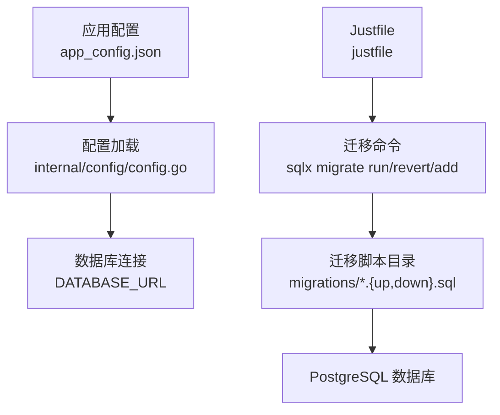
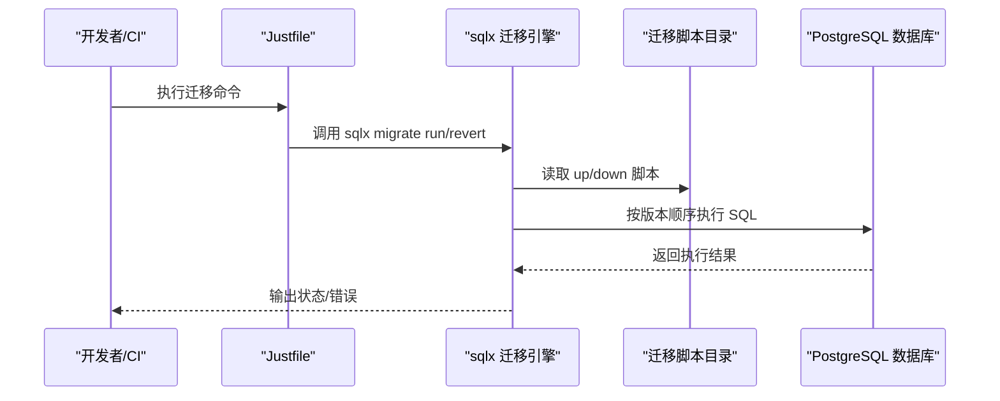
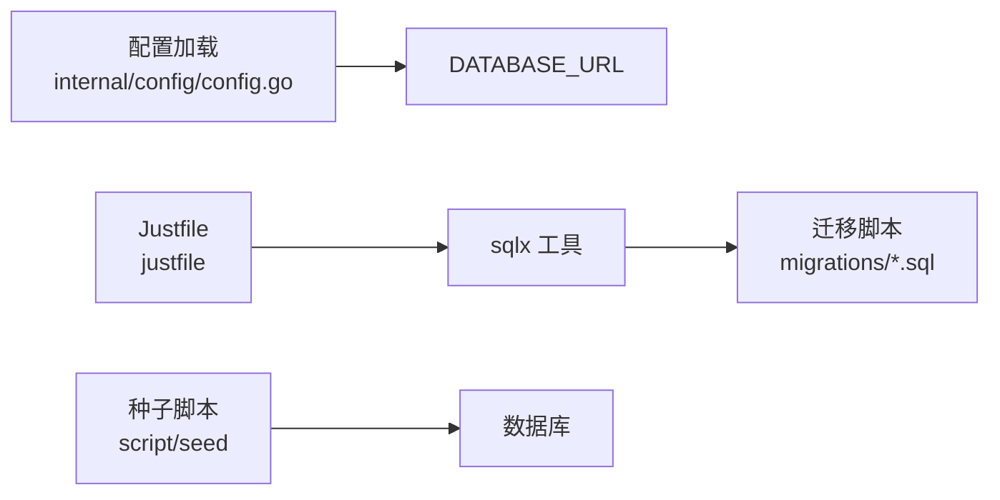

# 迁移管理

<cite>
**本文引用的文件**
- [migrations/20260301065010_features-enable.up.sql](file://migrations/20260301065010_features-enable.up.sql)
- [migrations/20260301065010_features-enable.down.sql](file://migrations/20260301065010_features-enable.down.sql)
- [migrations/20260301065012_team-table.up.sql](file://migrations/20260301065012_team-table.up.sql)
- [migrations/20260301065012_team-table.down.sql](file://migrations/20260301065012_team-table.down.sql)
- [migrations/20260301065022_user-table.up.sql](file://migrations/20260301065022_user-table.up.sql)
- [migrations/20260301075641_member-table.up.sql](file://migrations/20260301075641_member-table.up.sql)
- [migrations/20260306101211_workset-table.up.sql](file://migrations/20260306101211_workset-table.up.sql)
- [migrations/20260306101212_comic-table.up.sql](file://migrations/20260306101212_comic-table.up.sql)
- [migrations/20260306101213_chapter-table.up.sql](file://migrations/20260306101213_chapter-table.up.sql)
- [migrations/20260306101214_page-table.up.sql](file://migrations/20260306101214_page-table.up.sql)
- [migrations/20260306101215_assignment-table.up.sql](file://migrations/20260306101215_assignment-table.up.sql)
- [migrations/20260306101216_unit-table.up.sql](file://migrations/20260306101216_unit-table.up.sql)
- [legacy/migrations/allmg.sql](file://legacy/migrations/allmg.sql)
- [legacy/migrations/comic_info.sql](file://legacy/migrations/comic_info.sql)
- [legacy/migrations/forum.sql](file://legacy/migrations/forum.sql)
- [justfile](file://justfile)
- [internal/config/config.go](file://internal/config/config.go)
- [app_config.json](file://app_config.json)
- [script/seed/README.md](file://script/seed/README.md)
- [script/seed/config.ts](file://script/seed/config.ts)
</cite>

## 目录
1. [简介](#简介)
2. [项目结构](#项目结构)
3. [核心组件](#核心组件)
4. [架构总览](#架构总览)
5. [详细组件分析](#详细组件分析)
6. [依赖分析](#依赖分析)
7. [性能考虑](#性能考虑)
8. [故障排查指南](#故障排查指南)
9. [结论](#结论)
10. [附录](#附录)

## 简介
本文件系统化梳理漫画翻译协作平台的数据库迁移管理实践，覆盖迁移脚本命名规范、版本号与执行顺序、up/down 设计原则与回滚保障、事务与错误恢复、状态管理、迁移前后验证与性能回归流程，以及开发/测试/生产三类环境的差异化策略。同时给出自动化迁移工具集成、CI/CD 流水线中的迁移执行与紧急回滚预案。

## 项目结构
- 迁移脚本位于 migrations 目录，采用“时间戳+描述”的命名方式，每个 up 脚本配套一个 down 脚本，确保可逆性。
- legacy/migrations 存放历史遗留 SQL 定义，用于参考或迁移导入。
- justfile 提供迁移相关的 Just 命令，封装 sqlx 工具调用，便于本地开发与 CI 执行。
- 应用配置通过 internal/config 加载 JSON 配置与环境变量，其中 DATABASE_URL 作为数据库连接来源；app_config.json 提供基础运行参数。

图表来源
- [justfile](file://justfile)
- [internal/config/config.go](file://internal/config/config.go)
- [app_config.json](file://app_config.json)

章节来源
- [justfile](file://justfile)
- [internal/config/config.go](file://internal/config/config.go)
- [app_config.json](file://app_config.json)

## 核心组件
- 迁移脚本：按时间戳前缀排序，up 负责升级，down 负责回滚；每个表级变更均配套索引与约束定义。
- 命名与版本：以“YYYYMMDDHHMMSS_描述”命名，确保全局唯一且天然有序。
- 执行顺序：由 sqlx 按版本号升序执行 up；回滚按相反顺序执行 down。
- 回滚机制：每个 up 对应 down，删除表、索引、扩展等，保证幂等与可重复执行。
- 事务与错误恢复：建议在单个 up 中使用事务包裹，失败时整体回滚；错误记录与状态检查结合 Just 命令返回码进行治理。
- 状态管理：通过 sqlx 内部版本表跟踪已执行版本，避免重复执行。
- 数据安全：up 中包含必要的预置数据（如超级管理员），down 中清理；涉及数据变更时需谨慎设计。

章节来源
- [migrations/20260301065010_features-enable.up.sql](file://migrations/20260301065010_features-enable.up.sql)
- [migrations/20260301065010_features-enable.down.sql](file://migrations/20260301065010_features-enable.down.sql)
- [migrations/20260301065012_team-table.up.sql](file://migrations/20260301065012_team-table.up.sql)
- [migrations/20260301065012_team-table.down.sql](file://migrations/20260301065012_team-table.down.sql)
- [migrations/20260301065022_user-table.up.sql](file://migrations/20260301065022_user-table.up.sql)
- [migrations/20260301075641_member-table.up.sql](file://migrations/20260301075641_member-table.up.sql)
- [migrations/20260306101211_workset-table.up.sql](file://migrations/20260306101211_workset-table.up.sql)
- [migrations/20260306101212_comic-table.up.sql](file://migrations/20260306101212_comic-table.up.sql)
- [migrations/20260306101213_chapter-table.up.sql](file://migrations/20260306101213_chapter-table.up.sql)
- [migrations/20260306101214_page-table.up.sql](file://migrations/20260306101214_page-table.up.sql)
- [migrations/20260306101215_assignment-table.up.sql](file://migrations/20260306101215_assignment-table.up.sql)
- [migrations/20260306101216_unit-table.up.sql](file://migrations/20260306101216_unit-table.up.sql)

## 架构总览
下图展示从配置到迁移执行再到数据库的状态演进：

图表来源
- [justfile](file://justfile)
- [migrations/20260301065010_features-enable.up.sql](file://migrations/20260301065010_features-enable.up.sql)
- [migrations/20260301065010_features-enable.down.sql](file://migrations/20260301065010_features-enable.down.sql)

## 详细组件分析

### 命名规范与版本管理
- 命名规则：YYYYMMDDHHMMSS_描述，确保全局唯一且天然有序。
- 版本号管理：由文件名前缀决定；sqlx 按版本号升序执行 up，降序执行 down。
- 执行顺序控制：通过 Just 命令封装，支持一次性执行全部或逐步回滚。

章节来源
- [justfile](file://justfile)

### up/down 脚本设计原则
- 可逆性：每个 up 必须有对应的 down，删除表、索引、扩展等。
- 幂等性：多次执行不产生副作用；例如 CREATE TABLE IF NOT EXISTS、DROP TABLE IF EXISTS。
- 依赖顺序：先创建被依赖表，再创建带外键的表；外键引用必须指向已存在的主键。
- 约束与索引：up 中定义主键、唯一索引、条件索引；down 中删除对应索引与表。
- 预置数据：up 中可包含必要初始化数据（如超级管理员），down 中清理。

章节来源
- [migrations/20260301065010_features-enable.up.sql](file://migrations/20260301065010_features-enable.up.sql)
- [migrations/20260301065010_features-enable.down.sql](file://migrations/20260301065010_features-enable.down.sql)
- [migrations/20260301065012_team-table.up.sql](file://migrations/20260301065012_team-table.up.sql)
- [migrations/20260301065012_team-table.down.sql](file://migrations/20260301065012_team-table.down.sql)
- [migrations/20260301065022_user-table.up.sql](file://migrations/20260301065022_user-table.up.sql)
- [migrations/20260301075641_member-table.up.sql](file://migrations/20260301075641_member-table.up.sql)
- [migrations/20260306101211_workset-table.up.sql](file://migrations/20260306101211_workset-table.up.sql)
- [migrations/20260306101212_comic-table.up.sql](file://migrations/20260306101212_comic-table.up.sql)
- [migrations/20260306101213_chapter-table.up.sql](file://migrations/20260306101213_chapter-table.up.sql)
- [migrations/20260306101214_page-table.up.sql](file://migrations/20260306101214_page-table.up.sql)
- [migrations/20260306101215_assignment-table.up.sql](file://migrations/20260306101215_assignment-table.up.sql)
- [migrations/20260306101216_unit-table.up.sql](file://migrations/20260306101216_unit-table.up.sql)

### 回滚机制与数据安全
- 回滚路径：按版本倒序执行 down；down 脚本负责删除表、索引、扩展等。
- 数据安全保障：up 中的预置数据在 down 中清理；涉及数据变更时，建议在事务中执行并记录日志。
- 幂等与一致性：down 应能处理 up 未执行的情况（如 IF EXISTS）。

章节来源
- [migrations/20260301065010_features-enable.down.sql](file://migrations/20260301065010_features-enable.down.sql)
- [migrations/20260301065012_team-table.down.sql](file://migrations/20260301065012_team-table.down.sql)
- [migrations/20260301065022_user-table.up.sql](file://migrations/20260301065022_user-table.up.sql)

### 事务处理、错误恢复与状态管理
- 事务建议：在单个 up 中使用事务包裹，失败则整体回滚，避免部分执行导致状态不一致。
- 错误恢复：结合 Just 命令返回码与日志输出，定位失败版本并重试或人工干预。
- 状态管理：sqlx 维护迁移版本状态，避免重复执行；可通过 revert 清理目标版本。

章节来源
- [justfile](file://justfile)

### 迁移前的数据备份与迁移后的完整性验证
- 迁移前备份：在生产环境执行迁移前进行逻辑备份或物理快照，确保可回滚。
- 完整性验证：执行迁移后校验关键表结构、索引存在性与数据一致性；对预置数据进行核对。
- 性能回归测试：在测试环境执行迁移后，运行基准测试与压力测试，确认无显著退化。

（本节为通用实践指导，无需特定文件引用）

### 开发、测试、生产环境的迁移策略差异
- 开发环境：快速迭代，允许频繁迁移；建议使用 Just 命令一键执行；可接受较小风险。
- 测试环境：模拟生产，执行完整迁移链路；进行功能与性能回归测试。
- 生产环境：严格审批与灰度发布；迁移窗口最小化；准备紧急回滚预案。

（本节为通用实践指导，无需特定文件引用）

### 自动化迁移工具集成与 CI/CD 流水线
- 工具集成：Justfile 封装 sqlx 命令，统一迁移入口。
- CI/CD 流程：在构建阶段执行迁移；失败即中断流水线；生产部署前进行人工审核。
- 紧急回滚：通过 Justfile 的 revert 命令快速回滚至上一稳定版本。

章节来源
- [justfile](file://justfile)

### 历史遗留迁移参考
- legacy/migrations 下的历史建表语句可用于理解旧有数据结构与迁移导入思路。

章节来源
- [legacy/migrations/allmg.sql](file://legacy/migrations/allmg.sql)
- [legacy/migrations/comic_info.sql](file://legacy/migrations/comic_info.sql)
- [legacy/migrations/forum.sql](file://legacy/migrations/forum.sql)

## 依赖分析
- 配置依赖：应用通过 internal/config 读取 app_config.json 与环境变量，DATABASE_URL 作为数据库连接来源。
- 迁移依赖：justfile 依赖 sqlx 工具；迁移脚本依赖 PostgreSQL 语法与扩展（如 pg_trgm）。
- 种子数据：script/seed 提供初始化数据的脚本与配置，便于本地快速搭建。

图表来源
- [internal/config/config.go](file://internal/config/config.go)
- [justfile](file://justfile)
- [script/seed/README.md](file://script/seed/README.md)
- [script/seed/config.ts](file://script/seed/config.ts)

章节来源
- [internal/config/config.go](file://internal/config/config.go)
- [justfile](file://justfile)
- [script/seed/README.md](file://script/seed/README.md)
- [script/seed/config.ts](file://script/seed/config.ts)

## 性能考虑
- 索引设计：up 中创建必要索引以支撑查询；down 中同步删除，避免冗余索引影响写入性能。
- 批量操作：大表变更建议分批执行，减少锁竞争与长事务。
- 监控与告警：迁移期间监控慢查询与连接池使用率，及时发现异常。

（本节为通用指导，无需特定文件引用）

## 故障排查指南
- 常见问题
  - 迁移失败：检查失败版本的 up 脚本与数据库权限；查看 sqlx 输出与日志。
  - 重复执行：确认 sqlx 版本状态；必要时使用 revert 清理。
  - 权限不足：确保 DATABASE_URL 指向的用户具备 DDL/DML 权限。
- 排查步骤
  - 确认环境变量与配置文件正确加载。
  - 使用 Justfile 的迁移命令逐版本执行或回滚。
  - 对失败版本进行单步调试与日志分析。

章节来源
- [internal/config/config.go](file://internal/config/config.go)
- [justfile](file://justfile)

## 结论
本项目采用清晰的命名与版本管理、严格的 up/down 可逆设计、工具化的 Justfile 封装与 sqlx 引擎，形成了可维护、可追溯、可回滚的迁移体系。结合开发/测试/生产的差异化策略与自动化流水线，能够有效保障数据库演进的安全与稳定。

## 附录
- 迁移脚本清单（按时间顺序）
  - 20260301065010_features-enable
  - 20260301065012_team-table
  - 20260301065022_user-table
  - 20260301075641_member-table
  - 20260301075642_invitation-table
  - 20260306101211_workset-table
  - 20260306101212_comic-table
  - 20260306101213_chapter-table
  - 20260306101214_page-table
  - 20260306101215_assignment-table
  - 20260306101216_unit-table

章节来源
- [migrations/20260301065010_features-enable.up.sql](file://migrations/20260301065010_features-enable.up.sql)
- [migrations/20260301065012_team-table.up.sql](file://migrations/20260301065012_team-table.up.sql)
- [migrations/20260301065022_user-table.up.sql](file://migrations/20260301065022_user-table.up.sql)
- [migrations/20260301075641_member-table.up.sql](file://migrations/20260301075641_member-table.up.sql)
- [migrations/20260301075642_invitation-table.up.sql](file://migrations/20260301075642_invitation-table.up.sql)
- [migrations/20260306101211_workset-table.up.sql](file://migrations/20260306101211_workset-table.up.sql)
- [migrations/20260306101212_comic-table.up.sql](file://migrations/20260306101212_comic-table.up.sql)
- [migrations/20260306101213_chapter-table.up.sql](file://migrations/20260306101213_chapter-table.up.sql)
- [migrations/20260306101214_page-table.up.sql](file://migrations/20260306101214_page-table.up.sql)
- [migrations/20260306101215_assignment-table.up.sql](file://migrations/20260306101215_assignment-table.up.sql)
- [migrations/20260306101216_unit-table.up.sql](file://migrations/20260306101216_unit-table.up.sql)