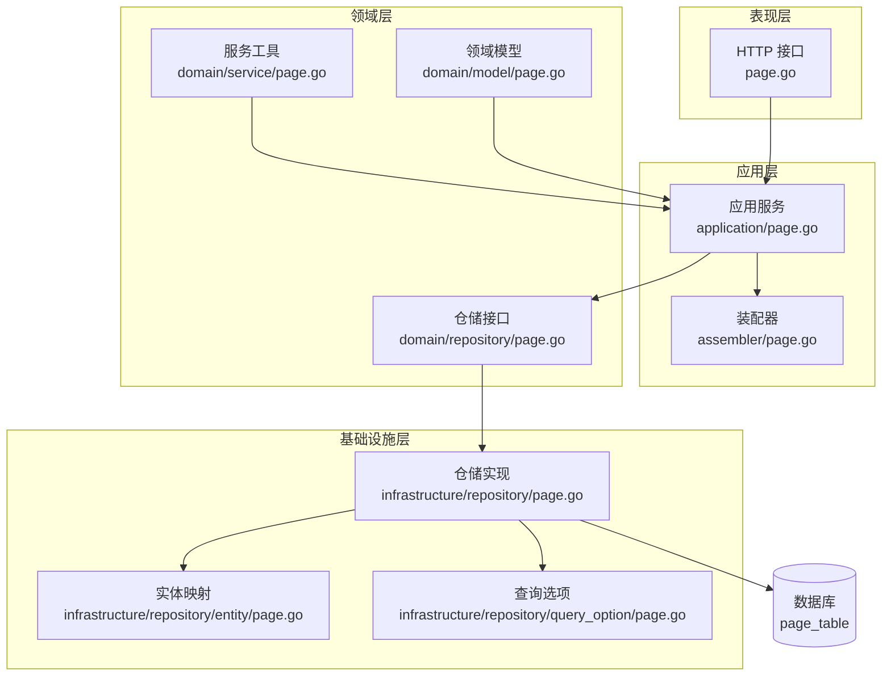
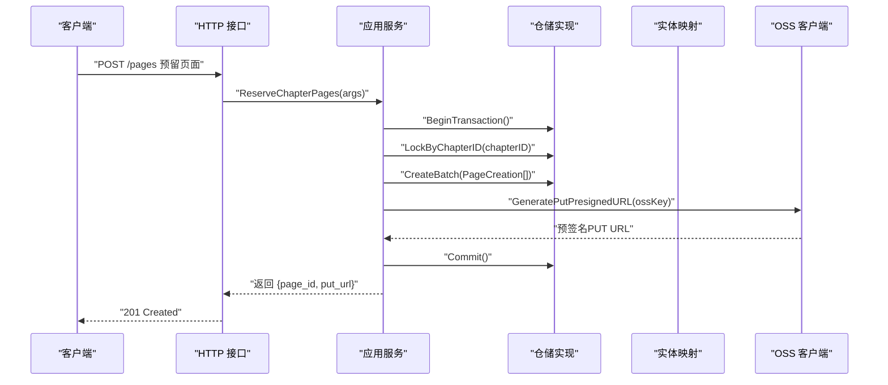
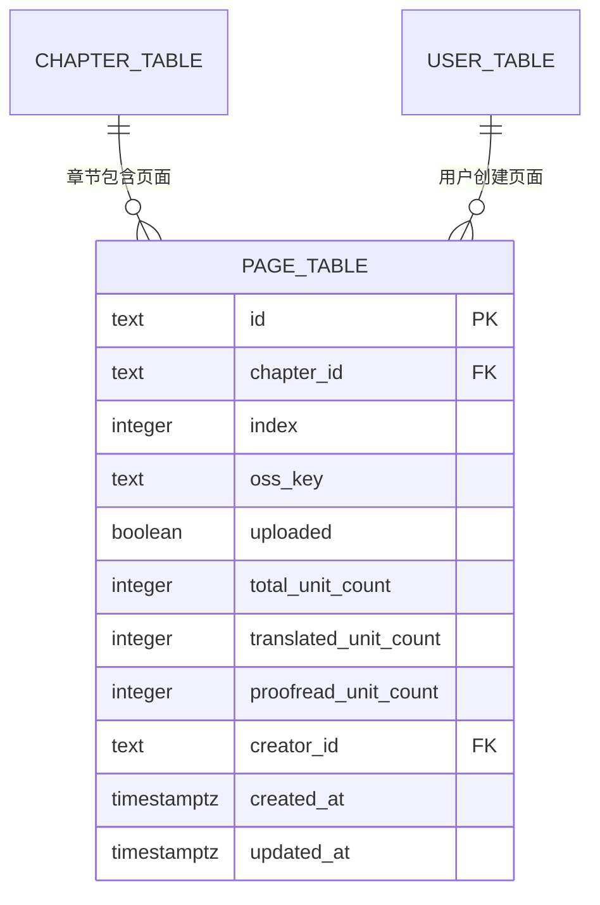
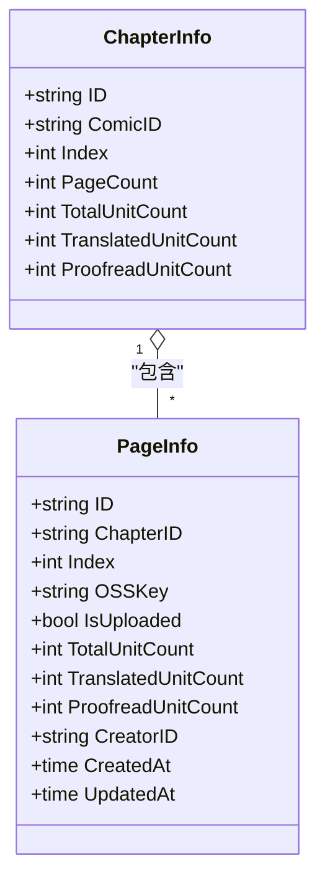
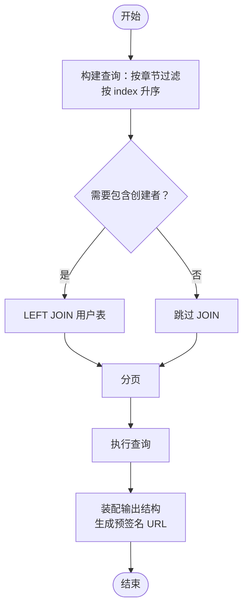
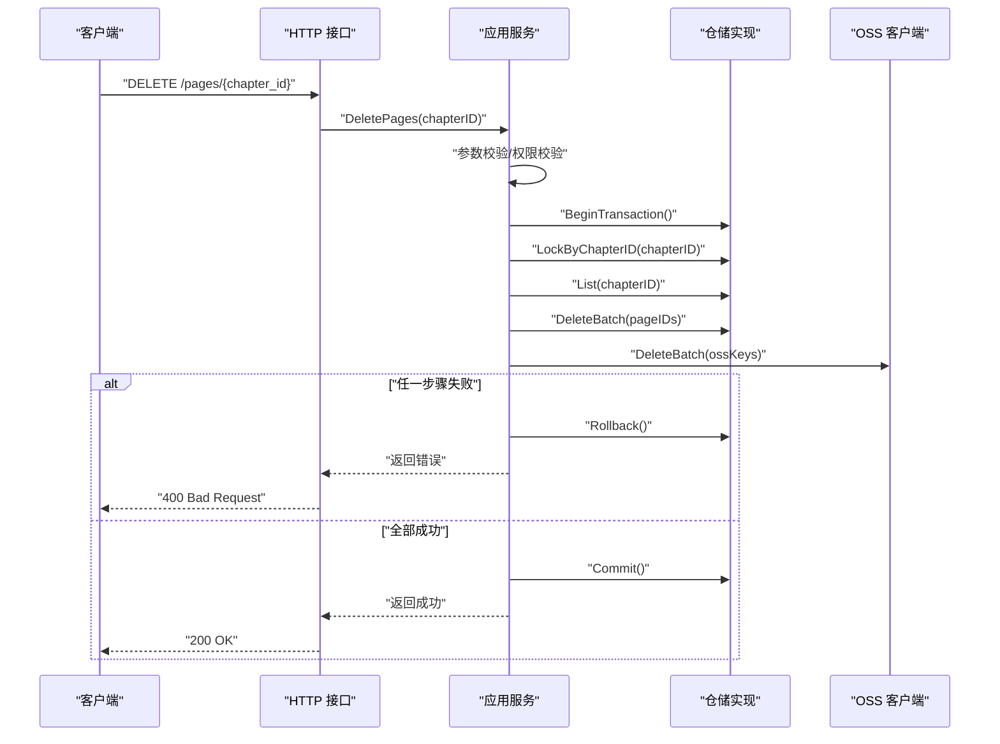
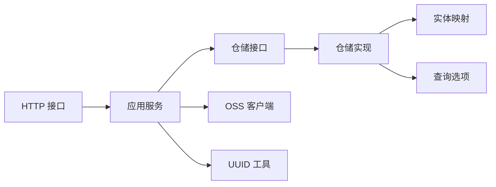

# 页面表设计

<cite>
**本文引用的文件**
- [migrations\20260306101214_page-table.up.sql](file://migrations/20260306101214_page-table.up.sql)
- [internal\domain\model\page.go](file://internal/domain/model/page.go)
- [internal\domain\repository\page.go](file://internal/domain/repository/page.go)
- [internal\application\page.go](file://internal/application/page.go)
- [internal\application\assembler\page.go](file://internal/application/assembler/page.go)
- [internal\api\http\page.go](file://internal/api/http/page.go)
- [internal\infrastructure\repository\page.go](file://internal/infrastructure/repository/page.go)
- [internal\infrastructure\repository\entity\page.go](file://internal/infrastructure/repository/entity/page.go)
- [internal\infrastructure\repository\query_option\page.go](file://internal/infrastructure/repository/query_option/page.go)
- [internal\value\page.go](file://internal/value/page.go)
- [internal\domain\service\page.go](file://internal/domain/service/page.go)
- [internal\domain\model\chapter.go](file://internal/domain/model/chapter.go)
- [internal\application\error.go](file://internal/application/error.go)
- [internal\util\uuid.go](file://internal/util/uuid.go)
</cite>

## 目录
1. [简介](#简介)
2. [项目结构](#项目结构)
3. [核心组件](#核心组件)
4. [架构总览](#架构总览)
5. [详细组件分析](#详细组件分析)
6. [依赖关系分析](#依赖关系分析)
7. [性能考虑](#性能考虑)
8. [故障排查指南](#故障排查指南)
9. [结论](#结论)
10. [附录](#附录)

## 简介
本设计文档围绕页面表（page_table）进行系统化梳理，覆盖表结构设计、字段语义、与章节表的层级关系、索引与检索策略、数据存储与元数据管理、查询模式与性能优化、以及完整性检查与错误处理机制。文档同时给出关键流程的时序图与类图，帮助读者从多维度理解页面数据在应用层、领域层、基础设施层之间的流转。

## 项目结构
页面相关代码按“表现层 → 应用层 → 领域层 → 基础设施层”的分层组织，页面表涉及以下关键文件：
- 数据库迁移：定义页面表结构、唯一约束与索引
- 领域模型：页面信息、统计、创建与更新参数
- 应用服务：页面预留、列表查询、更新、删除等业务流程
- 基础设施：仓储实现、GORM 实体映射、查询选项
- 表现层：HTTP 接口封装
- 值对象：输入参数与对外输出结构
- 工具与服务：UUID 生成、OSS Key 生成

图表来源
- [internal\api\http\page.go:1-189](file://internal/api/http/page.go#L1-L189)
- [internal\application\page.go:1-402](file://internal/application/page.go#L1-L402)
- [internal\application\assembler\page.go:1-34](file://internal/application/assembler/page.go#L1-L34)
- [internal\domain\model\page.go:1-134](file://internal/domain/model/page.go#L1-L134)
- [internal\domain\repository\page.go:1-18](file://internal/domain/repository/page.go#L1-L18)
- [internal\domain\service\page.go:1-8](file://internal/domain/service/page.go#L1-L8)
- [internal\infrastructure\repository\page.go:1-179](file://internal/infrastructure/repository/page.go#L1-L179)
- [internal\infrastructure\repository\entity\page.go:1-187](file://internal/infrastructure/repository/entity/page.go#L1-L187)
- [internal\infrastructure\repository\query_option\page.go:1-40](file://internal/infrastructure/repository/query_option/page.go#L1-L40)

章节来源
- [internal\api\http\page.go:1-189](file://internal/api/http/page.go#L1-L189)
- [internal\application\page.go:1-402](file://internal/application/page.go#L1-L402)
- [internal\domain\model\page.go:1-134](file://internal/domain/model/page.go#L1-L134)
- [internal\domain\repository\page.go:1-18](file://internal/domain/repository/page.go#L1-L18)
- [internal\infrastructure\repository\page.go:1-179](file://internal/infrastructure/repository/page.go#L1-L179)
- [internal\infrastructure\repository\entity\page.go:1-187](file://internal/infrastructure/repository/entity/page.go#L1-L187)
- [internal\infrastructure\repository\query_option\page.go:1-40](file://internal/infrastructure/repository/query_option/page.go#L1-L40)
- [internal\value\page.go:1-95](file://internal/value/page.go#L1-L95)
- [internal\domain\service\page.go:1-8](file://internal/domain/service/page.go#L1-L8)
- [internal\application\error.go:1-8](file://internal/application/error.go#L1-L8)
- [internal\util\uuid.go:1-13](file://internal/util/uuid.go#L1-L13)

## 核心组件
- 页面表结构与约束
  - 主键：id（TEXT）
  - 外键：chapter_id 引用章节表，删除级联；creator_id 引用用户表，限制删除
  - 唯一性：(chapter_id, index) 唯一键，确保同一章节内页面顺序唯一
  - 索引：chapter_id 上建立普通索引，支撑按章节查询
  - 字段含义：页面顺序索引、OSS Key、上传状态、单元统计计数、创建/更新时间戳
- 领域模型
  - 页面信息：包含章节 ID、顺序索引、OSS Key、上传状态、统计计数、创建者信息、时间戳
  - 页面创建/更新参数：用于预留页面、更新上传状态与统计计数
  - 页面统计：按页面维度的单元统计聚合
- 应用服务
  - 预留章节页面：生成页面记录与预签名上传 URL
  - 列出章节页面：支持按章节过滤、升序排序、分页、可选包含创建者信息
  - 更新页面：标记页面已上传完成
  - 删除章节页面：批量删除并清理 OSS 资源
- 基础设施
  - 仓储接口：事务、行级锁、查询、批量创建/更新/删除、统计读取
  - GORM 实体映射：PageInfoRow/PageInsertRow 及转换函数
  - 查询选项：按章节过滤、按 index 升序、包含创建者信息 JOIN
- 值对象
  - 输入参数：预留页面数量、更新上传状态、列表查询参数（含 includes 与分页）
  - 输出结构：对外暴露的页面信息（含图片预签名 URL）

章节来源
- [migrations\20260306101214_page-table.up.sql:1-25](file://migrations/20260306101214_page-table.up.sql#L1-L25)
- [internal\domain\model\page.go:1-134](file://internal/domain/model/page.go#L1-L134)
- [internal\application\page.go:93-187](file://internal/application/page.go#L93-L187)
- [internal\application\page.go:189-248](file://internal\application/page.go#L189-L248)
- [internal\application\page.go:250-311](file://internal\application/page.go#L250-L311)
- [internal\application\page.go:313-401](file://internal\application/page.go#L313-L401)
- [internal\infrastructure\repository\page.go:55-90](file://internal/infrastructure/repository/page.go#L55-L90)
- [internal\infrastructure\repository\entity\page.go:56-126](file://internal/infrastructure/repository/entity/page.go#L56-L126)
- [internal\infrastructure\repository\query_option\page.go:11-39](file://internal/infrastructure/repository/query_option/page.go#L11-L39)
- [internal\value\page.go:7-95](file://internal/value/page.go#L7-L95)

## 架构总览
页面数据在系统内的流转路径如下：
- 表现层接收请求，解析参数并调用应用服务
- 应用服务执行权限校验、事务控制、调用仓储与外部 OSS 客户端
- 仓储通过 GORM 执行 SQL，实体映射负责领域模型与持久化结构的转换
- 查询选项提供按章节过滤、排序与关联包含能力
- 装配器将页面信息与预签名 URL 组装为对外输出结构

图表来源
- [internal\api\http\page.go:67-95](file://internal/api/http/page.go#L67-L95)
- [internal\application\page.go:93-187](file://internal/application/page.go#L93-L187)
- [internal\infrastructure\repository\page.go:27-29](file://internal/infrastructure/repository/page.go#L27-L29)
- [internal\infrastructure\repository\page.go:112-131](file://internal/infrastructure/repository/page.go#L112-L131)
- [internal\domain\service\page.go:5-7](file://internal/domain/service/page.go#L5-L7)

## 详细组件分析

### 页面表结构与字段设计
- 主键与外键
  - id：全局唯一标识
  - chapter_id：章节外键，删除级联，保证章节删除时页面自动清理
  - creator_id：创建者外键，限制删除，防止误删创建者
- 唯一性与索引
  - (chapter_id, index) 唯一键：同一章节内页面顺序唯一，避免重复或错位
  - idx_page_chapter_id：加速按章节查询
- 字段语义
  - index：页面顺序索引（0 基），配合唯一键保证章节内顺序稳定
  - oss_key：页面图片在对象存储中的键名
  - uploaded：页面是否已上传完成（客户端上传后需显式调用更新接口）
  - total/translated/proofread_unit_count：页面单元统计计数，用于工作流进度跟踪
  - created_at/updated_at：记录创建与更新时间

图表来源
- [migrations\20260306101214_page-table.up.sql:1-25](file://migrations/20260306101214_page-table.up.sql#L1-L25)

章节来源
- [migrations\20260306101214_page-table.up.sql:1-25](file://migrations/20260306101214_page-table.up.sql#L1-L25)

### 页面与章节的层级关系与数据组织
- 层级关系
  - 一个章节包含多个页面，页面通过 chapter_id 与章节关联
  - 页面顺序由 index 字段维护，结合唯一键保证顺序一致性
- 数据组织
  - 页面列表按 index 升序排列，便于前端顺序渲染
  - 可选包含创建者信息，通过 LEFT JOIN user_table 聚合 creator_* 列

图表来源
- [internal\domain\model\chapter.go:5-35](file://internal/domain/model/chapter.go#L5-L35)
- [internal\domain\model\page.go:5-22](file://internal/domain/model/page.go#L5-L22)

章节来源
- [internal\domain\model\chapter.go:1-260](file://internal/domain/model/chapter.go#L1-L260)
- [internal\domain\model\page.go:1-134](file://internal/domain/model/page.go#L1-L134)

### 索引策略与文件检索优化
- 索引
  - idx_page_chapter_id：按章节过滤与排序的基础
  - (chapter_id, index)：保证章节内顺序唯一，避免重复插入
- 文件检索
  - 预签名 URL：客户端直连对象存储上传/下载，降低服务端带宽压力
  - 装配阶段生成 GET 预签名 URL，便于前端直接访问
- 查询优化
  - 列表查询默认按 index 升序，减少前端排序成本
  - 可选包含创建者信息，避免 N+1 查询

图表来源
- [internal\infrastructure\repository\query_option\page.go:11-39](file://internal/infrastructure/repository/query_option/page.go#L11-L39)
- [internal\application\assembler\page.go:8-33](file://internal/application/assembler/page.go#L8-L33)

章节来源
- [internal\infrastructure\repository\query_option\page.go:1-40](file://internal/infrastructure/repository/query_option/page.go#L1-L40)
- [internal\application\assembler\page.go:1-34](file://internal/application/assembler/page.go#L1-L34)

### 存储格式与元数据管理
- 存储格式
  - 页面图片存储于对象存储，页面记录仅保存 oss_key 与上传状态
  - 预签名 URL 由应用服务生成，避免服务端中转
- 元数据管理
  - 页面统计计数：total/translated/proofread_unit_count，用于工作流进度与统计
  - 时间戳：created_at/updated_at，用于审计与排序
  - 创建者：通过 creator_id 关联用户表，必要时包含完整用户信息

章节来源
- [internal\application\page.go:164-177](file://internal/application/page.go#L164-L177)
- [internal\application\assembler\page.go:8-33](file://internal/application/assembler/page.go#L8-L33)
- [internal\infrastructure\repository\entity\page.go:56-81](file://internal/infrastructure/repository/entity/page.go#L56-L81)

### 查询模式与性能优化
- 查询模式
  - 列表：按章节过滤、index 升序、分页
  - 获取单个：按 ID 过滤
  - 统计：按 ID 读取统计字段
- 性能优化
  - 使用索引：chapter_id 与 (chapter_id, index)
  - 减少 JOIN：默认不包含创建者，按需开启
  - 预签名直连：上传/下载直连对象存储
  - 批量操作：预留与删除使用批量写入/删除

章节来源
- [internal\application\page.go:189-248](file://internal\application/page.go#L189-L248)
- [internal\infrastructure\repository\page.go:55-90](file://internal/infrastructure/repository/page.go#L55-L90)
- [internal\infrastructure\repository\query_option\page.go:11-39](file://internal/infrastructure/repository/query_option/page.go#L11-L39)

### 完整性检查与错误处理机制
- 完整性检查
  - 唯一键约束：(chapter_id, index)，防止重复或顺序冲突
  - 外键约束：章节删除级联清理页面；创建者限制删除
  - 事务与行级锁：预留与删除流程使用事务与行级锁，保证并发安全
- 错误处理
  - 参数校验：应用层对输入参数进行校验，失败返回客户端错误
  - 权限校验：基于角色与分配信息进行权限判断
  - 事务回滚：发生错误时回滚事务，保证数据一致
  - 内部错误码：统一的内部错误标识，便于日志追踪

图表来源
- [internal\api\http\page.go:162-188](file://internal/api/http/page.go#L162-L188)
- [internal\application\page.go:313-401](file://internal\application/page.go#L313-L401)
- [internal\infrastructure\repository\page.go:43-53](file://internal/infrastructure/repository/page.go#L43-L53)
- [internal\infrastructure\repository\page.go:169-178](file://internal/infrastructure/repository/page.go#L169-L178)

章节来源
- [internal\application\page.go:313-401](file://internal\application/page.go#L313-L401)
- [internal\application\error.go:1-8](file://internal/application/error.go#L1-L8)

## 依赖关系分析
- 分层耦合
  - HTTP 层仅依赖应用服务接口，低耦合
  - 应用服务依赖仓储接口与外部 OSS 客户端，职责清晰
  - 仓储实现依赖 GORM 实体与查询选项，面向接口编程
- 外部依赖
  - 对象存储客户端：生成预签名 URL 与批量删除
  - UUID 生成：用于页面 ID 的生成
- 循环依赖
  - 未发现循环依赖，各层单向依赖

图表来源
- [internal\api\http\page.go:1-189](file://internal/api/http/page.go#L1-L189)
- [internal\application\page.go:1-402](file://internal/application/page.go#L1-L402)
- [internal\infrastructure\repository\page.go:1-179](file://internal/infrastructure/repository/page.go#L1-L179)
- [internal\util\uuid.go:1-13](file://internal/util/uuid.go#L1-L13)

章节来源
- [internal\api\http\page.go:1-189](file://internal/api/http/page.go#L1-L189)
- [internal\application\page.go:1-402](file://internal/application/page.go#L1-L402)
- [internal\infrastructure\repository\page.go:1-179](file://internal/infrastructure/repository/page.go#L1-L179)
- [internal\util\uuid.go:1-13](file://internal/util/uuid.go#L1-L13)

## 性能考虑
- 查询性能
  - 使用 idx_page_chapter_id 索引进行章节过滤
  - 默认按 index 升序，减少排序开销
  - 按需包含创建者信息，避免不必要的 JOIN
- 写入性能
  - 批量创建与批量删除，减少往返次数
  - 事务包裹，保证一致性的同时尽量缩短锁持有时间
- 存储与网络
  - 预签名直连对象存储，降低服务端带宽与 CPU 压力
  - 合理设置预签名 URL 过期时间，平衡安全性与可用性

## 故障排查指南
- 常见问题
  - 参数错误：检查请求体与查询参数格式，确认章节 ID 与页面数量有效
  - 权限不足：确认当前用户具备页面创建/更新/删除权限
  - 事务失败：关注 BeginTransaction/Commit/Rollback 日志
  - 预签名 URL 生成失败：检查对象存储客户端配置与权限
- 排查步骤
  - 查看应用层日志，定位具体错误点
  - 核对数据库约束与索引是否存在
  - 验证对象存储连接与权限
  - 确认前端传参与后端参数校验规则一致

章节来源
- [internal\application\page.go:93-187](file://internal\application/page.go#L93-L187)
- [internal\application\page.go:189-248](file://internal\application/page.go#L189-L248)
- [internal\application\page.go:250-311](file://internal\application/page.go#L250-L311)
- [internal\application\page.go:313-401](file://internal\application/page.go#L313-L401)

## 结论
页面表（page_table）通过明确的字段语义、严格的唯一性与外键约束、合理的索引策略，实现了章节与页面的稳定层级关系与高效检索。应用层在事务与权限控制下，结合预签名直连对象存储，提供了高并发下的可靠页面管理能力。建议在生产环境中持续监控索引使用情况与对象存储访问指标，以进一步优化查询与传输性能。

## 附录
- 关键流程补充：页面预留与更新
  - 预留：生成页面记录与预签名 PUT URL，随后客户端直连上传
  - 更新：客户端上传完成后调用更新接口，标记 uploaded 并可同步统计计数

章节来源
- [internal\application\page.go:93-187](file://internal\application/page.go#L93-L187)
- [internal\application\page.go:250-311](file://internal\application/page.go#L250-L311)
- [internal\domain\service\page.go:5-7](file://internal/domain/service/page.go#L5-L7)
- [internal\util\uuid.go:1-13](file://internal/util/uuid.go#L1-L13)