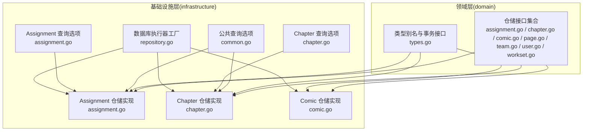
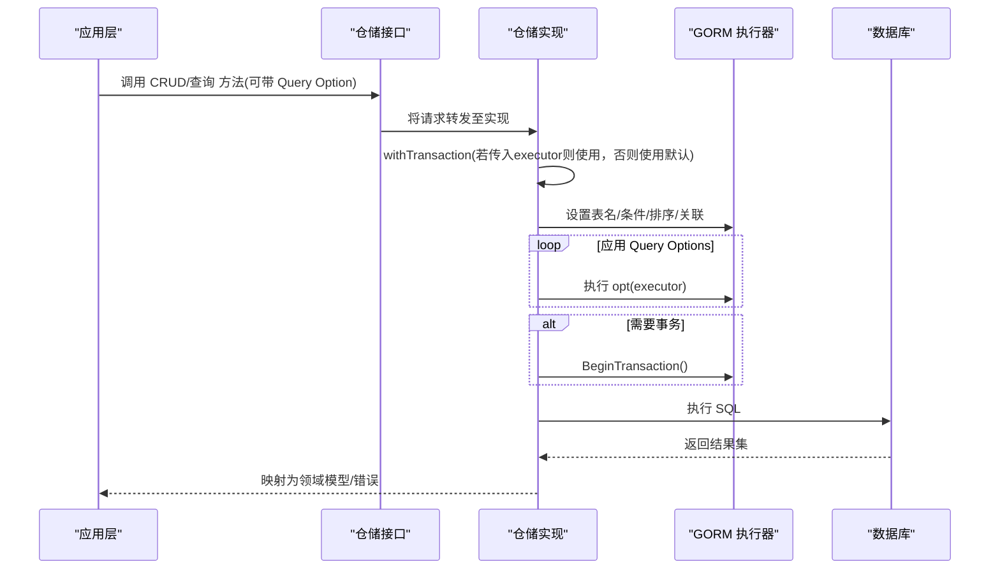
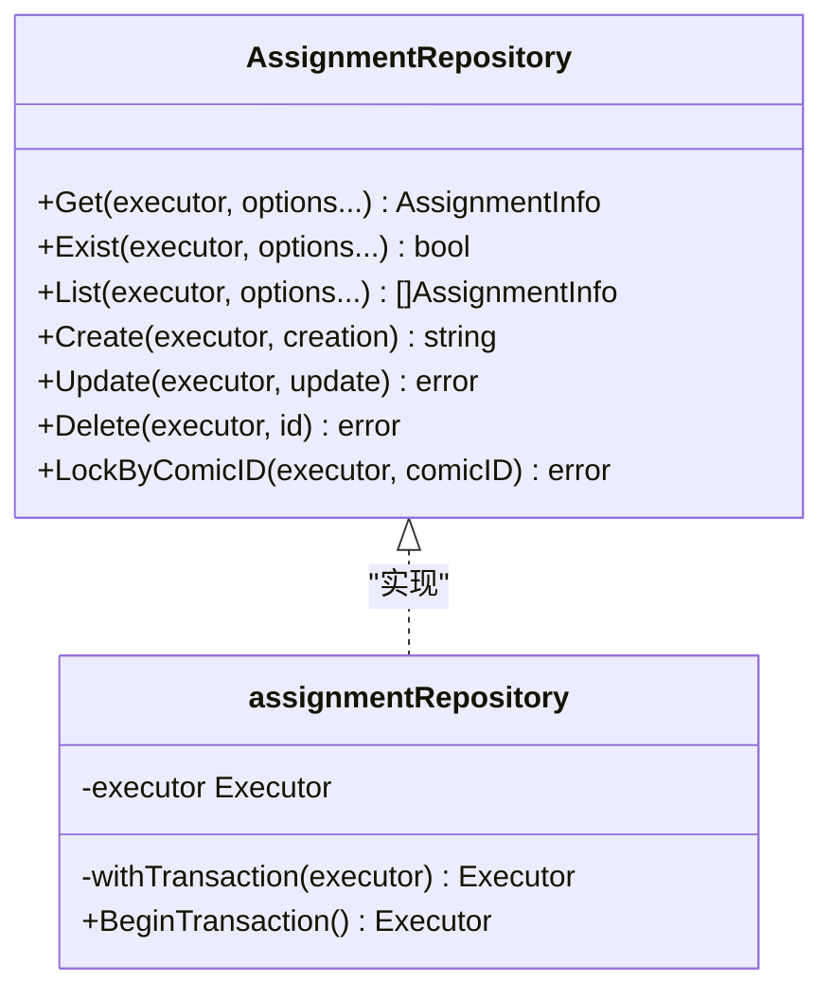
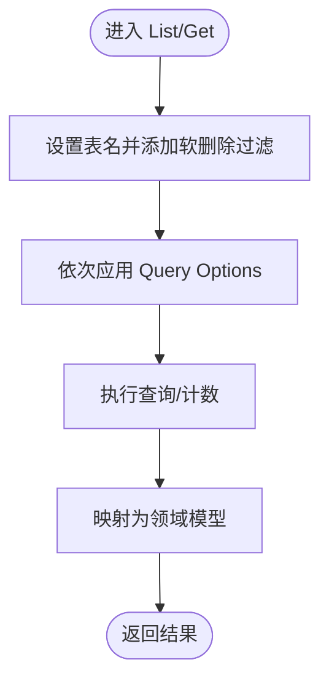
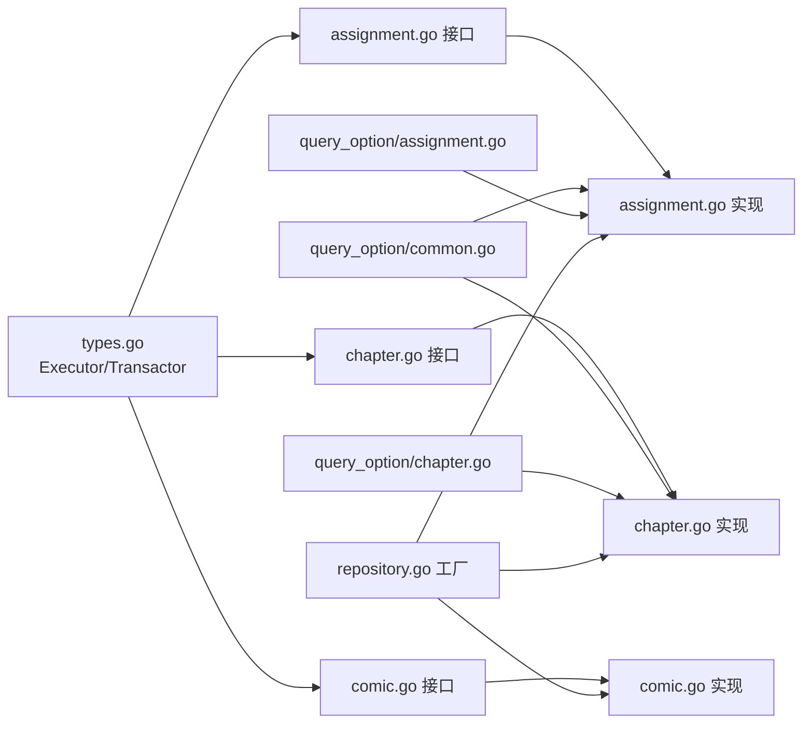

# 仓储接口设计

<cite>
**本文引用的文件**
- [internal/domain/repository/types.go](file://internal/domain/repository/types.go)
- [internal/domain/repository/assignment.go](file://internal/domain/repository/assignment.go)
- [internal/domain/repository/chapter.go](file://internal/domain/repository/chapter.go)
- [internal/domain/repository/comic.go](file://internal/domain/repository/comic.go)
- [internal/domain/repository/page.go](file://internal/domain/repository/page.go)
- [internal/domain/repository/team.go](file://internal/domain/repository/team.go)
- [internal/domain/repository/user.go](file://internal/domain/repository/user.go)
- [internal/domain/repository/workset.go](file://internal/domain/repository/workset.go)
- [internal/infrastructure/repository/repository.go](file://internal/infrastructure/repository/repository.go)
- [internal/infrastructure/repository/assignment.go](file://internal/infrastructure/repository/assignment.go)
- [internal/infrastructure/repository/chapter.go](file://internal/infrastructure/repository/chapter.go)
- [internal/infrastructure/repository/comic.go](file://internal/infrastructure/repository/comic.go)
- [internal/infrastructure/repository/query_option/common.go](file://internal/infrastructure/repository/query_option/common.go)
- [internal/infrastructure/repository/query_option/assignment.go](file://internal/infrastructure/repository/query_option/assignment.go)
- [internal/infrastructure/repository/query_option/chapter.go](file://internal/infrastructure/repository/query_option/chapter.go)
</cite>

## 目录
1. [引言](#引言)
2. [项目结构](#项目结构)
3. [核心组件](#核心组件)
4. [架构总览](#架构总览)
5. [详细组件分析](#详细组件分析)
6. [依赖分析](#依赖分析)
7. [性能考量](#性能考量)
8. [故障排查指南](#故障排查指南)
9. [结论](#结论)
10. [附录](#附录)

## 引言
本设计文档聚焦于漫画翻译协作平台的数据访问抽象层，系统性阐述仓储接口的设计原则、Query Option模式、通用CRUD与批量操作支持、事务与并发控制、以及与具体实现的解耦机制与依赖注入实践。目标是帮助开发者在不直接依赖底层ORM或数据库的情况下，通过统一的仓储接口进行数据访问，并在保证可测试性的同时获得良好的扩展性与性能。

## 项目结构
仓储接口位于领域层(domain)，具体实现位于基础设施层(infrastructure)，查询选项(query option)作为可组合的过滤与排序工具分布在基础设施层的query_option包中。整体采用“接口在上、实现下沉”的分层架构，确保业务逻辑与数据持久化细节解耦。

图表来源
- [internal/domain/repository/assignment.go:1-15](file://internal/domain/repository/assignment.go#L1-L15)
- [internal/domain/repository/chapter.go:1-19](file://internal/domain/repository/chapter.go#L1-L19)
- [internal/domain/repository/comic.go:1-15](file://internal/domain/repository/comic.go#L1-L15)
- [internal/infrastructure/repository/assignment.go:1-143](file://internal/infrastructure/repository/assignment.go#L1-L143)
- [internal/infrastructure/repository/chapter.go:1-190](file://internal/infrastructure/repository/chapter.go#L1-L190)
- [internal/infrastructure/repository/comic.go:1-140](file://internal/infrastructure/repository/comic.go#L1-L140)
- [internal/infrastructure/repository/query_option/common.go:1-51](file://internal/infrastructure/repository/query_option/common.go#L1-L51)
- [internal/infrastructure/repository/query_option/assignment.go:1-112](file://internal/infrastructure/repository/query_option/assignment.go#L1-L112)
- [internal/infrastructure/repository/query_option/chapter.go:1-41](file://internal/infrastructure/repository/query_option/chapter.go#L1-L41)
- [internal/infrastructure/repository/repository.go:1-30](file://internal/infrastructure/repository/repository.go#L1-L30)

章节来源
- [internal/domain/repository/types.go:1-12](file://internal/domain/repository/types.go#L1-L12)
- [internal/infrastructure/repository/repository.go:1-30](file://internal/infrastructure/repository/repository.go#L1-L30)

## 核心组件
- 仓储接口族：为每个实体定义统一的CRUD、存在性检查、列表与计数、锁定等能力，并继承事务接口以支持显式事务控制。
- Query Option模式：以函数式组合的方式构建查询条件、排序与关联聚合，遵循“主表字段筛选”“跨表筛选”“ID精确筛选复用”“完整表名前缀”的规则。
- 公共执行器与事务：通过GORM执行器封装数据库操作，提供连接池配置与事务开启能力。
- 实体映射：仓储实现将GORM结果映射为领域模型，保证领域层不感知基础设施细节。

章节来源
- [internal/domain/repository/assignment.go:1-15](file://internal/domain/repository/assignment.go#L1-L15)
- [internal/domain/repository/chapter.go:1-19](file://internal/domain/repository/chapter.go#L1-L19)
- [internal/domain/repository/comic.go:1-15](file://internal/domain/repository/comic.go#L1-L15)
- [internal/domain/repository/page.go:1-18](file://internal/domain/repository/page.go#L1-L18)
- [internal/domain/repository/team.go:1-14](file://internal/domain/repository/team.go#L1-L14)
- [internal/domain/repository/user.go:1-16](file://internal/domain/repository/user.go#L1-L16)
- [internal/domain/repository/workset.go:1-15](file://internal/domain/repository/workset.go#L1-L15)
- [internal/domain/repository/types.go:1-12](file://internal/domain/repository/types.go#L1-L12)
- [internal/infrastructure/repository/query_option/common.go:1-51](file://internal/infrastructure/repository/query_option/common.go#L1-L51)

## 架构总览
仓储接口与实现之间的交互遵循以下流程：应用层调用仓储接口；仓储实现接收可选的Query Option并将其应用于GORM执行器；必要时通过事务执行器开启事务；最终将结果映射为领域模型返回。

图表来源
- [internal/domain/repository/assignment.go:1-15](file://internal/domain/repository/assignment.go#L1-L15)
- [internal/infrastructure/repository/assignment.go:1-143](file://internal/infrastructure/repository/assignment.go#L1-L143)
- [internal/domain/repository/types.go:1-12](file://internal/domain/repository/types.go#L1-L12)
- [internal/infrastructure/repository/repository.go:1-30](file://internal/infrastructure/repository/repository.go#L1-L30)

## 详细组件分析

### 通用仓储接口设计
- 设计原则
  - 统一的CRUD与存在性检查：Get/List/Count/Create/Update/Delete/Exist。
  - 锁定能力：按ID或关联ID进行悲观锁查询，避免并发冲突。
  - 事务接口：所有仓储接口均嵌入事务接口，支持显式事务控制。
  - 返回类型：读取类方法返回领域模型或切片；写入类方法返回错误；存在性检查返回布尔值。
- Query Option模式
  - 以函数式组合方式构建查询：FilterByID/FilterByIDs/CreatedAtDesc/UpdatedAtAsc/Paginate等。
  - 主表字段筛选与跨表筛选分离，ID精确筛选统一使用公共FilterByID。
  - 关联聚合：支持按需拼接JOIN与SELECT字段，减少N+1查询风险。
- 批量与复杂查询
  - 批量插入/删除：如PageRepository提供CreateBatch/DeleteBatch。
  - 复杂统计更新：如ChapterRepository.UpdateStats仅更新统计字段，便于事务内原子更新。
- 解耦与依赖注入
  - 通过构造函数注入Executor，实现对具体数据库驱动的解耦。
  - 仓储实现内部通过withTransaction选择传入executor或默认执行器，支持外部传入事务上下文。
- 并发与事务
  - 使用GORM锁子句实现悲观锁，防止并发修改。
  - 通过Transactor接口统一开启事务，确保写操作一致性。

章节来源
- [internal/domain/repository/assignment.go:1-15](file://internal/domain/repository/assignment.go#L1-L15)
- [internal/domain/repository/chapter.go:1-19](file://internal/domain/repository/chapter.go#L1-L19)
- [internal/domain/repository/comic.go:1-15](file://internal/domain/repository/comic.go#L1-L15)
- [internal/domain/repository/page.go:1-18](file://internal/domain/repository/page.go#L1-L18)
- [internal/domain/repository/team.go:1-14](file://internal/domain/repository/team.go#L1-L14)
- [internal/domain/repository/user.go:1-16](file://internal/domain/repository/user.go#L1-L16)
- [internal/domain/repository/workset.go:1-15](file://internal/domain/repository/workset.go#L1-L15)
- [internal/domain/repository/types.go:1-12](file://internal/domain/repository/types.go#L1-L12)

### Assignment 仓储
- 接口职责：分配任务的查询、创建、更新、删除与锁定。
- 查询选项：支持按章节ID、用户ID筛选；支持聚合用户、章节、章节所属漫画与章节创建者信息。
- 实现要点：withTransaction统一事务上下文；Get/List/Exist分别处理单条、多条与存在性；LockByComicID通过子查询锁定相关分配记录。

图表来源
- [internal/domain/repository/assignment.go:1-15](file://internal/domain/repository/assignment.go#L1-L15)
- [internal/infrastructure/repository/assignment.go:1-143](file://internal/infrastructure/repository/assignment.go#L1-L143)

章节来源
- [internal/domain/repository/assignment.go:1-15](file://internal/domain/repository/assignment.go#L1-L15)
- [internal/infrastructure/repository/assignment.go:1-143](file://internal/infrastructure/repository/assignment.go#L1-L143)
- [internal/infrastructure/repository/query_option/assignment.go:1-112](file://internal/infrastructure/repository/query_option/assignment.go#L1-L112)

### Chapter 仓储
- 接口职责：章节的列表、详情、统计查询、创建、更新、软删除与锁定。
- 查询选项：按漫画ID筛选；按索引降序排序；聚合章节创建者信息。
- 实现要点：软删除通过更新deleted_at字段实现；统计查询仅选取必要字段；UpdateStats原子更新统计字段。

图表来源
- [internal/domain/repository/chapter.go:1-19](file://internal/domain/repository/chapter.go#L1-L19)
- [internal/infrastructure/repository/chapter.go:1-190](file://internal/infrastructure/repository/chapter.go#L1-L190)
- [internal/infrastructure/repository/query_option/chapter.go:1-41](file://internal/infrastructure/repository/query_option/chapter.go#L1-L41)

章节来源
- [internal/domain/repository/chapter.go:1-19](file://internal/domain/repository/chapter.go#L1-L19)
- [internal/infrastructure/repository/chapter.go:1-190](file://internal/infrastructure/repository/chapter.go#L1-L190)
- [internal/infrastructure/repository/query_option/chapter.go:1-41](file://internal/infrastructure/repository/query_option/chapter.go#L1-L41)

### Comic 仓储
- 接口职责：漫画的列表、详情、计数、锁定、创建、更新、删除。
- 查询选项：按工作集ID锁定；软删除过滤。
- 实现要点：LockByWorksetID通过锁子句锁定相关漫画；软删除同章节一致。

章节来源
- [internal/domain/repository/comic.go:1-15](file://internal/domain/repository/comic.go#L1-L15)
- [internal/infrastructure/repository/comic.go:1-140](file://internal/infrastructure/repository/comic.go#L1-L140)

### Page 仓储
- 接口职责：页面的列表、详情、统计查询、批量创建、批量删除、更新与更新统计。
- 批量操作：CreateBatch/DeleteBatch满足高吞吐场景。
- 实现要点：UpdateStats与UpdateStats原子更新统计字段，减少冗余查询。

章节来源
- [internal/domain/repository/page.go:1-18](file://internal/domain/repository/page.go#L1-L18)

### Team/User/Workset 仓储
- Team 与 User 提供团队与用户的增删改查、头像预留与确认上传等能力。
- Workset 提供工作集的列表、详情、计数、锁定、创建、更新、删除。
- 实现模式与上述实体一致，遵循事务、查询选项与映射规范。

章节来源
- [internal/domain/repository/team.go:1-14](file://internal/domain/repository/team.go#L1-L14)
- [internal/domain/repository/user.go:1-16](file://internal/domain/repository/user.go#L1-L16)
- [internal/domain/repository/workset.go:1-15](file://internal/domain/repository/workset.go#L1-L15)

## 依赖分析
- 接口到实现的依赖：各实体的仓储接口由对应实现类实现，形成稳定的上层依赖。
- 查询选项的依赖：实现通过组合公共与实体特定的Query Option构建复杂查询。
- 执行器与事务：实现依赖Transactor接口开启事务，依赖Executor执行SQL。
- 数据库连接：通过工厂函数创建GORM执行器并配置连接池参数。

图表来源
- [internal/domain/repository/types.go:1-12](file://internal/domain/repository/types.go#L1-L12)
- [internal/domain/repository/assignment.go:1-15](file://internal/domain/repository/assignment.go#L1-L15)
- [internal/domain/repository/chapter.go:1-19](file://internal/domain/repository/chapter.go#L1-L19)
- [internal/domain/repository/comic.go:1-15](file://internal/domain/repository/comic.go#L1-L15)
- [internal/infrastructure/repository/assignment.go:1-143](file://internal/infrastructure/repository/assignment.go#L1-L143)
- [internal/infrastructure/repository/chapter.go:1-190](file://internal/infrastructure/repository/chapter.go#L1-L190)
- [internal/infrastructure/repository/comic.go:1-140](file://internal/infrastructure/repository/comic.go#L1-L140)
- [internal/infrastructure/repository/query_option/common.go:1-51](file://internal/infrastructure/repository/query_option/common.go#L1-L51)
- [internal/infrastructure/repository/query_option/assignment.go:1-112](file://internal/infrastructure/repository/query_option/assignment.go#L1-L112)
- [internal/infrastructure/repository/query_option/chapter.go:1-41](file://internal/infrastructure/repository/query_option/chapter.go#L1-L41)
- [internal/infrastructure/repository/repository.go:1-30](file://internal/infrastructure/repository/repository.go#L1-L30)

章节来源
- [internal/domain/repository/types.go:1-12](file://internal/domain/repository/types.go#L1-L12)
- [internal/infrastructure/repository/repository.go:1-30](file://internal/infrastructure/repository/repository.go#L1-L30)

## 性能考量
- 连接池管理
  - 在执行器工厂中设置最大空闲连接与最大打开连接，平衡资源占用与并发性能。
- 分页与排序
  - 使用公共分页与排序选项，避免全表扫描；优先在数据库侧完成排序与分页。
- 关联查询与字段裁剪
  - 通过Query Option按需JOIN与SELECT字段，减少不必要的列传输与JOIN开销。
- 原子更新与批量操作
  - 使用UpdateStats与CreateBatch/DeleteBatch降低网络往返与锁竞争。
- 软删除与索引
  - 对软删除字段建立合适索引，确保查询效率；在查询时默认加入软删除过滤。
- 缓存策略
  - 对热点只读数据（如字典、静态配置）引入应用层缓存；对强一致要求的数据避免缓存或采用失效策略。
- 并发控制
  - 对关键写路径使用悲观锁；对读多写少场景可考虑乐观锁或读写分离。

章节来源
- [internal/infrastructure/repository/repository.go:1-30](file://internal/infrastructure/repository/repository.go#L1-L30)
- [internal/infrastructure/repository/query_option/common.go:1-51](file://internal/infrastructure/repository/query_option/common.go#L1-L51)
- [internal/infrastructure/repository/chapter.go:1-190](file://internal/infrastructure/repository/chapter.go#L1-L190)
- [internal/infrastructure/repository/comic.go:1-140](file://internal/infrastructure/repository/comic.go#L1-L140)

## 故障排查指南
- 事务未生效
  - 确认是否通过Transactor.BeginTransaction获取执行器；实现内部使用withTransaction选择外部传入的executor。
- 查询结果为空
  - 检查是否遗漏软删除过滤；确认Query Option顺序与条件是否正确；核对表名与字段前缀是否完整。
- 锁定失败或死锁
  - 确认锁子句使用正确；避免长事务；尽量缩小锁定范围；按相同顺序访问资源。
- 连接池耗尽
  - 检查最大连接数与空闲连接数配置；确保及时关闭事务与释放连接；监控慢查询。
- 批量操作异常
  - 分批提交；捕获单条错误并定位问题记录；核对批量插入/删除的输入参数。

章节来源
- [internal/domain/repository/types.go:1-12](file://internal/domain/repository/types.go#L1-L12)
- [internal/infrastructure/repository/assignment.go:1-143](file://internal/infrastructure/repository/assignment.go#L1-L143)
- [internal/infrastructure/repository/chapter.go:1-190](file://internal/infrastructure/repository/chapter.go#L1-L190)
- [internal/infrastructure/repository/comic.go:1-140](file://internal/infrastructure/repository/comic.go#L1-L140)
- [internal/infrastructure/repository/repository.go:1-30](file://internal/infrastructure/repository/repository.go#L1-L30)

## 结论
该仓储接口设计通过清晰的领域接口、可组合的Query Option模式、统一的事务与执行器抽象，实现了数据访问层的高内聚低耦合。配合连接池、批量操作与原子更新等策略，可在保证一致性的同时提升性能与可维护性。建议在新增实体时严格遵循现有模式，确保扩展的一致性与可测试性。

## 附录
- Query Option 设计守则
  - 主表字段筛选仅限当前主表字段，跨表筛选使用专门函数。
  - ID精确筛选统一使用公共FilterByID，避免重复定义。
  - 禁止裸字段，所有字段使用完整表名前缀。
- 事务与并发控制
  - 写操作统一通过事务执行；读多写少场景可考虑读写分离与缓存。
- Mock 与测试
  - 通过接口与构造函数注入Executor，便于在单元测试中注入Mock执行器与期望行为。