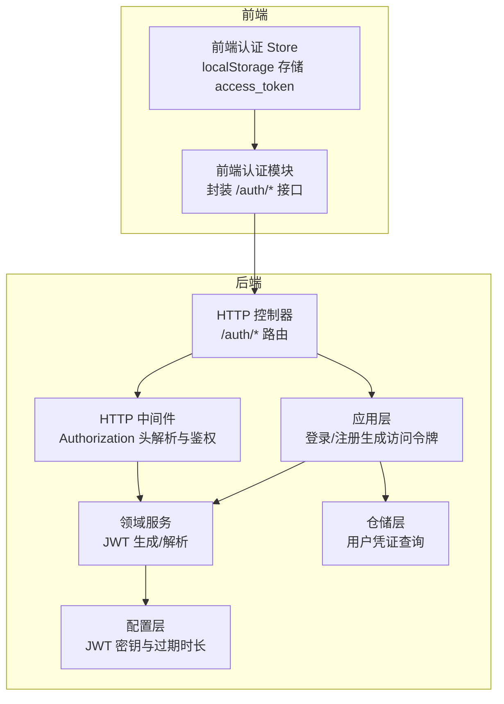
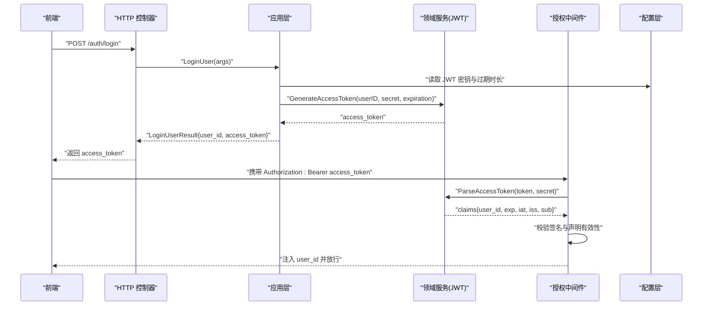
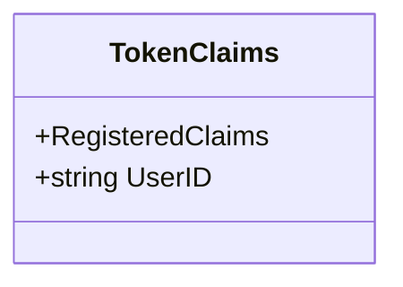
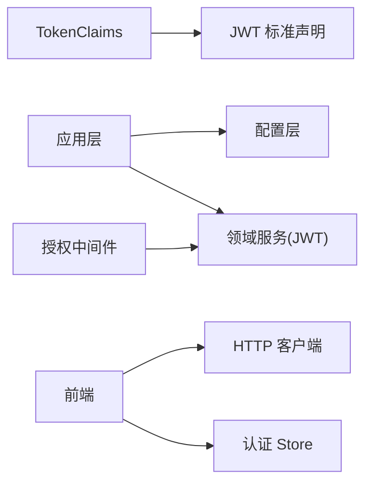

# 令牌模型

<cite>
**本文引用的文件**
- [internal/domain/model/token.go](file://internal/domain/model/token.go)
- [internal/domain/service/user.go](file://internal/domain/service/user.go)
- [internal/api/http/middleware.go](file://internal/api/http/middleware.go)
- [internal/api/http/auth.go](file://internal/api/http/auth.go)
- [internal/application/user.go](file://internal/application/user.go)
- [internal/value/user.go](file://internal/value/user.go)
- [internal/config/config.go](file://internal/config/config.go)
- [internal/infrastructure/repository/user.go](file://internal/infrastructure/repository/user.go)
- [frontend/src/stores/auth.ts](file://frontend/src/stores/auth.ts)
- [frontend/src/api/modules/auth.ts](file://frontend/src/api/modules/auth.ts)
- [script/seed/http.ts](file://script/seed/http.ts)
- [script/seed/api/auth.ts](file://script/seed/api/auth.ts)
</cite>

## 目录
1. [引言](#引言)
2. [项目结构](#项目结构)
3. [核心组件](#核心组件)
4. [架构总览](#架构总览)
5. [详细组件分析](#详细组件分析)
6. [依赖分析](#依赖分析)
7. [性能考虑](#性能考虑)
8. [故障排查指南](#故障排查指南)
9. [结论](#结论)
10. [附录](#附录)

## 引言
本文件围绕“令牌模型”展开，系统性阐述访问令牌的结构设计、签发与校验流程、与用户身份验证的关系、生命周期管理、以及在 API 访问控制与会话管理中的作用。重点覆盖以下方面：
- Token 实体字段定义：访问令牌、过期时间、令牌类型等
- JWT 结构设计与安全机制：签名算法、声明内容、密钥管理
- 令牌与身份认证的关联：登录、授权中间件、用户上下文注入
- 生命周期管理：签发、校验、失效与撤销策略
- 安全最佳实践与常见风险防范

## 项目结构
围绕令牌模型的关键代码分布在以下层次：
- 领域层：定义 TokenClaims 数据结构
- 应用层：登录/注册流程中生成访问令牌
- 接口层：HTTP 中间件负责令牌解析与鉴权
- 前端层：认证状态与令牌持久化
- 配置层：JWT 密钥与过期时长配置

图表来源
- [internal/domain/model/token.go:1-9](file://internal/domain/model/token.go#L1-L9)
- [internal/domain/service/user.go:15-68](file://internal/domain/service/user.go#L15-L68)
- [internal/api/http/middleware.go:47-79](file://internal/api/http/middleware.go#L47-L79)
- [internal/api/http/auth.go:22-72](file://internal/api/http/auth.go#L22-L72)
- [internal/application/user.go:106-154](file://internal/application/user.go#L106-L154)
- [internal/config/config.go:69-83](file://internal/config/config.go#L69-L83)
- [internal/infrastructure/repository/user.go:73-87](file://internal/infrastructure/repository/user.go#L73-L87)

章节来源
- [internal/domain/model/token.go:1-9](file://internal/domain/model/token.go#L1-L9)
- [internal/domain/service/user.go:15-68](file://internal/domain/service/user.go#L15-L68)
- [internal/api/http/middleware.go:47-79](file://internal/api/http/middleware.go#L47-L79)
- [internal/api/http/auth.go:22-72](file://internal/api/http/auth.go#L22-L72)
- [internal/application/user.go:106-154](file://internal/application/user.go#L106-L154)
- [internal/config/config.go:69-83](file://internal/config/config.go#L69-L83)
- [internal/infrastructure/repository/user.go:73-87](file://internal/infrastructure/repository/user.go#L73-L87)

## 核心组件
- TokenClaims：JWT 声明载体，扩展标准声明并加入用户标识
- 领域服务：生成访问令牌（HS256）、解析访问令牌并校验签名
- 应用层：登录/注册成功后生成访问令牌并返回给客户端
- 授权中间件：从 Authorization 头提取 Bearer 令牌，解析并注入用户上下文
- 配置层：JWT 密钥与过期时长从环境变量加载
- 前端：本地存储 access_token，并在后续请求中携带 Authorization: Bearer

章节来源
- [internal/domain/model/token.go:5-8](file://internal/domain/model/token.go#L5-L8)
- [internal/domain/service/user.go:15-68](file://internal/domain/service/user.go#L15-L68)
- [internal/application/user.go:106-154](file://internal/application/user.go#L106-L154)
- [internal/api/http/middleware.go:47-79](file://internal/api/http/middleware.go#L47-L79)
- [internal/config/config.go:69-83](file://internal/config/config.go#L69-L83)
- [frontend/src/stores/auth.ts:15-50](file://frontend/src/stores/auth.ts#L15-L50)

## 架构总览
下图展示从登录到请求受保护资源的完整链路，涵盖令牌签发、传递与校验。

图表来源
- [internal/api/http/auth.go:22-40](file://internal/api/http/auth.go#L22-L40)
- [internal/application/user.go:106-154](file://internal/application/user.go#L106-L154)
- [internal/domain/service/user.go:15-68](file://internal/domain/service/user.go#L15-L68)
- [internal/api/http/middleware.go:47-79](file://internal/api/http/middleware.go#L47-L79)
- [internal/config/config.go:69-83](file://internal/config/config.go#L69-L83)

## 详细组件分析

### 数据模型：TokenClaims
- 字段构成
  - 继承标准声明：过期时间、签发时间、发行者、主题等
  - 扩展声明：用户标识
- 设计要点
  - 明确的发行者与主题便于跨系统识别
  - 过期时间与签发时间用于生命周期控制
  - 用户标识直接嵌入声明，简化中间件注入

图表来源
- [internal/domain/model/token.go:5-8](file://internal/domain/model/token.go#L5-L8)

章节来源
- [internal/domain/model/token.go:5-8](file://internal/domain/model/token.go#L5-L8)

### JWT 结构设计与安全机制
- 签名算法：HS256（对称密钥）
- 声明内容：标准声明 + 用户标识
- 密钥管理：从环境变量加载，避免硬编码
- 安全要点
  - 严格校验签名算法类型
  - 校验令牌有效性与声明完整性
  - 限制令牌有效期，降低泄露风险

章节来源
- [internal/domain/service/user.go:15-68](file://internal/domain/service/user.go#L15-L68)
- [internal/config/config.go:69-83](file://internal/config/config.go#L69-L83)

### 令牌生命周期管理
- 签发：登录/注册成功后生成访问令牌
- 传递：前端存储 access_token，并在后续请求头中携带
- 校验：中间件解析并验证令牌，注入用户上下文
- 失效：过期自动失效；可通过缩短过期时长降低风险
- 撤销：当前实现未见集中式撤销机制（如黑名单），建议引入黑名单或短周期令牌+刷新令牌策略

章节来源
- [internal/application/user.go:106-154](file://internal/application/user.go#L106-L154)
- [frontend/src/stores/auth.ts:15-50](file://frontend/src/stores/auth.ts#L15-L50)
- [internal/api/http/middleware.go:47-79](file://internal/api/http/middleware.go#L47-L79)

### 令牌与身份验证的关系
- 登录流程：校验凭据 -> 生成访问令牌 -> 返回给客户端
- 授权流程：中间件解析令牌 -> 提取用户标识 -> 放行受保护路由
- 权限控制：结合用户标识执行细粒度权限检查

章节来源
- [internal/application/user.go:106-154](file://internal/application/user.go#L106-L154)
- [internal/api/http/middleware.go:47-79](file://internal/api/http/middleware.go#L47-L79)

### 刷新与撤销策略
- 刷新机制：当前代码未实现刷新令牌流程
- 撤销策略：当前代码未实现集中式撤销（如黑名单）
- 建议
  - 引入刷新令牌与短期访问令牌组合
  - 引入令牌撤销列表（黑名单）与短期过期时间
  - 在登出时使当前访问令牌立即失效

章节来源
- [internal/application/user.go:106-154](file://internal/application/user.go#L106-L154)
- [internal/domain/service/user.go:15-68](file://internal/domain/service/user.go#L15-L68)

### API 访问控制与会话管理
- 访问控制：中间件统一拦截并校验令牌
- 会话管理：基于令牌的无状态会话，用户上下文通过中间件注入
- 前端集成：Store 统一管理 access_token，HTTP 客户端在请求头中携带

章节来源
- [internal/api/http/middleware.go:47-79](file://internal/api/http/middleware.go#L47-L79)
- [frontend/src/stores/auth.ts:15-50](file://frontend/src/stores/auth.ts#L15-L50)
- [frontend/src/api/modules/auth.ts:79-109](file://frontend/src/api/modules/auth.ts#L79-L109)

## 依赖分析
- 令牌模型依赖 JWT 标准声明
- 应用层依赖配置层提供的密钥与过期时长
- 授权中间件依赖领域服务进行令牌解析
- 前端依赖 HTTP 客户端与 Store 管理令牌

图表来源
- [internal/domain/model/token.go:5-8](file://internal/domain/model/token.go#L5-L8)
- [internal/domain/service/user.go:15-68](file://internal/domain/service/user.go#L15-L68)
- [internal/api/http/middleware.go:47-79](file://internal/api/http/middleware.go#L47-L79)
- [internal/config/config.go:69-83](file://internal/config/config.go#L69-L83)
- [frontend/src/stores/auth.ts:15-50](file://frontend/src/stores/auth.ts#L15-L50)

章节来源
- [internal/domain/model/token.go:5-8](file://internal/domain/model/token.go#L5-L8)
- [internal/domain/service/user.go:15-68](file://internal/domain/service/user.go#L15-L68)
- [internal/api/http/middleware.go:47-79](file://internal/api/http/middleware.go#L47-L79)
- [internal/config/config.go:69-83](file://internal/config/config.go#L69-L83)
- [frontend/src/stores/auth.ts:15-50](file://frontend/src/stores/auth.ts#L15-L50)

## 性能考虑
- 令牌解析为轻量级操作，主要成本在签名验证
- 建议减少不必要的令牌生成与解析次数
- 对于高并发场景，确保密钥加载与解析逻辑高效稳定

## 故障排查指南
- 常见问题
  - 未提供 Authorization 头或格式不正确：中间件直接拒绝
  - 令牌无效或签名不匹配：解析失败，拒绝访问
  - 令牌缺失用户标识：中间件拒绝并返回未授权
  - 登录/注册失败：应用层返回错误信息
- 排查步骤
  - 检查前端是否正确存储与发送 access_token
  - 检查配置层 JWT_SECRET_KEY 是否正确加载
  - 检查令牌是否过期或被篡改
  - 查看中间件日志与错误响应

章节来源
- [internal/api/http/middleware.go:47-79](file://internal/api/http/middleware.go#L47-L79)
- [internal/application/user.go:106-154](file://internal/application/user.go#L106-L154)
- [internal/domain/service/user.go:43-68](file://internal/domain/service/user.go#L43-L68)

## 结论
本项目采用 HS256 对称签名的 JWT 作为访问令牌，结构简洁、实现清晰。通过中间件统一鉴权与应用层统一签发，实现了基本的身份认证与访问控制。建议后续引入刷新令牌与集中式撤销机制，进一步提升安全性与用户体验。

## 附录

### 令牌字段定义与含义
- 用户标识：用于识别当前登录用户
- 过期时间：令牌失效时间
- 签发时间：令牌签发时间
- 发行者：令牌发行方标识
- 主题：令牌用途标识（如用户认证）

章节来源
- [internal/domain/model/token.go:5-8](file://internal/domain/model/token.go#L5-L8)
- [internal/domain/service/user.go:15-41](file://internal/domain/service/user.go#L15-L41)

### 前端令牌存储与传递
- 存储：localStorage 持久化 access_token
- 传递：后续请求头携带 Authorization: Bearer access_token
- 示例路径
  - [frontend/src/stores/auth.ts:15-50](file://frontend/src/stores/auth.ts#L15-L50)
  - [frontend/src/api/modules/auth.ts:79-109](file://frontend/src/api/modules/auth.ts#L79-L109)
  - [script/seed/http.ts:9-17](file://script/seed/http.ts#L9-L17)
  - [script/seed/api/auth.ts:3-13](file://script/seed/api/auth.ts#L3-L13)

### 后端签发与校验流程
- 登录/注册：应用层生成访问令牌并返回
- 授权中间件：解析并校验令牌，注入用户上下文
- 示例路径
  - [internal/application/user.go:106-154](file://internal/application/user.go#L106-L154)
  - [internal/domain/service/user.go:15-68](file://internal/domain/service/user.go#L15-L68)
  - [internal/api/http/middleware.go:47-79](file://internal/api/http/middleware.go#L47-L79)