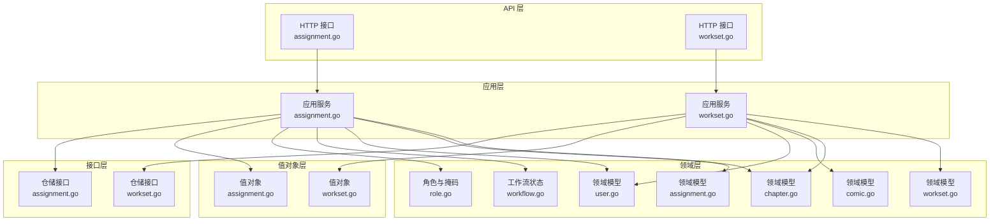
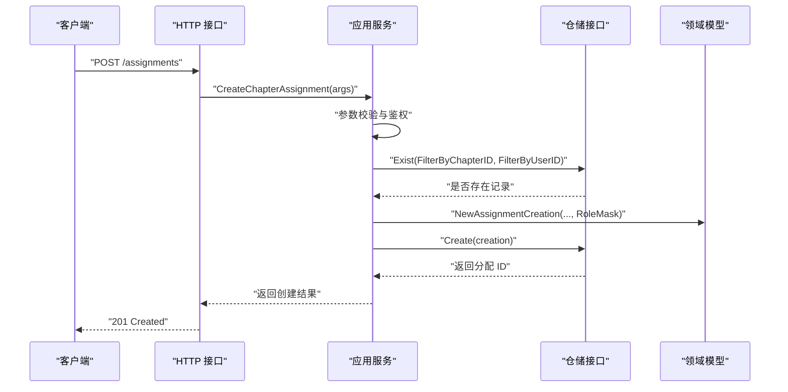
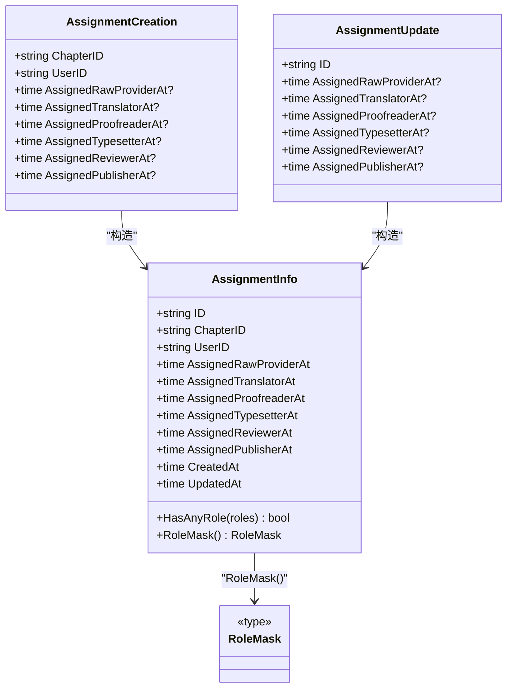
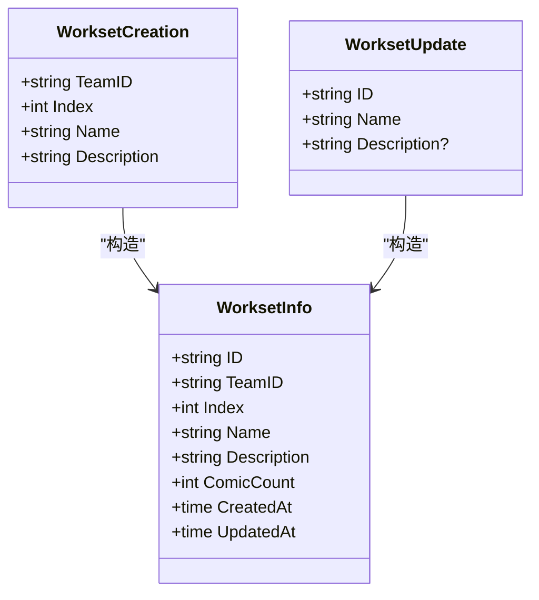
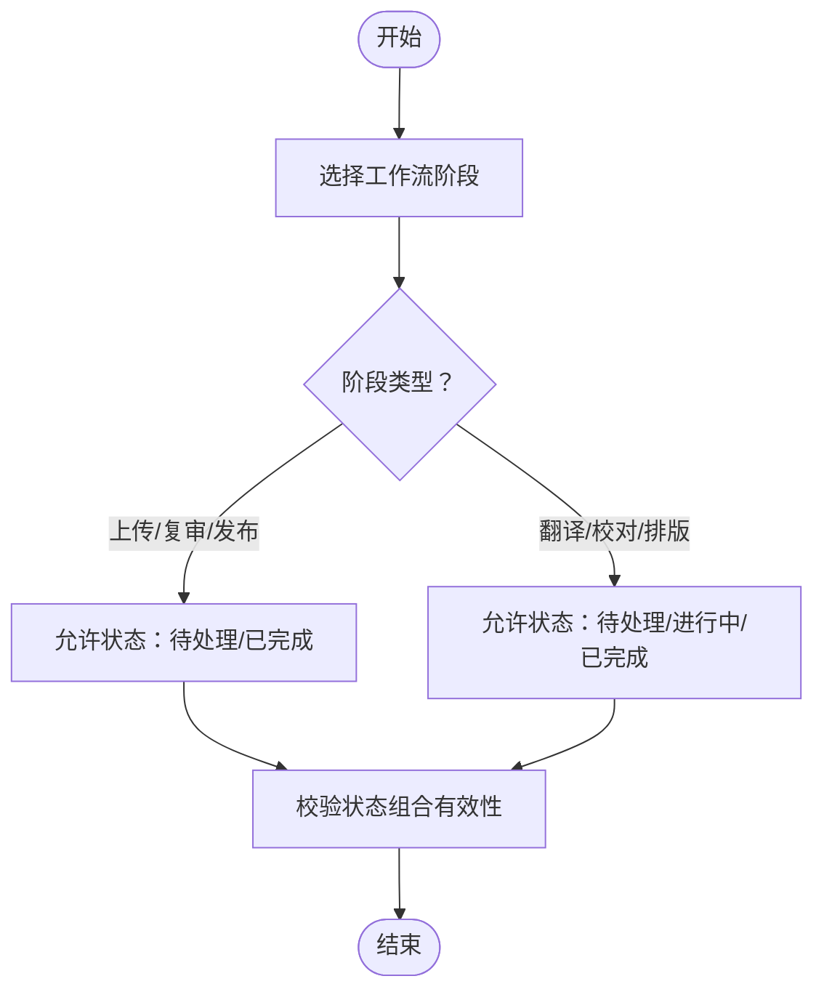
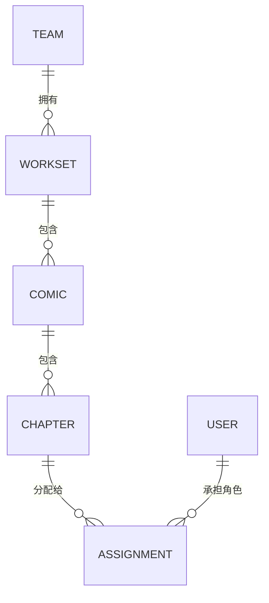
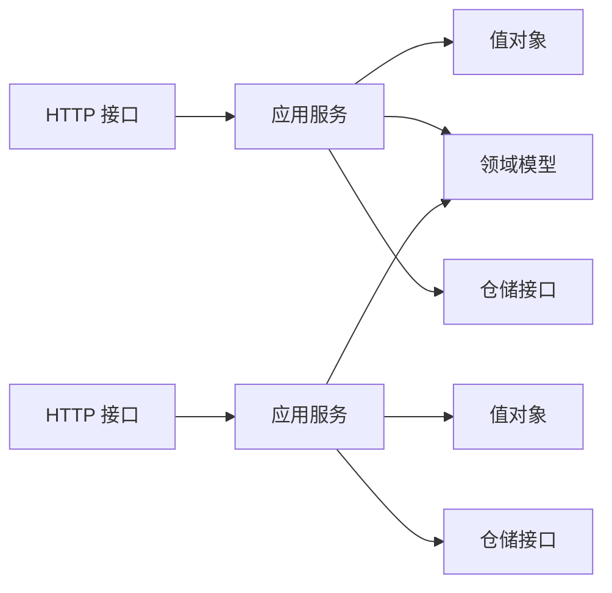

# 任务分配模型

<cite>
**本文档引用的文件**
- [assignment.go](file://internal/domain/model/assignment.go)
- [workset.go](file://internal/domain/model/workset.go)
- [chapter.go](file://internal/domain/model/chapter.go)
- [comic.go](file://internal/domain/model/comic.go)
- [user.go](file://internal/domain/model/user.go)
- [workflow.go](file://internal/domain/model/workflow.go)
- [role.go](file://internal/domain/model/role.go)
- [assignment.go](file://internal/value/assignment.go)
- [workset.go](file://internal/value/workset.go)
- [assignment.go](file://internal/application/assignment.go)
- [workset.go](file://internal/application/workset.go)
- [assignment.go](file://internal/api/http/assignment.go)
- [workset.go](file://internal/api/http/workset.go)
- [assignment.go](file://internal/domain/repository/assignment.go)
- [workset.go](file://internal/domain/repository/workset.go)
</cite>

## 目录
1. [简介](#简介)
2. [项目结构](#项目结构)
3. [核心组件](#核心组件)
4. [架构总览](#架构总览)
5. [详细组件分析](#详细组件分析)
6. [依赖关系分析](#依赖关系分析)
7. [性能考虑](#性能考虑)
8. [故障排除指南](#故障排除指南)
9. [结论](#结论)
10. [附录](#附录)

## 简介
本文件为任务分配模型的全面数据模型文档，聚焦以下主题：
- Assignment 实体的字段定义与角色掩码机制
- WorkSet 实体的工作集概念与状态字段
- 任务与用户、漫画、章节之间的关联关系与依赖约束
- 任务状态流转的数据结构、进度跟踪机制与完成验证规则
- 任务分配算法的数据模型支持与工作集管理的业务逻辑
- 团队协作与项目管理中的应用场景

## 项目结构
围绕任务分配模型，后端采用清晰的分层架构：
- 应用层：负责鉴权、参数校验、业务编排与事务控制
- 领域层：定义实体、值对象、角色掩码、工作流状态等核心数据结构
- 值对象层：面向 API 的序列化/反序列化结构，包含分页与校验逻辑
- 接口层：定义仓储接口，隔离数据库与外部依赖
- API 层：HTTP 接口定义，提供 RESTful 能力

图表来源
- [assignment.go:1-228](file://internal/api/http/assignment.go#L1-L228)
- [workset.go:1-189](file://internal/api/http/workset.go#L1-L189)
- [assignment.go:1-358](file://internal/application/assignment.go#L1-L358)
- [workset.go:1-310](file://internal/application/workset.go#L1-L310)
- [assignment.go:1-190](file://internal/domain/model/assignment.go#L1-L190)
- [workset.go:1-82](file://internal/domain/model/workset.go#L1-L82)
- [chapter.go:1-260](file://internal/domain/model/chapter.go#L1-L260)
- [comic.go:1-107](file://internal/domain/model/comic.go#L1-L107)
- [user.go:1-100](file://internal/domain/model/user.go#L1-L100)
- [workflow.go:1-36](file://internal/domain/model/workflow.go#L1-L36)
- [role.go:1-55](file://internal/domain/model/role.go#L1-L55)
- [assignment.go:1-131](file://internal/value/assignment.go#L1-L131)
- [workset.go:1-89](file://internal/value/workset.go#L1-L89)
- [assignment.go:1-15](file://internal/domain/repository/assignment.go#L1-L15)
- [workset.go:1-15](file://internal/domain/repository/workset.go#L1-L15)

章节来源
- [assignment.go:1-228](file://internal/api/http/assignment.go#L1-L228)
- [workset.go:1-189](file://internal/api/http/workset.go#L1-L189)
- [assignment.go:1-358](file://internal/application/assignment.go#L1-L358)
- [workset.go:1-310](file://internal/application/workset.go#L1-L310)
- [assignment.go:1-190](file://internal/domain/model/assignment.go#L1-L190)
- [workset.go:1-82](file://internal/domain/model/workset.go#L1-L82)
- [chapter.go:1-260](file://internal/domain/model/chapter.go#L1-L260)
- [comic.go:1-107](file://internal/domain/model/comic.go#L1-L107)
- [user.go:1-100](file://internal/domain/model/user.go#L1-L100)
- [workflow.go:1-36](file://internal/domain/model/workflow.go#L1-L36)
- [role.go:1-55](file://internal/domain/model/role.go#L1-L55)
- [assignment.go:1-131](file://internal/value/assignment.go#L1-L131)
- [workset.go:1-89](file://internal/value/workset.go#L1-L89)
- [assignment.go:1-15](file://internal/domain/repository/assignment.go#L1-L15)
- [workset.go:1-15](file://internal/domain/repository/workset.go#L1-L15)

## 核心组件
本节对任务分配与工作集相关的核心数据结构进行深入解析。

- Assignment 实体与角色掩码
  - AssignmentInfo：包含章节 ID、用户 ID、各角色的分配时间戳、创建与更新时间等字段；通过角色掩码与 HasAnyRole/RoleMask 方法表达“谁被分配了哪些角色”。
  - AssignmentCreation/AssignmentUpdate：分别用于创建与全量更新（PUT 语义）角色分配，保留已有角色的时间戳或设置为当前时间。
  - 角色掩码与标志位：通过 RoleFlag/RoleMask 定义原始提供者、翻译者、校对者、排版工、复审者、发布者等角色，并提供掩码的打包/解包工具函数。

- Workset 实体
  - WorksetInfo：包含团队 ID、索引、名称、描述、漫画数量以及创建/更新时间；索引用于排序与工作集内序号管理。
  - WorksetCreation/WorksetUpdate：创建时自动根据团队内现有工作集数量计算索引；更新时支持名称与描述变更。

- Chapter 与 Comic
  - ChapterInfo：章节实体，包含漫画 ID、章节索引、副标题、页面数、单元总数、翻译/校对单元统计，以及上传、翻译、校对、排版、复审、发布等阶段的时间戳。
  - ComicInfo：漫画实体，包含工作集 ID、索引、标题、作者、描述、章节数量、最后活跃时间等。

- User 与 Team
  - UserInfo：用户基本信息，包含姓名、QQ、头像 OSS Key、是否已上传头像、是否超级管理员等。
  - TeamInfo：团队信息，包含名称、描述、头像 OSS Key、是否已上传头像等。

- 工作流状态
  - Workflow/WorkflowStatus：定义上传、翻译、校对、排版、复审、发布等流程及其状态（待处理、进行中、已完成、未设置）；提供组合有效性校验。

章节来源
- [assignment.go:5-190](file://internal/domain/model/assignment.go#L5-L190)
- [workset.go:5-82](file://internal/domain/model/workset.go#L5-L82)
- [chapter.go:5-260](file://internal/domain/model/chapter.go#L5-L260)
- [comic.go:5-107](file://internal/domain/model/comic.go#L5-L107)
- [user.go:7-100](file://internal/domain/model/user.go#L7-L100)
- [workflow.go:3-36](file://internal/domain/model/workflow.go#L3-L36)
- [role.go:3-55](file://internal/domain/model/role.go#L3-L55)

## 架构总览
任务分配与工作集的端到端流程如下：

图表来源
- [assignment.go:97-138](file://internal/api/http/assignment.go#L97-L138)
- [assignment.go:214-265](file://internal/application/assignment.go#L214-L265)
- [assignment.go:114-149](file://internal/domain/model/assignment.go#L114-L149)
- [assignment.go:10-12](file://internal/domain/repository/assignment.go#L10-L12)

章节来源
- [assignment.go:1-228](file://internal/api/http/assignment.go#L1-L228)
- [assignment.go:1-358](file://internal/application/assignment.go#L1-L358)
- [assignment.go:1-190](file://internal/domain/model/assignment.go#L1-L190)
- [assignment.go:1-15](file://internal/domain/repository/assignment.go#L1-L15)

## 详细组件分析

### Assignment 实体与角色分配
Assignment 实体通过时间戳字段表达“何时被分配到某个角色”，并通过角色掩码表达“同时承担多个角色”。其关键点包括：
- 字段定义
  - 章节 ID、用户 ID、各角色分配时间戳（原始提供者、翻译者、校对者、排版工、复审者、发布者）、创建/更新时间。
- 角色掩码与角色判断
  - HasAnyRole：判断用户是否承担任一角色。
  - RoleMask：将已分配角色映射为掩码，便于权限与展示使用。
- 创建与更新
  - AssignmentCreation：根据目标角色掩码批量设置对应时间戳为当前时间，未包含的角色保持空值。
  - AssignmentUpdate（PUT 语义）：保留已有角色的时间戳不变，新增角色设为当前时间，移除角色置空。

图表来源
- [assignment.go:5-190](file://internal/domain/model/assignment.go#L5-L190)

章节来源
- [assignment.go:1-190](file://internal/domain/model/assignment.go#L1-L190)

### Workset 实体与工作集管理
Workset 实体用于组织漫画资源，支持按团队维度进行分组与排序：
- 字段定义
  - 团队 ID、索引、名称、描述、漫画数量、创建/更新时间。
- 创建策略
  - 根据团队内现有工作集数量自动生成索引，保证顺序唯一性。
- 更新策略
  - 支持名称与描述的更新；描述允许为空（通过指针表示）。

图表来源
- [workset.go:5-82](file://internal/domain/model/workset.go#L5-L82)

章节来源
- [workset.go:1-82](file://internal/domain/model/workset.go#L1-L82)

### 任务状态流转与进度跟踪
章节层面的状态流转通过多阶段时间戳表达，结合工作流状态常量进行统一管理：
- 工作流阶段
  - 上传、翻译、校对、排版、复审、发布。
- 状态类型
  - 待处理、进行中、已完成、未设置。
- 状态有效性
  - 对于上传、复审、发布，仅允许“待处理/已完成”两种状态；对于翻译、校对、排版，允许“待处理/进行中/已完成”。

图表来源
- [workflow.go:24-35](file://internal/domain/model/workflow.go#L24-L35)

章节来源
- [workflow.go:1-36](file://internal/domain/model/workflow.go#L1-L36)

### 关联关系与依赖约束
任务分配与漫画、章节、用户之间的关系如下：
- Assignment 与 Chapter/User
  - AssignmentInfo 包含 ChapterID 与 UserID；可通过 includes 选项加载关联的章节与用户信息。
- Chapter 与 Comic
  - ChapterInfo 包含 ComicID；ChapterInfo 同时维护章节级的单元统计与各阶段时间戳。
- Comic 与 Workset/Creator
  - ComicInfo 包含 WorksetID 与 CreatorID；ComicInfo 同时维护漫画级的章节数量与最后活跃时间。
- Team 与 Workset
  - WorksetInfo 属于 Team；Workset 的索引用于排序。

图表来源
- [team.go:5-35](file://internal/domain/model/team.go#L5-L35)
- [workset.go:5-42](file://internal/domain/model/workset.go#L5-L42)
- [comic.go:5-58](file://internal/domain/model/comic.go#L5-L58)
- [chapter.go:5-81](file://internal/domain/model/chapter.go#L5-L81)
- [assignment.go:5-25](file://internal/domain/model/assignment.go#L5-L25)
- [user.go:7-19](file://internal/domain/model/user.go#L7-L19)

章节来源
- [team.go:1-63](file://internal/domain/model/team.go#L1-L63)
- [workset.go:1-82](file://internal/domain/model/workset.go#L1-L82)
- [comic.go:1-107](file://internal/domain/model/comic.go#L1-L107)
- [chapter.go:1-260](file://internal/domain/model/chapter.go#L1-L260)
- [assignment.go:1-190](file://internal/domain/model/assignment.go#L1-L190)
- [user.go:1-100](file://internal/domain/model/user.go#L1-L100)

### 任务分配算法的数据模型支持
- 角色掩码与时间戳
  - 通过 RoleMask/RoleFlag 表达多角色分配；通过各角色分配时间戳表达“谁在何时承担该角色”。
- 创建与更新策略
  - 创建：根据目标角色掩码批量设置时间戳。
  - 更新（PUT）：保留已有角色时间戳，新增角色写入当前时间，移除角色置空。
- 去重与幂等
  - 创建前检查同一章节/用户的分配记录是否存在，避免重复分配。

章节来源
- [assignment.go:114-190](file://internal/domain/model/assignment.go#L114-L190)
- [assignment.go:214-265](file://internal/application/assignment.go#L214-L265)

### 工作集管理的业务逻辑
- 列表与排序
  - 按团队过滤，按索引升序排列。
- 创建
  - 事务内锁定团队记录，统计现有数量后生成新索引，创建工作集。
- 更新与删除
  - 支持名称与描述更新；删除前进行鉴权与存在性检查。

章节来源
- [workset.go:72-262](file://internal/application/workset.go#L72-L262)
- [workset.go:1-15](file://internal/domain/repository/workset.go#L1-L15)

## 依赖关系分析
应用层通过仓储接口与领域模型交互，API 层仅负责参数解析与响应封装，值对象层负责输入输出结构与校验。

图表来源
- [assignment.go:1-228](file://internal/api/http/assignment.go#L1-L228)
- [workset.go:1-189](file://internal/api/http/workset.go#L1-L189)
- [assignment.go:1-358](file://internal/application/assignment.go#L1-L358)
- [workset.go:1-310](file://internal/application/workset.go#L1-L310)
- [assignment.go:1-131](file://internal/value/assignment.go#L1-L131)
- [workset.go:1-89](file://internal/value/workset.go#L1-L89)
- [assignment.go:1-15](file://internal/domain/repository/assignment.go#L1-L15)
- [workset.go:1-15](file://internal/domain/repository/workset.go#L1-L15)

章节来源
- [assignment.go:1-228](file://internal/api/http/assignment.go#L1-L228)
- [workset.go:1-189](file://internal/api/http/workset.go#L1-L189)
- [assignment.go:1-358](file://internal/application/assignment.go#L1-L358)
- [workset.go:1-310](file://internal/application/workset.go#L1-L310)
- [assignment.go:1-131](file://internal/value/assignment.go#L1-L131)
- [workset.go:1-89](file://internal/value/workset.go#L1-L89)
- [assignment.go:1-15](file://internal/domain/repository/assignment.go#L1-L15)
- [workset.go:1-15](file://internal/domain/repository/workset.go#L1-L15)

## 性能考虑
- 分页与排序
  - 列表查询默认按更新时间倒序，配合分页参数限制单次返回量，降低内存压力。
- 关联加载
  - 通过 includes 参数按需加载关联信息（用户、章节、漫画、创建者等），避免 N+1 查询。
- 事务与锁
  - 创建工作集时对团队记录加锁并统计数量，确保索引生成的原子性与一致性。
- 时间戳与状态
  - 使用阶段时间戳表达进度，避免额外的状态机表，简化查询与更新路径。

## 故障排除指南
- 参数校验失败
  - HTTP 层对查询参数与请求体进行校验，若失败返回 400；应用层在执行业务前再次校验。
- 权限不足
  - 应用层在执行 CRUD 前进行权限检查，若失败返回 403。
- 重复分配
  - 创建前检查同一章节/用户是否已存在分配记录，避免重复创建。
- 事务回滚
  - 工作集创建失败时进行回滚，确保数据一致性。

章节来源
- [assignment.go:28-51](file://internal/api/http/assignment.go#L28-L51)
- [workset.go:28-51](file://internal/api/http/workset.go#L28-L51)
- [assignment.go:99-122](file://internal/application/assignment.go#L99-L122)
- [workset.go:135-156](file://internal/application/workset.go#L135-L156)
- [assignment.go:243-254](file://internal/application/assignment.go#L243-L254)

## 结论
本数据模型通过角色掩码与阶段时间戳，清晰表达了任务分配与进度跟踪；通过工作集索引与事务锁，保障了团队维度的有序管理。整体设计遵循分层架构，职责清晰，具备良好的扩展性与可维护性，适用于团队协作与项目管理场景。

## 附录
- 常用操作场景
  - 创建章节分配：携带章节 ID、用户 ID 与角色掩码，系统自动写入各角色分配时间戳。
  - 更新分配角色：采用 PUT 语义，保留已有角色时间戳，新增角色写入当前时间，移除角色置空。
  - 创建工作集：传入团队 ID、名称与可选描述，系统自动生成索引并创建。
  - 列表查询：支持分页与关联加载，按团队过滤与索引排序。