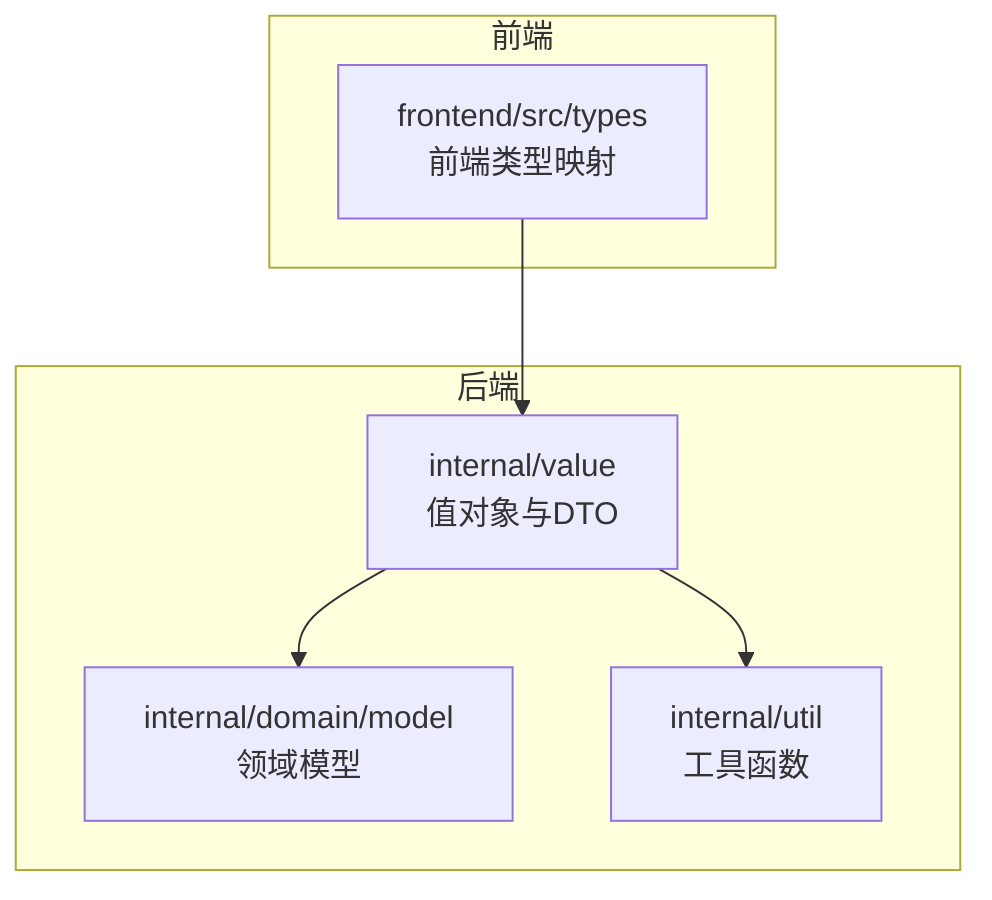
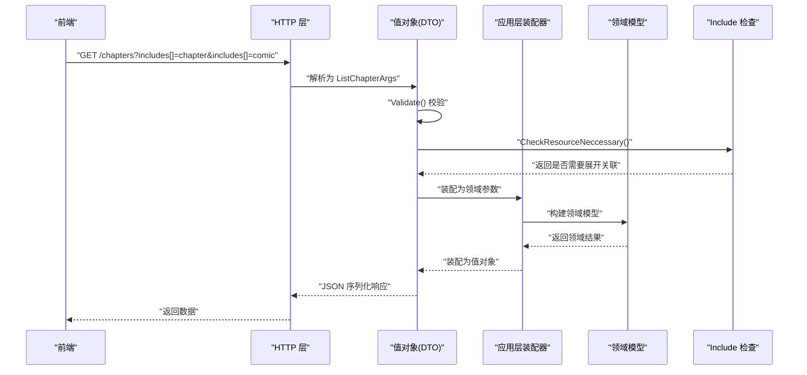
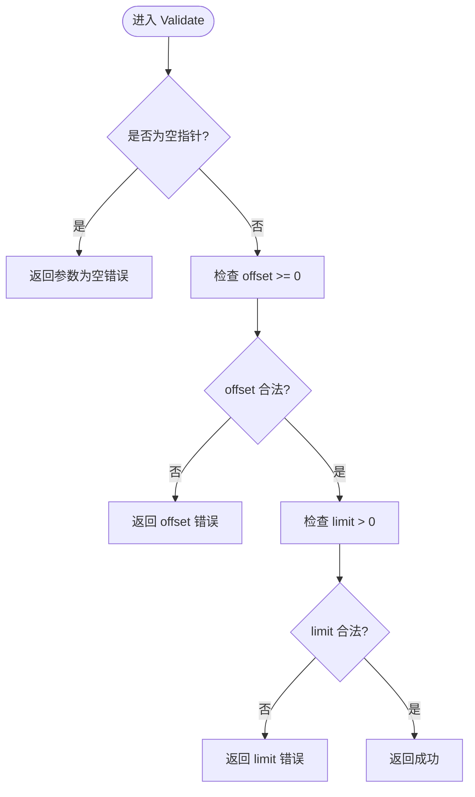
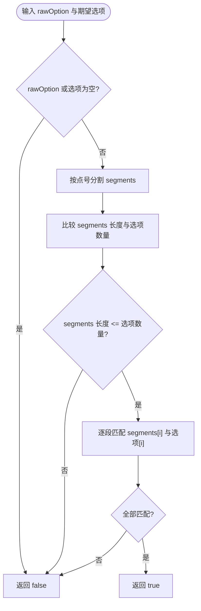
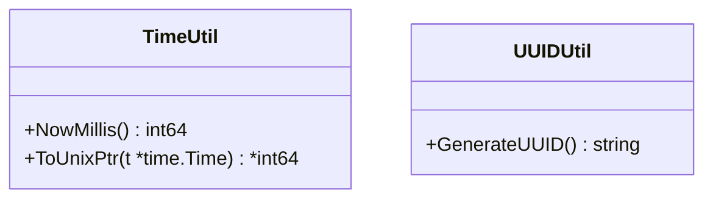
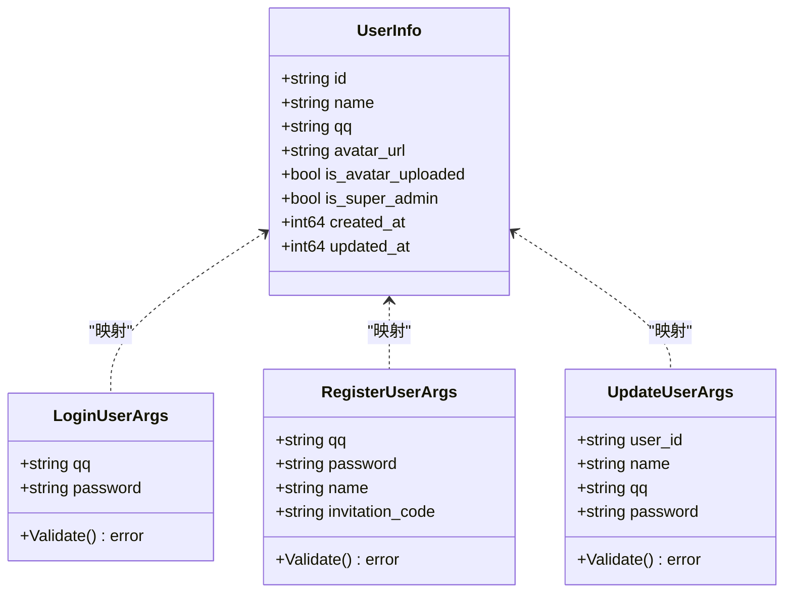
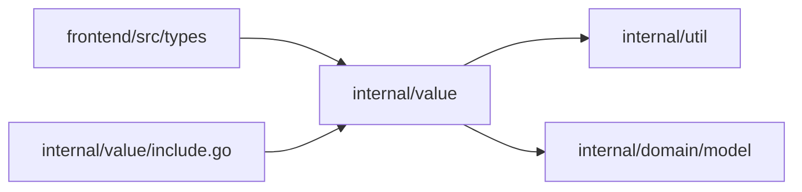

# 值对象设计

<cite>
**本文引用的文件**
- [internal/value/common.go](file://internal/value/common.go)
- [internal/value/include.go](file://internal/value/include.go)
- [internal/util/time.go](file://internal/util/time.go)
- [internal/util/uuid.go](file://internal/util/uuid.go)
- [frontend/src/types/common.ts](file://frontend/src/types/common.ts)
- [internal/value/assignment.go](file://internal/value/assignment.go)
- [internal/value/chapter.go](file://internal/value/chapter.go)
- [internal/value/comic.go](file://internal/value/comic.go)
- [internal/value/team.go](file://internal/value/team.go)
- [internal/value/workset.go](file://internal/value/workset.go)
- [internal/value/user.go](file://internal/value/user.go)
- [internal/value/member.go](file://internal/value/member.go)
- [frontend/src/types/domain.ts](file://frontend/src/types/domain.ts)
- [internal/domain/model/user.go](file://internal/domain/model/user.go)
- [internal/domain/model/workflow.go](file://internal/domain/model/workflow.go)
</cite>

## 目录
1. [引言](#引言)
2. [项目结构](#项目结构)
3. [核心组件](#核心组件)
4. [架构总览](#架构总览)
5. [详细组件分析](#详细组件分析)
6. [依赖分析](#依赖分析)
7. [性能考虑](#性能考虑)
8. [故障排查指南](#故障排查指南)
9. [结论](#结论)
10. [附录](#附录)

## 引言
本设计文档围绕漫画翻译协作平台中的值对象与DTO设计展开，系统阐述以下主题：
- DTO对象的定义、类型转换规则与序列化机制
- Include模式的设计思想与N+1查询优化策略
- 通用值对象（时间戳、UUID、字符串处理）的设计与使用
- 值对象的不可变性、相等性与哈希计算保障
- 前端数据模型映射、类型安全与错误处理
- 值对象在各层之间的传递规范与性能优化

## 项目结构
本项目采用分层与按领域模块组织的结构，值对象主要位于 internal/value 下，配合 internal/domain/model 提供领域模型，frontend/src/types 提供前端类型映射。

**图表来源**
- [internal/value/assignment.go:1-131](file://internal/value/assignment.go#L1-L131)
- [internal/value/chapter.go:1-148](file://internal/value/chapter.go#L1-L148)
- [internal/value/comic.go:1-124](file://internal/value/comic.go#L1-L124)
- [internal/value/team.go:1-112](file://internal/value/team.go#L1-L112)
- [internal/value/workset.go:1-89](file://internal/value/workset.go#L1-L89)
- [internal/value/user.go:1-171](file://internal/value/user.go#L1-L171)
- [internal/value/member.go:1-139](file://internal/value/member.go#L1-L139)
- [internal/domain/model/user.go:1-100](file://internal/domain/model/user.go#L1-L100)
- [internal/domain/model/workflow.go:1-36](file://internal/domain/model/workflow.go#L1-L36)
- [internal/util/time.go:1-18](file://internal/util/time.go#L1-L18)
- [internal/util/uuid.go:1-13](file://internal/util/uuid.go#L1-L13)
- [frontend/src/types/common.ts:1-41](file://frontend/src/types/common.ts#L1-L41)
- [frontend/src/types/domain.ts:1-89](file://frontend/src/types/domain.ts#L1-L89)

**章节来源**
- [internal/value/assignment.go:1-131](file://internal/value/assignment.go#L1-L131)
- [internal/value/chapter.go:1-148](file://internal/value/chapter.go#L1-L148)
- [internal/value/comic.go:1-124](file://internal/value/comic.go#L1-L124)
- [internal/value/team.go:1-112](file://internal/value/team.go#L1-L112)
- [internal/value/workset.go:1-89](file://internal/value/workset.go#L1-L89)
- [internal/value/user.go:1-171](file://internal/value/user.go#L1-L171)
- [internal/value/member.go:1-139](file://internal/value/member.go#L1-L139)
- [internal/domain/model/user.go:1-100](file://internal/domain/model/user.go#L1-L100)
- [internal/domain/model/workflow.go:1-36](file://internal/domain/model/workflow.go#L1-L36)
- [internal/util/time.go:1-18](file://internal/util/time.go#L1-L18)
- [internal/util/uuid.go:1-13](file://internal/util/uuid.go#L1-L13)
- [frontend/src/types/common.ts:1-41](file://frontend/src/types/common.ts#L1-L41)
- [frontend/src/types/domain.ts:1-89](file://frontend/src/types/domain.ts#L1-L89)

## 核心组件
- 通用分页参数与校验：internal/value/common.go 提供 PaginationParams 与 Validate，确保 offset、limit 合法。
- Include模式：internal/value/include.go 定义 GetIncludeOption 常量与 CheckResourceNeccessary，用于控制关联字段的展开，避免不必要的数据加载。
- 通用工具：internal/util/time.go 提供 NowMillis 与 ToUnixPtr；internal/util/uuid.go 提供 GenerateUUID。
- 值对象集合：assignment、chapter、comic、team、workset、user、member 等 DTO，承载业务数据与校验逻辑。
- 前端类型映射：frontend/src/types/common.ts 与 frontend/src/types/domain.ts 映射后端值对象到前端类型，保证类型安全。

**章节来源**
- [internal/value/common.go:1-24](file://internal/value/common.go#L1-L24)
- [internal/value/include.go:1-46](file://internal/value/include.go#L1-L46)
- [internal/util/time.go:1-18](file://internal/util/time.go#L1-L18)
- [internal/util/uuid.go:1-13](file://internal/util/uuid.go#L1-L13)
- [frontend/src/types/common.ts:1-41](file://frontend/src/types/common.ts#L1-L41)
- [frontend/src/types/domain.ts:1-89](file://frontend/src/types/domain.ts#L1-L89)

## 架构总览
值对象在系统中的流转路径如下：
- 前端通过 HTTP 请求携带查询参数（含 includes[]）与表单数据
- 后端 HTTP 层接收请求，解析为 internal/value 下的 DTO（如 ListXxxArgs）
- DTO 内部调用 Validate 对参数进行合法性校验
- 应用层装配器将 DTO 转换为 internal/domain/model 的领域模型
- 领域服务执行业务逻辑，必要时通过 Include 模式决定关联数据加载
- 返回结果经装配器转回 internal/value 的 DTO，并序列化为 JSON 响应

**图表来源**
- [internal/value/chapter.go:41-61](file://internal/value/chapter.go#L41-L61)
- [internal/value/include.go:24-45](file://internal/value/include.go#L24-L45)
- [internal/value/common.go:10-23](file://internal/value/common.go#L10-L23)

## 详细组件分析

### 分页参数与校验（PaginationParams）
- 设计要点
  - 结构体包含 offset 与 limit，支持 JSON 与 URL 解析
  - Validate 对空指针、负 offset、非正 limit 进行约束
- 类型转换与序列化
  - 通过结构体标签支持 JSON 与 URL 解析，便于 HTTP 层直接绑定
- 错误处理
  - 返回明确的错误信息，便于上层统一处理

**图表来源**
- [internal/value/common.go:10-23](file://internal/value/common.go#L10-L23)

**章节来源**
- [internal/value/common.go:1-24](file://internal/value/common.go#L1-L24)

### Include 模式与 N+1 优化
- 设计思想
  - 通过 includes[] 查询参数与 GetIncludeOption 常量，限定可展开的关联字段
  - CheckResourceNeccessary 对嵌套路径进行白名单校验，防止任意深度展开导致的 N+1
- 使用方式
  - 值对象的 Includes 字段接收 includes[]，在装配阶段根据 CheckResourceNeccessary 决定是否加载关联
- 性能收益
  - 限制关联深度与范围，避免一次性加载整棵树，降低数据库压力与网络传输

**图表来源**
- [internal/value/include.go:24-45](file://internal/value/include.go#L24-L45)

**章节来源**
- [internal/value/include.go:1-46](file://internal/value/include.go#L1-L46)

### 通用值对象：时间戳与 UUID
- 时间戳
  - NowMillis 提供毫秒级时间戳，ToUnixPtr 将 *time.Time 转换为 *int64，便于 JSON 序列化
- UUID
  - GenerateUUID 使用 v7 生成器，失败时回退至 v4，确保稳定输出

**图表来源**
- [internal/util/time.go:5-17](file://internal/util/time.go#L5-L17)
- [internal/util/uuid.go:5-12](file://internal/util/uuid.go#L5-L12)

**章节来源**
- [internal/util/time.go:1-18](file://internal/util/time.go#L1-L18)
- [internal/util/uuid.go:1-13](file://internal/util/uuid.go#L1-L13)

### 值对象：用户（User）
- 数据模型
  - UserInfo：对外暴露的用户信息值对象，包含 id、name、qq、avatar_url、is_avatar_uploaded、is_super_admin、created_at、updated_at
  - LoginUserArgs、RegisterUserArgs、UpdateUserArgs：登录、注册、更新参数，均包含 Validate 校验
- 类型转换
  - 前端类型映射：frontend/src/types/domain.ts 中的 UserInfo 映射到后端 value.UserInfo
- 不可变性与相等性
  - 值对象为结构体，建议通过工厂方法或构造器初始化，避免外部修改
  - 相等性与哈希：未显式实现，建议在需要时基于核心字段（如 id）实现
- 错误处理
  - Validate 返回明确错误，便于前端统一提示

**图表来源**
- [internal/value/user.go:76-89](file://internal/value/user.go#L76-L89)
- [internal/value/user.go:8-27](file://internal/value/user.go#L8-L27)
- [internal/value/user.go:34-69](file://internal/value/user.go#L34-L69)
- [internal/value/user.go:122-170](file://internal/value/user.go#L122-L170)
- [frontend/src/types/domain.ts:7-16](file://frontend/src/types/domain.ts#L7-L16)

**章节来源**
- [internal/value/user.go:1-171](file://internal/value/user.go#L1-L171)
- [frontend/src/types/domain.ts:1-89](file://frontend/src/types/domain.ts#L1-L89)

### 值对象：团队（Team）
- 数据模型
  - TeamInfo：包含 id、name、description、avatar_url、is_avatar_uploaded、created_at、updated_at
  - CreateTeamArgs、UpdateTeamArgs：创建与更新参数，包含 Validate 校验
- 类型转换
  - 前端类型映射：TeamInfo 映射到后端 TeamInfo
- 不可变性与相等性
  - 建议以只读方式暴露字段，必要时提供拷贝构造
- 错误处理
  - Validate 对长度与必填项进行约束

**章节来源**
- [internal/value/team.go:1-112](file://internal/value/team.go#L1-L112)
- [frontend/src/types/domain.ts:21-32](file://frontend/src/types/domain.ts#L21-L32)

### 值对象：工作集（Workset）
- 数据模型
  - WorksetInfo：包含 id、team_id、index、name、description、comic_count、created_at、updated_at
  - ListWorksetArgs、CreateWorksetArgs、UpdateWorksetArgs：查询、创建、更新参数，包含 Validate 校验
- 类型转换
  - 前端类型映射：WorksetInfo 映射到后端 WorksetInfo
- 不可变性与相等性
  - 建议以只读方式暴露字段
- 错误处理
  - Validate 对必填项与格式进行约束

**章节来源**
- [internal/value/workset.go:1-89](file://internal/value/workset.go#L1-L89)
- [frontend/src/types/domain.ts:37-46](file://frontend/src/types/domain.ts#L37-L46)

### 值对象：漫画（Comic）
- 数据模型
  - ComicInfo：包含 id、workset_id、index、title、author、description、chapter_count、creator_id、last_active_at、created_at、updated_at
  - ListComicArgs、CreateComicArgs、UpdateComicArgs：查询、创建、更新参数，包含 Validate 校验
- 类型转换
  - 前端类型映射：ComicInfo 映射到后端 ComicInfo
- 不可变性与相等性
  - 建议以只读方式暴露字段
- 错误处理
  - Validate 对长度与必填项进行约束

**章节来源**
- [internal/value/comic.go:1-124](file://internal/value/comic.go#L1-L124)
- [frontend/src/types/domain.ts:51-60](file://frontend/src/types/domain.ts#L51-L60)

### 值对象：章节（Chapter）
- 数据模型
  - ChapterInfo：包含 id、comic_id、index、subtitle、page_count、unit 统计字段、多阶段时间戳、creator_id、created_at、updated_at
  - ListChapterArgs、CreateChapterArgs、UpdateChapterArgs：查询、创建、更新参数，包含 Validate 校验
- 工作流状态
  - 通过 internal/domain/model/workflow.go 的 IsValidWorkflowCombination 校验状态组合
- 类型转换
  - 前端类型映射：ChapterInfo 映射到后端 ChapterInfo
- 不可变性与相等性
  - 建议以只读方式暴露字段
- 错误处理
  - Validate 对长度、必填项与状态组合进行约束

**章节来源**
- [internal/value/chapter.go:1-148](file://internal/value/chapter.go#L1-L148)
- [internal/domain/model/workflow.go:24-35](file://internal/domain/model/workflow.go#L24-L35)
- [frontend/src/types/domain.ts:65-74](file://frontend/src/types/domain.ts#L65-L74)

### 值对象：分配（Assignment）
- 数据模型
  - AssignmentInfo：包含 id、user_id、chapter_id、多阶段分配时间戳、created_at、updated_at
  - ListAssignmentArgs、CreateChapterAssignmentArgs、UpdateAssignmentArgs：查询、创建、更新参数，包含 Validate 校验
- 类型转换
  - 前端类型映射：AssignmentInfo 映射到后端 AssignmentInfo
- 不可变性与相等性
  - 建议以只读方式暴露字段
- 错误处理
  - Validate 对必填项进行约束

**章节来源**
- [internal/value/assignment.go:1-131](file://internal/value/assignment.go#L1-L131)
- [frontend/src/types/domain.ts:79-88](file://frontend/src/types/domain.ts#L79-L88)

### 值对象：成员（Member）
- 数据模型
  - MemberInfo：包含 id、user_id、team_id、roles、多阶段分配时间戳、created_at、updated_at
  - ListTeamMemberArgs、ListMyMemberArgs、CreateMemberArgs、JoinTeamArgs、UpdateMemberRoleArgs：查询、创建、加入、更新角色参数，包含 Validate 校验
- 类型转换
  - 前端类型映射：未直接提供 MemberInfo 映射，可在前端自定义
- 不可变性与相等性
  - 建议以只读方式暴露字段
- 错误处理
  - Validate 对必填项与角色掩码进行约束

**章节来源**
- [internal/value/member.go:1-139](file://internal/value/member.go#L1-L139)

### 前端类型映射与类型安全
- 通用类型
  - frontend/src/types/common.ts 定义 PaginationQuery、IncludeQuery、ApiErrorPayload，用于分页、关联展开与统一错误结构
- 领域类型
  - frontend/src/types/domain.ts 定义 UserInfo、TeamInfo、WorksetInfo、ComicInfo、ChapterInfo、AssignmentInfo，与后端值对象一一对应
- 类型安全保证
  - 通过 TypeScript 接口在编译期约束字段类型与可选性
- 错误处理机制
  - ApiErrorPayload 支持后端返回 code 与 message，前端可据此进行差异化提示

**章节来源**
- [frontend/src/types/common.ts:1-41](file://frontend/src/types/common.ts#L1-L41)
- [frontend/src/types/domain.ts:1-89](file://frontend/src/types/domain.ts#L1-L89)

## 依赖分析
- 值对象层依赖
  - internal/value 依赖 internal/util 提供的时间与 UUID 工具
  - internal/value 依赖 internal/domain/model 提供的领域模型与枚举（如 Workflow、RoleMask）
- 前后端类型映射
  - 前端 types 与后端 value 保持字段一致性，避免运行时转换错误
- Include 模式依赖
  - CheckResourceNeccessary 依赖字符串切分与常量白名单，确保展开范围可控

**图表来源**
- [internal/value/include.go:1-46](file://internal/value/include.go#L1-L46)
- [internal/util/time.go:1-18](file://internal/util/time.go#L1-L18)
- [internal/util/uuid.go:1-13](file://internal/util/uuid.go#L1-L13)
- [internal/domain/model/workflow.go:1-36](file://internal/domain/model/workflow.go#L1-L36)
- [frontend/src/types/common.ts:1-41](file://frontend/src/types/common.ts#L1-L41)
- [frontend/src/types/domain.ts:1-89](file://frontend/src/types/domain.ts#L1-L89)

**章节来源**
- [internal/value/include.go:1-46](file://internal/value/include.go#L1-L46)
- [internal/util/time.go:1-18](file://internal/util/time.go#L1-L18)
- [internal/util/uuid.go:1-13](file://internal/util/uuid.go#L1-L13)
- [internal/domain/model/workflow.go:1-36](file://internal/domain/model/workflow.go#L1-L36)
- [frontend/src/types/common.ts:1-41](file://frontend/src/types/common.ts#L1-L41)
- [frontend/src/types/domain.ts:1-89](file://frontend/src/types/domain.ts#L1-L89)

## 性能考虑
- Include 模式
  - 通过 CheckResourceNeccessary 限制展开层级，避免深度关联导致的 N+1 查询
- 分页参数
  - PaginationParams.Validate 控制 offset 与 limit，避免超大分页造成内存与数据库压力
- 时间戳与 UUID
  - 使用 NowMillis 与 GenerateUUID 生成高效、稳定的标识与时间戳，减少序列化开销
- 序列化
  - 值对象结构体直接支持 JSON 标签，减少自定义序列化逻辑

[本节为通用指导，无需特定文件来源]

## 故障排查指南
- 参数校验失败
  - 检查 ListXxxArgs 的 Validate 是否被正确调用，确认 includes[] 是否符合白名单
- Include 展开异常
  - 确认 includes[] 与 CheckResourceNeccessary 的预期一致，避免非法路径
- 时间戳与 UUID 生成异常
  - 确认内部工具函数可用，必要时检查第三方库版本
- 前后端类型不一致
  - 对照 frontend/src/types 与 internal/value 的字段定义，确保命名与类型一致

**章节来源**
- [internal/value/common.go:10-23](file://internal/value/common.go#L10-L23)
- [internal/value/include.go:24-45](file://internal/value/include.go#L24-L45)
- [internal/util/time.go:5-17](file://internal/util/time.go#L5-L17)
- [internal/util/uuid.go:5-12](file://internal/util/uuid.go#L5-L12)
- [frontend/src/types/common.ts:1-41](file://frontend/src/types/common.ts#L1-L41)
- [frontend/src/types/domain.ts:1-89](file://frontend/src/types/domain.ts#L1-L89)

## 结论
本设计通过值对象与DTO的清晰划分、Include模式的关联展开控制、通用工具的统一封装以及前后端类型的强约束，实现了：
- 明确的数据边界与类型安全
- 可控的关联加载与 N+1 优化
- 稳健的参数校验与错误处理
- 高效的时间戳与标识生成

这些实践为平台在复杂业务场景下的可维护性与性能提供了坚实基础。

## 附录
- 值对象不可变性与相等性建议
  - 使用只读字段与拷贝构造，避免外部修改
  - 在需要时基于核心字段（如 id）实现相等性与哈希计算
- 值对象在各层传递规范
  - HTTP 层负责参数解析与校验
  - 应用层负责装配与业务执行
  - 表现层负责渲染与交互
- 性能优化策略
  - 优先使用 Include 模式控制关联加载
  - 合理设置分页参数，避免一次性加载过多数据
  - 复用工具函数，减少重复逻辑与错误

[本节为通用指导，无需特定文件来源]