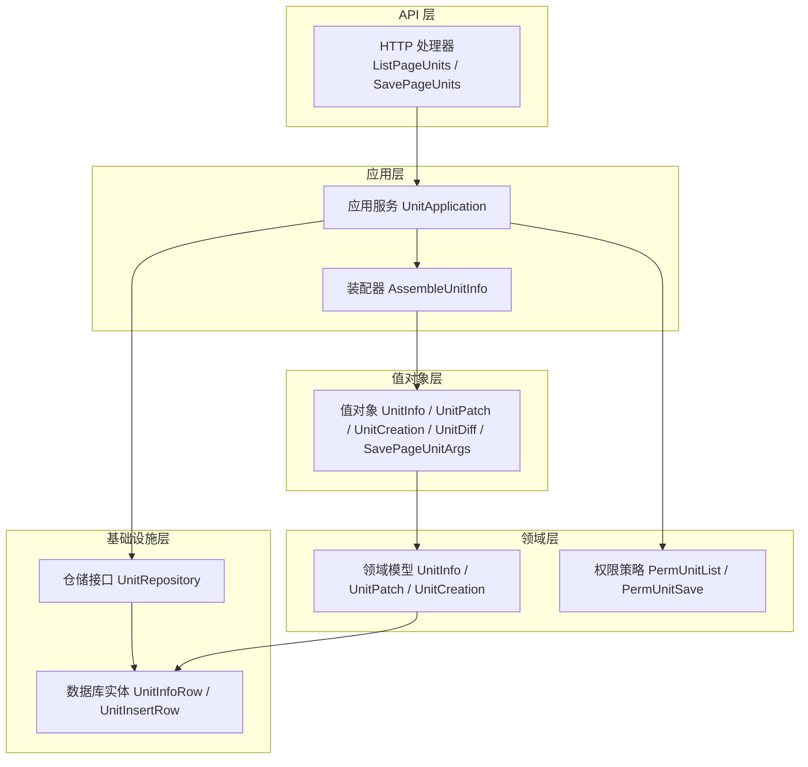
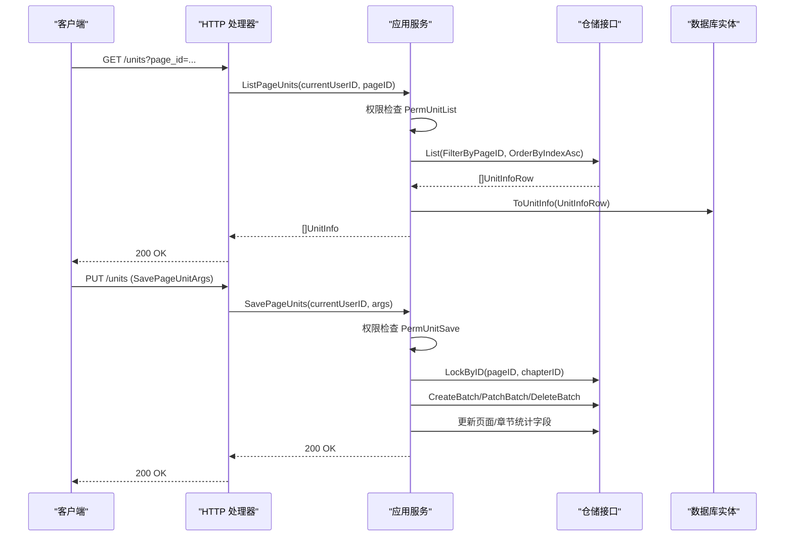
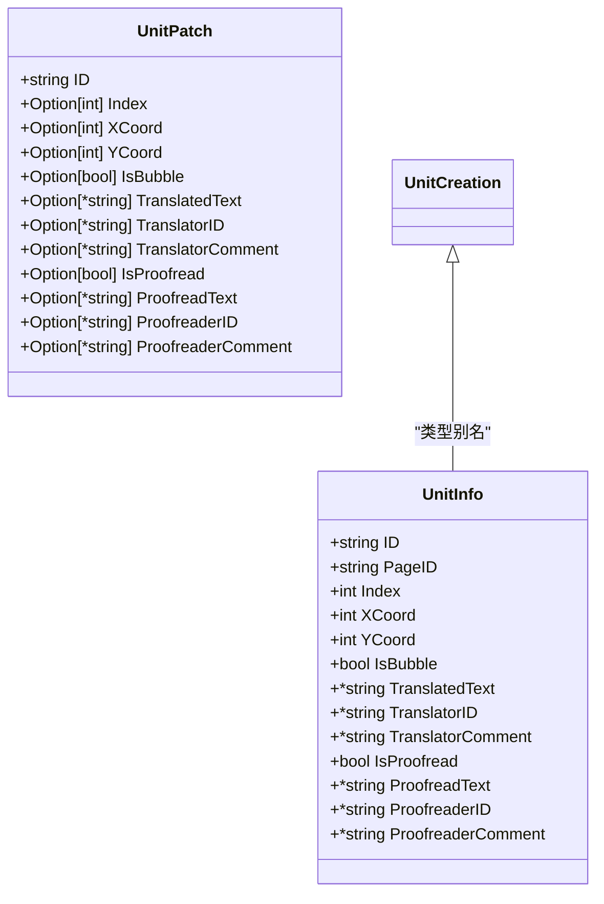
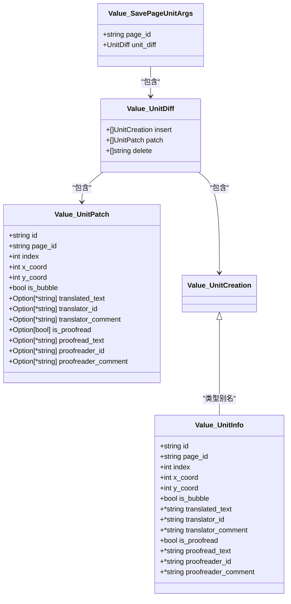
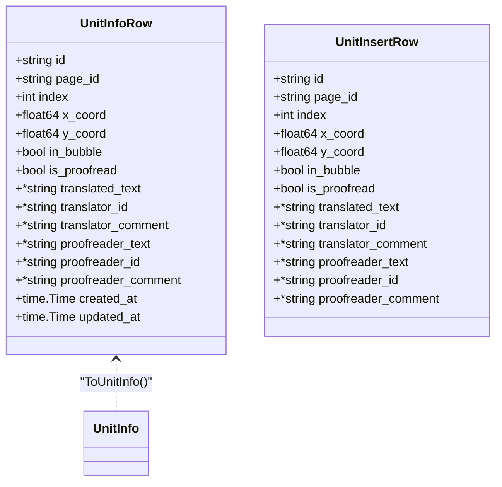
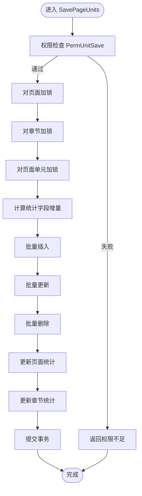
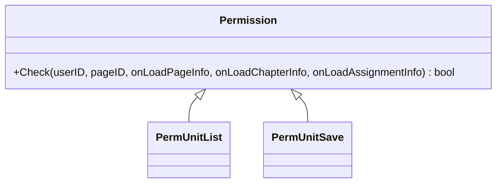
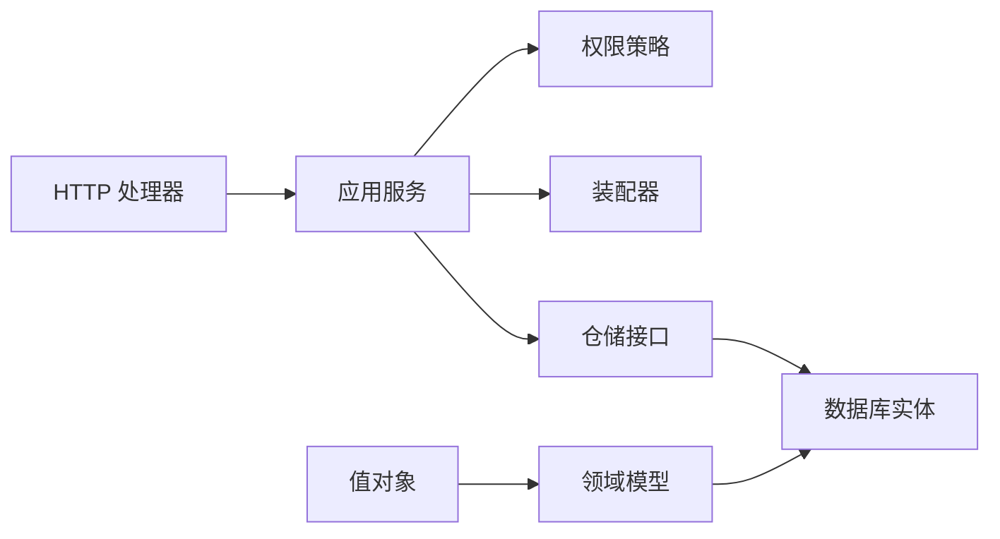

# 单元模型

<cite>
**本文档引用的文件**
- [unit.go](file://internal/domain/model/unit.go)
- [unit.go](file://internal/infrastructure/repository/entity/unit.go)
- [unit.go](file://internal/application/assembler/unit.go)
- [unit.go](file://internal/api/http/unit.go)
- [unit.go](file://internal/application/unit.go)
- [unit.go](file://internal/domain/repository/unit.go)
- [unit.go](file://internal/value/unit.go)
- [20260306101216_unit-table.up.sql](file://migrations/20260306101216_unit-table.up.sql)
- [permission.go](file://internal/domain/model/permission.go)
- [page.go](file://internal/domain/model/page.go)
- [chapter.go](file://internal/domain/model/chapter.go)
- [assignment.go](file://internal/domain/model/assignment.go)
</cite>

## 目录
1. [简介](#简介)
2. [项目结构](#项目结构)
3. [核心组件](#核心组件)
4. [架构总览](#架构总览)
5. [详细组件分析](#详细组件分析)
6. [依赖分析](#依赖分析)
7. [性能考虑](#性能考虑)
8. [故障排除指南](#故障排除指南)
9. [结论](#结论)
10. [附录](#附录)

## 简介
本文件系统性梳理“单元模型”（Unit）的数据模型设计与业务实现，覆盖以下关键主题：
- 单元实体的字段定义与业务含义（如单元坐标、气泡标记、翻译与校对状态等）
- 单元在组织架构与工作流中的定位与职责
- 单元与用户、任务（分配）、页面、章节之间的关联关系
- 权限控制机制与数据完整性约束
- 验证规则、命名规范与最佳实践

## 项目结构
围绕单元模型的关键代码分布在以下层次：
- 领域层（domain/model）：定义单元领域模型与权限策略
- 值对象层（value）：API 层 DTO，负责序列化/反序列化
- 应用层（application）：编排业务流程、权限校验、事务与统计更新
- 基础设施层（infrastructure/repository/entity）：数据库实体映射与转换
- API 层（api/http）：HTTP 接口定义与参数解析
- 数据库迁移（migrations）：单元表结构与索引

图表来源
- [unit.go:10-91](file://internal/api/http/unit.go#L10-L91)
- [unit.go:18-79](file://internal/application/unit.go#L18-L79)
- [unit.go:8-26](file://internal/application/assembler/unit.go#L8-L26)
- [unit.go:7-149](file://internal/domain/model/unit.go#L7-L149)
- [unit.go:14-83](file://internal/infrastructure/repository/entity/unit.go#L14-L83)
- [unit.go:5-59](file://internal/value/unit.go#L5-L59)

章节来源
- [unit.go:10-91](file://internal/api/http/unit.go#L10-L91)
- [unit.go:18-79](file://internal/application/unit.go#L18-L79)
- [unit.go:8-26](file://internal/application/assembler/unit.go#L8-L26)
- [unit.go:7-149](file://internal/domain/model/unit.go#L7-L149)
- [unit.go:14-83](file://internal/infrastructure/repository/entity/unit.go#L14-L83)
- [unit.go:5-59](file://internal/value/unit.go#L5-L59)

## 核心组件
本节聚焦单元模型的四大核心类型及其职责：
- 领域模型（Domain Model）
  - UnitInfo：单元的完整状态与位置信息
  - UnitPatch：增量更新的“补丁”结构，采用 Option 语义表达“是否修改”
  - UnitCreation：创建单元的输入结构，与 UnitInfo 字段一致
- 值对象（Value Object）
  - UnitInfo / UnitPatch / UnitCreation：API 层 DTO，用于 JSON 序列化
  - UnitDiff / SavePageUnitArgs：批量 diff 操作的参数载体
- 数据库实体（Entity）
  - UnitInfoRow / UnitInsertRow：ORM 映射，包含数据库字段与转换函数
- 应用服务（Application）
  - UnitApplication：提供列表查询与批量保存（insert/patch/delete）能力
- 仓储接口（Repository）
  - UnitRepository：提供批量操作与悲观锁支持
- 权限策略（Permission）
  - PermUnitList / PermUnitSave：基于分配角色的细粒度权限控制

章节来源
- [unit.go:7-149](file://internal/domain/model/unit.go#L7-L149)
- [unit.go:5-59](file://internal/value/unit.go#L5-L59)
- [unit.go:14-83](file://internal/infrastructure/repository/entity/unit.go#L14-L83)
- [unit.go:18-79](file://internal/application/unit.go#L18-L79)
- [unit.go:5-16](file://internal/domain/repository/unit.go#L5-L16)
- [permission.go:729-794](file://internal/domain/model/permission.go#L729-L794)

## 架构总览
单元模型遵循清晰的分层架构，确保职责分离与可测试性：
- API 层负责参数解析与响应封装
- 应用层负责业务编排、权限校验与事务控制
- 领域层承载业务不变式与模型定义
- 基础设施层负责持久化与实体映射
- 值对象层作为跨层的数据契约

图表来源
- [unit.go:22-91](file://internal/api/http/unit.go#L22-L91)
- [unit.go:81-123](file://internal/application/unit.go#L81-L123)
- [unit.go:125-415](file://internal/application/unit.go#L125-L415)
- [unit.go:64-83](file://internal/infrastructure/repository/entity/unit.go#L64-L83)

章节来源
- [unit.go:22-91](file://internal/api/http/unit.go#L22-L91)
- [unit.go:81-123](file://internal/application/unit.go#L81-L123)
- [unit.go:125-415](file://internal/application/unit.go#L125-L415)
- [unit.go:64-83](file://internal/infrastructure/repository/entity/unit.go#L64-L83)

## 详细组件分析

### 领域模型（UnitInfo / UnitPatch / UnitCreation）
- 字段与业务含义
  - 标识与归属：ID、PageID
  - 空间与布局：Index、XCoord、YCoord、IsBubble
  - 翻译状态：TranslatedText、TranslatorID、TranslatorComment
  - 校对状态：IsProofread、ProofreadText、ProofreaderID、ProofreaderComment
- 设计要点
  - UnitCreation 与 UnitInfo 完全一致，采用类型别名避免重复
  - UnitPatch 使用 Option 语义表达“是否修改”，提升 PATCH 的幂等性与安全性
- 复杂度与性能
  - 构造函数集中管理字段初始化，便于后续扩展与一致性校验

图表来源
- [unit.go:7-149](file://internal/domain/model/unit.go#L7-L149)

章节来源
- [unit.go:7-149](file://internal/domain/model/unit.go#L7-L149)

### 值对象（value.UnitInfo / UnitPatch / UnitCreation / UnitDiff / SavePageUnitArgs）
- 用途
  - API 层 DTO，负责 JSON 序列化与反序列化
  - UnitDiff/SavePageUnitArgs 描述批量 diff 操作的输入结构
- 设计原则
  - 使用 snake_case JSON 标签，配合 omitempty 控制输出
  - PUT 语义：nil 表示置空，非 nil 表示更新值

图表来源
- [unit.go:5-59](file://internal/value/unit.go#L5-L59)

章节来源
- [unit.go:5-59](file://internal/value/unit.go#L5-L59)

### 数据库实体与映射（UnitInfoRow / UnitInsertRow）
- 字段映射
  - 数据库 REAL 类型映射为 Go float64；布尔字段保持一致
  - 字段命名与 JSON 标签保持一致，便于序列化/反序列化
- 转换函数
  - ToUnitInfo：将数据库行转换为领域模型，补充 PageID

图表来源
- [unit.go:14-83](file://internal/infrastructure/repository/entity/unit.go#L14-L83)

章节来源
- [unit.go:14-83](file://internal/infrastructure/repository/entity/unit.go#L14-L83)

### 应用服务（UnitApplication）
- 列表查询
  - 权限检查：仅译者/校对者可查看单元列表
  - 查询顺序：按 Index 升序返回
- 批量保存（diff 语义）
  - 权限检查：仅译者/校对者可保存单元
  - 并发控制：对页面与章节进行悲观锁，防止并发冲突
  - 统计更新：在同一事务内更新页面与章节的统计字段（总数、已翻译数、已校对数），并保证非负
  - 幂等性：未匹配的 Update/Delete 不报错，满足协作场景需求

图表来源
- [unit.go:125-415](file://internal/application/unit.go#L125-L415)

章节来源
- [unit.go:18-79](file://internal/application/unit.go#L18-L79)
- [unit.go:81-123](file://internal/application/unit.go#L81-L123)
- [unit.go:125-415](file://internal/application/unit.go#L125-L415)

### 权限控制机制
- 权限策略
  - PermUnitList：仅译者/校对者可查看单元列表
  - PermUnitSave：仅译者/校对者可保存单元
- 权限判定依据
  - 基于 Assignment（分配）角色判定，结合 Page/Chapter 信息进行授权
- 与用户、任务的关系
  - 用户的角色来源于 Assignment（译者、校对者等）
  - 单元的可见性与可编辑性取决于用户在对应章节上的角色

图表来源
- [permission.go:729-794](file://internal/domain/model/permission.go#L729-L794)

章节来源
- [permission.go:729-794](file://internal/domain/model/permission.go#L729-L794)
- [assignment.go:57-88](file://internal/domain/model/assignment.go#L57-L88)
- [page.go:5-22](file://internal/domain/model/page.go#L5-L22)
- [chapter.go:5-35](file://internal/domain/model/chapter.go#L5-L35)

### 数据完整性约束与验证规则
- 数据库层面
  - 主键：id
  - 外键：page_id 引用 page_table，译者/校对者 ID 引用 user_table（ON DELETE SET NULL）
  - 唯一索引：page_id + index 组合唯一，保证页面内单元索引唯一
  - 时间戳：created_at / updated_at 默认当前时间
- 应用层约束
  - 幂等更新：未匹配的 Update/Delete 不报错
  - 统计非负：页面/章节统计字段在事务内更新后仍需非负
- 命名规范
  - 字段使用 snake_case，JSON 标签与数据库列名一致
  - Option 语义明确 PATCH 的“是否修改”

章节来源
- [20260306101216_unit-table.up.sql:1-30](file://migrations/20260306101216_unit-table.up.sql#L1-L30)
- [unit.go:362-370](file://internal/application/unit.go#L362-L370)
- [unit.go:390-398](file://internal/application/unit.go#L390-L398)

## 依赖分析
- 组件耦合
  - 应用层依赖权限策略、仓储接口与装配器
  - 仓储接口与实体解耦，便于替换存储实现
- 关键依赖链
  - HTTP -> 应用服务 -> 权限策略/仓储 -> 实体
- 循环依赖
  - 各层之间单向依赖，未发现循环依赖

图表来源
- [unit.go:22-91](file://internal/api/http/unit.go#L22-L91)
- [unit.go:18-79](file://internal/application/unit.go#L18-L79)
- [unit.go:8-26](file://internal/application/assembler/unit.go#L8-L26)
- [unit.go:7-149](file://internal/domain/model/unit.go#L7-L149)
- [unit.go:14-83](file://internal/infrastructure/repository/entity/unit.go#L14-L83)

章节来源
- [unit.go:22-91](file://internal/api/http/unit.go#L22-L91)
- [unit.go:18-79](file://internal/application/unit.go#L18-L79)
- [unit.go:8-26](file://internal/application/assembler/unit.go#L8-L26)
- [unit.go:7-149](file://internal/domain/model/unit.go#L7-L149)
- [unit.go:14-83](file://internal/infrastructure/repository/entity/unit.go#L14-L83)

## 性能考虑
- 并发控制
  - 使用悲观锁锁定页面与章节，避免高并发下的数据竞争
- 批量操作
  - CreateBatch/PatchBatch/DeleteBatch 提升批量写入效率
- 统计更新
  - 在同一事务内更新页面/章节统计，减少二次读取与锁竞争
- 查询优化
  - 为 page_id 建立索引，加速按页面查询与加锁

## 故障排除指南
- 权限不足
  - 现象：返回 403 Forbidden
  - 原因：用户在对应章节上不具备译者/校对者角色
  - 处理：确认 Assignment 角色配置
- 事务失败
  - 现象：保存失败并回滚
  - 原因：加锁失败、批量操作异常、统计字段负值
  - 处理：重试请求，检查并发写入与输入参数
- 统计字段异常
  - 现象：页面/章节统计字段出现负值
  - 原因：删除数量超过现有计数
  - 处理：修正输入 diff，确保删除数量不超过现有计数

章节来源
- [unit.go:140-150](file://internal/application/unit.go#L140-L150)
- [unit.go:218-235](file://internal/application/unit.go#L218-L235)
- [unit.go:362-370](file://internal/application/unit.go#L362-L370)
- [unit.go:390-398](file://internal/application/unit.go#L390-L398)

## 结论
单元模型通过清晰的分层设计与严格的权限控制，实现了在翻译与校对工作流中的高效协作。其核心特性包括：
- 以 Option 语义表达的增量更新，确保 PATCH 的幂等性
- 基于分配角色的细粒度权限控制
- 并发安全的批量操作与统计更新
- 完整的数据库约束与应用层校验

这些设计共同保障了单元数据在权限管理与资源分配场景下的正确性与可靠性。

## 附录
- 单元在组织架构中的作用
  - 单元是页面内容的基本处理单元，承载翻译与校对状态
  - 通过 Assignment 将用户角色与页面/章节绑定，决定单元的可见性与可编辑性
- 最佳实践
  - 使用 SavePageUnits 的 diff 语义进行批量更新，减少网络往返
  - 在高并发场景下，合理规划页面拆分与批处理大小，降低锁竞争
  - 严格遵守 Option 语义，避免误判“清空”与“不更新”的边界情况