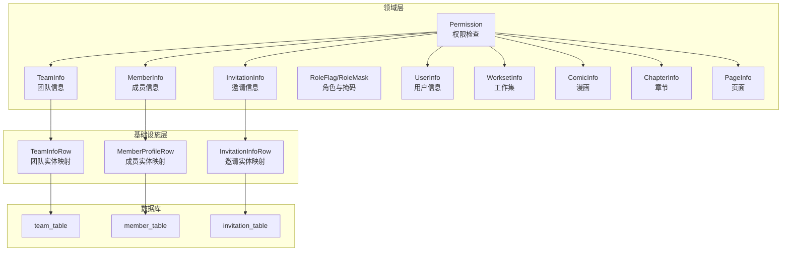
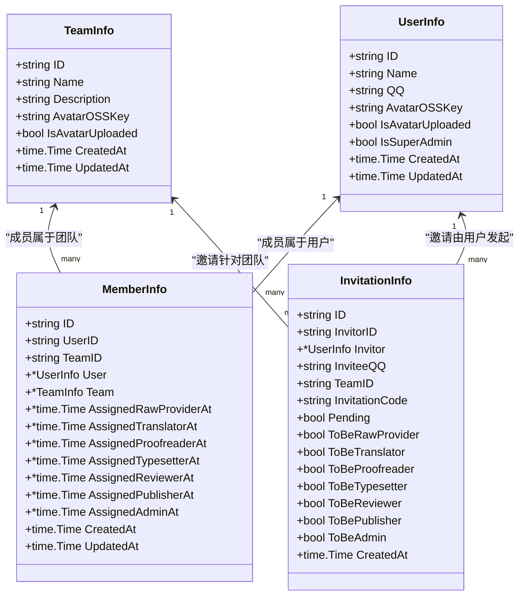
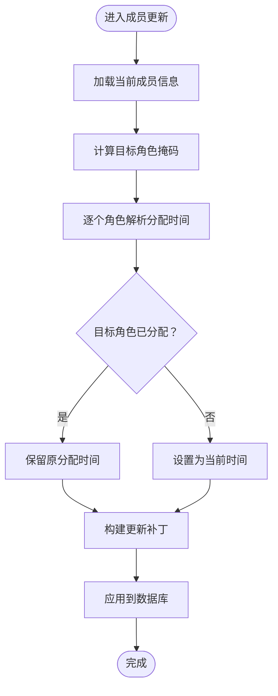
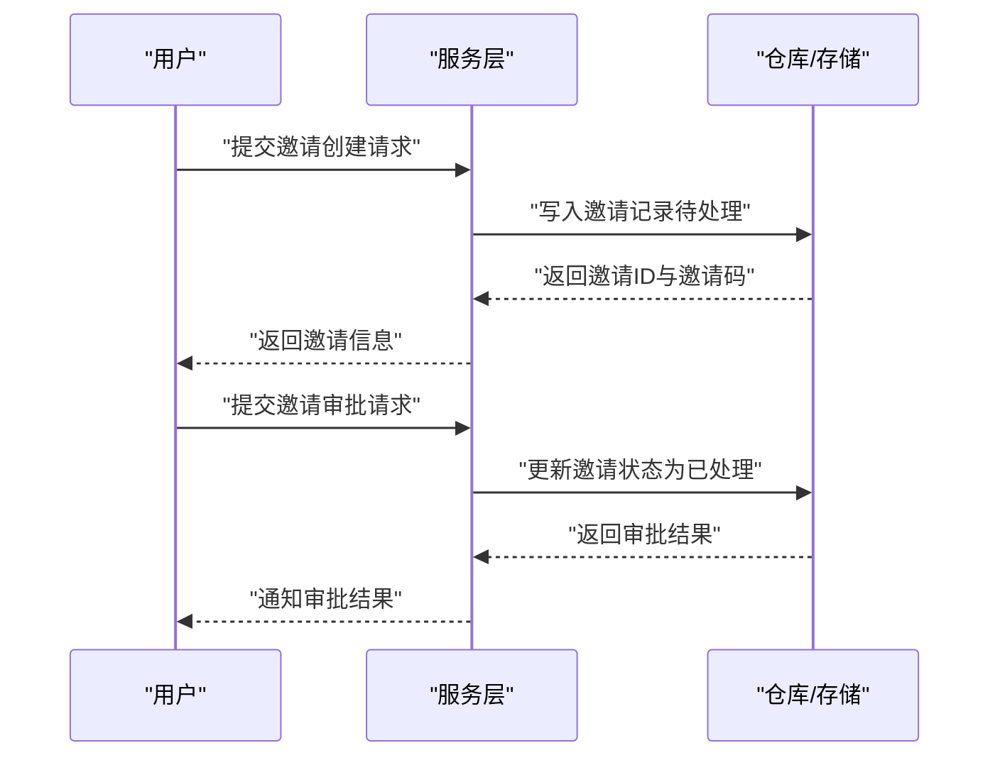
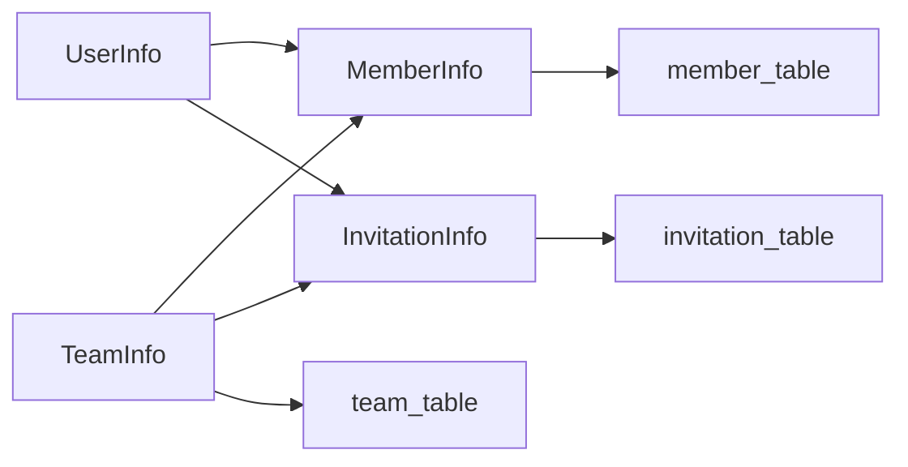

# 团队模型

<cite>
**本文引用的文件**
- [internal/domain/model/team.go](file://internal/domain/model/team.go)
- [internal/domain/model/member.go](file://internal/domain/model/member.go)
- [internal/domain/model/invitation.go](file://internal/domain/model/invitation.go)
- [internal/domain/model/role.go](file://internal/domain/model/role.go)
- [internal/domain/model/permission.go](file://internal/domain/model/permission.go)
- [internal/domain/model/user.go](file://internal/domain/model/user.go)
- [internal/domain/model/workset.go](file://internal/domain/model/workset.go)
- [internal/domain/model/comic.go](file://internal/domain/model/comic.go)
- [internal/domain/model/chapter.go](file://internal/domain/model/chapter.go)
- [internal/domain/model/page.go](file://internal/domain/model/page.go)
- [internal/infrastructure/repository/entity/team.go](file://internal/infrastructure/repository/entity/team.go)
- [internal/infrastructure/repository/entity/member.go](file://internal/infrastructure/repository/entity/member.go)
- [internal/infrastructure/repository/entity/invitation.go](file://internal/infrastructure/repository/entity/invitation.go)
- [migrations/20260301065012_team-table.up.sql](file://migrations/20260301065012_team-table.up.sql)
- [migrations/20260301075641_member-table.up.sql](file://migrations/20260301075641_member-table.up.sql)
- [migrations/20260301075642_invitation-table.up.sql](file://migrations/20260301075642_invitation-table.up.sql)
</cite>

## 目录
1. [简介](#简介)
2. [项目结构](#项目结构)
3. [核心组件](#核心组件)
4. [架构总览](#架构总览)
5. [详细组件分析](#详细组件分析)
6. [依赖分析](#依赖分析)
7. [性能考虑](#性能考虑)
8. [故障排查指南](#故障排查指南)
9. [结论](#结论)
10. [附录](#附录)

## 简介
本文件为团队模型的全面数据模型文档，聚焦于以下目标：
- 详述 TeamInfo 实体的字段定义与用途（团队名称、描述、头像键、上传状态、创建/更新时间等）。
- 解释团队成员关系模型，包括 Member 实体的角色分配、权限级别、加入状态等字段及行为。
- 说明团队与用户之间的多对多关系实现，以及成员邀请与审批流程的数据结构。
- 给出团队数据的访问控制规则、权限继承机制与团队生命周期管理策略。
- 阐明团队模型在任务分配与内容管理中的作用与影响。

## 项目结构
团队模型位于领域层（domain/model），并通过基础设施层的实体映射（entity）与数据库表结构（migrations）进行持久化。权限控制逻辑集中在领域层的权限模块中，贯穿团队、成员、邀请与内容管理的全链路。

图表来源
- [internal/domain/model/team.go:5-15](file://internal/domain/model/team.go#L5-L15)
- [internal/domain/model/member.go:48-69](file://internal/domain/model/member.go#L48-L69)
- [internal/domain/model/invitation.go:63-84](file://internal/domain/model/invitation.go#L63-L84)
- [internal/infrastructure/repository/entity/team.go:12-21](file://internal/infrastructure/repository/entity/team.go#L12-L21)
- [internal/infrastructure/repository/entity/member.go:11-28](file://internal/infrastructure/repository/entity/member.go#L11-L28)
- [internal/infrastructure/repository/entity/invitation.go:11-39](file://internal/infrastructure/repository/entity/invitation.go#L11-L39)
- [migrations/20260301065012_team-table.up.sql:1-12](file://migrations/20260301065012_team-table.up.sql#L1-L12)
- [migrations/20260301075641_member-table.up.sql:1-19](file://migrations/20260301075641_member-table.up.sql#L1-L19)
- [migrations/20260301075642_invitation-table.up.sql:1-22](file://migrations/20260301075642_invitation-table.up.sql#L1-L22)

章节来源
- [internal/domain/model/team.go:1-63](file://internal/domain/model/team.go#L1-L63)
- [internal/domain/model/member.go:1-205](file://internal/domain/model/member.go#L1-L205)
- [internal/domain/model/invitation.go:1-158](file://internal/domain/model/invitation.go#L1-L158)
- [internal/infrastructure/repository/entity/team.go:1-47](file://internal/infrastructure/repository/entity/team.go#L1-L47)
- [internal/infrastructure/repository/entity/member.go:1-143](file://internal/infrastructure/repository/entity/member.go#L1-L143)
- [internal/infrastructure/repository/entity/invitation.go:1-98](file://internal/infrastructure/repository/entity/invitation.go#L1-L98)
- [migrations/20260301065012_team-table.up.sql:1-16](file://migrations/20260301065012_team-table.up.sql#L1-L16)
- [migrations/20260301075641_member-table.up.sql:1-63](file://migrations/20260301075641_member-table.up.sql#L1-L63)
- [migrations/20260301075642_invitation-table.up.sql:1-27](file://migrations/20260301075642_invitation-table.up.sql#L1-L27)

## 核心组件
- TeamInfo：团队基本信息与元数据，包含标识、名称、描述、头像键与上传状态、创建/更新时间等。
- MemberInfo：成员关系记录，承载用户在团队内的角色分配时间戳、关联的用户与团队信息、以及创建/更新时间。
- InvitationInfo：邀请记录，包含发起人、目标团队、被邀请人 QQ、唯一邀请码、待处理状态、角色期望与创建时间。
- 角色系统：基于位掩码的角色标志与掩码，支持多角色组合与动态计算。
- 权限系统：以“权限对象+Check”模式封装各类资源的访问控制，结合成员关系与团队管理员身份进行判定。

章节来源
- [internal/domain/model/team.go:5-15](file://internal/domain/model/team.go#L5-L15)
- [internal/domain/model/member.go:48-69](file://internal/domain/model/member.go#L48-L69)
- [internal/domain/model/invitation.go:63-84](file://internal/domain/model/invitation.go#L63-L84)
- [internal/domain/model/role.go:3-56](file://internal/domain/model/role.go#L3-L56)
- [internal/domain/model/permission.go:198-350](file://internal/domain/model/permission.go#L198-L350)

## 架构总览
团队模型围绕“团队—成员—用户”的多对多关系展开，并通过邀请机制实现成员准入；权限系统以成员角色与团队管理员身份为核心，向下继承到漫画、章节、页面等资源层级。

图表来源
- [internal/domain/model/team.go:5-15](file://internal/domain/model/team.go#L5-L15)
- [internal/domain/model/member.go:48-69](file://internal/domain/model/member.go#L48-L69)
- [internal/domain/model/invitation.go:63-84](file://internal/domain/model/invitation.go#L63-L84)
- [internal/domain/model/user.go:7-19](file://internal/domain/model/user.go#L7-L19)

## 详细组件分析

### TeamInfo 实体
- 字段说明
  - ID：团队唯一标识。
  - Name：团队名称，数据库建立唯一索引，保证全局唯一。
  - Description：团队描述。
  - AvatarOSSKey：头像 OSS 键，用于存储头像资源。
  - IsAvatarUploaded：头像是否已上传标记。
  - CreatedAt/UpdatedAt：团队创建与最近更新时间。
- 生命周期
  - 创建：通过 TeamCreation 初始化。
  - 更新：通过 TeamUpdate 进行字段级更新。
  - 软删除：表结构包含 deleted_at 字段，支持软删除。
- 数据库映射
  - 表名：team_table。
  - 唯一索引：idx_team_name（在未删除状态下生效）。

章节来源
- [internal/domain/model/team.go:5-15](file://internal/domain/model/team.go#L5-L15)
- [internal/domain/model/team.go:37-47](file://internal/domain/model/team.go#L37-L47)
- [internal/domain/model/team.go:49-62](file://internal/domain/model/team.go#L49-L62)
- [internal/infrastructure/repository/entity/team.go:12-21](file://internal/infrastructure/repository/entity/team.go#L12-L21)
- [migrations/20260301065012_team-table.up.sql:1-16](file://migrations/20260301065012_team-table.up.sql#L1-L16)

### MemberInfo 成员关系模型
- 字段说明
  - 用户与团队标识：UserID、TeamID。
  - 关联对象：User（可选包含）、Team（可选包含）。
  - 角色分配时间戳：按角色分别记录首次分配的时间点，用于“加入状态”判定。
  - 创建/更新时间：记录成员关系的创建与变更时间。
- 角色与权限
  - 角色标志：原始提供者、翻译、校对、排版、复审、发布、管理员。
  - 角色掩码：支持多角色组合与动态计算。
  - 成员角色判定：HasAnyRole 与 Roles 方法用于查询当前拥有的角色集合。
- 成员更新
  - MemberUpdate 通过目标角色掩码与当前分配时间戳，生成更新补丁，保留已有分配时间或设置当前时间为新分配时间。

图表来源
- [internal/domain/model/member.go:177-204](file://internal/domain/model/member.go#L177-L204)
- [internal/domain/model/member.go:101-136](file://internal/domain/model/member.go#L101-L136)
- [internal/domain/model/member.go:138-164](file://internal/domain/model/member.go#L138-L164)
- [internal/domain/model/role.go:19-55](file://internal/domain/model/role.go#L19-L55)

章节来源
- [internal/domain/model/member.go:7-46](file://internal/domain/model/member.go#L7-L46)
- [internal/domain/model/member.go:48-69](file://internal/domain/model/member.go#L48-L69)
- [internal/domain/model/member.go:101-136](file://internal/domain/model/member.go#L101-L136)
- [internal/domain/model/member.go:138-164](file://internal/domain/model/member.go#L138-L164)
- [internal/domain/model/member.go:166-204](file://internal/domain/model/member.go#L166-L204)
- [internal/domain/model/role.go:3-56](file://internal/domain/model/role.go#L3-L56)

### InvitationInfo 邀请与审批流程
- 字段说明
  - 发起人与目标团队：InvitorID、TeamID。
  - 被邀请人：InviteeQQ（用于识别与匹配）。
  - 唯一邀请码：InvitationCode，确保邀请链接的安全性与可追踪性。
  - 待处理状态：Pending，初始为真。
  - 角色期望：ToBeXXX 系列布尔字段，表达邀请时的角色期望。
  - 创建时间：记录邀请创建时间。
- 审批流程
  - 邀请创建：InvitationCreation 生成邀请记录。
  - 审批执行：InvitationUpdate 将角色期望转换为最终分配（结合成员更新逻辑）。
  - 状态流转：从 Pending=true 到最终关闭或拒绝。
- 数据库映射
  - 表名：invitation_table。
  - 索引：按团队与创建时间倒序索引，便于查询团队内最新邀请。

图表来源
- [internal/domain/model/invitation.go:7-40](file://internal/domain/model/invitation.go#L7-L40)
- [internal/domain/model/invitation.go:114-136](file://internal/domain/model/invitation.go#L114-L136)
- [internal/infrastructure/repository/entity/invitation.go:43-62](file://internal/infrastructure/repository/entity/invitation.go#L43-L62)
- [migrations/20260301075642_invitation-table.up.sql:1-22](file://migrations/20260301075642_invitation-table.up.sql#L1-L22)

章节来源
- [internal/domain/model/invitation.go:7-40](file://internal/domain/model/invitation.go#L7-L40)
- [internal/domain/model/invitation.go:63-84](file://internal/domain/model/invitation.go#L63-L84)
- [internal/domain/model/invitation.go:114-136](file://internal/domain/model/invitation.go#L114-L136)
- [internal/infrastructure/repository/entity/invitation.go:11-39](file://internal/infrastructure/repository/entity/invitation.go#L11-L39)
- [migrations/20260301075642_invitation-table.up.sql:1-27](file://migrations/20260301075642_invitation-table.up.sql#L1-L27)

### 团队与用户的关系、多对多实现
- 多对多关系
  - 通过 member_table 作为关联表，维护 user_id 与 team_id 的多对多映射。
  - 成员关系以角色分配时间戳体现“加入状态”，非空即视为已加入并具备相应角色。
- 关系查询
  - 支持包含用户与团队信息的联合查询，便于前端展示与权限判定。
- 约束与索引
  - 外键约束：user_id 引用用户表，team_id 引用团队表，均设置级联删除。
  - 多类角色索引：针对各角色的分配时间戳建立索引，优化角色查询与统计。

章节来源
- [internal/infrastructure/repository/entity/member.go:11-28](file://internal/infrastructure/repository/entity/member.go#L11-L28)
- [migrations/20260301075641_member-table.up.sql:1-63](file://migrations/20260301075641_member-table.up.sql#L1-L63)

### 访问控制规则与权限继承机制
- 权限对象模式
  - 以“权限对象+Check”封装各类资源的访问控制，如邀请、用户、团队、成员、漫画、章节、页面、单元等。
- 角色与管理员
  - 超级管理员：拥有最高权限，可绕过多数限制。
  - 团队管理员：在团队范围内拥有管理权限，可创建/更新/删除团队、成员、漫画、章节等。
  - 成员角色：基于 AssignmentInfo 中的角色判定，决定对任务与内容的操作权限。
- 权限继承
  - 资源权限通常继承自团队成员身份：成员可查看所属团队的漫画/章节/页面等；管理员可进行更广泛的管理操作。
  - 页面与单元的访问进一步细化到具体分工角色（如翻译、校对），确保最小权限原则。

章节来源
- [internal/domain/model/permission.go:198-350](file://internal/domain/model/permission.go#L198-L350)
- [internal/domain/model/permission.go:548-621](file://internal/domain/model/permission.go#L548-L621)
- [internal/domain/model/permission.go:629-727](file://internal/domain/model/permission.go#L629-L727)
- [internal/domain/model/permission.go:729-794](file://internal/domain/model/permission.go#L729-L794)

### 团队生命周期管理
- 创建：通过 TeamCreation 初始化团队信息。
- 更新：通过 TeamUpdate 进行名称与描述等字段更新。
- 删除：支持软删除（deleted_at 字段），配合唯一索引在未删除状态下保持名称唯一。
- 成员生命周期：成员关系通过角色分配时间戳体现加入与退出，管理员可移除成员。
- 邀请生命周期：从创建到审批/拒绝，最终关闭或失效。

章节来源
- [internal/domain/model/team.go:37-62](file://internal/domain/model/team.go#L37-L62)
- [internal/infrastructure/repository/entity/team.go:12-21](file://internal/infrastructure/repository/entity/team.go#L12-L21)
- [migrations/20260301065012_team-table.up.sql:1-16](file://migrations/20260301065012_team-table.up.sql#L1-L16)

### 团队模型在任务分配与内容管理中的作用
- 任务分配
  - Assignment 权限基于成员角色判定，仅具备相应角色（如 reviewer）的用户可创建/更新/删除分配。
- 内容管理
  - 页面与单元的创建/更新/删除权限与成员角色绑定，确保只有具备翻译或原始提供者等角色的成员可操作。
- 工作流状态
  - 章节与页面的状态字段（如上传、翻译、校对、排版、复审、发布）与成员角色协同，形成清晰的工作流闭环。

章节来源
- [internal/domain/model/permission.go:548-621](file://internal/domain/model/permission.go#L548-L621)
- [internal/domain/model/permission.go:629-727](file://internal/domain/model/permission.go#L629-L727)
- [internal/domain/model/chapter.go:151-259](file://internal/domain/model/chapter.go#L151-L259)

## 依赖分析
- 组件耦合
  - TeamInfo 与 MemberInfo：一对多关系，成员属于团队。
  - MemberInfo 与 UserInfo：多对一关系，成员属于用户。
  - InvitationInfo 与 UserInfo/TeamInfo：多对一关系，邀请由用户发起，针对团队。
- 外部依赖
  - 数据库：team_table、member_table、invitation_table。
  - GORM 映射：实体行类型与模型类型双向转换。
- 权限依赖
  - 权限检查依赖成员关系与用户信息加载函数，确保权限判定的准确性。

图表来源
- [internal/domain/model/team.go:5-15](file://internal/domain/model/team.go#L5-L15)
- [internal/domain/model/member.go:48-69](file://internal/domain/model/member.go#L48-L69)
- [internal/domain/model/invitation.go:63-84](file://internal/domain/model/invitation.go#L63-L84)
- [internal/infrastructure/repository/entity/team.go:12-21](file://internal/infrastructure/repository/entity/team.go#L12-L21)
- [internal/infrastructure/repository/entity/member.go:11-28](file://internal/infrastructure/repository/entity/member.go#L11-L28)
- [internal/infrastructure/repository/entity/invitation.go:11-39](file://internal/infrastructure/repository/entity/invitation.go#L11-L39)

章节来源
- [internal/domain/model/team.go:5-15](file://internal/domain/model/team.go#L5-L15)
- [internal/domain/model/member.go:48-69](file://internal/domain/model/member.go#L48-L69)
- [internal/domain/model/invitation.go:63-84](file://internal/domain/model/invitation.go#L63-L84)
- [internal/infrastructure/repository/entity/team.go:12-21](file://internal/infrastructure/repository/entity/team.go#L12-L21)
- [internal/infrastructure/repository/entity/member.go:11-28](file://internal/infrastructure/repository/entity/member.go#L11-L28)
- [internal/infrastructure/repository/entity/invitation.go:11-39](file://internal/infrastructure/repository/entity/invitation.go#L11-L39)

## 性能考虑
- 索引策略
  - 团队名称唯一索引：避免重复名称，提升查询效率。
  - 成员表多角色索引：针对各角色分配时间戳建立索引，加速角色查询与统计。
  - 邀请表复合索引：按团队与创建时间倒序索引，优化团队内最新邀请查询。
- 查询优化
  - 使用 Includes 仅在需要时加载关联对象，减少不必要的 JOIN。
  - 角色掩码与时间戳字段配合，支持高效的角色筛选与状态统计。
- 写入优化
  - 成员更新采用“保留已有时间戳或设置当前时间”的策略，避免频繁更新导致的索引抖动。

## 故障排查指南
- 团队名称冲突
  - 现象：创建团队时报名称重复。
  - 排查：检查 idx_team_name 索引与 deleted_at 条件，确认是否存在未删除记录。
- 成员角色异常
  - 现象：成员角色不生效或权限不足。
  - 排查：核对 MemberUpdate 的角色掩码与分配时间戳，确认 HasAnyRole 判定逻辑。
- 邀请状态异常
  - 现象：邀请无法被接受或显示为待处理。
  - 排查：检查 InvitationCode 唯一性与 Pending 状态，确认审批流程是否正确执行。
- 权限判定失败
  - 现象：用户无法访问团队或资源。
  - 排查：验证 isTeamAdmin 与 isSuperAdmin 的加载路径，确认成员关系与用户信息加载成功。

章节来源
- [migrations/20260301065012_team-table.up.sql:14-16](file://migrations/20260301065012_team-table.up.sql#L14-L16)
- [migrations/20260301075641_member-table.up.sql:21-62](file://migrations/20260301075641_member-table.up.sql#L21-L62)
- [migrations/20260301075642_invitation-table.up.sql:24-26](file://migrations/20260301075642_invitation-table.up.sql#L24-L26)
- [internal/domain/model/permission.go:68-80](file://internal/domain/model/permission.go#L68-L80)
- [internal/domain/model/permission.go:15-26](file://internal/domain/model/permission.go#L15-L26)

## 结论
团队模型通过清晰的实体定义、严格的数据库约束与完善的权限体系，实现了团队管理、成员关系、邀请审批与内容管理的统一数据模型。角色与权限的细粒度控制确保了在复杂协作场景下的安全性与可维护性。建议在后续迭代中持续关注索引策略与查询性能，结合业务增长优化查询路径与缓存策略。

## 附录
- 相关资源
  - 工作集、漫画、章节、页面等资源模型与团队存在层级关系，权限检查通常以团队成员身份为前提，再结合具体资源的角色要求进行细化。

章节来源
- [internal/domain/model/workset.go:5-42](file://internal/domain/model/workset.go#L5-L42)
- [internal/domain/model/comic.go:5-58](file://internal/domain/model/comic.go#L5-L58)
- [internal/domain/model/chapter.go:5-81](file://internal/domain/model/chapter.go#L5-L81)
- [internal/domain/model/page.go:5-52](file://internal/domain/model/page.go#L5-L52)