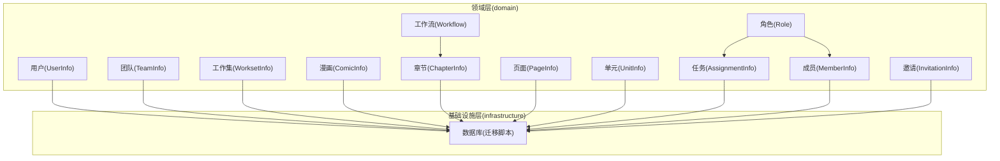
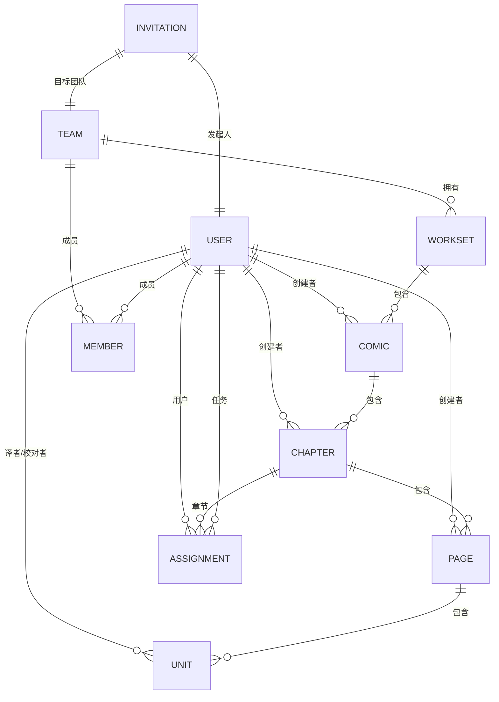
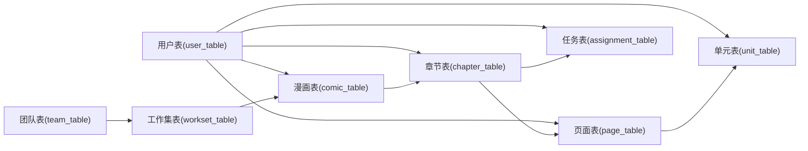

# 数据模型设计

<cite>
**本文档引用的文件**
- [internal/domain/model/user.go](file://internal/domain/model/user.go)
- [internal/domain/model/team.go](file://internal/domain/model/team.go)
- [internal/domain/model/comic.go](file://internal/domain/model/comic.go)
- [internal/domain/model/workset.go](file://internal/domain/model/workset.go)
- [internal/domain/model/chapter.go](file://internal/domain/model/chapter.go)
- [internal/domain/model/page.go](file://internal/domain/model/page.go)
- [internal/domain/model/assignment.go](file://internal/domain/model/assignment.go)
- [internal/domain/model/member.go](file://internal/domain/model/member.go)
- [internal/domain/model/unit.go](file://internal/domain/model/unit.go)
- [internal/domain/model/invitation.go](file://internal/domain/model/invitation.go)
- [internal/domain/model/role.go](file://internal/domain/model/role.go)
- [internal/domain/model/workflow.go](file://internal/domain/model/workflow.go)
- [internal/domain/model/permission.go](file://internal/domain/model/permission.go)
- [migrations/20260306101212_comic-table.up.sql](file://migrations/20260306101212_comic-table.up.sql)
- [migrations/20260306101213_chapter-table.up.sql](file://migrations/20260306101213_chapter-table.up.sql)
- [migrations/20260306101214_page-table.up.sql](file://migrations/20260306101214_page-table.up.sql)
- [migrations/20260306101215_assignment-table.up.sql](file://migrations/20260306101215_assignment-table.up.sql)
- [migrations/20260306101216_unit-table.up.sql](file://migrations/20260306101216_unit-table.up.sql)
</cite>

## 目录
1. [简介](#简介)
2. [项目结构](#项目结构)
3. [核心组件](#核心组件)
4. [架构总览](#架构总览)
5. [详细组件分析](#详细组件分析)
6. [依赖分析](#依赖分析)
7. [性能考虑](#性能考虑)
8. [故障排除指南](#故障排除指南)
9. [结论](#结论)

## 简介
本文件面向 poprako-web-ms 项目的后端数据模型设计，系统性梳理并规范以下核心实体的数据结构：用户、团队、漫画、工作集、章节、页面、单元、任务（分配）、成员、邀请、角色与工作流状态。文档从字段定义、数据类型、约束条件、业务规则出发，结合数据库迁移脚本中的真实表结构，给出实体关系图、索引策略与查询优化建议，并补充数据验证规则、默认值与生命周期管理策略。

## 项目结构
后端采用分层架构，数据模型位于 domain 层，配合 infrastructure 层的仓库实现与迁移脚本落地到数据库。前端通过 API 模块调用后端接口，后端内部通过 application 层装配器与服务层协调业务逻辑。

图表来源
- [internal/domain/model/user.go:7-19](file://internal/domain/model/user.go#L7-L19)
- [internal/domain/model/team.go:5-15](file://internal/domain/model/team.go#L5-L15)
- [internal/domain/model/workset.go:5-18](file://internal/domain/model/workset.go#L5-L18)
- [internal/domain/model/comic.go:5-26](file://internal/domain/model/comic.go#L5-L26)
- [internal/domain/model/chapter.go:5-35](file://internal/domain/model/chapter.go#L5-L35)
- [internal/domain/model/page.go:5-22](file://internal/domain/model/page.go#L5-L22)
- [internal/domain/model/assignment.go:5-25](file://internal/domain/model/assignment.go#L5-L25)
- [internal/domain/model/member.go:48-99](file://internal/domain/model/member.go#L48-L99)
- [internal/domain/model/unit.go:7-29](file://internal/domain/model/unit.go#L7-L29)
- [internal/domain/model/invitation.go:63-84](file://internal/domain/model/invitation.go#L63-L84)
- [internal/domain/model/role.go:3-17](file://internal/domain/model/role.go#L3-L17)
- [internal/domain/model/workflow.go:3-22](file://internal/domain/model/workflow.go#L3-L22)
- [migrations/20260306101212_comic-table.up.sql:1-37](file://migrations/20260306101212_comic-table.up.sql#L1-L37)
- [migrations/20260306101213_chapter-table.up.sql:1-38](file://migrations/20260306101213_chapter-table.up.sql#L1-L38)
- [migrations/20260306101214_page-table.up.sql:1-25](file://migrations/20260306101214_page-table.up.sql#L1-L25)
- [migrations/20260306101215_assignment-table.up.sql:1-26](file://migrations/20260306101215_assignment-table.up.sql#L1-L26)
- [migrations/20260306101216_unit-table.up.sql:1-30](file://migrations/20260306101216_unit-table.up.sql#L1-L30)

章节来源
- [internal/domain/model/user.go:1-100](file://internal/domain/model/user.go#L1-L100)
- [internal/domain/model/team.go:1-63](file://internal/domain/model/team.go#L1-L63)
- [internal/domain/model/comic.go:1-107](file://internal/domain/model/comic.go#L1-L107)
- [internal/domain/model/workset.go:1-82](file://internal/domain/model/workset.go#L1-L82)
- [internal/domain/model/chapter.go:1-260](file://internal/domain/model/chapter.go#L1-L260)
- [internal/domain/model/page.go:1-134](file://internal/domain/model/page.go#L1-L134)
- [internal/domain/model/assignment.go:1-190](file://internal/domain/model/assignment.go#L1-L190)
- [internal/domain/model/member.go:1-205](file://internal/domain/model/member.go#L1-L205)
- [internal/domain/model/unit.go:1-149](file://internal/domain/model/unit.go#L1-L149)
- [internal/domain/model/invitation.go:1-158](file://internal/domain/model/invitation.go#L1-L158)
- [internal/domain/model/role.go:1-56](file://internal/domain/model/role.go#L1-L56)
- [internal/domain/model/workflow.go:1-36](file://internal/domain/model/workflow.go#L1-L36)
- [migrations/20260306101212_comic-table.up.sql:1-37](file://migrations/20260306101212_comic-table.up.sql#L1-L37)
- [migrations/20260306101213_chapter-table.up.sql:1-38](file://migrations/20260306101213_chapter-table.up.sql#L1-L38)
- [migrations/20260306101214_page-table.up.sql:1-25](file://migrations/20260306101214_page-table.up.sql#L1-L25)
- [migrations/20260306101215_assignment-table.up.sql:1-26](file://migrations/20260306101215_assignment-table.up.sql#L1-L26)
- [migrations/20260306101216_unit-table.up.sql:1-30](file://migrations/20260306101216_unit-table.up.sql#L1-L30)

## 核心组件
本节对各核心实体进行字段级说明，涵盖数据类型、约束与业务含义，并指出与数据库表结构的对应关系。

- 用户(UserInfo)
  - 字段：标识、姓名、QQ、头像 OSS Key、是否已上传头像、是否超级管理员、创建/更新时间
  - 约束：ID 主键；QQ 唯一性在应用层保证；超级管理员为全局权限位
  - 生命周期：软删除字段在表结构中体现为 deleted_at
  - 关联：作为漫画、章节、页面的创建者引用

- 团队(TeamInfo)
  - 字段：标识、名称、描述、头像 OSS Key、是否已上传头像、创建/更新时间
  - 约束：ID 主键；团队与漫画存在多对一关系（通过漫画的 team_id 间接关联）
  - 关联：工作集属于团队；成员属于团队

- 工作集(WorksetInfo)
  - 字段：标识、团队标识、索引、名称、描述、漫画数量、创建/更新时间
  - 约束：ID 主键；与团队一对多
  - 关联：漫画属于工作集

- 漫画(ComicInfo)
  - 字段：标识、工作集标识、索引、标题、作者、描述、章节数量、创建者标识、最后活跃时间、创建/更新时间
  - 约束：ID 主键；唯一索引(team_id, index)；索引 index 默认 0；章节数默认 0；最后活跃时间默认当前时间
  - 关联：章节属于漫画；创建者为用户

- 章节(ChapterInfo)
  - 字段：标识、漫画标识、索引、副标题、页面数量、单元总数、翻译单元数、校对单元数、各流程节点时间戳、创建者标识、创建/更新时间
  - 约束：ID 主键；唯一索引(comic_id, index)；各时间戳允许为空；单元统计字段默认 0
  - 关联：页面属于章节；创建者为用户；任务绑定章节与用户

- 页面(PageInfo)
  - 字段：标识、章节标识、索引、OSS Key、是否已上传、单元总数、翻译单元数、校对单元数、创建者标识、创建/更新时间
  - 约束：ID 主键；唯一索引(chapter_id, index)；上传标记默认 false；单元统计字段默认 0
  - 关联：单元属于页面；创建者为用户

- 单元(UnitInfo)
  - 字段：标识、页面标识、坐标(x,y)、索引、是否气泡、翻译文本/译者/评论、是否校对、校对文本/校对者/评论
  - 约束：ID 主键；唯一索引(page_id, index)；气泡默认 true；校对默认 false；译者/校对者允许为空（外键设为删除置空）
  - 关联：页面统计字段由单元汇总

- 任务(AssignmentInfo)
  - 字段：标识、章节标识、用户标识、各角色分配时间戳、创建/更新时间
  - 约束：ID 主键；唯一索引(chapter_id, user_id)；各时间戳允许为空
  - 角色：原始提供、翻译、校对、排版、重绘、审核、发布
  - 关联：章节与用户多对多（通过任务表）

- 成员(MemberInfo)
  - 字段：标识、用户标识、团队标识、各角色分配时间戳、创建/更新时间
  - 约束：ID 主键；唯一索引(team_id, user_id)；各时间戳允许为空
  - 角色：原始提供、翻译、校对、排版、审核、发布、管理员
  - 关联：用户与团队多对多（通过成员表）

- 邀请(InvitationInfo)
  - 字段：标识、发起人标识、目标团队标识、受邀者 QQ、邀请码、待分配角色标记、创建时间
  - 约束：ID 主键；邀请码唯一性在应用层保证；待分配角色为布尔位集合
  - 关联：团队与用户（通过邀请码与 QQ）建立潜在成员关系

- 角色(Role) 与 工作流(Workflow)
  - 角色：使用位掩码表示多角色；提供掩码与解码工具
  - 工作流：上传、翻译、校对、排版、审核、发布；状态分为待处理、进行中、完成、未设置

章节来源
- [internal/domain/model/user.go:7-19](file://internal/domain/model/user.go#L7-L19)
- [internal/domain/model/team.go:5-15](file://internal/domain/model/team.go#L5-L15)
- [internal/domain/model/workset.go:5-18](file://internal/domain/model/workset.go#L5-L18)
- [internal/domain/model/comic.go:5-26](file://internal/domain/model/comic.go#L5-L26)
- [internal/domain/model/chapter.go:5-35](file://internal/domain/model/chapter.go#L5-L35)
- [internal/domain/model/page.go:5-22](file://internal/domain/model/page.go#L5-L22)
- [internal/domain/model/assignment.go:5-25](file://internal/domain/model/assignment.go#L5-L25)
- [internal/domain/model/member.go:48-99](file://internal/domain/model/member.go#L48-L99)
- [internal/domain/model/unit.go:7-29](file://internal/domain/model/unit.go#L7-L29)
- [internal/domain/model/invitation.go:63-84](file://internal/domain/model/invitation.go#L63-L84)
- [internal/domain/model/role.go:3-17](file://internal/domain/model/role.go#L3-L17)
- [internal/domain/model/workflow.go:3-22](file://internal/domain/model/workflow.go#L3-L22)
- [migrations/20260306101212_comic-table.up.sql:1-37](file://migrations/20260306101212_comic-table.up.sql#L1-L37)
- [migrations/20260306101213_chapter-table.up.sql:1-38](file://migrations/20260306101213_chapter-table.up.sql#L1-L38)
- [migrations/20260306101214_page-table.up.sql:1-25](file://migrations/20260306101214_page-table.up.sql#L1-L25)
- [migrations/20260306101215_assignment-table.up.sql:1-26](file://migrations/20260306101215_assignment-table.up.sql#L1-L26)
- [migrations/20260306101216_unit-table.up.sql:1-30](file://migrations/20260306101216_unit-table.up.sql#L1-L30)

## 架构总览
下图展示实体之间的依赖与外键关系，映射到数据库表结构与索引策略。

图表来源
- [migrations/20260306101212_comic-table.up.sql:1-37](file://migrations/20260306101212_comic-table.up.sql#L1-L37)
- [migrations/20260306101213_chapter-table.up.sql:1-38](file://migrations/20260306101213_chapter-table.up.sql#L1-L38)
- [migrations/20260306101214_page-table.up.sql:1-25](file://migrations/20260306101214_page-table.up.sql#L1-L25)
- [migrations/20260306101215_assignment-table.up.sql:1-26](file://migrations/20260306101215_assignment-table.up.sql#L1-L26)
- [migrations/20260306101216_unit-table.up.sql:1-30](file://migrations/20260306101216_unit-table.up.sql#L1-L30)
- [internal/domain/model/invitation.go:63-84](file://internal/domain/model/invitation.go#L63-L84)

## 详细组件分析

### 用户模型(UserInfo)
- 数据结构要点
  - 标识、姓名、QQ、头像 OSS Key、是否已上传头像、是否超级管理员、创建/更新时间
  - 登录凭据与注册/更新对象分离，确保最小暴露面
- 约束与默认值
  - ID 主键；QQ 唯一性在应用层保证；超级管理员为全局权限位
- 业务规则
  - 超级管理员拥有最高权限；普通用户仅能访问自身或所在团队资源
- 查询优化
  - 建议按 ID 与 QQ 建立索引；在权限检查时优先缓存用户角色

章节来源
- [internal/domain/model/user.go:7-19](file://internal/domain/model/user.go#L7-L19)
- [internal/domain/model/user.go:43-54](file://internal/domain/model/user.go#L43-L54)
- [internal/domain/model/user.go:56-78](file://internal/domain/model/user.go#L56-L78)
- [internal/domain/model/user.go:80-99](file://internal/domain/model/user.go#L80-L99)

### 团队模型(TeamInfo)
- 数据结构要点
  - 标识、名称、描述、头像 OSS Key、是否已上传头像、创建/更新时间
- 约束与默认值
  - ID 主键；团队与漫画存在多对一关系
- 业务规则
  - 成员管理与资源访问基于团队维度控制
- 查询优化
  - 按团队维度的列表查询需考虑分页与排序

章节来源
- [internal/domain/model/team.go:5-15](file://internal/domain/model/team.go#L5-L15)
- [internal/domain/model/team.go:37-47](file://internal/domain/model/team.go#L37-L47)
- [internal/domain/model/team.go:49-62](file://internal/domain/model/team.go#L49-L62)

### 工作集模型(WorksetInfo)
- 数据结构要点
  - 标识、团队标识、索引、名称、描述、漫画数量、创建/更新时间
- 约束与默认值
  - ID 主键；与团队一对多
- 业务规则
  - 工作集用于组织漫画，便于团队内资源划分
- 查询优化
  - 按团队与索引查询漫画列表时利用复合索引

章节来源
- [internal/domain/model/workset.go:5-18](file://internal/domain/model/workset.go#L5-L18)
- [internal/domain/model/workset.go:44-63](file://internal/domain/model/workset.go#L44-L63)
- [internal/domain/model/workset.go:65-81](file://internal/domain/model/workset.go#L65-L81)

### 漫画模型(ComicInfo)
- 数据结构要点
  - 标识、工作集标识、索引、标题、作者、描述、章节数量、创建者标识、最后活跃时间、创建/更新时间
- 约束与默认值
  - ID 主键；唯一索引(team_id, index)；索引 index 默认 0；章节数默认 0；最后活跃时间默认当前时间
- 业务规则
  - 最后活跃时间用于驱动首页与仪表盘排序
- 查询优化
  - 复合索引(team_id, index)与(team_id, created_at DESC)提升查询效率

章节来源
- [internal/domain/model/comic.go:5-26](file://internal/domain/model/comic.go#L5-L26)
- [internal/domain/model/comic.go:60-85](file://internal/domain/model/comic.go#L60-L85)
- [internal/domain/model/comic.go:87-106](file://internal/domain/model/comic.go#L87-L106)
- [migrations/20260306101212_comic-table.up.sql:1-37](file://migrations/20260306101212_comic-table.up.sql#L1-L37)

### 章节模型(ChapterInfo)
- 数据结构要点
  - 标识、漫画标识、索引、副标题、页面数量、单元总数、翻译单元数、校对单元数、各流程节点时间戳、创建者标识、创建/更新时间
- 约束与默认值
  - ID 主键；唯一索引(comic_id, index)；各时间戳允许为空；单元统计字段默认 0
- 业务规则
  - 工作流状态通过时间戳表达；不同工作流支持的状态集合不同
- 查询优化
  - 复合索引(comic_id, index)加速章节列表与详情加载

章节来源
- [internal/domain/model/chapter.go:5-35](file://internal/domain/model/chapter.go#L5-L35)
- [internal/domain/model/chapter.go:105-124](file://internal/domain/model/chapter.go#L105-L124)
- [internal/domain/model/chapter.go:126-151](file://internal/domain/model/chapter.go#L126-L151)
- [internal/domain/model/workflow.go:24-35](file://internal/domain/model/workflow.go#L24-L35)
- [migrations/20260306101213_chapter-table.up.sql:1-38](file://migrations/20260306101213_chapter-table.up.sql#L1-L38)

### 页面模型(PageInfo)
- 数据结构要点
  - 标识、章节标识、索引、OSS Key、是否已上传、单元总数、翻译单元数、校对单元数、创建者标识、创建/更新时间
- 约束与默认值
  - ID 主键；唯一索引(chapter_id, index)；上传标记默认 false；单元统计字段默认 0
- 业务规则
  - 页面上传状态与单元统计联动更新
- 查询优化
  - 索引(page_id)加速单元查询；按章节批量查询页面

章节来源
- [internal/domain/model/page.go:5-22](file://internal/domain/model/page.go#L5-L22)
- [internal/domain/model/page.go:76-99](file://internal/domain/model/page.go#L76-L99)
- [internal/domain/model/page.go:101-133](file://internal/domain/model/page.go#L101-L133)
- [migrations/20260306101214_page-table.up.sql:1-25](file://migrations/20260306101214_page-table.up.sql#L1-L25)

### 单元模型(UnitInfo)
- 数据结构要点
  - 标识、页面标识、坐标(x,y)、索引、是否气泡、翻译文本/译者/评论、是否校对、校对文本/校对者/评论
- 约束与默认值
  - ID 主键；唯一索引(page_id, index)；气泡默认 true；校对默认 false；译者/校对者允许为空（外键设为删除置空）
- 业务规则
  - 单元保存采用 Patch 语义，仅更新指定字段；统计字段由页面聚合
- 查询优化
  - 索引(page_id)加速单元列表；按页面批量读取

章节来源
- [internal/domain/model/unit.go:7-29](file://internal/domain/model/unit.go#L7-L29)
- [internal/domain/model/unit.go:62-84](file://internal/domain/model/unit.go#L62-L84)
- [internal/domain/model/unit.go:116-149](file://internal/domain/model/unit.go#L116-L149)
- [migrations/20260306101216_unit-table.up.sql:1-30](file://migrations/20260306101216_unit-table.up.sql#L1-L30)

### 任务模型(AssignmentInfo)
- 数据结构要点
  - 标识、章节标识、用户标识、各角色分配时间戳、创建/更新时间
- 约束与默认值
  - ID 主键；唯一索引(chapter_id, user_id)
- 业务规则
  - 角色集合通过位掩码表达；支持全量替换与保留已有时间戳
- 查询优化
  - 索引(chapter_id)与(user_id)加速任务查询

章节来源
- [internal/domain/model/assignment.go:5-25](file://internal/domain/model/assignment.go#L5-L25)
- [internal/domain/model/assignment.go:114-149](file://internal/domain/model/assignment.go#L114-L149)
- [internal/domain/model/assignment.go:152-189](file://internal/domain/model/assignment.go#L152-L189)
- [internal/domain/model/role.go:3-17](file://internal/domain/model/role.go#L3-L17)
- [migrations/20260306101215_assignment-table.up.sql:1-26](file://migrations/20260306101215_assignment-table.up.sql#L1-L26)

### 成员模型(MemberInfo)
- 数据结构要点
  - 标识、用户标识、团队标识、各角色分配时间戳、创建/更新时间
- 约束与默认值
  - ID 主键；唯一索引(team_id, user_id)
- 业务规则
  - 成员角色与管理员权限用于资源访问控制
- 查询优化
  - 索引(team_id)与(user_id)加速成员查询

章节来源
- [internal/domain/model/member.go:48-99](file://internal/domain/model/member.go#L48-L99)
- [internal/domain/model/member.go:166-175](file://internal/domain/model/member.go#L166-L175)
- [internal/domain/model/member.go:177-204](file://internal/domain/model/member.go#L177-L204)
- [internal/domain/model/role.go:3-17](file://internal/domain/model/role.go#L3-L17)

### 邀请模型(InvitationInfo)
- 数据结构要点
  - 标识、发起人标识、目标团队标识、受邀者 QQ、邀请码、待分配角色标记、创建时间
- 约束与默认值
  - ID 主键；邀请码唯一性在应用层保证
- 业务规则
  - 邀请码用于后续成员加入流程
- 查询优化
  - 按邀请码与团队维度查询

章节来源
- [internal/domain/model/invitation.go:63-84](file://internal/domain/model/invitation.go#L63-L84)
- [internal/domain/model/invitation.go:114-123](file://internal/domain/model/invitation.go#L114-L123)
- [internal/domain/model/invitation.go:125-136](file://internal/domain/model/invitation.go#L125-L136)
- [internal/domain/model/invitation.go:23-40](file://internal/domain/model/invitation.go#L23-L40)

### 角色与工作流
- 角色(Role)
  - 使用位掩码表示多角色；提供掩码与解码工具
- 工作流(Workflow)
  - 工作流类型：上传、翻译、校对、排版、审核、发布
  - 状态：待处理、进行中、完成、未设置
  - 合法组合校验：不同工作流支持的状态集合不同

章节来源
- [internal/domain/model/role.go:3-17](file://internal/domain/model/role.go#L3-L17)
- [internal/domain/model/role.go:19-55](file://internal/domain/model/role.go#L19-L55)
- [internal/domain/model/workflow.go:3-22](file://internal/domain/model/workflow.go#L3-L22)
- [internal/domain/model/workflow.go:24-35](file://internal/domain/model/workflow.go#L24-L35)

## 依赖分析
- 实体耦合
  - 用户与团队通过成员表耦合；用户与漫画/章节/页面通过创建者字段耦合
  - 工作集与漫画、漫画与章节、章节与页面、页面与单元形成强层级依赖
  - 任务与成员均通过用户与章节/团队建立权限边界
- 外键约束
  - 漫画.workset_id 引用工作集.id（级联删除）
  - 章节.comic_id 引用漫画.id（级联删除）
  - 页面.chapter_id 引用章节.id（级联删除）
  - 单元.page_id 引用页面.id（级联删除）
  - 任务.chapter_id 与 user_id 引用章节与用户（级联删除）
  - 单元.translator_id 与 proofreader_id 引用用户（删除置空）
- 索引策略
  - 漫画：复合唯一索引(team_id, index)，复合索引(team_id, created_at DESC)、(team_id, last_active_at DESC)、(creator_id)
  - 章节：复合唯一索引(comic_id, index)
  - 页面：复合唯一索引(chapter_id, index)
  - 任务：复合唯一索引(chapter_id, user_id)
  - 单元：复合唯一索引(page_id, index)

图表来源
- [migrations/20260306101212_comic-table.up.sql:1-37](file://migrations/20260306101212_comic-table.up.sql#L1-L37)
- [migrations/20260306101213_chapter-table.up.sql:1-38](file://migrations/20260306101213_chapter-table.up.sql#L1-L38)
- [migrations/20260306101214_page-table.up.sql:1-25](file://migrations/20260306101214_page-table.up.sql#L1-L25)
- [migrations/20260306101215_assignment-table.up.sql:1-26](file://migrations/20260306101215_assignment-table.up.sql#L1-L26)
- [migrations/20260306101216_unit-table.up.sql:1-30](file://migrations/20260306101216_unit-table.up.sql#L1-L30)

章节来源
- [migrations/20260306101212_comic-table.up.sql:1-37](file://migrations/20260306101212_comic-table.up.sql#L1-L37)
- [migrations/20260306101213_chapter-table.up.sql:1-38](file://migrations/20260306101213_chapter-table.up.sql#L1-L38)
- [migrations/20260306101214_page-table.up.sql:1-25](file://migrations/20260306101214_page-table.up.sql#L1-L25)
- [migrations/20260306101215_assignment-table.up.sql:1-26](file://migrations/20260306101215_assignment-table.up.sql#L1-L26)
- [migrations/20260306101216_unit-table.up.sql:1-30](file://migrations/20260306101216_unit-table.up.sql#L1-L30)

## 性能考虑
- 索引优化
  - 漫画列表：按 team_id + created_at DESC 排序，支持分页与最新优先
  - 章节列表：按 comic_id + index 排序，避免全表扫描
  - 页面列表：按 chapter_id + index 排序，支持顺序渲染
  - 任务查询：按 chapter_id 与 user_id 建立索引，加速权限与分配查询
  - 单元查询：按 page_id 建立索引，支持批量读取
- 统计字段
  - 页面与章节的单元统计字段用于快速展示进度，避免频繁聚合计算
- 时间戳与软删除
  - 使用 deleted_at 字段实现软删除，配合 WHERE 条件过滤，保持历史审计
- 缓存策略
  - 权限检查结果与常用实体（如用户、团队、工作集）可引入缓存，降低数据库压力

## 故障排除指南
- 权限相关
  - 若出现“无法查看/编辑”问题，检查用户是否为团队管理员或具备相应角色；确认任务与成员表中的角色分配时间戳
- 数据一致性
  - 章节/页面/单元统计字段与实际数据不一致时，检查单元保存流程与页面统计更新逻辑
- 外键约束错误
  - 删除父实体（漫画/章节/页面）时触发级联删除；若报外键冲突，检查是否存在子实体未清理
- 工作流状态异常
  - 不合法的工作流状态组合会导致更新失败；请遵循工作流状态校验规则

章节来源
- [internal/domain/model/permission.go:1-845](file://internal/domain/model/permission.go#L1-L845)
- [internal/domain/model/workflow.go:24-35](file://internal/domain/model/workflow.go#L24-L35)

## 结论
本数据模型设计以清晰的实体边界、严格的外键约束与合理的索引策略为基础，结合角色与工作流机制，实现了从团队到页面的完整协作流程建模。通过统计字段与缓存策略优化查询性能，配合软删除与权限检查保障数据安全与可追溯性。建议在后续迭代中持续完善索引覆盖与权限细化，确保系统在高并发场景下的稳定性与可维护性。