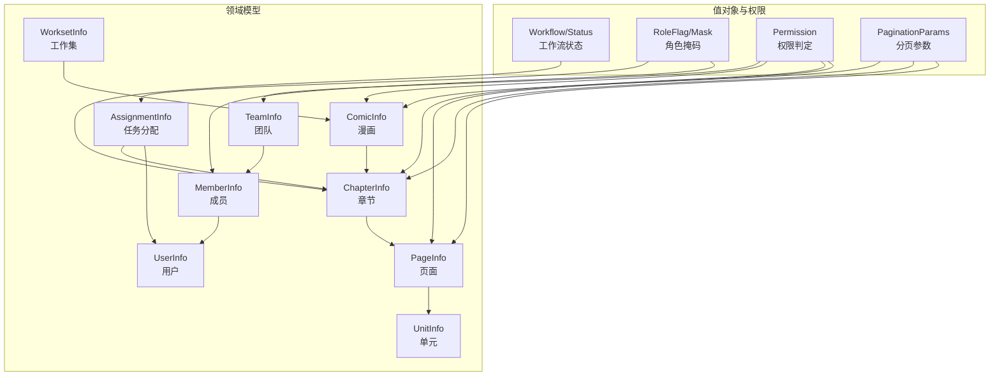
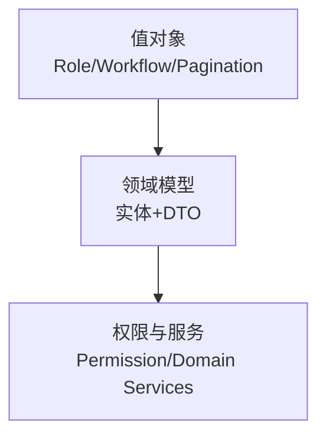
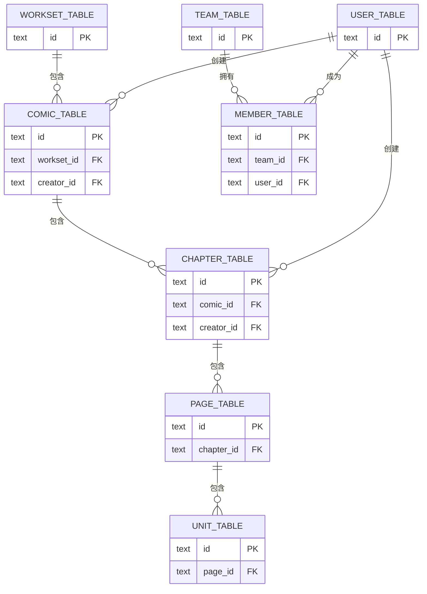

# 数据模型设计

<cite>
**本文引用的文件**
- [internal/domain/model/comic.go](file://internal/domain/model/comic.go)
- [internal/domain/model/chapter.go](file://internal/domain/model/chapter.go)
- [internal/domain/model/page.go](file://internal/domain/model/page.go)
- [internal/domain/model/workset.go](file://internal/domain/model/workset.go)
- [internal/domain/model/assignment.go](file://internal/domain/model/assignment.go)
- [internal/domain/model/team.go](file://internal/domain/model/team.go)
- [internal/domain/model/user.go](file://internal/domain/model/user.go)
- [internal/domain/model/member.go](file://internal/domain/model/member.go)
- [internal/domain/model/unit.go](file://internal/domain/model/unit.go)
- [internal/domain/model/workflow.go](file://internal/domain/model/workflow.go)
- [internal/domain/model/role.go](file://internal/domain/model/role.go)
- [internal/domain/model/permission.go](file://internal/domain/model/permission.go)
- [internal/value/common.go](file://internal/value/common.go)
- [migrations/20260306101212_comic-table.up.sql](file://migrations/20260306101212_comic-table.up.sql)
- [migrations/20260306101213_chapter-table.up.sql](file://migrations/20260306101213_chapter-table.up.sql)
</cite>

## 目录
1. [简介](#简介)
2. [项目结构](#项目结构)
3. [核心组件](#核心组件)
4. [架构总览](#架构总览)
5. [详细组件分析](#详细组件分析)
6. [依赖分析](#依赖分析)
7. [性能考虑](#性能考虑)
8. [故障排查指南](#故障排查指南)
9. [结论](#结论)
10. [附录](#附录)

## 简介
本文件系统性梳理漫画翻译协作平台的数据模型设计，覆盖领域模型与值对象、DTO 设计原则、实体关系映射、外键与索引策略、数据验证与业务规则、领域服务与权限控制、生命周期与版本演进、数据库到 Go 实体的映射路径，以及前端数据模型的对应关系。目标是帮助开发者与产品、测试人员建立一致的认知基础。

## 项目结构
围绕“工作集-漫画-章节-页面-单元”的内容生产流水线，结合“团队-成员-用户”组织与权限体系，形成清晰的分层与职责边界：
- 领域模型（internal/domain/model）：定义实体、值对象、DTO、工作流与权限判定
- 值对象（internal/value）：通用值对象与校验（如分页）
- 基础设施与迁移（migrations）：数据库表结构与索引
- 应用层装配器与服务：负责 DTO 到实体的转换与业务编排（在本仓库中主要体现于领域模型与权限模块）

图示来源
- [internal/domain/model/workset.go:1-82](file://internal/domain/model/workset.go#L1-L82)
- [internal/domain/model/comic.go:1-107](file://internal/domain/model/comic.go#L1-L107)
- [internal/domain/model/chapter.go:1-260](file://internal/domain/model/chapter.go#L1-L260)
- [internal/domain/model/page.go:1-134](file://internal/domain/model/page.go#L1-L134)
- [internal/domain/model/unit.go:1-149](file://internal/domain/model/unit.go#L1-L149)
- [internal/domain/model/assignment.go:1-190](file://internal/domain/model/assignment.go#L1-L190)
- [internal/domain/model/team.go:1-63](file://internal/domain/model/team.go#L1-L63)
- [internal/domain/model/member.go:1-205](file://internal/domain/model/member.go#L1-L205)
- [internal/domain/model/user.go:1-100](file://internal/domain/model/user.go#L1-L100)
- [internal/domain/model/workflow.go:1-36](file://internal/domain/model/workflow.go#L1-L36)
- [internal/domain/model/role.go:1-56](file://internal/domain/model/role.go#L1-L56)
- [internal/domain/model/permission.go:1-800](file://internal/domain/model/permission.go#L1-L800)
- [internal/value/common.go:1-24](file://internal/value/common.go#L1-L24)

章节来源
- [internal/domain/model/workset.go:1-82](file://internal/domain/model/workset.go#L1-L82)
- [internal/domain/model/comic.go:1-107](file://internal/domain/model/comic.go#L1-L107)
- [internal/domain/model/chapter.go:1-260](file://internal/domain/model/chapter.go#L1-L260)
- [internal/domain/model/page.go:1-134](file://internal/domain/model/page.go#L1-L134)
- [internal/domain/model/unit.go:1-149](file://internal/domain/model/unit.go#L1-L149)
- [internal/domain/model/assignment.go:1-190](file://internal/domain/model/assignment.go#L1-L190)
- [internal/domain/model/team.go:1-63](file://internal/domain/model/team.go#L1-L63)
- [internal/domain/model/member.go:1-205](file://internal/domain/model/member.go#L1-L205)
- [internal/domain/model/user.go:1-100](file://internal/domain/model/user.go#L1-L100)
- [internal/domain/model/workflow.go:1-36](file://internal/domain/model/workflow.go#L1-L36)
- [internal/domain/model/role.go:1-56](file://internal/domain/model/role.go#L1-L56)
- [internal/domain/model/permission.go:1-800](file://internal/domain/model/permission.go#L1-L800)
- [internal/value/common.go:1-24](file://internal/value/common.go#L1-L24)

## 核心组件
- 工作集（WorksetInfo）：团队维度的内容集合容器，具备索引与名称描述，关联团队与漫画数量统计
- 漫画（ComicInfo）：属于某个工作集，包含标题、作者、描述、章节计数、最后活跃时间等
- 章节（ChapterInfo）：属于某部漫画，包含页面数与单元统计，以及多阶段工作流时间戳
- 页面（PageInfo）：属于某个章节，记录 OSS 存储键、上传状态与单元统计
- 单元（UnitInfo）：页面内的文本标注单元，支持译者与校对者的标注与评论
- 团队（TeamInfo）、成员（MemberInfo）、用户（UserInfo）：组织与人员模型，成员承担角色并继承团队权限
- 任务分配（AssignmentInfo）：章节级的任务角色分配，按角色维护时间戳
- 工作流（Workflow/Status）：统一的状态机，约束各阶段状态取值与流转
- 角色（RoleFlag/Mask）：角色位掩码，支持组合与查询
- 权限（Permission）：基于用户、团队、漫画、章节、页面的细粒度权限判定
- 分页（PaginationParams）：通用分页参数与校验

章节来源
- [internal/domain/model/workset.go:1-82](file://internal/domain/model/workset.go#L1-L82)
- [internal/domain/model/comic.go:1-107](file://internal/domain/model/comic.go#L1-L107)
- [internal/domain/model/chapter.go:1-260](file://internal/domain/model/chapter.go#L1-L260)
- [internal/domain/model/page.go:1-134](file://internal/domain/model/page.go#L1-L134)
- [internal/domain/model/unit.go:1-149](file://internal/domain/model/unit.go#L1-L149)
- [internal/domain/model/team.go:1-63](file://internal/domain/model/team.go#L1-L63)
- [internal/domain/model/member.go:1-205](file://internal/domain/model/member.go#L1-L205)
- [internal/domain/model/user.go:1-100](file://internal/domain/model/user.go#L1-L100)
- [internal/domain/model/assignment.go:1-190](file://internal/domain/model/assignment.go#L1-L190)
- [internal/domain/model/workflow.go:1-36](file://internal/domain/model/workflow.go#L1-L36)
- [internal/domain/model/role.go:1-56](file://internal/domain/model/role.go#L1-L56)
- [internal/domain/model/permission.go:1-800](file://internal/domain/model/permission.go#L1-L800)
- [internal/value/common.go:1-24](file://internal/value/common.go#L1-L24)

## 架构总览
数据模型自底向上分为三层：
- 值对象层：角色、工作流、分页等通用值对象
- 领域模型层：实体与DTO，封装业务规则与行为
- 权限与服务层：权限判定、领域服务（在本仓库中以权限模块集中体现）

## 详细组件分析

### 工作集（WorksetInfo）
- 属性要点：标识、团队外键、索引、名称、描述、漫画计数、时间戳
- 业务规则：与团队强关联；索引用于排序与去重
- DTO：WorksetCreation/WorksetUpdate 用于创建与更新

章节来源
- [internal/domain/model/workset.go:1-82](file://internal/domain/model/workset.go#L1-L82)

### 漫画（ComicInfo）
- 属性要点：工作集外键、索引、标题、作者、描述、章节计数、最后活跃时间、创建者
- 业务规则：与工作集、用户存在外键关系；最后活跃时间用于排序与活跃度追踪
- DTO：ComicCreation/ComicUpdate 用于创建与更新

章节来源
- [internal/domain/model/comic.go:1-107](file://internal/domain/model/comic.go#L1-L107)

### 章节（ChapterInfo）
- 属性要点：漫画外键、索引、副标题、页面数、单元统计、多阶段工作流时间戳
- 业务规则：章节状态通过工作流状态机约束；页面数与单元统计用于进度展示
- DTO：ChapterCreation/ChapterUpdate 用于创建与更新；NewChapterUpdate 封装状态机转换

章节来源
- [internal/domain/model/chapter.go:1-260](file://internal/domain/model/chapter.go#L1-L260)
- [internal/domain/model/workflow.go:1-36](file://internal/domain/model/workflow.go#L1-L36)

### 页面（PageInfo）
- 属性要点：章节外键、索引、OSS 键、上传状态、单元统计、创建者
- 业务规则：页面与章节、用户存在外键关系；上传状态与单元统计用于质量控制
- DTO：PageCreation/PageUpdate 用于创建与更新

章节来源
- [internal/domain/model/page.go:1-134](file://internal/domain/model/page.go#L1-L134)

### 单元（UnitInfo）
- 属性要点：页面外键、索引、坐标、气泡标记、译者/校对者标注与评论、是否已校对
- 业务规则：译文与校对文可为空；通过 Patch 结构支持增量更新
- DTO：UnitCreation（别名 UnitInfo）、UnitPatch 用于创建与增量更新

章节来源
- [internal/domain/model/unit.go:1-149](file://internal/domain/model/unit.go#L1-L149)

### 团队（TeamInfo）、成员（MemberInfo）、用户（UserInfo）
- 属性要点：团队头像、成员角色时间戳、用户角色与头像、超级管理员标识
- 业务规则：成员角色通过位掩码管理；用户可为超级管理员；团队内成员拥有相应权限
- DTO：TeamCreation/TeamUpdate、MemberCreation/MemberUpdate、UserCreation/UserUpdate

章节来源
- [internal/domain/model/team.go:1-63](file://internal/domain/model/team.go#L1-L63)
- [internal/domain/model/member.go:1-205](file://internal/domain/model/member.go#L1-L205)
- [internal/domain/model/user.go:1-100](file://internal/domain/model/user.go#L1-L100)

### 任务分配（AssignmentInfo）
- 属性要点：章节外键、用户外键、多角色时间戳
- 业务规则：HasAnyRole/RoleMask 提供角色查询与掩码计算；AssignmentCreation/AssignmentUpdate 封装角色分配与替换
- 与权限：仅评审角色可创建/更新/删除分配

章节来源
- [internal/domain/model/assignment.go:1-190](file://internal/domain/model/assignment.go#L1-L190)
- [internal/domain/model/role.go:1-56](file://internal/domain/model/role.go#L1-L56)

### 工作流与状态（Workflow/Status）
- 约束：不同工作流支持的状态集合不同；状态转换需满足 IsValidWorkflowCombination
- 用途：章节更新时根据状态自动维护各阶段时间戳

章节来源
- [internal/domain/model/workflow.go:1-36](file://internal/domain/model/workflow.go#L1-L36)
- [internal/domain/model/chapter.go:141-259](file://internal/domain/model/chapter.go#L141-L259)

### 权限（Permission）
- 模式：每类资源定义 Check 方法，结合加载器函数完成权限判定
- 范围：邀请、用户、团队、成员、漫画、章节、页面、单元等
- 示例：仅管理员可操作；成员可查看所属团队资源；特定角色可执行页面与单元相关操作

章节来源
- [internal/domain/model/permission.go:1-800](file://internal/domain/model/permission.go#L1-L800)

### 分页（PaginationParams）
- 校验：offset 非负，limit 正数
- 用途：作为通用分页输入参数

章节来源
- [internal/value/common.go:1-24](file://internal/value/common.go#L1-L24)

## 依赖分析

### 实体关系映射与外键约束
- 工作集 → 漫画：一对多，外键 workset_id 引用 workset_table.id，级联删除
- 漫画 → 章节：一对多，外键 comic_id 引用 comic_table.id，级联删除
- 章节 → 页面：一对多，外键 chapter_id 引用 chapter_table.id，级联删除
- 页面 → 单元：一对多，外键 page_id 引用 page_table.id，级联删除
- 团队 → 成员：一对多，外键 team_id 引用 team_table.id，级联删除
- 用户 → 成员/漫画/章节/页面：多条外键，分别引用 user_table.id

图示来源
- [migrations/20260306101212_comic-table.up.sql:1-37](file://migrations/20260306101212_comic-table.up.sql#L1-L37)
- [migrations/20260306101213_chapter-table.up.sql:1-38](file://migrations/20260306101213_chapter-table.up.sql#L1-L38)

### 外键与索引策略
- 漫画表
  - 复合唯一索引：(team_id, index) 用于同团队内漫画索引唯一
  - 组合索引：(team_id, created_at DESC)、(team_id, last_active_at DESC) 用于团队维度排序
  - 单列索引：creator_id 用于快速定位创建者
- 章节表
  - 复合唯一索引：(comic_id, index) 用于漫画内章节唯一
  - 单列索引：comic_id 用于按漫画检索

章节来源
- [migrations/20260306101212_comic-table.up.sql:22-37](file://migrations/20260306101212_comic-table.up.sql#L22-L37)
- [migrations/20260306101213_chapter-table.up.sql:31-38](file://migrations/20260306101213_chapter-table.up.sql#L31-L38)

### 关系类图（实体与DTO）

```mermaid
classDiagram
class WorksetInfo
class WorksetCreation
class WorksetUpdate
class ComicInfo
class ComicCreation
class ComicUpdate
class ChapterInfo
class ChapterCreation
class ChapterUpdate
class PageInfo
class PageCreation
class PageUpdate
class UnitInfo
class UnitCreation
class UnitPatch
class TeamInfo
class TeamCreation
class TeamUpdate
class MemberInfo
class MemberCreation
class MemberUpdate
class UserInfo
class UserCreation
class UserUpdate
class AssignmentInfo
class AssignmentCreation
class AssignmentUpdate
class RoleFlag
class RoleMask
class Workflow
class WorkflowStatus
WorksetCreation --> WorksetInfo : "创建"
WorksetUpdate --> WorksetInfo : "更新"
ComicCreation --> ComicInfo : "创建"
ComicUpdate --> ComicInfo : "更新"
ChapterCreation --> ChapterInfo : "创建"
ChapterUpdate --> ChapterInfo : "更新"
PageCreation --> PageInfo : "创建"
PageUpdate --> PageInfo : "更新"
UnitCreation --> UnitInfo : "创建"
UnitPatch --> UnitInfo : "增量更新"
TeamCreation --> TeamInfo : "创建"
TeamUpdate --> TeamInfo : "更新"
MemberCreation --> MemberInfo : "创建"
MemberUpdate --> MemberInfo : "更新"
UserCreation --> UserInfo : "创建"
UserUpdate --> UserInfo : "更新"
AssignmentCreation --> AssignmentInfo : "创建"
AssignmentUpdate --> AssignmentInfo : "更新"
RoleFlag <.. AssignmentInfo : "使用"
RoleMask <.. MemberInfo : "使用"
Workflow <.. ChapterInfo : "使用"
WorkflowStatus <.. ChapterInfo : "使用"
```

图示来源
- [internal/domain/model/workset.go:1-82](file://internal/domain/model/workset.go#L1-L82)
- [internal/domain/model/comic.go:1-107](file://internal/domain/model/comic.go#L1-L107)
- [internal/domain/model/chapter.go:1-260](file://internal/domain/model/chapter.go#L1-L260)
- [internal/domain/model/page.go:1-134](file://internal/domain/model/page.go#L1-L134)
- [internal/domain/model/unit.go:1-149](file://internal/domain/model/unit.go#L1-L149)
- [internal/domain/model/team.go:1-63](file://internal/domain/model/team.go#L1-L63)
- [internal/domain/model/member.go:1-205](file://internal/domain/model/member.go#L1-L205)
- [internal/domain/model/user.go:1-100](file://internal/domain/model/user.go#L1-L100)
- [internal/domain/model/assignment.go:1-190](file://internal/domain/model/assignment.go#L1-L190)
- [internal/domain/model/role.go:1-56](file://internal/domain/model/role.go#L1-L56)
- [internal/domain/model/workflow.go:1-36](file://internal/domain/model/workflow.go#L1-L36)

## 性能考虑
- 索引选择
  - 漫画：按团队+索引唯一，避免重复；按团队+创建时间倒序与活跃时间倒序索引，支撑列表与排序
  - 章节：按漫画+索引唯一，保证章节顺序唯一；按漫画索引支撑章节列表
- 外键级联
  - 删除漫画/章节会级联删除子实体，降低碎片数据风险，但需注意批量删除的锁竞争
- 时间戳字段
  - 各实体均包含 created_at/updated_at，建议在写入时统一使用数据库默认值或应用层统一赋值，避免时钟漂移
- 分页
  - 使用 offset/limit 时，建议配合合适的索引与覆盖查询，避免深分页导致的性能问题

## 故障排查指南
- 权限相关
  - 若出现“无法查看/编辑”等权限错误，检查当前用户是否为团队管理员或是否具备对应角色（评审、原画提供、译者、校对者等）
  - 关注权限模块中的加载器函数是否正确传入（用户、团队、漫画、章节、页面等）
- 工作流状态
  - 更新章节状态时，确保状态值符合 IsValidWorkflowCombination 的约束
  - 若状态未按预期推进，检查 ChapterUpdate 的状态机分支逻辑
- 外键与唯一性
  - 创建漫画或章节时若报唯一冲突，检查 team_id/index 或 comic_id/index 是否重复
- 分页参数
  - 若接口返回异常或结果为空，检查 offset 与 limit 的取值范围

章节来源
- [internal/domain/model/permission.go:1-800](file://internal/domain/model/permission.go#L1-L800)
- [internal/domain/model/workflow.go:24-35](file://internal/domain/model/workflow.go#L24-L35)
- [internal/value/common.go:10-23](file://internal/value/common.go#L10-L23)

## 结论
本数据模型以“工作集-漫画-章节-页面-单元”为主线，结合“团队-成员-用户”组织体系，通过角色与工作流状态机实现内容生产的规范化与可视化。权限模块将细粒度权限与业务场景绑定，确保平台的安全与合规。数据库层面通过外键与索引策略保障一致性与性能。建议在后续迭代中持续完善权限边界与状态机扩展，并关注大表分页与批量操作的性能优化。

## 附录

### 数据库到 Go 实体映射路径
- 表 comic_table → 实体 ComicInfo（含 WorksetID、CreatorID、时间戳等）
- 表 chapter_table → 实体 ChapterInfo（含 ComicID、CreatorID、多阶段时间戳等）
- 表 page_table → 实体 PageInfo（含 ChapterID、CreatorID、OSSKey、上传状态等）
- 表 team_table → 实体 TeamInfo（含头像键与上传状态）
- 表 member_table → 实体 MemberInfo（含多角色时间戳）
- 表 user_table → 实体 UserInfo（含头像键、上传状态、超级管理员标识）
- 表 assignment_table → 实体 AssignmentInfo（含多角色时间戳）

章节来源
- [migrations/20260306101212_comic-table.up.sql:1-37](file://migrations/20260306101212_comic-table.up.sql#L1-L37)
- [migrations/20260306101213_chapter-table.up.sql:1-38](file://migrations/20260306101213_chapter-table.up.sql#L1-L38)
- [internal/domain/model/comic.go:1-107](file://internal/domain/model/comic.go#L1-L107)
- [internal/domain/model/chapter.go:1-260](file://internal/domain/model/chapter.go#L1-L260)
- [internal/domain/model/page.go:1-134](file://internal/domain/model/page.go#L1-L134)
- [internal/domain/model/team.go:1-63](file://internal/domain/model/team.go#L1-L63)
- [internal/domain/model/member.go:1-205](file://internal/domain/model/member.go#L1-L205)
- [internal/domain/model/user.go:1-100](file://internal/domain/model/user.go#L1-L100)
- [internal/domain/model/assignment.go:1-190](file://internal/domain/model/assignment.go#L1-L190)

### 前端数据模型对应关系
- 建议前端以领域模型为蓝本构建类型定义，保持命名与字段一致
- 对于包含关系（如 ComicInfo.Workset、ChapterInfo.Comic），前端应按需懒加载或在列表页聚合显示
- 分页参数统一使用 PaginationParams 的 offset/limit
- 权限控制在前端可通过资源可见性与按钮显隐实现，后端仍需严格校验

章节来源
- [internal/value/common.go:5-8](file://internal/value/common.go#L5-L8)
- [internal/domain/model/comic.go:9-10](file://internal/domain/model/comic.go#L9-L10)
- [internal/domain/model/chapter.go:9-10](file://internal/domain/model/chapter.go#L9-L10)