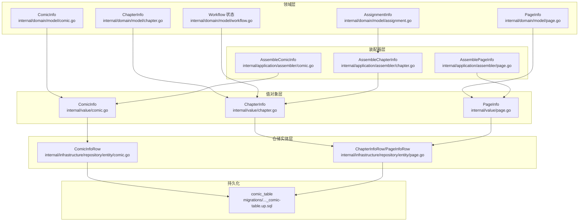
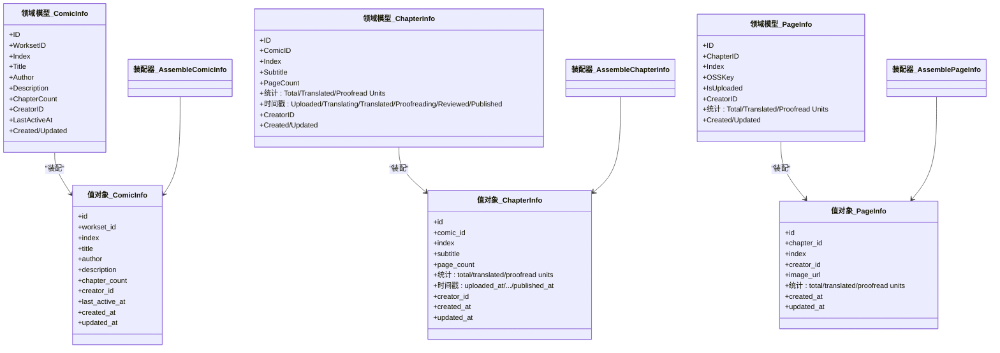
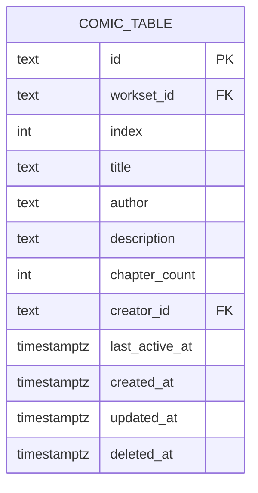
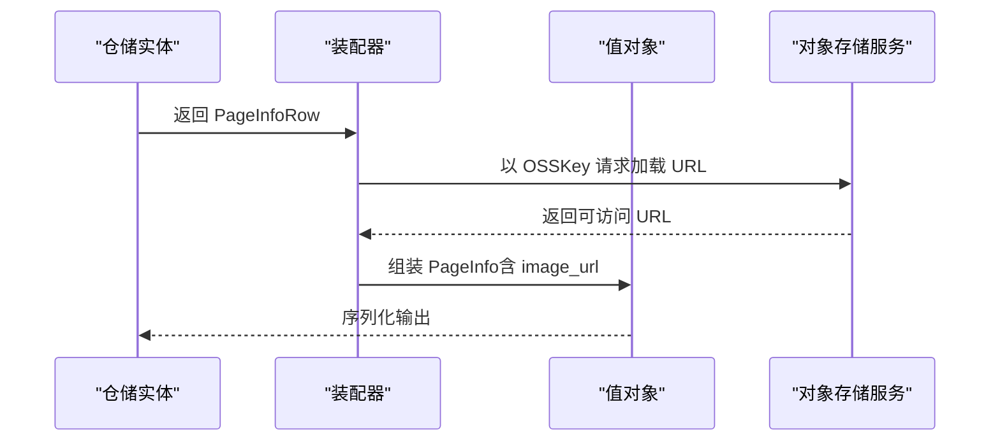
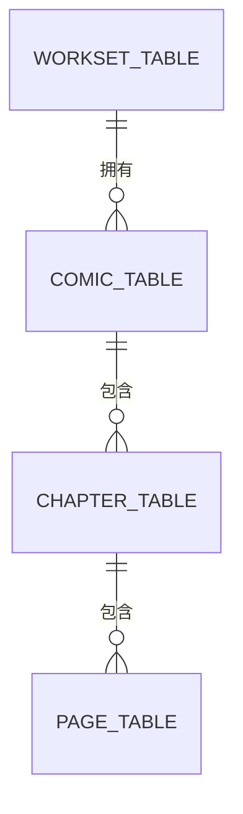
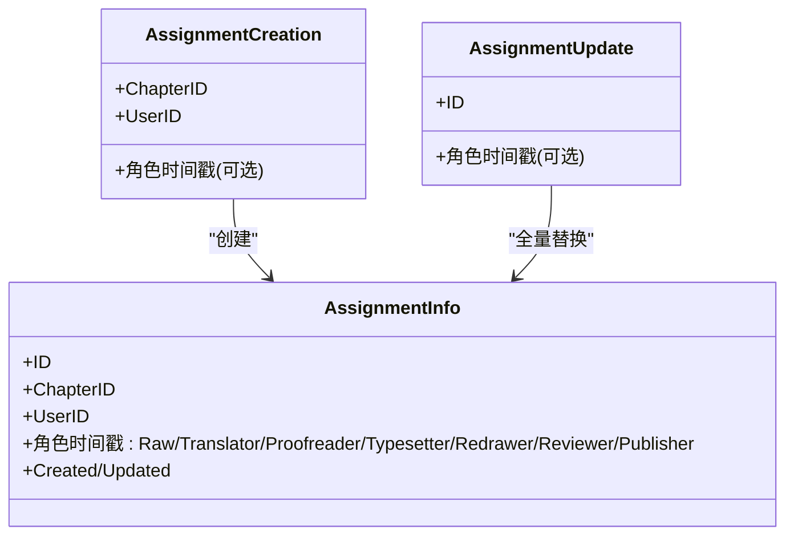

```mermaid
flowchart TD
Start(["进入更新"]) --> CheckUpload["检查 upload_status"]
CheckUpload --> |pending| SetUploadNil["清空上传时间戳"]
CheckUpload --> |completed| SetUploadNow["设置上传完成时间戳"]
CheckUpload --> |unset| KeepUpload["保留原上传时间戳"]
Start --> CheckTranslate["检查 translate_status"]
CheckTranslate --> |pending| ResetTrans["清空翻译阶段时间戳"]
CheckTranslate --> |in_progress| SetTransStart["设置翻译开始时间戳"]
CheckTranslate --> |completed| SetTransDone["设置翻译完成时间戳"]
CheckTranslate --> |unset| KeepTrans["保留原翻译时间戳"]
Start --> CheckProofread["检查 proofread_status"]
CheckProofread --> |pending| ResetProof["清空校对阶段时间戳"]
CheckProofread --> |in_progress| SetProofStart["设置校对开始时间戳"]
CheckProofread --> |completed| SetProofDone["设置校对完成时间戳"]
CheckProofread --> |unset| KeepProof["保留原校对时间戳"]
Start --> CheckTypeset["检查 typeset_status"]
CheckTypeset --> |pending| ResetTypeset["清空排版阶段时间戳"]
CheckTypeset --> |in_progress| SetTypesetStart["设置排版开始时间戳"]
CheckTypeset --> |completed| SetTypesetDone["设置排版完成时间戳"]
CheckTypeset --> |unset| KeepTypeset["保留原排版时间戳"]
Start --> CheckReview["检查 review_status"]
CheckReview --> |pending| SetReviewNil["清空审阅时间戳"]
CheckReview --> |completed| SetReviewNow["设置审阅完成时间戳"]
CheckReview --> |unset| KeepReview["保留原审阅时间戳"]
Start --> CheckPublish["检查 publish_status"]
CheckPublish --> |pending| SetPublishNil["清空发布时间戳"]
CheckPublish --> |completed| SetPublishNow["设置发布完成时间戳"]
CheckPublish --> |unset| KeepPublish["保留原发布时间戳"]
SetUploadNil --> End(["结束"])
SetUploadNow --> End
KeepUpload --> End
ResetTrans --> End
SetTransStart --> End
SetTransDone --> End
KeepTrans --> End
ResetProof --> End
SetProofStart --> End
SetProofDone --> End
KeepProof --> End
ResetTypeset --> End
SetTypesetStart --> End
SetTypesetDone --> End
KeepTypeset --> End
SetReviewNil --> End
SetReviewNow --> End
KeepReview --> End
SetPublishNil --> End
SetPublishNow --> End
KeepPublish --> End
```

# 漫画模型

<cite>
**本文引用的文件**
- [internal/domain/model/comic.go](file://internal/domain/model/comic.go)
- [internal/domain/model/chapter.go](file://internal/domain/model/chapter.go)
- [internal/domain/model/page.go](file://internal/domain/model/page.go)
- [internal/domain/model/workflow.go](file://internal/domain/model/workflow.go)
- [internal/domain/model/assignment.go](file://internal/domain/model/assignment.go)
- [internal/value/comic.go](file://internal/value/comic.go)
- [internal/value/chapter.go](file://internal/value/chapter.go)
- [internal/value/page.go](file://internal/value/page.go)
- [internal/application/assembler/comic.go](file://internal/application/assembler/comic.go)
- [internal/application/assembler/chapter.go](file://internal/application/assembler/chapter.go)
- [internal/application/assembler/page.go](file://internal/application/assembler/page.go)
- [internal/infrastructure/repository/entity/comic.go](file://internal/infrastructure/repository/entity/comic.go)
- [internal/infrastructure/repository/entity/page.go](file://internal/infrastructure/repository/entity/page.go)
- [migrations/20260306101212_comic-table.up.sql](file://migrations/20260306101212_comic-table.up.sql)
</cite>

## 目录
1. [引言](#引言)
2. [项目结构](#项目结构)
3. [核心组件](#核心组件)
4. [架构总览](#架构总览)
5. [详细组件分析](#详细组件分析)
6. [依赖分析](#依赖分析)
7. [性能考虑](#性能考虑)
8. [故障排查指南](#故障排查指南)
9. [结论](#结论)
10. [附录](#附录)

## 引言
本文件系统性梳理漫画内容模型的数据结构与关系，覆盖以下主题：
- ComicInfo 实体字段定义与职责边界（标题、作者、状态、封面等属性的映射与来源）
- Chapter 实体的章节管理结构（章节编号、标题、发布状态等）
- Page 实体的页面数据模型（页面编号、图片链接、处理状态等）
- 漫画、章节、页面之间的层级关系与数据完整性约束
- 内容发布流程的数据结构、版本控制机制与内容审核状态管理
- 漫画模型在任务分配与工作流中的应用场景

## 项目结构
围绕漫画模型的关键代码分布在领域模型、值对象、装配器、仓储实体与迁移脚本等层次，形成清晰的分层职责：
- 领域模型：定义业务实体与状态机（如工作流状态）
- 值对象：面向 API 的序列化结构与校验逻辑
- 装配器：将领域模型转换为对外值对象，并注入 URL 等运行时信息
- 仓储实体：数据库表结构映射与聚合行转换
- 迁移脚本：数据库表结构与索引定义

图表来源
- [internal/domain/model/comic.go:1-107](file://internal/domain/model/comic.go#L1-L107)
- [internal/domain/model/chapter.go:1-260](file://internal/domain/model/chapter.go#L1-L260)
- [internal/domain/model/page.go:1-134](file://internal/domain/model/page.go#L1-L134)
- [internal/domain/model/workflow.go:1-36](file://internal/domain/model/workflow.go#L1-L36)
- [internal/domain/model/assignment.go:1-190](file://internal/domain/model/assignment.go#L1-L190)
- [internal/value/comic.go:1-124](file://internal/value/comic.go#L1-L124)
- [internal/value/chapter.go:1-148](file://internal/value/chapter.go#L1-L148)
- [internal/value/page.go:1-95](file://internal/value/page.go#L1-L95)
- [internal/application/assembler/comic.go:1-35](file://internal/application/assembler/comic.go#L1-L35)
- [internal/application/assembler/chapter.go:1-40](file://internal/application/assembler/chapter.go#L1-L40)
- [internal/application/assembler/page.go:1-34](file://internal/application/assembler/page.go#L1-L34)
- [internal/infrastructure/repository/entity/comic.go:1-112](file://internal/infrastructure/repository/entity/comic.go#L1-L112)
- [internal/infrastructure/repository/entity/page.go:1-187](file://internal/infrastructure/repository/entity/page.go#L1-L187)
- [migrations/20260306101212_comic-table.up.sql:1-37](file://migrations/20260306101212_comic-table.up.sql#L1-L37)

章节来源
- [internal/domain/model/comic.go:1-107](file://internal/domain/model/comic.go#L1-L107)
- [internal/domain/model/chapter.go:1-260](file://internal/domain/model/chapter.go#L1-L260)
- [internal/domain/model/page.go:1-134](file://internal/domain/model/page.go#L1-L134)
- [internal/domain/model/workflow.go:1-36](file://internal/domain/model/workflow.go#L1-L36)
- [internal/domain/model/assignment.go:1-190](file://internal/domain/model/assignment.go#L1-L190)
- [internal/value/comic.go:1-124](file://internal/value/comic.go#L1-L124)
- [internal/value/chapter.go:1-148](file://internal/value/chapter.go#L1-L148)
- [internal/value/page.go:1-95](file://internal/value/page.go#L1-L95)
- [internal/application/assembler/comic.go:1-35](file://internal/application/assembler/comic.go#L1-L35)
- [internal/application/assembler/chapter.go:1-40](file://internal/application/assembler/chapter.go#L1-L40)
- [internal/application/assembler/page.go:1-34](file://internal/application/assembler/page.go#L1-L34)
- [internal/infrastructure/repository/entity/comic.go:1-112](file://internal/infrastructure/repository/entity/comic.go#L1-L112)
- [internal/infrastructure/repository/entity/page.go:1-187](file://internal/infrastructure/repository/entity/page.go#L1-L187)
- [migrations/20260306101212_comic-table.up.sql:1-37](file://migrations/20260306101212_comic-table.up.sql#L1-L37)

## 核心组件
本节聚焦三大核心实体及其关键字段与职责：
- ComicInfo：漫画元数据与统计信息
- ChapterInfo：章节级工作流与统计
- PageInfo：页面级资源与单元统计

章节来源
- [internal/domain/model/comic.go:5-26](file://internal/domain/model/comic.go#L5-L26)
- [internal/domain/model/chapter.go:5-35](file://internal/domain/model/chapter.go#L5-L35)
- [internal/domain/model/page.go:5-22](file://internal/domain/model/page.go#L5-L22)

## 架构总览
漫画模型遵循“领域模型 → 值对象 → 装配器 → 仓储实体 → 数据库”的分层设计，确保业务规则与外部接口解耦。

图表来源
- [internal/domain/model/comic.go:5-107](file://internal/domain/model/comic.go#L5-L107)
- [internal/domain/model/chapter.go:5-260](file://internal/domain/model/chapter.go#L5-L260)
- [internal/domain/model/page.go:5-134](file://internal/domain/model/page.go#L5-L134)
- [internal/application/assembler/comic.go:8-34](file://internal/application/assembler/comic.go#L8-L34)
- [internal/application/assembler/chapter.go:9-39](file://internal/application/assembler/chapter.go#L9-L39)
- [internal/application/assembler/page.go:8-33](file://internal/application/assembler/page.go#L8-L33)
- [internal/value/comic.go:8-28](file://internal/value/comic.go#L8-L28)
- [internal/value/chapter.go:10-39](file://internal/value/chapter.go#L10-L39)
- [internal/value/page.go:56-72](file://internal/value/page.go#L56-L72)

## 详细组件分析

### ComicInfo 实体
- 字段与含义
  - 标识与归属：ID、WorksetID
  - 基础信息：Index、Title、Author、Description
  - 统计与归属：ChapterCount、CreatorID
  - 活跃度与时间：LastActiveAt、Created/Updated
- 关系与包含
  - 可选包含 WorksetInfo 与 UserInfo（仅在 includes 时填充）
- 创建/更新/查询
  - 领域模型提供构造函数与创建/更新结构体
  - 值对象层提供校验与序列化
- 数据库映射
  - 仓储实体映射完整列，包含工作集与创建者别名列
  - 迁移脚本定义主键、外键、默认值与索引

图表来源
- [migrations/20260306101212_comic-table.up.sql:1-37](file://migrations/20260306101212_comic-table.up.sql#L1-L37)
- [internal/infrastructure/repository/entity/comic.go:13-47](file://internal/infrastructure/repository/entity/comic.go#L13-L47)

章节来源
- [internal/domain/model/comic.go:5-107](file://internal/domain/model/comic.go#L5-L107)
- [internal/value/comic.go:8-124](file://internal/value/comic.go#L8-L124)
- [internal/application/assembler/comic.go:8-34](file://internal/application/assembler/comic.go#L8-L34)
- [internal/infrastructure/repository/entity/comic.go:13-112](file://internal/infrastructure/repository/entity/comic.go#L13-L112)
- [migrations/20260306101212_comic-table.up.sql:1-37](file://migrations/20260306101212_comic-table.up.sql#L1-L37)

### ChapterInfo 实体
- 字段与含义
  - 标识与归属：ID、ComicID
  - 结构信息：Index、Subtitle
  - 统计信息：PageCount、TotalUnitCount、TranslatedUnitCount、ProofreadUnitCount
  - 工作流时间戳：UploadedAt、TransalatingAt、TranslatedAt、ProofreadingAt、ProofreadAt、TypesettingAt、TypesetAt、ReviewedAt、PublishedAt
  - CreatorID、Created/Updated
- 工作流状态
  - 使用 WorkflowStatus 枚举与组合校验，支持 pending/in_progress/completed/unset
  - 更新时根据状态变更设置或保留对应时间戳
- 创建/更新/查询
  - 领域模型提供构造函数与创建/更新结构体
  - 值对象层提供校验与序列化

图表来源
- [internal/domain/model/chapter.go:141-259](file://internal/domain/model/chapter.go#L141-L259)
- [internal/domain/model/workflow.go:24-35](file://internal/domain/model/workflow.go#L24-L35)

章节来源
- [internal/domain/model/chapter.go:5-260](file://internal/domain/model/chapter.go#L5-L260)
- [internal/value/chapter.go:10-148](file://internal/value/chapter.go#L10-L148)
- [internal/application/assembler/chapter.go:9-39](file://internal/application/assembler/chapter.go#L9-L39)
- [internal/domain/model/workflow.go:1-36](file://internal/domain/model/workflow.go#L1-L36)

### PageInfo 实体
- 字段与含义
  - 标识与归属：ID、ChapterID
  - 页面序号：Index
  - 资源定位：OSSKey（用于生成图片 URL）
  - 上传状态：IsUploaded
  - 统计信息：TotalUnitCount、TranslatedUnitCount、ProofreadUnitCount
  - CreatorID、Created/Updated
- 图片链接生成
  - 装配器通过 OnLoadURL 将 OSSKey 转换为可访问的 ImageURL
- 创建/更新/查询
  - 领域模型提供构造函数与创建/更新结构体
  - 值对象层提供校验与序列化

图表来源
- [internal/application/assembler/page.go:8-33](file://internal/application/assembler/page.go#L8-L33)
- [internal/value/page.go:56-72](file://internal/value/page.go#L56-L72)
- [internal/infrastructure/repository/entity/page.go:96-126](file://internal/infrastructure/repository/entity/page.go#L96-L126)

章节来源
- [internal/domain/model/page.go:5-134](file://internal/domain/model/page.go#L5-L134)
- [internal/value/page.go:1-95](file://internal/value/page.go#L1-L95)
- [internal/application/assembler/page.go:8-33](file://internal/application/assembler/page.go#L8-L33)
- [internal/infrastructure/repository/entity/page.go:56-187](file://internal/infrastructure/repository/entity/page.go#L56-L187)

### 层级关系与数据完整性约束
- 层级关系
  - Comic → Chapter → Page：一对多层级
- 外键约束
  - Comic.workset_id 引用工作集
  - Chapter.comic_id 引用漫画
  - Page.chapter_id 引用章节
- 索引与唯一性
  - 漫画按团队与索引建立唯一约束，保证同团队下漫画索引唯一
  - 多维索引优化查询（创建时间、活跃时间、创建者）

图表来源
- [migrations/20260306101212_comic-table.up.sql:4-13](file://migrations/20260306101212_comic-table.up.sql#L4-L13)

章节来源
- [migrations/20260306101212_comic-table.up.sql:1-37](file://migrations/20260306101212_comic-table.up.sql#L1-L37)

### 版本控制与内容审核状态管理
- 版本控制
  - 通过 CreatedAt/UpdatedAt 记录实体的创建与更新时间，作为版本依据
- 审核状态
  - 使用 WorkflowStatus 枚举与 IsValidWorkflowCombination 校验，确保状态变更合法
  - 各阶段时间戳（上传、翻译、校对、排版、审阅、发布）用于追踪审核进度

章节来源
- [internal/domain/model/workflow.go:14-35](file://internal/domain/model/workflow.go#L14-L35)
- [internal/value/chapter.go:88-147](file://internal/value/chapter.go#L88-L147)
- [internal/domain/model/chapter.go:141-259](file://internal/domain/model/chapter.go#L141-L259)

### 任务分配与工作流程应用
- 角色与分配
  - AssignmentInfo 记录用户在章节上的角色分配（原始提供、翻译、校对、排版、重绘、审阅、发布）
  - 提供 HasAnyRole 与 RoleMask 辅助判定与掩码计算
- 分配创建与更新
  - AssignmentCreation 基于目标角色掩码生成分配记录
  - AssignmentUpdate 支持全量替换，保留已有角色的时间戳

图表来源
- [internal/domain/model/assignment.go:5-190](file://internal/domain/model/assignment.go#L5-L190)

章节来源
- [internal/domain/model/assignment.go:1-190](file://internal/domain/model/assignment.go#L1-L190)

## 依赖分析
- 组件耦合
  - 值对象依赖领域模型与工具（如时间转换），但不反向依赖仓储
  - 装配器负责将领域模型转换为对外值对象，并注入运行时信息（如图片 URL）
- 外部依赖
  - 对象存储服务通过 OnLoadURL 注入，实现图片 URL 的动态生成
- 循环依赖
  - 当前分层清晰，未发现循环依赖

图表来源
- [internal/application/assembler/comic.go:8-34](file://internal/application/assembler/comic.go#L8-L34)
- [internal/application/assembler/chapter.go:9-39](file://internal/application/assembler/chapter.go#L9-L39)
- [internal/application/assembler/page.go:8-33](file://internal/application/assembler/page.go#L8-L33)
- [internal/infrastructure/repository/entity/comic.go:64-112](file://internal/infrastructure/repository/entity/comic.go#L64-L112)
- [internal/infrastructure/repository/entity/page.go:96-187](file://internal/infrastructure/repository/entity/page.go#L96-L187)

## 性能考虑
- 索引策略
  - 漫画表按团队与索引建立唯一索引，避免重复与提升查询稳定性
  - 按创建时间与活跃时间倒序索引，支持高效排序与分页
- 聚合查询
  - 仓储实体提供包含关联信息的聚合行，减少多次 JOIN 的开销
- 时间戳使用
  - 使用 Unix/UnixMilli 等统一时间格式，便于前端展示与比较

## 故障排查指南
- 参数校验
  - 值对象层提供严格的输入校验（如标题、作者、描述长度限制，章节副标题长度限制等）
- 状态合法性
  - 使用 IsValidWorkflowCombination 校验工作流状态组合，防止非法状态变更
- 装配失败
  - 若图片 URL 生成失败，装配器会回退为空字符串，需检查对象存储服务可用性与 OSSKey 正确性

章节来源
- [internal/value/comic.go:60-123](file://internal/value/comic.go#L60-L123)
- [internal/value/chapter.go:108-147](file://internal/value/chapter.go#L108-L147)
- [internal/application/assembler/page.go:9-12](file://internal/application/assembler/page.go#L9-L12)

## 结论
漫画模型通过清晰的分层设计与严谨的状态机约束，实现了从领域到值对象再到数据库的完整闭环。ComicInfo、ChapterInfo、PageInfo 三者构成稳定的层级关系，配合工作流状态与任务分配机制，能够有效支撑内容创作、审核与发布的全流程管理。

## 附录
- 关键字段速查
  - ComicInfo：ID、WorksetID、Index、Title、Author、Description、ChapterCount、CreatorID、LastActiveAt、Created/Updated
  - ChapterInfo：ID、ComicID、Index、Subtitle、PageCount、统计单位数、各阶段时间戳、CreatorID、Created/Updated
  - PageInfo：ID、ChapterID、Index、OSSKey、IsUploaded、统计单位数、CreatorID、Created/Updated
- API 与校验
  - 值对象层提供创建/更新/查询参数的结构与校验逻辑，确保输入有效性