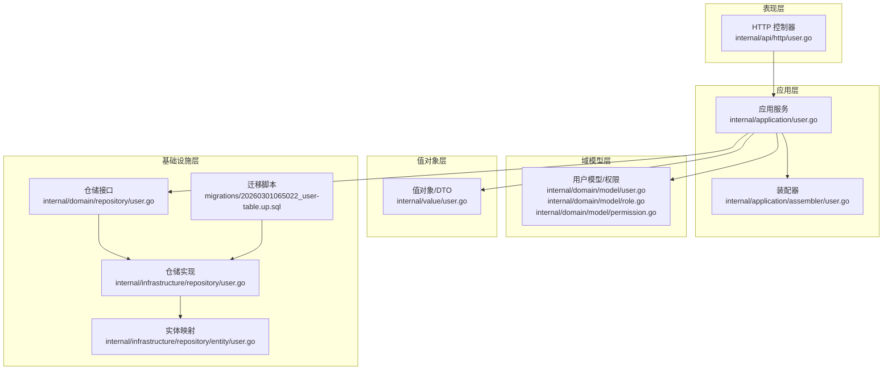
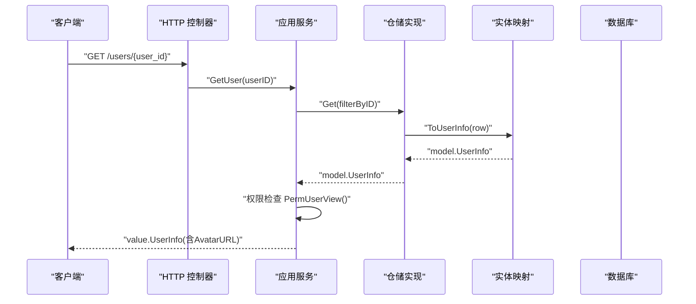
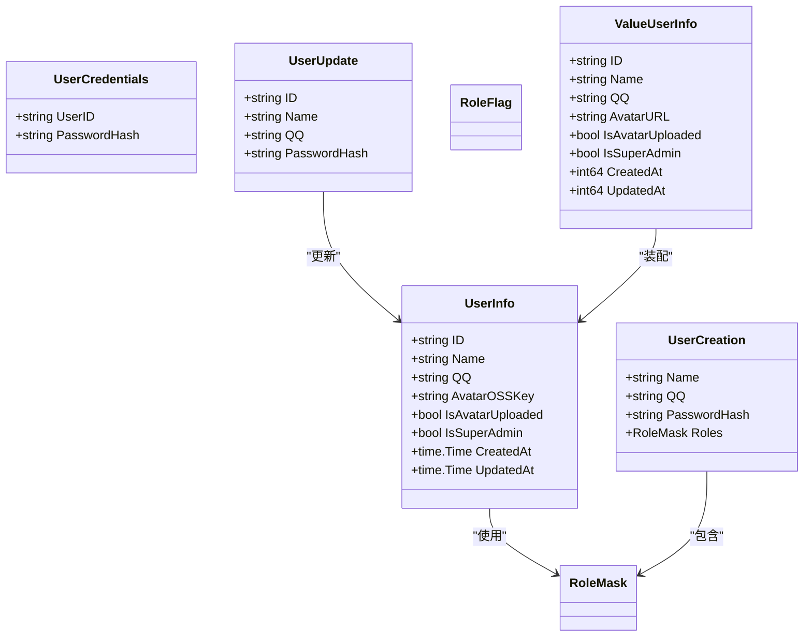
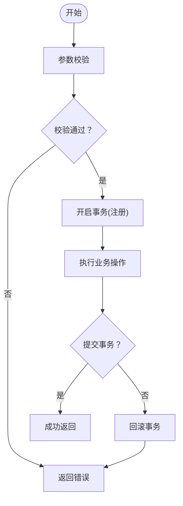

# 用户模型

<cite>
**本文引用的文件**
- [internal/domain/model/user.go](file://internal/domain/model/user.go)
- [internal/domain/model/role.go](file://internal/domain/model/role.go)
- [internal/domain/model/permission.go](file://internal/domain/model/permission.go)
- [internal/application/user.go](file://internal/application/user.go)
- [internal/application/assembler/user.go](file://internal/application/assembler/user.go)
- [internal/api/http/user.go](file://internal/api/http/user.go)
- [internal/value/user.go](file://internal/value/user.go)
- [internal/infrastructure/repository/user.go](file://internal/infrastructure/repository/user.go)
- [internal/infrastructure/repository/entity/user.go](file://internal/infrastructure/repository/entity/user.go)
- [migrations/20260301065022_user-table.up.sql](file://migrations/20260301065022_user-table.up.sql)
</cite>

## 目录
1. [简介](#简介)
2. [项目结构](#项目结构)
3. [核心组件](#核心组件)
4. [架构总览](#架构总览)
5. [详细组件分析](#详细组件分析)
6. [依赖关系分析](#依赖关系分析)
7. [性能考量](#性能考量)
8. [故障排查指南](#故障排查指南)
9. [结论](#结论)
10. [附录](#附录)

## 简介
本文件面向“用户模型”的数据模型设计与实现，围绕 UserInfo 结构体及其相关结构体（UserCredentials、UserCreation、UserUpdate）展开，系统性说明字段定义、数据类型、约束条件、业务含义与默认值；解释角色权限系统中 RoleMask 与 RoleFlag 的实现机制；给出用户数据的验证规则、默认值设置、数据安全与隐私保护措施；并阐述用户模型在团队协作中的作用及与团队、成员、邀请等实体的关系映射。

## 项目结构
用户模型涉及分层清晰的代码组织：
- 域模型层（domain/model）：定义领域对象与权限逻辑
- 应用服务层（application）：编排业务流程、事务控制、权限检查
- 值对象层（value）：对外暴露的 DTO 与输入校验
- 接口层（api/http）：HTTP 路由与控制器
- 基础设施层（infrastructure/repository）：数据库实体与仓储实现
- 数据迁移（migrations）：数据库表结构与索引

图表来源
- [internal/api/http/user.go:1-292](file://internal/api/http/user.go#L1-L292)
- [internal/application/user.go:1-594](file://internal/application/user.go#L1-L594)
- [internal/application/assembler/user.go:1-34](file://internal/application/assembler/user.go#L1-L34)
- [internal/domain/model/user.go:1-100](file://internal/domain/model/user.go#L1-L100)
- [internal/domain/model/role.go:1-56](file://internal/domain/model/role.go#L1-L56)
- [internal/domain/model/permission.go:1-845](file://internal/domain/model/permission.go#L1-L845)
- [internal/value/user.go:1-171](file://internal/value/user.go#L1-L171)
- [internal/infrastructure/repository/user.go:1-150](file://internal/infrastructure/repository/user.go#L1-L150)
- [internal/infrastructure/repository/entity/user.go:1-58](file://internal/infrastructure/repository/entity/user.go#L1-L58)
- [migrations/20260301065022_user-table.up.sql:1-52](file://migrations/20260301065022_user-table.up.sql#L1-L52)

章节来源
- [internal/api/http/user.go:1-292](file://internal/api/http/user.go#L1-L292)
- [internal/application/user.go:1-594](file://internal/application/user.go#L1-L594)
- [internal/application/assembler/user.go:1-34](file://internal/application/assembler/user.go#L1-L34)
- [internal/domain/model/user.go:1-100](file://internal/domain/model/user.go#L1-L100)
- [internal/domain/model/role.go:1-56](file://internal/domain/model/role.go#L1-L56)
- [internal/domain/model/permission.go:1-845](file://internal/domain/model/permission.go#L1-L845)
- [internal/value/user.go:1-171](file://internal/value/user.go#L1-L171)
- [internal/infrastructure/repository/user.go:1-150](file://internal/infrastructure/repository/user.go#L1-L150)
- [internal/infrastructure/repository/entity/user.go:1-58](file://internal/infrastructure/repository/entity/user.go#L1-L58)
- [migrations/20260301065022_user-table.up.sql:1-52](file://migrations/20260301065022_user-table.up.sql#L1-L52)

## 核心组件
- UserInfo：用户领域模型，承载用户基本信息与状态
- UserCredentials：登录凭据（仅含用户标识与密码哈希），不对外暴露完整用户信息
- UserCreation：注册时的用户创建参数，包含角色掩码
- UserUpdate：更新时的用户修改参数
- RoleMask/RoleFlag：角色位掩码与标志位，用于表达多角色组合
- 值对象 UserInfo（value）：对外暴露的用户信息 DTO，包含头像 URL 字段
- 仓储接口 UserRepository：抽象用户数据访问能力
- 实体映射：UserInfoRow/UserCredentialsRow/UserInsertRow 映射到数据库表字段

章节来源
- [internal/domain/model/user.go:1-100](file://internal/domain/model/user.go#L1-L100)
- [internal/value/user.go:76-89](file://internal/value/user.go#L76-L89)
- [internal/infrastructure/repository/entity/user.go:11-58](file://internal/infrastructure/repository/entity/user.go#L11-L58)
- [internal/domain/model/role.go:1-56](file://internal/domain/model/role.go#L1-L56)

## 架构总览
用户模型在各层之间的流转如下：
- HTTP 层接收请求，进行参数解析与校验
- 应用层执行业务逻辑、权限检查、事务控制
- 值对象层负责对外 DTO 转换与校验
- 域模型层定义不变量与权限规则
- 基础设施层完成数据库读写与实体映射

图表来源
- [internal/api/http/user.go:10-49](file://internal/api/http/user.go#L10-L49)
- [internal/application/user.go:280-319](file://internal/application/user.go#L280-L319)
- [internal/application/assembler/user.go:10-33](file://internal/application/assembler/user.go#L10-L33)
- [internal/infrastructure/repository/user.go:54-71](file://internal/infrastructure/repository/user.go#L54-L71)
- [internal/infrastructure/repository/entity/user.go:25-36](file://internal/infrastructure/repository/entity/user.go#L25-L36)

## 详细组件分析

### UserInfo 字段定义与业务含义
- ID：用户唯一标识，字符串类型，数据库主键
- Name：用户名，字符串类型，必填
- QQ：用户 QQ 号，字符串类型，唯一约束
- AvatarOSSKey：头像对象存储键，字符串类型，用于生成预签名上传/下载 URL
- IsAvatarUploaded：头像是否已上传完成，布尔类型，默认 false
- IsSuperAdmin：是否为超级管理员，布尔类型，默认 false
- CreatedAt/UpdatedAt：创建与更新时间，时间类型，数据库默认 NOW()

字段约束与默认值来源于数据库迁移脚本：
- 唯一约束：QQ
- 默认值：is_avatar_uploaded、is_super_admin、created_at、updated_at
- 软删除：deleted_at 字段存在，查询时过滤 deleted_at IS NULL

章节来源
- [internal/domain/model/user.go:7-19](file://internal/domain/model/user.go#L7-L19)
- [internal/infrastructure/repository/entity/user.go:11-21](file://internal/infrastructure/repository/entity/user.go#L11-L21)
- [migrations/20260301065022_user-table.up.sql:1-17](file://migrations/20260301065022_user-table.up.sql#L1-L17)

### UserCredentials、UserCreation、UserUpdate 设计目的与使用场景
- UserCredentials
  - 用途：登录时校验，仅包含用户标识与密码哈希，不对外暴露完整用户信息
  - 场景：凭据查询、密码校验、生成访问令牌
- UserCreation
  - 用途：注册时的创建参数，包含姓名、QQ、密码哈希与角色掩码
  - 场景：注册流程中创建用户、关联成员、标记邀请失效
- UserUpdate
  - 用途：更新时的修改参数，包含用户标识、姓名、QQ、密码哈希
  - 场景：用户资料更新、密码更新

章节来源
- [internal/domain/model/user.go:43-54](file://internal/domain/model/user.go#L43-L54)
- [internal/domain/model/user.go:56-78](file://internal/domain/model/user.go#L56-L78)
- [internal/domain/model/user.go:80-99](file://internal/domain/model/user.go#L80-L99)
- [internal/application/user.go:156-278](file://internal/application/user.go#L156-L278)

### 角色权限系统：RoleMask 与 RoleFlag
- RoleFlag：语义化角色标志位，采用位移常量表示不同分工角色
- RoleMask：整型掩码，通过按位或组合多个 RoleFlag
- 掩码工具函数：
  - MaskRoles：将 RoleFlag 列表合并为 RoleMask
  - UnmaskRoles：将 RoleMask 解析为 RoleFlag 列表
- 使用场景：注册时根据邀请的角色掩码赋予用户初始角色；后续权限检查基于角色集合判定

章节来源
- [internal/domain/model/role.go:1-56](file://internal/domain/model/role.go#L1-L56)
- [internal/application/user.go:216-221](file://internal/application/user.go#L216-L221)

### 用户数据验证规则与默认值
- 登录参数 LoginUserArgs：QQ 与密码均不能为空
- 注册参数 RegisterUserArgs：
  - QQ 长度 5~20 字符
  - 密码长度 6~30 字符
  - 名字长度 2~20 字
  - 邀请码不能为空
- 更新参数 UpdateUserArgs：
  - 用户 ID、姓名、QQ、密码均不能为空
  - 名字长度 2~20 字
  - QQ 长度 5~20 字
  - 密码长度 6~30 字
- 默认值：
  - is_avatar_uploaded：false
  - is_super_admin：false
  - created_at/updated_at：NOW()

章节来源
- [internal/value/user.go:13-27](file://internal/value/user.go#L13-L27)
- [internal/value/user.go:41-69](file://internal/value/user.go#L41-L69)
- [internal/value/user.go:130-170](file://internal/value/user.go#L130-L170)
- [migrations/20260301065022_user-table.up.sql:6-17](file://migrations/20260301065022_user-table.up.sql#L6-L17)

### 数据安全与隐私保护
- 凭据隔离：UserCredentials 仅包含用户标识与密码哈希，不暴露完整用户信息
- 密码处理：注册与更新均通过服务层进行哈希处理，HTTP 层不直接处理明文密码
- 访问令牌：登录成功后生成访问令牌，用于后续受保护接口调用
- 头像 URL：通过预签名 URL 提供临时访问，避免直接暴露存储地址
- 权限控制：用户仅能查看自己的信息；超级管理员可查看所有；删除用户需超级管理员且不可自删

章节来源
- [internal/domain/model/user.go:43-54](file://internal/domain/model/user.go#L43-L54)
- [internal/application/user.go:106-154](file://internal/application/user.go#L106-L154)
- [internal/application/user.go:426-468](file://internal/application/user.go#L426-L468)
- [internal/application/user.go:557-593](file://internal/application/user.go#L557-L593)

### 团队协作中的作用与关系映射
- 用户与团队（Team）：通过成员（Member）关联，成员信息包含角色集合
- 用户与邀请（Invitation）：注册时根据邀请的角色掩码初始化用户角色
- 权限检查：
  - 用户视图：普通用户仅能查看自己；超级管理员可查看所有
  - 用户更新：本人可更新；超级管理员可代为更新
  - 用户删除：仅超级管理员可删除，且不可删除自己
  - 头像预留/确认：依据用户更新权限进行控制

章节来源
- [internal/application/user.go:280-319](file://internal/application/user.go#L280-L319)
- [internal/application/user.go:426-468](file://internal/application/user.go#L426-L468)
- [internal/application/user.go:470-519](file://internal/application/user.go#L470-L519)
- [internal/application/user.go:557-593](file://internal/application/user.go#L557-L593)
- [internal/domain/model/permission.go:260-300](file://internal/domain/model/permission.go#L260-L300)

## 依赖关系分析
用户模型相关组件的依赖关系如下：

图表来源
- [internal/domain/model/user.go:7-99](file://internal/domain/model/user.go#L7-L99)
- [internal/value/user.go:76-89](file://internal/value/user.go#L76-L89)
- [internal/domain/model/role.go:3-5](file://internal/domain/model/role.go#L3-L5)

章节来源
- [internal/domain/model/user.go:1-100](file://internal/domain/model/user.go#L1-L100)
- [internal/value/user.go:1-171](file://internal/value/user.go#L1-L171)
- [internal/domain/model/role.go:1-56](file://internal/domain/model/role.go#L1-L56)

## 性能考量
- 索引策略：数据库对 name、qq、created_at、updated_at 建有索引，有利于模糊搜索与分页排序
- 查询过滤：仓储实现统一过滤 deleted_at IS NULL，避免误查软删除记录
- 头像 URL 加载：装配器在加载头像 URL 失败时记录日志并降级为空字符串，保证用户信息整体可用性
- 事务边界：注册流程在应用层统一开启/提交/回滚事务，确保一致性

章节来源
- [migrations/20260301065022_user-table.up.sql:19-34](file://migrations/20260301065022_user-table.up.sql#L19-L34)
- [internal/infrastructure/repository/user.go:32-51](file://internal/infrastructure/repository/user.go#L32-L51)
- [internal/application/assembler/user.go:10-21](file://internal/application/assembler/user.go#L10-L21)
- [internal/application/user.go:156-278](file://internal/application/user.go#L156-L278)

## 故障排查指南
- 登录失败
  - 现象：提示用户不存在或密码错误
  - 排查：确认 QQ 是否存在、密码哈希是否匹配；避免区分“用户不存在”与“密码错误”
- 注册失败
  - 现象：创建用户失败或事务回滚
  - 排查：检查邀请码有效性、角色掩码解析、事务提交/回滚日志
- 头像上传
  - 现象：预留失败或确认失败
  - 排查：确认权限检查、OSS 预签名 URL 生成、AvatarOSSKey 写入与确认逻辑
- 用户更新
  - 现象：更新失败或权限不足
  - 排查：确认 UpdateUserArgs 校验、权限检查、密码哈希处理
- 删除用户
  - 现象：权限不足或自删
  - 排查：确认超级管理员身份、禁止自删逻辑

章节来源
- [internal/application/user.go:106-154](file://internal/application/user.go#L106-L154)
- [internal/application/user.go:156-278](file://internal/application/user.go#L156-L278)
- [internal/application/user.go:426-468](file://internal/application/user.go#L426-L468)
- [internal/application/user.go:470-519](file://internal/application/user.go#L470-L519)
- [internal/application/user.go:557-593](file://internal/application/user.go#L557-L593)

## 结论
用户模型通过清晰的分层设计与严格的权限控制，实现了从数据模型到对外 DTO 的安全转换。UserInfo 字段定义明确、约束与默认值来自数据库层，配合值对象与仓储实现，保障了数据一致性与安全性。角色权限系统以位掩码为核心，便于扩展与维护。在团队协作场景中，用户模型与成员、邀请等实体紧密耦合，权限检查贯穿于关键操作，确保系统在功能与安全上的平衡。

## 附录
- 数据库表结构与索引
  - 主键：id
  - 唯一：qq
  - 默认：is_avatar_uploaded、is_super_admin、created_at、updated_at
  - 软删除：deleted_at
- 关键流程时序图（登录/注册/更新/删除）

[本图为概念性流程示意，不直接映射具体源码文件]