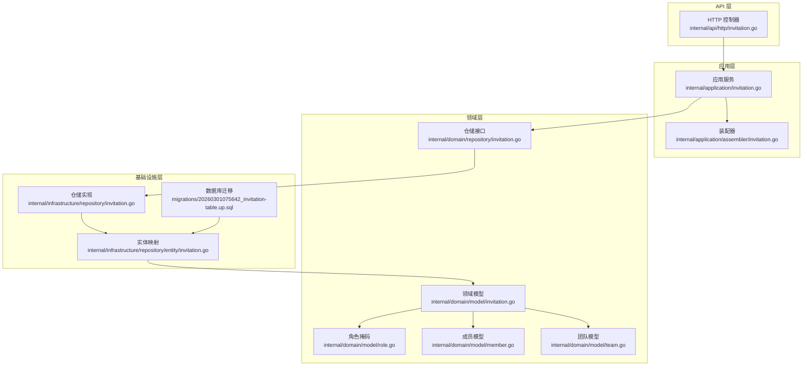
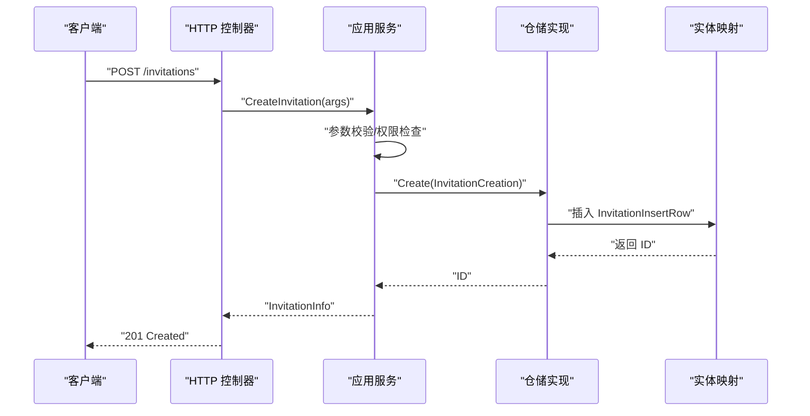
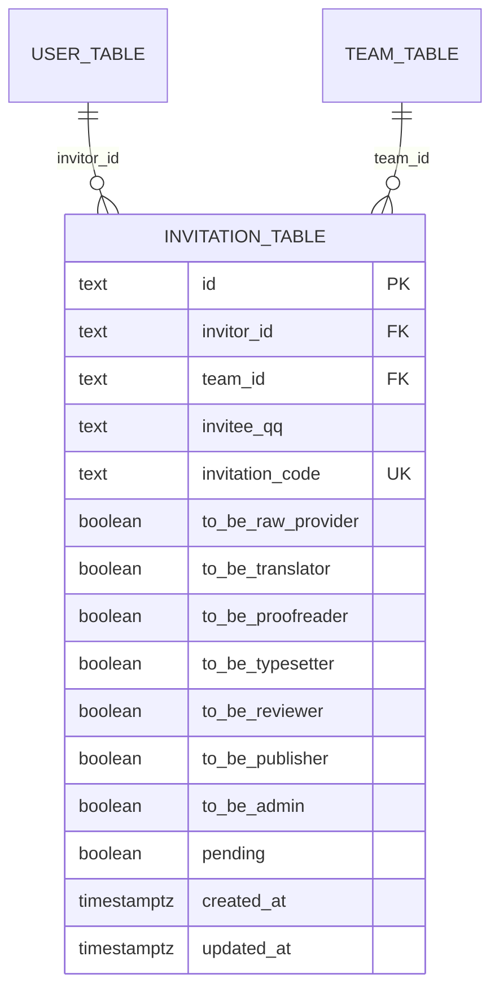
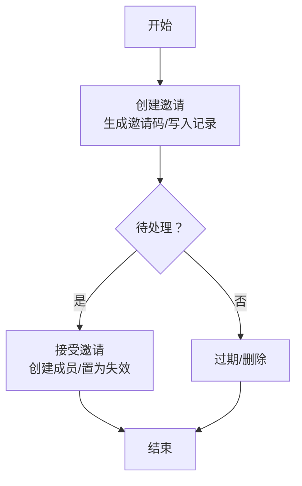
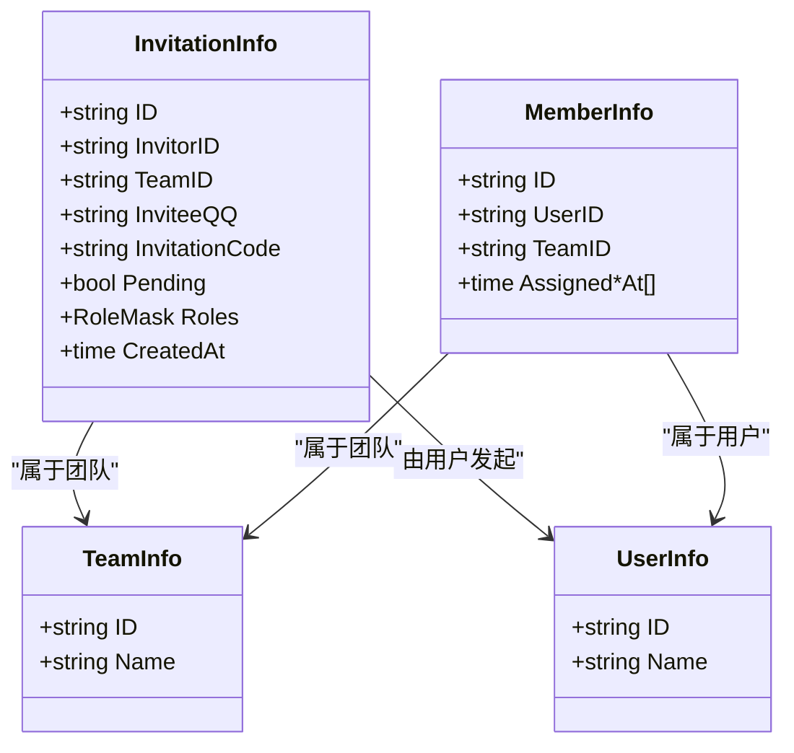
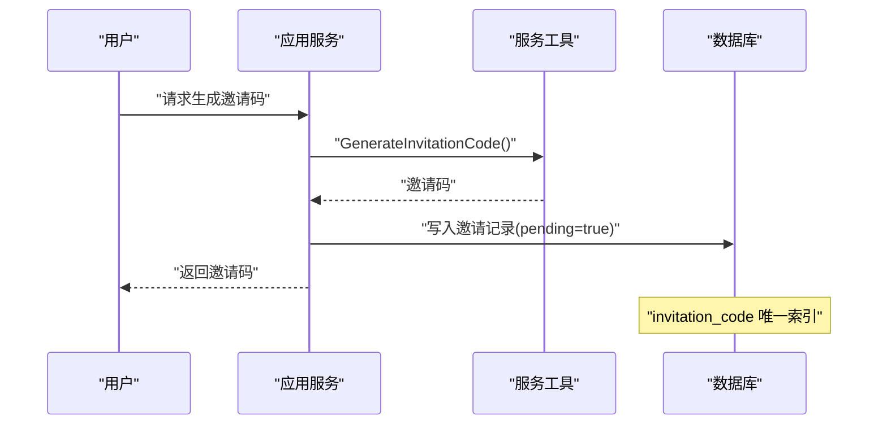
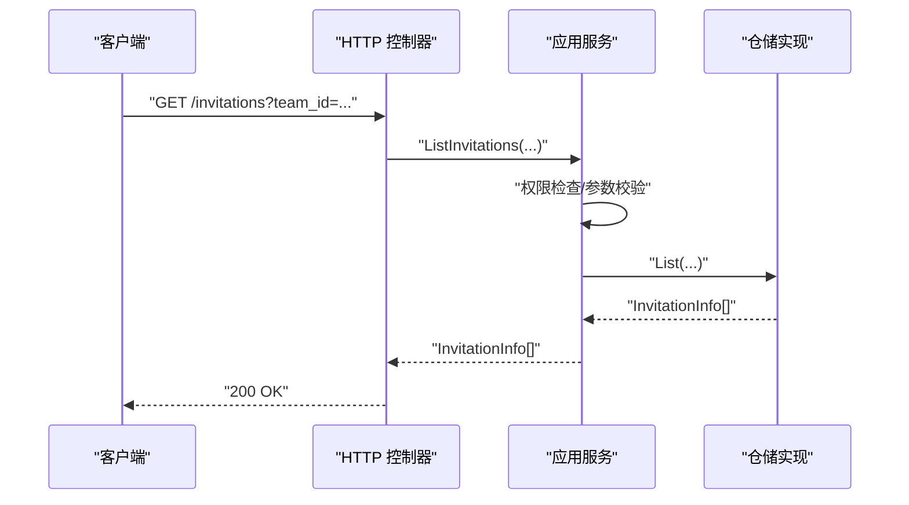
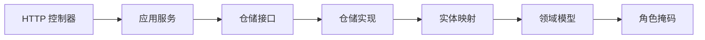

# 邀请模型

<cite>
**本文引用的文件**
- [internal/domain/model/invitation.go](file://internal/domain/model/invitation.go)
- [internal/domain/model/role.go](file://internal/domain/model/role.go)
- [internal/domain/model/member.go](file://internal/domain/model/member.go)
- [internal/domain/model/team.go](file://internal/domain/model/team.go)
- [internal/domain/repository/invitation.go](file://internal/domain/repository/invitation.go)
- [internal/infrastructure/repository/invitation.go](file://internal/infrastructure/repository/invitation.go)
- [internal/infrastructure/repository/entity/invitation.go](file://internal/infrastructure/repository/entity/invitation.go)
- [internal/application/invitation.go](file://internal/application/invitation.go)
- [internal/application/assembler/invitation.go](file://internal/application/assembler/invitation.go)
- [internal/value/invitation.go](file://internal/value/invitation.go)
- [internal/api/http/invitation.go](file://internal/api/http/invitation.go)
- [internal/domain/service/invitation.go](file://internal/domain/service/invitation.go)
- [migrations/20260301075642_invitation-table.up.sql](file://migrations/20260301075642_invitation-table.up.sql)
</cite>

## 目录
1. [引言](#引言)
2. [项目结构](#项目结构)
3. [核心组件](#核心组件)
4. [架构总览](#架构总览)
5. [详细组件分析](#详细组件分析)
6. [依赖分析](#依赖分析)
7. [性能考量](#性能考量)
8. [故障排查指南](#故障排查指南)
9. [结论](#结论)
10. [附录](#附录)

## 引言
本文件系统性梳理“邀请模型”的数据结构、流程与安全机制，覆盖邀请生成、发送、接受、拒绝等状态转换，以及邀请与团队、用户之间的关联关系与权限继承。同时给出邀请在团队扩展与成员管理中的业务价值、最佳实践与安全建议。

## 项目结构
围绕邀请模型的关键代码分布在以下层次：
- 值对象与参数：internal/value/invitation.go
- 应用服务：internal/application/invitation.go 及其装配器 internal/application/assembler/invitation.go
- 领域模型：internal/domain/model/invitation.go、internal/domain/model/role.go、internal/domain/model/member.go、internal/domain/model/team.go
- 仓储接口：internal/domain/repository/invitation.go
- 仓储实现与实体映射：internal/infrastructure/repository/invitation.go、internal/infrastructure/repository/entity/invitation.go
- API 层：internal/api/http/invitation.go
- 服务工具：internal/domain/service/invitation.go
- 数据库迁移：migrations/20260301075642_invitation-table.up.sql

图表来源
- [internal/api/http/invitation.go:1-185](file://internal/api/http/invitation.go#L1-L185)
- [internal/application/invitation.go:1-304](file://internal/application/invitation.go#L1-L304)
- [internal/application/assembler/invitation.go:1-25](file://internal/application/assembler/invitation.go#L1-L25)
- [internal/domain/model/invitation.go:1-158](file://internal/domain/model/invitation.go#L1-L158)
- [internal/domain/model/role.go:1-56](file://internal/domain/model/role.go#L1-L56)
- [internal/domain/model/member.go:1-205](file://internal/domain/model/member.go#L1-L205)
- [internal/domain/model/team.go:1-63](file://internal/domain/model/team.go#L1-L63)
- [internal/domain/repository/invitation.go:1-14](file://internal/domain/repository/invitation.go#L1-L14)
- [internal/infrastructure/repository/invitation.go:1-124](file://internal/infrastructure/repository/invitation.go#L1-L124)
- [internal/infrastructure/repository/entity/invitation.go:1-98](file://internal/infrastructure/repository/entity/invitation.go#L1-L98)
- [migrations/20260301075642_invitation-table.up.sql:1-27](file://migrations/20260301075642_invitation-table.up.sql#L1-L27)

章节来源
- [internal/api/http/invitation.go:1-185](file://internal/api/http/invitation.go#L1-L185)
- [internal/application/invitation.go:1-304](file://internal/application/invitation.go#L1-L304)
- [internal/application/assembler/invitation.go:1-25](file://internal/application/assembler/invitation.go#L1-L25)
- [internal/domain/model/invitation.go:1-158](file://internal/domain/model/invitation.go#L1-L158)
- [internal/domain/model/role.go:1-56](file://internal/domain/model/role.go#L1-L56)
- [internal/domain/model/member.go:1-205](file://internal/domain/model/member.go#L1-L205)
- [internal/domain/model/team.go:1-63](file://internal/domain/model/team.go#L1-L63)
- [internal/domain/repository/invitation.go:1-14](file://internal/domain/repository/invitation.go#L1-L14)
- [internal/infrastructure/repository/invitation.go:1-124](file://internal/infrastructure/repository/invitation.go#L1-L124)
- [internal/infrastructure/repository/entity/invitation.go:1-98](file://internal/infrastructure/repository/entity/invitation.go#L1-L98)
- [migrations/20260301075642_invitation-table.up.sql:1-27](file://migrations/20260301075642_invitation-table.up.sql#L1-L27)

## 核心组件
- 邀请值对象与参数
  - CreateInvitationArgs、ListTeamInvitationArgs、UpdateInvitationArgs、InvitationInfo 等，定义邀请 API 的输入输出与校验规则。
- 领域模型
  - InvitationCreation、InvitationInfo、InvitationUpdate：描述邀请的创建、查询结果与更新补丁。
  - RoleFlag/RoleMask：角色标志与掩码，支持多角色组合。
- 应用服务
  - InvitationApplication 接口及实现，封装鉴权、参数校验、仓储交互与装配逻辑。
- 仓储接口与实现
  - InvitationRepository 定义 List/Get/Create/Update/Invalidate/Delete 等操作；实现负责 SQL 执行与实体映射。
- 实体映射
  - InvitationInfoRow/InvitationInsertRow 映射数据库表 invitation_table 字段。
- API 控制器
  - 提供邀请列表、创建、更新、删除的 HTTP 接口。
- 服务工具
  - GenerateInvitationCode：生成邀请码（基于 UUID v7 的截断）。

章节来源
- [internal/value/invitation.go:1-93](file://internal/value/invitation.go#L1-L93)
- [internal/domain/model/invitation.go:1-158](file://internal/domain/model/invitation.go#L1-L158)
- [internal/domain/model/role.go:1-56](file://internal/domain/model/role.go#L1-L56)
- [internal/application/invitation.go:19-304](file://internal/application/invitation.go#L19-L304)
- [internal/domain/repository/invitation.go:1-14](file://internal/domain/repository/invitation.go#L1-L14)
- [internal/infrastructure/repository/invitation.go:1-124](file://internal/infrastructure/repository/invitation.go#L1-L124)
- [internal/infrastructure/repository/entity/invitation.go:1-98](file://internal/infrastructure/repository/entity/invitation.go#L1-L98)
- [internal/api/http/invitation.go:1-185](file://internal/api/http/invitation.go#L1-L185)
- [internal/domain/service/invitation.go:1-16](file://internal/domain/service/invitation.go#L1-L16)

## 架构总览
邀请模型遵循分层架构：API 层接收请求，应用层执行业务规则与鉴权，领域层承载模型与规则，仓储层负责持久化，实体映射负责 ORM 字段映射。

图表来源
- [internal/api/http/invitation.go:68-97](file://internal/api/http/invitation.go#L68-L97)
- [internal/application/invitation.go:133-213](file://internal/application/invitation.go#L133-L213)
- [internal/infrastructure/repository/invitation.go:66-89](file://internal/infrastructure/repository/invitation.go#L66-L89)
- [internal/infrastructure/repository/entity/invitation.go:43-62](file://internal/infrastructure/repository/entity/invitation.go#L43-L62)

## 详细组件分析

### 数据模型与字段定义
- 表结构 invitation_table（字段与约束）
  - 主键 id、外键 invitor_id 指向用户、外键 team_id 指向团队、唯一索引 invitation_code、布尔字段 to_be_* 对应各角色、pending 默认 TRUE、created_at/updated_at 时间戳。
- 实体映射 InvitationInfoRow/InvitationInsertRow
  - 包含邀请基本信息、角色标记、关联邀请者信息（可选）、创建时间等。
- 领域模型 InvitationInfo
  - 包含邀请标识、发起人、目标团队、被邀请 QQ、邀请码、Pending 状态、角色掩码、创建时间；提供 RoleMask 计算方法。
- 领域模型 InvitationCreation/InvitationUpdate
  - 分别用于创建与更新的角色标记设置，支持多角色组合。

图表来源
- [migrations/20260301075642_invitation-table.up.sql:1-27](file://migrations/20260301075642_invitation-table.up.sql#L1-L27)
- [internal/infrastructure/repository/entity/invitation.go:11-39](file://internal/infrastructure/repository/entity/invitation.go#L11-L39)

章节来源
- [migrations/20260301075642_invitation-table.up.sql:1-27](file://migrations/20260301075642_invitation-table.up.sql#L1-L27)
- [internal/infrastructure/repository/entity/invitation.go:11-98](file://internal/infrastructure/repository/entity/invitation.go#L11-L98)
- [internal/domain/model/invitation.go:63-158](file://internal/domain/model/invitation.go#L63-L158)

### 邀请流程与状态转换
- 流程概览
  - 创建：应用层校验参数与权限，生成唯一邀请码，写入邀请记录（pending=true）。
  - 发送：前端展示邀请码与角色信息，供被邀请人使用。
  - 接受：被邀请人完成注册并加入团队，应用层将邀请置为失效（pending=false），并创建成员记录（角色按邀请时设定）。
  - 拒绝：调用删除接口或等待过期，邀请记录被清理。
- 关键点
  - 角色继承：邀请记录中的角色标记在成员创建时直接沿用。
  - 状态字段：pending 字段用于区分“待处理”和“已失效”。

图表来源
- [internal/application/invitation.go:133-213](file://internal/application/invitation.go#L133-L213)
- [internal/infrastructure/repository/invitation.go:108-115](file://internal/infrastructure/repository/invitation.go#L108-L115)
- [internal/domain/model/member.go:1-205](file://internal/domain/model/member.go#L1-L205)

章节来源
- [internal/application/invitation.go:133-213](file://internal/application/invitation.go#L133-L213)
- [internal/infrastructure/repository/invitation.go:108-115](file://internal/infrastructure/repository/invitation.go#L108-L115)
- [internal/domain/model/member.go:1-205](file://internal/domain/model/member.go#L1-L205)

### 邀请与团队、用户的关联关系与权限继承
- 关联关系
  - 邀请记录关联用户（invitor_id）与团队（team_id），形成一对一到多对一的关系。
- 权限继承
  - 成员加入时，邀请中的角色标记直接用于创建成员记录，实现“角色继承”。
- 团队扩展与成员管理
  - 邀请是团队扩展的重要入口，避免直接添加成员带来的权限与角色不一致问题。

图表来源
- [internal/domain/model/invitation.go:63-84](file://internal/domain/model/invitation.go#L63-L84)
- [internal/domain/model/member.go:48-99](file://internal/domain/model/member.go#L48-L99)
- [internal/domain/model/team.go:5-15](file://internal/domain/model/team.go#L5-L15)
- [internal/domain/model/member.go:54-57](file://internal/domain/model/member.go#L54-L57)

章节来源
- [internal/domain/model/invitation.go:63-84](file://internal/domain/model/invitation.go#L63-L84)
- [internal/domain/model/member.go:48-99](file://internal/domain/model/member.go#L48-L99)
- [internal/domain/model/team.go:5-15](file://internal/domain/model/team.go#L5-L15)

### 邀请安全机制与防重放
- 邀请码生成
  - 使用 UUID v7 并截取末尾部分作为邀请码，具备高熵与唯一性，降低碰撞概率。
- 唯一性约束
  - 数据库层对 invitation_code 建立唯一索引，防止重复。
- 防重放策略
  - pending 字段用于标识“可使用”状态；一旦接受或删除，即置为失效，避免重复使用。
- 权限控制
  - 应用层在创建、更新、删除邀请前进行权限检查，确保仅授权用户可操作。

图表来源
- [internal/domain/service/invitation.go:5-15](file://internal/domain/service/invitation.go#L5-L15)
- [migrations/20260301075642_invitation-table.up.sql:8](file://migrations/20260301075642_invitation-table.up.sql#L8)
- [internal/application/invitation.go:180-184](file://internal/application/invitation.go#L180-L184)

章节来源
- [internal/domain/service/invitation.go:5-15](file://internal/domain/service/invitation.go#L5-L15)
- [migrations/20260301075642_invitation-table.up.sql:8](file://migrations/20260301075642_invitation-table.up.sql#L8)
- [internal/application/invitation.go:180-184](file://internal/application/invitation.go#L180-L184)

### 邀请有效期管理
- 当前实现
  - 数据库层未显式存储过期时间字段；pending 字段用于控制可用性。
- 建议
  - 可引入 expires_at 字段与后台任务定期清理过期邀请，或在应用层维护 TTL 策略并在查询时过滤。

章节来源
- [migrations/20260301075642_invitation-table.up.sql:18-22](file://migrations/20260301075642_invitation-table.up.sql#L18-L22)
- [internal/infrastructure/repository/invitation.go:108-115](file://internal/infrastructure/repository/invitation.go#L108-L115)

### API 与数据流
- 列表邀请
  - 参数：team_id、includes、分页；鉴权：PermInvitationList。
- 创建邀请
  - 参数：team_id、invitee_qq、roles；鉴权：PermInvitationCreate；生成邀请码；返回 InvitationInfo。
- 更新邀请
  - 参数：id、team_id、roles；鉴权：PermInvitationUpdate；仅允许更新待处理邀请。
- 删除邀请
  - 参数：invitation_id；鉴权：PermInvitationDelete；删除记录。

图表来源
- [internal/api/http/invitation.go:25-53](file://internal/api/http/invitation.go#L25-L53)
- [internal/application/invitation.go:71-131](file://internal/application/invitation.go#L71-L131)
- [internal/infrastructure/repository/invitation.go:30-49](file://internal/infrastructure/repository/invitation.go#L30-L49)

章节来源
- [internal/api/http/invitation.go:25-53](file://internal/api/http/invitation.go#L25-L53)
- [internal/application/invitation.go:71-131](file://internal/application/invitation.go#L71-L131)
- [internal/infrastructure/repository/invitation.go:30-49](file://internal/infrastructure/repository/invitation.go#L30-L49)

## 依赖分析
- 组件耦合
  - API 层依赖应用服务；应用层依赖仓储接口与装配器；仓储实现依赖实体映射；实体映射依赖领域模型。
- 外部依赖
  - UUID 生成器用于邀请码；GORM 用于 ORM 映射；数据库层提供唯一索引与外键约束。
- 循环依赖
  - 未发现循环依赖迹象，职责清晰分离。

图表来源
- [internal/api/http/invitation.go:1-185](file://internal/api/http/invitation.go#L1-L185)
- [internal/application/invitation.go:1-304](file://internal/application/invitation.go#L1-L304)
- [internal/domain/repository/invitation.go:1-14](file://internal/domain/repository/invitation.go#L1-L14)
- [internal/infrastructure/repository/invitation.go:1-124](file://internal/infrastructure/repository/invitation.go#L1-L124)
- [internal/infrastructure/repository/entity/invitation.go:1-98](file://internal/infrastructure/repository/entity/invitation.go#L1-L98)
- [internal/domain/model/invitation.go:1-158](file://internal/domain/model/invitation.go#L1-L158)
- [internal/domain/model/role.go:1-56](file://internal/domain/model/role.go#L1-L56)

章节来源
- [internal/api/http/invitation.go:1-185](file://internal/api/http/invitation.go#L1-L185)
- [internal/application/invitation.go:1-304](file://internal/application/invitation.go#L1-L304)
- [internal/domain/repository/invitation.go:1-14](file://internal/domain/repository/invitation.go#L1-L14)
- [internal/infrastructure/repository/invitation.go:1-124](file://internal/infrastructure/repository/invitation.go#L1-L124)
- [internal/infrastructure/repository/entity/invitation.go:1-98](file://internal/infrastructure/repository/entity/invitation.go#L1-L98)
- [internal/domain/model/invitation.go:1-158](file://internal/domain/model/invitation.go#L1-L158)
- [internal/domain/model/role.go:1-56](file://internal/domain/model/role.go#L1-L56)

## 性能考量
- 查询优化
  - 数据库为 team_id+created_at 创建了索引（仅针对 pending=false 的记录），有利于按团队倒序查询历史邀请。
- 写入优化
  - 创建邀请时一次性写入所有角色标记，避免后续多次更新。
- 缓存建议
  - 对常用查询（如某团队最近邀请列表）可引入缓存以减少数据库压力。
- 分页与 includes
  - 列表接口支持 includes（如 invitor），需谨慎使用以避免不必要的关联查询。

章节来源
- [migrations/20260301075642_invitation-table.up.sql:24-26](file://migrations/20260301075642_invitation-table.up.sql#L24-L26)
- [internal/application/invitation.go:101-110](file://internal/application/invitation.go#L101-L110)

## 故障排查指南
- 常见错误与定位
  - 参数校验失败：检查 CreateInvitationArgs/UpdateInvitationArgs 的必填字段与角色掩码。
  - 权限不足：确认当前用户在目标团队是否具备相应权限（创建/更新/删除）。
  - 已成为成员：若被邀请人已是团队成员，创建邀请会失败。
  - 邀请码冲突：数据库唯一索引导致重复邀请码写入失败。
- 日志与追踪
  - 应用层在关键步骤记录日志，便于定位失败原因。
- 建议排查步骤
  - 确认请求参数与权限；
  - 检查数据库唯一索引与外键约束；
  - 核对 pending 状态与过期策略。

章节来源
- [internal/application/invitation.go:78-81](file://internal/application/invitation.go#L78-L81)
- [internal/application/invitation.go:154-161](file://internal/application/invitation.go#L154-L161)
- [internal/application/invitation.go:170-177](file://internal/application/invitation.go#L170-L177)
- [migrations/20260301075642_invitation-table.up.sql:8](file://migrations/20260301075642_invitation-table.up.sql#L8)

## 结论
邀请模型通过清晰的分层设计与严格的权限控制，实现了从创建、发送到接受/拒绝的完整生命周期管理。借助角色掩码与成员继承机制，邀请在团队扩展与成员管理中发挥关键作用。建议在未来引入显式的过期时间与清理策略，并结合缓存与索引优化提升性能与安全性。

## 附录
- 最佳实践
  - 严格参数校验与权限检查；
  - 使用唯一邀请码并限制有效期；
  - 通过 pending 字段控制可使用性；
  - 在成员创建时同步保留邀请角色，确保权限一致性；
  - 合理使用 includes 与分页，避免过度关联查询。
- 安全考虑
  - 邀请码生成使用高熵算法；
  - 数据库唯一索引与外键约束；
  - 应用层权限校验与日志追踪。