# 领域模型

<cite>
**本文引用的文件**
- [internal/domain/model/user.go](file://internal/domain/model/user.go)
- [internal/domain/model/team.go](file://internal/domain/model/team.go)
- [internal/domain/model/comic.go](file://internal/domain/model/comic.go)
- [internal/domain/model/member.go](file://internal/domain/model/member.go)
- [internal/domain/model/workset.go](file://internal/domain/model/workset.go)
- [internal/domain/model/chapter.go](file://internal/domain/model/chapter.go)
- [internal/domain/model/page.go](file://internal/domain/model/page.go)
- [internal/domain/model/unit.go](file://internal/domain/model/unit.go)
- [internal/domain/model/assignment.go](file://internal/domain/model/assignment.go)
- [internal/domain/model/invitation.go](file://internal/domain/model/invitation.go)
- [internal/domain/model/role.go](file://internal/domain/model/role.go)
- [internal/domain/model/workflow.go](file://internal/domain/model/workflow.go)
- [internal/domain/model/permission.go](file://internal/domain/model/permission.go)
- [internal/value/user.go](file://internal/value/user.go)
- [internal/value/team.go](file://internal/value/team.go)
</cite>

## 目录
1. [引言](#引言)
2. [项目结构](#项目结构)
3. [核心组件](#核心组件)
4. [架构总览](#架构总览)
5. [详细组件分析](#详细组件分析)
6. [依赖分析](#依赖分析)
7. [性能考量](#性能考量)
8. [故障排查指南](#故障排查指南)
9. [结论](#结论)
10. [附录](#附录)

## 引言
本文件面向“漫画翻译协作平台”的领域建模，聚焦于核心业务实体与值对象的设计，阐明各实体的属性、业务规则与约束，并解释实体间的关系映射、继承与组合模式。同时，结合领域服务（权限与流程状态）对业务规则进行封装与不变量维护，给出实体生命周期、状态转换与事务边界的实践建议。

## 项目结构
领域模型主要位于 internal/domain/model 目录，按业务子域划分：
- 用户域：UserInfo、UserCredentials、UserCreation、UserUpdate
- 团队域：TeamInfo、TeamCreation、TeamUpdate
- 工作域：WorksetInfo、WorksetCreation、WorksetUpdate
- 漫画域：ComicInfo、ComicCreation、ComicUpdate
- 章节域：ChapterInfo、ChapterStats、ChapterCreation、ChapterUpdate
- 页面域：PageInfo、PageStats、PageCreation、PageUpdate
- 单元域：UnitInfo、UnitPatch、UnitCreation
- 分配域：AssignmentInfo、AssignmentCreation、AssignmentUpdate
- 邀请域：InvitationCreation、InvitationInfo、InvitationUpdate
- 角色与流程：RoleFlag/RoleMask、Workflow/WorkflowStatus
- 权限服务：基于加载器函数的权限判定

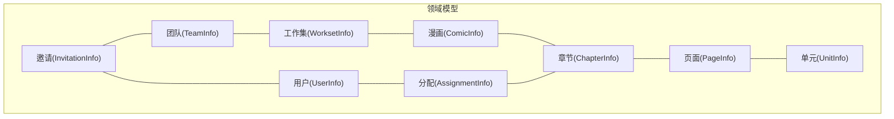

图示来源
- [internal/domain/model/user.go:7-19](file://internal/domain/model/user.go#L7-L19)
- [internal/domain/model/team.go:5-15](file://internal/domain/model/team.go#L5-L15)
- [internal/domain/model/workset.go:5-18](file://internal/domain/model/workset.go#L5-L18)
- [internal/domain/model/comic.go:5-26](file://internal/domain/model/comic.go#L5-L26)
- [internal/domain/model/chapter.go:5-35](file://internal/domain/model/chapter.go#L5-L35)
- [internal/domain/model/page.go:5-22](file://internal/domain/model/page.go#L5-L22)
- [internal/domain/model/unit.go:7-29](file://internal/domain/model/unit.go#L7-L29)
- [internal/domain/model/assignment.go:5-25](file://internal/domain/model/assignment.go#L5-L25)
- [internal/domain/model/invitation.go:63-84](file://internal/domain/model/invitation.go#L63-L84)

章节来源
- [internal/domain/model/user.go:1-100](file://internal/domain/model/user.go#L1-L100)
- [internal/domain/model/team.go:1-63](file://internal/domain/model/team.go#L1-L63)
- [internal/domain/model/workset.go:1-82](file://internal/domain/model/workset.go#L1-L82)
- [internal/domain/model/comic.go:1-107](file://internal/domain/model/comic.go#L1-L107)
- [internal/domain/model/chapter.go:1-260](file://internal/domain/model/chapter.go#L1-L260)
- [internal/domain/model/page.go:1-134](file://internal/domain/model/page.go#L1-L134)
- [internal/domain/model/unit.go:1-149](file://internal/domain/model/unit.go#L1-L149)
- [internal/domain/model/assignment.go:1-190](file://internal/domain/model/assignment.go#L1-L190)
- [internal/domain/model/invitation.go:1-158](file://internal/domain/model/invitation.go#L1-L158)

## 核心组件
本节从领域模型角度梳理关键实体与值对象，强调属性、业务规则与约束。

- 用户域
  - UserInfo：标识、昵称、QQ、头像键与上传标记、是否超管、创建/更新时间
  - UserCredentials：登录凭据（用户ID+密码哈希）
  - UserCreation：注册输入（名称、QQ、密码哈希、角色掩码）
  - UserUpdate：更新输入（ID、名称、QQ、密码哈希）

- 团队域
  - TeamInfo：标识、名称、描述、头像键与上传标记、创建/更新时间
  - TeamCreation：创建输入（名称、描述）
  - TeamUpdate：更新输入（ID、名称、描述）

- 工作域
  - WorksetInfo：标识、所属团队、索引、名称、描述、漫画数量、创建/更新时间
  - WorksetCreation：创建输入（团队ID、索引、名称、描述）
  - WorksetUpdate：更新输入（ID、名称、可选描述）

- 漫画域
  - ComicInfo：标识、所属工作集、索引、标题、作者、简介、章节数、创建者ID、最后活跃时间、创建/更新时间；支持关联Workset与Creator
  - ComicCreation：创建输入（工作集ID、索引、标题、作者、简介、创建者ID）
  - ComicUpdate：更新输入（ID、标题、作者、简介）

- 章节域
  - ChapterInfo：标识、所属漫画、索引、副标题、页数、单元总数、翻译/校对单元计数、多阶段时间戳（上传/翻译/校对/排版/复审/发布）、创建者ID、创建/更新时间；支持关联Comic与Creator
  - ChapterStats：章节统计（单元总数、已翻译、已校对）
  - ChapterCreation：创建输入（漫画ID、索引、副标题、创建者ID）
  - ChapterUpdate：更新输入（ID、可选副标题、各阶段状态）

- 页面域
  - PageInfo：标识、所属章节、索引、OSS键、是否已上传、创建者ID、单元统计、创建/更新时间；支持关联Creator
  - PageStats：页面统计（单元总数、已翻译、已校对）
  - PageCreation：创建输入（ID、章节ID、索引、OSS键、创建者ID）
  - PageUpdate：更新输入（ID、索引、OSS键、是否已上传、统计）

- 单元域
  - UnitInfo：标识、所属页面、索引、坐标、气泡标记、翻译/校对文本与ID、评论、创建/更新时间（注释忽略）
  - UnitPatch：单元补丁（ID+可选字段），用于细粒度更新
  - UnitCreation：创建输入（与UnitInfo字段一致）

- 分配域
  - AssignmentInfo：标识、所属章节、用户ID、各角色分配时间戳、创建/更新时间；支持关联Chapter与User
  - AssignmentCreation：创建输入（章节ID、用户ID、角色掩码）
  - AssignmentUpdate：更新输入（ID、各角色分配时间戳）

- 邀请域
  - InvitationCreation：创建输入（邀请人ID、目标团队ID、被邀请QQ、邀请码、角色标记）
  - InvitationInfo：邀请记录（标识、邀请人、被邀请QQ、团队ID、邀请码、是否待处理、角色标记、创建时间）
  - InvitationUpdate：更新输入（ID、角色标记）

- 角色与流程
  - RoleFlag/RoleMask：角色位掩码（RawProvider、Translator、Proofreader、Typesetter、Reviewer、Publisher、Admin）
  - Workflow/WorkflowStatus：工作流阶段与状态（上传/翻译/校对/排版/复审/发布；待处理/进行中/完成；unset）

- 权限服务
  - 基于加载器函数的权限判定（如：超级管理员、团队管理员、成员角色、分配角色等），统一封装在 permission.go 中

章节来源
- [internal/domain/model/user.go:7-100](file://internal/domain/model/user.go#L7-L100)
- [internal/domain/model/team.go:5-63](file://internal/domain/model/team.go#L5-L63)
- [internal/domain/model/workset.go:5-82](file://internal/domain/model/workset.go#L5-L82)
- [internal/domain/model/comic.go:5-107](file://internal/domain/model/comic.go#L5-L107)
- [internal/domain/model/chapter.go:5-260](file://internal/domain/model/chapter.go#L5-L260)
- [internal/domain/model/page.go:5-134](file://internal/domain/model/page.go#L5-L134)
- [internal/domain/model/unit.go:7-149](file://internal/domain/model/unit.go#L7-L149)
- [internal/domain/model/assignment.go:5-190](file://internal/domain/model/assignment.go#L5-L190)
- [internal/domain/model/invitation.go:7-158](file://internal/domain/model/invitation.go#L7-L158)
- [internal/domain/model/role.go:3-56](file://internal/domain/model/role.go#L3-L56)
- [internal/domain/model/workflow.go:3-36](file://internal/domain/model/workflow.go#L3-L36)
- [internal/domain/model/permission.go:5-800](file://internal/domain/model/permission.go#L5-L800)

## 架构总览
领域模型采用清晰的分层与职责分离：
- 实体（Entity）：承载唯一标识与业务不变量（如角色分配时间戳、章节统计）
- 值对象（Value Object）：无标识、携带业务语义（如角色掩码、工作流状态）
- 值对象（DTO/输入）：用于创建/更新操作（如UserCreation、ChapterUpdate）
- 关系映射：通过外键字段与可选关联（includes时填充）表达层次关系
- 权限服务：以加载器函数为接口，解耦权限判定与具体存储

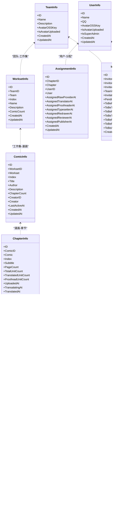

图示来源
- [internal/domain/model/user.go:7-19](file://internal/domain/model/user.go#L7-L19)
- [internal/domain/model/team.go:5-15](file://internal/domain/model/team.go#L5-L15)
- [internal/domain/model/workset.go:5-18](file://internal/domain/model/workset.go#L5-L18)
- [internal/domain/model/comic.go:5-26](file://internal/domain/model/comic.go#L5-L26)
- [internal/domain/model/chapter.go:5-35](file://internal/domain/model/chapter.go#L5-L35)
- [internal/domain/model/page.go:5-22](file://internal/domain/model/page.go#L5-L22)
- [internal/domain/model/unit.go:7-29](file://internal/domain/model/unit.go#L7-L29)
- [internal/domain/model/assignment.go:5-25](file://internal/domain/model/assignment.go#L5-L25)
- [internal/domain/model/invitation.go:63-84](file://internal/domain/model/invitation.go#L63-L84)

## 详细组件分析

### 用户实体与值对象
- UserInfo：用于领域内持久化与跨层传递，包含头像上传状态与超管标记
- UserCredentials：仅用于认证校验，不暴露完整用户信息
- UserCreation/UserUpdate：注册与更新输入，含角色掩码构造

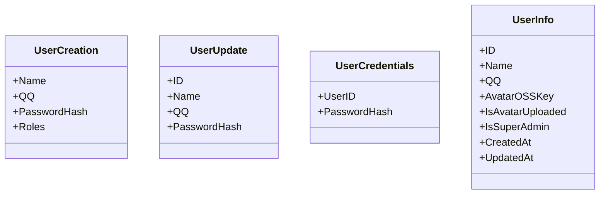

图示来源
- [internal/domain/model/user.go:44-100](file://internal/domain/model/user.go#L44-L100)

章节来源
- [internal/domain/model/user.go:1-100](file://internal/domain/model/user.go#L1-L100)

### 团队实体与值对象
- TeamInfo：团队基本信息与头像上传状态
- TeamCreation/TeamUpdate：创建与更新输入，含名称与描述校验

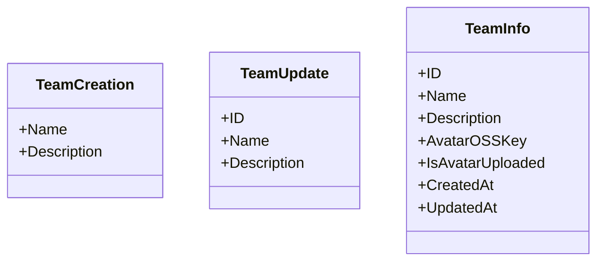

图示来源
- [internal/domain/model/team.go:37-63](file://internal/domain/model/team.go#L37-L63)

章节来源
- [internal/domain/model/team.go:1-63](file://internal/domain/model/team.go#L1-L63)

### 工作集实体与值对象
- WorksetInfo：工作集与团队关联、索引、统计与描述
- WorksetCreation/WorksetUpdate：创建与更新输入

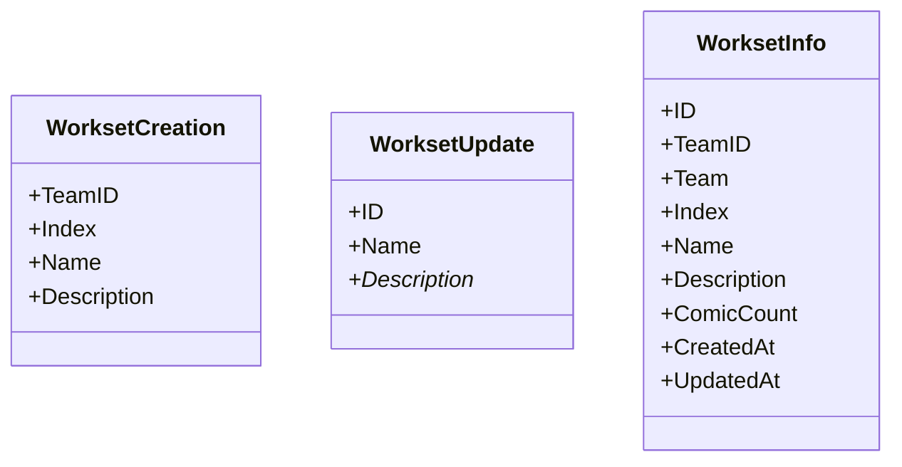

图示来源
- [internal/domain/model/workset.go:44-82](file://internal/domain/model/workset.go#L44-L82)

章节来源
- [internal/domain/model/workset.go:1-82](file://internal/domain/model/workset.go#L1-L82)

### 漫画实体与值对象
- ComicInfo：漫画元数据、章节计数、创建者与最后活跃时间
- ComicCreation/ComicUpdate：创建与更新输入

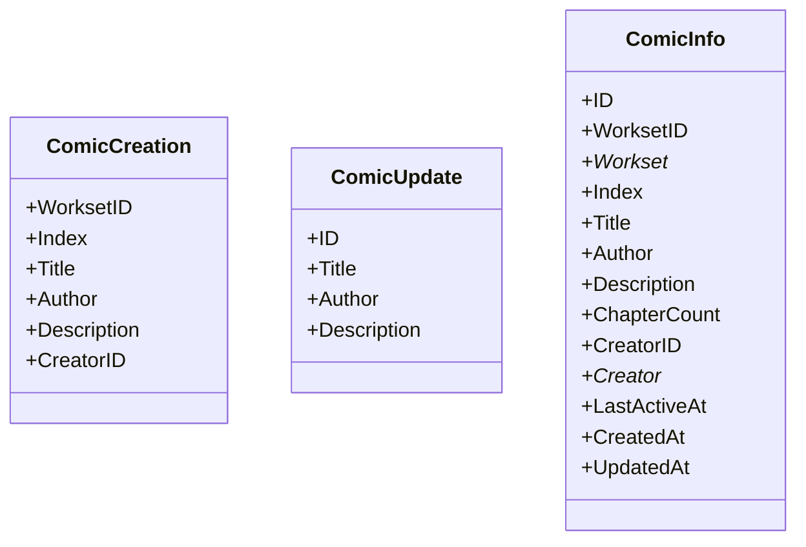

图示来源
- [internal/domain/model/comic.go:60-107](file://internal/domain/model/comic.go#L60-L107)

章节来源
- [internal/domain/model/comic.go:1-107](file://internal/domain/model/comic.go#L1-L107)

### 章节实体与值对象
- ChapterInfo：章节统计与多阶段时间戳，支持关联Comic与Creator
- ChapterStats：章节统计聚合
- ChapterCreation/ChapterUpdate：创建与更新输入，含工作流状态解析

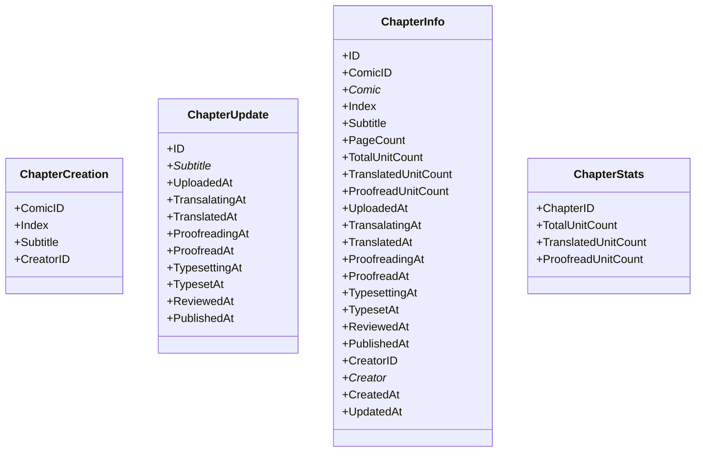

图示来源
- [internal/domain/model/chapter.go:105-260](file://internal/domain/model/chapter.go#L105-L260)

章节来源
- [internal/domain/model/chapter.go:1-260](file://internal/domain/model/chapter.go#L1-L260)

### 页面实体与值对象
- PageInfo：页面与OSS键、上传状态与单元统计
- PageStats：页面统计聚合
- PageCreation/PageUpdate：创建与更新输入

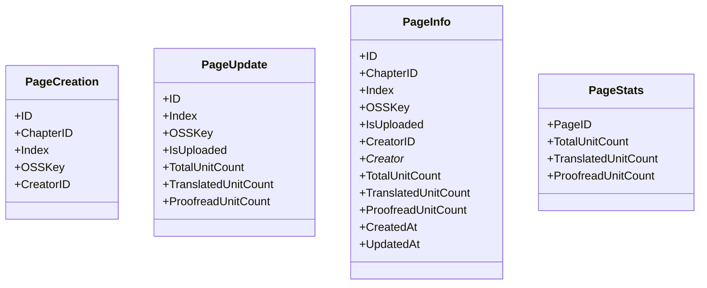

图示来源
- [internal/domain/model/page.go:76-134](file://internal/domain/model/page.go#L76-L134)

章节来源
- [internal/domain/model/page.go:1-134](file://internal/domain/model/page.go#L1-L134)

### 单元实体与值对象
- UnitInfo：单元几何与文本、翻译/校对状态与评论
- UnitPatch：细粒度补丁更新
- UnitCreation：创建输入（与UnitInfo同构）

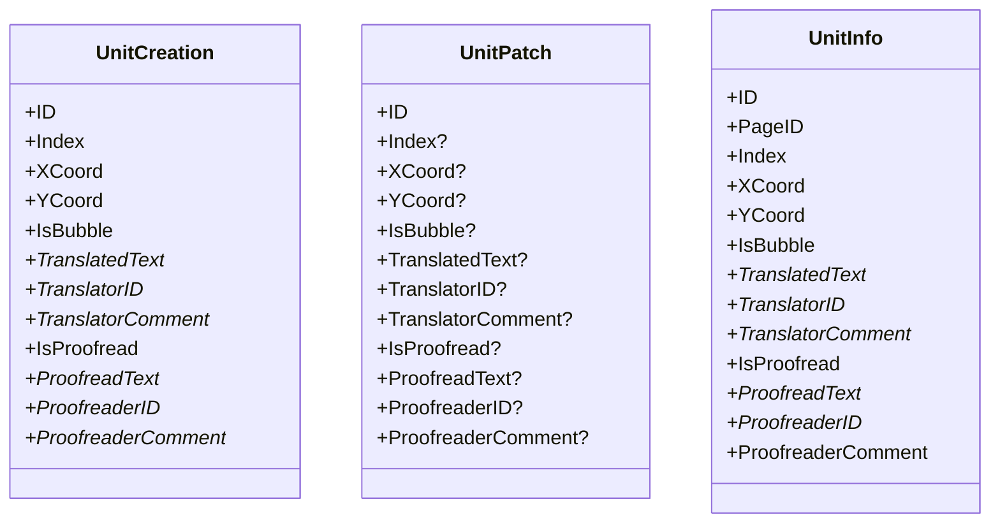

图示来源
- [internal/domain/model/unit.go:62-149](file://internal/domain/model/unit.go#L62-L149)

章节来源
- [internal/domain/model/unit.go:1-149](file://internal/domain/model/unit.go#L1-L149)

### 分配实体与值对象
- AssignmentInfo：章节-用户-角色分配，记录各角色分配时间戳
- AssignmentCreation/AssignmentUpdate：创建与更新输入，含角色掩码解析

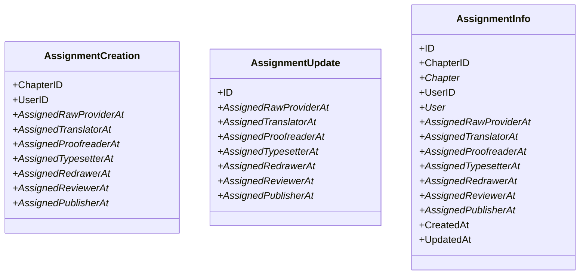

图示来源
- [internal/domain/model/assignment.go:114-190](file://internal/domain/model/assignment.go#L114-L190)

章节来源
- [internal/domain/model/assignment.go:1-190](file://internal/domain/model/assignment.go#L1-L190)

### 邀请实体与值对象
- InvitationCreation：创建输入（邀请人、目标团队、被邀请QQ、邀请码、角色标记）
- InvitationInfo：邀请记录（待处理、角色标记、创建时间）
- InvitationUpdate：更新输入（角色标记）

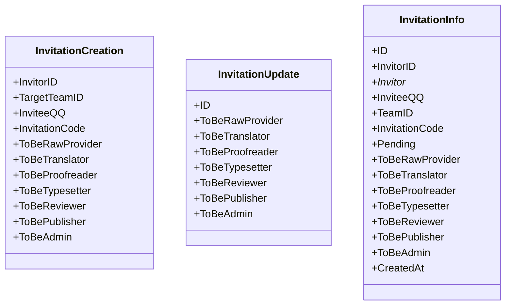

图示来源
- [internal/domain/model/invitation.go:7-158](file://internal/domain/model/invitation.go#L7-L158)

章节来源
- [internal/domain/model/invitation.go:1-158](file://internal/domain/model/invitation.go#L1-L158)

### 角色与工作流
- 角色：RoleFlag/RoleMask，支持集合构造与解包
- 工作流：Workflow/WorkflowStatus，约束状态转换合法性

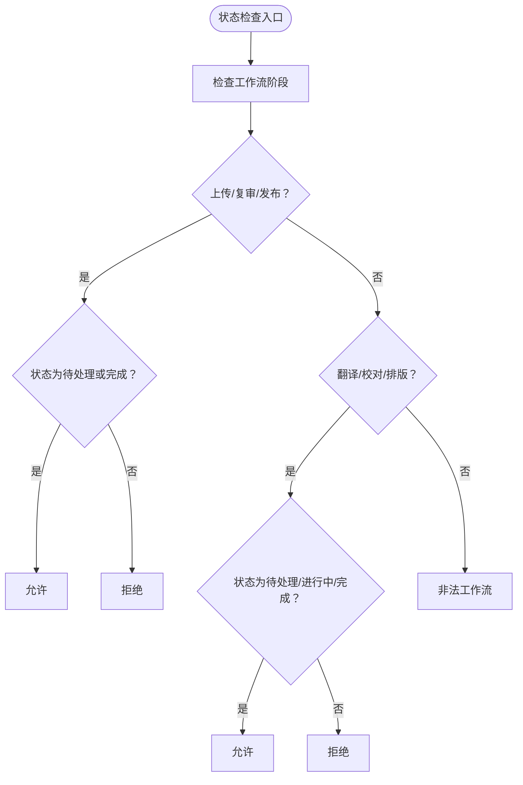

图示来源
- [internal/domain/model/workflow.go:24-36](file://internal/domain/model/workflow.go#L24-L36)

章节来源
- [internal/domain/model/role.go:1-56](file://internal/domain/model/role.go#L1-L56)
- [internal/domain/model/workflow.go:1-36](file://internal/domain/model/workflow.go#L1-L36)

### 权限服务
- 通过加载器函数（OnLoadUserInfo、OnLoadMemberInfo、OnLoadAssignmentInfo、OnLoadComicInfo、OnLoadWorksetInfo、OnLoadChapterInfo、OnLoadPageInfo）加载上下文实体，再进行权限判定
- 统一封装各类权限（邀请、用户、团队、成员、漫画、章节、分配、页面、单元、工作集等），支持超级管理员与团队管理员分级

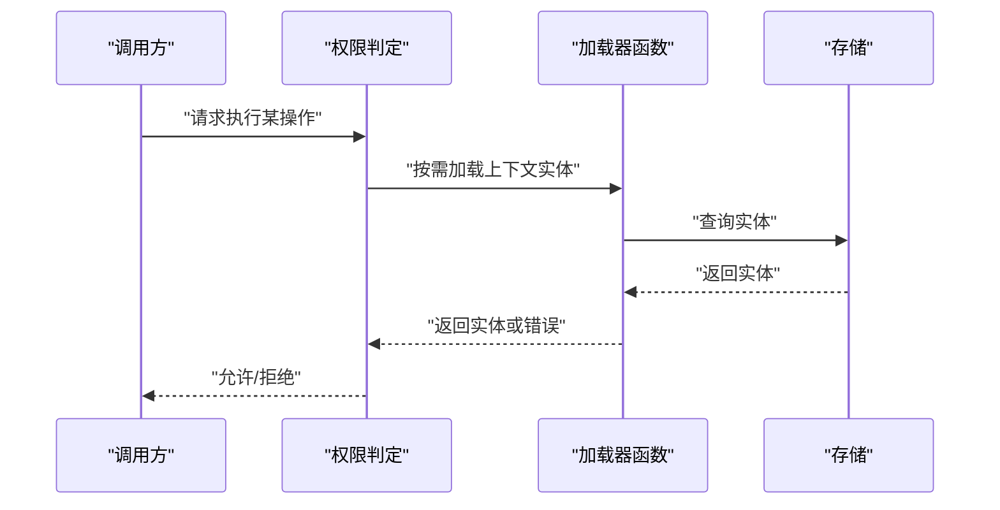

图示来源
- [internal/domain/model/permission.go:5-139](file://internal/domain/model/permission.go#L5-L139)

章节来源
- [internal/domain/model/permission.go:1-800](file://internal/domain/model/permission.go#L1-L800)

## 依赖分析
- 内聚性：各子域实体自包含，职责清晰
- 耦合性：通过外键字段与可选关联降低强耦合；权限服务通过接口注入避免直接依赖存储
- 循环依赖：未见循环导入
- 外部依赖：util.Option（用于UnitPatch的可选字段）

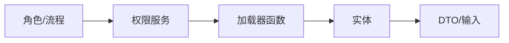

图示来源
- [internal/domain/model/role.go:1-56](file://internal/domain/model/role.go#L1-L56)
- [internal/domain/model/workflow.go:1-36](file://internal/domain/model/workflow.go#L1-L36)
- [internal/domain/model/permission.go:1-13](file://internal/domain/model/permission.go#L1-L13)
- [internal/domain/model/user.go:1-100](file://internal/domain/model/user.go#L1-L100)
- [internal/domain/model/team.go:1-63](file://internal/domain/model/team.go#L1-L63)
- [internal/domain/model/comic.go:1-107](file://internal/domain/model/comic.go#L1-L107)
- [internal/domain/model/chapter.go:1-260](file://internal/domain/model/chapter.go#L1-L260)
- [internal/domain/model/page.go:1-134](file://internal/domain/model/page.go#L1-L134)
- [internal/domain/model/unit.go:1-149](file://internal/domain/model/unit.go#L1-L149)
- [internal/domain/model/assignment.go:1-190](file://internal/domain/model/assignment.go#L1-L190)
- [internal/domain/model/invitation.go:1-158](file://internal/domain/model/invitation.go#L1-L158)

章节来源
- [internal/domain/model/role.go:1-56](file://internal/domain/model/role.go#L1-L56)
- [internal/domain/model/workflow.go:1-36](file://internal/domain/model/workflow.go#L1-L36)
- [internal/domain/model/permission.go:1-800](file://internal/domain/model/permission.go#L1-L800)

## 性能考量
- 延迟关联：实体中的关联字段（如UserInfo、TeamInfo、WorksetInfo、ComicInfo、ChapterInfo、PageInfo）在未显式include时保持nil，避免不必要的JOIN与序列化开销
- 统计字段：章节与页面提供单元统计字段，减少运行时聚合成本
- 工作流状态约束：通过IsValidWorkflowCombination限制状态组合，避免无效写入带来的回滚与重试
- 权限判定：按需加载上下文实体，避免一次性加载过多数据

## 故障排查指南
- 认证失败：确认UserCredentials中的用户ID与密码哈希匹配，且用户存在
- 权限不足：检查加载器函数返回的上下文实体与角色/分配信息，确认HasAnyRole/RoleMask判定路径
- 状态异常：检查工作流状态是否符合IsValidWorkflowCombination约束
- 数据不一致：核对ChapterInfo/PageInfo的统计字段与Unit保存逻辑是否同步更新

章节来源
- [internal/domain/model/permission.go:56-120](file://internal/domain/model/permission.go#L56-L120)
- [internal/domain/model/workflow.go:24-36](file://internal/domain/model/workflow.go#L24-L36)
- [internal/domain/model/chapter.go:151-259](file://internal/domain/model/chapter.go#L151-L259)
- [internal/domain/model/page.go:115-133](file://internal/domain/model/page.go#L115-L133)

## 结论
本领域模型围绕“用户—团队—工作集—漫画—章节—页面—单元”构建了完整的翻译协作业务闭环，通过角色与工作流机制约束状态转换，借助权限服务实现分级控制。实体采用值对象与DTO分离、延迟关联与统计字段等设计，兼顾可读性与性能。建议在应用层严格遵循不变量与事务边界，确保数据一致性与可追溯性。

## 附录
- 应用层值对象（对外展示与输入校验）
  - 用户：LoginUserArgs/RegisterUserArgs/RegisterUserResult/UserInfo/UpdateUserArgs
  - 团队：CreateTeamArgs/CreateTeamResult/TeamInfo/ReserveTeamAvatarResult/UpdateTeamArgs/ListTeamArgs/ListMyTeamArgs

章节来源
- [internal/value/user.go:8-171](file://internal/value/user.go#L8-L171)
- [internal/value/team.go:8-112](file://internal/value/team.go#L8-L112)