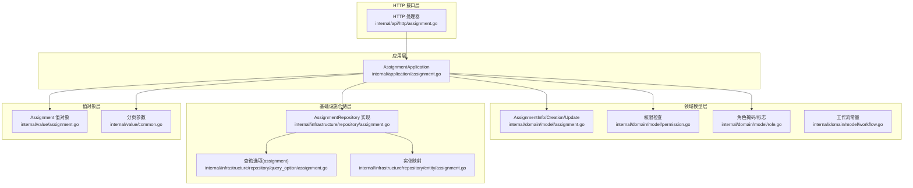
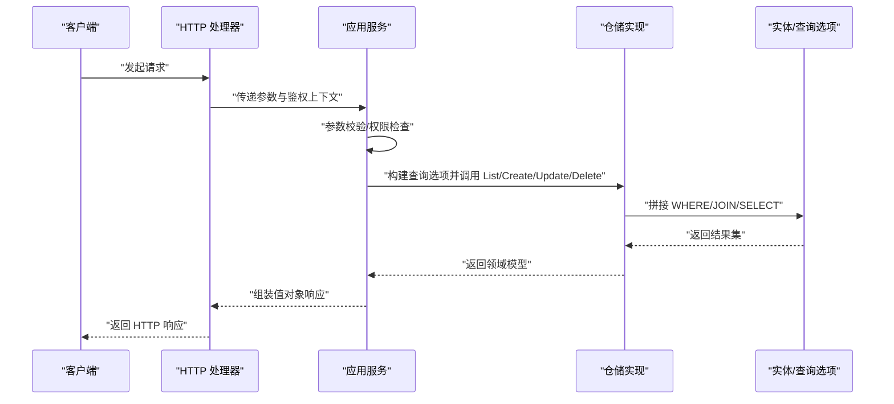
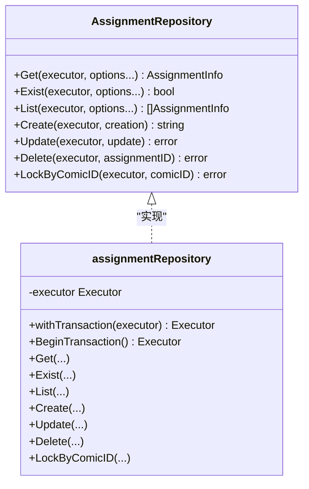
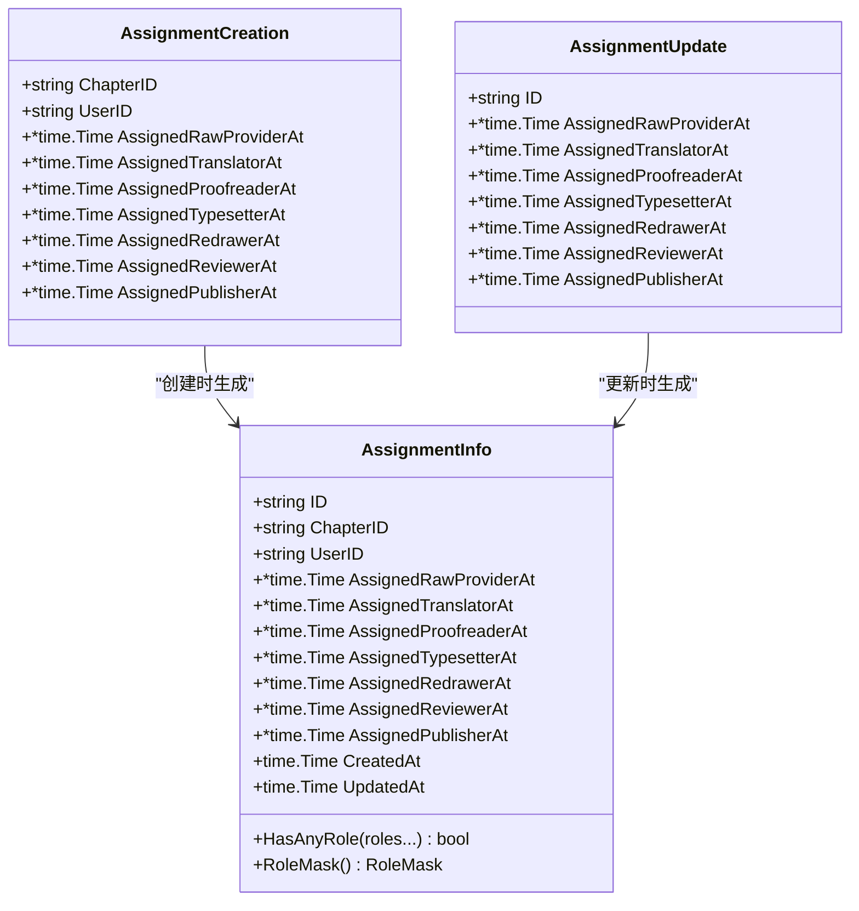
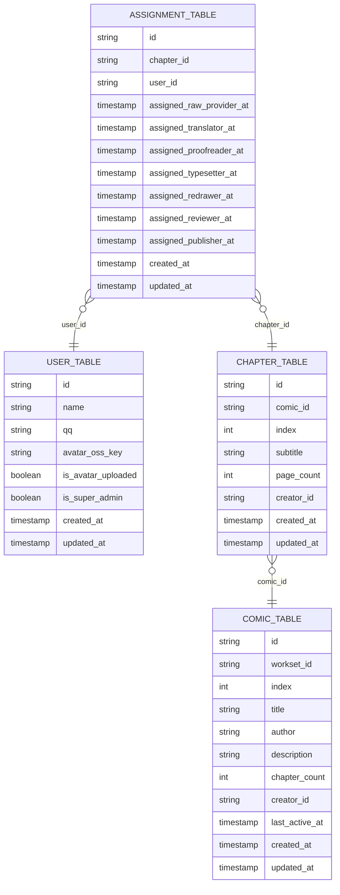
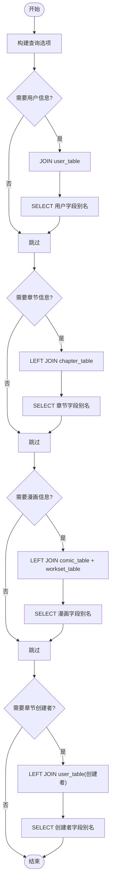
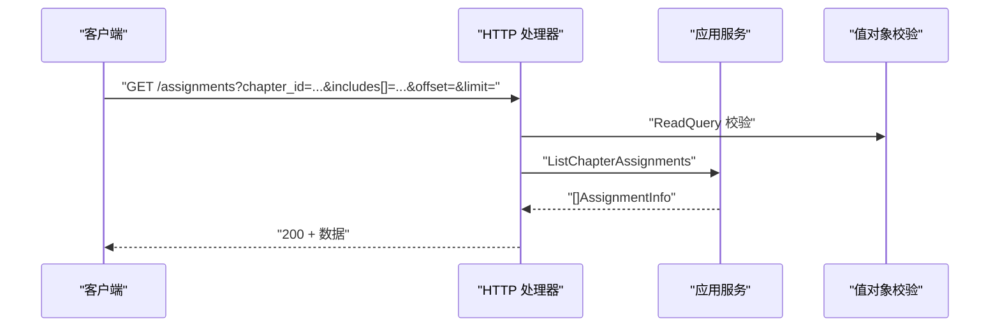
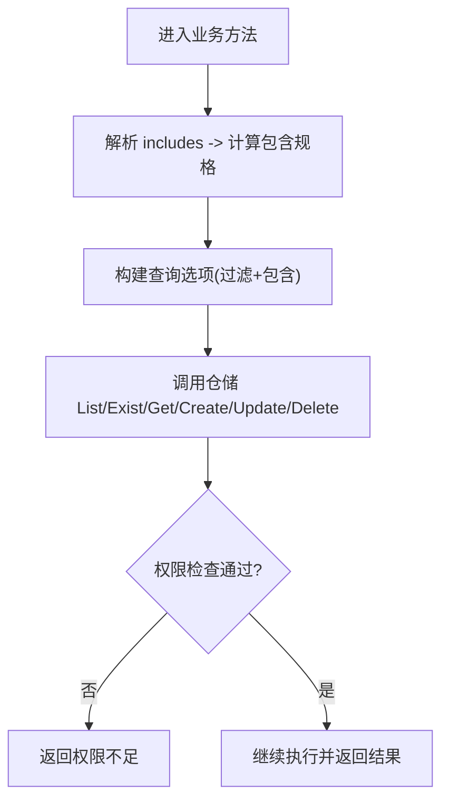
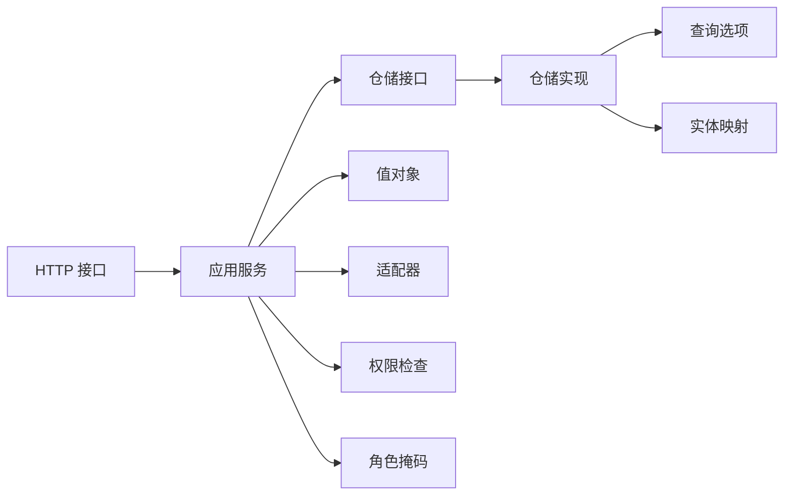

# 任务分配仓储

<cite>
**本文引用的文件**
- [internal/domain/repository/assignment.go](file://internal/domain/repository/assignment.go)
- [internal/infrastructure/repository/assignment.go](file://internal/infrastructure/repository/assignment.go)
- [internal/application/assignment.go](file://internal/application/assignment.go)
- [internal/domain/model/assignment.go](file://internal/domain/model/assignment.go)
- [internal/infrastructure/repository/entity/assignment.go](file://internal/infrastructure/repository/entity/assignment.go)
- [internal/infrastructure/repository/query_option/assignment.go](file://internal/infrastructure/repository/query_option/assignment.go)
- [internal/value/assignment.go](file://internal/value/assignment.go)
- [internal/api/http/assignment.go](file://internal/api/http/assignment.go)
- [internal/domain/service/assignment_include.go](file://internal/domain/service/assignment_include.go)
- [internal/application/adapter/loader.go](file://internal/application/adapter/loader.go)
- [internal/domain/model/permission.go](file://internal/domain/model/permission.go)
- [internal/domain/model/role.go](file://internal/domain/model/role.go)
- [internal/domain/model/workflow.go](file://internal/domain/model/workflow.go)
- [internal/value/common.go](file://internal/value/common.go)
</cite>

## 目录
1. [简介](#简介)
2. [项目结构](#项目结构)
3. [核心组件](#核心组件)
4. [架构总览](#架构总览)
5. [详细组件分析](#详细组件分析)
6. [依赖分析](#依赖分析)
7. [性能考虑](#性能考虑)
8. [故障排查指南](#故障排查指南)
9. [结论](#结论)
10. [附录](#附录)

## 简介
本文件系统性阐述“任务分配仓储”的实现与使用方法，覆盖以下方面：
- 任务分配仓储的职责边界与接口契约
- 任务列表查询、任务获取、任务创建、任务更新、任务删除的完整流程
- 任务状态流转、分配规则与进度跟踪机制
- 任务与工作集、章节、漫画、执行者之间的关系处理
- 时间管理与角色时间戳的维护策略
- 使用示例与状态管理最佳实践

## 项目结构
围绕任务分配仓储的关键代码分布在以下层次：
- 应用层：对外暴露业务能力，负责参数校验、权限检查、组装结果
- 领域模型层：定义数据结构、角色掩码、状态判断逻辑
- 基础设施仓储层：封装数据库访问、事务控制、查询拼装
- 实体层：映射数据库表结构与聚合查询结果
- 查询选项层：提供可组合的查询条件与关联包含
- 值对象层：API 输入/输出的结构化参数
- HTTP 接口层：REST API 定义与路由绑定



图表来源
- [internal/application/assignment.go:1-358](file://internal/application/assignment.go#L1-L358)
- [internal/domain/repository/assignment.go:1-15](file://internal/domain/repository/assignment.go#L1-L15)
- [internal/infrastructure/repository/assignment.go:1-143](file://internal/infrastructure/repository/assignment.go#L1-L143)
- [internal/domain/model/assignment.go:1-190](file://internal/domain/model/assignment.go#L1-L190)
- [internal/infrastructure/repository/query_option/assignment.go:1-112](file://internal/infrastructure/repository/query_option/assignment.go#L1-L112)
- [internal/infrastructure/repository/entity/assignment.go:1-191](file://internal/infrastructure/repository/entity/assignment.go#L1-L191)
- [internal/value/assignment.go:1-131](file://internal/value/assignment.go#L1-L131)
- [internal/api/http/assignment.go:1-228](file://internal/api/http/assignment.go#L1-L228)
- [internal/domain/model/permission.go:541-806](file://internal/domain/model/permission.go#L541-L806)
- [internal/domain/model/role.go:1-55](file://internal/domain/model/role.go#L1-L55)
- [internal/domain/model/workflow.go:1-36](file://internal/domain/model/workflow.go#L1-L36)
- [internal/value/common.go:1-24](file://internal/value/common.go#L1-L24)

章节来源
- [internal/application/assignment.go:1-358](file://internal/application/assignment.go#L1-L358)
- [internal/infrastructure/repository/assignment.go:1-143](file://internal/infrastructure/repository/assignment.go#L1-L143)
- [internal/domain/model/assignment.go:1-190](file://internal/domain/model/assignment.go#L1-L190)
- [internal/infrastructure/repository/query_option/assignment.go:1-112](file://internal/infrastructure/repository/query_option/assignment.go#L1-L112)
- [internal/infrastructure/repository/entity/assignment.go:1-191](file://internal/infrastructure/repository/entity/assignment.go#L1-L191)
- [internal/value/assignment.go:1-131](file://internal/value/assignment.go#L1-L131)
- [internal/api/http/assignment.go:1-228](file://internal/api/http/assignment.go#L1-L228)
- [internal/domain/model/permission.go:541-806](file://internal/domain/model/permission.go#L541-L806)
- [internal/domain/model/role.go:1-55](file://internal/domain/model/role.go#L1-L55)
- [internal/domain/model/workflow.go:1-36](file://internal/domain/model/workflow.go#L1-L36)
- [internal/value/common.go:1-24](file://internal/value/common.go#L1-L24)

## 核心组件
- 任务分配仓储接口：定义任务分配的增删改查与锁表能力
- 任务分配仓储实现：基于 GORM 执行 SQL，支持事务与查询选项
- 应用服务：封装业务规则、权限检查、分页与关联包含
- 领域模型：任务分配信息、创建与更新的数据结构，角色掩码与状态判断
- 实体映射：数据库表到结构体的映射，支持聚合查询结果
- 查询选项：按需拼接 WHERE、JOIN、SELECT 字段
- 值对象：API 输入/输出参数，包含 includes 与分页
- HTTP 接口：REST API 定义与处理器绑定

章节来源
- [internal/domain/repository/assignment.go:1-15](file://internal/domain/repository/assignment.go#L1-L15)
- [internal/infrastructure/repository/assignment.go:1-143](file://internal/infrastructure/repository/assignment.go#L1-L143)
- [internal/application/assignment.go:1-358](file://internal/application/assignment.go#L1-L358)
- [internal/domain/model/assignment.go:1-190](file://internal/domain/model/assignment.go#L1-L190)
- [internal/infrastructure/repository/entity/assignment.go:1-191](file://internal/infrastructure/repository/entity/assignment.go#L1-L191)
- [internal/infrastructure/repository/query_option/assignment.go:1-112](file://internal/infrastructure/repository/query_option/assignment.go#L1-L112)
- [internal/value/assignment.go:1-131](file://internal/value/assignment.go#L1-L131)
- [internal/api/http/assignment.go:1-228](file://internal/api/http/assignment.go#L1-L228)

## 架构总览
任务分配仓储遵循分层架构，职责清晰：
- 应用层负责业务编排与安全控制
- 领域层负责数据模型与规则
- 基础设施层负责持久化与查询拼装
- 值对象层负责 API 交互
- HTTP 层负责对外暴露接口



图表来源
- [internal/api/http/assignment.go:1-228](file://internal/api/http/assignment.go#L1-L228)
- [internal/application/assignment.go:1-358](file://internal/application/assignment.go#L1-L358)
- [internal/infrastructure/repository/assignment.go:1-143](file://internal/infrastructure/repository/assignment.go#L1-L143)
- [internal/infrastructure/repository/query_option/assignment.go:1-112](file://internal/infrastructure/repository/query_option/assignment.go#L1-L112)
- [internal/infrastructure/repository/entity/assignment.go:1-191](file://internal/infrastructure/repository/entity/assignment.go#L1-L191)

## 详细组件分析

### 任务分配仓储接口与实现
- 接口能力：获取单条、是否存在、列表查询、创建、更新、删除、按漫画 ID 锁定
- 实现要点：统一注入 Executor；支持外部传入或使用默认执行器；事务由调用方控制；查询选项通过闭包组合



图表来源
- [internal/domain/repository/assignment.go:1-15](file://internal/domain/repository/assignment.go#L1-L15)
- [internal/infrastructure/repository/assignment.go:1-143](file://internal/infrastructure/repository/assignment.go#L1-L143)

章节来源
- [internal/domain/repository/assignment.go:1-15](file://internal/domain/repository/assignment.go#L1-L15)
- [internal/infrastructure/repository/assignment.go:1-143](file://internal/infrastructure/repository/assignment.go#L1-L143)

### 应用服务：任务分配业务编排
- 列表查询：支持按章节/用户过滤、分页、关联包含（用户、章节、漫画、章节创建者）
- 我的分配：按当前用户过滤
- 创建分配：校验参数、权限检查（需 reviewer 角色）、去重检查、构造创建参数并写入
- 更新分配：采用 PUT 语义，保留已有角色时间戳，新增角色写入当前时间，移除角色置空
- 删除分配：权限检查后删除

```mermaid
sequenceDiagram
participant U as "调用方"
participant APP as "AssignmentApplication"
participant REP as "AssignmentRepository"
participant OPT as "查询选项"
participant ASMB as "装配器"
U->>APP : "ListChapterAssignments(args)"
APP->>OPT : "构建过滤与包含选项"
APP->>REP : "List(options...)"
REP-->>APP : "[]AssignmentInfo"
APP->>ASMB : "组装值对象"
APP-->>U : "[]AssignmentInfo"
```

图表来源
- [internal/application/assignment.go:92-157](file://internal/application/assignment.go#L92-L157)
- [internal/infrastructure/repository/assignment.go:61-80](file://internal/infrastructure/repository/assignment.go#L61-L80)
- [internal/infrastructure/repository/query_option/assignment.go:15-101](file://internal/infrastructure/repository/query_option/assignment.go#L15-L101)
- [internal/infrastructure/repository/entity/assignment.go:110-190](file://internal/infrastructure/repository/entity/assignment.go#L110-L190)

章节来源
- [internal/application/assignment.go:92-157](file://internal/application/assignment.go#L92-L157)
- [internal/application/assignment.go:159-212](file://internal/application/assignment.go#L159-L212)
- [internal/application/assignment.go:214-265](file://internal/application/assignment.go#L214-L265)
- [internal/application/assignment.go:267-315](file://internal/application/assignment.go#L267-L315)
- [internal/application/assignment.go:317-357](file://internal/application/assignment.go#L317-L357)

### 领域模型：任务分配数据结构与规则
- AssignmentInfo：包含章节、用户、各角色分配时间戳、创建/更新时间
- AssignmentCreation：创建时根据角色掩码生成对应时间戳
- AssignmentUpdate：PUT 语义，保留已有时间戳，新增角色写当前时间，移除角色置空
- 角色掩码与标志：支持 RawProvider、Translator、Proofreader、Typesetter、Reviewer、Publisher、Admin
- HasAnyRole/RoleMask：用于快速判断角色集合与掩码转换



图表来源
- [internal/domain/model/assignment.go:1-190](file://internal/domain/model/assignment.go#L1-L190)
- [internal/domain/model/role.go:1-55](file://internal/domain/model/role.go#L1-L55)

章节来源
- [internal/domain/model/assignment.go:1-190](file://internal/domain/model/assignment.go#L1-L190)
- [internal/domain/model/role.go:1-55](file://internal/domain/model/role.go#L1-L55)

### 实体映射与聚合查询
- AssignmentInfoRow：映射 assignment_table 的基础字段
- AssignmentIncludeRow：聚合用户、章节、漫画、章节创建者信息
- ToAssignmentInfo/ToAssignmentInfoFromIncludeRow：将数据库行转换为领域模型，按时间字段零值判断是否包含关联



图表来源
- [internal/infrastructure/repository/entity/assignment.go:9-191](file://internal/infrastructure/repository/entity/assignment.go#L9-L191)

章节来源
- [internal/infrastructure/repository/entity/assignment.go:1-191](file://internal/infrastructure/repository/entity/assignment.go#L1-L191)

### 查询选项与关联包含
- FilterByChapterID/FilterByUserID：按章节或用户过滤
- IncludeRelationInfo：按需 JOIN 并 SELECT 用户、章节、漫画、章节创建者字段
- IncludeUserInfo/IncludeChapterInfo：便捷方法



图表来源
- [internal/infrastructure/repository/query_option/assignment.go:15-112](file://internal/infrastructure/repository/query_option/assignment.go#L15-L112)

章节来源
- [internal/infrastructure/repository/query_option/assignment.go:1-112](file://internal/infrastructure/repository/query_option/assignment.go#L1-L112)

### 值对象与 API
- AssignmentInfo：对外输出结构，包含时间戳转为 Unix 秒
- ListAssignmentArgs/UpdateAssignmentArgs/CreateChapterAssignmentArgs：输入参数与校验
- 分页参数 PaginationParams：offset 与 limit 校验
- HTTP 接口：列出章节分配、列出我的分配、创建分配、更新分配、删除分配



图表来源
- [internal/api/http/assignment.go:25-52](file://internal/api/http/assignment.go#L25-L52)
- [internal/value/assignment.go:33-55](file://internal/value/assignment.go#L33-L55)
- [internal/value/common.go:5-23](file://internal/value/common.go#L5-L23)

章节来源
- [internal/value/assignment.go:1-131](file://internal/value/assignment.go#L1-L131)
- [internal/api/http/assignment.go:1-228](file://internal/api/http/assignment.go#L1-L228)
- [internal/value/common.go:1-24](file://internal/value/common.go#L1-L24)

### 权限检查与适配器
- 权限检查：列表、创建、更新、删除分别针对不同角色（Reviewer）进行校验
- 适配器：封装加载章节、漫画、工作集、成员、分配信息的回调



图表来源
- [internal/application/assignment.go:92-157](file://internal/application/assignment.go#L92-L157)
- [internal/application/adapter/loader.go:1-71](file://internal/application/adapter/loader.go#L1-L71)
- [internal/domain/model/permission.go:541-806](file://internal/domain/model/permission.go#L541-L806)

章节来源
- [internal/application/adapter/loader.go:1-71](file://internal/application/adapter/loader.go#L1-L71)
- [internal/domain/model/permission.go:541-806](file://internal/domain/model/permission.go#L541-L806)

### 任务状态流转、分配规则与进度跟踪
- 角色分配：创建时根据角色掩码设置对应时间戳；更新时采用 PUT 语义，保留已有时间戳
- 角色移除：更新时将不再包含的角色时间戳置空
- 进度跟踪：通过各角色时间戳的存在与否判断角色状态；HasAnyRole/RoleMask 提供快速判断
- 工作流常量：提供上传、翻译、校对、排版、审核、发布等阶段的状态约束（用于其他模块）

章节来源
- [internal/domain/model/assignment.go:57-111](file://internal/domain/model/assignment.go#L57-L111)
- [internal/domain/model/assignment.go:127-189](file://internal/domain/model/assignment.go#L127-L189)
- [internal/domain/model/workflow.go:1-36](file://internal/domain/model/workflow.go#L1-L36)

### 任务与工作集、章节、漫画、执行者的关系处理
- 关系处理：通过查询选项动态 JOIN 用户、章节、漫画、章节创建者，并在实体映射中按零值判断是否包含
- 工作集：章节属于漫画，漫画属于工作集，可通过关联查询获取层级信息
- 执行者：通过用户表关联，支持头像 OSS Key 等扩展字段

章节来源
- [internal/infrastructure/repository/query_option/assignment.go:27-101](file://internal/infrastructure/repository/query_option/assignment.go#L27-L101)
- [internal/infrastructure/repository/entity/assignment.go:65-190](file://internal/infrastructure/repository/entity/assignment.go#L65-L190)

### 时间管理与角色时间戳维护
- 创建：根据角色掩码生成当前时间戳
- 更新：保留已有时间戳，新增角色写入当前时间，移除角色置空
- 查询：通过时间戳存在性判断角色状态，避免误判

章节来源
- [internal/domain/model/assignment.go:127-189](file://internal/domain/model/assignment.go#L127-L189)

### 使用示例与最佳实践
- 列出章节分配
  - 步骤：校验参数（包含 includes、分页）、权限检查、构建查询选项（按需包含用户/章节/漫画/创建者）、调用仓储 List、装配值对象
  - 参考路径：[internal/application/assignment.go:92-157](file://internal/application/assignment.go#L92-L157)
- 列出我的分配
  - 步骤：校验参数、权限检查、按当前用户过滤、分页、调用仓储 List、装配值对象
  - 参考路径：[internal/application/assignment.go:159-212](file://internal/application/assignment.go#L159-L212)
- 创建章节分配
  - 步骤：校验参数、权限检查（Reviewer）、去重检查、构造 AssignmentCreation、调用仓储 Create
  - 参考路径：[internal/application/assignment.go:214-265](file://internal/application/assignment.go#L214-L265)
- 更新分配
  - 步骤：先加载目标分配获取 ChapterID、权限检查（Reviewer）、构造 AssignmentUpdate（PUT 语义）、调用仓储 Update
  - 参考路径：[internal/application/assignment.go:267-315](file://internal/application/assignment.go#L267-L315)
- 删除分配
  - 步骤：先加载目标分配获取 ChapterID、权限检查（Reviewer）、调用仓储 Delete
  - 参考路径：[internal/application/assignment.go:317-357](file://internal/application/assignment.go#L317-L357)

最佳实践
- 统一使用查询选项组合 WHERE/JOIN/SELECT，避免硬编码 SQL
- 更新采用 PUT 语义，确保角色变更的幂等性
- 权限检查前置，减少无效数据库访问
- 分页参数严格校验，防止越界与性能问题
- 关联包含按需开启，避免不必要的 JOIN 与字段选择

## 依赖分析
- 应用服务依赖仓储接口与适配器，解耦具体实现
- 仓储实现依赖查询选项与实体映射，保证可测试性
- 值对象与 HTTP 层负责输入输出，保持接口稳定
- 权限检查与角色掩码位于领域层，确保业务规则内聚



图表来源
- [internal/api/http/assignment.go:1-228](file://internal/api/http/assignment.go#L1-L228)
- [internal/application/assignment.go:1-358](file://internal/application/assignment.go#L1-L358)
- [internal/domain/repository/assignment.go:1-15](file://internal/domain/repository/assignment.go#L1-L15)
- [internal/infrastructure/repository/assignment.go:1-143](file://internal/infrastructure/repository/assignment.go#L1-L143)
- [internal/infrastructure/repository/query_option/assignment.go:1-112](file://internal/infrastructure/repository/query_option/assignment.go#L1-L112)
- [internal/infrastructure/repository/entity/assignment.go:1-191](file://internal/infrastructure/repository/entity/assignment.go#L1-L191)
- [internal/application/adapter/loader.go:1-71](file://internal/application/adapter/loader.go#L1-L71)
- [internal/domain/model/permission.go:541-806](file://internal/domain/model/permission.go#L541-L806)
- [internal/domain/model/role.go:1-55](file://internal/domain/model/role.go#L1-L55)

章节来源
- [internal/application/assignment.go:1-358](file://internal/application/assignment.go#L1-L358)
- [internal/infrastructure/repository/assignment.go:1-143](file://internal/infrastructure/repository/assignment.go#L1-L143)
- [internal/domain/repository/assignment.go:1-15](file://internal/domain/repository/assignment.go#L1-L15)

## 性能考虑
- 查询选项按需组合，避免不必要的 JOIN 与字段选择
- 分页参数限制 offset 与 limit，防止大偏移导致的性能问题
- 聚合查询通过 IncludeRelationInfo 动态拼接，减少冗余字段传输
- 事务由调用方控制，建议在批量操作时复用同一执行器以降低连接开销

## 故障排查指南
- 参数校验失败：检查 includes、分页参数、角色掩码是否为空或非法
- 权限不足：确认当前用户在目标章节是否具备 Reviewer 角色
- 分配重复：创建前进行 Exist 检查，避免重复记录
- 更新失败：确认目标分配存在且权限检查通过
- 删除失败：确认目标分配存在且权限检查通过

章节来源
- [internal/application/assignment.go:92-157](file://internal/application/assignment.go#L92-L157)
- [internal/application/assignment.go:159-212](file://internal/application/assignment.go#L159-L212)
- [internal/application/assignment.go:214-265](file://internal/application/assignment.go#L214-L265)
- [internal/application/assignment.go:267-315](file://internal/application/assignment.go#L267-L315)
- [internal/application/assignment.go:317-357](file://internal/application/assignment.go#L317-L357)
- [internal/value/assignment.go:45-81](file://internal/value/assignment.go#L45-L81)
- [internal/value/assignment.go:93-107](file://internal/value/assignment.go#L93-L107)
- [internal/value/assignment.go:116-130](file://internal/value/assignment.go#L116-L130)
- [internal/value/common.go:10-23](file://internal/value/common.go#L10-L23)

## 结论
任务分配仓储通过清晰的分层设计与可组合的查询选项，实现了灵活的任务分配管理能力。应用服务负责业务规则与权限控制，仓储实现负责数据持久化与事务管理，领域模型与值对象确保了数据结构的一致性与 API 的稳定性。结合角色掩码与时间戳机制，系统能够准确跟踪任务状态与进度，并通过适配器与权限检查保障安全性。

## 附录
- 常用查询选项
  - FilterByChapterID：按章节过滤
  - FilterByUserID：按用户过滤
  - IncludeRelationInfo：按需包含用户、章节、漫画、章节创建者
- 常用值对象
  - ListAssignmentArgs：我的分配列表参数
  - ListChapterAssignmentArgs：章节分配列表参数
  - CreateChapterAssignmentArgs：创建分配参数
  - UpdateAssignmentArgs：更新分配参数
- HTTP 接口
  - GET /assignments：列出章节分配
  - GET /assignments/mine：列出我的分配
  - POST /assignments：创建分配
  - PUT /assignments/{assignment_id}：更新分配
  - DELETE /assignments/{assignment_id}：删除分配