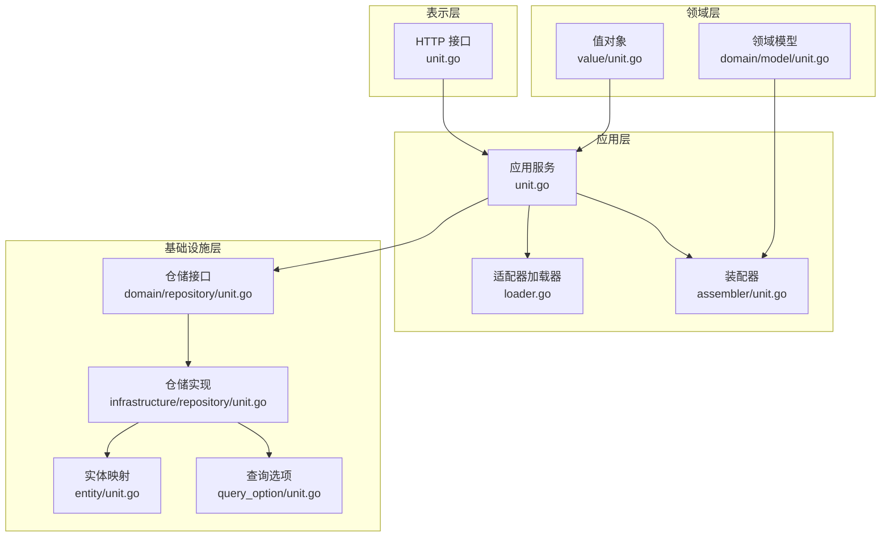
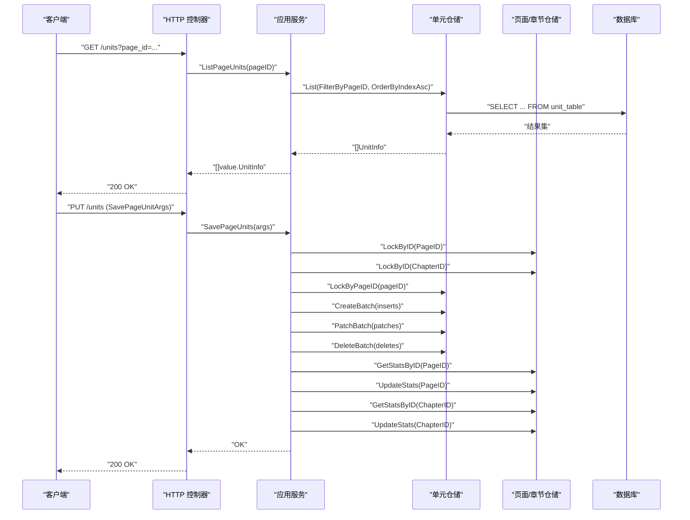
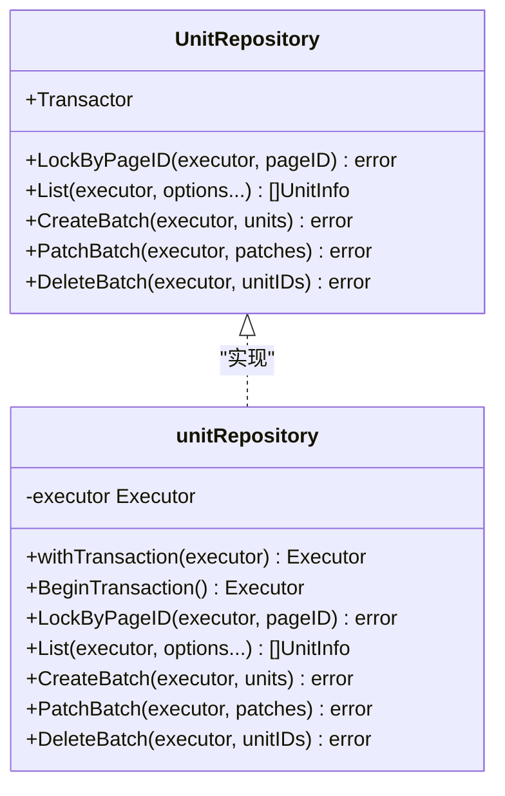
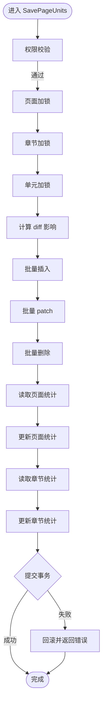
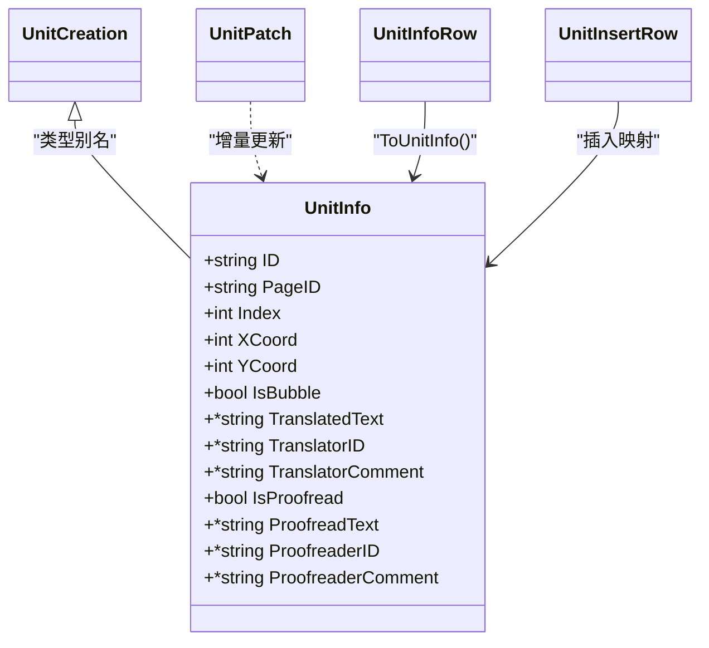
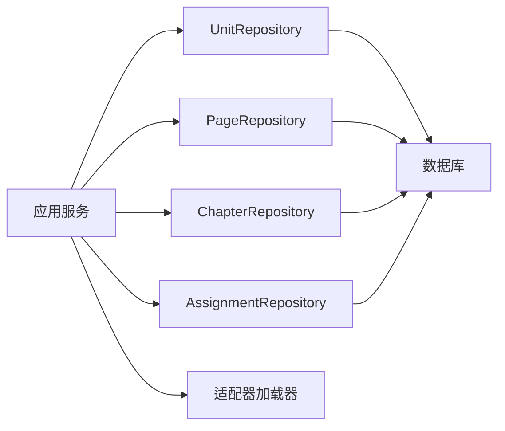

# 单元仓储

<cite>
**本文引用的文件**
- [internal/domain/repository/unit.go](file://internal/domain/repository/unit.go)
- [internal/infrastructure/repository/unit.go](file://internal/infrastructure/repository/unit.go)
- [internal/application/unit.go](file://internal/application/unit.go)
- [internal/domain/model/unit.go](file://internal/domain/model/unit.go)
- [internal/infrastructure/repository/entity/unit.go](file://internal/infrastructure/repository/entity/unit.go)
- [internal/infrastructure/repository/query_option/unit.go](file://internal/infrastructure/repository/query_option/unit.go)
- [internal/application/assembler/unit.go](file://internal/application/assembler/unit.go)
- [internal/value/unit.go](file://internal/value/unit.go)
- [internal/api/http/unit.go](file://internal/api/http/unit.go)
- [internal/application/adapter/loader.go](file://internal/application/adapter/loader.go)
- [internal/domain/model/permission.go](file://internal/domain/model/permission.go)
- [internal/domain/model/assignment.go](file://internal/domain/model/assignment.go)
- [internal/domain/model/workflow.go](file://internal/domain/model/workflow.go)
</cite>

## 目录
1. [简介](#简介)
2. [项目结构](#项目结构)
3. [核心组件](#核心组件)
4. [架构总览](#架构总览)
5. [详细组件分析](#详细组件分析)
6. [依赖分析](#依赖分析)
7. [性能考虑](#性能考虑)
8. [故障排查指南](#故障排查指南)
9. [结论](#结论)
10. [附录](#附录)

## 简介
本文件系统性阐述“单元仓储”的设计与实现，覆盖以下方面：
- 单元列表查询、单元获取、单元创建、单元更新、单元删除等核心操作
- 单元与任务（分工）的关联关系、工作流集成与状态管理
- 单元任务分配、进度跟踪与质量控制机制
- 使用示例与工作流管理最佳实践

“单元”是页面上的最小可翻译/校对片段，通常对应图像中的气泡区域。系统围绕“页面”组织单元，提供以 diff 语义批量保存的能力，并在事务内同步更新页面与章节的统计字段，确保数据一致性。

## 项目结构
单元仓储位于分层架构的基础设施层，向上被应用层调用；应用层负责权限校验、事务编排与统计更新；HTTP 层提供对外接口；模型与值对象定义数据结构；装配器负责领域模型与值对象之间的转换。

**图表来源**
- [internal/api/http/unit.go:1-91](file://internal/api/http/unit.go#L1-L91)
- [internal/application/unit.go:1-416](file://internal/application/unit.go#L1-L416)
- [internal/application/adapter/loader.go:1-71](file://internal/application/adapter/loader.go#L1-L71)
- [internal/application/assembler/unit.go:1-26](file://internal/application/assembler/unit.go#L1-L26)
- [internal/domain/repository/unit.go:1-16](file://internal/domain/repository/unit.go#L1-L16)
- [internal/infrastructure/repository/unit.go:1-179](file://internal/infrastructure/repository/unit.go#L1-L179)
- [internal/infrastructure/repository/entity/unit.go:1-83](file://internal/infrastructure/repository/entity/unit.go#L1-L83)
- [internal/infrastructure/repository/query_option/unit.go:1-22](file://internal/infrastructure/repository/query_option/unit.go#L1-L22)
- [internal/domain/model/unit.go:1-149](file://internal/domain/model/unit.go#L1-L149)
- [internal/value/unit.go:1-59](file://internal/value/unit.go#L1-L59)

**章节来源**
- [internal/api/http/unit.go:1-91](file://internal/api/http/unit.go#L1-L91)
- [internal/application/unit.go:1-416](file://internal/application/unit.go#L1-L416)
- [internal/domain/repository/unit.go:1-16](file://internal/domain/repository/unit.go#L1-L16)
- [internal/infrastructure/repository/unit.go:1-179](file://internal/infrastructure/repository/unit.go#L1-L179)

## 核心组件
- 仓储接口：定义单元的查询、批量创建、批量更新、批量删除与悲观锁能力
- 仓储实现：基于 GORM 实现具体 CRUD 与事务控制
- 应用服务：封装权限校验、事务与统计更新，暴露 ListPageUnits 与 SavePageUnits
- 领域模型与值对象：描述单元的数据结构与 diff 参数结构
- 实体映射：数据库行与领域模型之间的转换
- 查询选项：构建过滤与排序条件
- 装配器：领域模型与值对象之间的转换
- HTTP 接口：对外暴露 GET /units 与 PUT /units

**章节来源**
- [internal/domain/repository/unit.go:5-15](file://internal/domain/repository/unit.go#L5-L15)
- [internal/infrastructure/repository/unit.go:12-179](file://internal/infrastructure/repository/unit.go#L12-L179)
- [internal/application/unit.go:18-79](file://internal/application/unit.go#L18-L79)
- [internal/domain/model/unit.go:7-149](file://internal/domain/model/unit.go#L7-L149)
- [internal/infrastructure/repository/entity/unit.go:14-83](file://internal/infrastructure/repository/entity/unit.go#L14-L83)
- [internal/infrastructure/repository/query_option/unit.go:5-22](file://internal/infrastructure/repository/query_option/unit.go#L5-L22)
- [internal/application/assembler/unit.go:8-26](file://internal/application/assembler/unit.go#L8-L26)
- [internal/value/unit.go:5-59](file://internal/value/unit.go#L5-L59)
- [internal/api/http/unit.go:22-91](file://internal/api/http/unit.go#L22-L91)

## 架构总览
单元仓储遵循整洁架构分层，职责清晰：
- 表示层：HTTP 控制器负责参数解析与响应封装
- 应用层：业务编排、权限校验、事务与统计更新
- 领域层：模型与规则定义
- 基础设施层：持久化与查询构造

**图表来源**
- [internal/api/http/unit.go:22-91](file://internal/api/http/unit.go#L22-L91)
- [internal/application/unit.go:81-415](file://internal/application/unit.go#L81-L415)
- [internal/infrastructure/repository/unit.go:32-178](file://internal/infrastructure/repository/unit.go#L32-L178)

## 详细组件分析

### 仓储接口与实现
- 接口能力
  - LockByPageID：对指定页面的单元行加悲观锁，防止并发冲突
  - List：支持传入多个 QueryOption 进行过滤与排序
  - CreateBatch：批量插入单元
  - PatchBatch：批量 patch 更新，未命中不报错，满足协作场景幂等
  - DeleteBatch：批量删除，未命中不报错
- 实现要点
  - withTransaction：优先使用外部传入的执行器，否则使用默认执行器
  - LockByPageID：使用 GORM 锁定当前页所有单元行
  - List：遍历 QueryOption 组合条件，最终映射为 model.UnitInfo
  - CreateBatch：将 value.UnitCreation 转换为实体插入
  - PatchBatch：逐条构建更新映射，仅更新 Some 字段
  - DeleteBatch：IN 条件批量删除

**图表来源**
- [internal/domain/repository/unit.go:5-15](file://internal/domain/repository/unit.go#L5-L15)
- [internal/infrastructure/repository/unit.go:12-179](file://internal/infrastructure/repository/unit.go#L12-L179)

**章节来源**
- [internal/domain/repository/unit.go:5-15](file://internal/domain/repository/unit.go#L5-L15)
- [internal/infrastructure/repository/unit.go:20-179](file://internal/infrastructure/repository/unit.go#L20-L179)

### 应用服务：列表与保存
- ListPageUnits
  - 权限：仅译者/校对者可查看
  - 查询：按 page_id 过滤并按 index 升序
  - 装配：将 model.UnitInfo 转为 value.UnitInfo 返回
- SavePageUnits
  - 权限：仅译者/校对者可保存
  - 并发控制：页面、章节、单元三重悲观锁
  - diff 计算：统计插入/更新/删除对总数、已翻译数、已校对数的影响
  - 事务：统一提交，失败回滚
  - 统计：页面与章节统计字段原子更新，保证非负

**图表来源**
- [internal/application/unit.go:125-415](file://internal/application/unit.go#L125-L415)

**章节来源**
- [internal/application/unit.go:81-123](file://internal/application/unit.go#L81-L123)
- [internal/application/unit.go:125-415](file://internal/application/unit.go#L125-L415)

### 数据模型与值对象
- 领域模型 UnitInfo/UnitCreation/UnitPatch
  - 字段覆盖坐标、气泡标记、译文/校对文本、译者/校对者 ID 与评论
  - UnitCreation 与 UnitInfo 同构，采用类型别名避免冗余
- 值对象 value.UnitInfo/UnitPatch/UnitDiff/SavePageUnitArgs
  - UnitDiff 支持 insert/pach/delete 三类变更
  - SavePageUnitArgs 包含 page_id 与 diff
- 实体映射 entity.UnitInfoRow/UnitInsertRow
  - 映射数据库列，含坐标浮点与布尔字段
  - 提供 ToUnitInfo 转换函数

**图表来源**
- [internal/domain/model/unit.go:7-149](file://internal/domain/model/unit.go#L7-L149)
- [internal/infrastructure/repository/entity/unit.go:14-83](file://internal/infrastructure/repository/entity/unit.go#L14-L83)
- [internal/value/unit.go:5-59](file://internal/value/unit.go#L5-L59)

**章节来源**
- [internal/domain/model/unit.go:7-149](file://internal/domain/model/unit.go#L7-L149)
- [internal/infrastructure/repository/entity/unit.go:14-83](file://internal/infrastructure/repository/entity/unit.go#L14-L83)
- [internal/value/unit.go:5-59](file://internal/value/unit.go#L5-L59)

### 查询选项与装配器
- 查询选项
  - FilterByPageID：按 page_id 过滤
  - OrderByIndexAsc：按 index 升序
- 装配器
  - AssembleUnitInfo：将 model.UnitInfo 转为 value.UnitInfo

**章节来源**
- [internal/infrastructure/repository/query_option/unit.go:11-21](file://internal/infrastructure/repository/query_option/unit.go#L11-L21)
- [internal/application/assembler/unit.go:8-26](file://internal/application/assembler/unit.go#L8-L26)

### HTTP 接口
- GET /units?page_id：返回指定页面的单元列表（按 index 升序），空列表返回 null
- PUT /units：接收 SavePageUnitArgs，执行 diff 保存并同步更新页面/章节统计

**章节来源**
- [internal/api/http/unit.go:10-91](file://internal/api/http/unit.go#L10-L91)

## 依赖分析
- 应用层依赖
  - 读取：UnitRepository、PageRepository、ChapterRepository、AssignmentRepository
  - 写入：UnitRepository、PageRepository、ChapterRepository
- 权限链路
  - 通过适配器加载 AssignmentInfo，结合角色判定是否允许列表/保存
- 事务边界
  - SavePageUnits 在单事务内完成加锁、增删改与统计更新

**图表来源**
- [internal/application/unit.go:37-79](file://internal/application/unit.go#L37-L79)
- [internal/application/adapter/loader.go:44-52](file://internal/application/adapter/loader.go#L44-L52)

**章节来源**
- [internal/application/unit.go:37-79](file://internal/application/unit.go#L37-L79)
- [internal/application/adapter/loader.go:1-71](file://internal/application/adapter/loader.go#L1-L71)

## 性能考虑
- 批量操作
  - CreateBatch/PatchBatch/DeleteBatch 降低往返次数，提升吞吐
- 悲观锁
  - LockByPageID 与页面/章节加锁避免并发写冲突，但需控制事务时长
- 查询优化
  - 使用 FilterByPageID 与 OrderByIndexAsc，配合数据库索引
- 统计更新
  - diff 计算在内存完成，减少多次统计查询

[本节为通用建议，无需特定文件引用]

## 故障排查指南
- 权限不足
  - 现象：返回 403
  - 排查：确认 AssignmentInfo 是否包含译者或校对角色
- 事务失败
  - 现象：保存失败并回滚
  - 排查：检查加锁顺序、影响的单元 ID 是否存在、统计字段是否出现负值
- 统计字段异常
  - 现象：统计字段出现负值
  - 排查：核对 diff 计算逻辑与删除/更新前的现有状态

**章节来源**
- [internal/application/unit.go:140-150](file://internal/application/unit.go#L140-L150)
- [internal/application/unit.go:218-235](file://internal/application/unit.go#L218-L235)
- [internal/application/unit.go:362-370](file://internal/application/unit.go#L362-L370)
- [internal/application/unit.go:390-398](file://internal/application/unit.go#L390-L398)

## 结论
单元仓储以清晰的分层与严格的事务边界，提供了高可靠性的单元管理能力。通过 diff 语义与统计联动，系统在保障并发安全的同时实现了高效的批量编辑与进度质量控制。结合任务分工与工作流状态，可进一步完善从上传、翻译、校对到排版、审核与发布的全流程管理。

[本节为总结，无需特定文件引用]

## 附录

### 单元与任务的关联关系
- 角色驱动权限
  - 列表：译者/校对者
  - 保存：译者/校对者
- 适配器加载 AssignmentInfo，结合 HasAnyRole 判定
- 工作流状态
  - 支持 uploading/translating/proofreading/typesetting/reviewing/publishing
  - 状态枚举与组合有效性校验

**章节来源**
- [internal/domain/model/permission.go:734-794](file://internal/domain/model/permission.go#L734-L794)
- [internal/application/adapter/loader.go:44-52](file://internal/application/adapter/loader.go#L44-L52)
- [internal/domain/model/assignment.go:57-111](file://internal/domain/model/assignment.go#L57-L111)
- [internal/domain/model/workflow.go:14-36](file://internal/domain/model/workflow.go#L14-L36)

### 使用示例与最佳实践
- 列出页面单元
  - 请求：GET /units?page_id={pageID}
  - 响应：按 index 升序的单元列表
- 保存页面单元（diff）
  - 请求体：SavePageUnitArgs（包含 page_id 与 unit_diff）
  - 流程：应用层加锁 → 执行批量插入/更新/删除 → 更新页面/章节统计 → 提交事务
- 最佳实践
  - 严格控制事务时长，避免长时间持有锁
  - 使用 Option 类型表达可选更新，确保只更新必要的字段
  - 在前端合并 diff 后再发送，减少网络往返
  - 对于大规模批量操作，分批提交并监控统计字段一致性

**章节来源**
- [internal/api/http/unit.go:22-91](file://internal/api/http/unit.go#L22-L91)
- [internal/application/unit.go:125-415](file://internal/application/unit.go#L125-L415)
- [internal/value/unit.go:49-59](file://internal/value/unit.go#L49-L59)