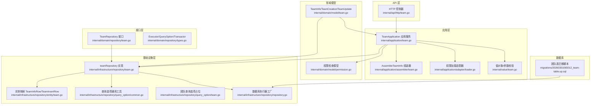
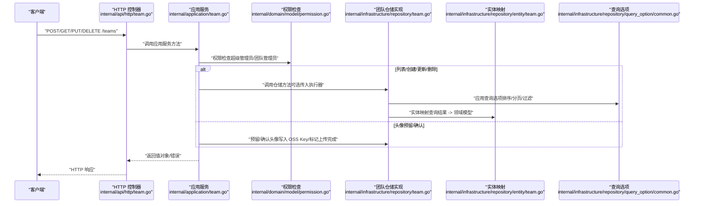
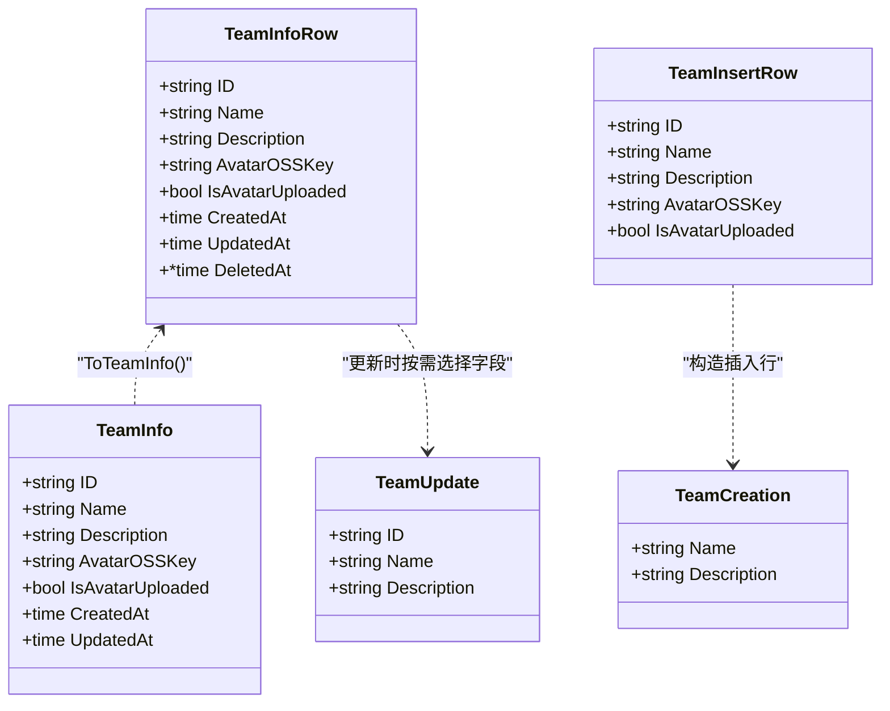
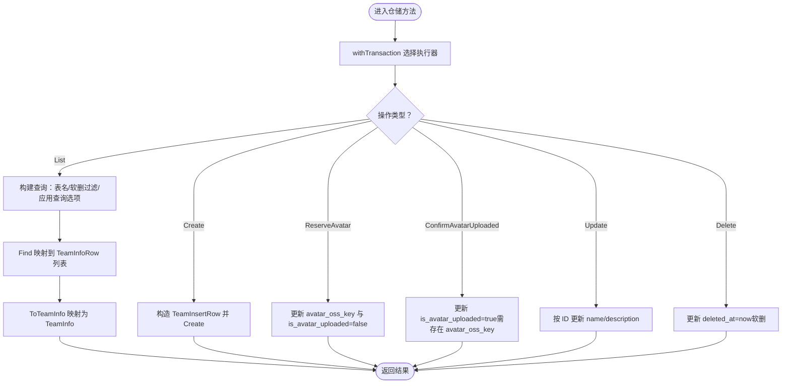
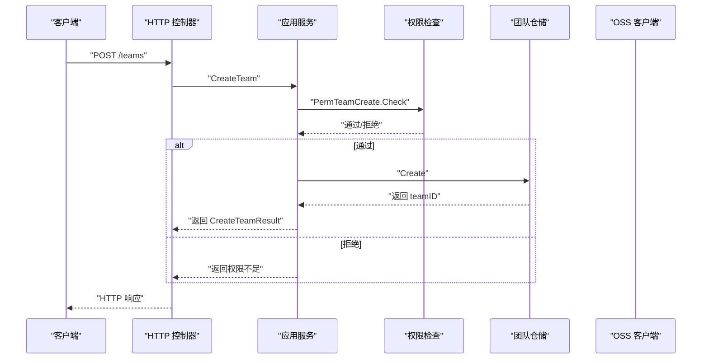
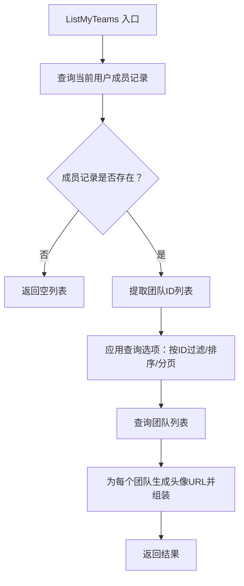
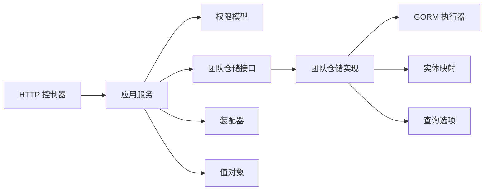

# 团队仓储

<cite>
**本文引用的文件**
- [internal/domain/repository/team.go](file://internal/domain/repository/team.go)
- [internal/infrastructure/repository/team.go](file://internal/infrastructure/repository/team.go)
- [internal/domain/model/team.go](file://internal/domain/model/team.go)
- [internal/application/team.go](file://internal/application/team.go)
- [internal/api/http/team.go](file://internal/api/http/team.go)
- [internal/domain/repository/types.go](file://internal/domain/repository/types.go)
- [internal/infrastructure/repository/entity/team.go](file://internal/infrastructure/repository/entity/team.go)
- [internal/infrastructure/repository/query_option/team.go](file://internal/infrastructure/repository/query_option/team.go)
- [internal/domain/model/permission.go](file://internal/domain/model/permission.go)
- [internal/application/assembler/team.go](file://internal/application/assembler/team.go)
- [internal/value/team.go](file://internal/value/team.go)
- [internal/application/adapter/loader.go](file://internal/application/adapter/loader.go)
- [internal/infrastructure/repository/query_option/common.go](file://internal/infrastructure/repository/query_option/common.go)
- [internal/infrastructure/repository/repository.go](file://internal/infrastructure/repository/repository.go)
- [migrations/20260301065012_team-table.up.sql](file://migrations/20260301065012_team-table.up.sql)
</cite>

## 目录
1. [简介](#简介)
2. [项目结构](#项目结构)
3. [核心组件](#核心组件)
4. [架构总览](#架构总览)
5. [详细组件分析](#详细组件分析)
6. [依赖分析](#依赖分析)
7. [性能考虑](#性能考虑)
8. [故障排查指南](#故障排查指南)
9. [结论](#结论)
10. [附录](#附录)

## 简介
本文件系统性阐述“团队仓储”的实现细节，覆盖团队列表查询、团队获取、团队创建、团队更新与团队删除等关键操作；深入解析团队数据模型、关联查询与权限检查机制；说明团队成员关系处理、团队状态管理与事务边界控制；并提供团队仓储的使用示例与最佳实践，帮助开发者快速理解与正确使用团队相关功能。

## 项目结构
围绕团队功能的代码按“接口层-应用层-基础设施层-领域模型-值对象-适配器-查询选项-迁移脚本”组织，职责清晰、层次分明：
- 接口层：定义团队仓储接口与执行器类型别名
- 应用层：封装业务流程，负责权限校验、参数校验与结果组装
- 基础设施层：实现仓储接口，完成数据库访问与事务控制
- 领域模型：定义团队实体与变更载体
- 值对象：定义对外暴露的数据结构与参数校验
- 适配器：将仓储查询结果映射为应用层可用的上下文信息
- 查询选项：提供统一的查询条件构造器
- 迁移脚本：定义团队表结构与索引

图表来源
- [internal/domain/repository/team.go:1-14](file://internal/domain/repository/team.go#L1-L14)
- [internal/domain/repository/types.go:1-12](file://internal/domain/repository/types.go#L1-L12)
- [internal/application/team.go:1-415](file://internal/application/team.go#L1-L415)
- [internal/application/assembler/team.go:1-32](file://internal/application/assembler/team.go#L1-L32)
- [internal/application/adapter/loader.go:1-71](file://internal/application/adapter/loader.go#L1-L71)
- [internal/infrastructure/repository/team.go:1-110](file://internal/infrastructure/repository/team.go#L1-L110)
- [internal/infrastructure/repository/entity/team.go:1-47](file://internal/infrastructure/repository/entity/team.go#L1-L47)
- [internal/infrastructure/repository/query_option/common.go:1-51](file://internal/infrastructure/repository/query_option/common.go#L1-L51)
- [internal/infrastructure/repository/query_option/team.go:1-8](file://internal/infrastructure/repository/query_option/team.go#L1-L8)
- [internal/infrastructure/repository/repository.go:1-30](file://internal/infrastructure/repository/repository.go#L1-L30)
- [internal/domain/model/team.go:1-63](file://internal/domain/model/team.go#L1-L63)
- [internal/domain/model/permission.go:1-845](file://internal/domain/model/permission.go#L1-L845)
- [internal/value/team.go:1-112](file://internal/value/team.go#L1-L112)
- [migrations/20260301065012_team-table.up.sql:1-16](file://migrations/20260301065012_team-table.up.sql#L1-L16)

章节来源
- [internal/domain/repository/team.go:1-14](file://internal/domain/repository/team.go#L1-L14)
- [internal/application/team.go:1-415](file://internal/application/team.go#L1-L415)
- [internal/infrastructure/repository/team.go:1-110](file://internal/infrastructure/repository/team.go#L1-L110)
- [internal/domain/model/team.go:1-63](file://internal/domain/model/team.go#L1-L63)
- [internal/value/team.go:1-112](file://internal/value/team.go#L1-L112)
- [internal/domain/model/permission.go:1-845](file://internal/domain/model/permission.go#L1-L845)
- [internal/application/assembler/team.go:1-32](file://internal/application/assembler/team.go#L1-L32)
- [internal/application/adapter/loader.go:1-71](file://internal/application/adapter/loader.go#L1-L71)
- [internal/infrastructure/repository/query_option/common.go:1-51](file://internal/infrastructure/repository/query_option/common.go#L1-L51)
- [internal/infrastructure/repository/repository.go:1-30](file://internal/infrastructure/repository/repository.go#L1-L30)
- [migrations/20260301065012_team-table.up.sql:1-16](file://migrations/20260301065012_team-table.up.sql#L1-L16)

## 核心组件
- 团队仓储接口：定义团队的列表、创建、头像预留/确认、更新与删除能力，并声明事务接口
- 团队仓储实现：基于 GORM 执行器，封装查询选项、实体映射与事务边界
- 应用服务：负责参数校验、权限检查、调用仓储与结果组装
- 数据模型：TeamInfo/TeamCreation/TeamUpdate 描述团队数据结构与变更载体
- 值对象：CreateTeamArgs/ListTeamArgs/UpdateTeamArgs 等承载输入参数与校验逻辑
- 权限模型：统一的权限检查函数族，支持超级管理员与团队管理员两类角色
- 实体映射：TeamInfoRow/TeamInsertRow 将数据库行映射到领域模型
- 查询选项：提供统一的排序、分页、ID 过滤等查询能力
- API 控制器：暴露 REST 接口，绑定应用服务

章节来源
- [internal/domain/repository/team.go:5-13](file://internal/domain/repository/team.go#L5-L13)
- [internal/infrastructure/repository/team.go:12-110](file://internal/infrastructure/repository/team.go#L12-L110)
- [internal/application/team.go:20-56](file://internal/application/team.go#L20-L56)
- [internal/domain/model/team.go:5-62](file://internal/domain/model/team.go#L5-L62)
- [internal/value/team.go:8-112](file://internal/value/team.go#L8-L112)
- [internal/domain/model/permission.go:302-349](file://internal/domain/model/permission.go#L302-L349)
- [internal/infrastructure/repository/entity/team.go:11-46](file://internal/infrastructure/repository/entity/team.go#L11-L46)
- [internal/infrastructure/repository/query_option/common.go:15-50](file://internal/infrastructure/repository/query_option/common.go#L15-L50)
- [internal/api/http/team.go:10-289](file://internal/api/http/team.go#L10-L289)

## 架构总览
下图展示从 HTTP 请求到仓储实现的整体调用链路，以及权限检查与结果组装的关键节点。

图表来源
- [internal/api/http/team.go:23-289](file://internal/api/http/team.go#L23-L289)
- [internal/application/team.go:92-414](file://internal/application/team.go#L92-L414)
- [internal/domain/model/permission.go:302-349](file://internal/domain/model/permission.go#L302-L349)
- [internal/infrastructure/repository/team.go:31-110](file://internal/infrastructure/repository/team.go#L31-L110)
- [internal/infrastructure/repository/entity/team.go:36-46](file://internal/infrastructure/repository/entity/team.go#L36-L46)
- [internal/infrastructure/repository/query_option/common.go:21-50](file://internal/infrastructure/repository/query_option/common.go#L21-L50)

## 详细组件分析

### 数据模型与实体映射
- TeamInfo：团队信息载体，包含标识、名称、描述、头像 OSS Key、是否已上传、创建/更新时间
- TeamCreation：创建团队的输入载体，包含名称与描述
- TeamUpdate：更新团队的输入载体，包含团队 ID、名称与描述
- TeamInfoRow/TeamInsertRow：数据库行映射，分别用于查询列表与插入写入
- 映射函数 ToTeamInfo：将数据库行转换为领域模型对象

图表来源
- [internal/domain/model/team.go:5-62](file://internal/domain/model/team.go#L5-L62)
- [internal/infrastructure/repository/entity/team.go:11-46](file://internal/infrastructure/repository/entity/team.go#L11-L46)

章节来源
- [internal/domain/model/team.go:5-62](file://internal/domain/model/team.go#L5-L62)
- [internal/infrastructure/repository/entity/team.go:11-46](file://internal/infrastructure/repository/entity/team.go#L11-L46)

### 仓储接口与实现
- 接口能力：List/Create/ReserveAvatar/ConfirmAvatarUploaded/Update/Delete
- 事务边界：通过 Transactor.BeginTransaction 提供显式事务执行器；仓储内部通过 withTransaction 选择执行器来源
- 查询选项：支持排序（按更新时间）、分页、ID 过滤等
- 状态管理：软删除通过 deleted_at 字段实现；头像上传状态通过 is_avatar_uploaded 字段管理

图表来源
- [internal/infrastructure/repository/team.go:20-110](file://internal/infrastructure/repository/team.go#L20-L110)
- [internal/infrastructure/repository/entity/team.go:25-34](file://internal/infrastructure/repository/entity/team.go#L25-L34)
- [internal/infrastructure/repository/query_option/common.go:33-50](file://internal/infrastructure/repository/query_option/common.go#L33-L50)

章节来源
- [internal/domain/repository/team.go:5-13](file://internal/domain/repository/team.go#L5-L13)
- [internal/infrastructure/repository/team.go:20-110](file://internal/infrastructure/repository/team.go#L20-L110)
- [internal/domain/repository/types.go:9-11](file://internal/domain/repository/types.go#L9-L11)
- [internal/infrastructure/repository/query_option/common.go:15-50](file://internal/infrastructure/repository/query_option/common.go#L15-L50)

### 应用服务与权限检查
- CreateTeam：参数校验 → 权限检查（超级管理员）→ 调用仓储创建 → 返回团队 ID
- ListTeams：参数校验 → 权限检查（超级管理员）→ 应用查询选项（排序/分页）→ 组装头像 URL
- ListMyTeams：先查询当前用户成员记录 → 构造团队 ID 列表 → 查询团队列表 → 组装头像 URL
- UpdateTeam：参数校验 → 权限检查（超级管理员或团队管理员）→ 调用仓储更新
- ReserveTeamAvatar：参数校验 → 权限检查（超级管理员或团队管理员）→ 生成预签名 PUT URL 与 OSS Key → 写入 avatar_oss_key
- ConfirmTeamAvatarUploaded：参数校验 → 权限检查（超级管理员或团队管理员）→ 标记 is_avatar_uploaded=true
- RemoveTeam：权限检查（超级管理员）→ 调用仓储软删除

图表来源
- [internal/application/team.go:92-130](file://internal/application/team.go#L92-L130)
- [internal/domain/model/permission.go:302-326](file://internal/domain/model/permission.go#L302-L326)
- [internal/infrastructure/repository/team.go:53-67](file://internal/infrastructure/repository/team.go#L53-L67)

章节来源
- [internal/application/team.go:92-414](file://internal/application/team.go#L92-L414)
- [internal/domain/model/permission.go:302-349](file://internal/domain/model/permission.go#L302-L349)
- [internal/application/assembler/team.go:10-31](file://internal/application/assembler/team.go#L10-L31)
- [internal/application/adapter/loader.go:10-24](file://internal/application/adapter/loader.go#L10-L24)

### 关联查询与成员关系处理
- ListMyTeams：通过成员仓储查询当前用户的所有成员记录，提取团队 ID，再批量查询团队信息，避免 N+1 问题
- 权限检查：通过适配器加载用户信息与成员信息，判断是否为超级管理员或团队管理员
- 头像 URL：通过 OSS 客户端生成预签名 URL，组装到返回值对象

图表来源
- [internal/application/team.go:234-299](file://internal/application/team.go#L234-L299)
- [internal/application/adapter/loader.go:16-24](file://internal/application/adapter/loader.go#L16-L24)
- [internal/infrastructure/repository/query_option/common.go:39-43](file://internal/infrastructure/repository/query_option/common.go#L39-L43)

章节来源
- [internal/application/team.go:234-299](file://internal/application/team.go#L234-L299)
- [internal/application/adapter/loader.go:16-24](file://internal/application/adapter/loader.go#L16-L24)
- [internal/infrastructure/repository/query_option/common.go:39-43](file://internal/infrastructure/repository/query_option/common.go#L39-L43)

### 团队状态管理与事务边界
- 软删除：Delete 操作将 deleted_at 设置为当前时间，查询默认过滤 deleted_at IS NULL
- 头像上传状态：ReserveAvatar 将 is_avatar_uploaded 设为 false；ConfirmAvatarUploaded 在存在 avatar_oss_key 时设为 true
- 事务边界：仓储内部通过 withTransaction 选择传入执行器或默认执行器；应用层可自行开启事务并通过执行器传入仓储，确保多步操作原子性

章节来源
- [internal/infrastructure/repository/team.go:34-109](file://internal/infrastructure/repository/team.go#L34-L109)
- [internal/domain/repository/types.go:9-11](file://internal/domain/repository/types.go#L9-L11)
- [internal/infrastructure/repository/team.go:20-29](file://internal/infrastructure/repository/team.go#L20-L29)

### 使用示例与最佳实践
- 创建团队
  - 输入：CreateTeamArgs（名称、描述）
  - 流程：参数校验 → 权限检查（超级管理员）→ 仓储创建 → 返回团队 ID
  - 最佳实践：在应用层捕获错误并返回统一格式；必要时开启事务以保证一致性
- 列出团队
  - 输入：ListTeamArgs（分页参数）
  - 流程：参数校验 → 权限检查（超级管理员）→ 应用查询选项 → 组装头像 URL
  - 最佳实践：优先使用 UpdatedAtDesc 排序；分页参数需校验
- 我的团队
  - 输入：ListMyTeamArgs（分页参数）
  - 流程：查询成员记录 → 过滤团队 ID → 查询团队列表 → 组装头像 URL
  - 最佳实践：成员 ID 数量通常较小，适合批量查询；注意空集合返回
- 更新团队
  - 输入：UpdateTeamArgs（ID、名称、描述）
  - 流程：参数校验 → 权限检查（超级管理员或团队管理员）→ 仓储更新
  - 最佳实践：仅更新需要的字段；避免不必要的写放大
- 头像预留与确认
  - 流程：生成预签名 PUT URL 与 OSS Key → 写入 avatar_oss_key → 客户端上传 → 确认上传完成
  - 最佳实践：确认上传前校验 OSS Key 是否存在；避免并发冲突
- 删除团队
  - 流程：权限检查（超级管理员）→ 仓储软删除
  - 最佳实践：删除前清理相关资源（成员、作品等）；软删除便于恢复

章节来源
- [internal/application/team.go:92-414](file://internal/application/team.go#L92-L414)
- [internal/value/team.go:8-112](file://internal/value/team.go#L8-L112)
- [internal/api/http/team.go:23-289](file://internal/api/http/team.go#L23-L289)

## 依赖分析
- 组件耦合
  - 应用层依赖仓储接口与权限模型，解耦具体实现
  - 基础设施层依赖 GORM 执行器与查询选项，提供统一的数据库访问
  - 值对象与装配器负责对外数据结构与 URL 组装
- 外部依赖
  - OSS 客户端：用于生成头像预签名 URL
  - 日志库：记录权限检查与错误信息
- 循环依赖
  - 未发现循环依赖；各层职责清晰，接口约束明确

图表来源
- [internal/api/http/team.go:23-289](file://internal/api/http/team.go#L23-L289)
- [internal/application/team.go:92-414](file://internal/application/team.go#L92-L414)
- [internal/domain/model/permission.go:302-349](file://internal/domain/model/permission.go#L302-L349)
- [internal/infrastructure/repository/team.go:31-110](file://internal/infrastructure/repository/team.go#L31-L110)
- [internal/application/assembler/team.go:10-31](file://internal/application/assembler/team.go#L10-L31)
- [internal/value/team.go:8-112](file://internal/value/team.go#L8-L112)

章节来源
- [internal/api/http/team.go:23-289](file://internal/api/http/team.go#L23-L289)
- [internal/application/team.go:92-414](file://internal/application/team.go#L92-L414)
- [internal/infrastructure/repository/team.go:31-110](file://internal/infrastructure/repository/team.go#L31-L110)

## 性能考虑
- 查询优化
  - 使用 UpdatedAtDesc 排序与分页，避免全表扫描
  - ListMyTeams 已采用批量查询策略，减少多次往返
- 写入优化
  - ReserveAvatar 与 ConfirmAvatarUploaded 分步进行，降低单次写入复杂度
  - Update 仅更新必要字段，避免冗余写入
- 事务优化
  - 应用层可传入执行器以合并多个仓储操作于同一事务，提升一致性与性能
- 缓存建议
  - 对常用团队信息可引入缓存（如 Redis），降低重复查询开销

## 故障排查指南
- 权限不足
  - 现象：返回权限不足错误
  - 排查：确认当前用户是否为超级管理员或目标团队管理员；检查适配器加载的用户与成员信息
- 参数校验失败
  - 现象：返回参数错误
  - 排查：核对名称长度与描述长度限制；检查分页参数范围
- 头像上传异常
  - 现象：预留/确认失败或头像 URL 为空
  - 排查：确认 OSS Key 是否写入；确认客户端上传是否成功；确认 ConfirmAvatarUploaded 条件满足
- 软删除影响
  - 现象：查询不到团队
  - 排查：确认 deleted_at 是否被设置；查询时需过滤软删记录

章节来源
- [internal/application/team.go:99-102](file://internal/application/team.go#L99-L102)
- [internal/application/team.go:151-157](file://internal/application/team.go#L151-L157)
- [internal/application/team.go:205-213](file://internal/application/team.go#L205-L213)
- [internal/application/team.go:364-372](file://internal/application/team.go#L364-L372)
- [internal/infrastructure/repository/team.go:34-34](file://internal/infrastructure/repository/team.go#L34-L34)

## 结论
团队仓储通过清晰的接口设计、严格的权限检查与完善的事务控制，实现了团队生命周期管理的核心能力。结合查询选项与实体映射，既保证了数据访问的一致性，又提供了良好的扩展性。建议在生产环境中配合缓存与监控，持续优化查询与写入性能，并严格遵循参数校验与权限策略，确保系统的安全与稳定。

## 附录
- 数据库表结构
  - 团队表包含主键 ID、名称、描述、头像 OSS Key、是否已上传、创建/更新/删除时间；名称建立唯一索引（软删过滤）

章节来源
- [migrations/20260301065012_team-table.up.sql:1-16](file://migrations/20260301065012_team-table.up.sql#L1-L16)