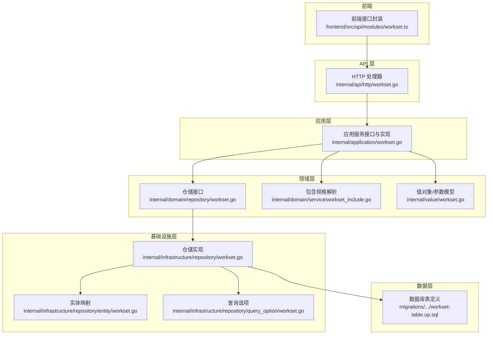
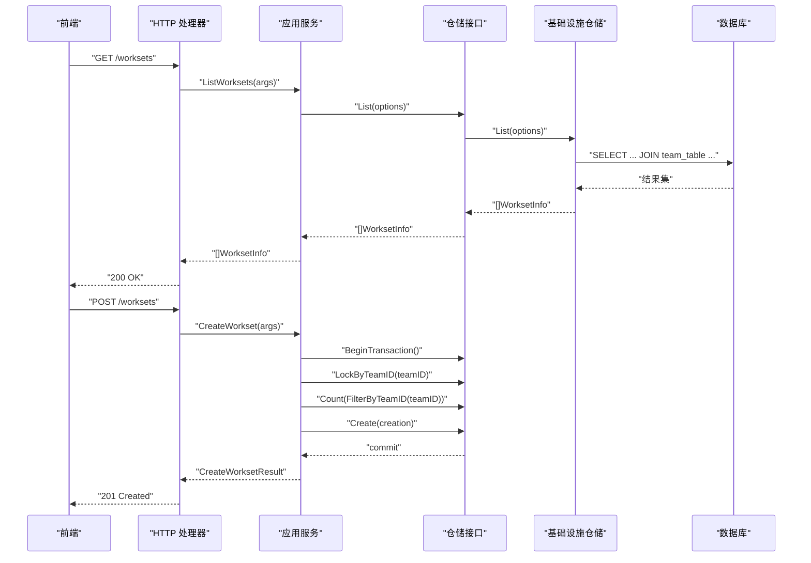
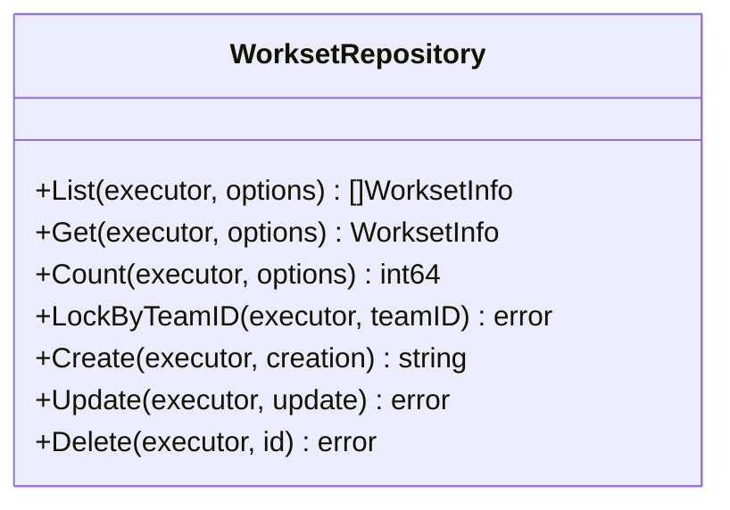
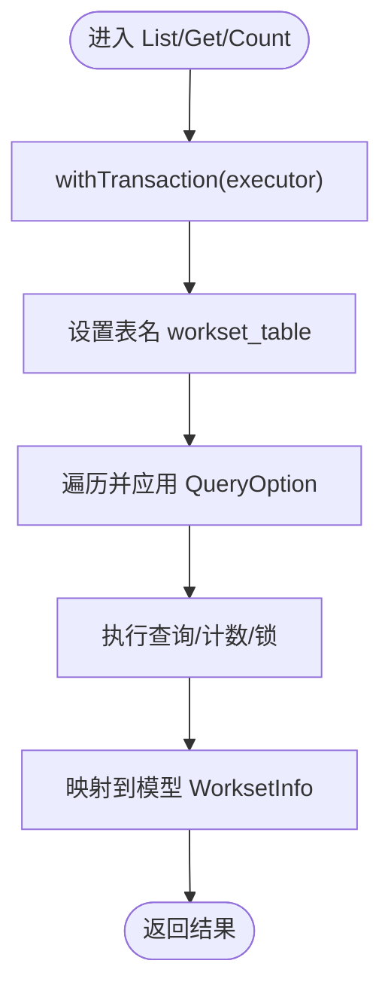
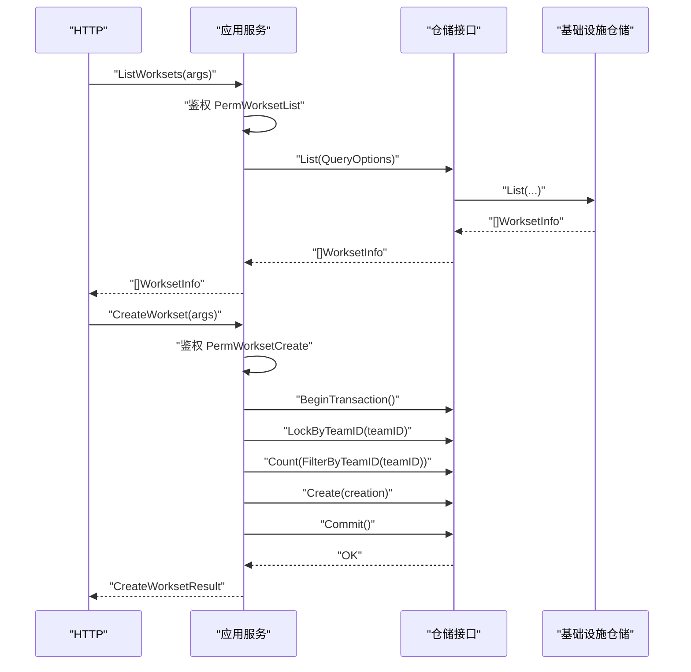
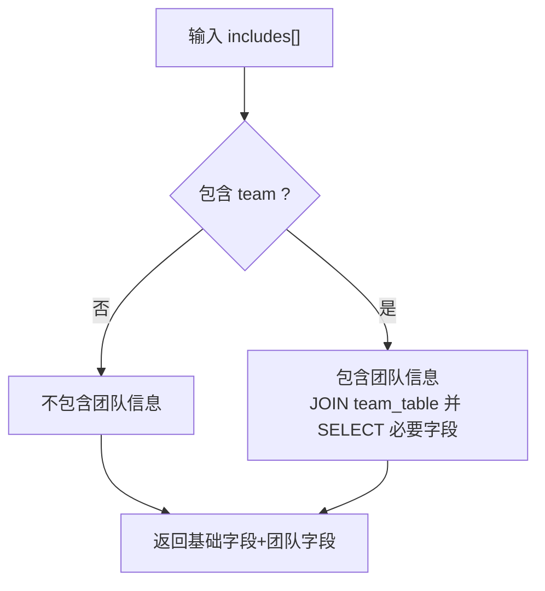
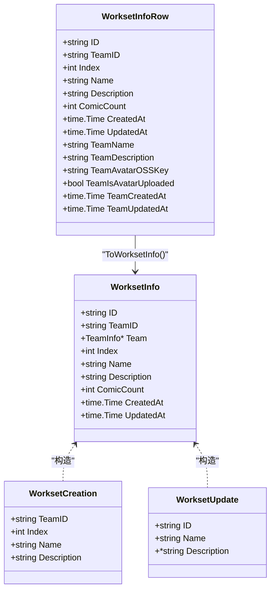
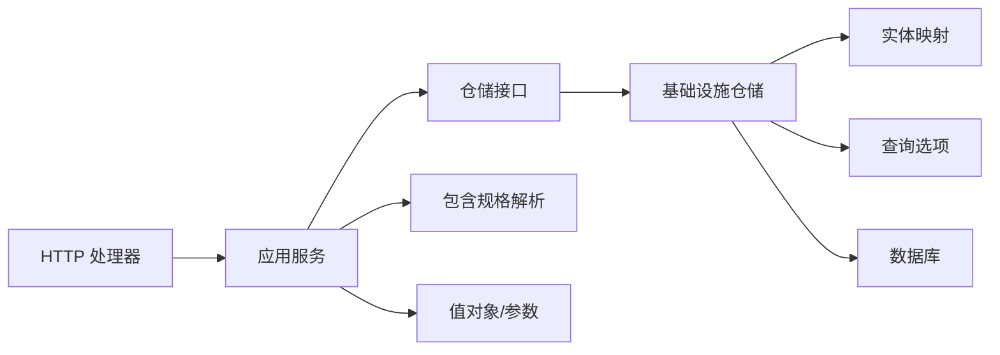

# 工作集仓储

<cite>
**本文引用的文件**
- [internal/domain/repository/workset.go](file://internal/domain/repository/workset.go)
- [internal/application/workset.go](file://internal/application/workset.go)
- [internal/infrastructure/repository/workset.go](file://internal/infrastructure/repository/workset.go)
- [internal/infrastructure/repository/entity/workset.go](file://internal/infrastructure/repository/entity/workset.go)
- [internal/infrastructure/repository/query_option/workset.go](file://internal/infrastructure/repository/query_option/workset.go)
- [internal/domain/service/workset_include.go](file://internal/domain/service/workset_include.go)
- [internal/value/workset.go](file://internal/value/workset.go)
- [internal/api/http/workset.go](file://internal/api/http/workset.go)
- [migrations/20260306101211_workset-table.up.sql](file://migrations/20260306101211_workset-table.up.sql)
- [frontend/src/api/modules/workset.ts](file://frontend/src/api/modules/workset.ts)
</cite>

## 目录
1. [简介](#简介)
2. [项目结构](#项目结构)
3. [核心组件](#核心组件)
4. [架构总览](#架构总览)
5. [详细组件分析](#详细组件分析)
6. [依赖分析](#依赖分析)
7. [性能考虑](#性能考虑)
8. [故障排查指南](#故障排查指南)
9. [结论](#结论)
10. [附录](#附录)

## 简介
本文件系统性阐述“工作集仓储”的实现与使用方法，覆盖以下方面：
- 工作集仓储的职责边界与接口能力
- 工作集列表查询、获取、创建、更新、删除的完整流程
- 工作集与漫画章节的关联关系、任务分组机制与进度计算逻辑
- 工作集状态管理与批量操作支持
- 使用示例与数据一致性保障策略

## 项目结构
围绕工作集的代码分布在领域层、应用层、基础设施层与API层，并辅以数据库迁移脚本与前端接口封装。

图表来源
- [internal/api/http/workset.go:1-189](file://internal/api/http/workset.go#L1-L189)
- [internal/application/workset.go:1-310](file://internal/application/workset.go#L1-L310)
- [internal/domain/repository/workset.go:1-15](file://internal/domain/repository/workset.go#L1-L15)
- [internal/infrastructure/repository/workset.go:1-139](file://internal/infrastructure/repository/workset.go#L1-L139)
- [internal/infrastructure/repository/entity/workset.go:1-73](file://internal/infrastructure/repository/entity/workset.go#L1-L73)
- [internal/infrastructure/repository/query_option/workset.go:1-38](file://internal/infrastructure/repository/query_option/workset.go#L1-L38)
- [internal/domain/service/workset_include.go:1-21](file://internal/domain/service/workset_include.go#L1-L21)
- [internal/value/workset.go:1-89](file://internal/value/workset.go#L1-L89)
- [migrations/20260306101211_workset-table.up.sql:1-19](file://migrations/20260306101211_workset-table.up.sql#L1-L19)
- [frontend/src/api/modules/workset.ts:1-72](file://frontend/src/api/modules/workset.ts#L1-L72)

章节来源
- [internal/api/http/workset.go:1-189](file://internal/api/http/workset.go#L1-L189)
- [internal/application/workset.go:1-310](file://internal/application/workset.go#L1-L310)
- [internal/domain/repository/workset.go:1-15](file://internal/domain/repository/workset.go#L1-L15)
- [internal/infrastructure/repository/workset.go:1-139](file://internal/infrastructure/repository/workset.go#L1-L139)
- [internal/infrastructure/repository/entity/workset.go:1-73](file://internal/infrastructure/repository/entity/workset.go#L1-L73)
- [internal/infrastructure/repository/query_option/workset.go:1-38](file://internal/infrastructure/repository/query_option/workset.go#L1-L38)
- [internal/domain/service/workset_include.go:1-21](file://internal/domain/service/workset_include.go#L1-L21)
- [internal/value/workset.go:1-89](file://internal/value/workset.go#L1-L89)
- [migrations/20260306101211_workset-table.up.sql:1-19](file://migrations/20260306101211_workset-table.up.sql#L1-L19)
- [frontend/src/api/modules/workset.ts:1-72](file://frontend/src/api/modules/workset.ts#L1-L72)

## 核心组件
- 仓储接口：定义工作集的查询、计数、加锁、创建、更新、删除等能力，统一抽象于接口中，便于替换实现与测试。
- 应用服务：负责鉴权、参数校验、事务控制、调用仓储执行业务规则（如创建时按团队内顺序编号），并将结果组装为对外值对象。
- 基础设施仓储：基于 GORM 执行 SQL，实现具体的数据访问逻辑，支持查询选项组合、连接查询与行级锁。
- 实体与查询选项：定义数据库表映射、聚合查询字段选择与 JOIN 规则，支撑“包含团队信息”的列表展示。
- 值对象与参数：对外暴露统一的请求/响应结构，确保 API 与应用层之间的契约清晰。
- 数据库表：定义工作集主表结构、索引与约束，保障唯一性与性能。

章节来源
- [internal/domain/repository/workset.go:5-14](file://internal/domain/repository/workset.go#L5-L14)
- [internal/application/workset.go:20-47](file://internal/application/workset.go#L20-L47)
- [internal/infrastructure/repository/workset.go:12-139](file://internal/infrastructure/repository/workset.go#L12-L139)
- [internal/infrastructure/repository/entity/workset.go:9-73](file://internal/infrastructure/repository/entity/workset.go#L9-L73)
- [internal/infrastructure/repository/query_option/workset.go:7-38](file://internal/infrastructure/repository/query_option/workset.go#L7-L38)
- [internal/value/workset.go:7-89](file://internal/value/workset.go#L7-L89)
- [migrations/20260306101211_workset-table.up.sql:1-19](file://migrations/20260306101211_workset-table.up.sql#L1-L19)

## 架构总览
工作集的调用链路自上而下：HTTP 接口 -> 应用服务 -> 仓储接口 -> 基础设施仓储 -> 数据库；同时支持“包含团队信息”的 JOIN 查询，以及事务与行级锁保障并发安全。

图表来源
- [internal/api/http/workset.go:25-52](file://internal/api/http/workset.go#L25-L52)
- [internal/application/workset.go:72-126](file://internal/application/workset.go#L72-L126)
- [internal/application/workset.go:128-213](file://internal/application/workset.go#L128-L213)
- [internal/infrastructure/repository/workset.go:32-50](file://internal/infrastructure/repository/workset.go#L32-L50)
- [internal/infrastructure/repository/workset.go:28-30](file://internal/infrastructure/repository/workset.go#L28-L30)
- [internal/infrastructure/repository/workset.go:67-77](file://internal/infrastructure/repository/workset.go#L67-L77)
- [internal/infrastructure/repository/workset.go:79-92](file://internal/infrastructure/repository/workset.go#L79-L92)
- [internal/infrastructure/repository/workset.go:94-110](file://internal/infrastructure/repository/workset.go#L94-L110)

## 详细组件分析

### 仓储接口与职责
- 查询类：List、Get、Count
- 并发控制：LockByTeamID（行级排他锁）
- 写入类：Create、Update、Delete
- 事务：BeginTransaction 提供统一事务入口

图表来源
- [internal/domain/repository/workset.go:5-14](file://internal/domain/repository/workset.go#L5-L14)

章节来源
- [internal/domain/repository/workset.go:5-14](file://internal/domain/repository/workset.go#L5-L14)

### 基础设施仓储实现
- 统一执行器：支持传入外部执行器或内部默认执行器
- 查询选项组合：通过闭包式 QueryOption 动态拼接 WHERE、ORDER BY、JOIN、SELECT
- 连接查询：IncludeTeamInfo 将 team_table 与 workset_table JOIN，并选择必要字段
- 行级锁：LockByTeamID 对团队内的工作集记录施加 UPDATE 锁
- 事务：BeginTransaction 返回可复用的事务执行器

图表来源
- [internal/infrastructure/repository/workset.go:20-26](file://internal/infrastructure/repository/workset.go#L20-L26)
- [internal/infrastructure/repository/workset.go:32-50](file://internal/infrastructure/repository/workset.go#L32-L50)
- [internal/infrastructure/repository/workset.go:52-65](file://internal/infrastructure/repository/workset.go#L52-L65)
- [internal/infrastructure/repository/workset.go:79-92](file://internal/infrastructure/repository/workset.go#L79-L92)
- [internal/infrastructure/repository/workset.go:67-77](file://internal/infrastructure/repository/workset.go#L67-L77)

章节来源
- [internal/infrastructure/repository/workset.go:12-139](file://internal/infrastructure/repository/workset.go#L12-L139)
- [internal/infrastructure/repository/entity/workset.go:9-73](file://internal/infrastructure/repository/entity/workset.go#L9-L73)
- [internal/infrastructure/repository/query_option/workset.go:7-38](file://internal/infrastructure/repository/query_option/workset.go#L7-L38)

### 应用服务：工作集 CRUD 流程
- 列表：鉴权 -> 解析 includes -> 组装查询选项 -> 调用仓储 -> 转换为对外值对象
- 创建：鉴权 -> 开启事务 -> 行级锁 -> 计数确定顺序号 -> 创建 -> 提交
- 更新：获取目标工作集 -> 鉴权 -> 组装更新参数 -> 调用仓储更新
- 删除：获取目标工作集 -> 鉴权 -> 调用仓储删除

图表来源
- [internal/application/workset.go:72-126](file://internal/application/workset.go#L72-L126)
- [internal/application/workset.go:128-213](file://internal/application/workset.go#L128-L213)
- [internal/application/workset.go:215-262](file://internal/application/workset.go#L215-L262)
- [internal/application/workset.go:264-309](file://internal/application/workset.go#L264-L309)

章节来源
- [internal/application/workset.go:72-309](file://internal/application/workset.go#L72-L309)

### 查询选项与包含规格
- 查询选项：FilterByTeamID、OrderByIndexAsc、IncludeTeamInfo
- 包含规格解析：根据 includes[] 决定是否包含团队信息，避免不必要的 JOIN

图表来源
- [internal/domain/service/workset_include.go:9-20](file://internal/domain/service/workset_include.go#L9-L20)
- [internal/infrastructure/repository/query_option/workset.go:13-37](file://internal/infrastructure/repository/query_option/workset.go#L13-L37)

章节来源
- [internal/domain/service/workset_include.go:1-21](file://internal/domain/service/workset_include.go#L1-L21)
- [internal/infrastructure/repository/query_option/workset.go:1-38](file://internal/infrastructure/repository/query_option/workset.go#L1-L38)

### 数据模型与实体映射
- 领域模型：WorksetInfo、WorksetCreation、WorksetUpdate
- 实体映射：WorksetInfoRow、WorksetInsertRow，以及 ToWorksetInfo 转换函数
- 值对象：对外统一的 WorksetInfo 结构，包含时间戳等字段

图表来源
- [internal/domain/model/workset.go:5-82](file://internal/domain/model/workset.go#L5-L82)
- [internal/infrastructure/repository/entity/workset.go:11-73](file://internal/infrastructure/repository/entity/workset.go#L11-L73)
- [internal/value/workset.go:7-20](file://internal/value/workset.go#L7-L20)

章节来源
- [internal/domain/model/workset.go:1-82](file://internal/domain/model/workset.go#L1-L82)
- [internal/infrastructure/repository/entity/workset.go:1-73](file://internal/infrastructure/repository/entity/workset.go#L1-L73)
- [internal/value/workset.go:1-89](file://internal/value/workset.go#L1-L89)

### 工作集与漫画章节的关联关系、任务分组机制与进度计算
- 关联关系：工作集与漫画章节之间存在一对多关系（一个工作集包含多个章节）。章节模型中包含统计字段 TotalUnitCount、TranslatedUnitCount、ProofreadUnitCount，用于衡量翻译与校对进度。
- 任务分组机制：章节分配（Assignment）将用户与章节绑定，支持多种角色（原始提供者、翻译、校对、排版、复审、发布），并记录各阶段的起止时间戳，形成工作流状态机。
- 进度计算逻辑：章节层面的进度通常基于单元（unit）完成度，即 TranslatedUnitCount / TotalUnitCount 与 ProofreadUnitCount / TotalUnitCount 的比值；工作集层面的进度可汇总其包含的所有章节的平均完成度，作为整体进度指标。

章节来源
- [internal/domain/model/chapter.go:83-103](file://internal/domain/model/chapter.go#L83-L103)
- [internal/domain/model/assignment.go:57-111](file://internal/domain/model/assignment.go#L57-L111)

### 工作集状态管理与批量操作支持
- 状态管理：工作集本身不直接维护复杂状态机，但其包含的章节具备工作流状态（上传、翻译、校对、排版、复审、发布）。可通过章节的状态时间戳推导工作集的阶段性进展。
- 批量操作：当前仓储未提供专用的批量更新/删除接口。建议在应用层通过循环逐条处理并包裹在同一事务中，以保证一致性；或在仓储层扩展批量接口以减少往返开销。

章节来源
- [internal/application/workset.go:128-213](file://internal/application/workset.go#L128-L213)
- [internal/infrastructure/repository/workset.go:112-138](file://internal/infrastructure/repository/workset.go#L112-L138)

### 使用示例
- 列表查询（包含团队信息）
  - 步骤：调用 HTTP GET /worksets，携带 team_id、includes[]=team、offset、limit
  - 应用层解析 includes，构建 QueryOption，调用仓储 List
  - 返回值：WorksetInfo 数组，若包含 team，则填充 Team 字段
- 创建工作集
  - 步骤：调用 HTTP POST /worksets，携带 team_id、name、description（可选）
  - 应用层开启事务，锁定团队内工作集记录，统计数量确定顺序号，创建后提交
  - 返回值：CreateWorksetResult，包含新工作集 ID
- 更新/删除工作集
  - 步骤：调用 PUT /worksets/{workset_id} 或 DELETE /worksets/{workset_id}
  - 应用层鉴权后调用仓储 Update/Delete

章节来源
- [internal/api/http/workset.go:25-52](file://internal/api/http/workset.go#L25-L52)
- [internal/api/http/workset.go:67-95](file://internal/api/http/workset.go#L67-L95)
- [internal/api/http/workset.go:111-148](file://internal/api/http/workset.go#L111-L148)
- [internal/api/http/workset.go:162-188](file://internal/api/http/workset.go#L162-L188)
- [frontend/src/api/modules/workset.ts:53-71](file://frontend/src/api/modules/workset.ts#L53-L71)

## 依赖分析
- 应用层依赖仓储接口与成员仓储（用于鉴权），并通过装配器/服务解析 includes 规格。
- 基础设施仓储依赖实体与查询选项，最终落到数据库执行。
- 值对象与参数在应用层与 API 层之间传递，确保契约稳定。
- 数据库层通过迁移脚本定义表结构与索引，保障唯一性与查询性能。

图表来源
- [internal/api/http/workset.go:1-189](file://internal/api/http/workset.go#L1-L189)
- [internal/application/workset.go:1-310](file://internal/application/workset.go#L1-L310)
- [internal/domain/repository/workset.go:1-15](file://internal/domain/repository/workset.go#L1-L15)
- [internal/infrastructure/repository/workset.go:1-139](file://internal/infrastructure/repository/workset.go#L1-L139)
- [internal/infrastructure/repository/entity/workset.go:1-73](file://internal/infrastructure/repository/entity/workset.go#L1-L73)
- [internal/infrastructure/repository/query_option/workset.go:1-38](file://internal/infrastructure/repository/query_option/workset.go#L1-L38)
- [internal/domain/service/workset_include.go:1-21](file://internal/domain/service/workset_include.go#L1-L21)
- [internal/value/workset.go:1-89](file://internal/value/workset.go#L1-L89)
- [migrations/20260306101211_workset-table.up.sql:1-19](file://migrations/20260306101211_workset-table.up.sql#L1-L19)

章节来源
- [internal/application/workset.go:1-310](file://internal/application/workset.go#L1-L310)
- [internal/infrastructure/repository/workset.go:1-139](file://internal/infrastructure/repository/workset.go#L1-L139)

## 性能考虑
- 索引优化：工作集表对 team_id 建有索引，且 team_id 与 index 组成唯一索引，有利于按团队排序与去重。
- 查询选项：通过 QueryOption 组合 WHERE、ORDER、JOIN，避免一次性加载过多无关字段。
- 连接查询：IncludeTeamInfo 仅在需要时启用，减少不必要的 JOIN。
- 事务与锁：创建时对团队内记录加行级锁，避免并发导致的顺序冲突；锁范围限定在团队维度，降低锁竞争。

章节来源
- [migrations/20260306101211_workset-table.up.sql:15-19](file://migrations/20260306101211_workset-table.up.sql#L15-L19)
- [internal/infrastructure/repository/workset.go:67-77](file://internal/infrastructure/repository/workset.go#L67-L77)
- [internal/infrastructure/repository/query_option/workset.go:27-37](file://internal/infrastructure/repository/query_option/workset.go#L27-L37)

## 故障排查指南
- 权限不足：鉴权失败会返回明确错误，检查当前用户在目标团队的角色与权限。
- 参数错误：应用层对请求参数进行校验，若校验失败会返回错误提示。
- 事务异常：创建工作集涉及事务与锁，若开启事务、提交或回滚失败，需检查数据库连接与并发冲突。
- 查询异常：仓储层对查询/计数/锁执行错误进行返回，关注日志中的错误堆栈定位问题。

章节来源
- [internal/application/workset.go:79-82](file://internal/application/workset.go#L79-L82)
- [internal/application/workset.go:98-100](file://internal/application/workset.go#L98-L100)
- [internal/application/workset.go:159-162](file://internal/application/workset.go#L159-L162)
- [internal/application/workset.go:174-178](file://internal/application/workset.go#L174-L178)
- [internal/application/workset.go:184-187](file://internal/application/workset.go#L184-L187)
- [internal/application/workset.go:207-210](file://internal/application/workset.go#L207-L210)
- [internal/application/workset.go:222-225](file://internal/application/workset.go#L222-L225)
- [internal/application/workset.go:245-252](file://internal/application/workset.go#L245-L252)
- [internal/application/workset.go:271-274](file://internal/application/workset.go#L271-L274)
- [internal/application/workset.go:289-291](file://internal/application/workset.go#L289-L291)
- [internal/application/workset.go:299-301](file://internal/application/workset.go#L299-L301)

## 结论
工作集仓储通过清晰的分层设计与接口抽象，实现了稳定的 CRUD 能力与良好的扩展性。结合查询选项与包含规格，可在不同场景下灵活控制数据加载范围；通过事务与行级锁保障了创建过程的一致性。工作集与章节的关联关系为后续的进度统计与任务分组提供了坚实基础。

## 附录
- 数据库表结构要点
  - 主键：id
  - 外键：team_id 引用团队表，删除时级联
  - 索引：team_id 普通索引；(team_id, index) 唯一索引
- 前端对接要点
  - 列表查询：GET /worksets，支持 includes[]、分页参数
  - 创建工作集：POST /worksets，返回新工作集 ID

章节来源
- [migrations/20260306101211_workset-table.up.sql:1-19](file://migrations/20260306101211_workset-table.up.sql#L1-L19)
- [frontend/src/api/modules/workset.ts:53-71](file://frontend/src/api/modules/workset.ts#L53-L71)