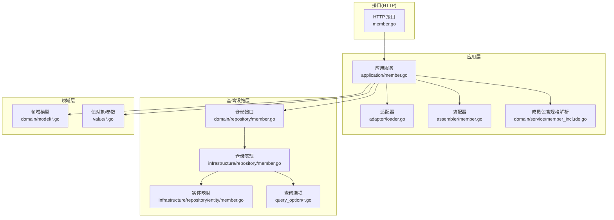
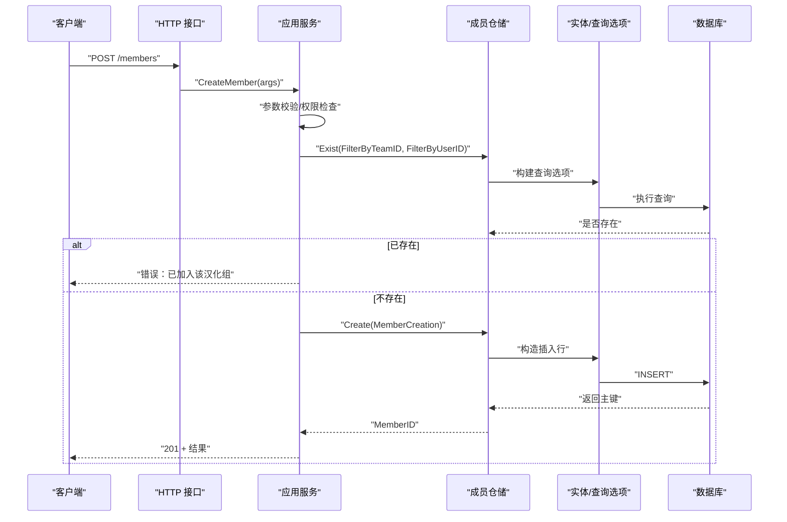
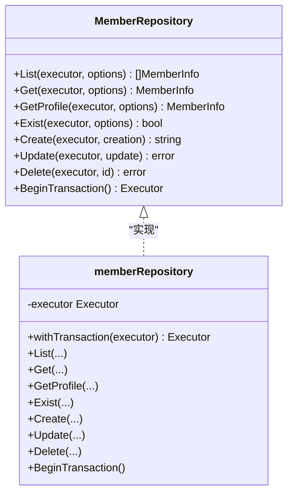
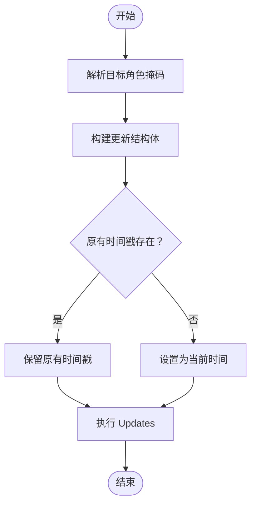
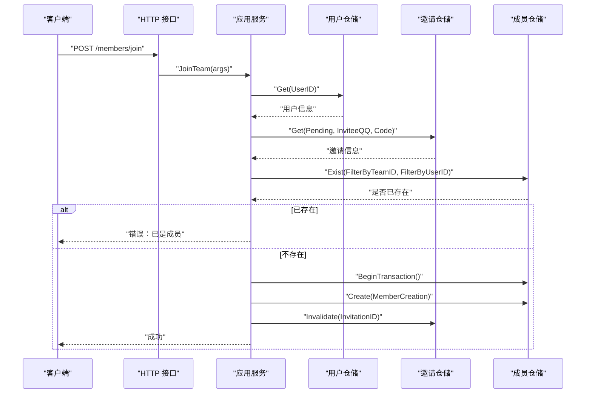
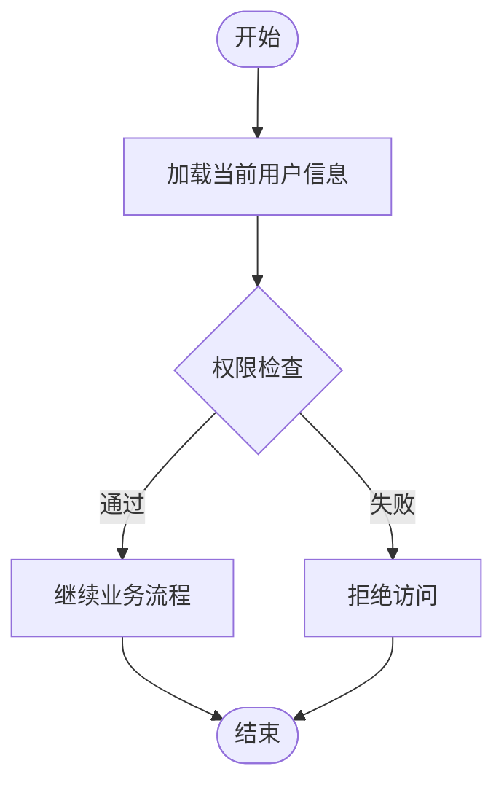
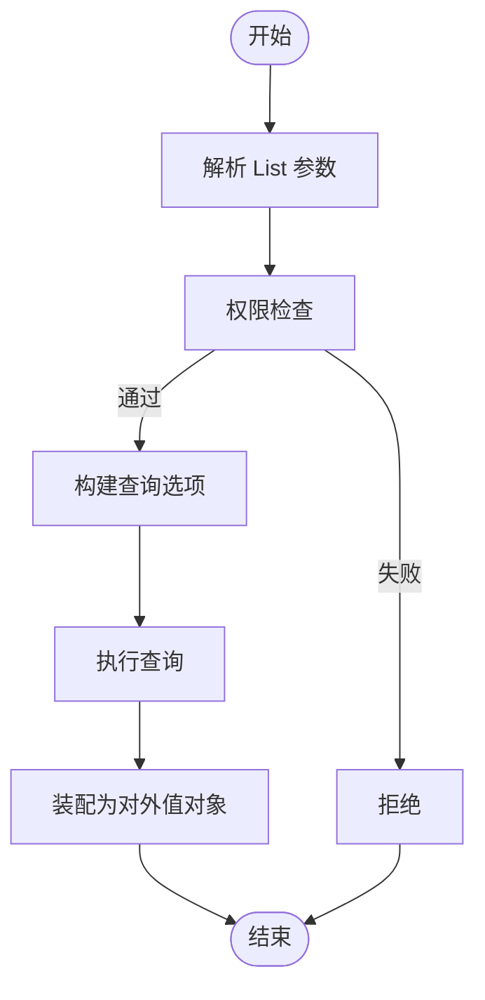
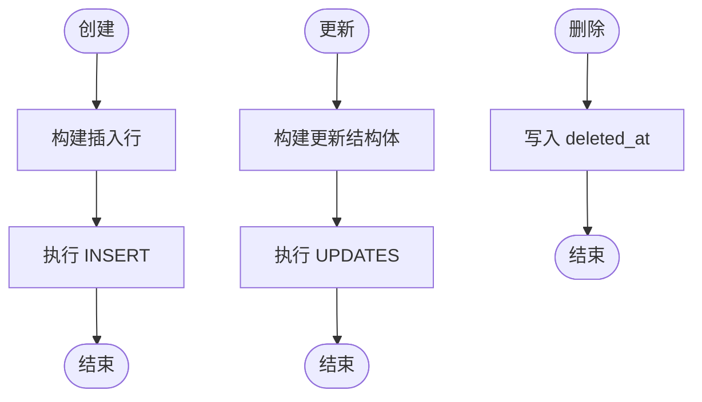
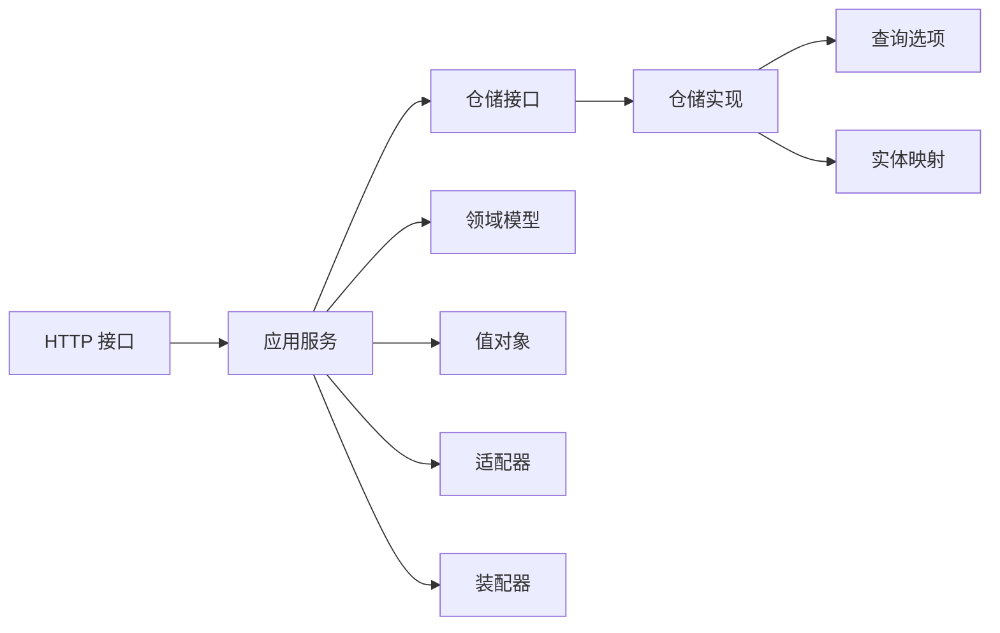

# 成员仓储

<cite>
**本文引用的文件**
- [internal/domain/repository/member.go](file://internal/domain/repository/member.go)
- [internal/infrastructure/repository/member.go](file://internal/infrastructure/repository/member.go)
- [internal/application/member.go](file://internal/application/member.go)
- [internal/api/http/member.go](file://internal/api/http/member.go)
- [internal/domain/model/member.go](file://internal/domain/model/member.go)
- [internal/domain/model/role.go](file://internal/domain/model/role.go)
- [internal/domain/model/permission.go](file://internal/domain/model/permission.go)
- [internal/infrastructure/repository/entity/member.go](file://internal/infrastructure/repository/entity/member.go)
- [internal/infrastructure/repository/query_option/member.go](file://internal/infrastructure/repository/query_option/member.go)
- [internal/infrastructure/repository/query_option/common.go](file://internal/infrastructure/repository/query_option/common.go)
- [internal/application/adapter/loader.go](file://internal/application/adapter/loader.go)
- [internal/application/assembler/member.go](file://internal/application/assembler/member.go)
- [internal/domain/service/member_include.go](file://internal/domain/service/member_include.go)
- [internal/value/member.go](file://internal/value/member.go)
- [internal/value/common.go](file://internal/value/common.go)
</cite>

## 目录
1. [简介](#简介)
2. [项目结构](#项目结构)
3. [核心组件](#核心组件)
4. [架构总览](#架构总览)
5. [详细组件分析](#详细组件分析)
6. [依赖分析](#依赖分析)
7. [性能考虑](#性能考虑)
8. [故障排查指南](#故障排查指南)
9. [结论](#结论)
10. [附录](#附录)

## 简介
本文件系统性阐述“成员仓储”的实现与使用，覆盖成员列表查询、成员获取、成员创建、成员更新与成员删除等核心操作；深入解析成员角色管理、权限继承与状态检查机制；说明团队成员关系处理、邀请状态管理与权限验证流程；并提供使用示例与权限控制最佳实践，帮助开发者快速理解与正确使用成员相关功能。

## 项目结构
成员相关能力按“接口层 → 应用层 → 基础设施层 → 领域模型/实体/查询选项”的分层组织，职责清晰、边界明确：
- 接口层：定义成员仓储接口，约束对外能力
- 基础设施层：基于 GORM 实现具体仓储，封装 SQL 构造与实体映射
- 应用层：编排业务流程，执行权限校验与事务控制
- 接口层 HTTP：暴露 REST API，绑定应用层服务
- 领域模型：定义成员数据结构、角色掩码与权限规则
- 查询选项：提供可组合的查询条件与 JOIN 策略
- 装配器与适配器：负责领域模型与值对象之间的转换与外部加载器注入

图表来源
- [internal/api/http/member.go:1-272](file://internal/api/http/member.go#L1-L272)
- [internal/application/member.go:1-448](file://internal/application/member.go#L1-L448)
- [internal/application/adapter/loader.go:1-71](file://internal/application/adapter/loader.go#L1-L71)
- [internal/application/assembler/member.go:1-38](file://internal/application/assembler/member.go#L1-L38)
- [internal/domain/repository/member.go:1-15](file://internal/domain/repository/member.go#L1-L15)
- [internal/infrastructure/repository/member.go:1-182](file://internal/infrastructure/repository/member.go#L1-L182)
- [internal/infrastructure/repository/entity/member.go:1-143](file://internal/infrastructure/repository/entity/member.go#L1-L143)
- [internal/infrastructure/repository/query_option/member.go:1-81](file://internal/infrastructure/repository/query_option/member.go#L1-L81)
- [internal/domain/model/member.go:1-205](file://internal/domain/model/member.go#L1-L205)
- [internal/domain/model/role.go:1-56](file://internal/domain/model/role.go#L1-L56)
- [internal/domain/model/permission.go:1-845](file://internal/domain/model/permission.go#L1-L845)
- [internal/value/member.go:1-139](file://internal/value/member.go#L1-L139)

章节来源
- [internal/api/http/member.go:1-272](file://internal/api/http/member.go#L1-L272)
- [internal/application/member.go:1-448](file://internal/application/member.go#L1-L448)
- [internal/domain/repository/member.go:1-15](file://internal/domain/repository/member.go#L1-L15)
- [internal/infrastructure/repository/member.go:1-182](file://internal/infrastructure/repository/member.go#L1-L182)

## 核心组件
- 仓储接口：定义成员仓储能力集合，支持列表、获取、存在性检查、创建、更新、删除，并具备事务能力
- 仓储实现：基于 GORM 执行查询与写入，统一处理软删除过滤、角色字段映射与事务上下文
- 应用服务：封装业务流程，执行参数校验、权限检查、包含规格解析与装配转换
- HTTP 接口：暴露 REST API，绑定应用服务，处理鉴权、参数解析与响应
- 领域模型与值对象：定义成员信息、角色掩码、权限规则与 API 输入输出结构
- 查询选项：提供可组合的过滤、排序、分页与 JOIN 策略
- 实体映射：将数据库行映射为领域模型，支持用户与团队信息聚合

章节来源
- [internal/domain/repository/member.go:5-14](file://internal/domain/repository/member.go#L5-L14)
- [internal/infrastructure/repository/member.go:31-182](file://internal/infrastructure/repository/member.go#L31-L182)
- [internal/application/member.go:20-82](file://internal/application/member.go#L20-L82)
- [internal/api/http/member.go:10-272](file://internal/api/http/member.go#L10-L272)
- [internal/domain/model/member.go:7-205](file://internal/domain/model/member.go#L7-L205)
- [internal/domain/model/role.go:9-56](file://internal/domain/model/role.go#L9-L56)
- [internal/infrastructure/repository/entity/member.go:9-143](file://internal/infrastructure/repository/entity/member.go#L9-L143)
- [internal/infrastructure/repository/query_option/member.go:7-81](file://internal/infrastructure/repository/query_option/member.go#L7-L81)

## 架构总览
成员相关流程遵循“HTTP → 应用服务 → 仓储 → 实体/查询选项 → 数据库”的链路，权限检查贯穿关键节点，确保最小授权与安全可控。

图表来源
- [internal/api/http/member.go:10-51](file://internal/api/http/member.go#L10-L51)
- [internal/application/member.go:84-139](file://internal/application/member.go#L84-L139)
- [internal/infrastructure/repository/member.go:115-153](file://internal/infrastructure/repository/member.go#L115-L153)
- [internal/infrastructure/repository/query_option/member.go:13-32](file://internal/infrastructure/repository/query_option/member.go#L13-L32)

## 详细组件分析

### 成员仓储接口与实现
- 接口能力：List、Get、GetProfile、Exist、Create、Update、Delete、BeginTransaction
- 实现要点：
  - 统一软删除过滤：查询时自动排除 deleted_at 非空记录
  - 可组合查询：通过 QueryOption 支持过滤、排序、分页与 JOIN
  - 角色字段映射：创建时按角色位设置对应时间戳字段；更新时按需写入
  - 事务上下文：支持传入外部事务执行器，或使用内部默认执行器

图表来源
- [internal/domain/repository/member.go:5-14](file://internal/domain/repository/member.go#L5-L14)
- [internal/infrastructure/repository/member.go:12-29](file://internal/infrastructure/repository/member.go#L12-L29)

章节来源
- [internal/domain/repository/member.go:5-14](file://internal/domain/repository/member.go#L5-L14)
- [internal/infrastructure/repository/member.go:31-182](file://internal/infrastructure/repository/member.go#L31-L182)

### 成员角色管理与权限继承
- 角色定义：以位掩码表达多角色，支持原始提供者、翻译、校对、排版、审核、发布、管理员
- 角色映射：创建时按角色位设置对应时间戳字段；更新时采用“全量替换”策略，保留已有角色的时间戳
- 权限继承：权限检查基于“当前用户在目标团队中的成员信息”，管理员角色通过 HasAnyRole 判断

图表来源
- [internal/domain/model/member.go:177-204](file://internal/domain/model/member.go#L177-L204)
- [internal/infrastructure/repository/member.go:155-172](file://internal/infrastructure/repository/member.go#L155-L172)

章节来源
- [internal/domain/model/role.go:9-56](file://internal/domain/model/role.go#L9-L56)
- [internal/domain/model/member.go:101-204](file://internal/domain/model/member.go#L101-L204)
- [internal/domain/model/permission.go:379-395](file://internal/domain/model/permission.go#L379-L395)

### 团队成员关系与邀请状态管理
- 团队成员关系：成员记录绑定用户与团队，支持 IncludeUserInfo/IncludeTeamInfo 聚合查询
- 邀请状态管理：JoinTeam 使用邀请码与用户 QQ 查找未消耗的邀请，创建成员后使邀请失效
- 事务保证：加入团队在单事务中完成成员创建与邀请失效，保证一致性

图表来源
- [internal/api/http/member.go:191-231](file://internal/api/http/member.go#L191-L231)
- [internal/application/member.go:340-447](file://internal/application/member.go#L340-L447)
- [internal/infrastructure/repository/query_option/member.go:13-32](file://internal/infrastructure/repository/query_option/member.go#L13-L32)

章节来源
- [internal/application/member.go:340-447](file://internal/application/member.go#L340-L447)
- [internal/infrastructure/repository/query_option/member.go:41-80](file://internal/infrastructure/repository/query_option/member.go#L41-L80)

### 权限验证流程
- 超级管理员创建成员：仅超级管理员可创建成员
- 团队管理员查看/更新/移除成员：仅团队管理员可执行
- 权限加载器：通过适配器注入用户与成员信息加载函数，权限检查时按需加载
- 安全校验：更新/删除前先查询目标成员，使用从数据库得到的可信 TeamID 进行权限检查

图表来源
- [internal/application/member.go:105-111](file://internal/application/member.go#L105-L111)
- [internal/application/member.go:162-169](file://internal/application/member.go#L162-L169)
- [internal/application/member.go:276-283](file://internal/application/member.go#L276-L283)
- [internal/application/adapter/loader.go:10-24](file://internal/application/adapter/loader.go#L10-L24)
- [internal/domain/model/permission.go:363-395](file://internal/domain/model/permission.go#L363-L395)

章节来源
- [internal/application/member.go:84-139](file://internal/application/member.go#L84-L139)
- [internal/application/member.go:141-197](file://internal/application/member.go#L141-L197)
- [internal/application/member.go:245-338](file://internal/application/member.go#L245-L338)
- [internal/application/adapter/loader.go:10-24](file://internal/application/adapter/loader.go#L10-L24)
- [internal/domain/model/permission.go:363-395](file://internal/domain/model/permission.go#L363-L395)

### 成员列表查询与包含规格
- 列表查询：支持按团队 ID 过滤、按创建时间排序、分页；可选择包含用户或团队信息
- 包含规格解析：根据 includes[] 参数决定是否 JOIN 用户或团队信息
- 装配转换：将领域模型转换为对外值对象，统一时间格式与可选字段

图表来源
- [internal/application/member.go:141-197](file://internal/application/member.go#L141-L197)
- [internal/domain/service/member_include.go:9-37](file://internal/domain/service/member_include.go#L9-L37)
- [internal/application/assembler/member.go:9-37](file://internal/application/assembler/member.go#L9-L37)

章节来源
- [internal/application/member.go:141-197](file://internal/application/member.go#L141-L197)
- [internal/domain/service/member_include.go:9-37](file://internal/domain/service/member_include.go#L9-L37)
- [internal/application/assembler/member.go:9-37](file://internal/application/assembler/member.go#L9-L37)

### 成员创建、更新与删除
- 创建：生成唯一 ID，按角色位设置对应时间戳字段，返回主键
- 更新：采用“全量替换”策略，保留已有角色时间戳，新增角色设置当前时间
- 删除：软删除，写入当前时间到 deleted_at

图表来源
- [internal/infrastructure/repository/member.go:115-153](file://internal/infrastructure/repository/member.go#L115-L153)
- [internal/infrastructure/repository/member.go:155-172](file://internal/infrastructure/repository/member.go#L155-L172)
- [internal/infrastructure/repository/member.go:174-181](file://internal/infrastructure/repository/member.go#L174-L181)

章节来源
- [internal/infrastructure/repository/member.go:115-181](file://internal/infrastructure/repository/member.go#L115-L181)
- [internal/domain/model/member.go:20-46](file://internal/domain/model/member.go#L20-L46)
- [internal/domain/model/member.go:177-204](file://internal/domain/model/member.go#L177-L204)

## 依赖分析
- 组件耦合与内聚：
  - 应用层依赖仓储接口，保持业务逻辑与数据访问解耦
  - 仓储实现依赖查询选项与实体映射，职责单一、内聚度高
  - HTTP 层仅负责协议与参数绑定，不参与业务决策
- 外部依赖：
  - GORM 作为 ORM，提供查询选项与事务能力
  - 日志与追踪：应用层使用日志库记录关键事件与错误
- 循环依赖：
  - 未发现循环依赖，层次清晰

图表来源
- [internal/api/http/member.go:1-272](file://internal/api/http/member.go#L1-L272)
- [internal/application/member.go:1-448](file://internal/application/member.go#L1-L448)
- [internal/domain/repository/member.go:1-15](file://internal/domain/repository/member.go#L1-L15)
- [internal/infrastructure/repository/member.go:1-182](file://internal/infrastructure/repository/member.go#L1-L182)
- [internal/infrastructure/repository/query_option/member.go:1-81](file://internal/infrastructure/repository/query_option/member.go#L1-L81)
- [internal/infrastructure/repository/entity/member.go:1-143](file://internal/infrastructure/repository/entity/member.go#L1-L143)
- [internal/domain/model/member.go:1-205](file://internal/domain/model/member.go#L1-L205)
- [internal/value/member.go:1-139](file://internal/value/member.go#L1-L139)
- [internal/application/adapter/loader.go:1-71](file://internal/application/adapter/loader.go#L1-L71)
- [internal/application/assembler/member.go:1-38](file://internal/application/assembler/member.go#L1-L38)

章节来源
- [internal/application/member.go:1-448](file://internal/application/member.go#L1-L448)
- [internal/infrastructure/repository/member.go:1-182](file://internal/infrastructure/repository/member.go#L1-L182)

## 性能考虑
- 查询优化：
  - 使用查询选项组合过滤与排序，避免 N+1 查询
  - 仅在需要时包含用户或团队信息，减少 JOIN 开销
- 分页与排序：
  - 通过分页选项限制结果集大小，结合创建时间排序提升稳定性
- 事务：
  - 对需要一致性的操作（如加入团队）使用事务，避免中间态
- 缓存与预加载：
  - 可在适配器层引入缓存策略，降低频繁权限检查的数据库压力（建议）

## 故障排查指南
- 权限不足：
  - 现象：返回“权限不足”
  - 排查：确认当前用户在目标团队是否具有管理员角色；检查权限加载器是否正常工作
- 参数错误：
  - 现象：返回“参数错误”
  - 排查：核对请求体与查询参数格式，确保必填字段非空且合法
- 记录不存在：
  - 现象：查询失败或返回空
  - 排查：确认 ID 是否正确；检查软删除过滤条件
- 事务异常：
  - 现象：加入团队失败或部分写入
  - 排查：检查 BeginTransaction、Commit、Rollback 的调用顺序与错误处理

章节来源
- [internal/application/member.go:84-139](file://internal/application/member.go#L84-L139)
- [internal/application/member.go:141-197](file://internal/application/member.go#L141-L197)
- [internal/application/member.go:245-338](file://internal/application/member.go#L245-L338)
- [internal/api/http/member.go:26-50](file://internal/api/http/member.go#L26-L50)
- [internal/api/http/member.go:78-95](file://internal/api/http/member.go#L78-L95)
- [internal/api/http/member.go:167-188](file://internal/api/http/member.go#L167-L188)
- [internal/api/http/member.go:220-230](file://internal/api/http/member.go#L220-L230)
- [internal/api/http/member.go:260-270](file://internal/api/http/member.go#L260-L270)

## 结论
成员仓储以清晰的分层设计实现了成员生命周期管理，配合完善的权限体系与可组合的查询选项，既满足了功能需求，又兼顾了安全性与可维护性。通过事务与软删除策略，保障了数据一致性与可追溯性。建议在生产环境中结合缓存与监控进一步优化性能与可观测性。

## 附录

### 使用示例与最佳实践
- 创建成员（超级管理员）
  - 步骤：校验参数 → 权限检查 → 存在性检查 → 创建 → 返回结果
  - 最佳实践：严格校验角色掩码，避免多余字段写入
- 获取成员列表（团队管理员）
  - 步骤：参数校验 → 权限检查 → 构建查询选项（过滤、排序、分页、包含） → 查询 → 装配
  - 最佳实践：按需包含用户或团队信息，避免不必要的 JOIN
- 更新成员角色（团队管理员）
  - 步骤：参数校验 → 查询目标成员 → 权限检查（使用可信 TeamID） → 构建更新结构体 → 更新
  - 最佳实践：采用全量替换策略，保留已有角色时间戳
- 移除成员（团队管理员）
  - 步骤：参数校验 → 查询目标成员 → 权限检查 → 软删除
  - 最佳实践：删除前确认成员状态，避免误删
- 加入团队（邀请码）
  - 步骤：参数校验 → 获取用户信息 → 查询邀请 → 检查是否已是成员 → 事务创建成员并失效邀请
  - 最佳实践：严格校验邀请状态与角色掩码，确保原子性

章节来源
- [internal/application/member.go:84-139](file://internal/application/member.go#L84-L139)
- [internal/application/member.go:141-197](file://internal/application/member.go#L141-L197)
- [internal/application/member.go:245-338](file://internal/application/member.go#L245-L338)
- [internal/application/member.go:340-447](file://internal/application/member.go#L340-L447)
- [internal/api/http/member.go:10-272](file://internal/api/http/member.go#L10-L272)
- [internal/value/member.go:15-118](file://internal/value/member.go#L15-L118)
- [internal/value/common.go:5-23](file://internal/value/common.go#L5-L23)