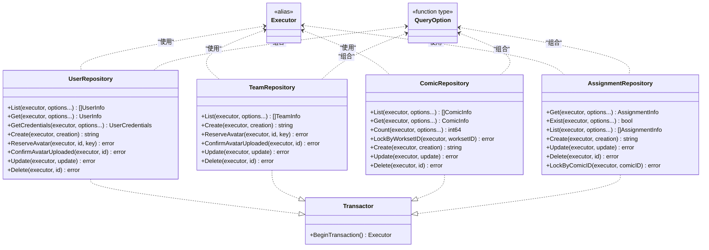
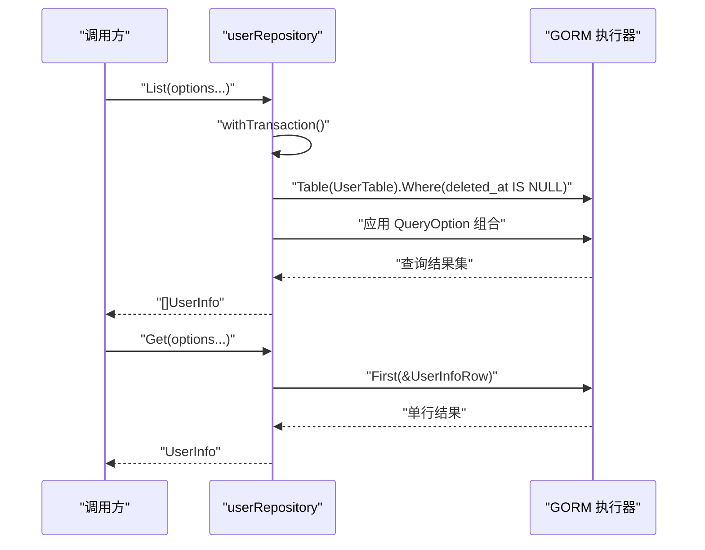
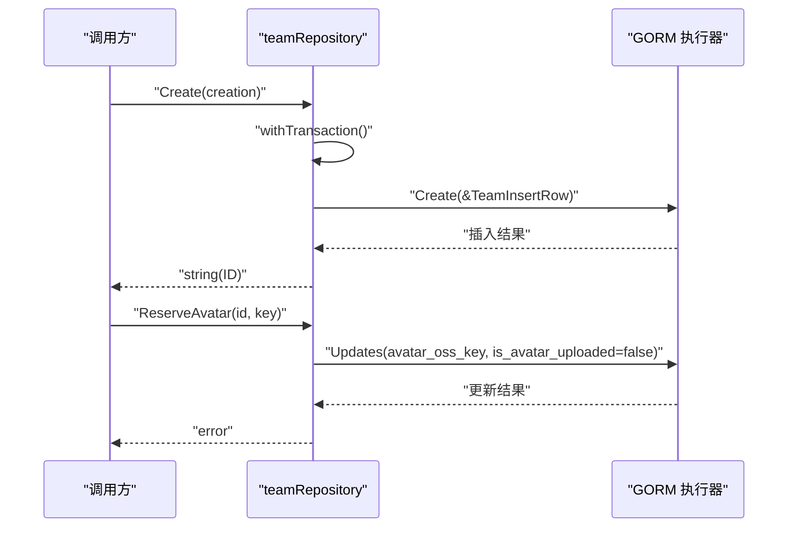
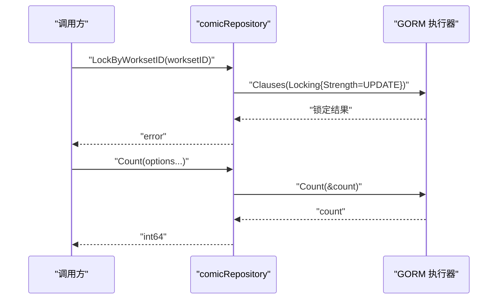
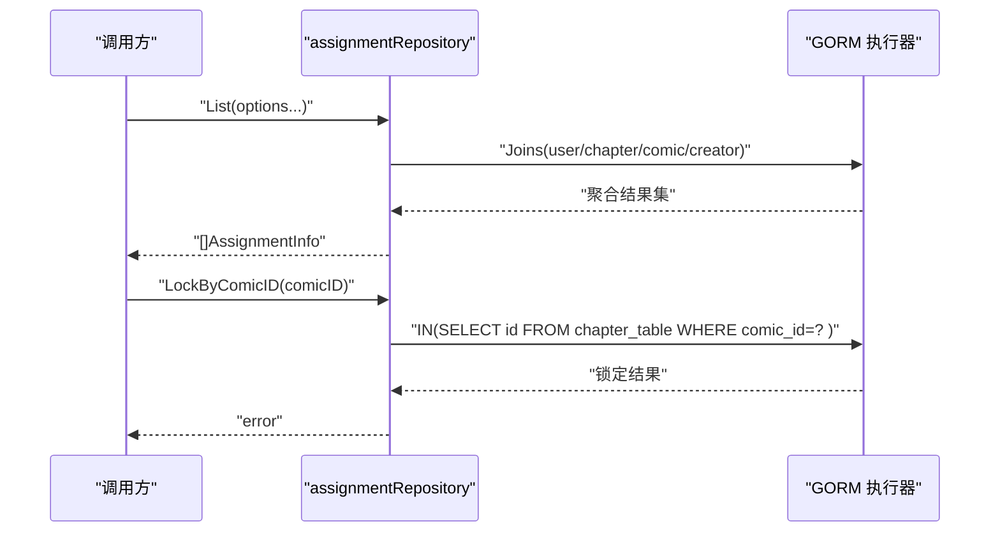
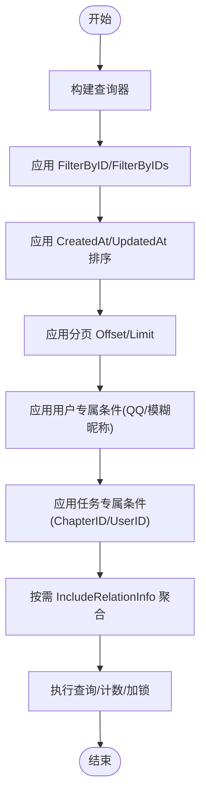
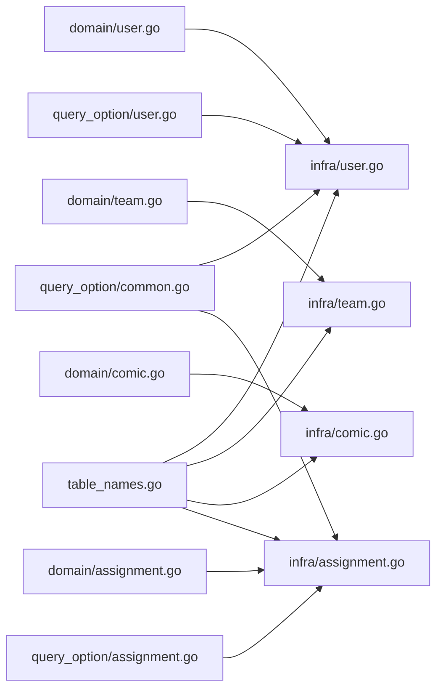

# 数据访问层

<cite>
**本文引用的文件**
- [internal/domain/repository/types.go](file://internal/domain/repository/types.go)
- [internal/infrastructure/repository/repository.go](file://internal/infrastructure/repository/repository.go)
- [internal/infrastructure/repository/result.go](file://internal/infrastructure/repository/result.go)
- [internal/infrastructure/repository/table_names.go](file://internal/infrastructure/repository/table_names.go)
- [internal/domain/repository/user.go](file://internal/domain/repository/user.go)
- [internal/domain/repository/team.go](file://internal/domain/repository/team.go)
- [internal/domain/repository/comic.go](file://internal/domain/repository/comic.go)
- [internal/domain/repository/assignment.go](file://internal/domain/repository/assignment.go)
- [internal/infrastructure/repository/user.go](file://internal/infrastructure/repository/user.go)
- [internal/infrastructure/repository/team.go](file://internal/infrastructure/repository/team.go)
- [internal/infrastructure/repository/comic.go](file://internal/infrastructure/repository/comic.go)
- [internal/infrastructure/repository/assignment.go](file://internal/infrastructure/repository/assignment.go)
- [internal/infrastructure/repository/query_option/common.go](file://internal/infrastructure/repository/query_option/common.go)
- [internal/infrastructure/repository/query_option/user.go](file://internal/infrastructure/repository/query_option/user.go)
- [internal/infrastructure/repository/query_option/assignment.go](file://internal/infrastructure/repository/query_option/assignment.go)
</cite>

## 目录
1. [引言](#引言)
2. [项目结构](#项目结构)
3. [核心组件](#核心组件)
4. [架构总览](#架构总览)
5. [详细组件分析](#详细组件分析)
6. [依赖分析](#依赖分析)
7. [性能考虑](#性能考虑)
8. [故障排查指南](#故障排查指南)
9. [结论](#结论)
10. [附录](#附录)

## 引言
本文件系统性阐述 poprako-web-ms 项目的“数据访问层”设计与实现，重点围绕仓储模式（Repository Pattern）展开，覆盖接口定义、具体实现、数据库交互逻辑、查询优化策略、事务与异常处理、以及可扩展性与性能优化建议。读者无需深入 Go 或数据库细节即可理解各仓储的职责与协作方式。

## 项目结构
数据访问层采用“领域接口 + 基于 GORM 的基础设施实现”的分层组织方式：
- 领域层定义仓储接口与通用类型（执行器、查询选项、事务接口）
- 基础设施层提供具体仓储实现，并通过 GORM 进行数据库操作
- 查询选项包提供可组合的查询条件与排序、分页能力
- 表名常量统一管理，避免在应用层直接使用裸字符串

```mermaid
graph TB
subgraph "领域层"
DTypes["types.go<br/>执行器/查询选项/事务接口"]
DUser["user.go<br/>UserRepository 接口"]
DTeam["team.go<br/>TeamRepository 接口"]
DComic["comic.go<br/>ComicRepository 接口"]
DAssign["assignment.go<br/>AssignmentRepository 接口"]
end
subgraph "基础设施层"
IRepo["repository.go<br/>NewDatabaseExecutor 初始化连接池"]
IResult["result.go<br/>导出 ErrRecordNotFound"]
ITables["table_names.go<br/>表名常量导出"]
IUser["user.go<br/>userRepository 实现"]
ITeam["team.go<br/>teamRepository 实现"]
IComic["comic.go<br/>comicRepository 实现"]
IAssign["assignment.go<br/>assignmentRepository 实现"]
end
subgraph "查询选项"
QCommon["common.go<br/>FilterByID/Order/Paginate"]
QUser["user.go<br/>UserQuery 条件"]
QAssign["assignment.go<br/>IncludeRelationInfo 等"]
end
DTypes --> IUser
DTypes --> ITeam
DTypes --> IComic
DTypes --> IAssign
IRepo --> IUser
IRepo --> ITeam
IRepo --> IComic
IRepo --> IAssign
ITables --> IUser
ITables --> ITeam
ITables --> IComic
ITables --> IAssign
QCommon --> IUser
QCommon --> IAssign
QUser --> IUser
QAssign --> IAssign
```

图表来源
- [internal/domain/repository/types.go:1-12](file://internal/domain/repository/types.go#L1-L12)
- [internal/infrastructure/repository/repository.go:1-30](file://internal/infrastructure/repository/repository.go#L1-L30)
- [internal/infrastructure/repository/result.go:1-6](file://internal/infrastructure/repository/result.go#L1-L6)
- [internal/infrastructure/repository/table_names.go:1-18](file://internal/infrastructure/repository/table_names.go#L1-L18)
- [internal/domain/repository/user.go:1-16](file://internal/domain/repository/user.go#L1-L16)
- [internal/domain/repository/team.go:1-14](file://internal/domain/repository/team.go#L1-L14)
- [internal/domain/repository/comic.go:1-15](file://internal/domain/repository/comic.go#L1-L15)
- [internal/domain/repository/assignment.go:1-15](file://internal/domain/repository/assignment.go#L1-L15)
- [internal/infrastructure/repository/user.go:1-150](file://internal/infrastructure/repository/user.go#L1-L150)
- [internal/infrastructure/repository/team.go:1-110](file://internal/infrastructure/repository/team.go#L1-L110)
- [internal/infrastructure/repository/comic.go:1-140](file://internal/infrastructure/repository/comic.go#L1-L140)
- [internal/infrastructure/repository/assignment.go:1-143](file://internal/infrastructure/repository/assignment.go#L1-L143)
- [internal/infrastructure/repository/query_option/common.go:1-51](file://internal/infrastructure/repository/query_option/common.go#L1-L51)
- [internal/infrastructure/repository/query_option/user.go:1-30](file://internal/infrastructure/repository/query_option/user.go#L1-L30)
- [internal/infrastructure/repository/query_option/assignment.go:1-112](file://internal/infrastructure/repository/query_option/assignment.go#L1-L112)

章节来源
- [internal/domain/repository/types.go:1-12](file://internal/domain/repository/types.go#L1-L12)
- [internal/infrastructure/repository/repository.go:1-30](file://internal/infrastructure/repository/repository.go#L1-L30)
- [internal/infrastructure/repository/table_names.go:1-18](file://internal/infrastructure/repository/table_names.go#L1-L18)

## 核心组件
- 执行器与查询选项
  - 执行器类型别名为 GORM 的数据库句柄，统一承载查询、事务与连接池配置
  - 查询选项为函数式组合器，支持链式构建 Where、Order、Limit/Offset 等
- 事务接口
  - 统一的 BeginTransaction 方法，便于上层在业务方法中显式开启事务
- 错误处理
  - 导出记录未找到错误常量，便于上层进行分支处理
- 表名常量
  - 将底层实体表名集中导出，避免应用层硬编码裸字符串

章节来源
- [internal/domain/repository/types.go:5-11](file://internal/domain/repository/types.go#L5-L11)
- [internal/infrastructure/repository/result.go:5](file://internal/infrastructure/repository/result.go#L5)
- [internal/infrastructure/repository/table_names.go:6-17](file://internal/infrastructure/repository/table_names.go#L6-L17)

## 架构总览
数据访问层遵循“接口在上、实现于下”的分层原则：领域层仅感知抽象接口，基础设施层负责具体实现；查询选项作为纯函数组合器贯穿于仓储方法，保证查询构建的可读性与可维护性。

图表来源
- [internal/domain/repository/types.go:5-11](file://internal/domain/repository/types.go#L5-L11)
- [internal/domain/repository/user.go:5-15](file://internal/domain/repository/user.go#L5-L15)
- [internal/domain/repository/team.go:5-13](file://internal/domain/repository/team.go#L5-L13)
- [internal/domain/repository/comic.go:5-14](file://internal/domain/repository/comic.go#L5-L14)
- [internal/domain/repository/assignment.go:5-14](file://internal/domain/repository/assignment.go#L5-L14)

## 详细组件分析

### 用户仓储（UserRepository）
- 职责
  - 列表与单条查询（含软删除过滤）
  - 凭证读取（ID+密码哈希）
  - 头像预留与上传确认
  - 创建、更新、删除（软删除）
- 关键实现要点
  - 使用表名常量与带软删除过滤的 Where 条件
  - 通过查询选项组合 Where/Order/Limit/Offset
  - 事务由 Transactor 提供，支持外部传入或默认执行器
- 典型调用序列

图表来源
- [internal/infrastructure/repository/user.go:32-71](file://internal/infrastructure/repository/user.go#L32-L71)
- [internal/infrastructure/repository/table_names.go:7](file://internal/infrastructure/repository/table_names.go#L7)
- [internal/infrastructure/repository/query_option/common.go:15-25](file://internal/infrastructure/repository/query_option/common.go#L15-L25)

章节来源
- [internal/domain/repository/user.go:5-15](file://internal/domain/repository/user.go#L5-L15)
- [internal/infrastructure/repository/user.go:32-150](file://internal/infrastructure/repository/user.go#L32-L150)
- [internal/infrastructure/repository/query_option/user.go:15-29](file://internal/infrastructure/repository/query_option/user.go#L15-L29)

### 团队仓储（TeamRepository）
- 职责
  - 列表、创建、头像预留/确认、更新、删除（软删除）
- 关键实现要点
  - 与用户仓储一致的软删除过滤与查询选项组合
  - 插入时生成 UUID 并设置默认字段
- 典型调用序列

图表来源
- [internal/infrastructure/repository/team.go:53-88](file://internal/infrastructure/repository/team.go#L53-L88)
- [internal/infrastructure/repository/table_names.go:9](file://internal/infrastructure/repository/table_names.go#L9)

章节来源
- [internal/domain/repository/team.go:5-13](file://internal/domain/repository/team.go#L5-L13)
- [internal/infrastructure/repository/team.go:31-110](file://internal/infrastructure/repository/team.go#L31-L110)

### 漫画仓储（ComicRepository）
- 职责
  - 列表、详情、计数、按工作集加锁、创建、更新、删除（软删除）
- 关键实现要点
  - 计数与列表均对 deleted_at 进行过滤
  - 加锁使用 GORM 锁定子句，确保并发安全
- 典型调用序列

图表来源
- [internal/infrastructure/repository/comic.go:72-97](file://internal/infrastructure/repository/comic.go#L72-L97)
- [internal/infrastructure/repository/comic.go:84-97](file://internal/infrastructure/repository/comic.go#L84-L97)

章节来源
- [internal/domain/repository/comic.go:5-14](file://internal/domain/repository/comic.go#L5-L14)
- [internal/infrastructure/repository/comic.go:34-140](file://internal/infrastructure/repository/comic.go#L34-L140)

### 任务仓储（AssignmentRepository）
- 职责
  - 单条、存在性检查、列表、创建、更新、删除
  - 按漫画 ID 加锁（通过章节反查）
- 关键实现要点
  - 支持 IncludeRelationInfo 聚合用户、章节、漫画、章节创建者信息
  - 更新字段映射到 assignment_table 的多角色时间戳字段
- 典型调用序列

图表来源
- [internal/infrastructure/repository/assignment.go:61-80](file://internal/infrastructure/repository/assignment.go#L61-L80)
- [internal/infrastructure/repository/assignment.go:133-142](file://internal/infrastructure/repository/assignment.go#L133-L142)
- [internal/infrastructure/repository/query_option/assignment.go:29-101](file://internal/infrastructure/repository/query_option/assignment.go#L29-L101)

章节来源
- [internal/domain/repository/assignment.go:5-14](file://internal/domain/repository/assignment.go#L5-L14)
- [internal/infrastructure/repository/assignment.go:29-143](file://internal/infrastructure/repository/assignment.go#L29-L143)
- [internal/infrastructure/repository/query_option/assignment.go:15-112](file://internal/infrastructure/repository/query_option/assignment.go#L15-L112)

### 查询选项与组合
- 通用查询选项
  - ID 精确过滤、ID 列表过滤、按创建/更新时间升/降序、分页
  - 统一使用表名前缀，避免裸字段
- 用户专属查询
  - QQ 精确匹配、昵称模糊匹配
- 任务专属查询
  - 按章节/用户 ID 过滤
  - IncludeRelationInfo 支持按需联接用户、章节、漫画、章节创建者，并选择性 select 聚合字段

图表来源
- [internal/infrastructure/repository/query_option/common.go:15-50](file://internal/infrastructure/repository/query_option/common.go#L15-L50)
- [internal/infrastructure/repository/query_option/user.go:15-29](file://internal/infrastructure/repository/query_option/user.go#L15-L29)
- [internal/infrastructure/repository/query_option/assignment.go:15-101](file://internal/infrastructure/repository/query_option/assignment.go#L15-L101)

章节来源
- [internal/infrastructure/repository/query_option/common.go:9-50](file://internal/infrastructure/repository/query_option/common.go#L9-L50)
- [internal/infrastructure/repository/query_option/user.go:15-29](file://internal/infrastructure/repository/query_option/user.go#L15-L29)
- [internal/infrastructure/repository/query_option/assignment.go:29-101](file://internal/infrastructure/repository/query_option/assignment.go#L29-L101)

## 依赖分析
- 仓储接口与实现
  - 领域接口仅依赖模型与通用类型，不依赖具体数据库驱动
  - 基础设施实现依赖 GORM、实体层与工具库
- 查询选项
  - 通用选项与领域专属选项解耦，便于复用与扩展
- 表名常量
  - 为上层提供统一的表名引用，降低耦合度

图表来源
- [internal/domain/repository/user.go:5-15](file://internal/domain/repository/user.go#L5-L15)
- [internal/infrastructure/repository/user.go:12-18](file://internal/infrastructure/repository/user.go#L12-L18)
- [internal/domain/repository/team.go:5-13](file://internal/domain/repository/team.go#L5-L13)
- [internal/infrastructure/repository/team.go:12-18](file://internal/infrastructure/repository/team.go#L12-L18)
- [internal/domain/repository/comic.go:5-14](file://internal/domain/repository/comic.go#L5-L14)
- [internal/infrastructure/repository/comic.go:14-20](file://internal/infrastructure/repository/comic.go#L14-L20)
- [internal/domain/repository/assignment.go:5-14](file://internal/domain/repository/assignment.go#L5-L14)
- [internal/infrastructure/repository/assignment.go:10-16](file://internal/infrastructure/repository/assignment.go#L10-L16)
- [internal/infrastructure/repository/query_option/common.go:15-50](file://internal/infrastructure/repository/query_option/common.go#L15-L50)
- [internal/infrastructure/repository/query_option/user.go:15-29](file://internal/infrastructure/repository/query_option/user.go#L15-L29)
- [internal/infrastructure/repository/query_option/assignment.go:15-101](file://internal/infrastructure/repository/query_option/assignment.go#L15-L101)
- [internal/infrastructure/repository/table_names.go:6-17](file://internal/infrastructure/repository/table_names.go#L6-L17)

章节来源
- [internal/infrastructure/repository/user.go:12-18](file://internal/infrastructure/repository/user.go#L12-L18)
- [internal/infrastructure/repository/team.go:12-18](file://internal/infrastructure/repository/team.go#L12-L18)
- [internal/infrastructure/repository/comic.go:14-20](file://internal/infrastructure/repository/comic.go#L14-L20)
- [internal/infrastructure/repository/assignment.go:10-16](file://internal/infrastructure/repository/assignment.go#L10-L16)

## 性能考虑
- 连接池与并发
  - 初始化时设置最大空闲连接与最大打开连接数，避免连接争用
- 查询优化
  - 使用 IncludeRelationInfo 按需联接，减少 N+1 查询
  - 对高频查询建立合适索引（如用户 QQ、任务的 chapter_id/user_id）
- 分页与排序
  - 优先使用基于索引的排序字段（created_at/updated_at）与稳定的分页策略
- 锁定与并发
  - 漫画与任务加锁使用数据库锁定子句，避免竞态条件
- 缓存建议
  - 对热点只读数据（如团队基础信息）引入二级缓存，结合失效策略
  - 对聚合查询结果进行短期缓存，降低联接成本

章节来源
- [internal/infrastructure/repository/repository.go:25-26](file://internal/infrastructure/repository/repository.go#L25-L26)
- [internal/infrastructure/repository/comic.go:72-82](file://internal/infrastructure/repository/comic.go#L72-L82)
- [internal/infrastructure/repository/assignment.go:133-142](file://internal/infrastructure/repository/assignment.go#L133-L142)
- [internal/infrastructure/repository/query_option/assignment.go:29-101](file://internal/infrastructure/repository/query_option/assignment.go#L29-L101)

## 故障排查指南
- 常见错误
  - 记录未找到：使用导出的记录未找到错误常量进行判断与分支处理
  - 连接失败：检查数据库连接 URL 与连接池参数
- 事务问题
  - 明确开启事务边界，确保异常时回滚
  - 对需要强一致性的流程（如头像预留与确认）使用同一事务
- 查询问题
  - 若出现慢查询，检查是否遗漏必要索引或过度联接
  - 使用 IncludeRelationInfo 时注意字段选择，避免不必要的列传输

章节来源
- [internal/infrastructure/repository/result.go:5](file://internal/infrastructure/repository/result.go#L5)
- [internal/infrastructure/repository/repository.go:11-29](file://internal/infrastructure/repository/repository.go#L11-L29)
- [internal/infrastructure/repository/user.go:108-127](file://internal/infrastructure/repository/user.go#L108-L127)
- [internal/infrastructure/repository/team.go:69-88](file://internal/infrastructure/repository/team.go#L69-L88)

## 结论
本数据访问层通过清晰的接口分层、可组合的查询选项与统一的事务/错误处理机制，实现了高内聚、低耦合的数据访问能力。配合查询优化与缓存策略，可在保证一致性的同时提升整体性能与可维护性。

## 附录

### 事务处理与异常处理机制
- 事务
  - 通过 Transactor 接口统一开启事务，仓储实现内部根据是否传入外部执行器决定使用哪个上下文
- 异常
  - 导出记录未找到错误常量，便于上层区分“无记录”与“其他错误”
  - 其他数据库错误通过 GORM 返回，上层可根据场景进行重试或降级

章节来源
- [internal/domain/repository/types.go:9-11](file://internal/domain/repository/types.go#L9-L11)
- [internal/infrastructure/repository/result.go:5](file://internal/infrastructure/repository/result.go#L5)
- [internal/infrastructure/repository/user.go:20-30](file://internal/infrastructure/repository/user.go#L20-L30)
- [internal/infrastructure/repository/team.go:20-29](file://internal/infrastructure/repository/team.go#L20-L29)
- [internal/infrastructure/repository/comic.go:22-32](file://internal/infrastructure/repository/comic.go#L22-L32)
- [internal/infrastructure/repository/assignment.go:18-27](file://internal/infrastructure/repository/assignment.go#L18-L27)

### 扩展指南
- 新增仓储
  - 在领域层定义接口，遵循现有命名与职责划分
  - 在基础设施层实现具体仓储，复用 withTransaction、表名常量与查询选项
- 新增查询条件
  - 在对应 query_option 包中新增函数式选项，保持表名前缀与组合规则
- 新增聚合字段
  - 在任务查询选项中扩展 IncludeRelationInfo 的联接与 select 字段

章节来源
- [internal/domain/repository/user.go:5-15](file://internal/domain/repository/user.go#L5-L15)
- [internal/infrastructure/repository/query_option/assignment.go:29-101](file://internal/infrastructure/repository/query_option/assignment.go#L29-L101)

### 单元测试建议
- 测试目标
  - 覆盖 CRUD、软删除、加锁、事务边界、查询选项组合、错误路径
- 测试策略
  - 使用内存数据库或测试专用数据库实例，隔离测试环境
  - 对每个仓储编写独立测试套件，模拟不同查询选项与异常场景
  - 对事务相关逻辑进行集成测试，验证提交/回滚行为

章节来源
- [internal/infrastructure/repository/user.go:32-150](file://internal/infrastructure/repository/user.go#L32-L150)
- [internal/infrastructure/repository/team.go:31-110](file://internal/infrastructure/repository/team.go#L31-L110)
- [internal/infrastructure/repository/comic.go:34-140](file://internal/infrastructure/repository/comic.go#L34-L140)
- [internal/infrastructure/repository/assignment.go:29-143](file://internal/infrastructure/repository/assignment.go#L29-L143)