# 查询选项

<cite>
**本文引用的文件**
- [common.go](file://internal/infrastructure/repository/query_option/common.go)
- [assignment.go](file://internal/infrastructure/repository/query_option/assignment.go)
- [chapter.go](file://internal/infrastructure/repository/query_option/chapter.go)
- [comic.go](file://internal/infrastructure/repository/query_option/comic.go)
- [member.go](file://internal/infrastructure/repository/query_option/member.go)
- [page.go](file://internal/infrastructure/repository/query_option/page.go)
- [team.go](file://internal/infrastructure/repository/query_option/team.go)
- [unit.go](file://internal/infrastructure/repository/query_option/unit.go)
- [user.go](file://internal/infrastructure/repository/query_option/user.go)
- [workset.go](file://internal/infrastructure/repository/query_option/workset.go)
- [types.go](file://internal/domain/repository/types.go)
- [repository.go](file://internal/infrastructure/repository/repository.go)
- [loader.go](file://internal/application/adapter/loader.go)
- [assignment.go](file://internal/application/assignment.go)
- [chapter.go](file://internal/application/chapter.go)
</cite>

## 目录
1. [简介](#简介)
2. [项目结构](#项目结构)
3. [核心组件](#核心组件)
4. [架构总览](#架构总览)
5. [详细组件分析](#详细组件分析)
6. [依赖分析](#依赖分析)
7. [性能考量](#性能考量)
8. [故障排查指南](#故障排查指南)
9. [结论](#结论)
10. [附录：使用示例与最佳实践](#附录使用示例与最佳实践)

## 简介
本文件系统性阐述“查询选项”的设计模式与实现机制，覆盖通用查询选项与各实体专属查询选项；详解如何组合使用查询选项、构建条件与设置排序；说明分页处理、过滤器应用与结果集优化策略，并提供可直接参考的使用示例与性能优化建议。该体系通过统一的 QueryOption 函数类型对底层执行器进行链式装饰，确保查询逻辑清晰、可组合、可维护。

## 项目结构
查询选项位于基础设施层的仓库实现中，按领域模型拆分子包，每个子包提供对应实体的查询选项构造函数。公共查询选项集中在通用包中，便于跨实体复用。

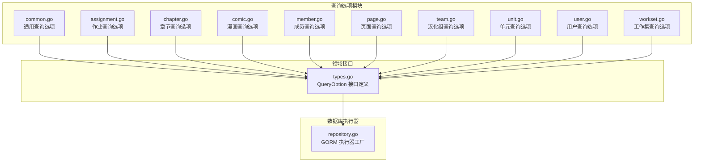

图表来源
- [common.go:1-51](file://internal/infrastructure/repository/query_option/common.go#L1-L51)
- [assignment.go:1-112](file://internal/infrastructure/repository/query_option/assignment.go#L1-L112)
- [chapter.go:1-41](file://internal/infrastructure/repository/query_option/chapter.go#L1-L41)
- [comic.go:1-91](file://internal/infrastructure/repository/query_option/comic.go#L1-L91)
- [member.go:1-81](file://internal/infrastructure/repository/query_option/member.go#L1-L81)
- [page.go:1-40](file://internal/infrastructure/repository/query_option/page.go#L1-L40)
- [team.go:1-8](file://internal/infrastructure/repository/query_option/team.go#L1-L8)
- [unit.go:1-22](file://internal/infrastructure/repository/query_option/unit.go#L1-L22)
- [user.go:1-30](file://internal/infrastructure/repository/query_option/user.go#L1-L30)
- [workset.go:1-38](file://internal/infrastructure/repository/query_option/workset.go#L1-L38)
- [types.go:1-12](file://internal/domain/repository/types.go#L1-L12)
- [repository.go:1-30](file://internal/infrastructure/repository/repository.go#L1-L30)

章节来源
- [common.go:1-51](file://internal/infrastructure/repository/query_option/common.go#L1-L51)
- [types.go:1-12](file://internal/domain/repository/types.go#L1-L12)
- [repository.go:1-30](file://internal/infrastructure/repository/repository.go#L1-L30)

## 核心组件
- QueryOption 类型：统一的查询装饰器函数类型，接收并返回底层执行器，支持链式组合。
- Executor：底层执行器抽象，当前实现基于 GORM 的数据库会话。
- 通用查询选项：提供跨实体复用的能力，如按 ID 过滤、批量 ID 过滤、创建时间/更新时间排序、分页等。
- 实体专属查询选项：针对具体实体提供过滤、排序与关联聚合查询能力。

章节来源
- [types.go:1-12](file://internal/domain/repository/types.go#L1-L12)
- [common.go:15-50](file://internal/infrastructure/repository/query_option/common.go#L15-L50)

## 架构总览
查询选项采用“函数式装饰器”模式，围绕统一的 QueryOption 接口对执行器进行逐步增强。调用方通过组合多个 QueryOption 来表达复杂的查询意图，最终由仓储层或应用层将这些选项应用于执行器并执行。

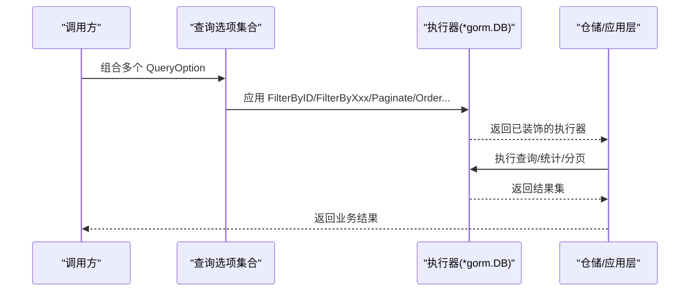

图表来源
- [types.go:7](file://internal/domain/repository/types.go#L7)
- [common.go:15-50](file://internal/infrastructure/repository/query_option/common.go#L15-L50)
- [assignment.go:15-25](file://internal/infrastructure/repository/query_option/assignment.go#L15-L25)
- [chapter.go:12-23](file://internal/infrastructure/repository/query_option/chapter.go#L12-L23)
- [comic.go:14-32](file://internal/infrastructure/repository/query_option/comic.go#L14-L32)
- [member.go:14-32](file://internal/infrastructure/repository/query_option/member.go#L14-L32)
- [page.go:11-21](file://internal/infrastructure/repository/query_option/page.go#L11-L21)
- [unit.go:11-21](file://internal/infrastructure/repository/query_option/unit.go#L11-L21)
- [user.go:16-29](file://internal/infrastructure/repository/query_option/user.go#L16-L29)
- [workset.go:13-25](file://internal/infrastructure/repository/query_option/workset.go#L13-L25)

## 详细组件分析

### 通用查询选项（common.go）
- ID 精确过滤：提供按主表 id 精确匹配的过滤器，避免在不同查询中重复定义。
- 批量 ID 过滤：支持 IN 查询，减少多次往返。
- 时间排序：按创建时间/更新时间升序或降序排序。
- 分页：提供偏移与限制的分页选项，配合排序使用以保证结果稳定。

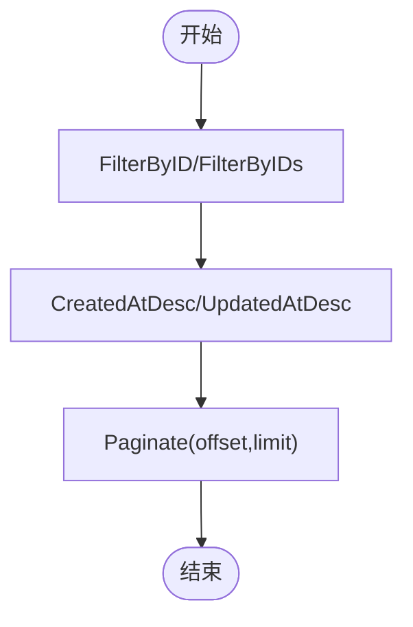

图表来源
- [common.go:15-50](file://internal/infrastructure/repository/query_option/common.go#L15-L50)

章节来源
- [common.go:9-19](file://internal/infrastructure/repository/query_option/common.go#L9-L19)
- [common.go:39-43](file://internal/infrastructure/repository/query_option/common.go#L39-L43)
- [common.go:45-50](file://internal/infrastructure/repository/query_option/common.go#L45-L50)

### 作业（assignment.go）
- 过滤：按章节 ID 或用户 ID 过滤作业。
- 关联聚合：支持按需拼接用户、章节、章节所属漫画、章节创建者信息，动态选择字段，避免 N+1 查询。
- 兼容方法：提供便捷方法以复用复杂聚合配置。

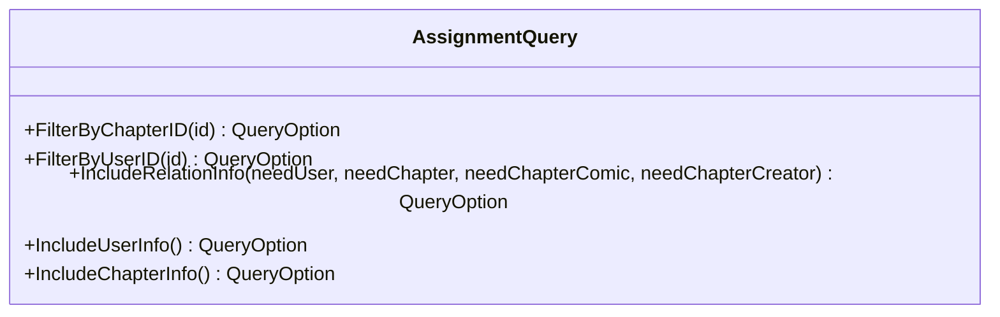

图表来源
- [assignment.go:9-112](file://internal/infrastructure/repository/query_option/assignment.go#L9-L112)

章节来源
- [assignment.go:15-25](file://internal/infrastructure/repository/query_option/assignment.go#L15-L25)
- [assignment.go:29-101](file://internal/infrastructure/repository/query_option/assignment.go#L29-L101)
- [assignment.go:104-111](file://internal/infrastructure/repository/query_option/assignment.go#L104-L111)

### 章节（chapter.go）
- 过滤：按漫画 ID 过滤章节。
- 排序：按章节索引降序排序。
- 关联聚合：拼接章节创建者信息，返回章节与创建者字段。

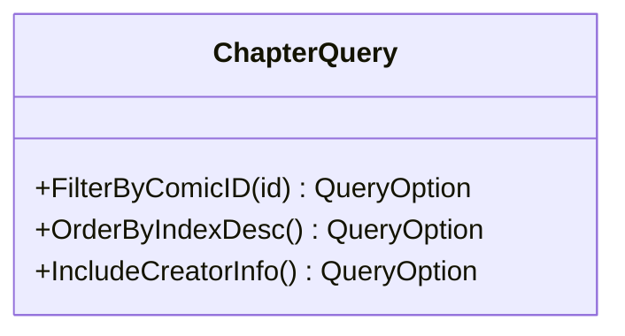

图表来源
- [chapter.go:5-41](file://internal/infrastructure/repository/query_option/chapter.go#L5-L41)

章节来源
- [chapter.go:12-23](file://internal/infrastructure/repository/query_option/chapter.go#L12-L23)
- [chapter.go:26-40](file://internal/infrastructure/repository/query_option/chapter.go#L26-L40)

### 漫画（comic.go）
- 过滤：按创建者 ID 或工作集 ID 过滤漫画。
- 排序：按最后活跃时间降序排序。
- 关联聚合：支持拼接工作集与创建者信息，或仅拼接其一。

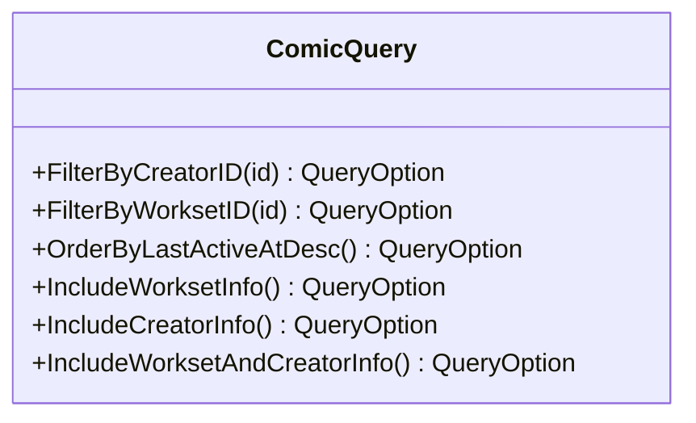

图表来源
- [comic.go:7-91](file://internal/infrastructure/repository/query_option/comic.go#L7-L91)

章节来源
- [comic.go:14-32](file://internal/infrastructure/repository/query_option/comic.go#L14-L32)
- [comic.go:35-90](file://internal/infrastructure/repository/query_option/comic.go#L35-L90)

### 成员（member.go）
- 过滤：按用户 ID、汉化组 ID 过滤；支持跨表过滤（如按用户 QQ）。
- 关联聚合：支持拼接用户与汉化组信息，返回成员与关联字段。

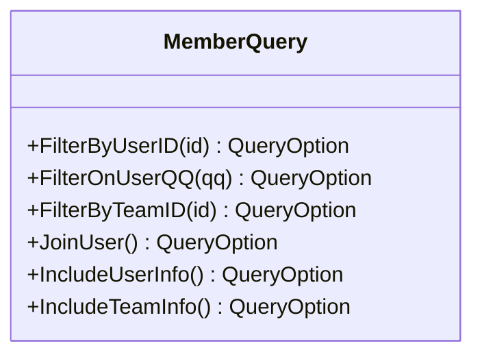

图表来源
- [member.go:7-81](file://internal/infrastructure/repository/query_option/member.go#L7-L81)

章节来源
- [member.go:14-32](file://internal/infrastructure/repository/query_option/member.go#L14-L32)
- [member.go:35-60](file://internal/infrastructure/repository/query_option/member.go#L35-L60)
- [member.go:63-80](file://internal/infrastructure/repository/query_option/member.go#L63-L80)

### 页面（page.go）
- 过滤：按章节 ID 过滤页面。
- 排序：按页面索引升序排序。
- 关联聚合：拼接页面创建者信息。

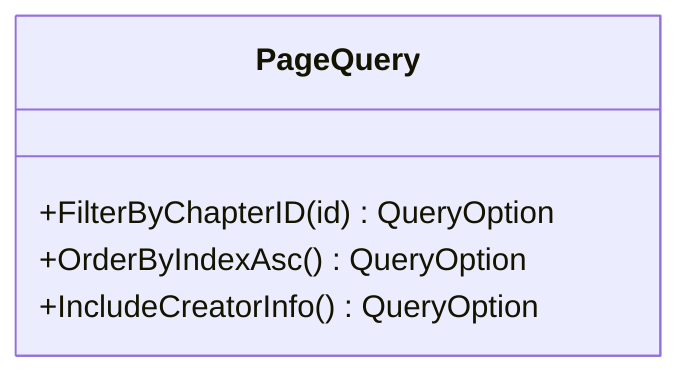

图表来源
- [page.go:5-40](file://internal/infrastructure/repository/query_option/page.go#L5-L40)

章节来源
- [page.go:11-21](file://internal/infrastructure/repository/query_option/page.go#L11-L21)
- [page.go:24-39](file://internal/infrastructure/repository/query_option/page.go#L24-L39)

### 单元（unit.go）
- 过滤：按页面 ID 过滤单元。
- 排序：按单元索引升序排序。

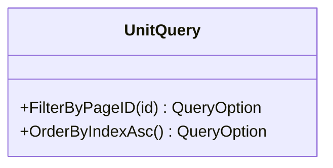

图表来源
- [unit.go:5-22](file://internal/infrastructure/repository/query_option/unit.go#L5-L22)

章节来源
- [unit.go:11-21](file://internal/infrastructure/repository/query_option/unit.go#L11-L21)

### 用户（user.go）
- 过滤：按 QQ 号精确匹配；按昵称模糊匹配。
- 适用场景：登录、搜索、权限校验等。

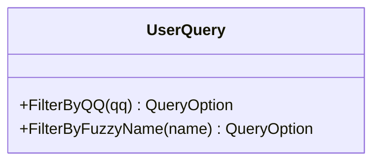

图表来源
- [user.go:9-30](file://internal/infrastructure/repository/query_option/user.go#L9-L30)

章节来源
- [user.go:16-29](file://internal/infrastructure/repository/query_option/user.go#L16-L29)

### 工作集（workset.go）
- 过滤：按汉化组 ID 过滤工作集。
- 排序：按索引升序排序。
- 关联聚合：拼接所属汉化组信息。

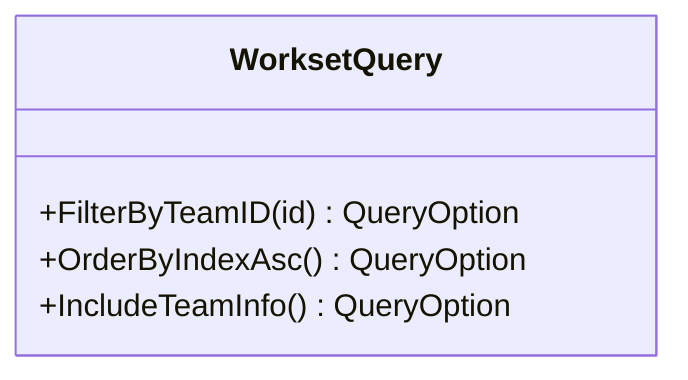

图表来源
- [workset.go:7-38](file://internal/infrastructure/repository/query_option/workset.go#L7-L38)

章节来源
- [workset.go:13-25](file://internal/infrastructure/repository/query_option/workset.go#L13-L25)
- [workset.go:28-37](file://internal/infrastructure/repository/query_option/workset.go#L28-L37)

### 汉化组（team.go）
- 当前提供空查询选项构造器，预留扩展空间。

章节来源
- [team.go:1-8](file://internal/infrastructure/repository/query_option/team.go#L1-L8)

## 依赖分析
- 统一接口：所有查询选项均实现同一接口，确保组合与传递的一致性。
- 执行器抽象：通过接口隔离底层实现，便于替换与测试。
- 外部依赖：执行器基于 GORM，查询选项通过链式调用增强执行器能力。

图表来源
- [types.go:7](file://internal/domain/repository/types.go#L7)
- [repository.go:11-29](file://internal/infrastructure/repository/repository.go#L11-L29)

章节来源
- [types.go:1-12](file://internal/domain/repository/types.go#L1-L12)
- [repository.go:1-30](file://internal/infrastructure/repository/repository.go#L1-L30)

## 性能考量
- 避免裸字段与跨表条件：通用规则要求字段使用完整表名前缀，跨表条件使用专门的 OnXxx 方法，降低 SQL 错误风险并提升可读性与可维护性。
- 关联聚合按需加载：通过布尔参数控制关联字段拼接，避免不必要的 JOIN 与 SELECT 列，减少网络与解析开销。
- 使用批量 ID 过滤：优先使用批量 IN 查询替代多条单值查询，降低往返次数。
- 合理使用分页与排序：分页需配合稳定的排序字段，避免数据抖动；排序字段应建立合适索引。
- 连接池配置：通过执行器工厂设置连接池参数，平衡并发与资源占用。

章节来源
- [common.go:9-13](file://internal/infrastructure/repository/query_option/common.go#L9-L13)
- [common.go:39-43](file://internal/infrastructure/repository/query_option/common.go#L39-L43)
- [repository.go:25-27](file://internal/infrastructure/repository/repository.go#L25-L27)

## 故障排查指南
- 条件未生效：检查是否使用了正确的过滤器（主表 vs 跨表），确认字段是否带完整表名前缀。
- 结果不一致：确认是否遗漏分页与排序组合，确保排序字段稳定且有索引。
- 关联字段缺失：检查聚合方法的布尔参数是否正确开启，确认 JOIN 条件与别名一致。
- 性能问题：优先排查是否存在 N+1 查询、是否遗漏批量 ID 过滤、是否对排序字段建立索引。

章节来源
- [common.go:9-13](file://internal/infrastructure/repository/query_option/common.go#L9-L13)
- [assignment.go:29-101](file://internal/infrastructure/repository/query_option/assignment.go#L29-L101)
- [chapter.go:26-40](file://internal/infrastructure/repository/query_option/chapter.go#L26-L40)
- [comic.go:35-90](file://internal/infrastructure/repository/query_option/comic.go#L35-L90)
- [member.go:35-80](file://internal/infrastructure/repository/query_option/member.go#L35-L80)
- [page.go:24-39](file://internal/infrastructure/repository/query_option/page.go#L24-L39)
- [workset.go:28-37](file://internal/infrastructure/repository/query_option/workset.go#L28-L37)

## 结论
查询选项通过统一的装饰器模式，将过滤、排序、分页与关联聚合等能力以可组合的方式提供给上层应用与仓储层。遵循通用规则与按需聚合原则，可在保证可读性的同时显著提升查询性能与可维护性。

## 附录：使用示例与最佳实践
以下示例展示如何在应用层组合使用查询选项，涵盖过滤、排序、分页与关联聚合。请根据实际业务参数替换占位符。

- 获取指定用户的作业列表（含章节与漫画信息）
  - 组合：按用户 ID 过滤 + 按章节索引降序 + 关联章节与漫画信息 + 分页
  - 示例路径：[assignment.go:123-133](file://internal/application/assignment.go#L123-L133)

- 获取指定漫画的所有章节（含创建者信息）
  - 组合：按漫画 ID 过滤 + 按章节索引降序 + 关联创建者信息
  - 示例路径：[chapter.go:197-205](file://internal/application/chapter.go#L197-L205)

- 获取指定成员的用户与汉化组信息
  - 组合：按用户 ID 过滤 + 关联用户与汉化组信息
  - 示例路径：[loader.go:19-20](file://internal/application/adapter/loader.go#L19-L20)

- 获取指定页面的所有单元（按单元索引升序）
  - 组合：按页面 ID 过滤 + 按单元索引升序
  - 示例路径：[unit.go:178-188](file://internal/application/assignment.go#L178-L188)

- 搜索用户（按昵称模糊匹配）
  - 组合：按昵称模糊匹配
  - 示例路径：[user.go:23-29](file://internal/infrastructure/repository/query_option/user.go#L23-L29)

- 获取指定工作集下的漫画（按最后活跃时间降序）
  - 组合：按工作集 ID 过滤 + 按最后活跃时间降序 + 关联创建者信息
  - 示例路径：[comic.go:14-32](file://internal/infrastructure/repository/query_option/comic.go#L14-L32)

- 通用组合范式
  - 过滤：优先使用 FilterByID/FilterByIDs，跨表使用 FilterOnXxx
  - 排序：配合 Paginate 使用稳定的排序字段
  - 关联：按需开启 IncludeXxx，避免全量字段拼接
  - 示例路径：[common.go:15-50](file://internal/infrastructure/repository/query_option/common.go#L15-L50)

章节来源
- [assignment.go:123-133](file://internal/application/assignment.go#L123-L133)
- [chapter.go:197-205](file://internal/application/chapter.go#L197-L205)
- [loader.go:19-20](file://internal/application/adapter/loader.go#L19-L20)
- [user.go:23-29](file://internal/infrastructure/repository/query_option/user.go#L23-L29)
- [comic.go:14-32](file://internal/infrastructure/repository/query_option/comic.go#L14-L32)
- [common.go:15-50](file://internal/infrastructure/repository/query_option/common.go#L15-L50)