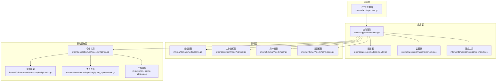
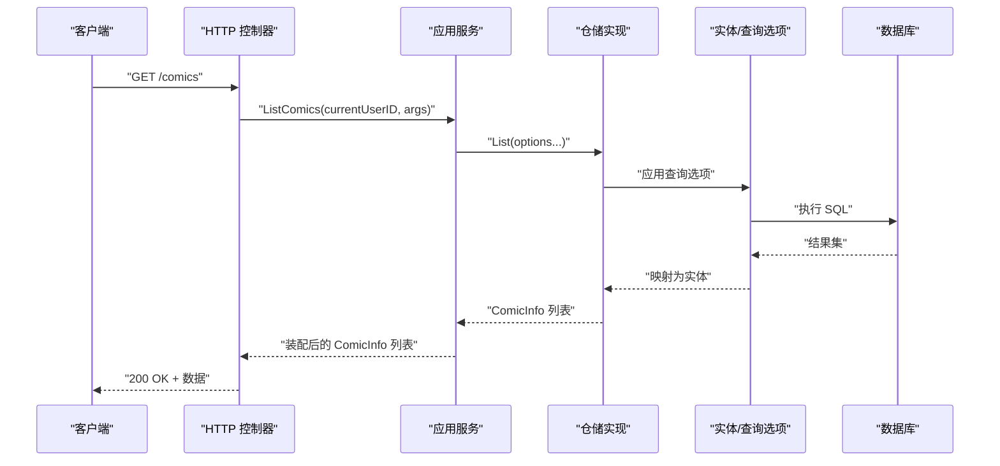
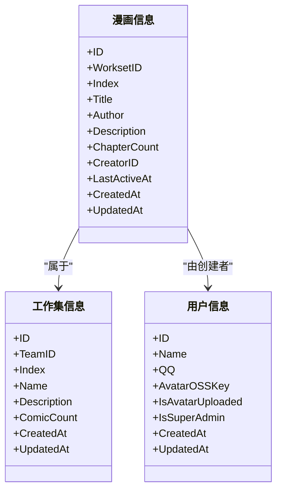
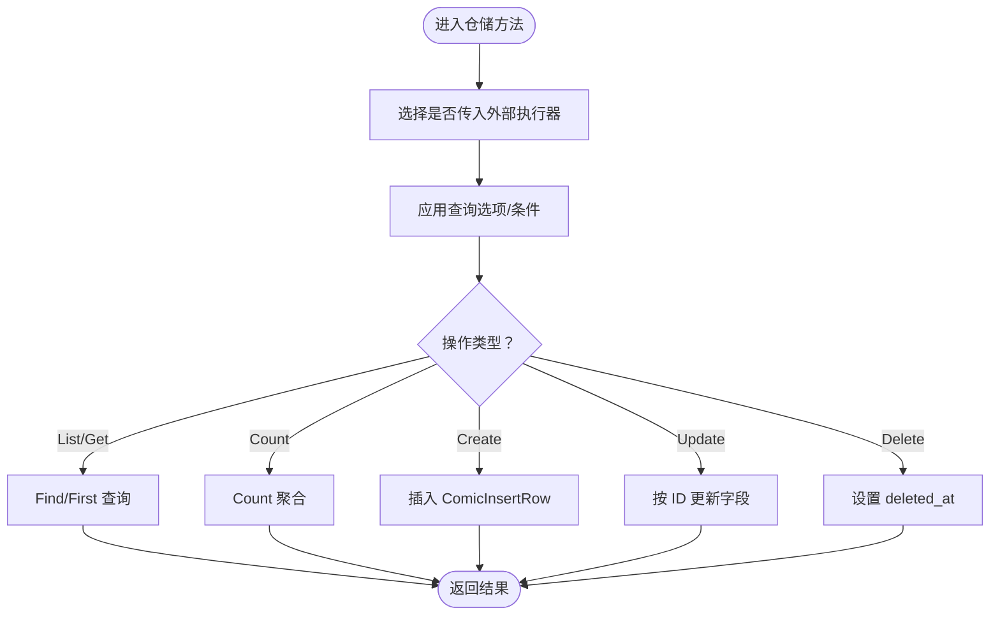
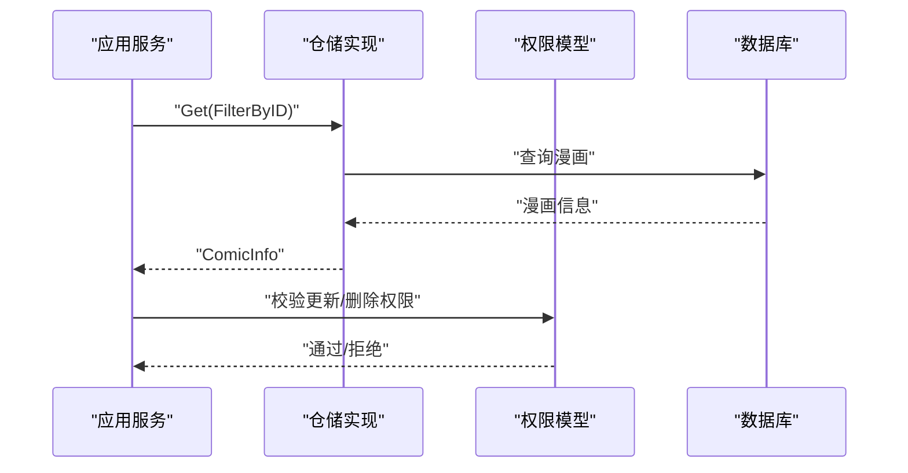
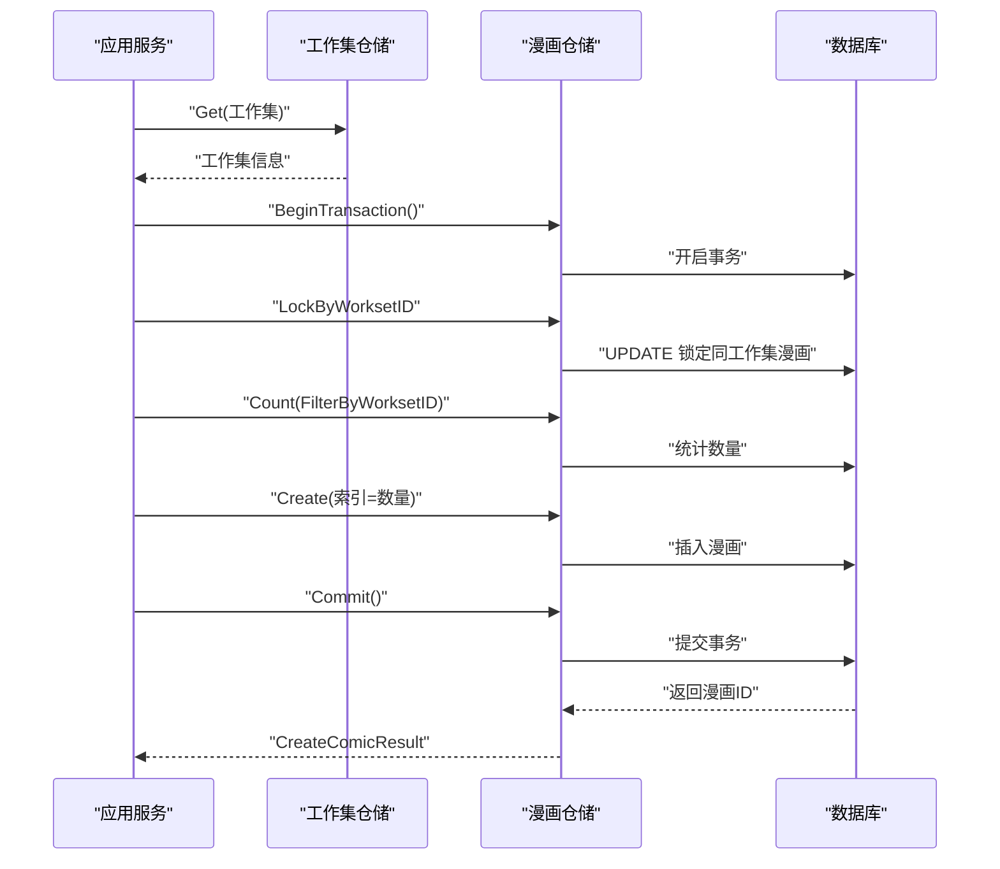
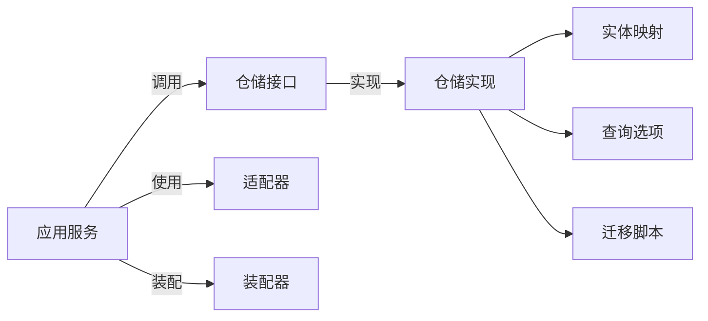

# 漫画仓储

<cite>
**本文引用的文件**   
- [internal/domain/model/comic.go](file://internal/domain/model/comic.go)
- [internal/domain/repository/comic.go](file://internal/domain/repository/comic.go)
- [internal/application/comic.go](file://internal/application/comic.go)
- [internal/application/assembler/comic.go](file://internal/application/assembler/comic.go)
- [internal/application/adapter/loader.go](file://internal/application/adapter/loader.go)
- [internal/domain/service/comic_include.go](file://internal/domain/service/comic_include.go)
- [internal/infrastructure/repository/comic.go](file://internal/infrastructure/repository/comic.go)
- [internal/infrastructure/repository/entity/comic.go](file://internal/infrastructure/repository/entity/comic.go)
- [internal/infrastructure/repository/query_option/comic.go](file://internal/infrastructure/repository/query_option/comic.go)
- [internal/api/http/comic.go](file://internal/api/http/comic.go)
- [internal/value/comic.go](file://internal/value/comic.go)
- [internal/domain/model/workset.go](file://internal/domain/model/workset.go)
- [internal/domain/model/user.go](file://internal/domain/model/user.go)
- [internal/domain/model/permission.go](file://internal/domain/model/permission.go)
- [migrations/20260306101212_comic-table.up.sql](file://migrations/20260306101212_comic-table.up.sql)
</cite>

## 目录
1. [简介](#简介)
2. [项目结构](#项目结构)
3. [核心组件](#核心组件)
4. [架构总览](#架构总览)
5. [详细组件分析](#详细组件分析)
6. [依赖关系分析](#依赖关系分析)
7. [性能考虑](#性能考虑)
8. [故障排查指南](#故障排查指南)
9. [结论](#结论)
10. [附录](#附录)

## 简介
本文件系统性阐述“漫画仓储”的实现与使用方法，覆盖漫画列表查询、漫画获取、漫画创建、漫画更新与漫画删除等核心操作；并深入解析漫画数据模型、状态管理与版本控制机制，说明封面处理、作者信息关联与发布状态管理的设计要点。同时提供使用示例与性能优化策略，帮助开发者快速理解与高效集成。

## 项目结构
漫画仓储涉及领域层、应用层、基础设施层与接口层的协同：
- 领域层：定义漫画数据模型与权限模型
- 应用层：封装业务流程（鉴权、事务、装配）
- 基础设施层：实现仓储接口（SQL/GORM）、实体映射与查询选项
- 接口层：HTTP 控制器暴露 REST API



图表来源
- [internal/api/http/comic.go:1-189](file://internal/api/http/comic.go#L1-L189)
- [internal/application/comic.go:1-354](file://internal/application/comic.go#L1-L354)
- [internal/application/adapter/loader.go:1-71](file://internal/application/adapter/loader.go#L1-L71)
- [internal/application/assembler/comic.go:1-35](file://internal/application/assembler/comic.go#L1-L35)
- [internal/domain/service/comic_include.go:1-25](file://internal/domain/service/comic_include.go#L1-L25)
- [internal/domain/model/comic.go:1-107](file://internal/domain/model/comic.go#L1-L107)
- [internal/domain/model/workset.go:1-82](file://internal/domain/model/workset.go#L1-L82)
- [internal/domain/model/user.go:1-100](file://internal/domain/model/user.go#L1-L100)
- [internal/domain/model/permission.go:397-494](file://internal/domain/model/permission.go#L397-L494)
- [internal/infrastructure/repository/comic.go:1-140](file://internal/infrastructure/repository/comic.go#L1-L140)
- [internal/infrastructure/repository/entity/comic.go:1-112](file://internal/infrastructure/repository/entity/comic.go#L1-L112)
- [internal/infrastructure/repository/query_option/comic.go:1-91](file://internal/infrastructure/repository/query_option/comic.go#L1-L91)
- [migrations/20260306101212_comic-table.up.sql:1-37](file://migrations/20260306101212_comic-table.up.sql#L1-L37)

章节来源
- [internal/api/http/comic.go:1-189](file://internal/api/http/comic.go#L1-L189)
- [internal/application/comic.go:1-354](file://internal/application/comic.go#L1-L354)
- [internal/infrastructure/repository/comic.go:1-140](file://internal/infrastructure/repository/comic.go#L1-L140)

## 核心组件
- 领域模型
  - 漫画信息模型：包含工作集 ID、索引、标题、作者、描述、章节数、创建者 ID、最后活跃时间、创建/更新时间等
  - 漫画创建/更新参数：用于创建与更新时的数据载体
- 仓储接口
  - 定义列表、获取、计数、按工作集加锁、创建、更新、删除等能力
- 应用服务
  - 封装鉴权、事务、分页、包含项解析与装配逻辑
- 基础设施实现
  - GORM 实现仓储接口，提供 SQL 查询、锁、插入、更新、软删除
- 实体与查询选项
  - 实体映射完整行结构，查询选项支持过滤、排序、关联包含
- HTTP 接口
  - 提供列表、创建、更新、删除的 REST API

章节来源
- [internal/domain/model/comic.go:1-107](file://internal/domain/model/comic.go#L1-L107)
- [internal/domain/repository/comic.go:1-15](file://internal/domain/repository/comic.go#L1-L15)
- [internal/application/comic.go:1-354](file://internal/application/comic.go#L1-L354)
- [internal/infrastructure/repository/comic.go:1-140](file://internal/infrastructure/repository/comic.go#L1-L140)
- [internal/infrastructure/repository/entity/comic.go:1-112](file://internal/infrastructure/repository/entity/comic.go#L1-L112)
- [internal/infrastructure/repository/query_option/comic.go:1-91](file://internal/infrastructure/repository/query_option/comic.go#L1-L91)
- [internal/api/http/comic.go:1-189](file://internal/api/http/comic.go#L1-L189)

## 架构总览
漫画仓储采用分层架构，职责清晰：
- 接口层负责参数解析与响应封装
- 应用层负责业务编排与鉴权
- 领域层定义模型与权限规则
- 基础设施层负责持久化与查询



图表来源
- [internal/api/http/comic.go:25-52](file://internal/api/http/comic.go#L25-L52)
- [internal/application/comic.go:76-147](file://internal/application/comic.go#L76-L147)
- [internal/infrastructure/repository/comic.go:34-54](file://internal/infrastructure/repository/comic.go#L34-L54)
- [internal/infrastructure/repository/entity/comic.go:64-111](file://internal/infrastructure/repository/entity/comic.go#L64-L111)

## 详细组件分析

### 数据模型与状态管理
- 漫画模型
  - 字段：工作集 ID、索引、标题、作者、描述、章节数、创建者 ID、最后活跃时间、创建/更新时间
  - 支持嵌套包含：工作集信息、创建者信息
- 状态与版本
  - 使用软删除字段 deleted_at 实现逻辑删除
  - created_at/updated_at 记录创建与更新时间戳
  - last_active_at 用于排序与活跃度追踪
- 版本控制
  - 未实现显式版本号字段；可通过更新时间戳与审计日志间接追踪变更



图表来源
- [internal/domain/model/comic.go:5-26](file://internal/domain/model/comic.go#L5-L26)
- [internal/domain/model/workset.go:5-18](file://internal/domain/model/workset.go#L5-L18)
- [internal/domain/model/user.go:7-19](file://internal/domain/model/user.go#L7-L19)

章节来源
- [internal/domain/model/comic.go:1-107](file://internal/domain/model/comic.go#L1-L107)
- [internal/domain/model/workset.go:1-82](file://internal/domain/model/workset.go#L1-L82)
- [internal/domain/model/user.go:1-100](file://internal/domain/model/user.go#L1-L100)

### 仓储接口与实现
- 仓储接口能力
  - 列表、获取、计数、按工作集加锁、创建、更新、删除
- 实现要点
  - 统一过滤 deleted_at IS NULL 的软删除
  - 使用 GORM 原生锁（UPDATE）保证并发安全
  - 插入时生成 UUID，更新时仅更新必要字段
  - 删除时设置 deleted_at 时间戳



图表来源
- [internal/infrastructure/repository/comic.go:34-139](file://internal/infrastructure/repository/comic.go#L34-L139)
- [internal/infrastructure/repository/entity/comic.go:11-62](file://internal/infrastructure/repository/entity/comic.go#L11-L62)

章节来源
- [internal/domain/repository/comic.go:1-15](file://internal/domain/repository/comic.go#L1-L15)
- [internal/infrastructure/repository/comic.go:1-140](file://internal/infrastructure/repository/comic.go#L1-L140)

### 列表查询与包含项
- 查询参数
  - 工作集 ID、分页参数、包含项（workset、creator）
- 包含项解析
  - 根据 includes[] 动态拼接 LEFT JOIN 与 SELECT 字段
- 排序
  - 默认按 last_active_at 降序

```mermaid
sequenceDiagram
participant APP as "应用服务"
participant OPT as "查询选项"
participant REPO as "仓储实现"
participant DB as "数据库"
APP->>OPT : "解析 includes -> 生成查询选项"
APP->>REPO : "List(options...)"
REPO->>DB : "执行带 JOIN/SELECT 的 SQL"
DB-->>REPO : "结果集"
REPO-->>APP : "映射为 ComicInfo 列表"
```

图表来源
- [internal/application/comic.go:116-130](file://internal/application/comic.go#L116-L130)
- [internal/domain/service/comic_include.go:10-24](file://internal/domain/service/comic_include.go#L10-L24)
- [internal/infrastructure/repository/query_option/comic.go:34-90](file://internal/infrastructure/repository/query_option/comic.go#L34-L90)

章节来源
- [internal/application/comic.go:76-147](file://internal/application/comic.go#L76-L147)
- [internal/domain/service/comic_include.go:1-25](file://internal/domain/service/comic_include.go#L1-L25)
- [internal/infrastructure/repository/query_option/comic.go:1-91](file://internal/infrastructure/repository/query_option/comic.go#L1-L91)

### 获取与鉴权
- 获取漫画时先读取实体，再进行权限校验
- 权限模型基于团队角色，管理员拥有更新/删除权限



图表来源
- [internal/application/comic.go:268-302](file://internal/application/comic.go#L268-L302)
- [internal/domain/model/permission.go:433-461](file://internal/domain/model/permission.go#L433-L461)

章节来源
- [internal/application/comic.go:248-353](file://internal/application/comic.go#L248-L353)
- [internal/domain/model/permission.go:397-494](file://internal/domain/model/permission.go#L397-L494)

### 创建漫画（事务与并发）
- 流程
  - 获取工作集以进行权限校验
  - 开启事务，按工作集加锁，统计当前数量，计算新索引，创建漫画，提交事务
- 并发控制
  - 使用数据库唯一约束（team_id, index）避免重复索引
  - 通过 UPDATE 锁确保并发创建时只有一个成功



图表来源
- [internal/application/comic.go:149-246](file://internal/application/comic.go#L149-L246)
- [internal/infrastructure/repository/comic.go:72-117](file://internal/infrastructure/repository/comic.go#L72-L117)
- [migrations/20260306101212_comic-table.up.sql:22-24](file://migrations/20260306101212_comic-table.up.sql#L22-L24)

章节来源
- [internal/application/comic.go:149-246](file://internal/application/comic.go#L149-L246)
- [internal/infrastructure/repository/comic.go:72-117](file://internal/infrastructure/repository/comic.go#L72-L117)
- [migrations/20260306101212_comic-table.up.sql:1-37](file://migrations/20260306101212_comic-table.up.sql#L1-L37)

### 更新与删除
- 更新
  - 校验参数长度范围，构建更新对象后调用仓储更新
- 删除
  - 采用软删除，设置 deleted_at

章节来源
- [internal/application/comic.go:248-353](file://internal/application/comic.go#L248-L353)
- [internal/infrastructure/repository/comic.go:119-139](file://internal/infrastructure/repository/comic.go#L119-L139)

### 封面处理、作者信息关联与发布状态
- 封面处理
  - 用户头像字段包含 OSS Key，可用于生成封面访问链接；漫画本身未直接声明封面字段
- 作者信息关联
  - 通过 IncludeCreatorInfo 聚合查询作者信息（名称、QQ、头像 OSS Key 等）
- 发布状态管理
  - 未发现显式发布状态字段；可通过章节/页面存在性或业务规则推断发布状态

章节来源
- [internal/infrastructure/repository/query_option/comic.go:50-66](file://internal/infrastructure/repository/query_option/comic.go#L50-L66)
- [internal/infrastructure/repository/entity/comic.go:39-46](file://internal/infrastructure/repository/entity/comic.go#L39-L46)
- [internal/domain/model/user.go:7-19](file://internal/domain/model/user.go#L7-L19)

### 使用示例
- 列表查询
  - 请求：GET /comics?workset_id={id}&offset=0&limit=20&includes[]=workset&includes[]=creator
  - 响应：漫画列表（可包含工作集与创建者信息）
- 创建漫画
  - 请求：POST /comics（Body：工作集 ID、标题、作者、描述）
  - 响应：201 Created + 新建漫画 ID
- 更新漫画
  - 请求：PUT /comics/{comic_id}（Body：ID、标题、作者、描述）
  - 响应：200 OK
- 删除漫画
  - 请求：DELETE /comics/{comic_id}
  - 响应：200 OK（软删除）

章节来源
- [internal/api/http/comic.go:25-189](file://internal/api/http/comic.go#L25-L189)
- [internal/value/comic.go:30-124](file://internal/value/comic.go#L30-L124)

## 依赖关系分析
- 应用服务依赖
  - 用户、成员、工作集、漫画仓储接口
  - 适配器加载器用于权限检查
  - 装配器将领域模型转换为值对象
- 基础设施依赖
  - GORM 执行器、实体映射、查询选项
  - 迁移脚本定义表结构与索引



图表来源
- [internal/application/comic.go:42-74](file://internal/application/comic.go#L42-L74)
- [internal/application/adapter/loader.go:16-42](file://internal/application/adapter/loader.go#L16-L42)
- [internal/application/assembler/comic.go:8-34](file://internal/application/assembler/comic.go#L8-L34)
- [internal/infrastructure/repository/comic.go:14-32](file://internal/infrastructure/repository/comic.go#L14-L32)
- [internal/infrastructure/repository/entity/comic.go:64-111](file://internal/infrastructure/repository/entity/comic.go#L64-L111)
- [internal/infrastructure/repository/query_option/comic.go:9-11](file://internal/infrastructure/repository/query_option/comic.go#L9-L11)
- [migrations/20260306101212_comic-table.up.sql:1-37](file://migrations/20260306101212_comic-table.up.sql#L1-L37)

章节来源
- [internal/application/comic.go:19-74](file://internal/application/comic.go#L19-L74)
- [internal/infrastructure/repository/comic.go:14-32](file://internal/infrastructure/repository/comic.go#L14-L32)

## 性能考虑
- 索引设计
  - 唯一索引：(team_id, index) 保证索引唯一性
  - 复合索引：(team_id, created_at DESC)、(team_id, last_active_at DESC)、(creator_id) 优化查询与排序
- 查询优化
  - 使用 Include* 选项聚合关联字段，减少 N+1 查询
  - 分页参数限制结果集大小
- 并发与事务
  - 通过 UPDATE 锁与唯一约束降低并发冲突概率
  - 事务内完成统计与插入，保证一致性
- 软删除
  - 通过 deleted_at 过滤提升查询效率，避免全表扫描

章节来源
- [migrations/20260306101212_comic-table.up.sql:22-36](file://migrations/20260306101212_comic-table.up.sql#L22-L36)
- [internal/infrastructure/repository/comic.go:72-117](file://internal/infrastructure/repository/comic.go#L72-L117)

## 故障排查指南
- 参数校验失败
  - 检查请求参数是否符合长度与必填要求
- 权限不足
  - 确认当前用户在目标团队是否具备相应权限
- 事务异常
  - 查看回滚与提交错误日志，确认数据库连接与约束
- 并发创建失败
  - 由于唯一索引约束，高并发下可能有部分请求失败，需重试或幂等处理

章节来源
- [internal/application/comic.go:83-86](file://internal/application/comic.go#L83-L86)
- [internal/application/comic.go:197-203](file://internal/application/comic.go#L197-L203)
- [internal/domain/model/permission.go:424-431](file://internal/domain/model/permission.go#L424-L431)

## 结论
漫画仓储通过清晰的分层设计与完善的鉴权、事务与查询选项机制，实现了对漫画的全生命周期管理。结合迁移脚本的索引设计与软删除策略，系统在功能完整性与性能稳定性方面均具备良好基础。建议在实际部署中配合监控与重试策略，进一步提升高并发场景下的可靠性。

## 附录
- 关键 API
  - 列表：GET /comics
  - 创建：POST /comics
  - 更新：PUT /comics/{comic_id}
  - 删除：DELETE /comics/{comic_id}

章节来源
- [internal/api/http/comic.go:25-189](file://internal/api/http/comic.go#L25-L189)