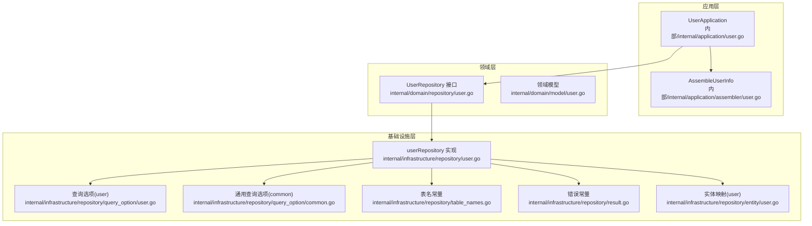
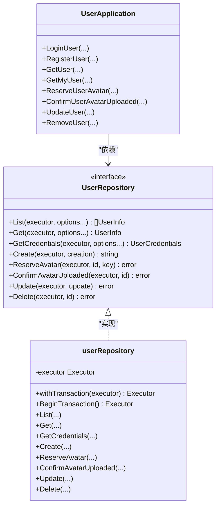
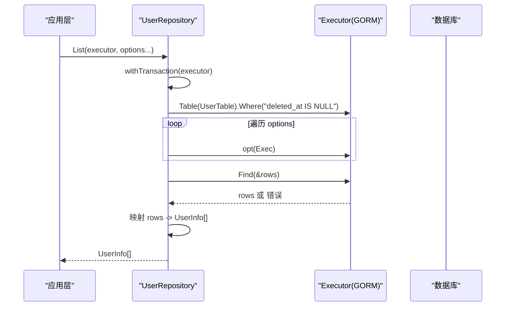
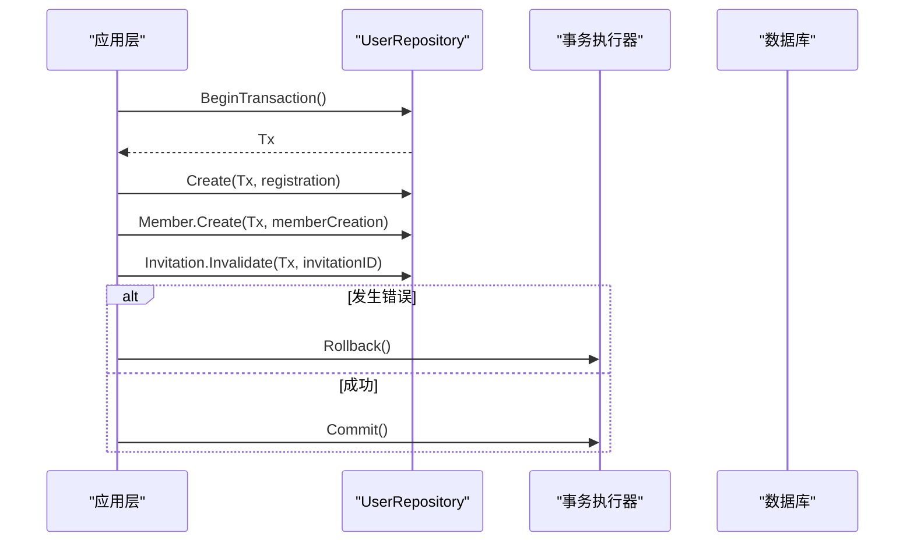
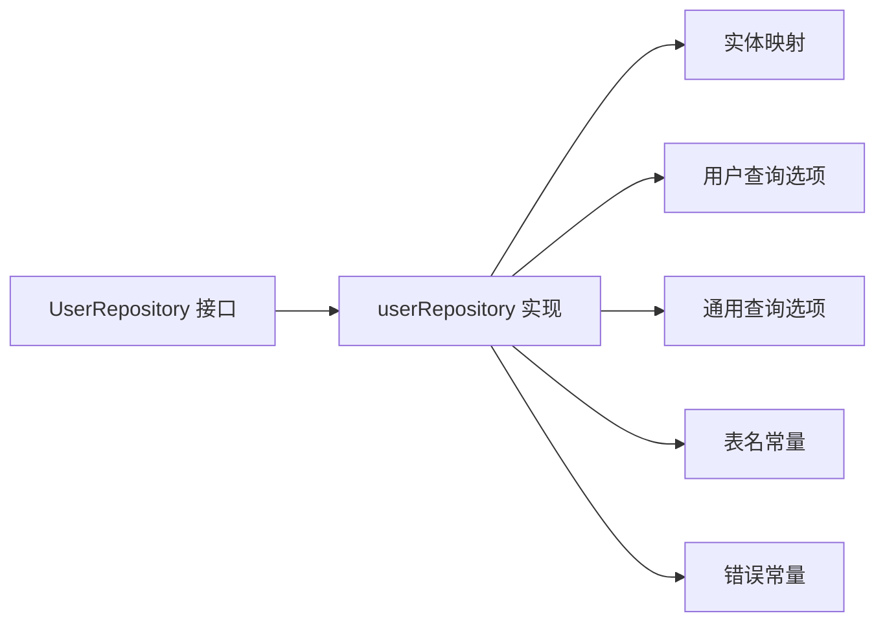
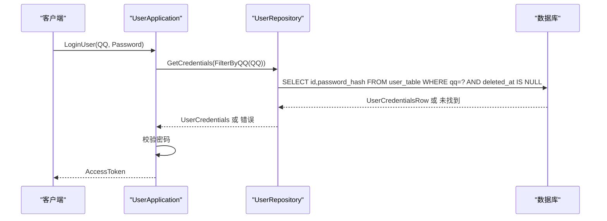

# 用户仓储

<cite>
**本文引用的文件**
- [internal/domain/repository/user.go](file://internal/domain/repository/user.go)
- [internal/infrastructure/repository/user.go](file://internal/infrastructure/repository/user.go)
- [internal/domain/model/user.go](file://internal/domain/model/user.go)
- [internal/infrastructure/repository/entity/user.go](file://internal/infrastructure/repository/entity/user.go)
- [internal/infrastructure/repository/query_option/user.go](file://internal/infrastructure/repository/query_option/user.go)
- [internal/infrastructure/repository/query_option/common.go](file://internal/infrastructure/repository/query_option/common.go)
- [internal/infrastructure/repository/table_names.go](file://internal/infrastructure/repository/table_names.go)
- [internal/infrastructure/repository/result.go](file://internal/infrastructure/repository/result.go)
- [internal/application/user.go](file://internal/application/user.go)
- [internal/application/assembler/user.go](file://internal/application/assembler/user.go)
- [migrations/20260301065022_user-table.up.sql](file://migrations/20260301065022_user-table.up.sql)
- [migrations/20260301065022_user-table.down.sql](file://migrations/20260301065022_user-table.down.sql)
</cite>

## 目录
1. [简介](#简介)
2. [项目结构](#项目结构)
3. [核心组件](#核心组件)
4. [架构总览](#架构总览)
5. [详细组件分析](#详细组件分析)
6. [依赖分析](#依赖分析)
7. [性能考虑](#性能考虑)
8. [故障排查指南](#故障排查指南)
9. [结论](#结论)
10. [附录](#附录)

## 简介
本文件系统化阐述“用户仓储”的设计与实现，覆盖用户列表查询、单个用户获取、凭据获取、用户创建、头像预留、头像确认、用户更新与软删除等操作。文档重点说明仓储接口的设计模式、事务处理机制、查询选项的应用方式，并提供 SQL 示例、错误处理策略与性能优化建议，帮助开发者正确使用用户仓储进行用户数据的增删改查。

## 项目结构
用户仓储位于领域与基础设施两层之间，向上提供 UserRepository 接口，向下封装 GORM 执行器与实体映射；查询选项通过函数式组合扩展执行器能力；应用层负责鉴权、事务编排与结果装配。

图表来源
- [internal/application/user.go:1-594](file://internal/application/user.go#L1-L594)
- [internal/application/assembler/user.go:1-34](file://internal/application/assembler/user.go#L1-L34)
- [internal/domain/repository/user.go:1-16](file://internal/domain/repository/user.go#L1-L16)
- [internal/infrastructure/repository/user.go:1-150](file://internal/infrastructure/repository/user.go#L1-L150)
- [internal/infrastructure/repository/query_option/user.go:1-30](file://internal/infrastructure/repository/query_option/user.go#L1-L30)
- [internal/infrastructure/repository/query_option/common.go:1-51](file://internal/infrastructure/repository/query_option/common.go#L1-L51)
- [internal/infrastructure/repository/entity/user.go:1-58](file://internal/infrastructure/repository/entity/user.go#L1-L58)
- [internal/infrastructure/repository/table_names.go:1-18](file://internal/infrastructure/repository/table_names.go#L1-L18)
- [internal/infrastructure/repository/result.go:1-6](file://internal/infrastructure/repository/result.go#L1-L6)

章节来源
- [internal/domain/repository/user.go:1-16](file://internal/domain/repository/user.go#L1-L16)
- [internal/infrastructure/repository/user.go:1-150](file://internal/infrastructure/repository/user.go#L1-L150)
- [internal/application/user.go:1-594](file://internal/application/user.go#L1-L594)

## 核心组件
- UserRepository 接口：定义仓储契约，包含事务、查询、凭据获取、创建、头像预留/确认、更新、软删除等方法。
- userRepository 实现：基于 GORM 的具体实现，统一注入 Executor 并通过 QueryOption 组合查询条件。
- 领域模型：UserInfo、UserCredentials、UserCreation、UserUpdate，承载业务数据结构。
- 实体映射：UserInfoRow、UserCredentialsRow、UserInsertRow，映射到 user_table 的列结构。
- 查询选项：UserQuery 提供按 QQ、昵称模糊匹配；通用查询选项提供按 ID、时间排序、分页等。
- 应用层装配：AssembleUserInfo 将 UserInfo 与头像预签名 URL 组装为应用层值对象。

章节来源
- [internal/domain/repository/user.go:5-15](file://internal/domain/repository/user.go#L5-L15)
- [internal/infrastructure/repository/user.go:12-149](file://internal/infrastructure/repository/user.go#L12-L149)
- [internal/domain/model/user.go:7-99](file://internal/domain/model/user.go#L7-L99)
- [internal/infrastructure/repository/entity/user.go:11-57](file://internal/infrastructure/repository/entity/user.go#L11-L57)
- [internal/infrastructure/repository/query_option/user.go:15-29](file://internal/infrastructure/repository/query_option/user.go#L15-L29)
- [internal/infrastructure/repository/query_option/common.go:15-50](file://internal/infrastructure/repository/query_option/common.go#L15-L50)
- [internal/application/assembler/user.go:10-33](file://internal/application/assembler/user.go#L10-L33)

## 架构总览
用户仓储采用“接口隔离 + 函数式查询选项 + 实体映射”的分层设计，应用层负责鉴权与事务编排，仓储层负责数据持久化与查询组合，实体层负责 ORM 映射。

图表来源
- [internal/domain/repository/user.go:5-15](file://internal/domain/repository/user.go#L5-L15)
- [internal/infrastructure/repository/user.go:12-149](file://internal/infrastructure/repository/user.go#L12-L149)
- [internal/application/user.go:21-64](file://internal/application/user.go#L21-L64)

## 详细组件分析

### 仓储接口设计模式
- 接口职责单一：每个方法聚焦特定操作，便于替换与测试。
- 查询选项函数式组合：QueryOption 以闭包形式接收 Executor 并返回新的 Executor，支持链式组合，提升查询灵活性。
- 事务抽象：Transactor 接口要求实现 BeginTransaction，应用层可注入外部事务执行器，实现跨仓储事务编排。
- 错误语义：通过 ErrRecordNotFound 统一记录未找到错误，避免裸 gorm 错误泄露。

章节来源
- [internal/domain/repository/user.go:5-15](file://internal/domain/repository/user.go#L5-L15)
- [internal/domain/repository/types.go:9-11](file://internal/domain/repository/types.go#L9-L11)
- [internal/infrastructure/repository/result.go:5-6](file://internal/infrastructure/repository/result.go#L5-L6)

### 用户列表查询（List）
- 默认过滤：仓储在执行查询时自动追加“deleted_at IS NULL”条件，保证软删除可见性。
- 查询选项：支持传入多个 QueryOption，逐个对 Executor 进行装饰，最终执行 Find。
- 结果映射：将 UserInfoRow 列表映射为 UserInfo 列表返回。

图表来源
- [internal/infrastructure/repository/user.go:32-51](file://internal/infrastructure/repository/user.go#L32-L51)
- [internal/infrastructure/repository/entity/user.go:25-36](file://internal/infrastructure/repository/entity/user.go#L25-L36)

章节来源
- [internal/infrastructure/repository/user.go:32-51](file://internal/infrastructure/repository/user.go#L32-L51)

### 单个用户获取（Get）
- 与 List 类似，但使用 First 获取单条记录，并将 UserCredentialsRow 映射为 UserCredentials。
- 适用于按 ID、QQ 等条件精确查询。

章节来源
- [internal/infrastructure/repository/user.go:54-71](file://internal/infrastructure/repository/user.go#L54-L71)
- [internal/infrastructure/repository/entity/user.go:38-44](file://internal/infrastructure/repository/entity/user.go#L38-L44)

### 凭据获取（GetCredentials）
- 仅查询用户 ID 与密码哈希，不暴露其他敏感字段。
- 与登录流程配合，先按 QQ 获取凭据，再进行密码校验。

章节来源
- [internal/infrastructure/repository/user.go:73-87](file://internal/infrastructure/repository/user.go#L73-L87)
- [internal/infrastructure/repository/entity/user.go:38-44](file://internal/infrastructure/repository/entity/user.go#L38-L44)

### 用户创建（Create）
- 自动生成 UUID 作为主键，初始化头像相关字段与非超级管理员标志。
- 返回新创建用户的 ID，供应用层后续流程使用。

章节来源
- [internal/infrastructure/repository/user.go:89-106](file://internal/infrastructure/repository/user.go#L89-L106)
- [internal/infrastructure/repository/entity/user.go:46-57](file://internal/infrastructure/repository/entity/user.go#L46-L57)
- [internal/domain/model/user.go:56-78](file://internal/domain/model/user.go#L56-L78)

### 头像预留（ReserveAvatar）
- 为指定用户预留头像存储 Key，并将 is_avatar_uploaded 置为 false。
- 应用层随后生成 Put 预签名 URL，供前端直传头像。

章节来源
- [internal/infrastructure/repository/user.go:108-118](file://internal/infrastructure/repository/user.go#L108-L118)
- [internal/application/user.go:426-468](file://internal/application/user.go#L426-L468)

### 头像确认（ConfirmAvatarUploaded）
- 当 OSS 已成功接收头像文件后，调用该方法将 is_avatar_uploaded 置为 true。
- 仓储会校验用户存在且未被软删除，并确保 avatar_oss_key 非空。

章节来源
- [internal/infrastructure/repository/user.go:120-127](file://internal/infrastructure/repository/user.go#L120-L127)
- [internal/application/user.go:521-555](file://internal/application/user.go#L521-L555)

### 用户更新（Update）
- 支持更新名称、QQ、密码哈希等字段。
- 仓储在更新前校验用户存在且未被软删除。

章节来源
- [internal/infrastructure/repository/user.go:129-140](file://internal/infrastructure/repository/user.go#L129-L140)
- [internal/domain/model/user.go:80-99](file://internal/domain/model/user.go#L80-L99)

### 软删除（Delete）
- 通过设置 deleted_at 字段实现软删除，保留数据完整性与审计需求。
- 应用层在删除前进行权限校验与自删保护。

章节来源
- [internal/infrastructure/repository/user.go:142-149](file://internal/infrastructure/repository/user.go#L142-L149)
- [internal/application/user.go:557-593](file://internal/application/user.go#L557-L593)

### 事务处理机制
- 仓储层提供 BeginTransaction，应用层在关键流程（如注册）中开启事务，确保多步写入原子性。
- 应用层负责 defer 回滚与提交逻辑，出现错误时回滚，成功时提交。

图表来源
- [internal/application/user.go:199-261](file://internal/application/user.go#L199-L261)
- [internal/domain/repository/types.go:9-11](file://internal/domain/repository/types.go#L9-L11)

章节来源
- [internal/application/user.go:199-261](file://internal/application/user.go#L199-L261)
- [internal/domain/repository/types.go:9-11](file://internal/domain/repository/types.go#L9-L11)

### 查询选项的应用
- 用户查询：FilterByQQ、FilterByFuzzyName，均使用完整表名前缀 user_table.*，避免裸字段。
- 通用查询：FilterByID、CreatedAtDesc/Asc、UpdatedAtDesc、FilterByIDs、Paginate，统一规范跨表与分页。
- 组合使用：仓储在执行前对 Executor 进行装饰，最终形成完整查询。

章节来源
- [internal/infrastructure/repository/query_option/user.go:15-29](file://internal/infrastructure/repository/query_option/user.go#L15-L29)
- [internal/infrastructure/repository/query_option/common.go:15-50](file://internal/infrastructure/repository/query_option/common.go#L15-L50)
- [internal/infrastructure/repository/user.go:35-38](file://internal/infrastructure/repository/user.go#L35-L38)

### 数据模型与实体映射
- UserInfo：包含用户基本信息与头像状态，用于列表与详情展示。
- UserCredentials：仅含用户标识与密码哈希，用于登录校验。
- UserInsertRow：创建用户时的写入结构，包含所有必要字段。
- 实体映射：ToUserInfo 将数据库行转换为领域模型，保持类型安全与清晰边界。

章节来源
- [internal/domain/model/user.go:7-99](file://internal/domain/model/user.go#L7-L99)
- [internal/infrastructure/repository/entity/user.go:11-57](file://internal/infrastructure/repository/entity/user.go#L11-L57)

### 头像 URL 装配与容错
- AssembleUserInfo 在加载头像 URL 失败时记录日志并降级为空字符串，避免影响整体用户信息加载。
- 应用层通过 OSS 客户端生成预签名 URL，保障前端直传与访问安全。

章节来源
- [internal/application/assembler/user.go:10-33](file://internal/application/assembler/user.go#L10-L33)
- [internal/application/user.go:426-468](file://internal/application/user.go#L426-L468)

## 依赖分析
- 接口与实现解耦：UserRepository 与 userRepository 通过接口与实现分离，便于替换与测试。
- 查询选项复用：通用查询选项与用户专用查询选项共同构成查询组合能力。
- 表名集中管理：通过导出常量避免在应用层直接使用裸字符串，降低维护成本。
- 错误常量统一：ErrRecordNotFound 由基础设施层导出，避免跨层直接依赖 gorm。

图表来源
- [internal/domain/repository/user.go:5-15](file://internal/domain/repository/user.go#L5-L15)
- [internal/infrastructure/repository/user.go:12-149](file://internal/infrastructure/repository/user.go#L12-L149)
- [internal/infrastructure/repository/entity/user.go:11-57](file://internal/infrastructure/repository/entity/user.go#L11-L57)
- [internal/infrastructure/repository/query_option/user.go:15-29](file://internal/infrastructure/repository/query_option/user.go#L15-L29)
- [internal/infrastructure/repository/query_option/common.go:15-50](file://internal/infrastructure/repository/query_option/common.go#L15-L50)
- [internal/infrastructure/repository/table_names.go:6-17](file://internal/infrastructure/repository/table_names.go#L6-L17)
- [internal/infrastructure/repository/result.go:5-6](file://internal/infrastructure/repository/result.go#L5-L6)

章节来源
- [internal/domain/repository/user.go:5-15](file://internal/domain/repository/user.go#L5-L15)
- [internal/infrastructure/repository/user.go:12-149](file://internal/infrastructure/repository/user.go#L12-L149)

## 性能考虑
- 索引策略：user_table 在 name、qq、created_at、updated_at 上建立索引，其中 name 使用 GIN trigram 索引支持模糊匹配；所有索引均带 deleted_at IS NULL 条件，确保软删除不影响查询效率。
- 查询路径优化：
  - 列表查询默认附加“deleted_at IS NULL”，避免扫描软删除记录。
  - 使用 FilterByIDs 与 Paginate 组合进行批量与分页查询，减少一次性载荷。
- 写入路径优化：
  - ReserveAvatar 与 ConfirmAvatarUploaded 分步进行，避免长事务占用。
  - Create 时一次性写入，减少往返。
- 缓存与预签名：
  - 头像 URL 通过预签名生成，减少服务端鉴权开销。

章节来源
- [migrations/20260301065022_user-table.up.sql:19-34](file://migrations/20260301065022_user-table.up.sql#L19-L34)
- [internal/infrastructure/repository/user.go:35-38](file://internal/infrastructure/repository/user.go#L35-L38)
- [internal/infrastructure/repository/query_option/common.go:39-50](file://internal/infrastructure/repository/query_option/common.go#L39-L50)

## 故障排查指南
- 记录未找到：
  - 使用 ErrRecordNotFound 判断是否为“记录不存在”，避免将其他错误误判为未找到。
- 登录失败：
  - GetCredentials 返回空或错误时，统一返回“用户不存在或密码错误”，防止用户枚举攻击。
- 注册事务失败：
  - 检查 BeginTransaction 后的回滚与提交逻辑，确保异常时回滚，成功时提交。
- 头像确认失败：
  - 确认 avatar_oss_key 非空且用户未被软删除，避免误判。
- 权限不足：
  - 应用层在 GetUser、UpdateUser、RemoveUser 等操作前进行权限校验，避免越权访问。

章节来源
- [internal/infrastructure/repository/result.go:5-6](file://internal/infrastructure/repository/result.go#L5-L6)
- [internal/application/user.go:124-137](file://internal/application/user.go#L124-L137)
- [internal/application/user.go:199-261](file://internal/application/user.go#L199-L261)
- [internal/infrastructure/repository/user.go:120-127](file://internal/infrastructure/repository/user.go#L120-L127)
- [internal/application/user.go:294-301](file://internal/application/user.go#L294-L301)

## 结论
用户仓储通过接口与实现分离、函数式查询选项、统一事务抽象与实体映射，提供了清晰、可扩展、可测试的数据访问层。结合合理的索引策略与应用层的权限控制与错误处理，能够稳定支撑用户数据的增删改查与头像相关流程。

## 附录

### SQL 示例（来自迁移脚本）
- 创建表与索引：见 [20260301065022_user-table.up.sql:1-52](file://migrations/20260301065022_user-table.up.sql#L1-L52)
- 删除表：见 [20260301065022_user-table.down.sql:1-2](file://migrations/20260301065022_user-table.down.sql#L1-L2)

### 关键流程时序图（登录）

图表来源
- [internal/application/user.go:106-154](file://internal/application/user.go#L106-L154)
- [internal/infrastructure/repository/user.go:73-87](file://internal/infrastructure/repository/user.go#L73-L87)