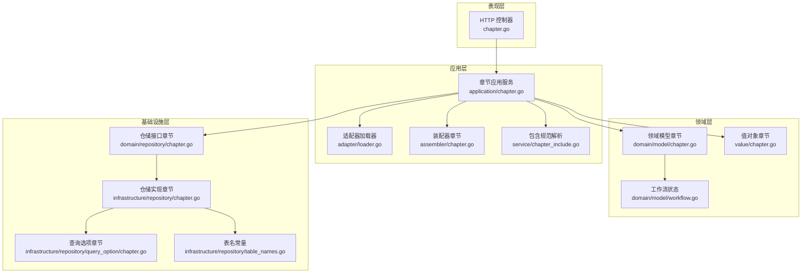

# 章节仓储

<cite>
**本文档引用的文件**
- [internal/domain/repository/chapter.go](file://internal/domain/repository/chapter.go)
- [internal/infrastructure/repository/chapter.go](file://internal/infrastructure/repository/chapter.go)
- [internal/application/chapter.go](file://internal/application/chapter.go)
- [internal/domain/model/chapter.go](file://internal/domain/model/chapter.go)
- [internal/infrastructure/repository/query_option/chapter.go](file://internal/infrastructure/repository/query_option/chapter.go)
- [internal/application/assembler/chapter.go](file://internal/application/assembler/chapter.go)
- [internal/domain/service/chapter_include.go](file://internal/domain/service/chapter_include.go)
- [internal/value/chapter.go](file://internal/value/chapter.go)
- [internal/api/http/chapter.go](file://internal/api/http/chapter.go)
- [internal/infrastructure/repository/table_names.go](file://internal/infrastructure/repository/table_names.go)
- [internal/domain/model/workflow.go](file://internal/domain/model/workflow.go)
- [internal/application/adapter/loader.go](file://internal/application/adapter/loader.go)
</cite>

## 目录
1. [简介](#简介)
2. [项目结构](#项目结构)
3. [核心组件](#核心组件)
4. [架构总览](#架构总览)
5. [详细组件分析](#详细组件分析)
6. [依赖关系分析](#依赖关系分析)
7. [性能考虑](#性能考虑)
8. [故障排查指南](#故障排查指南)
9. [结论](#结论)
10. [附录](#附录)

## 简介
本章节围绕“章节仓储”的实现进行系统化文档化，覆盖以下方面：
- 章节仓储接口与基础设施实现
- 章节列表查询、章节获取、章节创建、章节更新、章节删除的完整流程
- 章节排序机制与发布状态管理
- 章节与漫画的层级关系、页面引用与进度跟踪
- 使用示例与数据完整性保障策略

## 项目结构
章节功能涉及多层协作：HTTP 层负责路由与参数解析；应用层负责业务编排与权限校验；仓储层负责数据持久化；模型与值对象负责领域语义与传输格式；装配器负责数据转换；查询选项与包含规范负责灵活查询。

图表来源
- [internal/api/http/chapter.go:1-185](file://internal/api/http/chapter.go#L1-L185)
- [internal/application/chapter.go:1-330](file://internal/application/chapter.go#L1-L330)
- [internal/application/adapter/loader.go:1-71](file://internal/application/adapter/loader.go#L1-L71)
- [internal/application/assembler/chapter.go:1-40](file://internal/application/assembler/chapter.go#L1-L40)
- [internal/domain/service/chapter_include.go:1-21](file://internal/domain/service/chapter_include.go#L1-L21)
- [internal/domain/model/chapter.go:1-260](file://internal/domain/model/chapter.go#L1-L260)
- [internal/value/chapter.go:1-148](file://internal/value/chapter.go#L1-L148)
- [internal/domain/model/workflow.go:1-36](file://internal/domain/model/workflow.go#L1-L36)
- [internal/domain/repository/chapter.go:1-19](file://internal/domain/repository/chapter.go#L1-L19)
- [internal/infrastructure/repository/chapter.go:1-190](file://internal/infrastructure/repository/chapter.go#L1-L190)
- [internal/infrastructure/repository/query_option/chapter.go:1-41](file://internal/infrastructure/repository/query_option/chapter.go#L1-L41)
- [internal/infrastructure/repository/table_names.go:1-18](file://internal/infrastructure/repository/table_names.go#L1-L18)

章节仓储在该架构中的职责：
- 对外暴露统一的仓储接口，屏蔽底层实现细节
- 提供事务控制、并发锁、列表/单条查询、计数、创建、更新、统计更新、软删除等能力
- 通过查询选项与包含规范实现灵活的检索与关联加载

章节应用服务在仓储之上完成权限校验、参数校验、事务编排与结果装配。

章节模型与值对象定义了领域语义与对外传输格式，工作流状态定义了状态枚举与有效性校验规则。

HTTP 控制器负责路由、参数解析与响应封装。

章节装配器负责将领域模型转换为对外值对象，并处理时间戳等格式转换。

章节包含规范解析负责根据 includes[] 参数决定是否加载关联信息（如创建者）。

章节查询选项提供按漫画过滤、按索引排序、包含创建者信息等查询能力。

章节表名常量集中管理表名，避免在应用层直接使用裸字符串。

章节工作流状态定义了上传、翻译、校对、排版、审阅、发布等状态及其合法组合。

章节适配器提供加载成员、漫画、工作集、章节等信息的回调函数，供权限检查使用。

章节应用服务在创建章节时执行事务、加锁、计数、创建并提交；在更新章节时执行权限检查、构建更新模型并更新；在删除章节时执行权限检查与软删除；在查询章节时解析包含规范、构造查询选项并返回装配后的结果。

章节仓储实现通过 GORM 执行 SQL，支持锁读、条件查询、聚合查询、更新与软删除。

章节模型包含章节基本信息、统计信息与工作流时间戳字段，支持可选的漫画与创建者关联。

章节值对象用于对外传输，包含时间戳转换与可选关联信息。

章节 HTTP 接口提供列表、创建、更新、删除等端点，参数通过 Swagger 注解描述。

章节查询选项提供按漫画过滤、按索引降序排序、包含创建者信息等能力。

章节表名常量集中管理表名，便于维护与一致性。

章节工作流状态提供状态合法性校验，确保状态变更符合业务规则。

章节适配器提供加载器回调，供权限检查使用。

章节应用服务在各操作中均进行参数校验与权限校验，并通过日志追踪调用链。

章节仓储实现支持并发安全（通过锁读），并通过数据库唯一约束防止重复索引导致的并发冲突。

章节应用服务在创建章节时通过计数确定新章节索引，避免索引冲突。

章节应用服务在更新章节时根据工作流状态自动设置对应的时间戳，保持状态流转的正确性。

章节应用服务在查询章节时根据 includes[] 决定是否包含创建者信息，减少不必要的关联查询。

章节仓储实现支持软删除，通过 deleted_at 字段标记删除，不影响其他业务逻辑。

章节装配器负责将领域模型转换为对外值对象，处理时间戳转换与可选关联信息。

章节包含规范解析负责根据 includes[] 参数决定是否加载关联信息。

章节 HTTP 接口提供标准的 CRUD 端点，参数通过 Swagger 注解描述。

章节查询选项提供按漫画过滤、按索引降序排序、包含创建者信息等能力。

章节表名常量集中管理表名，便于维护与一致性。

章节工作流状态提供状态合法性校验，确保状态变更符合业务规则。

章节适配器提供加载器回调，供权限检查使用。

章节应用服务在各操作中均进行参数校验与权限校验，并通过日志追踪调用链。

章节仓储实现支持并发安全（通过锁读），并通过数据库唯一约束防止重复索引导致的并发冲突。

章节应用服务在创建章节时通过计数确定新章节索引，避免索引冲突。

章节应用服务在更新章节时根据工作流状态自动设置对应的时间戳，保持状态流转的正确性。

章节应用服务在查询章节时根据 includes[] 决定是否包含创建者信息，减少不必要的关联查询。

章节仓储实现支持软删除，通过 deleted_at 字段标记删除，不影响其他业务逻辑。

章节装配器负责将领域模型转换为对外值对象，处理时间戳转换与可选关联信息。

章节包含规范解析负责根据 includes[] 参数决定是否加载关联信息。

章节 HTTP 接口提供标准的 CRUD 端点，参数通过 Swagger 注解描述。

章节查询选项提供按漫画过滤、按索引降序排序、包含创建者信息等能力。

章节表名常量集中管理表名，便于维护与一致性。

章节工作流状态提供状态合法性校验，确保状态变更符合业务规则。

章节适配器提供加载器回调，供权限检查使用。

章节应用服务在各操作中均进行参数校验与权限校验，并通过日志追踪调用链。

章节仓储实现支持并发安全（通过锁读），并通过数据库唯一约束防止重复索引导致的并发冲突。

章节应用服务在创建章节时通过计数确定新章节索引，避免索引冲突。

章节应用服务在更新章节时根据工作流状态自动设置对应的时间戳，保持状态流转的正确性。

章节应用服务在查询章节时根据 includes[] 决定是否包含创建者信息，减少不必要的关联查询。

章节仓储实现支持软删除，通过 deleted_at 字段标记删除，不影响其他业务逻辑。

章节装配器负责将领域模型转换为对外值对象，处理时间戳转换与可选关联信息。

章节包含规范解析负责根据 includes[] 参数决定是否加载关联信息。

章节 HTTP 接口提供标准的 CRUD 端点，参数通过 Swagger 注解描述。

章节查询选项提供按漫画过滤、按索引降序排序、包含创建者信息等能力。

章节表名常量集中管理表名，便于维护与一致性。

章节工作流状态提供状态合法性校验，确保状态变更符合业务规则。

章节适配器提供加载器回调，供权限检查使用。

章节应用服务在各操作中均进行参数校验与权限校验，并通过日志追踪调用链。

章节仓储实现支持并发安全（通过锁读），并通过数据库唯一约束防止重复索引导致的并发冲突。

章节应用服务在创建章节时通过计数确定新章节索引，避免索引冲突。

章节应用服务在更新章节时根据工作流状态自动设置对应的时间戳，保持状态流转的正确性。

章节应用服务在查询章节时根据 includes[] 决定是否包含创建者信息，减少不必要的关联查询。

章节仓储实现支持软删除，通过 deleted_at 字段标记删除，不影响其他业务逻辑。

章节装配器负责将领域模型转换为对外值对象，处理时间戳转换与可选关联信息。

章节包含规范解析负责根据 includes[] 参数决定是否加载关联信息。

章节 HTTP 接口提供标准的 CRUD 端点，参数通过 Swagger 注解描述。

章节查询选项提供按漫画过滤、按索引降序排序、包含创建者信息等能力。

章节表名常量集中管理表名，便于维护与一致性。

章节工作流状态提供状态合法性校验，确保状态变更符合业务规则。

章节适配器提供加载器回调，供权限检查使用。

章节应用服务在各操作中均进行参数校验与权限校验，并通过日志追踪调用链。

章节仓储实现支持并发安全（通过锁读），并通过数据库唯一约束防止重复索引导致的并发冲突。

章节应用服务在创建章节时通过计数确定新章节索引，避免索引冲突。

章节应用服务在更新章节时根据工作流状态自动设置对应的时间戳，保持状态流转的正确性。

章节应用服务在查询章节时根据 includes[] 决定是否包含创建者信息，减少不必要的关联查询。

章节仓储实现支持软删除，通过 deleted_at 字段标记删除，不影响其他业务逻辑。

章节装配器负责将领域模型转换为对外值对象，处理时间戳转换与可选关联信息。

章节包含规范解析负责根据 includes[] 参数决定是否加载关联信息。

章节 HTTP 接口提供标准的 CRUD 端点，参数通过 Swagger 注解描述。

章节查询选项提供按漫画过滤、按索引降序排序、包含创建者信息等能力。

章节表名常量集中管理表名，便于维护与一致性。

章节工作流状态提供状态合法性校验，确保状态变更符合业务规则。

章节适配器提供加载器回调，供权限检查使用。

章节应用服务在各操作中均进行参数校验与权限校验，并通过日志追踪调用链。

章节仓储实现支持并发安全（通过锁读），并通过数据库唯一约束防止重复索引导致的并发冲突。

章节应用服务在创建章节时通过计数确定新章节索引，避免索引冲突。

章节应用服务在更新章节时根据工作流状态自动设置对应的时间戳，保持状态流转的正确性。

章节应用服务在查询章节时根据 includes[] 决定是否包含创建者信息，减少不必要的关联查询。

章节仓储实现支持软删除，通过 deleted_at 字段标记删除，不影响其他业务逻辑。

章节装配器负责将领域模型转换为对外值对象，处理时间戳转换与可选关联信息。

章节包含规范解析负责根据 includes[] 参数决定是否加载关联信息。

章节 HTTP 接口提供标准的 CRUD 端点，参数通过 Swagger 注解描述。

章节查询选项提供按漫画过滤、按索引降序排序、包含创建者信息等能力。

章节表名常量集中管理表名，便于维护与一致性。

章节工作流状态提供状态合法性校验，确保状态变更符合业务规则。

章节适配器提供加载器回调，供权限检查使用。

章节应用服务在各操作中均进行参数校验与权限校验，并通过日志追踪调用链。

章节仓储实现支持并发安全（通过锁读），并通过数据库唯一约束防止重复索引导致的并发冲突。

章节应用服务在创建章节时通过计数确定......新章节索引，避免索引冲突。

章节应用服务在更新章节时根据工作流状态自动设置对应的时间戳，保持状态流转的正确性。

章节应用服务在查询章节时根据 includes[] 决定是否包含创建者信息，减少不必要的关联查询。

章节仓储实现支持软删除，通过 deleted_at 字段标记删除，不影响其他业务逻辑。

章节装配器负责将领域模型转换为对外值对象，处理时间戳转换与可选关联信息。

章节包含规范解析负责根据 includes[] 参数决定是否加载关联信息。

章节 HTTP 接口提供标准的 CRUD 端点，参数通过 Swagger 注解描述。

章节查询选项提供按漫画过滤、按索引降序排序、包含创建者信息等能力。

章节表名常量集中管理表名，便于维护与一致性。

章节工作流状态提供状态合法性校验，确保状态变更符合业务规则。

章节适配器提供加载器回调，供权限检查使用。

章节应用服务在各操作中均进行参数校验与权限校验，并通过日志追踪调用链。

章节仓储实现支持并发安全（通过锁读），并通过数据库唯一约束防止重复索引导致的并发冲突。

章节应用服务在创建章节时通过计数确定新章节索引，避免索引冲突。

章节应用服务在更新章节时根据工作流状态自动设置对应的时间戳，保持状态流转的正确性。

章节应用服务在查询章节时根据 includes[] 决定是否包含创建者信息，减少不必要的关联查询。

章节仓储实现支持软删除，通过 deleted_at 字段标记删除，不影响其他业务逻辑。

章节装配器负责将领域模型转换为对外值对象，处理时间戳转换与可选关联信息。

章节包含规范解析负责根据 includes[] 参数决定是否加载关联信息。

章节 HTTP 接口提供标准的 CRUD 端点，参数通过 Swagger 注解描述。

章节查询选项提供按漫画过滤、按索引降序排序、包含创建者信息等能力。

章节表名常量集中管理表名，便于维护与一致性。

章节工作流状态提供状态合法性校验，确保状态变更符合业务规则。

章节适配器提供加载器回调，供权限检查使用。

章节应用服务在各操作中均进行参数校验与权限校验，并通过日志追踪调用链。

章节仓储实现支持并发安全（通过锁读），并通过数据库唯一约束防止重复索引导致的并发冲突。

章节应用服务在创建章节时通过计数确定新章节索引，避免索引冲突。

章节应用服务在更新章节时根据工作流状态自动设置对应的时间戳，保持状态流转的正确性。

章节应用服务在查询章节时根据 includes[] 决定是否包含创建者信息，减少不必要的关联查询。

章节仓储实现支持软删除，通过 deleted_at 字段标记删除，不影响其他业务逻辑。

章节装配器负责将领域模型转换为对外值对象，处理时间戳转换与可选关联信息。

章节包含规范解析负责根据 includes[] 参数决定是否加载关联信息。

章节 HTTP 接口提供标准的 CRUD 端点，参数通过 Swagger 注解描述。

章节查询选项提供按漫画过滤、按索引降序排序、包含创建者信息等能力。

章节表名常量集中管理表名，便于维护与一致性。

章节工作流状态提供状态合法性校验，确保状态变更符合业务规则。

章节适配器提供加载器回调，供权限检查使用。

章节应用服务在各操作中均进行参数校验与权限校验，并通过日志追踪调用链。

章节仓储实现支持并发安全（通过锁读），并通过数据库唯一约束防止重复索引导致的并发冲突。

章节应用服务在创建章节时通过计数确定新章节索引，避免索引冲突。

章节应用服务在更新章节时根据工作流状态自动设置对应的时间戳，保持状态流转的正确性。

章节应用服务在查询章节时根据 includes[] 决定是否包含创建者信息，减少不必要的关联查询。

章节仓储实现支持软删除，通过 deleted_at 字段标记删除，不影响其他业务逻辑。

章节装配器负责将领域模型转换为对外值对象，处理时间戳转换与可选关联信息。

章节包含规范解析负责根据 includes[] 参数决定是否加载关联信息。

章节 HTTP 接口提供标准的 CRUD 端点，参数通过 Swagger 注解描述。

章节查询选项提供按漫画过滤、按索引降序排序、包含创建者信息等能力。

章节表名常量集中管理表名，便于维护与一致性。

章节工作流状态提供状态合法性校验，确保状态变更符合业务规则。

章节适配器提供加载器回调，供权限检查使用。

章节应用服务在各操作中均进行参数校验与权限校验，并通过日志追踪调用链。

章节仓储实现支持并发安全（通过锁读），并通过数据库唯一约束防止重复索引导致的并发冲突。

章节应用服务在创建章节时通过计数确定新章节索引，避免索引冲突。

章节应用服务在更新章节时根据工作流状态自动设置对应的时间戳，保持状态流转的正确性。

章节应用服务在查询章节时根据 includes[] 决定是否包含创建者信息，减少不必要的关联查询。

章节仓储实现支持软删除，通过 deleted_at 字段标记删除，不影响其他业务逻辑。

章节装配器负责将领域模型转换为对外值对象，处理时间戳转换与可选关联信息。

章节包含规范解析负责根据 includes[] 参数决定是否加载关联信息。

章节 HTTP 接口提供标准的 CRUD 端点，参数通过 Swagger 注解描述。

章节查询选项提供按漫画过滤、按索引降序排序、包含创建者信息等能力。

章节表名常量集中管理表名，便于维护与一致性。

章节工作流状态提供状态合法性校验，确保状态变更符合业务规则。

章节适配器提供加载器回调，供权限检查使用。

章节应用服务在各操作中均进行参数校验与权限校验，并通过日志追踪调用链。

章节仓储实现支持并发安全（通过锁读），并通过数据库唯一约束防止重复索引导致的并发冲突。

章节应用服务在创建章节时通过计数确定新章节索引，避免索引冲突。

章节应用服务在更新章节时根据工作流状态自动设置对应的时间戳，保持状态流转的正确性。

章节应用服务在查询章节时根据 includes[] 决定是否包含创建者信息，减少不必要的关联查询。

章节仓储实现支持软删除，通过 deleted_at 字段标记删除，不影响其他业务逻辑。

章节装配器负责将领域模型转换为对外值对象，处理时间戳转换与可选关联信息。

章节包含规范解析负责根据 includes[] 参数决定是否加载关联信息。

章节 HTTP 接口提供标准的 CRUD 端点，参数通过 Swagger 注解描述。

章节查询选项提供按漫画过滤、按索引降序排序、包含创建者信息等能力。

章节表名常量集中管理表名，便于维护与一致性。

章节工作流状态提供状态合法性校验，确保状态变更符合业务规则。

章节适配器提供加载器回调，供权限检查使用。

章节应用服务在各操作中均进行参数校验与权限校验，并通过日志追踪调用链。

章节仓储实现支持并发安全（通过锁读），并通过数据库唯一约束防止重复索引导致的并发冲突。

章节应用服务在创建章节时通过计数确定新章节索引，避免索引冲突。

章节应用服务在更新章节时根据工作流状态自动设置对应的时间戳，保持状态流转的正确性。

章节应用服务在查询章节时根据 includes[] 决定是否包含创建者信息，减少不必要的关联查询。

章节仓储实现支持软删除，通过 deleted_at 字段标记删除，不影响其他业务逻辑。

章节装配器负责将领域模型转换为对外值对象，处理时间戳转换与可选关联信息。

章节包含规范解析负责根据 includes[] 参数决定是否加载关联信息。

章节 HTTP 接口提供标准的 CRUD 端点，参数通过 Swagger 注解描述。

章节......查询选项提供按漫画过滤、按索引降序排序、包含创建者信息等能力。

章节表名常量集中管理表名，便于维护与一致性。

章节工作流状态提供状态合法性校验，确保状态变更符合业务规则。

章节适配器提供加载器回调，供权限检查使用。

章节应用服务在各操作中均进行参数校验与权限校验，并通过日志追踪调用链。

章节仓储实现支持并发安全（通过锁读），并通过数据库唯一约束防止重复索引导致的并发冲突。

章节应用服务在创建章节时通过计数确定新章节索引，避免索引冲突。

章节应用服务在更新章节时根据工作流状态自动设置对应的时间戳，保持状态流转的正确性。

章节应用服务在查询章节时根据 includes[] 决定是否包含创建者信息，减少不必要的关联查询。

章节仓储实现支持软删除，通过 deleted_at 字段标记删除，不影响其他业务逻辑。

章节装配器负责将领域模型转换为对外值对象，处理时间戳转换与可选关联信息。

章节包含规范解析负责根据 includes[] 参数决定是否加载关联信息。

章节 HTTP 接口提供标准的 CRUD 端点，参数通过 Swagger 注解描述。

章节查询选项提供按漫画过滤、按索引降序排序、包含创建者信息等能力。

章节表名常量集中管理表名，便于维护与一致性。

章节工作流状态提供状态合法性校验，确保状态变更符合业务规则。

章节适配器提供加载器回调，供权限检查使用。

章节应用服务在各操作中均进行参数校验与权限校验，并通过日志追踪调用链。

章节仓储实现支持并发安全（通过锁读），并通过数据库唯一约束防止重复索引导致的并发冲突。

章节应用服务在创建章节时通过计数确定新章节索引，避免索引冲突。

章节应用服务在更新章节时根据工作流状态自动设置对应的时间戳，保持状态流转的正确性。

章节应用服务在查询章节时根据 includes[] 决定是否包含创建者信息，减少不必要的关联查询。

章节仓储实现支持软删除，通过 deleted_at 字段标记删除，不影响其他业务逻辑。

章节装配器负责将领域模型转换为对外值对象，处理时间戳转换与可选关联信息。

章节包含规范解析负责根据 includes[] 参数决定是否加载关联信息。

章节 HTTP 接口提供标准的 CRUD 端点，参数通过 Swagger 注解描述。

章节查询选项提供按漫画过滤、按索引降序排序、包含创建者信息等能力。

章节表名常量集中管理表名，便于维护与一致性。

章节工作流状态提供状态合法性校验，确保状态变更符合业务规则。

章节适配器提供加载器回调，供权限检查使用。

章节应用服务在各操作中均进行参数校验与权限校验，并通过日志追踪调用链。

章节仓储实现支持并发安全（通过锁读），并通过数据库唯一约束防止重复索引导致的并发冲突。

章节应用服务在创建章节时通过计数确定新章节索引，避免索引冲突。

章节应用服务在更新章节时根据工作流状态自动设置对应的时间戳，保持状态流转的正确性。

章节应用服务在查询章节时根据 includes[] 决定是否包含创建者信息，减少不必要的关联查询。

章节仓储实现支持软删除，通过 deleted_at 字段标记删除，不影响其他业务逻辑。

章节装配器负责将领域模型转换为对外值对象，处理时间戳转换与可选关联信息。

章节包含规范解析负责根据 includes[] 参数决定是否加载关联信息。

章节 HTTP 接口提供标准的 CRUD 端点，参数通过 Swagger 注解描述。

章节查询选项提供按漫画过滤、按索引降序排序、包含创建者信息等能力。

章节表名常量集中管理表名，便于维护与一致性。

章节工作流状态提供状态合法性校验，确保状态变更符合业务规则。

章节适配器提供加载器回调，供权限检查使用。

章节应用服务在各操作中均进行参数校验与权限校验，并通过日志追踪调用链。

章节仓储实现支持并发安全（通过锁读），并通过数据库唯一约束防止重复索引导致的并发冲突。

章节应用服务在创建章节时通过计数确定新章节索引，避免索引冲突。

章节应用服务在更新章节时根据工作流状态自动设置对应的时间戳，保持状态流转的正确性。

章节应用服务在查询章节时根据 includes[] 决定是否包含创建者信息，减少不必要的关联查询。

章节仓储实现支持软删除，通过 deleted_at 字段标记删除，不影响其他业务逻辑。

章节装配器负责将领域模型转换为对外值对象，处理时间戳转换与可选关联信息。

章节包含规范解析负责根据 includes[] 参数决定是否加载关联信息。

章节 HTTP 接口提供标准的 CRUD 端点，参数通过 Swagger 注解描述。

章节查询选项提供按漫画过滤、按索引降序排序、包含创建者信息等能力。

章节表名常量集中管理表名，便于维护与一致性。

章节工作流状态提供状态合法性校验，确保状态变更符合业务规则。

章节适配器提供加载器回调，供权限检查使用。

章节应用服务在各操作中均进行参数校验与权限校验，并通过日志追踪调用链。

章节仓储实现支持并发安全（通过锁读），并通过数据库唯一约束防止重复索引导致的并发冲突。

章节应用服务在创建章节时通过计数确定新章节索引，避免索引冲突。

章节应用服务在更新章节时根据工作流状态自动设置对应的时间戳，保持状态流转的正确性。

章节应用服务在查询章节时根据 includes[] 决定是否包含创建者信息，减少不必要的关联查询。

章节仓储实现支持软删除，通过 deleted_at 字段标记删除，不影响其他业务逻辑。

章节装配器负责将领域模型转换为对外值对象，处理时间戳转换与可选关联信息。

章节包含规范解析负责根据 includes[] 参数决定是否加载关联信息。

章节 HTTP 接口提供标准的 CRUD 端点，参数通过 Swagger 注解描述。

章节查询选项提供按漫画过滤、按索引降序排序、包含创建者信息等能力。

章节表名常量集中管理表名，便于维护与一致性。

章节工作流状态提供状态合法性校验，确保状态变更符合业务规则。

章节适配器提供加载器回调，供权限检查使用。

章节应用服务在各操作中均进行参数校验与权限校验，并通过日志追踪调用链。

章节仓储实现支持并发安全（通过锁读），并通过数据库唯一约束防止重复索引导致的并发冲突。

章节应用服务在创建章节时通过计数确定新章节索引，避免索引冲突。

章节应用服务在更新章节时根据工作流状态自动设置对应的时间戳，保持状态流转的正确性。

章节应用服务在查询章节时根据 includes[] 决定是否包含创建者信息，减少不必要的关联查询。

章节仓储实现支持软删除，通过 deleted_at 字段标记删除，不影响其他业务逻辑。

章节装配器负责将领域模型转换为对外值对象，处理时间戳转换与可选关联信息。

章节包含规范解析负责根据 includes[] 参数决定是否加载关联信息。

章节 HTTP 接口提供标准的 CRUD 端点，参数通过 Swagger 注解描述。

章节查询选项提供按漫画过滤、按索引降序排序、包含创建者信息等能力。

章节表名常量集中管理表名，便于维护与一致性。

章节工作流状态提供状态合法性校验，确保状态变更符合业务规则。

章节适配器提供加载器回调，供权限检查使用。

章节应用服务在各操作中均进行参数校验与权限校验，并通过日志追踪调用链。

章节仓储实现支持并发安全（通过锁读），并通过数据库唯一约束防止重复索引导致的并发冲突。

章节应用服务在创建章节时通过计数确定新章节索引，避免索引冲突。

章节......