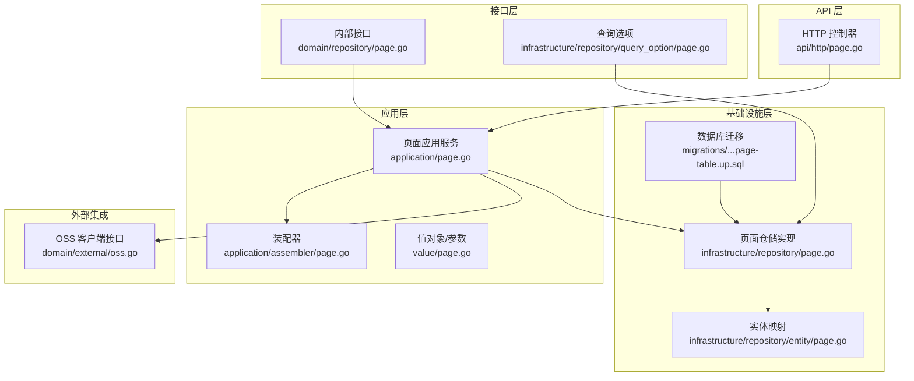
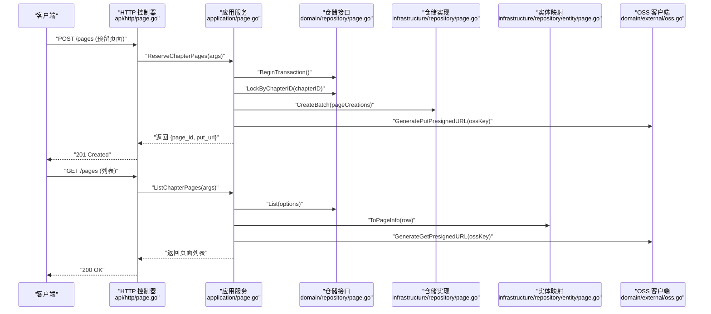
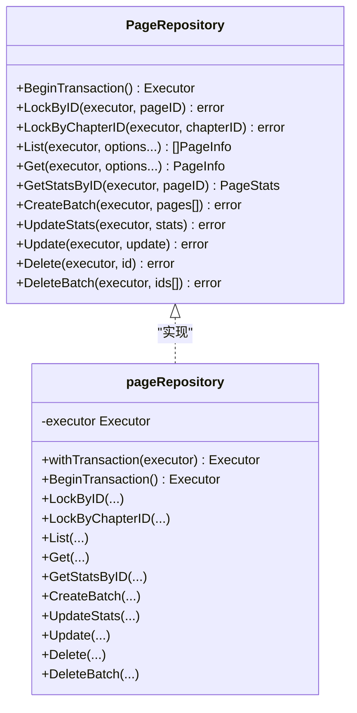
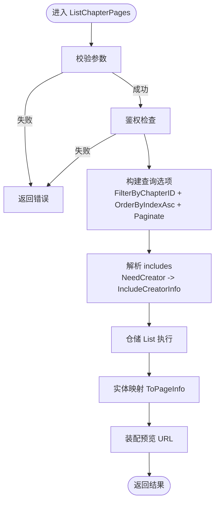
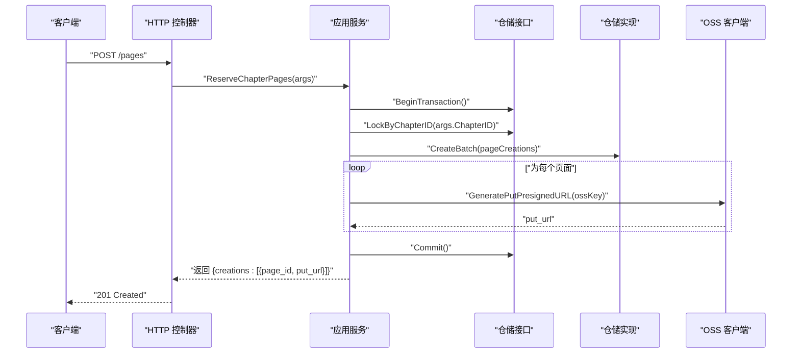
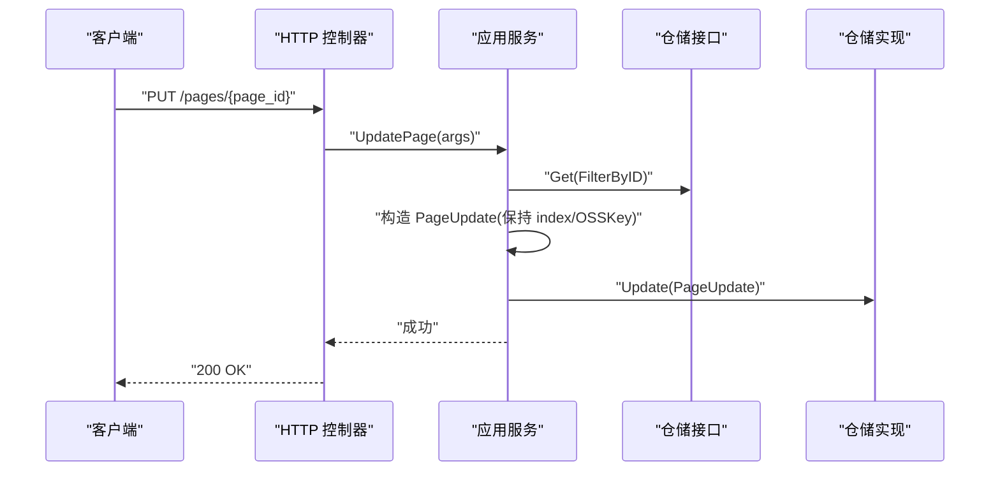
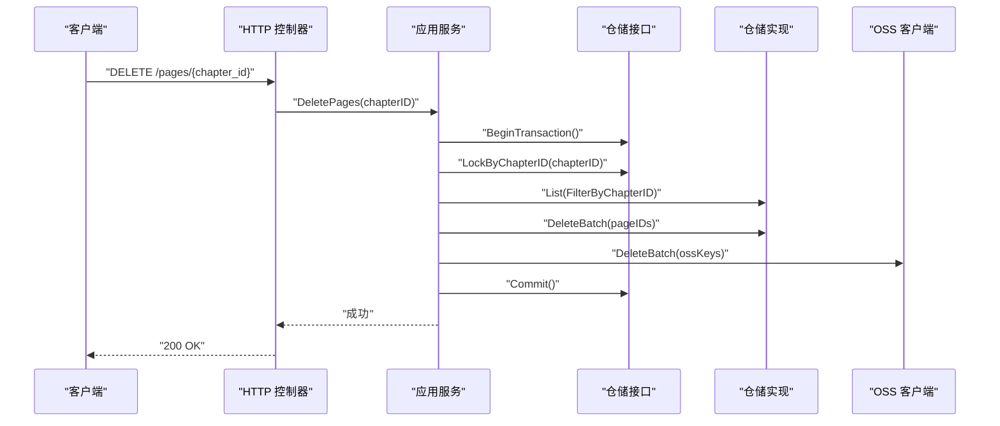
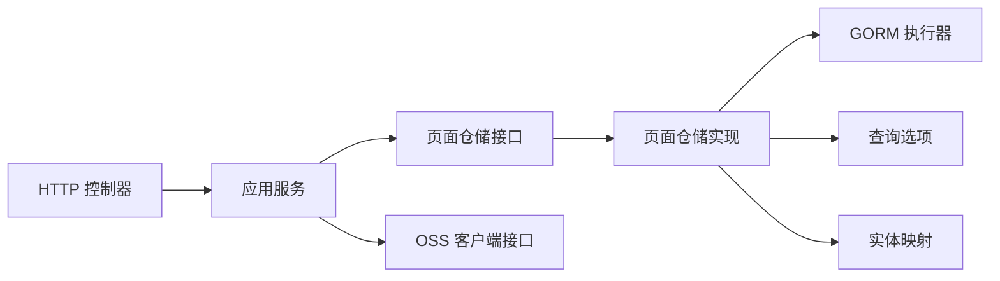

# 页面仓储

<cite>
**本文引用的文件**
- [internal/domain/repository/page.go](file://internal/domain/repository/page.go)
- [internal/application/page.go](file://internal/application/page.go)
- [internal/infrastructure/repository/page.go](file://internal/infrastructure/repository/page.go)
- [internal/domain/model/page.go](file://internal/domain/model/page.go)
- [internal/infrastructure/repository/entity/page.go](file://internal/infrastructure/repository/entity/page.go)
- [internal/infrastructure/repository/query_option/page.go](file://internal/infrastructure/repository/query_option/page.go)
- [internal/application/assembler/page.go](file://internal/application/assembler/page.go)
- [internal/domain/service/page.go](file://internal/domain/service/page.go)
- [internal/value/page.go](file://internal/value/page.go)
- [internal/domain/service/page_include.go](file://internal/domain/service/page_include.go)
- [internal/domain/external/oss.go](file://internal/domain/external/oss.go)
- [internal/api/http/page.go](file://internal/api/http/page.go)
- [internal/domain/model/chapter.go](file://internal/domain/model/chapter.go)
- [internal/domain/model/permission.go](file://internal/domain/model/permission.go)
- [internal/application/adapter/loader.go](file://internal/application/adapter/loader.go)
- [migrations/20260306101214_page-table.up.sql](file://migrations/20260306101214_page-table.up.sql)
</cite>

## 目录
1. [简介](#简介)
2. [项目结构](#项目结构)
3. [核心组件](#核心组件)
4. [架构总览](#架构总览)
5. [详细组件分析](#详细组件分析)
6. [依赖分析](#依赖分析)
7. [性能考量](#性能考量)
8. [故障排查指南](#故障排查指南)
9. [结论](#结论)
10. [附录](#附录)

## 简介
本文件系统性阐述“页面仓储”的实现与使用方法，覆盖页面列表查询、页面获取、页面创建（预留并生成预签名上传地址）、页面更新（如标记已上传）、页面删除（按章节批量删除）等关键操作；同时详解页面排序机制、文件关联处理（OSS 预签名 URL 生成与删除）、状态管理（页面单元统计与上传标记），以及页面与章节的关联关系、文件存储集成与预览生成流程。文末提供使用示例与文件管理最佳实践。

## 项目结构
页面仓储位于领域驱动设计的分层结构中，遵循“接口定义-应用服务-基础设施-实体/查询选项/值对象”的组织方式：
- 接口层：定义页面仓储能力与查询选项
- 应用层：编排业务流程（鉴权、事务、OSS 集成）
- 基础设施层：基于 GORM 实现具体持久化逻辑
- 实体与值对象：映射数据库行与业务模型
- API 层：暴露 HTTP 接口，调用应用服务

图表来源
- [internal/domain/repository/page.go:1-18](file://internal/domain/repository/page.go#L1-L18)
- [internal/infrastructure/repository/query_option/page.go:1-40](file://internal/infrastructure/repository/query_option/page.go#L1-L40)
- [internal/application/page.go:1-402](file://internal/application/page.go#L1-L402)
- [internal/infrastructure/repository/page.go:1-179](file://internal/infrastructure/repository/page.go#L1-L179)
- [internal/infrastructure/repository/entity/page.go:1-187](file://internal/infrastructure/repository/entity/page.go#L1-L187)
- [internal/domain/external/oss.go:1-9](file://internal/domain/external/oss.go#L1-L9)
- [internal/api/http/page.go:1-189](file://internal/api/http/page.go#L1-L189)
- [migrations/20260306101214_page-table.up.sql:1-25](file://migrations/20260306101214_page-table.up.sql#L1-L25)

章节来源
- [internal/domain/repository/page.go:1-18](file://internal/domain/repository/page.go#L1-L18)
- [internal/application/page.go:1-402](file://internal/application/page.go#L1-L402)
- [internal/infrastructure/repository/page.go:1-179](file://internal/infrastructure/repository/page.go#L1-L179)
- [internal/infrastructure/repository/entity/page.go:1-187](file://internal/infrastructure/repository/entity/page.go#L1-L187)
- [internal/infrastructure/repository/query_option/page.go:1-40](file://internal/infrastructure/repository/query_option/page.go#L1-L40)
- [internal/application/assembler/page.go:1-34](file://internal/application/assembler/page.go#L1-L34)
- [internal/domain/service/page.go:1-8](file://internal/domain/service/page.go#L1-L8)
- [internal/value/page.go:1-95](file://internal/value/page.go#L1-L95)
- [internal/domain/service/page_include.go:1-21](file://internal/domain/service/page_include.go#L1-L21)
- [internal/domain/external/oss.go:1-9](file://internal/domain/external/oss.go#L1-L9)
- [internal/api/http/page.go:1-189](file://internal/api/http/page.go#L1-L189)
- [migrations/20260306101214_page-table.up.sql:1-25](file://migrations/20260306101214_page-table.up.sql#L1-L25)

## 核心组件
- 页面仓储接口：定义事务、锁、列表/单条查询、统计查询、批量创建、更新统计、更新、删除等能力
- 页面应用服务：封装鉴权、事务、OSS 集成、分页与 include 规则解析、装配预览 URL
- 页面仓储实现：基于 GORM 的执行器模式，支持显式或隐式事务、行级写入锁、条件过滤、排序、连接查询
- 实体与值对象：PageInfo/PageCreation/PageUpdate/PageStats 与数据库行映射
- 查询选项：按章节过滤、升序索引排序、包含创建者信息的 LEFT JOIN
- 装配器：将数据库行转换为对外值对象，注入预览 URL
- OSS 集成：生成预签名上传/下载 URL、批量删除
- API 控制器：暴露列表、预留创建、更新、删除接口

章节来源
- [internal/domain/repository/page.go:5-17](file://internal/domain/repository/page.go#L5-L17)
- [internal/application/page.go:21-42](file://internal/application/page.go#L21-L42)
- [internal/infrastructure/repository/page.go:11-179](file://internal/infrastructure/repository/page.go#L11-L179)
- [internal/domain/model/page.go:5-134](file://internal/domain/model/page.go#L5-L134)
- [internal/infrastructure/repository/query_option/page.go:11-39](file://internal/infrastructure/repository/query_option/page.go#L11-L39)
- [internal/application/assembler/page.go:8-33](file://internal/application/assembler/page.go#L8-L33)
- [internal/domain/external/oss.go:3-8](file://internal/domain/external/oss.go#L3-L8)
- [internal/api/http/page.go:25-189](file://internal/api/http/page.go#L25-L189)

## 架构总览
页面仓储采用“接口隔离 + 应用服务编排 + 基础设施实现 + 外部集成”的分层架构，确保：
- 业务规则集中在应用层（鉴权、事务、OSS 协同）
- 数据访问集中在基础设施层（GORM + 查询选项）
- 对外输出通过装配器统一转换（含预览 URL）

图表来源
- [internal/api/http/page.go:25-95](file://internal/api/http/page.go#L25-L95)
- [internal/application/page.go:93-187](file://internal/application/page.go#L93-L187)
- [internal/application/page.go:189-248](file://internal/application/page.go#L189-L248)
- [internal/domain/repository/page.go:5-17](file://internal/domain/repository/page.go#L5-L17)
- [internal/infrastructure/repository/page.go:112-131](file://internal/infrastructure/repository/page.go#L112-L131)
- [internal/infrastructure/repository/page.go:55-90](file://internal/infrastructure/repository/page.go#L55-L90)
- [internal/infrastructure/repository/entity/page.go:96-126](file://internal/infrastructure/repository/entity/page.go#L96-L126)
- [internal/domain/external/oss.go:3-8](file://internal/domain/external/oss.go#L3-L8)

## 详细组件分析

### 页面仓储接口与实现
- 接口职责：事务控制、按 ID/章节加写锁、列表/单条查询、统计查询、批量创建、更新统计、更新、删除/批量删除
- 实现要点：统一通过执行器（Executor）承载事务与查询构建；使用 GORM 的 Table/Where/Order/Joins/Clauses 等组合查询；支持显式传入执行器以复用事务上下文

图表来源
- [internal/domain/repository/page.go:5-17](file://internal/domain/repository/page.go#L5-L17)
- [internal/infrastructure/repository/page.go:11-179](file://internal/infrastructure/repository/page.go#L11-L179)

章节来源
- [internal/domain/repository/page.go:5-17](file://internal/domain/repository/page.go#L5-L17)
- [internal/infrastructure/repository/page.go:19-179](file://internal/infrastructure/repository/page.go#L19-L179)

### 页面列表查询与排序
- 过滤与排序：按章节 ID 过滤，按 index 升序排序
- include 支持：可选择包含创建者信息（LEFT JOIN 用户表），装配时自动填充
- 分页：应用层组装 Offset/Limit 查询选项
- 返回值：装配预览 URL 后返回对外值对象

图表来源
- [internal/application/page.go:189-248](file://internal/application/page.go#L189-L248)
- [internal/infrastructure/repository/query_option/page.go:11-39](file://internal/infrastructure/repository/query_option/page.go#L11-L39)
- [internal/application/assembler/page.go:8-33](file://internal/application/assembler/page.go#L8-L33)
- [internal/domain/service/page_include.go:9-20](file://internal/domain/service/page_include.go#L9-L20)

章节来源
- [internal/application/page.go:189-248](file://internal/application/page.go#L189-L248)
- [internal/infrastructure/repository/query_option/page.go:11-39](file://internal/infrastructure/repository/query_option/page.go#L11-L39)
- [internal/application/assembler/page.go:8-33](file://internal/application/assembler/page.go#L8-L33)
- [internal/domain/service/page_include.go:9-20](file://internal/domain/service/page_include.go#L9-L20)

### 页面创建（预留并生成预签名上传地址）
- 流程：鉴权 → 开启事务 → 按章节加写锁 → 生成页面记录（含 ID、章节 ID、index、OSS Key、创建者）→ 批量插入 → 逐个生成预签名 PUT URL → 提交事务
- 索引策略：index 从 0 递增，OSS Key 由服务层生成（约定命名）
- 并发安全：通过 LockByChapterID 防止并发重复创建导致的索引冲突

图表来源
- [internal/application/page.go:93-187](file://internal/application/page.go#L93-L187)
- [internal/domain/service/page.go:5-7](file://internal/domain/service/page.go#L5-L7)
- [internal/domain/external/oss.go:3-8](file://internal/domain/external/oss.go#L3-L8)
- [internal/infrastructure/repository/page.go:112-131](file://internal/infrastructure/repository/page.go#L112-L131)
- [internal/infrastructure/repository/page.go:43-53](file://internal/infrastructure/repository/page.go#L43-L53)

章节来源
- [internal/application/page.go:93-187](file://internal/application/page.go#L93-L187)
- [internal/domain/service/page.go:5-7](file://internal/domain/service/page.go#L5-L7)
- [internal/infrastructure/repository/page.go:112-131](file://internal/infrastructure/repository/page.go#L112-L131)
- [internal/infrastructure/repository/page.go:43-53](file://internal/infrastructure/repository/page.go#L43-L53)

### 页面更新（标记已上传）
- 流程：鉴权 → 获取页面信息 → 构造更新对象（保持原 index/OSS Key，更新上传标记与统计）→ 仓储更新
- 适用场景：客户端通过预签名 URL 上传完成后，主动调用更新接口确认上传完成

图表来源
- [internal/api/http/page.go:111-148](file://internal/api/http/page.go#L111-L148)
- [internal/application/page.go:250-311](file://internal/application/page.go#L250-L311)
- [internal/infrastructure/repository/page.go:76-90](file://internal/infrastructure/repository/page.go#L76-L90)
- [internal/infrastructure/repository/page.go:146-160](file://internal/infrastructure/repository/page.go#L146-L160)

章节来源
- [internal/api/http/page.go:111-148](file://internal/api/http/page.go#L111-L148)
- [internal/application/page.go:250-311](file://internal/application/page.go#L250-L311)
- [internal/infrastructure/repository/page.go:76-90](file://internal/infrastructure/repository/page.go#L76-L90)
- [internal/infrastructure/repository/page.go:146-160](file://internal/infrastructure/repository/page.go#L146-L160)

### 页面删除（按章节批量删除）
- 流程：鉴权（章节维度）→ 开启事务 → 按章节加写锁 → 查询所有页面 → 收集页面 ID 与 OSS Key → 批量删除页面记录 → 批量删除 OSS 资源 → 提交事务
- 并发安全：删除前锁定章节内所有页面，避免并发修改导致的数据不一致

图表来源
- [internal/api/http/page.go:162-189](file://internal/api/http/page.go#L162-L189)
- [internal/application/page.go:313-401](file://internal/application/page.go#L313-L401)
- [internal/infrastructure/repository/page.go:43-53](file://internal/infrastructure/repository/page.go#L43-L53)
- [internal/infrastructure/repository/page.go:365-381](file://internal/infrastructure/repository/page.go#L365-L381)
- [internal/infrastructure/repository/page.go:169-178](file://internal/infrastructure/repository/page.go#L169-L178)
- [internal/domain/external/oss.go:6-8](file://internal/domain/external/oss.go#L6-L8)

章节来源
- [internal/api/http/page.go:162-189](file://internal/api/http/page.go#L162-L189)
- [internal/application/page.go:313-401](file://internal/application/page.go#L313-L401)
- [internal/infrastructure/repository/page.go:43-53](file://internal/infrastructure/repository/page.go#L43-L53)
- [internal/infrastructure/repository/page.go:365-381](file://internal/infrastructure/repository/page.go#L365-L381)
- [internal/infrastructure/repository/page.go:169-178](file://internal/infrastructure/repository/page.go#L169-L178)
- [internal/domain/external/oss.go:6-8](file://internal/domain/external/oss.go#L6-L8)

### 文件关联处理与预览生成
- 预留阶段：为每个页面生成唯一的 OSS Key（服务层生成），并返回预签名 PUT URL，供客户端直传
- 预览阶段：列表装配时根据 OSS Key 生成预签名 GET URL，作为前端展示的图片地址
- 删除阶段：删除页面记录的同时，收集 OSS Key 并批量删除对象存储资源

章节来源
- [internal/domain/service/page.go:5-7](file://internal/domain/service/page.go#L5-L7)
- [internal/application/assembler/page.go:8-12](file://internal/application/assembler/page.go#L8-L12)
- [internal/application/page.go:164-177](file://internal/application/page.go#L164-L177)
- [internal/application/page.go:389-393](file://internal/application/page.go#L389-L393)

### 状态管理
- 页面上传状态：IsUploaded 字段用于标记页面是否已完成上传
- 单元统计：TotalUnitCount、TranslatedUnitCount、ProofreadUnitCount 用于跟踪页面单元处理进度
- 统计更新：应用层在需要时调用 UpdateStats 更新统计字段

章节来源
- [internal/domain/model/page.go:54-134](file://internal/domain/model/page.go#L54-L134)
- [internal/application/page.go:305-308](file://internal/application/page.go#L305-L308)
- [internal/infrastructure/repository/page.go:133-144](file://internal/infrastructure/repository/page.go#L133-L144)

### 页面与章节的关联关系
- 外键约束：page_table.chapter_id 引用 chapter_table(id)，删除章节时级联删除页面
- 索引与唯一性：page_table 上存在 (chapter_id, index) 唯一索引，保证章节内页面顺序唯一
- 查询：通过查询选项按章节过滤，配合 ORDER BY index ASC 实现有序列表

章节来源
- [migrations/20260306101214_page-table.up.sql:1-25](file://migrations/20260306101214_page-table.up.sql#L1-L25)
- [internal/infrastructure/repository/query_option/page.go:11-21](file://internal/infrastructure/repository/query_option/page.go#L11-L21)
- [internal/domain/model/chapter.go:1-260](file://internal/domain/model/chapter.go#L1-L260)

## 依赖分析
- 应用层依赖：页面仓储接口、章节/漫画/工作集/成员/分配仓储（用于鉴权与 include）
- 基础设施层依赖：GORM 执行器、查询选项、实体映射
- 外部依赖：OSS 客户端接口（阿里云 OSS/R2 等实现）
- API 层依赖：应用服务

图表来源
- [internal/api/http/page.go:25-189](file://internal/api/http/page.go#L25-L189)
- [internal/application/page.go:44-91](file://internal/application/page.go#L44-L91)
- [internal/domain/repository/page.go:5-17](file://internal/domain/repository/page.go#L5-L17)
- [internal/infrastructure/repository/page.go:19-29](file://internal/infrastructure/repository/page.go#L19-L29)
- [internal/infrastructure/repository/query_option/page.go:11-39](file://internal/infrastructure/repository/query_option/page.go#L11-L39)
- [internal/infrastructure/repository/entity/page.go:96-126](file://internal/infrastructure/repository/entity/page.go#L96-L126)
- [internal/domain/external/oss.go:3-8](file://internal/domain/external/oss.go#L3-L8)

章节来源
- [internal/application/page.go:44-91](file://internal/application/page.go#L44-L91)
- [internal/infrastructure/repository/page.go:19-29](file://internal/infrastructure/repository/page.go#L19-L29)
- [internal/domain/external/oss.go:3-8](file://internal/domain/external/oss.go#L3-L8)

## 性能考量
- 索引与排序：page_table(idx_page_chapter_id) 与 (chapter_id, index) 唯一索引，保障按章节过滤与顺序读取高效
- 批量操作：CreateBatch/DeleteBatch 减少多次往返；删除时一次性收集 ID 与 OSS Key，降低循环开销
- 连接查询：IncludeCreatorInfo 使用 LEFT JOIN，仅在需要时启用，避免不必要的 JOIN
- 事务边界：在预留/删除等多步操作中使用事务，减少中间态数据

章节来源
- [migrations/20260306101214_page-table.up.sql:23-25](file://migrations/20260306101214_page-table.up.sql#L23-L25)
- [internal/infrastructure/repository/page.go:112-131](file://internal/infrastructure/repository/page.go#L112-L131)
- [internal/infrastructure/repository/page.go:169-178](file://internal/infrastructure/repository/page.go#L169-L178)
- [internal/infrastructure/repository/query_option/page.go:24-39](file://internal/infrastructure/repository/query_option/page.go#L24-L39)

## 故障排查指南
- 预留创建失败
  - 检查鉴权：确认当前用户对章节具有创建页面权限
  - 检查事务：BeginTransaction/Commit 是否正常，异常时是否回滚
  - 检查锁：LockByChapterID 是否成功，避免并发重复创建
  - 检查 OSS：GeneratePutPresignedURL 是否返回有效 URL
- 列表查询失败
  - 检查参数：chapter_id、offset、limit、includes 是否合法
  - 检查鉴权：PermPageList 是否通过
  - 检查 include：IncludeCreatorInfo 是否正确 JOIN
- 更新页面失败
  - 检查鉴权：PermPageUpdate 是否通过
  - 检查参数：id 与路径参数是否一致
- 删除页面失败
  - 检查鉴权：PermPageCreate（章节维度）是否通过
  - 检查 OSS 删除：DeleteBatch 是否成功
- 预览 URL 为空
  - 检查 OSS Key 是否存在，GenerateGetPresignedURL 是否返回错误

章节来源
- [internal/application/page.go:93-187](file://internal/application/page.go#L93-L187)
- [internal/application/page.go:189-248](file://internal/application/page.go#L189-L248)
- [internal/application/page.go:250-311](file://internal/application/page.go#L250-L311)
- [internal/application/page.go:313-401](file://internal/application/page.go#L313-L401)
- [internal/application/assembler/page.go:8-12](file://internal/application/assembler/page.go#L8-L12)
- [internal/domain/model/permission.go:634-727](file://internal/domain/model/permission.go#L634-L727)

## 结论
页面仓储通过清晰的分层与接口抽象，实现了页面生命周期的关键能力：预留创建、列表查询、更新与删除，并与 OSS 集成实现高效的文件上传与预览。借助事务、行级写锁与查询选项，系统在并发与一致性方面具备良好保障；通过 include 与装配器，对外输出结构化的页面信息，满足前端展示需求。

## 附录
- 使用示例（步骤说明）
  - 预留页面：调用预留接口，传入章节 ID 与页面数量，获得每个页面的预签名上传地址
  - 上传文件：使用返回的 PUT URL 将图片直传至对象存储
  - 标记完成：调用更新接口，将页面的上传标记置为已上传
  - 查看列表：调用列表接口，传入分页参数与可选 include（如 creator），获取带预览 URL 的页面列表
  - 删除章节：调用删除接口，按章节 ID 批量删除页面与对应文件
- 文件管理最佳实践
  - 预签名 URL 生命周期：建议短时有效，避免长期暴露
  - OSS Key 规范：使用服务层生成的规范命名，便于检索与清理
  - 批量删除：删除页面记录后务必同步删除对应 OSS 对象
  - 并发控制：预留与删除均需按章节加锁，避免索引冲突与数据不一致

章节来源
- [internal/api/http/page.go:25-189](file://internal/api/http/page.go#L25-L189)
- [internal/application/page.go:93-187](file://internal/application/page.go#L93-L187)
- [internal/application/page.go:189-248](file://internal/application/page.go#L189-L248)
- [internal/application/page.go:250-311](file://internal/application/page.go#L250-L311)
- [internal/application/page.go:313-401](file://internal/application/page.go#L313-L401)
- [internal/domain/service/page.go:5-7](file://internal/domain/service/page.go#L5-L7)