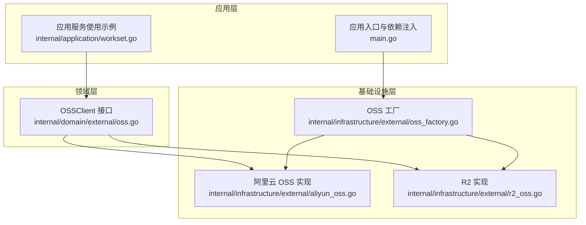
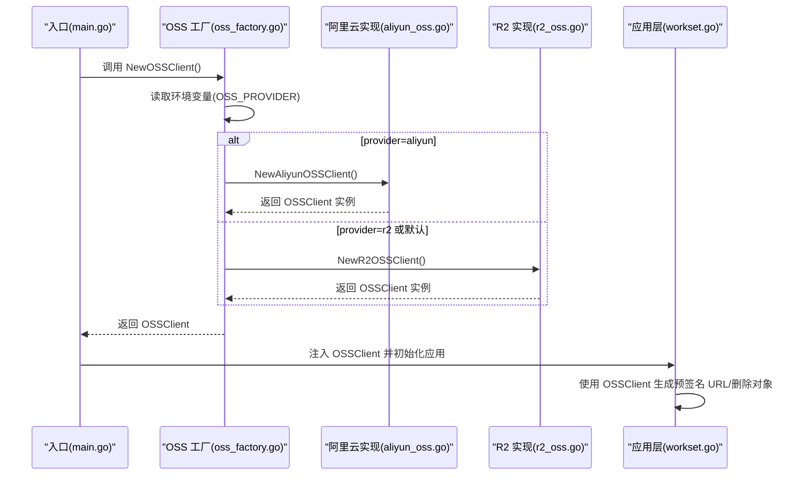
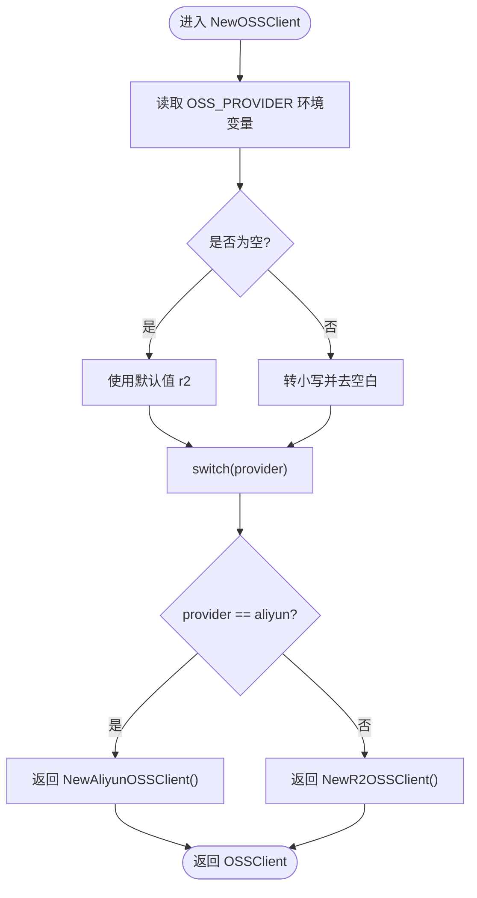
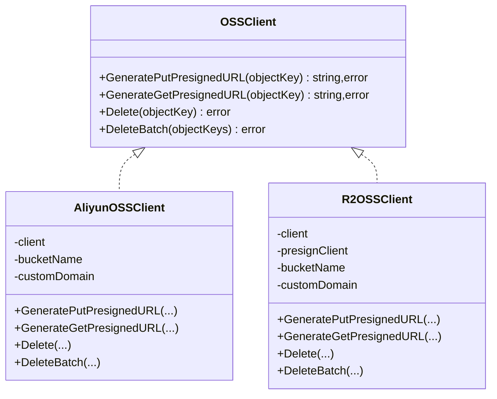
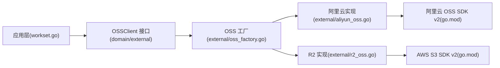

# 多存储服务商支持

<cite>
**本文引用的文件**
- [oss_factory.go](file://internal/infrastructure/external/oss_factory.go)
- [aliyun_oss.go](file://internal/infrastructure/external/aliyun_oss.go)
- [r2_oss.go](file://internal/infrastructure/external/r2_oss.go)
- [oss.go（领域外部接口）](file://internal/domain/external/oss.go)
- [workset.go（应用层使用示例）](file://internal/application/workset.go)
- [main.go（入口与依赖注入）](file://main.go)
- [config.go（应用配置）](file://internal/config/config.go)
- [app_config.json（应用配置文件）](file://app_config.json)
- [go.mod（依赖声明）](file://go.mod)
</cite>

## 目录
1. [简介](#简介)
2. [项目结构](#项目结构)
3. [核心组件](#核心组件)
4. [架构总览](#架构总览)
5. [详细组件分析](#详细组件分析)
6. [依赖分析](#依赖分析)
7. [性能考虑](#性能考虑)
8. [故障排查指南](#故障排查指南)
9. [结论](#结论)
10. [附录](#附录)

## 简介
本文件面向 poprako-web-ms 项目的多存储服务商支持能力，系统性说明如何通过工厂模式在阿里云 OSS 与 Cloudflare R2 之间进行动态切换；详细对比两者配置参数、连接方式与特性差异；解释 OSSFactory 的设计与实现；并提供扩展新存储服务商的步骤与最佳实践。

## 项目结构
围绕“多存储服务商支持”的关键目录与文件如下：
- 领域外部接口：定义统一的 OSSClient 能力边界
- 基础设施实现：阿里云 OSS 与 R2 的具体实现
- 工厂：根据环境变量动态选择具体实现
- 应用层：以接口形式消费 OSSClient，屏蔽实现差异
- 入口：在应用启动时注入 OSSClient

图表来源
- [oss.go（领域外部接口）:1-9](file://internal/domain/external/oss.go#L1-L9)
- [oss_factory.go:1-36](file://internal/infrastructure/external/oss_factory.go#L1-L36)
- [aliyun_oss.go:1-186](file://internal/infrastructure/external/aliyun_oss.go#L1-L186)
- [r2_oss.go:1-244](file://internal/infrastructure/external/r2_oss.go#L1-L244)
- [workset.go（应用层使用示例）:40-126](file://internal/application/workset.go#L40-L126)
- [main.go（入口与依赖注入）:40-146](file://main.go#L40-L146)

章节来源
- [oss_factory.go:1-36](file://internal/infrastructure/external/oss_factory.go#L1-L36)
- [aliyun_oss.go:1-186](file://internal/infrastructure/external/aliyun_oss.go#L1-L186)
- [r2_oss.go:1-244](file://internal/infrastructure/external/r2_oss.go#L1-L244)
- [oss.go（领域外部接口）:1-9](file://internal/domain/external/oss.go#L1-L9)
- [workset.go（应用层使用示例）:40-126](file://internal/application/workset.go#L40-L126)
- [main.go（入口与依赖注入）:40-146](file://main.go#L40-L146)

## 核心组件
- OSSClient 接口：统一抽象上传预签名 URL、下载预签名 URL、单对象删除、批量删除等能力。
- OSSFactory：依据环境变量选择具体实现，默认为 R2。
- 阿里云 OSS 实现：基于阿里云 OSS Go SDK v2，支持自定义域名直链与预签名下载。
- R2 实现：基于 AWS S3 SDK v2（兼容 R2），支持预签名上传与自定义域名直链下载。
- 应用层：以接口形式消费 OSSClient，无需关心底层实现。

章节来源
- [oss.go（领域外部接口）:1-9](file://internal/domain/external/oss.go#L1-L9)
- [oss_factory.go:1-36](file://internal/infrastructure/external/oss_factory.go#L1-L36)
- [aliyun_oss.go:1-186](file://internal/infrastructure/external/aliyun_oss.go#L1-L186)
- [r2_oss.go:1-244](file://internal/infrastructure/external/r2_oss.go#L1-L244)
- [workset.go（应用层使用示例）:40-126](file://internal/application/workset.go#L40-L126)
- [main.go（入口与依赖注入）:40-146](file://main.go#L40-L146)

## 架构总览
下图展示从应用入口到工厂再到具体实现的依赖流向，以及应用层如何通过接口消费能力。

图表来源
- [oss_factory.go:16-35](file://internal/infrastructure/external/oss_factory.go#L16-L35)
- [aliyun_oss.go:23-72](file://internal/infrastructure/external/aliyun_oss.go#L23-L72)
- [r2_oss.go:30-91](file://internal/infrastructure/external/r2_oss.go#L30-L91)
- [workset.go（应用层使用示例）:120-125](file://internal/application/workset.go#L120-L125)
- [main.go（入口与依赖注入）:54-84](file://main.go#L54-L84)

## 详细组件分析

### OSSFactory 工厂模式设计与实现
- 设计要点
  - 通过环境变量 OSS_PROVIDER 动态选择实现，默认值为 R2。
  - 对外暴露统一接口 OSSClient，屏蔽实现差异。
- 关键行为
  - 读取并标准化 OSS_PROVIDER。
  - 若为 aliyun，则返回阿里云实现；否则返回 R2 实现。
- 优点
  - 切换成本低：仅需修改环境变量。
  - 易于扩展：新增实现只需实现 OSSClient 接口并在此处注册分支。

图表来源
- [oss_factory.go:16-35](file://internal/infrastructure/external/oss_factory.go#L16-L35)

章节来源
- [oss_factory.go:1-36](file://internal/infrastructure/external/oss_factory.go#L1-L36)

### 阿里云 OSS 实现（AliyunOSSClient）
- 连接与配置
  - 必填：访问密钥 ID、访问密钥 Secret、区域、Bucket 名称。
  - 可选：自定义 Endpoint（默认按区域推导）、自定义域名。
- 能力与特性
  - 生成上传预签名 URL（默认 10 分钟有效期）。
  - 生成下载预签名 URL（默认 10 分钟有效期）；若配置自定义域名则返回直链。
  - 单对象删除与批量删除，均带重试机制。
- 适用场景
  - 需要稳定的企业级对象存储与全球覆盖。
  - 对下载直链与自定义域名有强需求。
- 成本考量
  - 按请求次数、存储容量、流量计费，适合中高并发与长期存储。

章节来源
- [aliyun_oss.go:23-72](file://internal/infrastructure/external/aliyun_oss.go#L23-L72)
- [aliyun_oss.go:74-119](file://internal/infrastructure/external/aliyun_oss.go#L74-L119)
- [aliyun_oss.go:121-186](file://internal/infrastructure/external/aliyun_oss.go#L121-L186)

### Cloudflare R2 实现（R2OSSClient）
- 连接与配置
  - 必填：账户 ID、访问密钥 ID、密钥、Bucket 名称。
  - 可选：区域（默认 auto）、自定义域名。
- 能力与特性
  - 生成上传预签名 URL（默认 10 分钟有效期）。
  - 下载直链优先：若配置自定义域名则返回直链；否则提示未配置自定义域名。
  - 单对象删除与批量删除，均带重试机制；对 NoSuchKey 做特殊处理。
- 适用场景
  - 低成本边缘网络分发，结合自定义域名可实现就近访问。
  - 对成本敏感且对延迟有要求的场景。
- 成本考量
  - 边缘节点成本较低，但需关注自定义域名带来的额外费用与复杂度。

章节来源
- [r2_oss.go:30-91](file://internal/infrastructure/external/r2_oss.go#L30-L91)
- [r2_oss.go:93-123](file://internal/infrastructure/external/r2_oss.go#L93-L123)
- [r2_oss.go:125-216](file://internal/infrastructure/external/r2_oss.go#L125-L216)
- [r2_oss.go:218-244](file://internal/infrastructure/external/r2_oss.go#L218-L244)

### 应用层对接与使用
- 入口注入
  - 在应用入口创建 OSSClient 并注入到各应用服务。
- 应用层消费
  - 通过 OSSClient 接口生成下载直链或预签名 URL，用于前端直接访问。
- 示例路径
  - 工厂创建与注入：[main.go:54-84](file://main.go#L54-L84)
  - 应用层使用接口生成下载链接：[workset.go:120-125](file://internal/application/workset.go#L120-L125)

章节来源
- [main.go（入口与依赖注入）:54-84](file://main.go#L54-L84)
- [workset.go（应用层使用示例）:120-125](file://internal/application/workset.go#L120-L125)

### 类关系图（代码级）

图表来源
- [oss.go（领域外部接口）:1-9](file://internal/domain/external/oss.go#L1-L9)
- [aliyun_oss.go:15-21](file://internal/infrastructure/external/aliyun_oss.go#L15-L21)
- [r2_oss.go:21-28](file://internal/infrastructure/external/r2_oss.go#L21-L28)

## 依赖分析
- 外部依赖
  - 阿里云 OSS SDK v2：用于阿里云实现。
  - AWS SDK Go v2（S3）：用于 R2 实现。
- 内部耦合
  - 应用层仅依赖 OSSClient 接口，耦合度低，便于替换与扩展。
  - 工厂集中管理实现选择，避免散落的条件判断。

图表来源
- [workset.go（应用层使用示例）:40-126](file://internal/application/workset.go#L40-L126)
- [oss.go（领域外部接口）:1-9](file://internal/domain/external/oss.go#L1-L9)
- [oss_factory.go:1-36](file://internal/infrastructure/external/oss_factory.go#L1-L36)
- [aliyun_oss.go:1-13](file://internal/infrastructure/external/aliyun_oss.go#L1-L13)
- [r2_oss.go:1-18](file://internal/infrastructure/external/r2_oss.go#L1-L18)
- [go.mod:27-47](file://go.mod#L27-L47)

章节来源
- [go.mod:27-47](file://go.mod#L27-L47)
- [oss_factory.go:1-36](file://internal/infrastructure/external/oss_factory.go#L1-L36)
- [aliyun_oss.go:1-13](file://internal/infrastructure/external/aliyun_oss.go#L1-L13)
- [r2_oss.go:1-18](file://internal/infrastructure/external/r2_oss.go#L1-L18)
- [workset.go（应用层使用示例）:40-126](file://internal/application/workset.go#L40-L126)

## 性能考虑
- 预签名 URL 有效期
  - 两类实现均默认 10 分钟有效期，平衡安全性与可用性。
- 重试策略
  - 删除操作均包含最多 3 次重试与固定退避，提升弱网与瞬时异常下的成功率。
- 自定义域名
  - 阿里云与 R2 均支持自定义域名直链，减少预签名开销，降低服务端压力。
- 边缘网络
  - R2 借助 Cloudflare 边缘节点，具备低延迟优势；结合自定义域名可进一步优化就近访问。

章节来源
- [aliyun_oss.go:74-93](file://internal/infrastructure/external/aliyun_oss.go#L74-L93)
- [aliyun_oss.go:121-146](file://internal/infrastructure/external/aliyun_oss.go#L121-L146)
- [r2_oss.go:93-123](file://internal/infrastructure/external/r2_oss.go#L93-L123)
- [r2_oss.go:125-157](file://internal/infrastructure/external/r2_oss.go#L125-L157)

## 故障排查指南
- 环境变量缺失
  - 阿里云：缺少访问密钥 ID、访问密钥 Secret、区域或 Bucket 名称会触发 panic。
  - R2：缺少账户 ID、访问密钥 ID、密钥或 Bucket 名称会触发 panic。
- 自定义域名未配置
  - R2 在未配置自定义域名时，下载直链不可用，需先配置再使用。
- 删除失败
  - 若出现 NoSuchKey 错误，实现会视为成功（幂等处理）。
  - 批量删除时，非 NoSuchKey 的错误会被汇总并返回。
- 预签名 URL 生成失败
  - 检查对象 Key 是否正确、内容类型推断逻辑是否匹配实际文件扩展名。

章节来源
- [aliyun_oss.go:34-53](file://internal/infrastructure/external/aliyun_oss.go#L34-L53)
- [r2_oss.go:41-65](file://internal/infrastructure/external/r2_oss.go#L41-L65)
- [r2_oss.go:117-123](file://internal/infrastructure/external/r2_oss.go#L117-L123)
- [r2_oss.go:143-147](file://internal/infrastructure/external/r2_oss.go#L143-L147)
- [r2_oss.go:189-201](file://internal/infrastructure/external/r2_oss.go#L189-L201)

## 结论
- 通过工厂模式与统一接口，项目实现了对多存储服务商的无缝切换与扩展。
- 阿里云 OSS 适合企业级稳定性与全球覆盖，R2 更偏向低成本与边缘网络优势。
- 建议在生产环境中优先配置自定义域名以获得更优的访问体验与成本控制。

## 附录

### 配置参数对照表
- 阿里云 OSS（必填）
  - ALIYUN_OSS_ACCESS_KEY_ID
  - ALIYUN_OSS_ACCESS_KEY_SECRET
  - ALIYUN_OSS_REGION
  - ALIYUN_OSS_BUCKET_NAME
- 阿里云 OSS（可选）
  - ALIYUN_OSS_ENDPOINT
  - ALIYUN_OSS_CUSTOM_DOMAIN
- R2（必填）
  - R2_ACCOUNT_ID
  - R2_ACCESS_KEY_ID
  - R2_SECRET_ACCESS_KEY
  - R2_BUCKET_NAME
- R2（可选）
  - R2_REGION
  - R2_CUSTOM_DOMAIN
- 工厂选择
  - OSS_PROVIDER：r2（默认）或 aliyun

章节来源
- [aliyun_oss.go:24-33](file://internal/infrastructure/external/aliyun_oss.go#L24-L33)
- [r2_oss.go:31-40](file://internal/infrastructure/external/r2_oss.go#L31-L40)
- [oss_factory.go:10-14](file://internal/infrastructure/external/oss_factory.go#L10-L14)

### 存储服务商切换与扩展指南
- 切换步骤
  - 设置 OSS_PROVIDER=r2 或 OSS_PROVIDER=aliyun。
  - 按目标服务商填写对应必填环境变量。
  - 如需直链访问，配置自定义域名。
- 扩展新存储服务商
  - 实现 OSSClient 接口（生成上传/下载预签名 URL、单对象与批量删除）。
  - 在工厂 switch 分支中添加新分支并返回新实现。
  - 在应用入口注入新实现或保持现有注入方式。
- 最佳实践
  - 将所有环境变量集中管理，避免硬编码。
  - 为不同环境（开发/测试/生产）分别维护配置文件。
  - 对删除与批量删除增加可观测性与告警。

章节来源
- [oss.go（领域外部接口）:1-9](file://internal/domain/external/oss.go#L1-L9)
- [oss_factory.go:16-35](file://internal/infrastructure/external/oss_factory.go#L16-L35)
- [main.go（入口与依赖注入）:54-84](file://main.go#L54-L84)