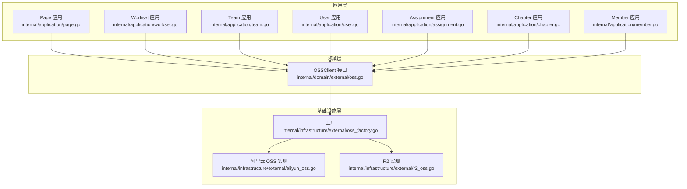
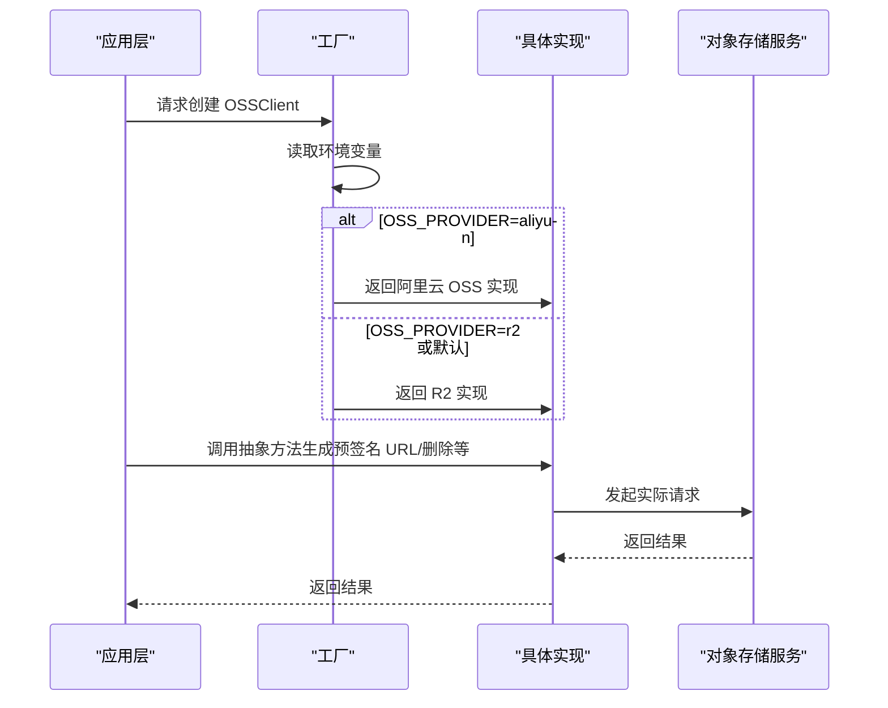
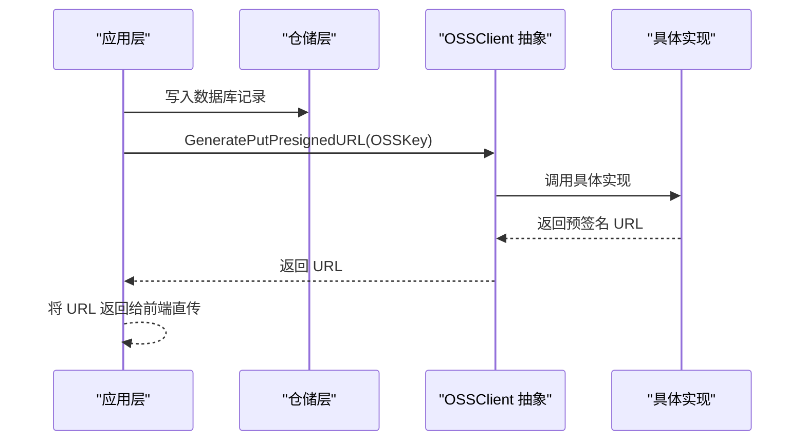
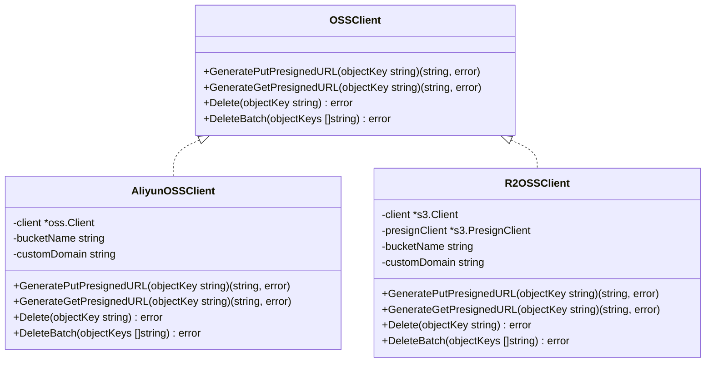
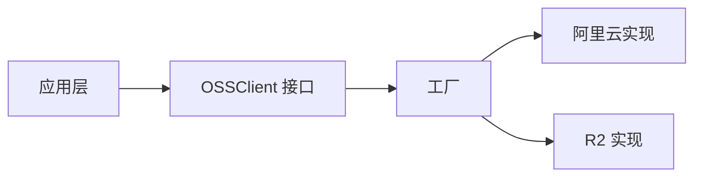

# 存储抽象层

<cite>
**本文引用的文件**
- [oss.go](file://internal/domain/external/oss.go)
- [oss_factory.go](file://internal/infrastructure/external/oss_factory.go)
- [aliyun_oss.go](file://internal/infrastructure/external/aliyun_oss.go)
- [r2_oss.go](file://internal/infrastructure/external/r2_oss.go)
- [page.go](file://internal/application/page.go)
- [workset.go](file://internal/application/workset.go)
- [team.go](file://internal/application/team.go)
- [user.go](file://internal/application/user.go)
- [assignment.go](file://internal/application/assignment.go)
- [chapter.go](file://internal/application/chapter.go)
- [member.go](file://internal/application/member.go)
- [page.go](file://internal/domain/service/page.go)
</cite>

## 目录
1. [简介](#简介)
2. [项目结构](#项目结构)
3. [核心组件](#核心组件)
4. [架构总览](#架构总览)
5. [详细组件分析](#详细组件分析)
6. [依赖分析](#依赖分析)
7. [性能考虑](#性能考虑)
8. [故障排查指南](#故障排查指南)
9. [结论](#结论)
10. [附录](#附录)

## 简介
本文件系统性阐述 poprako-web-ms 项目的“存储抽象层”。该抽象层以接口形式定义统一的 OSS 访问能力，屏蔽底层不同云厂商或对象存储服务（如阿里云 OSS、Cloudflare R2）的差异，使上层应用仅面向抽象接口编程，从而实现：
- 存储服务的统一接口与解耦设计
- 运行时按环境变量动态切换具体实现
- 易于扩展新的存储后端
- 统一的错误处理与重试策略

## 项目结构
存储抽象层位于领域层与基础设施层之间，采用“接口在领域层、实现于基础设施层”的分层模式：
- 领域层定义接口：OSSClient 抽象
- 基础设施层提供实现：阿里云 OSS、Cloudflare R2
- 工厂负责实例化：根据环境变量选择具体实现
- 应用层通过注入 OSSClient 使用抽象能力

图表来源
- [oss.go:1-9](file://internal/domain/external/oss.go#L1-L9)
- [oss_factory.go:1-36](file://internal/infrastructure/external/oss_factory.go#L1-L36)
- [aliyun_oss.go:1-186](file://internal/infrastructure/external/aliyun_oss.go#L1-L186)
- [r2_oss.go:1-244](file://internal/infrastructure/external/r2_oss.go#L1-L244)
- [page.go:1-200](file://internal/application/page.go#L1-L200)
- [workset.go:1-310](file://internal/application/workset.go#L1-L310)
- [team.go:1-320](file://internal/application/team.go#L1-L320)
- [user.go:1-500](file://internal/application/user.go#L1-L500)
- [assignment.go:1-300](file://internal/application/assignment.go#L1-L300)
- [chapter.go:1-300](file://internal/application/chapter.go#L1-L300)
- [member.go:1-300](file://internal/application/member.go#L1-L300)

章节来源
- [oss.go:1-9](file://internal/domain/external/oss.go#L1-L9)
- [oss_factory.go:1-36](file://internal/infrastructure/external/oss_factory.go#L1-L36)

## 核心组件
- OSSClient 接口：定义统一的存储访问能力，包括生成上传/下载预签名 URL、删除单个对象、批量删除对象。
- 工厂 NewOSSClient：依据环境变量选择具体实现（默认 R2，可切换阿里云 OSS）。
- 阿里云 OSS 实现：基于阿里云 OSS SDK v2，支持自定义域名直链与预签名 URL。
- R2 实现：基于 AWS S3 SDK（兼容 R2），支持预签名 URL 与自定义域名直链。
- 应用层注入：各应用模块在构造函数中接收 OSSClient，面向抽象编程。

章节来源
- [oss.go:3-8](file://internal/domain/external/oss.go#L3-L8)
- [oss_factory.go:16-35](file://internal/infrastructure/external/oss_factory.go#L16-L35)
- [aliyun_oss.go:15-72](file://internal/infrastructure/external/aliyun_oss.go#L15-L72)
- [r2_oss.go:21-91](file://internal/infrastructure/external/r2_oss.go#L21-L91)

## 架构总览
存储抽象层通过“接口 + 工厂 + 多实现”的方式，将应用层与具体存储实现解耦。运行时由环境变量决定使用哪个实现；开发/测试阶段可轻松替换为其他实现。

图表来源
- [oss_factory.go:16-35](file://internal/infrastructure/external/oss_factory.go#L16-L35)
- [aliyun_oss.go:34-72](file://internal/infrastructure/external/aliyun_oss.go#L34-L72)
- [r2_oss.go:41-91](file://internal/infrastructure/external/r2_oss.go#L41-L91)

## 详细组件分析

### OSSClient 接口设计与方法语义
- GeneratePutPresignedURL(objectKey string) (string, error)
  - 作用：为上传对象生成短期有效的预签名 URL，供客户端直传。
  - 参数：objectKey 为对象键（路径/名称）。
  - 返回：预签名 URL 字符串；错误时返回封装后的错误。
  - 实现要求：应设置合理的过期时间；对图片类型可自动设置 Content-Type。
- GenerateGetPresignedURL(objectKey string) (string, error)
  - 作用：为读取对象生成短期有效的预签名 URL 或直链。
  - 参数：objectKey 为对象键。
  - 返回：URL 字符串；若未配置自定义域名且无法生成签名 URL，则返回错误。
  - 实现要求：优先使用自定义域名直链；否则生成短期签名 URL。
- Delete(objectKey string) error
  - 作用：删除单个对象。
  - 参数：objectKey 为对象键。
  - 返回：错误时返回封装后的错误。
  - 实现要求：具备幂等性与重试机制；对“对象不存在”场景需做特殊处理。
- DeleteBatch(objectKeys []string) error
  - 作用：批量删除对象。
  - 参数：objectKeys 为对象键数组。
  - 返回：错误时返回封装后的错误。
  - 实现要求：空数组直接返回；对部分失败进行聚合错误处理；具备重试机制。

章节来源
- [oss.go:3-8](file://internal/domain/external/oss.go#L3-L8)

### 工厂与运行时选择
- 环境变量 OSS_PROVIDER 控制实现选择：
  - r2：Cloudflare R2（默认）
  - aliyun：阿里云 OSS
- NewOSSClient 根据环境变量返回对应实现实例。

章节来源
- [oss_factory.go:10-35](file://internal/infrastructure/external/oss_factory.go#L10-L35)

### 阿里云 OSS 实现要点
- 初始化：从环境变量读取密钥、区域、桶名、可选端点与自定义域名。
- 生成上传预签名 URL：设置过期时间与可选 Content-Type。
- 生成下载预签名 URL：优先自定义域名直链；否则生成签名 URL。
- 删除与批量删除：带重试与错误聚合；对“对象不存在”视为成功。

章节来源
- [aliyun_oss.go:23-72](file://internal/infrastructure/external/aliyun_oss.go#L23-L72)
- [aliyun_oss.go:74-93](file://internal/infrastructure/external/aliyun_oss.go#L74-L93)
- [aliyun_oss.go:95-119](file://internal/infrastructure/external/aliyun_oss.go#L95-L119)
- [aliyun_oss.go:121-146](file://internal/infrastructure/external/aliyun_oss.go#L121-L146)
- [aliyun_oss.go:148-185](file://internal/infrastructure/external/aliyun_oss.go#L148-L185)

### R2 实现要点
- 初始化：从环境变量读取账户、密钥、区域、桶名、可选自定义域名与端点。
- 生成上传预签名 URL：设置过期时间与可选 Content-Type。
- 生成下载预签名 URL：当前实现依赖自定义域名直链；未配置时返回错误。
- 删除与批量删除：带重试；对“对象不存在”视为成功；对批量删除聚合非“对象不存在”的错误。

章节来源
- [r2_oss.go:30-91](file://internal/infrastructure/external/r2_oss.go#L30-L91)
- [r2_oss.go:93-112](file://internal/infrastructure/external/r2_oss.go#L93-L112)
- [r2_oss.go:114-123](file://internal/infrastructure/external/r2_oss.go#L114-L123)
- [r2_oss.go:125-157](file://internal/infrastructure/external/r2_oss.go#L125-L157)
- [r2_oss.go:159-216](file://internal/infrastructure/external/r2_oss.go#L159-L216)

### 应用层对接与最佳实践
- 注入与使用：应用层构造函数接收 OSSClient，并在业务流程中调用抽象方法。
- 生成上传预签名 URL：在创建页面等场景，先写入数据库，再生成预签名 URL 返回给前端直传。
- 生成下载预签名 URL：在组装实体信息时，将抽象方法作为回调传入，避免直接依赖具体实现。
- 删除操作：在删除资源时，先删除数据库记录，再删除对象存储中的文件，确保一致性。
- 错误处理：应用层捕获并包装错误，保持对外一致的错误语义。

图表来源
- [page.go:164-187](file://internal/application/page.go#L164-L187)
- [oss.go:4-5](file://internal/domain/external/oss.go#L4-L5)

章节来源
- [page.go:164-187](file://internal/application/page.go#L164-L187)
- [workset.go:120-125](file://internal/application/workset.go#L120-L125)
- [team.go:214-218](file://internal/application/team.go#L214-L218)
- [user.go:453-457](file://internal/application/user.go#L453-L457)
- [assignment.go:150-154](file://internal/application/assignment.go#L150-L154)
- [chapter.go:214-218](file://internal/application/chapter.go#L214-L218)
- [member.go:190-194](file://internal/application/member.go#L190-L194)

### 类图：接口与实现

图表来源
- [oss.go:3-8](file://internal/domain/external/oss.go#L3-L8)
- [aliyun_oss.go:15-72](file://internal/infrastructure/external/aliyun_oss.go#L15-L72)
- [r2_oss.go:21-91](file://internal/infrastructure/external/r2_oss.go#L21-L91)

## 依赖分析
- 耦合关系
  - 应用层仅依赖接口，不直接依赖具体实现，降低耦合。
  - 工厂集中管理实现选择，便于扩展新实现。
- 外部依赖
  - 阿里云 OSS：使用官方 SDK v2。
  - R2：使用 AWS S3 SDK（兼容 R2）。
- 循环依赖
  - 无循环依赖：接口在领域层，实现与工厂在基础设施层，应用层仅依赖接口。

图表来源
- [oss.go:3-8](file://internal/domain/external/oss.go#L3-L8)
- [oss_factory.go:16-35](file://internal/infrastructure/external/oss_factory.go#L16-L35)
- [aliyun_oss.go:34-72](file://internal/infrastructure/external/aliyun_oss.go#L34-L72)
- [r2_oss.go:41-91](file://internal/infrastructure/external/r2_oss.go#L41-L91)

章节来源
- [oss.go:3-8](file://internal/domain/external/oss.go#L3-L8)
- [oss_factory.go:16-35](file://internal/infrastructure/external/oss_factory.go#L16-L35)

## 性能考虑
- 预签名 URL 的过期时间：默认约 10 分钟，建议根据上传规模与网络状况调整。
- 批量删除：R2 实现会聚合非“对象不存在”的错误，减少多次往返；阿里云实现使用批量删除接口，提升吞吐。
- 自定义域名直链：优先使用自定义域名可减少签名开销，但需确保 CDN/证书配置正确。
- 重试策略：实现均内置有限重试与退避，避免瞬时错误导致失败。

## 故障排查指南
- 环境变量缺失
  - 阿里云：缺少密钥、区域、桶名等会导致初始化 panic。
  - R2：缺少账户、密钥、桶名等会导致初始化 panic。
- 未配置自定义域名
  - R2 的下载预签名 URL 生成会返回错误；请配置自定义域名或改为使用签名 URL。
- 对象不存在
  - 删除操作对“对象不存在”视为成功；若业务需要严格校验，请在应用层增加额外检查。
- 批量删除部分失败
  - R2 实现会聚合非“对象不存在”的错误；请检查返回的错误集合并重试失败项。
- 重试失败
  - 若多次重试仍失败，检查网络、凭证与桶权限；必要时缩短过期时间或调整重试次数。

章节来源
- [aliyun_oss.go:35-53](file://internal/infrastructure/external/aliyun_oss.go#L35-L53)
- [r2_oss.go:42-65](file://internal/infrastructure/external/r2_oss.go#L42-L65)
- [r2_oss.go:117-123](file://internal/infrastructure/external/r2_oss.go#L117-L123)
- [r2_oss.go:143-147](file://internal/infrastructure/external/r2_oss.go#L143-L147)
- [r2_oss.go:189-200](file://internal/infrastructure/external/r2_oss.go#L189-L200)
- [aliyun_oss.go:122-146](file://internal/infrastructure/external/aliyun_oss.go#L122-L146)
- [r2_oss.go:125-157](file://internal/infrastructure/external/r2_oss.go#L125-L157)
- [r2_oss.go:159-216](file://internal/infrastructure/external/r2_oss.go#L159-L216)

## 结论
存储抽象层通过简洁的接口与工厂化选择，实现了跨存储后端的一致性与可扩展性。应用层无需关心具体实现细节，即可获得稳定的上传、下载与删除能力。建议在新增存储后端时遵循现有接口契约与错误处理规范，确保行为一致。

## 附录

### 方法参数与返回值一览
- GeneratePutPresignedURL
  - 输入：objectKey（字符串）
  - 输出：预签名 URL（字符串）、错误
- GenerateGetPresignedURL
  - 输入：objectKey（字符串）
  - 输出：URL（字符串）、错误
- Delete
  - 输入：objectKey（字符串）
  - 输出：错误
- DeleteBatch
  - 输入：objectKeys（字符串切片）
  - 输出：错误

章节来源
- [oss.go:3-8](file://internal/domain/external/oss.go#L3-L8)

### 最佳实践与扩展指南
- 新增存储实现
  - 实现 OSSClient 接口的所有方法，保持错误返回格式一致。
  - 在工厂中注册新实现的选择逻辑。
- 错误处理
  - 对外返回统一的错误包装，避免泄露底层实现细节。
- 性能优化
  - 合理设置预签名 URL 过期时间；优先使用自定义域名直链。
  - 批量删除时尽量合并请求，减少往返。
- 测试策略
  - 单元测试覆盖关键分支（成功、失败、重试、空输入）。
  - 集成测试验证与真实对象存储的交互。