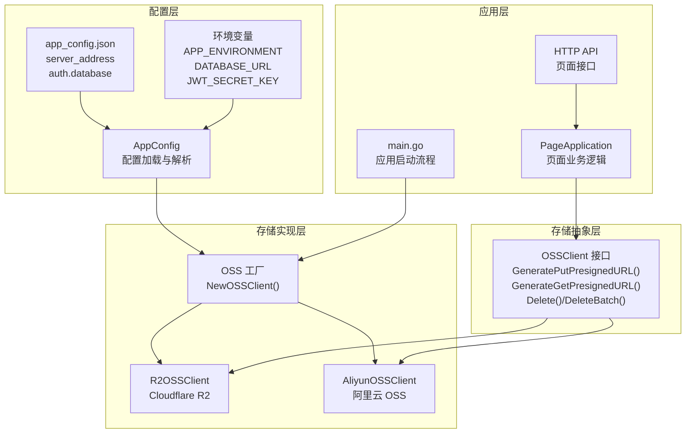
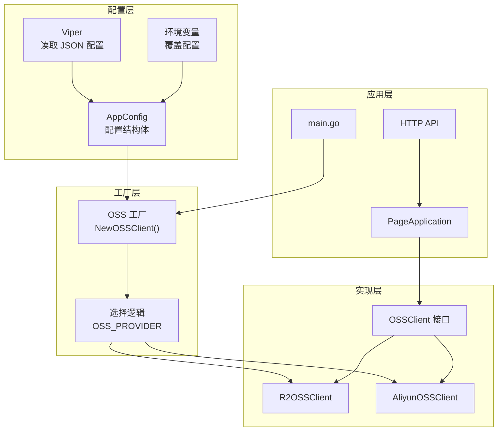
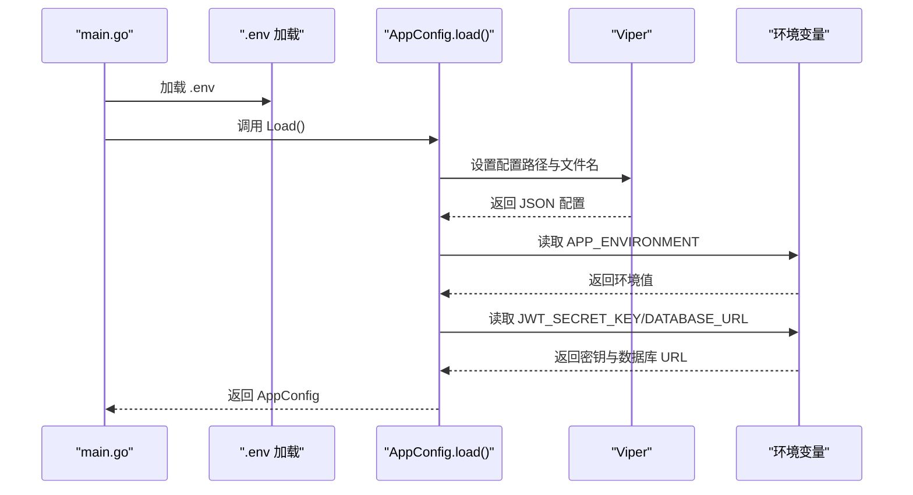
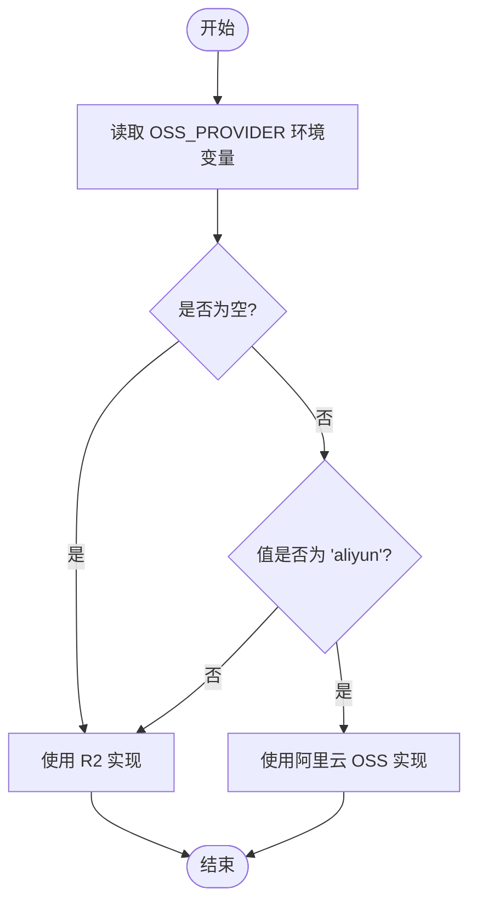
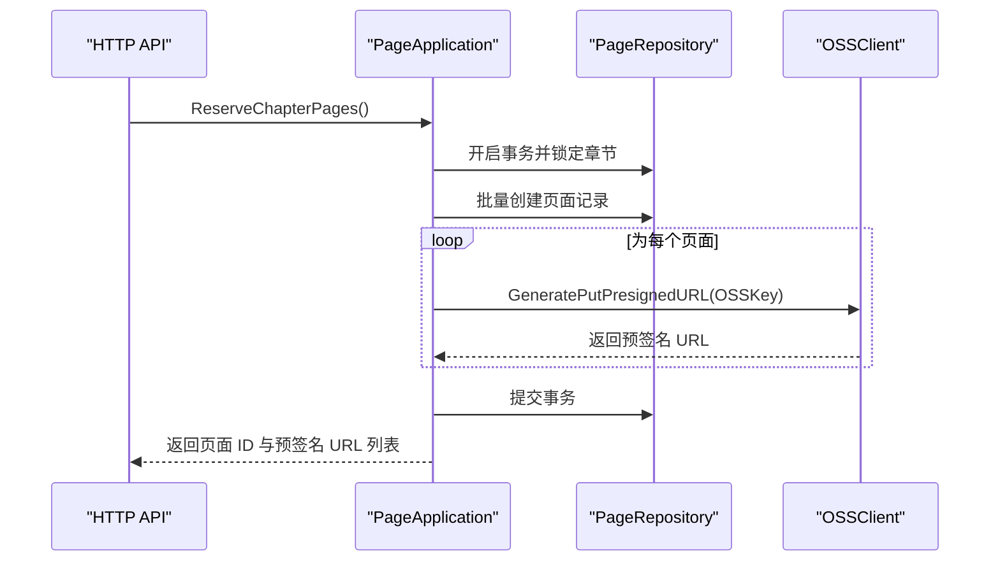
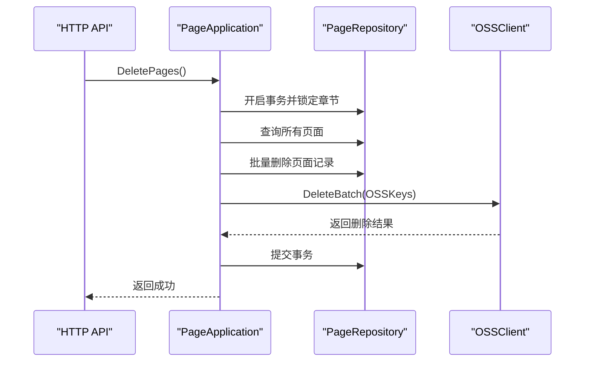
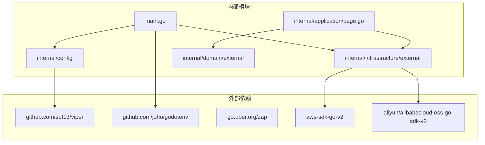

# 存储配置管理

<cite>
**本文档引用的文件**
- [config.go](file://internal/config/config.go)
- [oss_factory.go](file://internal/infrastructure/external/oss_factory.go)
- [aliyun_oss.go](file://internal/infrastructure/external/aliyun_oss.go)
- [r2_oss.go](file://internal/infrastructure/external/r2_oss.go)
- [oss.go](file://internal/domain/external/oss.go)
- [app_config.json](file://app_config.json)
- [main.go](file://main.go)
- [page.go](file://internal/application/page.go)
- [page_api.go](file://internal/api/http/page.go)
</cite>

## 目录
1. [简介](#简介)
2. [项目结构](#项目结构)
3. [核心组件](#核心组件)
4. [架构概览](#架构概览)
5. [详细组件分析](#详细组件分析)
6. [依赖关系分析](#依赖关系分析)
7. [性能考虑](#性能考虑)
8. [故障排查指南](#故障排查指南)
9. [结论](#结论)
10. [附录](#附录)

## 简介

本文件为 poprako-web-ms 项目的存储配置管理详细文档，重点说明存储配置的结构和参数设置，涵盖不同存储服务商的配置项、认证信息和连接参数。文档解释配置文件的加载机制、环境变量支持和配置优先级，说明存储配置的安全管理策略，包括密钥保护、配置加密和访问控制。同时提供配置验证、故障排查和最佳实践指南，并包含配置更新的热重载机制和配置变更的影响分析。

## 项目结构

存储配置管理涉及以下关键模块：
- 配置加载与解析：通过 Viper 读取 JSON 配置文件并结合环境变量进行覆盖
- 存储客户端工厂：根据环境变量动态选择具体的 OSS 服务提供商
- 存储客户端实现：分别对接阿里云 OSS 和 Cloudflare R2
- 应用层集成：在应用启动时创建 OSS 客户端并注入到各业务应用层

**图表来源**
- [config.go:11-59](file://internal/config/config.go#L11-L59)
- [oss_factory.go:16-35](file://internal/infrastructure/external/oss_factory.go#L16-L35)
- [r2_oss.go:30-91](file://internal/infrastructure/external/r2_oss.go#L30-L91)
- [aliyun_oss.go:23-72](file://internal/infrastructure/external/aliyun_oss.go#L23-L72)
- [oss.go:3-8](file://internal/domain/external/oss.go#L3-L8)
- [main.go:25-54](file://main.go#L25-L54)
- [page.go:93-187](file://internal/application/page.go#L93-L187)
- [page_api.go:54-95](file://internal/api/http/page.go#L54-L95)

**章节来源**
- [config.go:11-59](file://internal/config/config.go#L11-L59)
- [oss_factory.go:16-35](file://internal/infrastructure/external/oss_factory.go#L16-L35)
- [r2_oss.go:30-91](file://internal/infrastructure/external/r2_oss.go#L30-L91)
- [aliyun_oss.go:23-72](file://internal/infrastructure/external/aliyun_oss.go#L23-L72)
- [oss.go:3-8](file://internal/domain/external/oss.go#L3-L8)
- [main.go:25-54](file://main.go#L25-L54)
- [page.go:93-187](file://internal/application/page.go#L93-L187)
- [page_api.go:54-95](file://internal/api/http/page.go#L54-L95)

## 核心组件

### 配置加载与解析

AppConfig 负责从 JSON 配置文件读取基础配置，并通过环境变量进行覆盖。其加载流程如下：
- 使用 Viper 读取当前目录下的 app_config.json 文件
- 将配置映射到结构体字段
- 读取 APP_ENVIRONMENT 环境变量设置运行环境
- 加载认证配置（JWT 密钥）和数据库配置（连接 URL）

配置文件 app_config.json 包含以下关键字段：
- server_address：服务器监听地址
- auth.expiration_hours：JWT 过期时间（小时）
- database.min_idle_connections：最小空闲连接数
- database.max_open_connections：最大打开连接数

**章节来源**
- [config.go:11-59](file://internal/config/config.go#L11-L59)
- [app_config.json:1-11](file://app_config.json#L1-L11)

### 存储客户端工厂

OSS 工厂根据 OSS_PROVIDER 环境变量选择具体实现：
- r2：Cloudflare R2，默认选项
- aliyun：阿里云 OSS Go SDK v2

当 OSS_PROVIDER 未设置或为空时，默认使用 R2 实现。

**章节来源**
- [oss_factory.go:16-35](file://internal/infrastructure/external/oss_factory.go#L16-L35)

### 存储客户端实现

#### R2OSSClient（Cloudflare R2）
- 必需环境变量：
  - R2_ACCOUNT_ID：账户 ID
  - R2_ACCESS_KEY_ID：访问密钥 ID
  - R2_SECRET_ACCESS_KEY：访问密钥
  - R2_BUCKET_NAME：存储桶名称
- 可选环境变量：
  - R2_REGION：区域，默认 auto
  - R2_CUSTOM_DOMAIN：自定义域名
- 功能特性：
  - 生成上传预签名 URL（10 分钟有效期）
  - 生成下载 URL（优先使用自定义域名直链）
  - 单对象删除与批量删除（带重试机制）

#### AliyunOSSClient（阿里云 OSS）
- 必需环境变量：
  - ALIYUN_OSS_ACCESS_KEY_ID：访问密钥 ID
  - ALIYUN_OSS_ACCESS_KEY_SECRET：访问密钥
  - ALIYUN_OSS_REGION：区域
  - ALIYUN_OSS_BUCKET_NAME：存储桶名称
- 可选环境变量：
  - ALIYUN_OSS_ENDPOINT：自定义端点（未设置时按区域自动推导）
  - ALIYUN_OSS_CUSTOM_DOMAIN：自定义域名
- 功能特性：
  - 生成上传预签名 URL（10 分钟有效期）
  - 生成下载 URL（优先使用自定义域名直链）
  - 单对象删除与批量删除（带重试机制）

**章节来源**
- [r2_oss.go:30-91](file://internal/infrastructure/external/r2_oss.go#L30-L91)
- [aliyun_oss.go:23-72](file://internal/infrastructure/external/aliyun_oss.go#L23-L72)

### 应用层集成

应用启动时通过工厂创建 OSS 客户端，并将其注入到各业务应用层（如 PageApplication）。页面业务逻辑在创建页面时生成预签名上传 URL，在列出页面时生成预签名下载 URL，并在删除章节时批量清理 OSS 资源。

**章节来源**
- [main.go:54](file://main.go#L54)
- [page.go:164-177](file://internal/application/page.go#L164-L177)
- [page.go:244](file://internal/application/page.go#L244)
- [page.go:389](file://internal/application/page.go#L389)

## 架构概览

存储配置管理采用分层架构，确保配置与实现解耦：

**图表来源**
- [config.go:29-59](file://internal/config/config.go#L29-L59)
- [oss_factory.go:21-35](file://internal/infrastructure/external/oss_factory.go#L21-L35)
- [oss.go:3-8](file://internal/domain/external/oss.go#L3-L8)
- [main.go:54](file://main.go#L54)
- [page.go:93-187](file://internal/application/page.go#L93-L187)

## 详细组件分析

### 配置加载流程

**图表来源**
- [main.go:25-33](file://main.go#L25-L33)
- [config.go:29-59](file://internal/config/config.go#L29-L59)

**章节来源**
- [main.go:25-33](file://main.go#L25-L33)
- [config.go:29-59](file://internal/config/config.go#L29-L59)

### 存储客户端选择流程

**图表来源**
- [oss_factory.go:21-35](file://internal/infrastructure/external/oss_factory.go#L21-L35)

**章节来源**
- [oss_factory.go:21-35](file://internal/infrastructure/external/oss_factory.go#L21-L35)

### 页面预签名 URL 生成流程

**图表来源**
- [page_api.go:67-95](file://internal/api/http/page.go#L67-L95)
- [page.go:139-187](file://internal/application/page.go#L139-L187)
- [oss.go:4-5](file://internal/domain/external/oss.go#L4-L5)

**章节来源**
- [page_api.go:67-95](file://internal/api/http/page.go#L67-L95)
- [page.go:139-187](file://internal/application/page.go#L139-L187)
- [oss.go:4-5](file://internal/domain/external/oss.go#L4-L5)

### 页面资源删除流程

**图表来源**
- [page_api.go:162-188](file://internal/api/http/page.go#L162-L188)
- [page.go:343-401](file://internal/application/page.go#L343-L401)
- [oss.go:6-7](file://internal/domain/external/oss.go#L6-L7)

**章节来源**
- [page_api.go:162-188](file://internal/api/http/page.go#L162-L188)
- [page.go:343-401](file://internal/application/page.go#L343-L401)
- [oss.go:6-7](file://internal/domain/external/oss.go#L6-L7)

## 依赖关系分析

存储配置管理的关键依赖关系如下：

**图表来源**
- [main.go:12-23](file://main.go#L12-L23)
- [config.go:3-8](file://internal/config/config.go#L3-L8)
- [r2_oss.go:12-16](file://internal/infrastructure/external/r2_oss.go#L12-L16)
- [aliyun_oss.go:9](file://internal/infrastructure/external/aliyun_oss.go#L9)

**章节来源**
- [main.go:12-23](file://main.go#L12-L23)
- [config.go:3-8](file://internal/config/config.go#L3-L8)
- [r2_oss.go:12-16](file://internal/infrastructure/external/r2_oss.go#L12-L16)
- [aliyun_oss.go:9](file://internal/infrastructure/external/aliyun_oss.go#L9)

## 性能考虑

- 预签名 URL 有效期：R2 和阿里云 OSS 的上传预签名 URL 均设置为 10 分钟，平衡安全性与用户体验
- 批量删除重试：R2 和阿里云 OSS 的批量删除均实现最多 3 次重试，每次重试间隔 500ms，提升删除成功率
- 连接池配置：数据库连接池通过 app_config.json 中的 min_idle_connections 和 max_open_connections 控制
- 环境变量优先：敏感配置通过环境变量注入，避免硬编码在代码中

[本节为通用性能讨论，无需特定文件来源]

## 故障排查指南

### 配置加载问题
- 症状：应用启动时报错提示配置文件读取失败或环境变量未设置
- 排查步骤：
  1. 检查 app_config.json 是否存在且格式正确
  2. 确认 APP_ENVIRONMENT、DATABASE_URL、JWT_SECRET_KEY 环境变量是否设置
  3. 验证 .env 文件是否正确加载

**章节来源**
- [config.go:36-47](file://internal/config/config.go#L36-L47)
- [main.go:26-28](file://main.go#L26-L28)

### 存储客户端初始化问题
- 症状：创建 OSS 客户端时抛出 panic 或报错
- 排查步骤：
  1. 检查 OSS_PROVIDER 环境变量值是否为 "r2" 或 "aliyun"
  2. 对于 R2：确认 R2_ACCOUNT_ID、R2_ACCESS_KEY_ID、R2_SECRET_ACCESS_KEY、R2_BUCKET_NAME 是否设置
  3. 对于阿里云 OSS：确认 ALIYUN_OSS_ACCESS_KEY_ID、ALIYUN_OSS_ACCESS_KEY_SECRET、ALIYUN_OSS_REGION、ALIYUN_OSS_BUCKET_NAME 是否设置

**章节来源**
- [oss_factory.go:22-25](file://internal/infrastructure/external/oss_factory.go#L22-L25)
- [r2_oss.go:42-65](file://internal/infrastructure/external/r2_oss.go#L42-L65)
- [aliyun_oss.go:35-53](file://internal/infrastructure/external/aliyun_oss.go#L35-L53)

### 预签名 URL 生成失败
- 症状：页面预留时无法生成上传预签名 URL
- 排查步骤：
  1. 检查对应存储服务的凭据是否正确
  2. 确认存储桶名称与权限配置
  3. 查看应用日志中的详细错误信息

**章节来源**
- [page.go:167-174](file://internal/application/page.go#L167-L174)

### 页面删除异常
- 症状：删除章节页面时出现部分对象删除失败
- 排查步骤：
  1. 检查返回的错误列表，确认是否存在 NoSuchKey 错误
  2. 验证存储桶中是否存在对应的对象
  3. 查看重试日志，确认是否达到最大重试次数

**章节来源**
- [r2_oss.go:159-216](file://internal/infrastructure/external/r2_oss.go#L159-L216)
- [aliyun_oss.go:148-185](file://internal/infrastructure/external/aliyun_oss.go#L148-L185)

## 结论

本项目采用清晰的分层架构管理存储配置，通过 Viper 解析 JSON 配置文件并结合环境变量实现灵活的配置覆盖。存储客户端工厂根据 OSS_PROVIDER 环境变量动态选择具体的 OSS 服务提供商，支持 R2 和阿里云 OSS。应用层通过统一的 OSSClient 接口实现对不同存储服务的透明访问。

配置管理的关键优势：
- 环境变量优先：敏感配置通过环境变量注入，提升安全性
- 工厂模式：支持多存储提供商切换，便于测试和迁移
- 预签名 URL：减少服务端压力，提升上传下载性能
- 批量操作重试：提高删除等批量操作的可靠性

建议在生产环境中：
- 使用专用的环境变量管理工具
- 定期轮换存储访问密钥
- 监控存储服务的使用指标
- 建立配置变更的审批流程

[本节为总结性内容，无需特定文件来源]

## 附录

### 配置参数对照表

| 配置项 | 类型 | 必填 | 描述 | 示例 |
|--------|------|------|------|------|
| APP_ENVIRONMENT | 字符串 | 是 | 运行环境 | development/production |
| DATABASE_URL | 字符串 | 是 | 数据库连接 URL | postgres://... |
| JWT_SECRET_KEY | 字符串 | 是 | JWT 密钥 | 随机字符串 |
| OSS_PROVIDER | 字符串 | 否 | 存储提供商 | r2/aliyun |
| R2_ACCOUNT_ID | 字符串 | 是(R2) | R2 账户 ID | cf-account-id |
| R2_ACCESS_KEY_ID | 字符串 | 是(R2) | R2 访问密钥 ID | cf-access-key |
| R2_SECRET_ACCESS_KEY | 字符串 | 是(R2) | R2 访问密钥 | cf-secret-key |
| R2_BUCKET_NAME | 字符串 | 是(R2) | R2 存储桶名称 | bucket-name |
| R2_REGION | 字符串 | 否(R2) | R2 区域 | auto |
| R2_CUSTOM_DOMAIN | 字符串 | 否(R2) | 自定义域名 | cdn.example.com |
| ALIYUN_OSS_ACCESS_KEY_ID | 字符串 | 是(阿里云) | 阿里云访问密钥 ID | aliyun-access-key |
| ALIYUN_OSS_ACCESS_KEY_SECRET | 字符串 | 是(阿里云) | 阿里云访问密钥 | aliyun-secret-key |
| ALIYUN_OSS_REGION | 字符串 | 是(阿里云) | 阿里云区域 | cn-hangzhou |
| ALIYUN_OSS_BUCKET_NAME | 字符串 | 是(阿里云) | 阿里云存储桶名称 | bucket-name |
| ALIYUN_OSS_ENDPOINT | 字符串 | 否(阿里云) | 自定义端点 | 自定义端点 |
| ALIYUN_OSS_CUSTOM_DOMAIN | 字符串 | 否(阿里云) | 自定义域名 | cdn.example.com |

### 热重载机制说明

当前实现不支持配置的热重载。配置在应用启动时一次性加载并固定使用。如需修改配置，需要重启应用以重新加载新的配置。

**章节来源**
- [config.go:29-59](file://internal/config/config.go#L29-L59)
- [main.go:30-33](file://main.go#L30-L33)