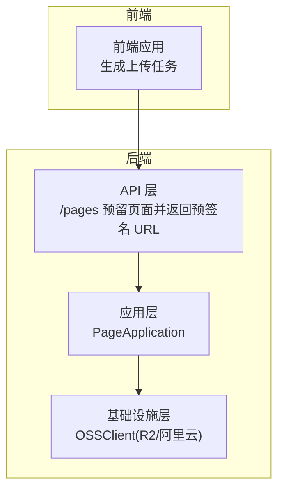
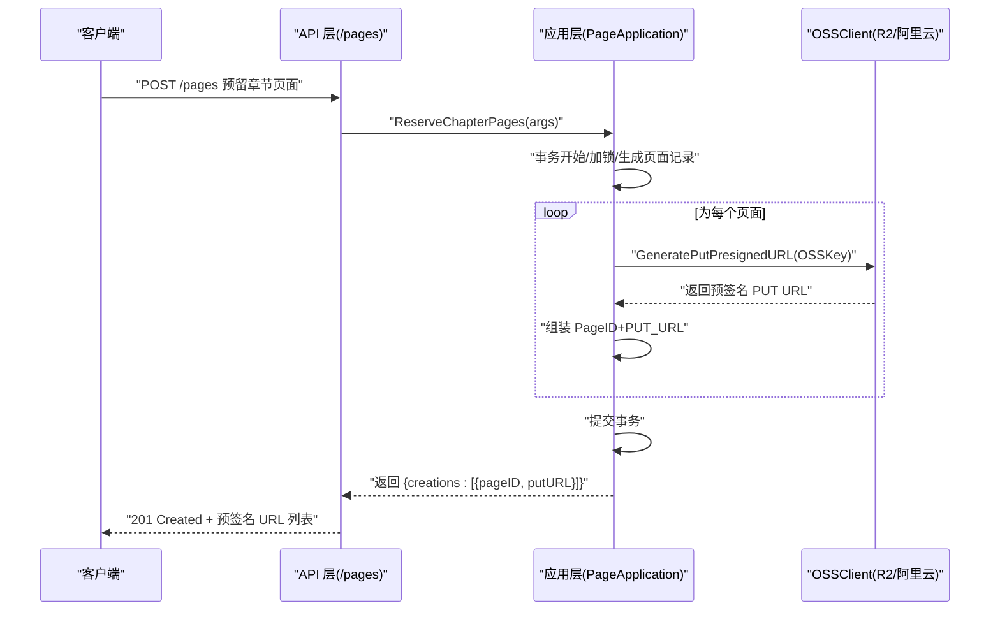
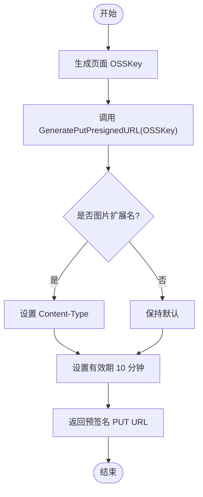
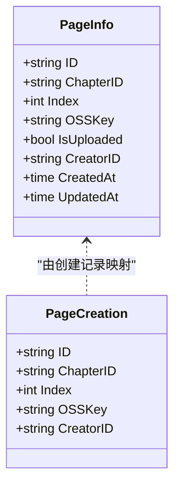
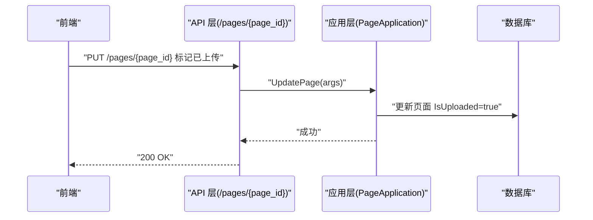
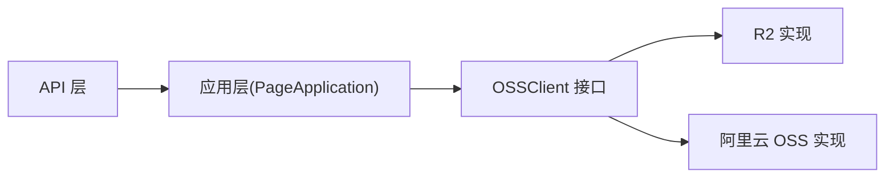

# 文件上传流程

<cite>
**本文引用的文件**
- [internal/domain/external/oss.go](file://internal/domain/external/oss.go)
- [internal/infrastructure/external/oss_factory.go](file://internal/infrastructure/external/oss_factory.go)
- [internal/infrastructure/external/r2_oss.go](file://internal/infrastructure/external/r2_oss.go)
- [internal/infrastructure/external/aliyun_oss.go](file://internal/infrastructure/external/aliyun_oss.go)
- [internal/api/http/page.go](file://internal/api/http/page.go)
- [internal/application/page.go](file://internal/application/page.go)
- [internal/domain/model/page.go](file://internal/domain/model/page.go)
- [frontend/src/api/modules/comic.ts](file://frontend/src/api/modules/comic.ts)
</cite>

## 目录
1. [简介](#简介)
2. [项目结构](#项目结构)
3. [核心组件](#核心组件)
4. [架构总览](#架构总览)
5. [详细组件分析](#详细组件分析)
6. [依赖分析](#依赖分析)
7. [性能考量](#性能考量)
8. [故障排查指南](#故障排查指南)
9. [结论](#结论)
10. [附录](#附录)

## 简介
本文件面向 poprako-web-ms 项目，系统性梳理“文件上传”从“前端预签名 URL 生成”到“后端存储确认”的完整流程。重点覆盖以下方面：
- 预签名 URL 的生成机制、有效期与安全策略
- 文件命名与存储路径规划、元数据管理
- 上传失败的重试与断点续传支持现状与建议
- 大文件处理策略与性能优化建议
- 监控指标与可观测性建议

## 项目结构
围绕“页面（Page）”的上传能力，涉及三层：
- API 层：负责接收请求、参数校验与响应包装
- 应用层：负责业务编排、鉴权、事务控制与调用基础设施
- 基础设施层：负责对接 OSS（R2 或阿里云 OSS），生成预签名 URL、执行删除等操作

图表来源
- [internal/api/http/page.go:54-95](file://internal/api/http/page.go#L54-L95)
- [internal/application/page.go:93-187](file://internal/application/page.go#L93-L187)
- [internal/infrastructure/external/r2_oss.go:93-112](file://internal/infrastructure/external/r2_oss.go#L93-L112)
- [internal/infrastructure/external/aliyun_oss.go:74-93](file://internal/infrastructure/external/aliyun_oss.go#L74-L93)

章节来源
- [internal/api/http/page.go:1-189](file://internal/api/http/page.go#L1-L189)
- [internal/application/page.go:1-402](file://internal/application/page.go#L1-L402)

## 核心组件
- OSSClient 接口：抽象出统一的上传/下载/删除能力，屏蔽不同厂商差异
- OSS 工厂：根据环境变量动态选择 R2 或阿里云 OSS 实现
- R2 实现：基于 AWS S3 SDK 的 PresignClient 生成上传 URL；支持自定义域名直链读取
- 阿里云 OSS 实现：基于官方 SDK v2 的 Presign 能力生成上传 URL；支持自定义域名直链读取
- API/应用层：在“预留页面”阶段，先在数据库创建页面记录，再为每个页面生成预签名 PUT URL 并返回给前端

章节来源
- [internal/domain/external/oss.go:1-9](file://internal/domain/external/oss.go#L1-L9)
- [internal/infrastructure/external/oss_factory.go:16-35](file://internal/infrastructure/external/oss_factory.go#L16-L35)
- [internal/infrastructure/external/r2_oss.go:93-123](file://internal/infrastructure/external/r2_oss.go#L93-L123)
- [internal/infrastructure/external/aliyun_oss.go:74-119](file://internal/infrastructure/external/aliyun_oss.go#L74-L119)
- [internal/api/http/page.go:54-95](file://internal/api/http/page.go#L54-L95)
- [internal/application/page.go:93-187](file://internal/application/page.go#L93-L187)

## 架构总览
下面以序列图展示“预留页面并生成预签名 URL”的端到端流程。

图表来源
- [internal/api/http/page.go:54-95](file://internal/api/http/page.go#L54-L95)
- [internal/application/page.go:93-187](file://internal/application/page.go#L93-L187)
- [internal/infrastructure/external/r2_oss.go:93-112](file://internal/infrastructure/external/r2_oss.go#L93-L112)
- [internal/infrastructure/external/aliyun_oss.go:74-93](file://internal/infrastructure/external/aliyun_oss.go#L74-L93)

## 详细组件分析

### 预签名 URL 生成与有效期
- 生成时机：在“预留页面”阶段，应用层为每个页面生成预签名 PUT URL
- 有效期：R2 与阿里云 OSS 实现均固定为 10 分钟
- 内容类型：若对象 Key 为常见图片扩展名，则自动设置合适的 Content-Type
- 读取 URL：若配置了自定义域名，GET URL 直接返回自定义域名直链；否则返回短期预签名 GET URL

图表来源
- [internal/application/page.go:146-177](file://internal/application/page.go#L146-L177)
- [internal/infrastructure/external/r2_oss.go:93-112](file://internal/infrastructure/external/r2_oss.go#L93-L112)
- [internal/infrastructure/external/aliyun_oss.go:74-93](file://internal/infrastructure/external/aliyun_oss.go#L74-L93)
- [internal/infrastructure/external/r2_oss.go:218-243](file://internal/infrastructure/external/r2_oss.go#L218-L243)

章节来源
- [internal/application/page.go:146-177](file://internal/application/page.go#L146-L177)
- [internal/infrastructure/external/r2_oss.go:93-112](file://internal/infrastructure/external/r2_oss.go#L93-L112)
- [internal/infrastructure/external/aliyun_oss.go:74-93](file://internal/infrastructure/external/aliyun_oss.go#L74-L93)

### 文件命名策略与存储路径
- 页面模型包含 OSSKey 字段，用于唯一标识对象键
- 应用层在生成页面记录时，会调用服务层生成页面的 OSSKey
- 该 OSSKey 即为最终对象键（ObjectKey），用于上传与后续访问

图表来源
- [internal/domain/model/page.go:5-52](file://internal/domain/model/page.go#L5-L52)
- [internal/domain/model/page.go:76-99](file://internal/domain/model/page.go#L76-L99)

章节来源
- [internal/domain/model/page.go:1-134](file://internal/domain/model/page.go#L1-L134)
- [internal/application/page.go:146-156](file://internal/application/page.go#L146-L156)

### 存储路径规划与元数据管理
- 路径规划：OSSKey 即为对象键，可按“工作集/漫画/章节/页面索引”等规则组织，具体策略由服务层生成逻辑决定
- 元数据：当前实现会根据扩展名自动设置 Content-Type；其他元信息（如 ACL、标签）未在现有代码中体现
- 访问控制：若配置自定义域名，GET 直链无需签名；否则使用短期预签名 URL

章节来源
- [internal/infrastructure/external/r2_oss.go:114-123](file://internal/infrastructure/external/r2_oss.go#L114-L123)
- [internal/infrastructure/external/aliyun_oss.go:95-119](file://internal/infrastructure/external/aliyun_oss.go#L95-L119)
- [internal/infrastructure/external/r2_oss.go:218-243](file://internal/infrastructure/external/r2_oss.go#L218-L243)

### 上传失败的重试机制与断点续传
- 现状
  - 后端侧：OSSClient 的删除操作具备最多 3 次重试与固定退避延迟
  - 前端侧：未见断点续传或多段上传的实现
- 建议
  - 前端：针对网络抖动或超时，可在 10 分钟有效期前主动重试 PUT；对大文件采用分片上传（需后端配合生成分片签名）
  - 后端：在预签名 URL 生成处增加幂等键与过期时间控制，避免重复写入

章节来源
- [internal/infrastructure/external/r2_oss.go:125-157](file://internal/infrastructure/external/r2_oss.go#L125-L157)
- [internal/infrastructure/external/aliyun_oss.go:121-146](file://internal/infrastructure/external/aliyun_oss.go#L121-L146)

### 大文件处理策略
- 当前实现
  - 使用一次性 PUT 的预签名 URL，适合中小文件
  - 未见分片上传或 Multipart Upload 的后端支持
- 建议
  - 引入分片上传：后端为每个分片生成独立的预签名 URL，并在完成后触发合并
  - 对于超大文件，结合断点续传与并发分片，提升吞吐与稳定性

（本节为通用建议，不直接分析具体文件）

### 后端存储确认与状态更新
- 流程
  - 前端使用预签名 URL 完成上传
  - 前端调用后端更新页面状态，标记页面已上传完成
- 状态字段
  - 页面模型包含 IsUploaded 字段，应用层在更新接口中将其持久化

图表来源
- [internal/api/http/page.go:97-148](file://internal/api/http/page.go#L97-L148)
- [internal/application/page.go:250-311](file://internal/application/page.go#L250-L311)
- [internal/domain/model/page.go:101-133](file://internal/domain/model/page.go#L101-L133)

章节来源
- [internal/api/http/page.go:97-148](file://internal/api/http/page.go#L97-L148)
- [internal/application/page.go:250-311](file://internal/application/page.go#L250-L311)
- [internal/domain/model/page.go:101-133](file://internal/domain/model/page.go#L101-L133)

### 删除与批量清理
- 单对象删除与批量删除均具备最多 3 次重试与固定退避延迟
- R2 实现对 NoSuchKey 错误进行宽容处理（视为删除成功）

章节来源
- [internal/infrastructure/external/r2_oss.go:125-216](file://internal/infrastructure/external/r2_oss.go#L125-L216)
- [internal/infrastructure/external/aliyun_oss.go:121-185](file://internal/infrastructure/external/aliyun_oss.go#L121-L185)

## 依赖分析
- OSSClient 抽象屏蔽了 R2 与阿里云 OSS 的差异
- PageApplication 依赖 OSSClient 进行预签名 URL 生成
- API 层负责参数解析与响应包装，调用应用层完成业务流程

图表来源
- [internal/domain/external/oss.go:3-8](file://internal/domain/external/oss.go#L3-L8)
- [internal/infrastructure/external/oss_factory.go:21-34](file://internal/infrastructure/external/oss_factory.go#L21-L34)
- [internal/application/page.go:44-52](file://internal/application/page.go#L44-L52)

章节来源
- [internal/domain/external/oss.go:1-9](file://internal/domain/external/oss.go#L1-L9)
- [internal/infrastructure/external/oss_factory.go:16-35](file://internal/infrastructure/external/oss_factory.go#L16-L35)
- [internal/application/page.go:43-91](file://internal/application/page.go#L43-L91)

## 性能考量
- 预签名 URL 有效期：10 分钟，建议前端在接近过期时主动刷新
- 并发上传：为每个页面单独生成预签名 URL，便于前端并发上传
- 传输优化：对图片类文件自动设置 Content-Type，减少浏览器二次协商
- 大文件：建议引入分片上传与断点续传，降低单次上传失败的影响面

（本节提供通用建议，不直接分析具体文件）

## 故障排查指南
- 预签名 URL 生成失败
  - 检查 OSS Provider 环境变量与密钥配置
  - 查看日志中“生成预签名 URL 失败”的错误上下文
- 上传超时或失败
  - 确认预签名 URL 未过期（默认 10 分钟）
  - 检查网络连通性与 CDN/自定义域名可用性
- 删除失败
  - R2 实现对 NoSuchKey 错误宽容；若仍失败，检查权限与对象是否存在
- 权限不足
  - 确认当前用户在目标章节/工作集/团队具备相应权限

章节来源
- [internal/infrastructure/external/r2_oss.go:125-157](file://internal/infrastructure/external/r2_oss.go#L125-L157)
- [internal/infrastructure/external/aliyun_oss.go:121-146](file://internal/infrastructure/external/aliyun_oss.go#L121-L146)
- [internal/application/page.go:112-120](file://internal/application/page.go#L112-L120)

## 结论
- 项目已实现“预留页面 + 预签名 URL 生成 + 后端状态更新”的标准上传路径
- 预签名 URL 默认有效期 10 分钟，适合中小文件快速上传
- 对大文件与高可靠性场景，建议补充断点续传与分片上传能力，并完善前端重试与监控

## 附录
- 前端接口参考
  - 漫画模块接口定义（用于理解整体 API 设计风格）
  
章节来源
- [frontend/src/api/modules/comic.ts:1-70](file://frontend/src/api/modules/comic.ts#L1-L70)