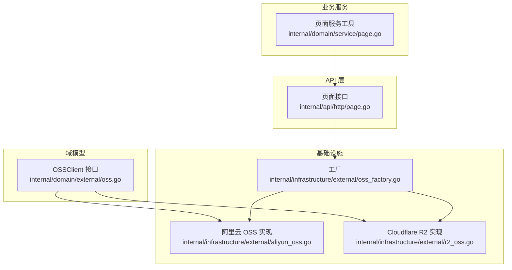
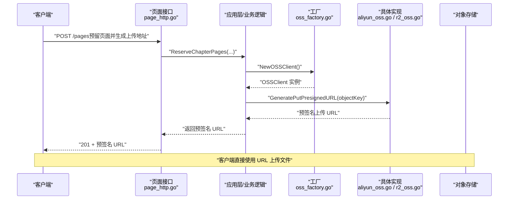
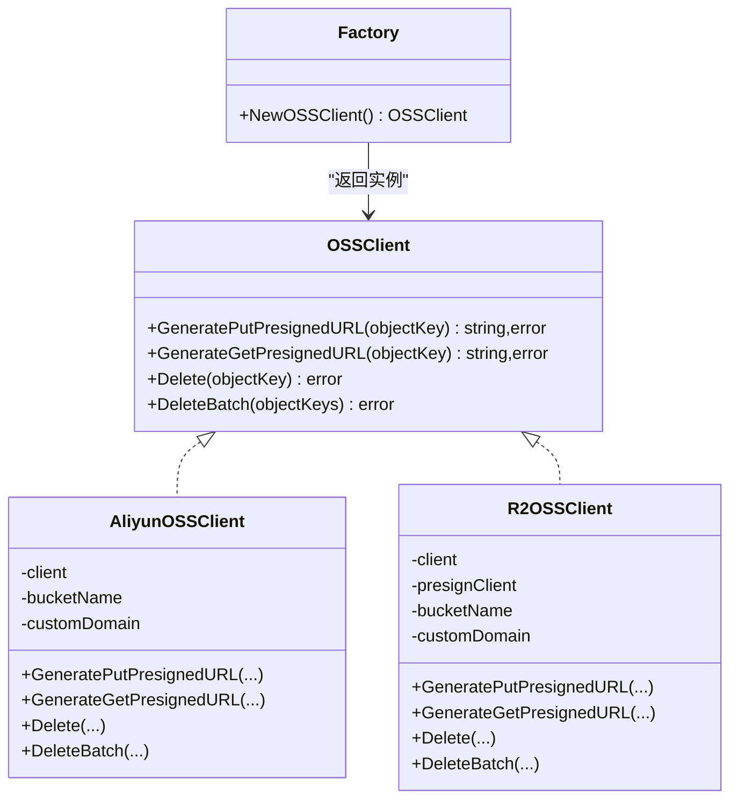
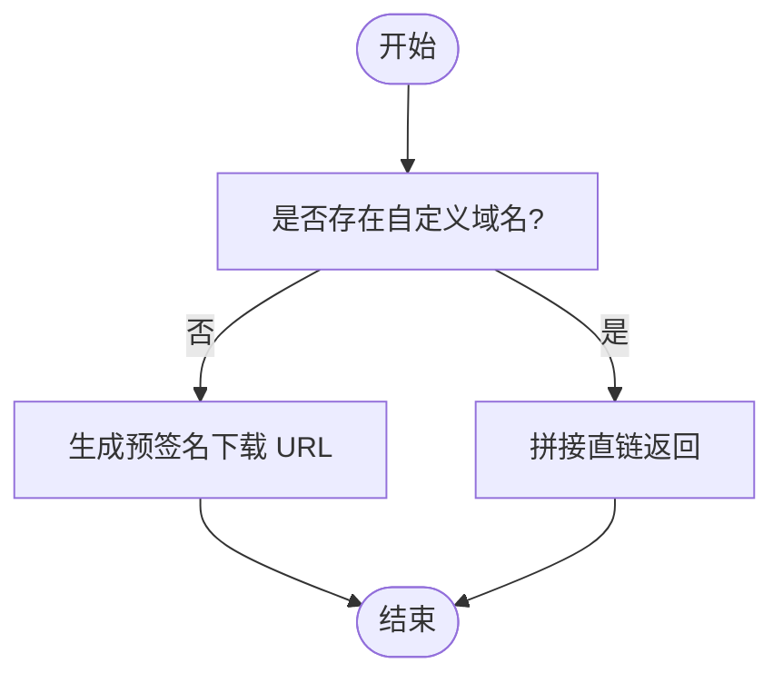
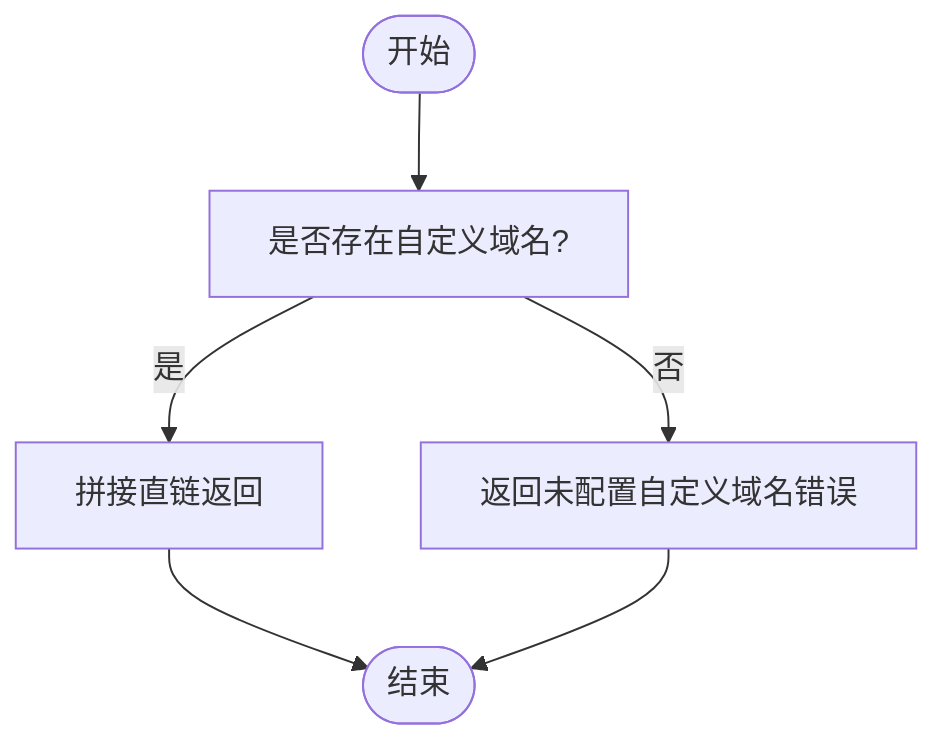
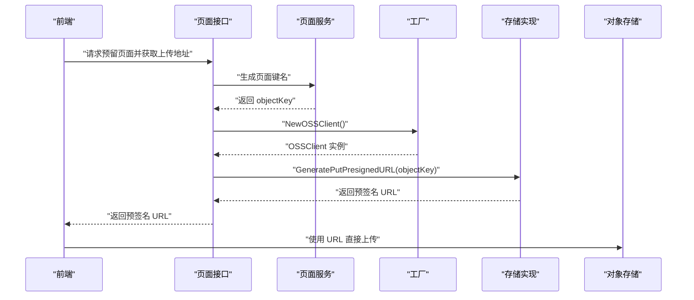
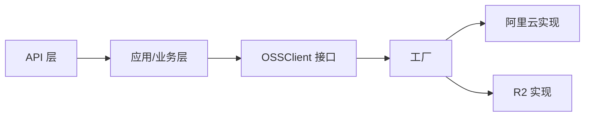

# 文件存储系统

<cite>
**本文引用的文件**
- [oss_factory.go](file://internal/infrastructure/external/oss_factory.go)
- [aliyun_oss.go](file://internal/infrastructure/external/aliyun_oss.go)
- [r2_oss.go](file://internal/infrastructure/external/r2_oss.go)
- [oss.go](file://internal/domain/external/oss.go)
- [page.go](file://internal/domain/service/page.go)
- [page_http.go](file://internal/api/http/page.go)
- [config.go](file://internal/config/config.go)
- [app_config.json](file://app_config.json)
</cite>

## 目录
1. [简介](#简介)
2. [项目结构](#项目结构)
3. [核心组件](#核心组件)
4. [架构总览](#架构总览)
5. [详细组件分析](#详细组件分析)
6. [依赖分析](#依赖分析)
7. [性能考量](#性能考量)
8. [故障排查指南](#故障排查指南)
9. [结论](#结论)
10. [附录](#附录)

## 简介
本文件存储系统面向弹幕漫画协作平台，提供统一的多存储服务商抽象与工厂化接入能力，当前支持阿里云 OSS 与 Cloudflare R2。系统通过统一接口屏蔽底层差异，采用工厂模式按环境变量动态选择具体实现；同时提供预签名 URL 机制用于前端直传、读取与删除操作，结合重试与错误收敛策略提升稳定性。

## 项目结构
围绕文件存储的关键目录与文件如下：
- 域模型与接口
  - internal/domain/external/oss.go：定义 OSSClient 统一接口
- 存储实现
  - internal/infrastructure/external/oss_factory.go：工厂方法，按环境变量选择具体实现
  - internal/infrastructure/external/aliyun_oss.go：阿里云 OSS 实现
  - internal/infrastructure/external/r2_oss.go：Cloudflare R2 实现
- 业务服务
  - internal/domain/service/page.go：页面对象键名生成工具
- API 层
  - internal/api/http/page.go：页面相关接口（预留页面并生成上传地址等）
- 配置
  - internal/config/config.go：应用配置加载（非存储配置）
  - app_config.json：应用基础配置（非存储配置）

图表来源
- [oss.go:1-9](file://internal/domain/external/oss.go#L1-L9)
- [oss_factory.go:1-36](file://internal/infrastructure/external/oss_factory.go#L1-L36)
- [aliyun_oss.go:1-186](file://internal/infrastructure/external/aliyun_oss.go#L1-L186)
- [r2_oss.go:1-244](file://internal/infrastructure/external/r2_oss.go#L1-L244)
- [page.go:1-7](file://internal/domain/service/page.go#L1-L7)
- [page_http.go:1-189](file://internal/api/http/page.go#L1-L189)

章节来源
- [oss.go:1-9](file://internal/domain/external/oss.go#L1-L9)
- [oss_factory.go:1-36](file://internal/infrastructure/external/oss_factory.go#L1-L36)
- [aliyun_oss.go:1-186](file://internal/infrastructure/external/aliyun_oss.go#L1-L186)
- [r2_oss.go:1-244](file://internal/infrastructure/external/r2_oss.go#L1-L244)
- [page.go:1-7](file://internal/domain/service/page.go#L1-L7)
- [page_http.go:1-189](file://internal/api/http/page.go#L1-L189)
- [config.go:1-101](file://internal/config/config.go#L1-L101)
- [app_config.json:1-11](file://app_config.json#L1-L11)

## 核心组件
- 统一接口 OSSClient
  - 职责：定义上传预签名 URL、下载预签名 URL、单对象删除、批量删除等能力
  - 设计要点：屏蔽不同存储后端的 SDK 差异，便于替换与扩展
- 工厂 NewOSSClient
  - 职责：依据环境变量选择具体实现（默认 R2，可切换阿里云）
  - 特性：支持运行时切换，便于灰度与运维
- 阿里云 OSS 实现
  - 职责：基于阿里云 SDK v2，提供上传/下载预签名 URL 生成、删除与批量删除
  - 配置：需提供密钥、区域、Bucket 名称；可选自定义域名
- Cloudflare R2 实现
  - 职责：基于 AWS SDK for Go v2 的 S3 兼容客户端，提供上传预签名 URL 生成、下载直链（需自定义域名）、删除与批量删除
  - 配置：需提供账户 ID、密钥、Bucket 名称；可选自定义域名
- 页面键名生成
  - 职责：为页面对象生成稳定且可预测的键名，便于后续管理与清理

章节来源
- [oss.go:1-9](file://internal/domain/external/oss.go#L1-L9)
- [oss_factory.go:1-36](file://internal/infrastructure/external/oss_factory.go#L1-L36)
- [aliyun_oss.go:1-186](file://internal/infrastructure/external/aliyun_oss.go#L1-L186)
- [r2_oss.go:1-244](file://internal/infrastructure/external/r2_oss.go#L1-L244)
- [page.go:1-7](file://internal/domain/service/page.go#L1-L7)

## 架构总览
系统采用“接口抽象 + 工厂 + 多实现”的分层设计：
- 上层仅依赖接口，不感知具体实现
- 工厂根据环境变量决定注入哪个存储实现
- 各实现封装 SDK 差异，暴露一致的方法签名
- API 层通过应用层调用，间接使用存储客户端

图表来源
- [page_http.go:54-95](file://internal/api/http/page.go#L54-L95)
- [oss_factory.go:16-35](file://internal/infrastructure/external/oss_factory.go#L16-L35)
- [aliyun_oss.go:74-93](file://internal/infrastructure/external/aliyun_oss.go#L74-L93)
- [r2_oss.go:93-112](file://internal/infrastructure/external/r2_oss.go#L93-L112)

## 详细组件分析

### 统一接口与工厂
- 接口职责
  - 上传预签名 URL 生成
  - 下载预签名 URL 生成
  - 单对象删除
  - 批量删除
- 工厂策略
  - 环境变量 OSS_PROVIDER 控制实现选择，默认 R2
  - 切换实现无需修改上层代码，降低耦合

图表来源
- [oss.go:1-9](file://internal/domain/external/oss.go#L1-L9)
- [oss_factory.go:1-36](file://internal/infrastructure/external/oss_factory.go#L1-L36)
- [aliyun_oss.go:15-71](file://internal/infrastructure/external/aliyun_oss.go#L15-L71)
- [r2_oss.go:21-90](file://internal/infrastructure/external/r2_oss.go#L21-L90)

章节来源
- [oss.go:1-9](file://internal/domain/external/oss.go#L1-L9)
- [oss_factory.go:1-36](file://internal/infrastructure/external/oss_factory.go#L1-L36)

### 阿里云 OSS 实现
- 初始化与配置
  - 必填：AccessKey ID/Secret、区域、Bucket 名称
  - 可选：Endpoint（默认按区域推导）、自定义域名
- 预签名 URL
  - 上传：固定过期时间，自动推断图片类型
  - 下载：优先自定义域名直链；未配置则生成短期预签名 URL
- 删除策略
  - 单对象与批量删除均带重试与退避
  - 对 NoSuchKey 错误进行幂等处理（视为成功）

图表来源
- [aliyun_oss.go:95-119](file://internal/infrastructure/external/aliyun_oss.go#L95-L119)

章节来源
- [aliyun_oss.go:1-186](file://internal/infrastructure/external/aliyun_oss.go#L1-L186)

### Cloudflare R2 实现
- 初始化与配置
  - 必填：Account ID、Access Key ID、Secret Access Key、Bucket 名称
  - 可选：Region（默认 auto）、自定义域名
- 预签名 URL
  - 上传：固定过期时间，自动推断图片类型
  - 下载：当前实现依赖自定义域名直链，不使用短期签名 URL
- 删除策略
  - 单对象与批量删除均带重试与退避
  - 对 NoSuchKey 错误进行幂等处理；批量删除对 NoSuchKey 进行忽略

图表来源
- [r2_oss.go:114-123](file://internal/infrastructure/external/r2_oss.go#L114-L123)

章节来源
- [r2_oss.go:1-244](file://internal/infrastructure/external/r2_oss.go#L1-L244)

### 文件上传流程与预签名 URL 机制
- 流程概览
  - 应用层调用工厂创建 OSSClient
  - 生成对象键名（页面键名生成工具）
  - 生成上传预签名 URL 返回给前端
  - 前端直接上传至对象存储
- 预签名 URL
  - 上传：固定过期时间，自动设置图片类 Content-Type
  - 下载：阿里云优先直链；R2 当前依赖直链（需自定义域名）
- 键名与路径
  - 页面键名由业务服务生成，建议保持稳定与可预测，便于后续清理与审计

图表来源
- [page_http.go:54-95](file://internal/api/http/page.go#L54-L95)
- [page.go:5-7](file://internal/domain/service/page.go#L5-L7)
- [oss_factory.go:16-35](file://internal/infrastructure/external/oss_factory.go#L16-L35)
- [aliyun_oss.go:74-93](file://internal/infrastructure/external/aliyun_oss.go#L74-L93)
- [r2_oss.go:93-112](file://internal/infrastructure/external/r2_oss.go#L93-L112)

章节来源
- [page_http.go:1-189](file://internal/api/http/page.go#L1-L189)
- [page.go:1-7](file://internal/domain/service/page.go#L1-L7)
- [oss_factory.go:1-36](file://internal/infrastructure/external/oss_factory.go#L1-L36)
- [aliyun_oss.go:1-186](file://internal/infrastructure/external/aliyun_oss.go#L1-L186)
- [r2_oss.go:1-244](file://internal/infrastructure/external/r2_oss.go#L1-L244)

### 文件命名策略与存储路径管理
- 命名策略
  - 页面对象键名采用“page_索引”形式，索引来自业务数据
  - 建议在业务层统一生成规则，保证全局唯一与可检索性
- 路径管理
  - 当前实现未强制前缀分隔符，但建议在业务侧约定统一前缀（如按漫画/章节/页面层级组织），便于后续清理与迁移

章节来源
- [page.go:5-7](file://internal/domain/service/page.go#L5-L7)

### 访问权限控制与安全考虑
- 预签名 URL
  - 上传与下载 URL 均带有限时过期时间，降低泄露风险
  - 建议在业务层校验用户对目标对象的写入/读取权限后再发放 URL
- 自定义域名
  - 阿里云与 R2 均支持自定义域名直链；R2 当前下载依赖自定义域名
  - 自定义域名应配合 CDN 与 HTTPS 使用，确保传输安全
- 密钥与配置
  - 通过环境变量注入密钥与端点，避免硬编码
  - 建议为不同环境与租户隔离密钥与 Bucket
- 错误与幂等
  - 删除操作具备重试与 NoSuchKey 幂等处理，降低误删风险
  - 批量删除对 NoSuchKey 进行忽略，减少失败影响面

章节来源
- [aliyun_oss.go:74-119](file://internal/infrastructure/external/aliyun_oss.go#L74-L119)
- [r2_oss.go:93-123](file://internal/infrastructure/external/r2_oss.go#L93-L123)
- [oss_factory.go:16-35](file://internal/infrastructure/external/oss_factory.go#L16-L35)

### 扩展指南：新增存储服务商
- 步骤
  - 在 domain/external 定义新接口或复用现有接口
  - 在 infrastructure/external 新增实现，满足统一接口
  - 在工厂中增加分支，映射新的环境变量值到新实现
  - 补充环境变量说明与初始化逻辑
- 注意事项
  - 保持与现有接口一致的方法签名
  - 明确预签名 URL 的生成策略与过期时间
  - 实现删除与批量删除的重试与幂等处理
  - 提供必要的配置项与错误提示

章节来源
- [oss.go:1-9](file://internal/domain/external/oss.go#L1-L9)
- [oss_factory.go:1-36](file://internal/infrastructure/external/oss_factory.go#L1-L36)

## 依赖分析
- 组件内聚与耦合
  - 接口与实现解耦，工厂集中管理选择逻辑
  - API 层仅依赖应用层，应用层依赖存储接口，形成清晰的依赖方向
- 外部依赖
  - 阿里云 OSS：SDK v2
  - Cloudflare R2：AWS SDK for Go v2（S3 兼容）
- 潜在循环依赖
  - 当前包结构未见循环导入迹象

图表来源
- [oss.go:1-9](file://internal/domain/external/oss.go#L1-L9)
- [oss_factory.go:1-36](file://internal/infrastructure/external/oss_factory.go#L1-L36)
- [aliyun_oss.go:1-186](file://internal/infrastructure/external/aliyun_oss.go#L1-L186)
- [r2_oss.go:1-244](file://internal/infrastructure/external/r2_oss.go#L1-L244)

章节来源
- [oss.go:1-9](file://internal/domain/external/oss.go#L1-L9)
- [oss_factory.go:1-36](file://internal/infrastructure/external/oss_factory.go#L1-L36)
- [aliyun_oss.go:1-186](file://internal/infrastructure/external/aliyun_oss.go#L1-L186)
- [r2_oss.go:1-244](file://internal/infrastructure/external/r2_oss.go#L1-L244)

## 性能考量
- 预签名直传
  - 减少服务端中转，显著降低服务器带宽与 CPU 开销
  - 建议结合 CDN 加速与合理的缓存策略
- 过期时间
  - 预签名 URL 过期时间应平衡安全性与可用性；对大文件建议更长过期时间
- 删除重试
  - 批量删除时尽量合并请求，减少往返次数
- 键名与路径
  - 规范化的键名有利于后续批量清理与迁移，降低维护成本

## 故障排查指南
- 常见问题定位
  - 未设置必要环境变量：初始化阶段会直接报错，检查对应密钥与端点
  - 未配置自定义域名：R2 下载直链依赖自定义域名，需补充配置
  - 预签名 URL 无法访问：确认过期时间、Content-Type 与 Bucket 权限
- 错误收敛
  - 删除操作具备重试与 NoSuchKey 幂等处理，若仍失败，检查权限与对象是否存在
- 日志与追踪
  - 建议在应用层记录关键事件（生成 URL、上传完成、删除结果），便于排障

章节来源
- [aliyun_oss.go:34-71](file://internal/infrastructure/external/aliyun_oss.go#L34-L71)
- [r2_oss.go:41-90](file://internal/infrastructure/external/r2_oss.go#L41-L90)
- [r2_oss.go:114-123](file://internal/infrastructure/external/r2_oss.go#L114-L123)
- [aliyun_oss.go:121-185](file://internal/infrastructure/external/aliyun_oss.go#L121-L185)
- [r2_oss.go:125-216](file://internal/infrastructure/external/r2_oss.go#L125-L216)

## 结论
该文件存储系统通过统一接口与工厂模式实现了对多存储服务商的无缝切换，结合预签名 URL 机制与删除重试策略，在保证安全性的同时提升了性能与可靠性。建议在生产环境中启用自定义域名、合理设置过期时间，并完善权限校验与日志追踪，以进一步增强系统的可观测性与可维护性。

## 附录
- 环境变量与配置
  - OSS_PROVIDER：选择存储实现（r2 或 aliyun，默认 r2）
  - 阿里云 OSS：AccessKey ID/Secret、区域、Bucket 名称、可选 Endpoint 与自定义域名
  - Cloudflare R2：Account ID、Access Key ID、Secret Access Key、Bucket 名称、可选 Region 与自定义域名
- 应用配置
  - app_config.json：应用基础配置（非存储配置）
  - internal/config/config.go：应用配置加载（非存储配置）

章节来源
- [oss_factory.go:10-14](file://internal/infrastructure/external/oss_factory.go#L10-L14)
- [aliyun_oss.go:23-71](file://internal/infrastructure/external/aliyun_oss.go#L23-L71)
- [r2_oss.go:30-90](file://internal/infrastructure/external/r2_oss.go#L30-L90)
- [app_config.json:1-11](file://app_config.json#L1-L11)
- [config.go:1-101](file://internal/config/config.go#L1-L101)