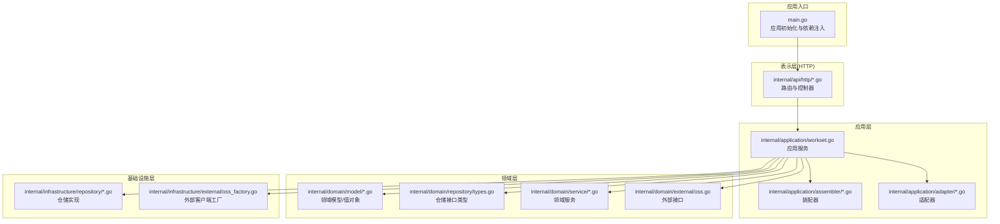
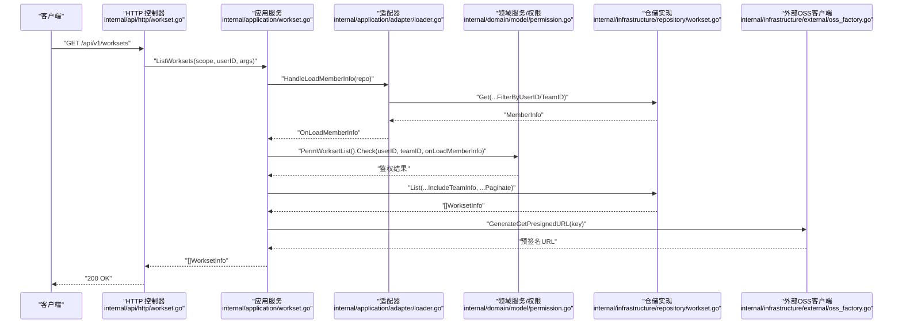
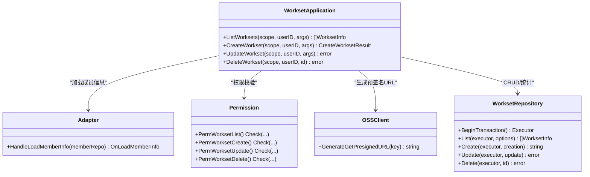
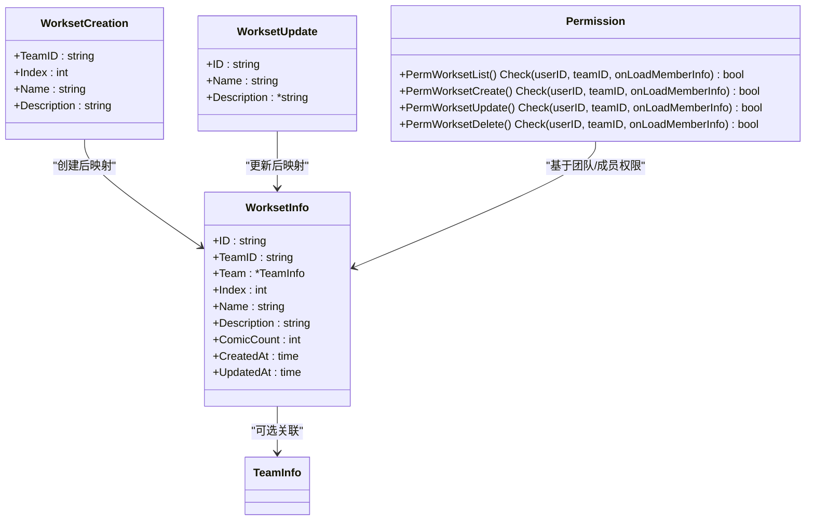
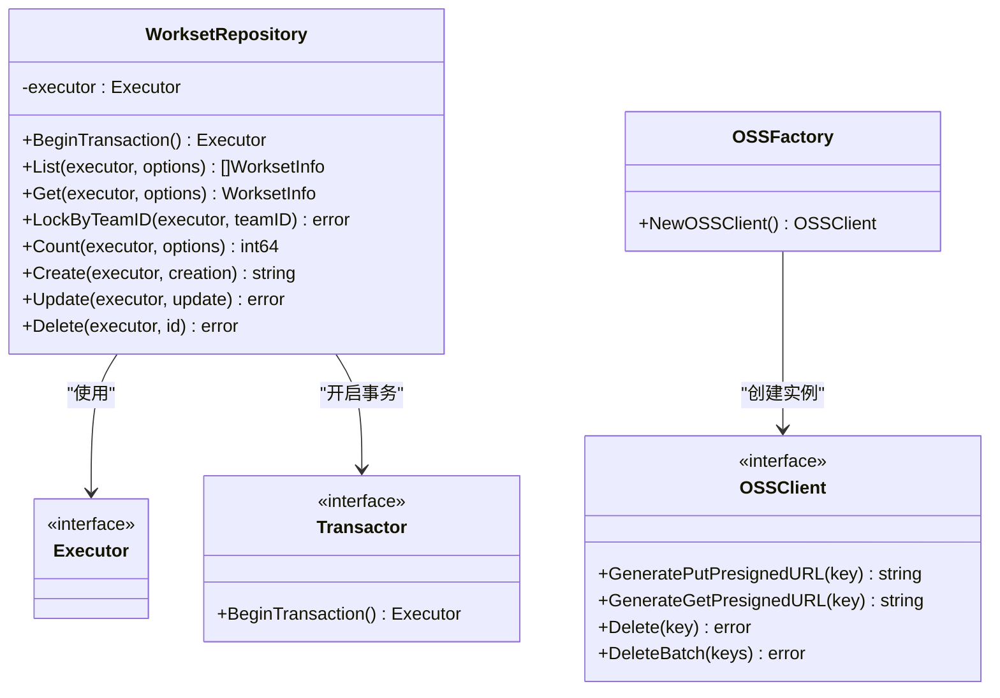
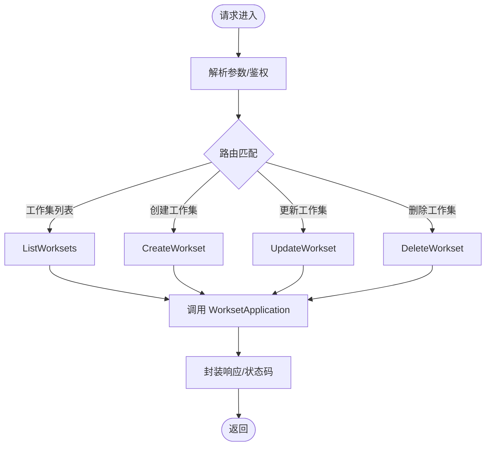
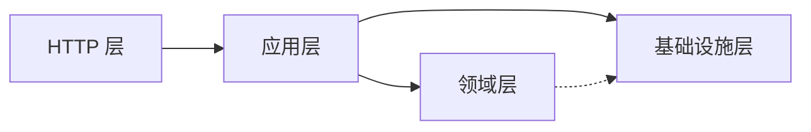

# DDD 三层架构

<cite>
**本文引用的文件**
- [main.go](file://main.go)
- [workset.go](file://internal/application/workset.go)
- [workset.go](file://internal/infrastructure/repository/workset.go)
- [workset.go](file://internal/domain/model/workset.go)
- [workset.go](file://internal/api/http/workset.go)
- [types.go](file://internal/domain/repository/types.go)
- [loader.go](file://internal/application/adapter/loader.go)
- [permission.go](file://internal/domain/model/permission.go)
- [workset.go](file://internal/application/assembler/workset.go)
- [workset.go](file://internal/value/workset.go)
- [http.go](file://internal/api/http/http.go)
- [oss_factory.go](file://internal/infrastructure/external/oss_factory.go)
- [oss.go](file://internal/domain/external/oss.go)
- [workset_include.go](file://internal/domain/service/workset_include.go)
</cite>

## 目录
1. [引言](#引言)
2. [项目结构](#项目结构)
3. [核心组件](#核心组件)
4. [架构总览](#架构总览)
5. [详细组件分析](#详细组件分析)
6. [依赖分析](#依赖分析)
7. [性能考虑](#性能考虑)
8. [故障排查指南](#故障排查指南)
9. [结论](#结论)
10. [附录](#附录)

## 引言
本文件面向 poprako-web-ms 项目的 DDD 三层架构实践，系统性阐述 Domain Layer（领域层）、Application Layer（应用层）、Infrastructure Layer（基础设施层）的设计理念、职责边界与交互关系。特别地，本文聚焦项目在传统 DDD 上的创新实践：
- 领域服务不依赖仓储层：权限校验等业务规则通过“加载器”以函数注入的方式在应用层完成，避免领域模型直接感知仓储接口。
- 事务处理在应用层：应用层统一开启/提交/回滚事务，确保业务操作的原子性与一致性。

同时，本文提供多幅架构图与序列图，帮助读者从宏观到微观全面理解代码组织与数据流。

## 项目结构
项目采用按层次划分的目录结构，清晰分离三层职责：
- Domain Layer：领域模型、领域服务、外部接口定义
- Application Layer：应用服务、装配器、适配器、值对象
- Infrastructure Layer：基础设施实现（仓储、外部服务）

**图表来源**
- [main.go:25-145](file://main.go#L25-L145)
- [http.go:16-151](file://internal/api/http/http.go#L16-L151)
- [workset.go:1-310](file://internal/application/workset.go#L1-L310)
- [workset.go:1-139](file://internal/infrastructure/repository/workset.go#L1-L139)
- [workset.go:1-82](file://internal/domain/model/workset.go#L1-L82)
- [types.go:1-12](file://internal/domain/repository/types.go#L1-L12)
- [loader.go:1-71](file://internal/application/adapter/loader.go#L1-L71)
- [oss_factory.go:1-36](file://internal/infrastructure/external/oss_factory.go#L1-L36)
- [oss.go:1-9](file://internal/domain/external/oss.go#L1-L9)

**章节来源**
- [main.go:25-145](file://main.go#L25-L145)
- [http.go:16-151](file://internal/api/http/http.go#L16-L151)

## 核心组件
- 表示层（HTTP）：负责路由注册、请求解析、响应封装与鉴权中间件集成。
- 应用层（WorksetApplication）：编排业务流程、鉴权、事务控制、装配结果。
- 领域层（WorksetInfo/Creation/Update、权限模型）：承载业务不变量与规则。
- 基础设施层（仓储实现、OSS 客户端）：提供持久化与外部能力。

**章节来源**
- [workset.go:20-70](file://internal/application/workset.go#L20-L70)
- [workset.go:12-18](file://internal/infrastructure/repository/workset.go#L12-L18)
- [workset.go:5-82](file://internal/domain/model/workset.go#L5-L82)
- [permission.go:198-800](file://internal/domain/model/permission.go#L198-L800)
- [oss_factory.go:16-36](file://internal/infrastructure/external/oss_factory.go#L16-L36)

## 架构总览
下图展示了从 HTTP 请求到应用层再到仓储与外部服务的整体调用链路与依赖方向。

**图表来源**
- [workset.go:25-52](file://internal/api/http/workset.go#L25-L52)
- [workset.go:72-126](file://internal/application/workset.go#L72-L126)
- [loader.go:16-24](file://internal/application/adapter/loader.go#L16-L24)
- [permission.go:212-219](file://internal/domain/model/permission.go#L212-L219)
- [workset.go:32-49](file://internal/infrastructure/repository/workset.go#L32-L49)
- [oss_factory.go:16-36](file://internal/infrastructure/external/oss_factory.go#L16-L36)

## 详细组件分析

### 应用层：WorksetApplication
- 职责边界
  - 参数校验与日志追踪
  - 鉴权：基于 PermWorkset* 权限模型
  - 事务管理：统一开启/提交/回滚
  - 结果装配：使用装配器将仓储模型转换为对外值对象
- 关键交互
  - 依赖 OSS 客户端生成预签名 URL
  - 依赖成员仓储加载成员信息用于鉴权
  - 依赖工作集仓储进行 CRUD 与统计
- 事务处理位置
  - 在创建工作集时，应用层显式开启事务并负责提交或回滚

**图表来源**
- [workset.go:20-70](file://internal/application/workset.go#L20-L70)
- [loader.go:16-24](file://internal/application/adapter/loader.go#L16-L24)
- [permission.go:212-219](file://internal/domain/model/permission.go#L212-L219)
- [workset.go:12-18](file://internal/infrastructure/repository/workset.go#L12-L18)
- [oss.go:3-8](file://internal/domain/external/oss.go#L3-L8)

**章节来源**
- [workset.go:72-126](file://internal/application/workset.go#L72-L126)
- [workset.go:128-213](file://internal/application/workset.go#L128-L213)
- [workset.go:215-262](file://internal/application/workset.go#L215-L262)
- [workset.go:264-309](file://internal/application/workset.go#L264-L309)

### 领域层：Workset 领域模型与权限
- 领域模型
  - WorksetInfo：对外暴露的只读信息载体
  - WorksetCreation/Update：创建/更新的输入载体
- 权限模型
  - 通过 PermWorksetList/Create/Update/Delete 的 Check 方法实现细粒度权限控制
  - Check 方法接收 OnLoadUserInfo/OnLoadMemberInfo 等加载器函数，避免领域模型直接依赖仓储

**图表来源**
- [workset.go:5-82](file://internal/domain/model/workset.go#L5-L82)
- [permission.go:797-800](file://internal/domain/model/permission.go#L797-L800)

**章节来源**
- [workset.go:20-82](file://internal/domain/model/workset.go#L20-L82)
- [permission.go:797-800](file://internal/domain/model/permission.go#L797-L800)

### 基础设施层：仓储与外部服务
- 仓储实现
  - WorksetRepository：封装 GORM 执行器，提供 List/Get/LockByTeamID/Count/Create/Update/Delete 等方法
  - Executor 接口抽象，Transactor 接口定义 BeginTransaction
- 外部服务
  - OSS 客户端工厂：根据环境变量选择 R2 或阿里云 OSS 实现
  - OSSClient 接口：提供预签名 URL 生成与批量删除能力

**图表来源**
- [workset.go:12-18](file://internal/infrastructure/repository/workset.go#L12-L18)
- [types.go:5-12](file://internal/domain/repository/types.go#L5-L12)
- [oss_factory.go:16-36](file://internal/infrastructure/external/oss_factory.go#L16-L36)
- [oss.go:3-8](file://internal/domain/external/oss.go#L3-L8)

**章节来源**
- [workset.go:28-30](file://internal/infrastructure/repository/workset.go#L28-L30)
- [workset.go:32-49](file://internal/infrastructure/repository/workset.go#L32-L49)
- [types.go:9-12](file://internal/domain/repository/types.go#L9-L12)
- [oss_factory.go:16-36](file://internal/infrastructure/external/oss_factory.go#L16-L36)

### HTTP 层：路由与控制器
- 路由注册集中在 HTTP 初始化函数中，按模块划分（认证、用户、团队、成员、邀请、漫画、工作集、章节、页面、分配、单元）
- 控制器负责参数解析、鉴权提取、调用应用层并封装响应

**图表来源**
- [http.go:16-151](file://internal/api/http/http.go#L16-L151)
- [workset.go:25-52](file://internal/api/http/workset.go#L25-L52)
- [workset.go:67-95](file://internal/api/http/workset.go#L67-L95)
- [workset.go:111-148](file://internal/api/http/workset.go#L111-L148)
- [workset.go:162-189](file://internal/api/http/workset.go#L162-L189)

**章节来源**
- [http.go:16-151](file://internal/api/http/http.go#L16-L151)
- [workset.go:25-52](file://internal/api/http/workset.go#L25-L52)
- [workset.go:67-95](file://internal/api/http/workset.go#L67-L95)
- [workset.go:111-148](file://internal/api/http/workset.go#L111-L148)
- [workset.go:162-189](file://internal/api/http/workset.go#L162-L189)

## 依赖分析
- 层间依赖方向
  - HTTP 层依赖应用层
  - 应用层依赖领域层（模型/服务/外部接口）与基础设施层（仓储/OSS）
  - 领域层不依赖基础设施层；通过接口与适配器解耦
- 关键依赖点
  - 应用层通过适配器注入加载器函数，完成权限校验所需的成员信息加载
  - 事务在应用层统一管理，仓储实现仅负责执行 SQL

**图表来源**
- [main.go:56-122](file://main.go#L56-L122)
- [workset.go:43-47](file://internal/application/workset.go#L43-L47)
- [loader.go:16-24](file://internal/application/adapter/loader.go#L16-L24)

**章节来源**
- [main.go:56-122](file://main.go#L56-L122)
- [workset.go:43-47](file://internal/application/workset.go#L43-L47)

## 性能考虑
- 事务范围最小化：仅在创建工作集时开启事务，减少锁竞争与事务持有时间
- 查询优化：通过 IncludeTeamInfo 与分页选项减少不必要的数据传输
- 外部服务：OSS 预签名 URL 降低上传/下载时的带宽与延迟
- 日志与追踪：应用层使用 TraceScope 记录关键步骤，便于定位性能瓶颈

## 故障排查指南
- 参数校验失败
  - 现象：返回参数错误
  - 排查：确认 List/Create/Update 参数结构与必填字段
  - 参考路径：[workset.go:79-82](file://internal/application/workset.go#L79-L82), [workset.go:135-138](file://internal/application/workset.go#L135-L138), [workset.go:222-225](file://internal/application/workset.go#L222-L225)
- 权限不足
  - 现象：返回权限不足
  - 排查：确认当前用户在目标团队的角色与分工
  - 参考路径：[workset.go:98-100](file://internal/application/workset.go#L98-L100), [workset.go:154-156](file://internal/application/workset.go#L154-L156), [workset.go:250-252](file://internal/application/workset.go#L250-L252), [workset.go:300-301](file://internal/application/workset.go#L300-L301)
- 事务异常
  - 现象：创建失败、回滚日志
  - 排查：检查 BeginTransaction 返回与 Commit/Rollback 调用
  - 参考路径：[workset.go:158-172](file://internal/application/workset.go#L158-L172), [workset.go:207-210](file://internal/application/workset.go#L207-L210)
- 外部服务异常
  - 现象：OSS 预签名 URL 生成失败
  - 排查：确认 OSS_PROVIDER 环境变量与对应 SDK 配置
  - 参考路径：[oss_factory.go:16-36](file://internal/infrastructure/external/oss_factory.go#L16-L36)

**章节来源**
- [workset.go:79-82](file://internal/application/workset.go#L79-L82)
- [workset.go:135-138](file://internal/application/workset.go#L135-L138)
- [workset.go:222-225](file://internal/application/workset.go#L222-L225)
- [workset.go:98-100](file://internal/application/workset.go#L98-L100)
- [workset.go:154-156](file://internal/application/workset.go#L154-L156)
- [workset.go:250-252](file://internal/application/workset.go#L250-L252)
- [workset.go:300-301](file://internal/application/workset.go#L300-L301)
- [workset.go:158-172](file://internal/application/workset.go#L158-L172)
- [workset.go:207-210](file://internal/application/workset.go#L207-L210)
- [oss_factory.go:16-36](file://internal/infrastructure/external/oss_factory.go#L16-L36)

## 结论
本项目在 DDD 三层架构基础上，实现了“领域服务不依赖仓储层”与“事务在应用层”的创新实践。通过适配器注入加载器函数，权限校验逻辑完全位于应用层，既保持了领域模型的纯净，又提升了系统的可测试性与可维护性。应用层统一管理事务，确保业务操作的一致性；仓储实现专注于数据访问，外部服务通过工厂模式灵活切换。整体架构清晰、职责明确、扩展性强，适合复杂业务场景下的长期演进。

## 附录
- 值对象与参数校验
  - ListWorksetArgs/ CreateWorksetArgs/ UpdateWorksetArgs 的校验逻辑集中于应用层，保证输入合法性
  - 参考路径：[workset.go:29-43](file://internal/value/workset.go#L29-L43), [workset.go:51-65](file://internal/value/workset.go#L51-L65), [workset.go:78-88](file://internal/value/workset.go#L78-L88)
- 关联展开规格解析
  - ResolveWorksetListIncludeSpec 将 includes[] 解析为 NeedTeam 等规格，指导仓储查询
  - 参考路径：[workset_include.go:9-20](file://internal/domain/service/workset_include.go#L9-L20)

**章节来源**
- [workset.go:29-43](file://internal/value/workset.go#L29-L43)
- [workset.go:51-65](file://internal/value/workset.go#L51-L65)
- [workset.go:78-88](file://internal/value/workset.go#L78-L88)
- [workset_include.go:9-20](file://internal/domain/service/workset_include.go#L9-L20)