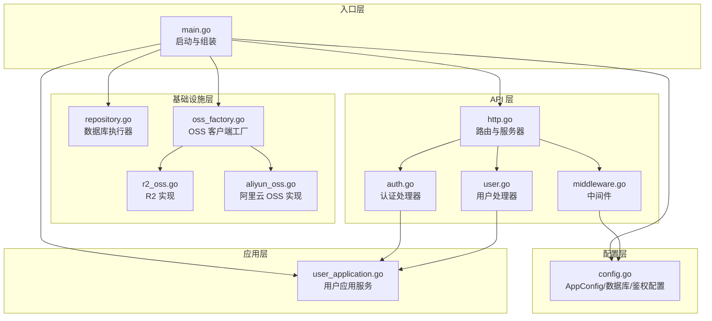
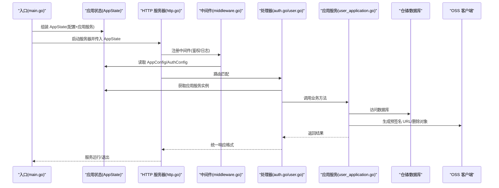
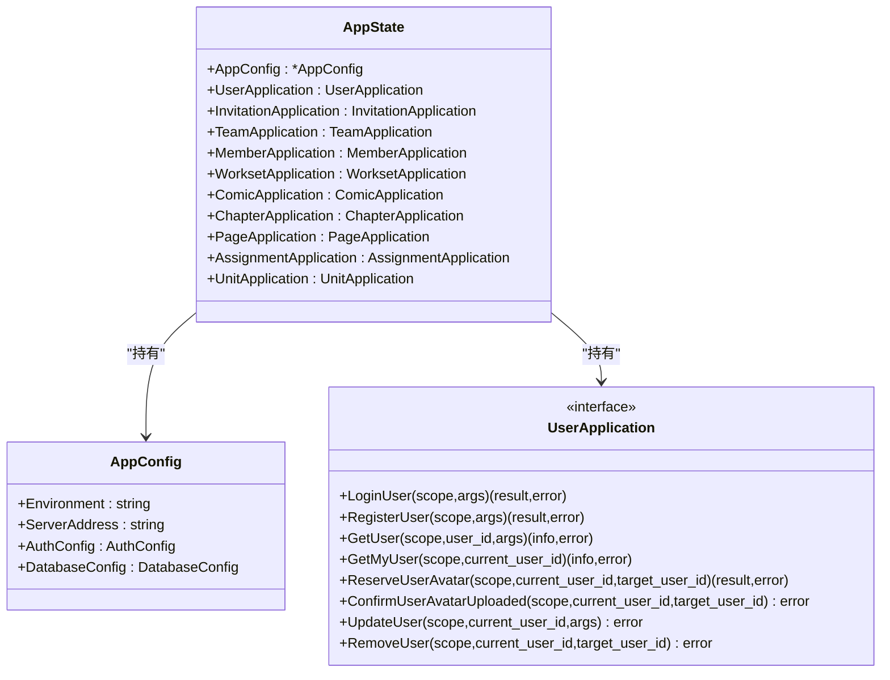
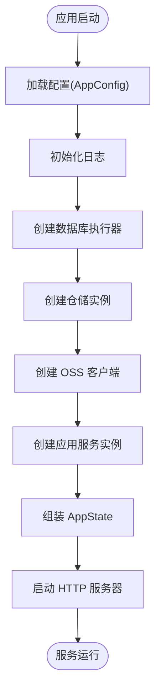
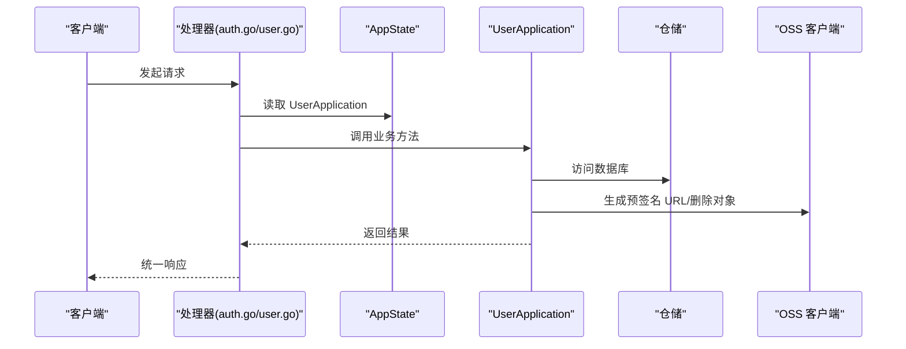
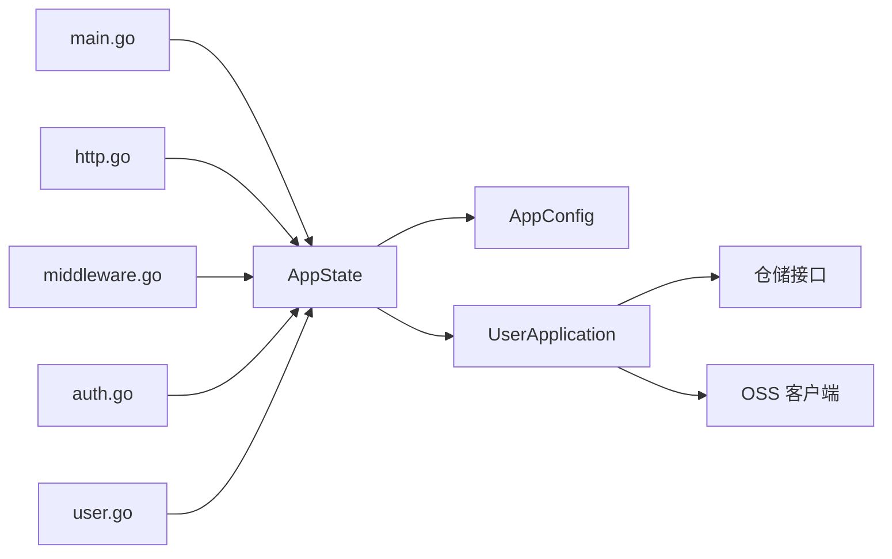

# 依赖注入容器

<cite>
**本文引用的文件**
- [main.go](file://main.go)
- [app_state.go](file://internal/state/app_state.go)
- [config.go](file://internal/config/config.go)
- [repository.go](file://internal/infrastructure/repository/repository.go)
- [oss_factory.go](file://internal/infrastructure/external/oss_factory.go)
- [r2_oss.go](file://internal/infrastructure/external/r2_oss.go)
- [aliyun_oss.go](file://internal/infrastructure/external/aliyun_oss.go)
- [http.go](file://internal/api/http/http.go)
- [auth.go](file://internal/api/http/auth.go)
- [user.go](file://internal/api/http/user.go)
- [middleware.go](file://internal/api/http/middleware.go)
- [user_application.go](file://internal/application/user.go)
</cite>

## 目录
1. [简介](#简介)
2. [项目结构](#项目结构)
3. [核心组件](#核心组件)
4. [架构总览](#架构总览)
5. [组件详解](#组件详解)
6. [依赖关系分析](#依赖关系分析)
7. [性能考量](#性能考量)
8. [故障排查指南](#故障排查指南)
9. [结论](#结论)
10. [附录](#附录)

## 简介
本文件系统性阐述 poprako-web-ms 项目的依赖注入容器设计与实现，重点围绕应用状态管理器 AppState 的职责、服务注册与解析机制、生命周期管理、循环依赖检测与错误处理策略展开。文档还提供应用启动时初始化容器的流程说明，以及在各组件中如何获取依赖服务的具体路径指引，并总结容器配置最佳实践与性能优化建议。

## 项目结构
该项目采用分层架构，依赖注入容器以“应用状态”为核心载体，贯穿配置、基础设施、应用层与 API 层：
- 入口层：main.go 负责加载配置、构建基础设施与应用服务，组装 AppState 并启动 HTTP 服务器。
- 配置层：config.go 提供配置加载与校验。
- 基础设施层：repository.go 提供数据库连接池；oss_factory.go 根据环境变量选择 OSS 客户端实现（R2 或阿里云 OSS）。
- 应用层：application 包下的各应用服务持有领域仓库与外部依赖，负责业务编排。
- API 层：http.go 将路由与中间件挂载到 Iris 应用；各处理器通过 AppState 获取应用服务执行业务逻辑。

图表来源
- [main.go:25-145](file://main.go#L25-L145)
- [config.go:11-59](file://internal/config/config.go#L11-L59)
- [repository.go:11-29](file://internal/infrastructure/repository/repository.go#L11-L29)
- [oss_factory.go:21-35](file://internal/infrastructure/external/oss_factory.go#L21-L35)
- [r2_oss.go:41-91](file://internal/infrastructure/external/r2_oss.go#L41-L91)
- [aliyun_oss.go:34-72](file://internal/infrastructure/external/aliyun_oss.go#L34-L72)
- [http.go:16-151](file://internal/api/http/http.go#L16-L151)
- [auth.go:22-40](file://internal/api/http/auth.go#L22-L40)
- [user.go:22-49](file://internal/api/http/user.go#L22-L49)
- [middleware.go:47-79](file://internal/api/http/middleware.go#L47-L79)

章节来源
- [main.go:25-145](file://main.go#L25-L145)
- [http.go:16-151](file://internal/api/http/http.go#L16-L151)

## 核心组件
- 应用状态管理器 AppState：集中持有 AppConfig 与各类应用服务接口实例，作为依赖注入的“容器”与“上下文”。它在 main.go 中被一次性组装并传入 HTTP 服务器。
- 配置加载器 AppConfig：负责从 JSON 文件与环境变量加载应用配置，并进行基础校验。
- 数据库执行器：基于 GORM 连接 PostgreSQL，设置连接池参数。
- OSS 客户端工厂：依据环境变量选择 R2 或阿里云 OSS 实现，屏蔽上层差异。
- 应用服务：以用户应用服务为例，持有鉴权配置、OSS 客户端与多个仓储接口，负责业务编排与错误处理。
- HTTP 服务器与中间件：路由注册、鉴权中间件、日志中间件均通过 AppState 注入所需依赖。

章节来源
- [app_state.go:8-21](file://internal/state/app_state.go#L8-L21)
- [app_state.go:23-49](file://internal/state/app_state.go#L23-L49)
- [config.go:11-59](file://internal/config/config.go#L11-L59)
- [repository.go:11-29](file://internal/infrastructure/repository/repository.go#L11-L29)
- [oss_factory.go:21-35](file://internal/infrastructure/external/oss_factory.go#L21-L35)
- [user_application.go:66-104](file://internal/application/user.go#L66-L104)

## 架构总览
下图展示了从应用启动到请求处理的关键交互：main.go 组装 AppState → HTTP 服务器初始化 → 中间件与处理器从 AppState 解析依赖 → 应用服务调用仓储与外部依赖 → 返回响应。

图表来源
- [main.go:124-145](file://main.go#L124-L145)
- [http.go:26-151](file://internal/api/http/http.go#L26-L151)
- [middleware.go:47-79](file://internal/api/http/middleware.go#L47-L79)
- [auth.go:22-40](file://internal/api/http/auth.go#L22-L40)
- [user.go:22-49](file://internal/api/http/user.go#L22-L49)
- [user_application.go:106-154](file://internal/application/user.go#L106-L154)

## 组件详解

### 应用状态管理器 AppState
- 设计要点
  - 集中式持有 AppConfig 与各应用服务接口字段，便于在 HTTP 层统一注入。
  - 通过 NewAppState 构造函数一次性装配，避免运行期动态解析，提升启动阶段的确定性。
- 生命周期
  - 在 main.go 启动阶段创建并传入 HTTP 服务器；应用退出时由服务器生命周期管理。
- 依赖解析
  - 通过字段直接暴露给处理器与中间件，属于“显式注入”，无需额外解析器。

图表来源
- [app_state.go:8-21](file://internal/state/app_state.go#L8-L21)
- [config.go:21-27](file://internal/config/config.go#L21-L27)
- [user_application.go:21-64](file://internal/application/user.go#L21-L64)

章节来源
- [app_state.go:8-21](file://internal/state/app_state.go#L8-L21)
- [app_state.go:23-49](file://internal/state/app_state.go#L23-L49)

### 服务注册机制
- 配置注册
  - main.go 加载 AppConfig，随后初始化日志、数据库执行器与 OSS 客户端。
- 基础设施注册
  - 基于数据库执行器创建各仓储实例；基于 OSS 客户端工厂创建 OSS 客户端。
- 应用服务注册
  - 以用户应用服务为例，将鉴权配置、OSS 客户端与多个仓储注入构造函数，形成完整的应用服务实例。
- 状态聚合
  - 将所有应用服务与 AppConfig 一并注入 AppState，供后续组件使用。

图表来源
- [main.go:30-136](file://main.go#L30-L136)
- [repository.go:11-29](file://internal/infrastructure/repository/repository.go#L11-L29)
- [oss_factory.go:21-35](file://internal/infrastructure/external/oss_factory.go#L21-L35)
- [user_application.go:75-104](file://internal/application/user.go#L75-L104)

章节来源
- [main.go:30-136](file://main.go#L30-L136)

### 依赖解析与使用
- HTTP 层解析
  - 处理器通过闭包参数 appState 获取应用服务实例，例如认证处理器 Login/ Register 与用户处理器 GetUserByID/ UpdateUserByID 等。
- 中间件解析
  - 鉴权中间件从 AppState 读取 AppConfig.AuthConfig 与 AppConfig.ServerAddress，完成令牌解析与用户 ID 注入。
- 应用层解析
  - 应用服务内部持有仓储与外部依赖，直接使用，无需二次解析。

图表来源
- [auth.go:22-40](file://internal/api/http/auth.go#L22-L40)
- [user.go:22-49](file://internal/api/http/user.go#L22-L49)
- [middleware.go:47-79](file://internal/api/http/middleware.go#L47-L79)
- [user_application.go:106-154](file://internal/application/user.go#L106-L154)

章节来源
- [auth.go:22-40](file://internal/api/http/auth.go#L22-L40)
- [user.go:22-49](file://internal/api/http/user.go#L22-L49)
- [middleware.go:47-79](file://internal/api/http/middleware.go#L47-L79)

### 循环依赖检测与错误处理策略
- 循环依赖检测
  - 本项目采用“显式注入 + 单次装配”的模式：main.go 在启动阶段一次性创建并注入所有依赖，避免运行期动态解析导致的循环依赖风险。
- 错误处理策略
  - 配置加载失败、环境变量缺失、数据库连接失败、OSS 客户端初始化失败等均在启动阶段以 panic 抛出，确保问题早发现。
  - 应用服务内部对输入参数、业务规则与外部调用错误进行校验与包装，向上层返回可读的错误信息。
  - HTTP 层对鉴权失败、参数错误、业务错误进行统一响应封装。

章节来源
- [config.go:29-59](file://internal/config/config.go#L29-L59)
- [repository.go:11-29](file://internal/infrastructure/repository/repository.go#L11-L29)
- [r2_oss.go:42-91](file://internal/infrastructure/external/r2_oss.go#L42-L91)
- [aliyun_oss.go:34-72](file://internal/infrastructure/external/aliyun_oss.go#L34-L72)
- [user_application.go:82-95](file://internal/application/user.go#L82-L95)
- [http.go:16-24](file://internal/api/http/http.go#L16-L24)

### 容器配置最佳实践
- 配置文件与环境变量分离
  - 将敏感配置（如密钥）置于环境变量，非敏感配置（如地址、连接数）置于 JSON 文件，便于版本控制与多环境切换。
- 连接池参数合理设置
  - 根据数据库性能与并发需求调整最小空闲连接与最大打开连接数，避免资源浪费或连接争用。
- OSS 客户端选择
  - 通过环境变量动态选择 OSS 提供商，便于在不同部署环境间切换。
- 显式注入优于隐式解析
  - 采用 AppState 集中注入，减少运行期反射与动态解析成本，提升启动阶段的确定性与可观测性。

章节来源
- [config.go:21-27](file://internal/config/config.go#L21-L27)
- [repository.go:25-26](file://internal/infrastructure/repository/repository.go#L25-L26)
- [oss_factory.go:21-35](file://internal/infrastructure/external/oss_factory.go#L21-L35)

### 性能优化建议
- 启动阶段优化
  - 将配置加载、数据库连接与 OSS 客户端初始化放在 main.go 早期完成，避免请求路径上的重复初始化。
- 连接池调优
  - 结合数据库负载与并发峰值，动态调整最小空闲连接与最大打开连接数，降低连接建立与销毁开销。
- 预签名 URL 缓存
  - 对频繁使用的上传/下载预签名 URL 可考虑短期缓存，减少重复签名带来的网络与 CPU 开销。
- 中间件顺序
  - 将日志与恢复中间件置于靠前位置，尽早捕获异常并输出请求统计信息，便于定位性能瓶颈。

章节来源
- [repository.go:25-26](file://internal/infrastructure/repository/repository.go#L25-L26)
- [r2_oss.go:94-112](file://internal/infrastructure/external/r2_oss.go#L94-L112)
- [aliyun_oss.go:75-93](file://internal/infrastructure/external/aliyun_oss.go#L75-L93)

## 依赖关系分析
- 组件耦合
  - main.go 与各层存在强耦合，但这种耦合集中在启动阶段，有利于明确依赖关系与生命周期。
  - AppState 作为依赖载体，被 HTTP 层广泛使用，形成清晰的依赖注入边界。
- 外部依赖
  - 数据库：GORM + Postgres 驱动。
  - OSS：AWS SDK v2（R2）与阿里云 OSS SDK v2。
  - Web 框架：Iris。
- 潜在循环依赖
  - 由于采用一次性装配与显式注入，未见运行期循环依赖迹象；建议后续引入接口隔离与工厂模式进一步降低耦合。

图表来源
- [main.go:124-136](file://main.go#L124-L136)
- [app_state.go:8-21](file://internal/state/app_state.go#L8-L21)
- [http.go:16-24](file://internal/api/http/http.go#L16-L24)
- [middleware.go:47-79](file://internal/api/http/middleware.go#L47-L79)
- [auth.go:22-40](file://internal/api/http/auth.go#L22-L40)
- [user.go:22-49](file://internal/api/http/user.go#L22-L49)

章节来源
- [main.go:124-136](file://main.go#L124-L136)
- [http.go:16-24](file://internal/api/http/http.go#L16-L24)

## 性能考量
- 启动阶段一次性初始化数据库与 OSS 客户端，避免请求路径上的重复初始化。
- 合理设置数据库连接池参数，结合压测数据调整最小空闲与最大连接数。
- 对预签名 URL 生成进行必要的缓存策略，减少重复签名开销。
- 中间件顺序与日志级别需平衡可观测性与性能，避免过度日志输出影响吞吐。

## 故障排查指南
- 启动失败
  - 检查 .env 与 app_config.json 是否正确加载，确认环境变量是否齐全。
  - 关注数据库连接 URL 与 OSS 客户端必需环境变量是否设置。
- 请求失败
  - 鉴权中间件返回 401：确认 Authorization 头部格式与令牌有效性。
  - 业务错误：查看应用服务的日志与错误包装信息，定位具体失败点。
- 数据库/存储异常
  - 检查连接池参数与网络连通性；对于 OSS 删除操作，关注 NoSuchKey 的幂等处理。

章节来源
- [config.go:44-56](file://internal/config/config.go#L44-L56)
- [repository.go:11-29](file://internal/infrastructure/repository/repository.go#L11-L29)
- [r2_oss.go:126-157](file://internal/infrastructure/external/r2_oss.go#L126-L157)
- [aliyun_oss.go:122-146](file://internal/infrastructure/external/aliyun_oss.go#L122-L146)
- [middleware.go:50-79](file://internal/api/http/middleware.go#L50-L79)

## 结论
本项目通过 AppState 将配置、基础设施与应用服务在启动阶段集中装配，形成简洁而高效的依赖注入容器。该模式具备启动确定性强、依赖边界清晰、易于扩展与维护的特点。建议在后续演进中引入更细粒度的接口隔离与工厂模式，持续优化性能与可测试性。

## 附录
- 启动时初始化依赖注入容器的步骤
  - 加载配置与环境变量
  - 初始化日志
  - 创建数据库执行器并设置连接池
  - 创建 OSS 客户端
  - 创建各仓储与应用服务实例
  - 组装 AppState 并启动 HTTP 服务器
- 在组件中获取依赖服务
  - HTTP 处理器：通过闭包参数 appState 获取应用服务实例
  - 中间件：从 appState 读取配置与鉴权信息

章节来源
- [main.go:25-145](file://main.go#L25-L145)
- [http.go:16-24](file://internal/api/http/http.go#L16-L24)