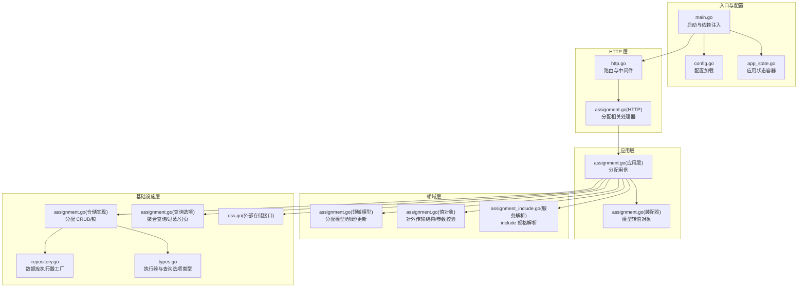
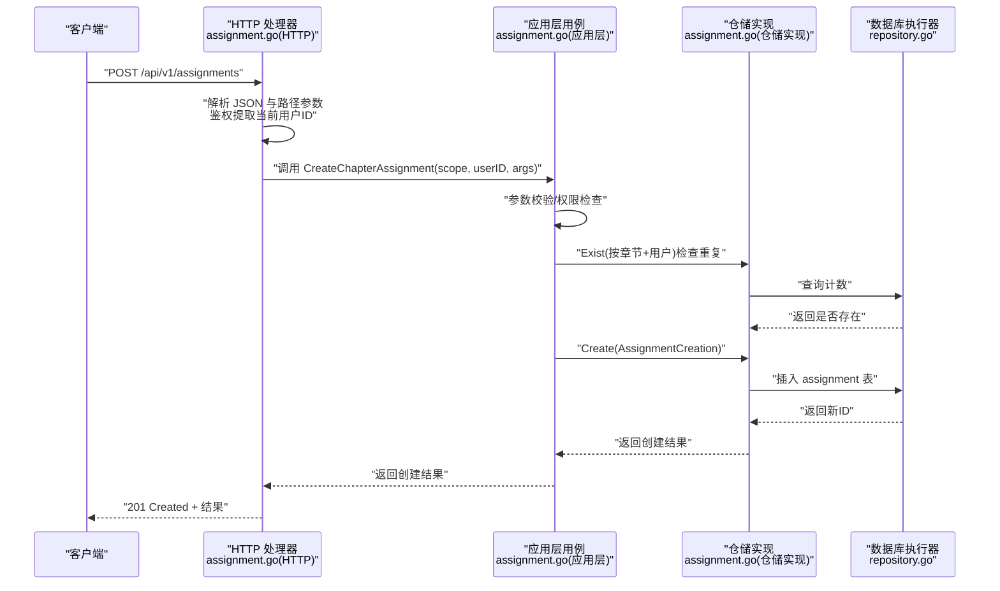
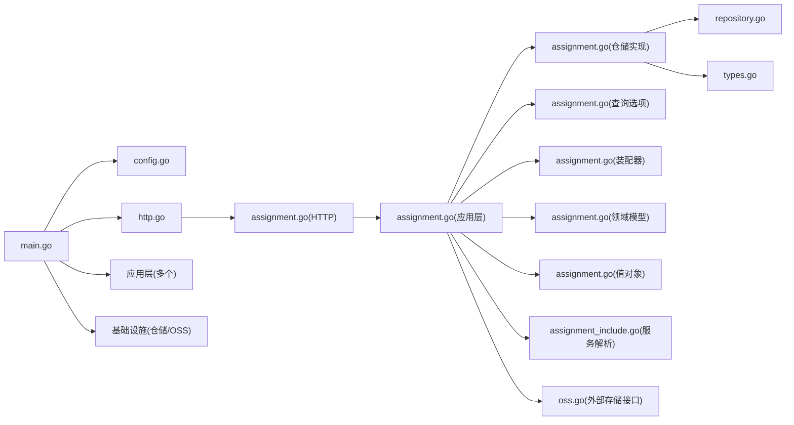

# 数据流架构

<cite>
**本文引用的文件**
- [main.go](file://main.go)
- [http.go](file://internal/api/http/http.go)
- [assignment.go（HTTP 处理器）](file://internal/api/http/assignment.go)
- [assignment.go（应用层）](file://internal/application/assignment.go)
- [assignment.go（装配器）](file://internal/application/assembler/assignment.go)
- [assignment.go（仓储实现）](file://internal/infrastructure/repository/assignment.go)
- [assignment.go（查询选项）](file://internal/infrastructure/repository/query_option/assignment.go)
- [assignment.go（领域模型）](file://internal/domain/model/assignment.go)
- [assignment.go（值对象）](file://internal/value/assignment.go)
- [assignment_include.go（服务解析）](file://internal/domain/service/assignment_include.go)
- [types.go（仓储接口与执行器）](file://internal/domain/repository/types.go)
- [repository.go（数据库执行器工厂）](file://internal/infrastructure/repository/repository.go)
- [config.go（配置）](file://internal/config/config.go)
- [app_state.go（应用状态）](file://internal/state/app_state.go)
- [oss.go（外部存储接口）](file://internal/domain/external/oss.go)
</cite>

## 目录
1. [引言](#引言)
2. [项目结构](#项目结构)
3. [核心组件](#核心组件)
4. [架构总览](#架构总览)
5. [详细组件分析](#详细组件分析)
6. [依赖分析](#依赖分析)
7. [性能考虑](#性能考虑)
8. [故障排查指南](#故障排查指南)
9. [结论](#结论)
10. [附录](#附录)

## 引言
本文件面向 poprako-web-ms 项目的后端数据流架构，系统性梳理从 HTTP 请求到数据库操作的完整数据流转过程，覆盖请求解析、业务逻辑处理、数据持久化与响应生成；并深入说明数据在各层之间的传递方式、数据转换与验证机制、事务管理与一致性保障、并发控制策略，以及缓存、批量操作与异步处理的可行方案与落地建议。

## 项目结构
后端采用分层清晰的 Go 应用结构：
- 入口与启动：main.go 负责加载环境与配置、构建仓储与应用层实例，并启动 HTTP 服务器。
- HTTP 层：internal/api/http 提供路由注册、中间件与控制器（Handlers），负责请求解析、鉴权与响应封装。
- 应用层：internal/application 提供业务用例（Use Cases），编排领域模型与仓储，实现业务规则与权限校验。
- 领域层：internal/domain 定义模型、服务与仓库接口，承载核心业务语义。
- 基础设施层：internal/infrastructure 实现仓储与外部集成（如 OSS）。
- 值对象与装配器：internal/value 定义对外传输结构，assembler 负责领域模型与值对象的转换。
- 配置与状态：internal/config 与 internal/state 提供配置加载与全局应用状态容器。

图表来源
- [main.go:25-145](file://main.go#L25-L145)
- [http.go:16-151](file://internal/api/http/http.go#L16-L151)
- [assignment.go（HTTP 处理器）:25-227](file://internal/api/http/assignment.go#L25-L227)
- [assignment.go（应用层）:92-357](file://internal/application/assignment.go#L92-L357)
- [assignment.go（装配器）:9-38](file://internal/application/assembler/assignment.go#L9-L38)
- [assignment.go（仓储实现）:25-142](file://internal/infrastructure/repository/assignment.go#L25-L142)
- [assignment.go（查询选项）:15-111](file://internal/infrastructure/repository/query_option/assignment.go#L15-L111)
- [assignment.go（领域模型）:5-189](file://internal/domain/model/assignment.go#L5-L189)
- [assignment.go（值对象）:9-130](file://internal/value/assignment.go#L9-L130)
- [assignment_include.go（服务解析）:13-66](file://internal/domain/service/assignment_include.go#L13-L66)
- [types.go:5-11](file://internal/domain/repository/types.go#L5-L11)
- [repository.go:11-29](file://internal/infrastructure/repository/repository.go#L11-L29)
- [config.go:11-59](file://internal/config/config.go#L11-L59)
- [app_state.go:23-49](file://internal/state/app_state.go#L23-L49)
- [oss.go:3-8](file://internal/domain/external/oss.go#L3-L8)

章节来源
- [main.go:25-145](file://main.go#L25-L145)
- [http.go:16-151](file://internal/api/http/http.go#L16-L151)
- [config.go:11-59](file://internal/config/config.go#L11-L59)
- [app_state.go:23-49](file://internal/state/app_state.go#L23-L49)

## 核心组件
- 入口与依赖注入：main.go 构建数据库执行器、各仓储与应用层实例，并通过 AppState 注入 HTTP 层。
- HTTP 层：http.go 注册路由与中间件，assignment.go(HTTP) 将请求映射到应用层方法。
- 应用层：assignment.go(应用层) 实现分配列表、创建、更新、删除等用例，内置参数校验与权限检查。
- 领域模型与值对象：domain/model 与 value 定义分配实体、创建/更新结构与对外传输结构。
- 仓储与查询选项：infrastructure/repository 提供 CRUD 与事务接口，query_option 组合多表聚合查询。
- 外部存储：domain/external 定义 OSS 接口，用于预签名 URL 生成与对象删除。

章节来源
- [main.go:44-122](file://main.go#L44-L122)
- [http.go:38-149](file://internal/api/http/http.go#L38-L149)
- [assignment.go（HTTP 处理器）:25-227](file://internal/api/http/assignment.go#L25-L227)
- [assignment.go（应用层）:92-357](file://internal/application/assignment.go#L92-L357)
- [assignment.go（装配器）:9-38](file://internal/application/assembler/assignment.go#L9-L38)
- [assignment.go（仓储实现）:25-142](file://internal/infrastructure/repository/assignment.go#L25-L142)
- [assignment.go（查询选项）:15-111](file://internal/infrastructure/repository/query_option/assignment.go#L15-L111)
- [assignment.go（领域模型）:5-189](file://internal/domain/model/assignment.go#L5-L189)
- [assignment.go（值对象）:9-130](file://internal/value/assignment.go#L9-L130)
- [oss.go:3-8](file://internal/domain/external/oss.go#L3-L8)

## 架构总览
下图展示一次“创建章节分配”的典型数据流：HTTP 层接收请求、解析参数与鉴权，应用层进行参数校验与权限检查，仓储层执行数据库写入，最终返回结果。

图表来源
- [assignment.go（HTTP 处理器）:110-138](file://internal/api/http/assignment.go#L110-L138)
- [assignment.go（应用层）:214-265](file://internal/application/assignment.go#L214-L265)
- [assignment.go（仓储实现）:82-103](file://internal/infrastructure/repository/assignment.go#L82-L103)
- [repository.go:11-29](file://internal/infrastructure/repository/repository.go#L11-L29)

## 详细组件分析

### HTTP 层：请求解析与响应封装
- 中间件：request-id、日志、panic 恢复等中间件统一接入。
- 路由：/api/v1 下划分认证、用户、团队、成员、邀请、漫画、工作集、章节、页面、分配、单元等模块。
- 控roller：assignment.go(HTTP) 将请求参数绑定到 value 对象，调用对应应用层方法，并对错误进行标准化响应。

章节来源
- [http.go:26-151](file://internal/api/http/http.go#L26-L151)
- [assignment.go（HTTP 处理器）:25-227](file://internal/api/http/assignment.go#L25-L227)

### 应用层：业务逻辑与权限校验
- 参数校验：所有输入参数均通过 value 对象的 Validate 方法进行校验。
- 权限检查：使用 PermAssignment* 策略检查当前用户在目标章节上的角色是否满足操作要求。
- 查询组装：根据 includes 参数解析出需要的关联字段，构造查询选项。
- 数据转换：使用装配器将领域模型转换为对外值对象，必要时生成预签名 URL。

章节来源
- [assignment.go（应用层）:92-357](file://internal/application/assignment.go#L92-L357)
- [assignment.go（HTTP 处理器）:25-227](file://internal/api/http/assignment.go#L25-L227)
- [assignment.go（装配器）:9-38](file://internal/application/assembler/assignment.go#L9-L38)
- [assignment_include.go（服务解析）:13-66](file://internal/domain/service/assignment_include.go#L13-L66)

### 领域模型与值对象：数据契约
- 领域模型：定义 AssignmentInfo、AssignmentCreation、AssignmentUpdate 等结构，承载角色分配的业务语义与时间戳处理。
- 值对象：对外传输结构 AssignmentInfo 与参数对象（列表、创建、更新）定义字段与校验规则，确保 API 一致性。

章节来源
- [assignment.go（领域模型）:5-189](file://internal/domain/model/assignment.go#L5-L189)
- [assignment.go（值对象）:9-130](file://internal/value/assignment.go#L9-L130)

### 仓储层：数据库操作与事务
- 执行器：repository.go 使用 GORM 打开连接并设置连接池参数。
- 事务：types.go 定义 Transactor 接口，仓储实现 BeginTransaction 返回事务执行器。
- CRUD：assignment.go(仓储实现) 提供 Get、Exist、List、Create、Update、Delete 等方法。
- 聚合查询：query_option/assignment.go 提供 IncludeRelationInfo 等选项，支持 user/chapter/comic/creator 的多表联接与字段选择。
- 锁定：提供按漫画 ID 的行级锁定辅助查询（用于并发控制）。

章节来源
- [repository.go:11-29](file://internal/infrastructure/repository/repository.go#L11-L29)
- [types.go:5-11](file://internal/domain/repository/types.go#L5-L11)
- [assignment.go（仓储实现）:25-142](file://internal/infrastructure/repository/assignment.go#L25-L142)
- [assignment.go（查询选项）:15-111](file://internal/infrastructure/repository/query_option/assignment.go#L15-L111)

### 数据转换与验证机制
- 参数绑定：Iris 将请求体与查询参数绑定到 value 对象。
- 校验：value 对象的 Validate 方法集中校验必填字段与分页参数合法性。
- 装配：assembler 将领域模型转换为对外值对象，处理时间戳与可选关联字段。

章节来源
- [assignment.go（HTTP 处理器）:34-44](file://internal/api/http/assignment.go#L34-L44)
- [assignment.go（HTTP 处理器）:119-129](file://internal/api/http/assignment.go#L119-L129)
- [assignment.go（HTTP 处理器）:169-174](file://internal/api/http/assignment.go#L169-L174)
- [assignment.go（值对象）:45-81](file://internal/value/assignment.go#L45-L81)
- [assignment.go（值对象）:93-107](file://internal/value/assignment.go#L93-L107)
- [assignment.go（值对象）:116-129](file://internal/value/assignment.go#L116-L129)
- [assignment.go（装配器）:9-38](file://internal/application/assembler/assignment.go#L9-L38)

### 事务管理、一致性与并发控制
- 事务：Transactor 接口定义 BeginTransaction，仓储实现可在传入的执行器上执行事务操作，确保写入一致性。
- 幂等与重复检查：创建前先 Exist 检查同一章节与用户的重复分配，避免重复写入。
- 并发控制：提供按漫画 ID 的锁定查询，可用于在批量操作或关键路径上实现行级锁定，降低并发冲突风险。
- 连接池：通过配置设置最大空闲与最大打开连接数，平衡吞吐与资源占用。

章节来源
- [types.go:9-11](file://internal/domain/repository/types.go#L9-L11)
- [assignment.go（仓储实现）:25-27](file://internal/infrastructure/repository/assignment.go#L25-L27)
- [assignment.go（应用层）:243-254](file://internal/application/assignment.go#L243-L254)
- [assignment.go（仓储实现）:133-142](file://internal/infrastructure/repository/assignment.go#L133-L142)
- [repository.go:25-26](file://internal/infrastructure/repository/repository.go#L25-L26)
- [config.go:85-99](file://internal/config/config.go#L85-L99)

### 缓存、批量操作与异步处理建议
- 缓存：对高频只读数据（如用户头像 URL、章节/漫画元信息）引入短期缓存；结合 include 规格减少重复查询。
- 批量操作：利用查询选项的聚合能力一次性拉取多表数据，减少往返；对写入操作使用事务批处理。
- 异步处理：对于耗时任务（如大文件上传、批量重算统计），可将任务投递至消息队列，HTTP 快速返回，后续轮询结果。

（本小节为通用实践建议，不直接对应现有代码实现）

## 依赖分析
- 入口依赖：main.go 依赖配置、仓储工厂、应用层与 HTTP 启动。
- HTTP 依赖：assignment.go(HTTP) 依赖应用层；路由注册依赖中间件与鉴权。
- 应用层依赖：assignment.go(应用层) 依赖仓储、装配器、服务解析与外部存储接口。
- 仓储依赖：assignment.go(仓储实现) 依赖执行器与实体映射；查询选项提供组合式查询能力。
- 配置与状态：config.go 加载运行时配置；app_state.go 作为全局容器注入各组件。

图表来源
- [main.go:25-145](file://main.go#L25-L145)
- [http.go:16-151](file://internal/api/http/http.go#L16-L151)
- [assignment.go（HTTP 处理器）:25-227](file://internal/api/http/assignment.go#L25-L227)
- [assignment.go（应用层）:92-357](file://internal/application/assignment.go#L92-L357)
- [assignment.go（装配器）:9-38](file://internal/application/assembler/assignment.go#L9-L38)
- [assignment.go（仓储实现）:25-142](file://internal/infrastructure/repository/assignment.go#L25-L142)
- [assignment.go（查询选项）:15-111](file://internal/infrastructure/repository/query_option/assignment.go#L15-L111)
- [assignment.go（领域模型）:5-189](file://internal/domain/model/assignment.go#L5-L189)
- [assignment.go（值对象）:9-130](file://internal/value/assignment.go#L9-L130)
- [assignment_include.go（服务解析）:13-66](file://internal/domain/service/assignment_include.go#L13-L66)
- [types.go:5-11](file://internal/domain/repository/types.go#L5-L11)
- [repository.go:11-29](file://internal/infrastructure/repository/repository.go#L11-L29)
- [oss.go:3-8](file://internal/domain/external/oss.go#L3-L8)

章节来源
- [main.go:25-145](file://main.go#L25-L145)
- [http.go:16-151](file://internal/api/http/http.go#L16-L151)

## 性能考虑
- 连接池：合理设置最小空闲与最大连接数，避免高并发下的连接争用。
- 查询优化：优先使用 IncludeRelationInfo 聚合查询，减少 N+1；分页参数 Offset/Limit 控制结果规模。
- 写入优化：批量写入时使用 BeginTransaction，减少提交次数；避免不必要的重复写入（Exist 检查）。
- 缓存：热点数据短时缓存，结合失效策略；对外 URL 可预签名缓存以降低 OSS 调用成本。
- 并发：在关键路径使用行级锁定或乐观锁策略，降低写冲突概率。

（本节为通用指导，不直接分析具体文件）

## 故障排查指南
- 配置加载失败：检查 app_config.json 与环境变量 DATABASE_URL、JWT_SECRET_KEY、APP_ENVIRONMENT 是否正确。
- 数据库连接异常：确认 DATABASE_URL 可达，连接池参数合理；查看 SQL 日志定位慢查询。
- 权限不足：核对当前用户在目标章节的角色，确认 PermAssignment* 策略是否正确匹配。
- 参数校验失败：检查请求体与查询参数是否符合 value 对象的校验规则。
- 事务回滚：在 BeginTransaction 场景下，确保错误路径正确回滚并返回统一错误码。

章节来源
- [config.go:11-59](file://internal/config/config.go#L11-L59)
- [repository.go:11-29](file://internal/infrastructure/repository/repository.go#L11-L29)
- [assignment.go（HTTP 处理器）:34-38](file://internal/api/http/assignment.go#L34-L38)
- [assignment.go（HTTP 处理器）:120-123](file://internal/api/http/assignment.go#L120-L123)
- [assignment.go（HTTP 处理器）:170-173](file://internal/api/http/assignment.go#L170-L173)
- [assignment.go（HTTP 处理器）:45-48](file://internal/api/http/assignment.go#L45-L48)
- [assignment.go（HTTP 处理器）:130-133](file://internal/api/http/assignment.go#L130-L133)
- [assignment.go（HTTP 处理器）:180-183](file://internal/api/http/assignment.go#L180-L183)
- [assignment.go（HTTP 处理器）:220-223](file://internal/api/http/assignment.go#L220-L223)

## 结论
本架构以清晰的分层与职责分离实现了从 HTTP 请求到数据库操作的稳定数据流：HTTP 层负责契约与安全，应用层承载业务规则与权限，仓储层抽象数据持久化，领域与值对象确保数据一致性与可维护性。通过事务、重复检查与聚合查询等手段，系统在功能完备的同时兼顾了性能与可靠性。建议在现有基础上进一步完善缓存与异步处理能力，以支撑更高并发与更复杂的业务场景。

## 附录
- 典型流程参考：创建章节分配的序列图已在“架构总览”与“详细组件分析”中给出。
- 关键实现路径参考：
  - [main.go:44-122](file://main.go#L44-L122)
  - [http.go:38-149](file://internal/api/http/http.go#L38-L149)
  - [assignment.go（HTTP 处理器）:110-138](file://internal/api/http/assignment.go#L110-L138)
  - [assignment.go（应用层）:214-265](file://internal/application/assignment.go#L214-L265)
  - [assignment.go（仓储实现）:82-103](file://internal/infrastructure/repository/assignment.go#L82-L103)
  - [assignment.go（查询选项）:29-101](file://internal/infrastructure/repository/query_option/assignment.go#L29-L101)
  - [assignment.go（装配器）:9-38](file://internal/application/assembler/assignment.go#L9-L38)
  - [repository.go:11-29](file://internal/infrastructure/repository/repository.go#L11-L29)
  - [config.go:11-59](file://internal/config/config.go#L11-L59)
  - [app_state.go:23-49](file://internal/state/app_state.go#L23-L49)
  - [oss.go:3-8](file://internal/domain/external/oss.go#L3-L8)