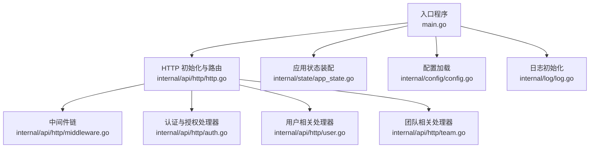
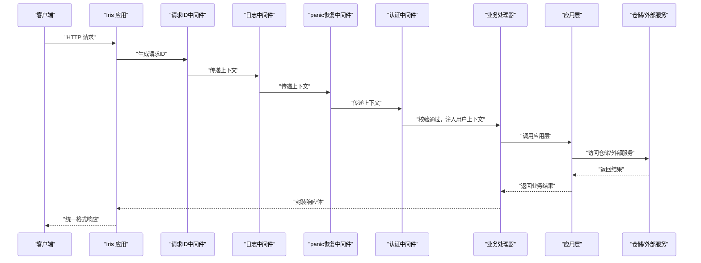
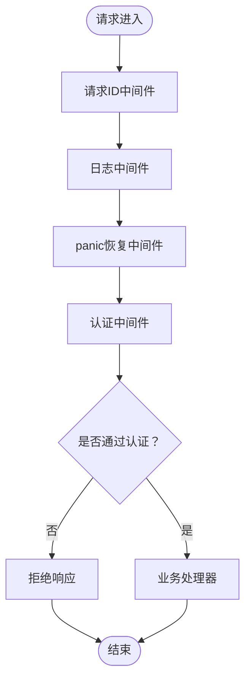
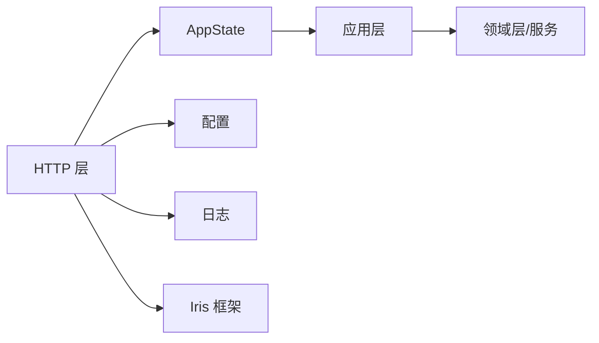

# 服务治理

<cite>
**本文引用的文件**
- [main.go](file://main.go)
- [http.go](file://internal/api/http/http.go)
- [middleware.go](file://internal/api/http/middleware.go)
- [types.go](file://internal/api/http/types.go)
- [util.go](file://internal/api/http/util.go)
- [auth.go](file://internal/api/http/auth.go)
- [user.go](file://internal/api/http/user.go)
- [team.go](file://internal/api/http/team.go)
- [config.go](file://internal/config/config.go)
- [app_state.go](file://internal/state/app_state.go)
- [log.go](file://internal/log/log.go)
- [error.go](file://internal/application/error.go)
- [token.go](file://internal/domain/model/token.go)
- [app_config.json](file://app_config.json)
</cite>

## 目录
1. [简介](#简介)
2. [项目结构](#项目结构)
3. [核心组件](#核心组件)
4. [架构总览](#架构总览)
5. [详细组件分析](#详细组件分析)
6. [依赖分析](#依赖分析)
7. [性能考虑](#性能考虑)
8. [故障排查指南](#故障排查指南)
9. [结论](#结论)
10. [附录](#附录)

## 简介
本文件面向 poprako-web-ms 项目的 HTTP API 层，系统化阐述服务治理机制，包括路由管理、中间件链、请求处理流程与响应格式标准化；详解认证中间件、日志中间件、错误处理中间件的实现与配置；并结合现有代码说明服务发现、负载均衡、熔断降级等微服务治理策略在本项目中的落地方式与扩展路径。同时提供监控、健康检查与故障恢复的实现建议。

## 项目结构
项目采用分层清晰的 Go 应用结构，HTTP 层负责路由与中间件，应用层负责业务编排，领域层负责模型与服务，基础设施层负责外部集成与仓储实现。入口程序负责装配应用状态并启动 HTTP 服务器。

图表来源
- [main.go:25-145](file://main.go#L25-L145)
- [http.go:16-151](file://internal/api/http/http.go#L16-L151)
- [middleware.go:15-79](file://internal/api/http/middleware.go#L15-L79)
- [auth.go:22-72](file://internal/api/http/auth.go#L22-L72)
- [user.go:22-291](file://internal/api/http/user.go#L22-L291)
- [team.go:23-288](file://internal/api/http/team.go#L23-L288)
- [app_state.go:23-49](file://internal/state/app_state.go#L23-L49)
- [config.go:11-59](file://internal/config/config.go#L11-L59)
- [log.go:13-83](file://internal/log/log.go#L13-L83)

章节来源
- [main.go:25-145](file://main.go#L25-L145)
- [http.go:16-151](file://internal/api/http/http.go#L16-L151)

## 核心组件
- HTTP 服务器与路由
  - 使用 Iris 框架，默认实例，启用请求 ID 与 panic 恢复中间件，注册日志中间件，构建 /api/v1 命名空间下的多级子路由，按模块划分控制器。
  - 参考路径：[http.go:16-151](file://internal/api/http/http.go#L16-L151)

- 中间件链
  - 请求 ID：为每个请求生成唯一标识，便于跨服务追踪。
  - 日志中间件：开发环境输出详细字段，生产环境可按需调整。
  - panic 恢复中间件：捕获未处理异常，避免进程崩溃。
  - 认证中间件：校验 Authorization 头部与 JWT 有效性，向后续处理器注入用户上下文。
  - 参考路径：[http.go:26-36](file://internal/api/http/http.go#L26-L36)，[middleware.go:15-79](file://internal/api/http/middleware.go#L15-L79)

- 响应格式标准化
  - 统一响应体包含 code、message、data 字段，成功场景使用 200 状态码，错误通过 code 字段表达业务含义。
  - 参考路径：[types.go:3-9](file://internal/api/http/types.go#L3-L9)，[util.go:24-39](file://internal/api/http/util.go#L24-L39)

- 错误处理与拒绝响应
  - 统一拒绝响应封装，便于前端一致处理。
  - 参考路径：[util.go:11-22](file://internal/api/http/util.go#L11-L22)，[error.go:3-7](file://internal/application/error.go#L3-L7)

- 配置与日志
  - 配置加载支持环境变量与 JSON 文件，区分开发/生产环境行为。
  - 日志初始化按环境选择编码器、输出目标与最低级别。
  - 参考路径：[config.go:11-59](file://internal/config/config.go#L11-L59)，[log.go:13-83](file://internal/log/log.go#L13-L83)，[app_config.json:1-11](file://app_config.json#L1-L11)

章节来源
- [http.go:16-151](file://internal/api/http/http.go#L16-L151)
- [middleware.go:15-79](file://internal/api/http/middleware.go#L15-L79)
- [types.go:3-9](file://internal/api/http/types.go#L3-L9)
- [util.go:11-39](file://internal/api/http/util.go#L11-L39)
- [error.go:3-7](file://internal/application/error.go#L3-L7)
- [config.go:11-59](file://internal/config/config.go#L11-L59)
- [log.go:13-83](file://internal/log/log.go#L13-L83)
- [app_config.json:1-11](file://app_config.json#L1-L11)

## 架构总览
下图展示了从请求进入 HTTP 层到业务处理与响应返回的整体流程，以及中间件在其中的执行顺序与职责分工。

图表来源
- [http.go:26-36](file://internal/api/http/http.go#L26-L36)
- [middleware.go:15-79](file://internal/api/http/middleware.go#L15-L79)
- [auth.go:22-72](file://internal/api/http/auth.go#L22-L72)
- [user.go:22-49](file://internal/api/http/user.go#L22-L49)

## 详细组件分析

### 路由与命名空间
- 入口路由在 /api/v1 下划分多个模块子路由，如 /auth、/users、/teams、/members、/invitations、/comics、/worksets、/chapters、/pages、/assignments、/units。
- 无需登录的路由挂载在 /auth 下，其余路由均受认证中间件保护。
- 参考路径：[http.go:38-148](file://internal/api/http/http.go#L38-L148)

章节来源
- [http.go:38-148](file://internal/api/http/http.go#L38-L148)

### 中间件链与执行顺序
- 注册顺序严格决定执行顺序：请求 ID → 日志 → panic 恢复 → 认证 → 业务处理器。
- 日志中间件在 ctx.Next() 后统计耗时并记录请求详情。
- 认证中间件从 Authorization 头提取 Bearer Token，解析 JWT 并注入用户 ID。
- 参考路径：[http.go:26-36](file://internal/api/http/http.go#L26-L36)，[middleware.go:15-79](file://internal/api/http/middleware.go#L15-L79)

图表来源
- [http.go:26-36](file://internal/api/http/http.go#L26-L36)
- [middleware.go:15-79](file://internal/api/http/middleware.go#L15-L79)

章节来源
- [http.go:26-36](file://internal/api/http/http.go#L26-L36)
- [middleware.go:15-79](file://internal/api/http/middleware.go#L15-L79)

### 认证中间件
- 从请求头读取 Authorization，校验格式与令牌有效性。
- 使用配置中的密钥解析 JWT，提取用户 ID 并写入上下文。
- 参考路径：[middleware.go:47-79](file://internal/api/http/middleware.go#L47-L79)，[config.go:69-83](file://internal/config/config.go#L69-L83)，[token.go:5-8](file://internal/domain/model/token.go#L5-L8)

章节来源
- [middleware.go:47-79](file://internal/api/http/middleware.go#L47-L79)
- [config.go:69-83](file://internal/config/config.go#L69-L83)
- [token.go:5-8](file://internal/domain/model/token.go#L5-L8)

### 日志中间件
- 开发环境输出方法、路径、状态码、远端地址、请求 ID、耗时等字段。
- 生产环境可通过配置调整日志级别与输出目标。
- 参考路径：[middleware.go:15-45](file://internal/api/http/middleware.go#L15-L45)，[log.go:13-83](file://internal/log/log.go#L13-L83)

章节来源
- [middleware.go:15-45](file://internal/api/http/middleware.go#L15-L45)
- [log.go:13-83](file://internal/log/log.go#L13-L83)

### 错误处理中间件与拒绝响应
- 统一拒绝响应封装，便于前端一致处理错误。
- 业务处理器在发生错误时调用拒绝响应，返回统一格式。
- 参考路径：[util.go:11-22](file://internal/api/http/util.go#L11-L22)，[user.go:42-43](file://internal/api/http/user.go#L42-L43)

章节来源
- [util.go:11-22](file://internal/api/http/util.go#L11-L22)
- [user.go:42-43](file://internal/api/http/user.go#L42-L43)

### 响应格式标准化
- 统一响应体包含 code、message、data 字段；成功场景使用 200 状态码，错误通过 code 字段表达业务含义。
- 参考路径：[types.go:3-9](file://internal/api/http/types.go#L3-L9)，[util.go:24-39](file://internal/api/http/util.go#L24-L39)

章节来源
- [types.go:3-9](file://internal/api/http/types.go#L3-L9)
- [util.go:24-39](file://internal/api/http/util.go#L24-L39)

### Swagger 文档与调试
- 非生产环境启用 Swagger UI，提供交互式接口文档。
- 参考路径：[http.go:153-166](file://internal/api/http/http.go#L153-L166)

章节来源
- [http.go:153-166](file://internal/api/http/http.go#L153-L166)

### 典型业务处理器示例
- 登录与注册：读取 JSON 参数，调用应用层，返回统一响应。
- 用户信息查询：从路径参数与查询参数解析，调用应用层，返回统一响应。
- 团队管理：创建、更新、删除、头像上传预留与确认等。
- 参考路径：[auth.go:22-72](file://internal/api/http/auth.go#L22-L72)，[user.go:22-291](file://internal/api/http/user.go#L22-L291)，[team.go:23-288](file://internal/api/http/team.go#L23-L288)

章节来源
- [auth.go:22-72](file://internal/api/http/auth.go#L22-L72)
- [user.go:22-291](file://internal/api/http/user.go#L22-L291)
- [team.go:23-288](file://internal/api/http/team.go#L23-L288)

### 扩展自定义中间件
- 在中间件链中插入新中间件：在初始化阶段于相应位置注册，遵循“先注册先执行”的原则。
- 示例参考：在请求 ID 与日志之间插入自定义中间件，或在认证与业务处理器之间插入审计中间件。
- 参考路径：[http.go:26-36](file://internal/api/http/http.go#L26-L36)

章节来源
- [http.go:26-36](file://internal/api/http/http.go#L26-L36)

## 依赖分析
- 组件耦合
  - HTTP 层通过 AppState 注入应用层，降低对具体业务实现的耦合。
  - 中间件通过 Iris 上下文与配置对象协作，职责单一、内聚度高。
- 外部依赖
  - Iris 框架提供路由与中间件能力；Zap 提供日志；lumberjack 提供日志轮转；Viper 提供配置加载。
- 可能的循环依赖
  - 当前结构通过 AppState 单向注入应用层，未见循环依赖迹象。

图表来源
- [app_state.go:8-21](file://internal/state/app_state.go#L8-L21)
- [http.go:16-151](file://internal/api/http/http.go#L16-L151)
- [config.go:21-27](file://internal/config/config.go#L21-L27)
- [log.go:13-30](file://internal/log/log.go#L13-L30)

章节来源
- [app_state.go:8-21](file://internal/state/app_state.go#L8-L21)
- [http.go:16-151](file://internal/api/http/http.go#L16-L151)
- [config.go:21-27](file://internal/config/config.go#L21-L27)
- [log.go:13-30](file://internal/log/log.go#L13-L30)

## 性能考虑
- 中间件顺序优化：将轻量中间件（如请求 ID、日志）置于前部，重计算中间件（如认证）靠前但避免重复解析。
- 日志开销控制：生产环境建议提升日志级别与输出目标，减少磁盘 IO。
- 响应体大小：避免在 data 中返回大对象，必要时采用分页或流式传输。
- 连接池与超时：数据库连接池参数可在配置中调整，结合业务峰值评估最大并发。

## 故障排查指南
- 认证失败
  - 检查 Authorization 头格式与 Bearer Token 是否有效；确认 JWT 密钥配置正确。
  - 参考路径：[middleware.go:47-79](file://internal/api/http/middleware.go#L47-L79)，[config.go:69-83](file://internal/config/config.go#L69-L83)
- 请求无日志
  - 确认日志中间件已注册且环境变量配置正确；检查日志级别与输出目标。
  - 参考路径：[http.go:26-36](file://internal/api/http/http.go#L26-L36)，[log.go:13-83](file://internal/log/log.go#L13-L83)
- 响应格式异常
  - 确认业务处理器使用 accept/reject 封装响应；检查状态码与 code 字段一致性。
  - 参考路径：[util.go:11-39](file://internal/api/http/util.go#L11-L39)，[types.go:3-9](file://internal/api/http/types.go#L3-L9)
- Swagger 无法访问
  - 确认非生产环境且 Swagger 路由已初始化。
  - 参考路径：[http.go:153-166](file://internal/api/http/http.go#L153-L166)

章节来源
- [middleware.go:47-79](file://internal/api/http/middleware.go#L47-L79)
- [config.go:69-83](file://internal/config/config.go#L69-L83)
- [http.go:26-36](file://internal/api/http/http.go#L26-L36)
- [log.go:13-83](file://internal/log/log.go#L13-L83)
- [util.go:11-39](file://internal/api/http/util.go#L11-L39)
- [types.go:3-9](file://internal/api/http/types.go#L3-L9)
- [http.go:153-166](file://internal/api/http/http.go#L153-L166)

## 结论
本项目在 HTTP API 层实现了清晰的服务治理：统一的中间件链、标准化的响应格式、完善的认证与日志机制。通过 AppState 注入应用层，配合配置与日志初始化，形成稳定的运行基础。未来可在现有基础上扩展服务发现、负载均衡与熔断降级策略，以满足更高可用性与可扩展性的需求。

## 附录

### 服务监控与健康检查
- 建议在中间件链中增加健康检查端点与指标采集中间件，记录请求量、错误率与延迟。
- 参考路径：[http.go:26-36](file://internal/api/http/http.go#L26-L36)

### 故障恢复与灰度发布
- 引入超时与重试策略，结合限流与熔断中间件，保障系统稳定性。
- 参考路径：[http.go:26-36](file://internal/api/http/http.go#L26-L36)