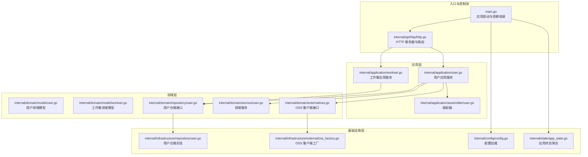
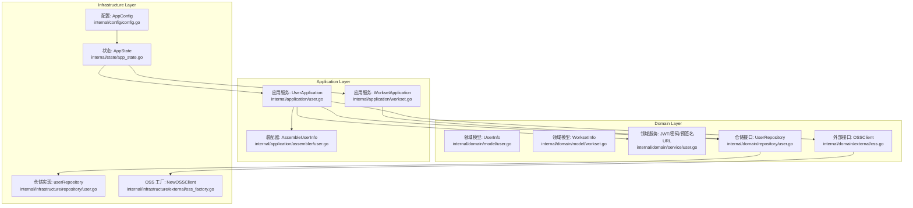
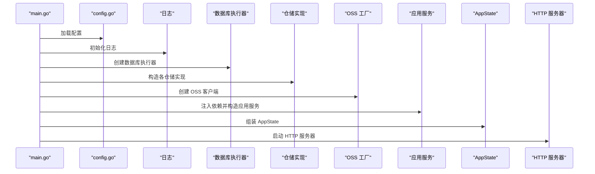
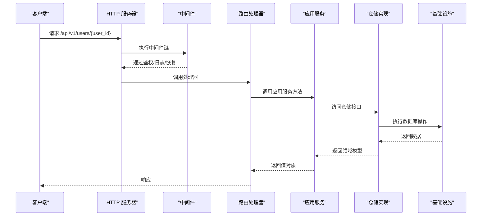
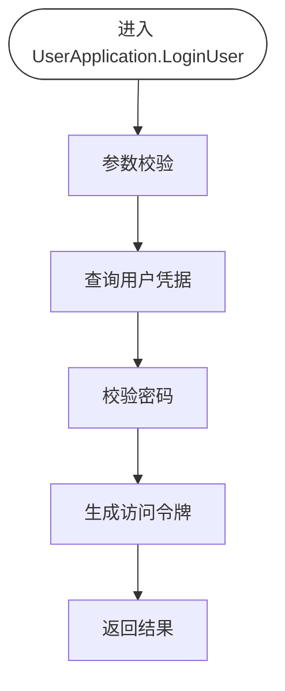
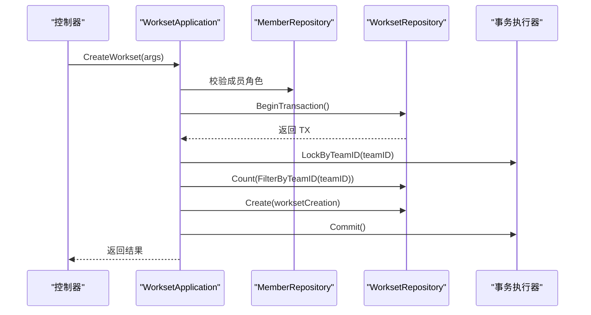
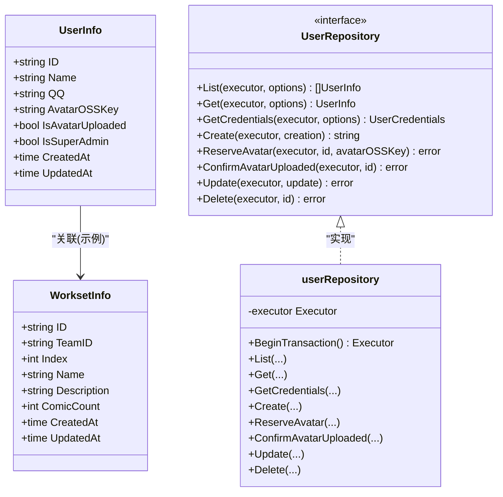
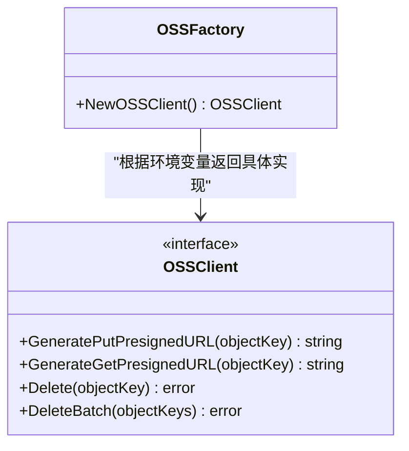
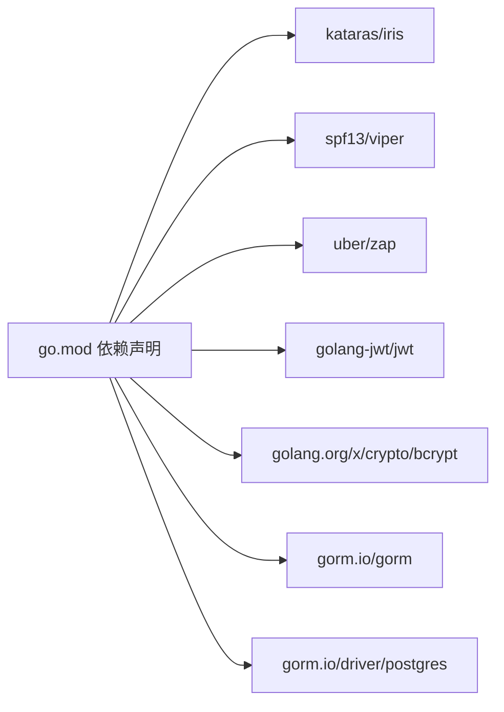

# 架构设计

<cite>
**本文引用的文件**
- [main.go](file://main.go)
- [config.go](file://internal/config/config.go)
- [app_state.go](file://internal/state/app_state.go)
- [http.go](file://internal/api/http/http.go)
- [user.go](file://internal/application/user.go)
- [workset.go](file://internal/application/workset.go)
- [user.go](file://internal/domain/model/user.go)
- [workset.go](file://internal/domain/model/workset.go)
- [user.go](file://internal/domain/repository/user.go)
- [user.go](file://internal/infrastructure/repository/user.go)
- [oss.go](file://internal/domain/external/oss.go)
- [oss_factory.go](file://internal/infrastructure/external/oss_factory.go)
- [user.go](file://internal/application/assembler/user.go)
- [user.go](file://internal/domain/service/user.go)
- [go.mod](file://go.mod)
</cite>

## 目录
1. [引言](#引言)
2. [项目结构](#项目结构)
3. [核心组件](#核心组件)
4. [架构总览](#架构总览)
5. [详细组件分析](#详细组件分析)
6. [依赖分析](#依赖分析)
7. [性能考虑](#性能考虑)
8. [故障排查指南](#故障排查指南)
9. [结论](#结论)
10. [附录](#附录)

## 引言
本文件面向 poprako-web-ms 项目，系统化阐述其基于领域驱动设计（DDD）的三层架构：Domain Layer（领域层）、Application Layer（应用层）、Infrastructure Layer（基础设施层）。文档重点说明各层职责、组件交互与依赖方向，并结合实际代码路径给出架构决策的技术考量、设计权衡与扩展性建议。同时，文档提供架构图与组件关系图，帮助开发者快速理解系统整体设计。

## 项目结构
项目采用按“层”组织的目录结构，配合按“功能域”划分的子包，形成清晰的分层与边界：
- internal/api/http：HTTP 入口与路由定义
- internal/application：应用层编排与业务用例
- internal/domain：领域模型、仓储接口与领域服务
- internal/infrastructure：基础设施实现（数据库、外部服务等）
- internal/state：应用全局状态聚合
- internal/config：配置加载与环境变量解析
- internal/value：应用层值对象（请求/响应载体）
- internal/application/assembler：领域模型到值对象的装配器
- internal/domain/service：通用领域服务（如 JWT、密码哈希）
- internal/infrastructure/external：外部服务抽象与工厂
- internal/infrastructure/repository：仓储接口的具体实现

**图表来源**
- [main.go:25-145](file://main.go#L25-L145)
- [http.go:16-151](file://internal/api/http/http.go#L16-L151)
- [user.go:106-278](file://internal/application/user.go#L106-L278)
- [workset.go:128-213](file://internal/application/workset.go#L128-L213)
- [user.go:10-15](file://internal/domain/repository/user.go#L10-L15)
- [user.go:12-18](file://internal/infrastructure/repository/user.go#L12-L18)
- [oss.go:3-8](file://internal/domain/external/oss.go#L3-L8)
- [oss_factory.go:21-35](file://internal/infrastructure/external/oss_factory.go#L21-L35)
- [config.go:11-59](file://internal/config/config.go#L11-L59)
- [app_state.go:23-49](file://internal/state/app_state.go#L23-L49)

**章节来源**
- [main.go:25-145](file://main.go#L25-L145)
- [http.go:16-151](file://internal/api/http/http.go#L16-L151)
- [config.go:11-59](file://internal/config/config.go#L11-L59)
- [app_state.go:23-49](file://internal/state/app_state.go#L23-L49)

## 核心组件
- 应用启动与依赖组装：main.go 负责加载配置、初始化日志、构建数据库执行器与各类仓储，随后实例化应用服务，并将它们注入到 AppState 中，最终启动 HTTP 服务器。
- 应用状态 AppState：集中持有应用所需的所有应用服务实例，供 HTTP 层在路由处理函数中直接使用。
- HTTP 入口：http.go 定义路由分组与中间件，将请求委派给对应的应用服务方法。
- 应用服务：application 包中的具体应用服务（如 UserApplication、WorksetApplication）负责编排业务流程、鉴权、事务控制与结果装配。
- 领域模型与仓储接口：domain 包定义了模型与仓储接口，约束应用层与基础设施层的契约。
- 基础设施实现：infrastructure 包提供仓储与外部服务的具体实现（数据库访问、OSS 客户端工厂等）。

**章节来源**
- [main.go:25-145](file://main.go#L25-L145)
- [app_state.go:8-21](file://internal/state/app_state.go#L8-L21)
- [http.go:16-151](file://internal/api/http/http.go#L16-L151)
- [user.go:21-64](file://internal/application/user.go#L21-L64)
- [workset.go:20-41](file://internal/application/workset.go#L20-L41)

## 架构总览
本项目采用 DDD 三层架构：
- Domain Layer（领域层）：定义领域模型、领域服务与仓储接口，强调业务语义与不变式。
- Application Layer（应用层）：编排业务用例、处理鉴权与事务、协调领域模型与外部服务，输出应用层值对象。
- Infrastructure Layer（基础设施层）：提供仓储实现与外部服务接入（数据库、OSS），屏蔽技术细节。

**图表来源**
- [user.go:7-19](file://internal/domain/model/user.go#L7-L19)
- [workset.go:5-18](file://internal/domain/model/workset.go#L5-L18)
- [user.go:15-41](file://internal/domain/service/user.go#L15-L41)
- [user.go:5-15](file://internal/domain/repository/user.go#L5-L15)
- [oss.go:3-8](file://internal/domain/external/oss.go#L3-L8)
- [user.go:66-104](file://internal/application/user.go#L66-L104)
- [workset.go:43-70](file://internal/application/workset.go#L43-L70)
- [user.go:10-15](file://internal/infrastructure/repository/user.go#L10-L15)
- [oss_factory.go:21-35](file://internal/infrastructure/external/oss_factory.go#L21-L35)
- [config.go:21-27](file://internal/config/config.go#L21-L27)
- [app_state.go:8-21](file://internal/state/app_state.go#L8-L21)

## 详细组件分析

### 应用启动与依赖注入（手动组装）
- 配置加载：从 JSON 文件与环境变量读取配置，包括服务器地址、认证密钥与数据库连接参数。
- 日志初始化：根据配置初始化日志。
- 数据库执行器与仓储：基于数据库配置创建执行器，并构造各领域仓储实现。
- 外部服务：通过 OSS 工厂根据环境变量选择具体 OSS SDK 实现。
- 应用服务：将仓储与外部服务注入到各应用服务实例。
- 应用状态：将应用服务与配置注入 AppState，供 HTTP 层使用。
- HTTP 服务器：启动 Iris 服务器并挂载路由。

**图表来源**
- [main.go:30-142](file://main.go#L30-L142)
- [config.go:11-59](file://internal/config/config.go#L11-L59)

**章节来源**
- [main.go:25-145](file://main.go#L25-L145)
- [config.go:11-59](file://internal/config/config.go#L11-L59)

### HTTP 路由与中间件
- 中间件：启用 RequestID、恢复中间件与日志中间件；Swagger UI 仅在非生产环境启用。
- 路由分组：/api/v1 下按模块划分路由，认证相关无需登录，其余路由需通过鉴权中间件。
- 控制器委派：路由处理器从 AppState 取出对应应用服务，调用其业务方法。

**图表来源**
- [http.go:26-151](file://internal/api/http/http.go#L26-L151)

**章节来源**
- [http.go:16-167](file://internal/api/http/http.go#L16-L167)

### 用户应用服务（UserApplication）
- 职责：登录、注册、获取用户信息、头像预留与确认、更新与删除用户。
- 鉴权：通过领域权限模型进行权限检查。
- 事务：注册流程在单事务中完成用户创建、成员创建与邀请失效。
- 外部集成：通过 OSS 客户端生成预签名 URL，支持头像上传与访问。
- 结果装配：使用装配器将领域模型转换为应用层值对象。

**图表来源**
- [user.go:106-154](file://internal/application/user.go#L106-L154)

**章节来源**
- [user.go:21-64](file://internal/application/user.go#L21-L64)
- [user.go:106-278](file://internal/application/user.go#L106-L278)
- [user.go:426-468](file://internal/application/user.go#L426-L468)
- [user.go:470-594](file://internal/application/user.go#L470-L594)
- [user.go:10-15](file://internal/domain/repository/user.go#L10-L15)
- [user.go:12-18](file://internal/infrastructure/repository/user.go#L12-L18)
- [user.go:10-15](file://internal/application/assembler/user.go#L10-L15)
- [oss.go:3-8](file://internal/domain/external/oss.go#L3-L8)
- [oss_factory.go:21-35](file://internal/infrastructure/external/oss_factory.go#L21-L35)

### 工作集应用服务（WorksetApplication）
- 职责：列出、创建、更新、删除工作集。
- 权限：基于成员角色与团队上下文进行权限检查。
- 事务：创建工作集时锁定团队并统计数量，保证索引一致性。
- 结果装配：使用 OSS 预签名 URL 生成访问链接。

**图表来源**
- [workset.go:128-213](file://internal/application/workset.go#L128-L213)

**章节来源**
- [workset.go:20-41](file://internal/application/workset.go#L20-L41)
- [workset.go:128-310](file://internal/application/workset.go#L128-L310)

### 领域模型与仓储接口
- 领域模型：UserInfo、WorksetInfo 等承载业务语义与不变式。
- 仓储接口：定义查询、创建、更新、删除等操作，隔离应用层与基础设施层。
- 领域服务：提供 JWT 生成与解析、密码哈希与校验、预签名 URL 生成等通用能力。

**图表来源**
- [user.go:7-19](file://internal/domain/model/user.go#L7-L19)
- [workset.go:5-18](file://internal/domain/model/workset.go#L5-L18)
- [user.go:5-15](file://internal/domain/repository/user.go#L5-L15)
- [user.go:12-18](file://internal/infrastructure/repository/user.go#L12-L18)

**章节来源**
- [user.go:7-19](file://internal/domain/model/user.go#L7-L19)
- [workset.go:5-18](file://internal/domain/model/workset.go#L5-L18)
- [user.go:5-15](file://internal/domain/repository/user.go#L5-L15)
- [user.go:12-18](file://internal/infrastructure/repository/user.go#L12-L18)

### 外部服务与 OSS 客户端工厂
- OSS 接口：统一抽象 Put/Get/Delete 操作。
- 工厂：根据环境变量选择具体 OSS SDK 实现（默认 R2，支持阿里云 OSS）。
- 应用层通过接口注入，避免耦合具体实现。

**图表来源**
- [oss.go:3-8](file://internal/domain/external/oss.go#L3-L8)
- [oss_factory.go:21-35](file://internal/infrastructure/external/oss_factory.go#L21-L35)

**章节来源**
- [oss.go:3-8](file://internal/domain/external/oss.go#L3-L8)
- [oss_factory.go:21-35](file://internal/infrastructure/external/oss_factory.go#L21-L35)

## 依赖分析
- 模块依赖：项目使用 Go Modules 管理依赖，核心包括 Iris Web 框架、Viper 配置、Zap 日志、JWT、bcrypt、GORM 与 PostgreSQL 驱动等。
- 层间依赖方向：应用层依赖领域接口（仓储接口、领域服务、外部接口），基础设施层实现这些接口；HTTP 层仅依赖应用层接口。
- 外部依赖：OSS 客户端通过工厂解耦不同供应商实现；数据库访问通过 GORM 抽象。

**图表来源**
- [go.mod:5-18](file://go.mod#L5-L18)

**章节来源**
- [go.mod:5-18](file://go.mod#L5-L18)

## 性能考虑
- 事务与锁：工作集创建流程通过“锁定 + 统计 + 插入”的方式保证索引一致性，减少并发冲突带来的重复计算。
- 预签名 URL：头像上传与访问通过预签名 URL 减少后端压力，提升用户体验。
- 日志与中间件：启用 RequestID 与恢复中间件，有助于定位性能瓶颈与异常。
- 配置与环境：通过环境变量切换 OSS 供应商与运行环境，便于在不同环境下优化资源与成本。

## 故障排查指南
- 配置加载失败：检查 app_config.json 与环境变量是否正确，确认 DATABASE_URL、JWT_SECRET_KEY、APP_ENVIRONMENT 是否存在。
- 登录失败：确认用户凭据是否存在且密码校验通过；注意登录失败不会区分“用户不存在”与“密码错误”，以防止用户枚举攻击。
- 注册失败：检查邀请码是否有效、是否处于待使用状态；事务回滚会记录错误日志，需关注数据库一致性。
- 权限不足：核对当前用户在目标团队的角色与权限模型；应用层会在鉴权失败时返回明确错误。
- OSS 访问异常：确认 OSS_PROVIDER 环境变量与具体实现可用；预签名 URL 生成失败时，装配器会记录日志但不影响用户信息返回。

**章节来源**
- [config.go:29-59](file://internal/config/config.go#L29-L59)
- [user.go:124-137](file://internal/application/user.go#L124-L137)
- [workset.go:174-178](file://internal/application/workset.go#L174-L178)
- [user.go:294-301](file://internal/application/user.go#L294-L301)
- [user.go:10-15](file://internal/application/assembler/user.go#L10-L15)

## 结论
本项目通过 DDD 三层架构清晰分离关注点：领域层专注业务不变式，应用层编排业务流程与事务，基础设施层屏蔽技术细节。通过手动依赖注入与工厂模式，系统实现了良好的可测试性与可扩展性。未来可在以下方面进一步演进：
- 引入依赖注入容器（如 wire 或 dig）以降低手动组装复杂度；
- 将装配器与领域服务进一步抽象为可插拔组件；
- 增加健康检查与指标上报，完善可观测性；
- 对热点查询引入缓存策略，优化读性能。

## 附录
- 关键实现路径参考：
  - 应用启动与依赖组装：[main.go:25-145](file://main.go#L25-L145)
  - 配置加载：[config.go:11-59](file://internal/config/config.go#L11-L59)
  - 应用状态聚合：[app_state.go:23-49](file://internal/state/app_state.go#L23-L49)
  - HTTP 路由与中间件：[http.go:16-151](file://internal/api/http/http.go#L16-L151)
  - 用户应用服务：[user.go:106-278](file://internal/application/user.go#L106-L278)
  - 工作集应用服务：[workset.go:128-213](file://internal/application/workset.go#L128-L213)
  - 领域模型与仓储接口：[user.go:7-19](file://internal/domain/model/user.go#L7-L19), [workset.go:5-18](file://internal/domain/model/workset.go#L5-L18), [user.go:5-15](file://internal/domain/repository/user.go#L5-L15)
  - 仓储实现：[user.go:12-18](file://internal/infrastructure/repository/user.go#L12-L18)
  - 外部服务接口与工厂：[oss.go:3-8](file://internal/domain/external/oss.go#L3-L8), [oss_factory.go:21-35](file://internal/infrastructure/external/oss_factory.go#L21-L35)
  - 领域服务（JWT/密码/预签名 URL）：[user.go:15-41](file://internal/domain/service/user.go#L15-L41)
  - 模块依赖：[go.mod:5-18](file://go.mod#L5-L18)