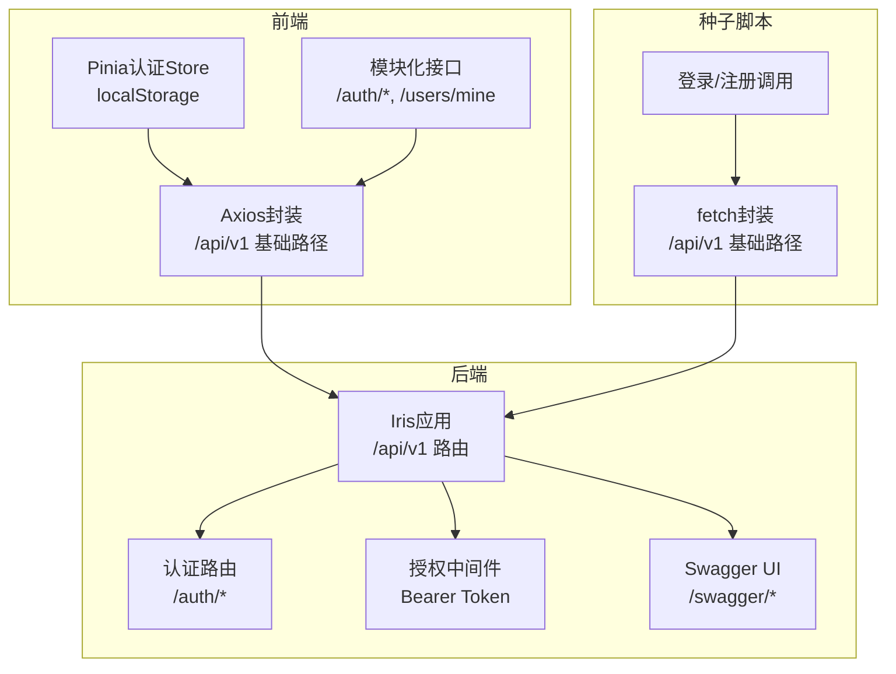
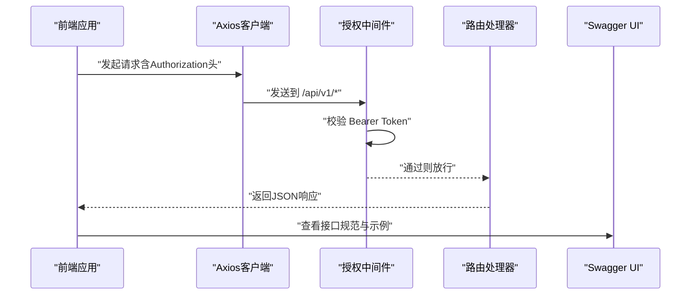
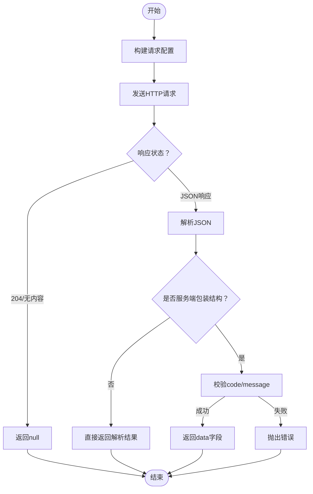
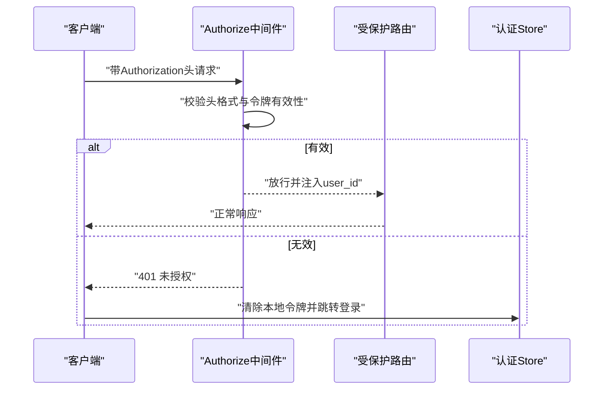
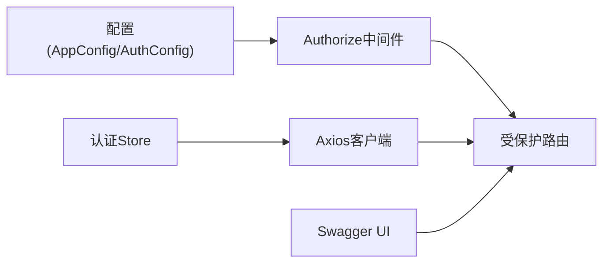

# API测试

<cite>
**本文引用的文件**
- [swagger.yaml](file://docs/swagger.yaml)
- [swagger.json](file://docs/swagger.json)
- [docs.go](file://docs/docs.go)
- [http.go](file://internal/api/http/http.go)
- [middleware.go](file://internal/api/http/middleware.go)
- [auth.go](file://internal/api/http/auth.go)
- [http.ts](file://frontend/src/api/http.ts)
- [auth.ts（前端模块）](file://frontend/src/api/modules/auth.ts)
- [auth.ts（Pinia Store）](file://frontend/src/stores/auth.ts)
- [auth.ts（种子脚本）](file://script/seed/api/auth.ts)
- [http.ts（种子脚本）](file://script/seed/http.ts)
- [ARCHETECT.md](file://docs/ARCHETECT.md)
</cite>

## 目录
1. [简介](#简介)
2. [项目结构](#项目结构)
3. [核心组件](#核心组件)
4. [架构总览](#架构总览)
5. [详细组件分析](#详细组件分析)
6. [依赖分析](#依赖分析)
7. [性能考虑](#性能考虑)
8. [故障排查指南](#故障排查指南)
9. [结论](#结论)
10. [附录](#附录)

## 简介
本文件面向“漫画翻译协作平台”的RESTful API，提供一套系统化的测试策略与实施方法。内容覆盖：
- 基于Swagger文档驱动的接口规范验证、参数约束测试与响应格式验证
- HTTP客户端测试（请求构造、响应解析、错误处理）
- 认证授权测试（JWT令牌验证、权限控制、会话管理）
- 性能测试（并发请求、响应时间监控、负载压力）
- 测试工具使用指南（Postman、curl、自动化测试框架）

## 项目结构
后端基于Go语言与Iris框架，通过Swagger生成接口文档；前端使用TypeScript/Vue/Pinia，统一通过Axios封装HTTP客户端；另有Node/TS种子脚本用于数据准备与简单HTTP调用。

图表来源
- [http.go:38-150](file://internal/api/http/http.go#L38-L150)
- [middleware.go:47-79](file://internal/api/http/middleware.go#L47-L79)
- [http.ts:27-33](file://frontend/src/api/http.ts#L27-L33)
- [auth.ts（前端模块）:79-109](file://frontend/src/api/modules/auth.ts#L79-L109)
- [auth.ts（Pinia Store）:15-50](file://frontend/src/stores/auth.ts#L15-L50)
- [auth.ts（种子脚本）:3-22](file://script/seed/api/auth.ts#L3-L22)
- [http.ts（种子脚本）:9-22](file://script/seed/http.ts#L9-L22)

章节来源
- [http.go:16-150](file://internal/api/http/http.go#L16-L150)
- [ARCHETECT.md:1-36](file://docs/ARCHETECT.md#L1-L36)

## 核心组件
- Swagger接口规范：提供接口路径、参数、响应模型与安全定义，是测试的权威依据
- Iris路由与中间件：统一路由前缀、授权校验、日志与恢复
- 前端HTTP客户端：统一封装请求头、错误处理、序列化查询参数
- 前端认证Store：集中管理访问令牌与登录态
- 种子脚本HTTP客户端：简化集成测试与数据准备

章节来源
- [swagger.yaml:640-644](file://docs/swagger.yaml#L640-L644)
- [swagger.json:9-10](file://docs/swagger.json#L9-L10)
- [http.go:38-150](file://internal/api/http/http.go#L38-L150)
- [middleware.go:47-79](file://internal/api/http/middleware.go#L47-L79)
- [http.ts:27-33](file://frontend/src/api/http.ts#L27-L33)
- [auth.ts（Pinia Store）:15-50](file://frontend/src/stores/auth.ts#L15-L50)
- [http.ts（种子脚本）:9-22](file://script/seed/http.ts#L9-L22)

## 架构总览
下图展示从客户端到后端的典型调用链路，以及认证与授权的关键节点。

图表来源
- [http.go:47-150](file://internal/api/http/http.go#L47-L150)
- [middleware.go:47-79](file://internal/api/http/middleware.go#L47-L79)
- [http.ts:51-62](file://frontend/src/api/http.ts#L51-L62)
- [swagger.yaml:640-644](file://docs/swagger.yaml#L640-L644)

## 详细组件分析

### Swagger文档驱动的测试
- 接口规范验证：以swagger.yaml/swagger.json为权威来源，核对路径、方法、参数、响应模型与状态码
- 参数约束测试：覆盖必填项、类型、长度、枚举值、数组格式（includes[]）等
- 响应格式验证：按定义的DTO结构校验字段存在性、类型与业务含义
- 安全定义测试：验证Authorization头的必要性与格式要求

章节来源
- [swagger.yaml:645-788](file://docs/swagger.yaml#L645-L788)
- [swagger.json:10-2941](file://docs/swagger.json#L10-L2941)
- [docs.go:2934-2940](file://docs/docs.go#L2934-L2940)

### HTTP客户端测试
- 请求构造：统一基地址、超时、Content-Type、Authorization头
- 响应解析：统一错误处理、未授权跳转、204/空响应、服务端包装响应解包
- 查询参数序列化：兼容includes[]数组格式

图表来源
- [http.ts（种子脚本）:9-60](file://script/seed/http.ts#L9-L60)
- [http.ts:87-90](file://frontend/src/api/http.ts#L87-L90)
- [http.ts:150-167](file://frontend/src/api/http.ts#L150-L167)

章节来源
- [http.ts:27-33](file://frontend/src/api/http.ts#L27-L33)
- [http.ts:51-62](file://frontend/src/api/http.ts#L51-L62)
- [http.ts:87-167](file://frontend/src/api/http.ts#L87-L167)
- [http.ts（种子脚本）:9-60](file://script/seed/http.ts#L9-L60)

### 认证授权测试
- JWT令牌验证：Authorization头必须为Bearer <token>，中间件解析并校验
- 权限控制测试：除/auth/*外，其余路由需携带有效令牌
- 会话管理验证：未授权时清理本地存储、重定向登录

图表来源
- [middleware.go:47-79](file://internal/api/http/middleware.go#L47-L79)
- [auth.ts（Pinia Store）:31-42](file://frontend/src/stores/auth.ts#L31-L42)
- [auth.ts（前端模块）:79-109](file://frontend/src/api/modules/auth.ts#L79-L109)

章节来源
- [middleware.go:47-79](file://internal/api/http/middleware.go#L47-L79)
- [auth.ts（Pinia Store）:15-50](file://frontend/src/stores/auth.ts#L15-L50)
- [auth.ts（前端模块）:79-109](file://frontend/src/api/modules/auth.ts#L79-L109)

### 前端模块与种子脚本的协同
- 前端模块：封装具体业务接口（登录、注册、获取当前用户）
- 种子脚本：提供最小HTTP客户端与登录/注册调用，便于快速集成测试

章节来源
- [auth.ts（前端模块）:79-109](file://frontend/src/api/modules/auth.ts#L79-L109)
- [auth.ts（种子脚本）:3-22](file://script/seed/api/auth.ts#L3-L22)
- [http.ts（种子脚本）:9-22](file://script/seed/http.ts#L9-L22)

## 依赖分析
- 后端路由依赖授权中间件，中间件依赖配置中的JWT密钥
- 前端HTTP客户端依赖认证Store提供的令牌
- Swagger UI在非生产环境启用，便于测试与联调

图表来源
- [middleware.go:47-79](file://internal/api/http/middleware.go#L47-L79)
- [http.go:153-166](file://internal/api/http/http.go#L153-L166)
- [auth.ts（Pinia Store）:15-50](file://frontend/src/stores/auth.ts#L15-L50)
- [http.ts:27-33](file://frontend/src/api/http.ts#L27-L33)

章节来源
- [http.go:153-166](file://internal/api/http/http.go#L153-L166)
- [middleware.go:47-79](file://internal/api/http/middleware.go#L47-L79)
- [auth.ts（Pinia Store）:15-50](file://frontend/src/stores/auth.ts#L15-L50)

## 性能考虑
- 并发请求测试：使用工具并发调用受保护接口，观察吞吐与延迟
- 响应时间监控：结合后端日志中间件输出的耗时指标
- 负载压力测试：逐步提升QPS，定位瓶颈（数据库、外部OSS、CPU/GC）

[本节为通用指导，无需列出章节来源]

## 故障排查指南
- 未提供Authorization头：中间件拒绝请求并返回未授权
- Authorization头格式错误：必须为Bearer <token>
- 无效访问令牌：解析失败或缺少用户信息
- 前端未登录跳转：未授权时自动清理本地令牌并跳转登录页
- Swagger UI不可用：确认非生产环境且路由正确

章节来源
- [middleware.go:50-79](file://internal/api/http/middleware.go#L50-L79)
- [http.ts:67-82](file://frontend/src/api/http.ts#L67-L82)
- [http.go:153-166](file://internal/api/http/http.go#L153-L166)

## 结论
通过Swagger文档驱动的接口规范验证、统一的HTTP客户端与严格的认证授权中间件，可以建立稳定可靠的API测试体系。建议将参数约束、响应格式、鉴权与性能测试纳入CI流水线，确保接口质量与稳定性。

[本节为总结性内容，无需列出章节来源]

## 附录

### 测试工具使用指南

- Postman
  - 导入Swagger：使用OpenAPI导入swagger.json或swagger.yaml
  - 环境变量：设置基础URL为后端监听地址，Authorization头为Bearer <token>
  - 鉴权：在集合/请求级别设置Bearer Token，或使用Pre-request Script动态注入
  - 参数：按Swagger定义填写查询参数与Body，特别注意includes[]数组格式
  - 断言：校验状态码、响应体字段与数据类型

- curl命令
  - 登录获取令牌
    - curl -X POST {BASE_URL}/api/v1/auth/login -H "Content-Type: application/json" -d '{...}'
  - 受保护接口调用
    - curl -X GET {BASE_URL}/api/v1/... -H "Authorization: Bearer {access_token}"
  - 包含includes[]数组参数
    - curl "...&includes[]=field1&includes[]=field2"

- 自动化测试框架集成
  - Jest/Vitest + axios：复用frontend/src/api/http.ts作为统一客户端
  - Playwright/Cypress：在浏览器侧集成，使用Pinia Store注入令牌
  - Node/TS种子脚本：script/seed/http.ts可作为轻量HTTP客户端参考

章节来源
- [swagger.json:10-2941](file://docs/swagger.json#L10-L2941)
- [http.ts:27-33](file://frontend/src/api/http.ts#L27-L33)
- [auth.ts（前端模块）:79-109](file://frontend/src/api/modules/auth.ts#L79-L109)
- [http.ts（种子脚本）:9-22](file://script/seed/http.ts#L9-L22)