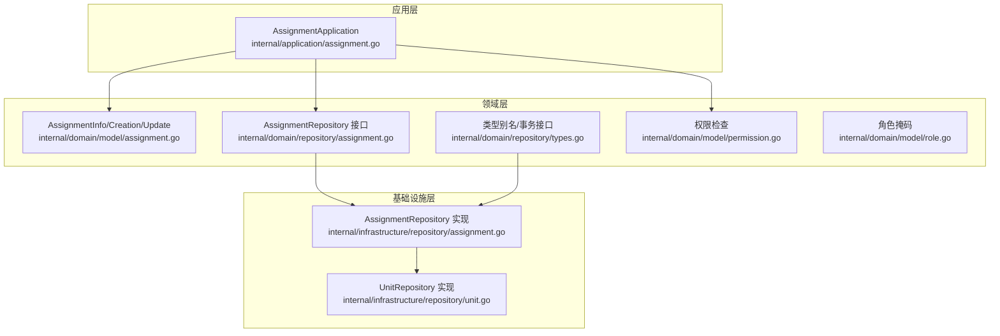
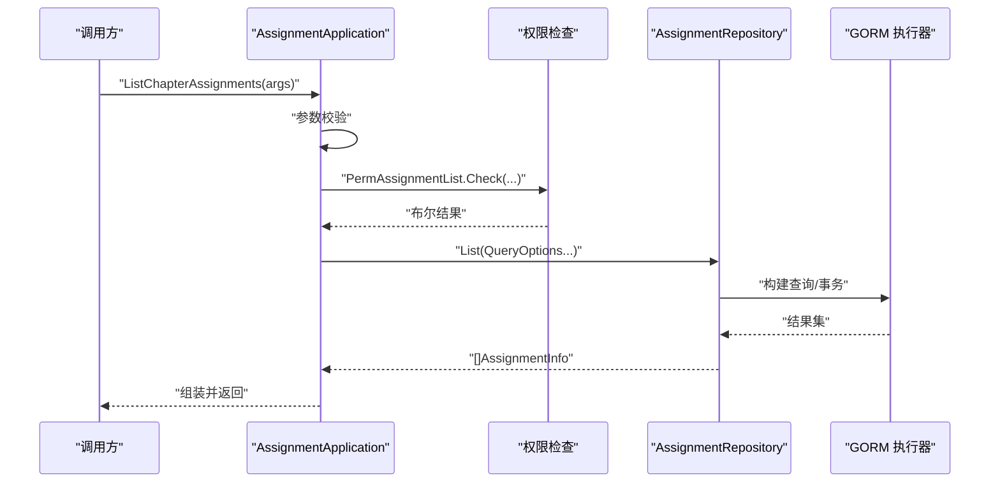
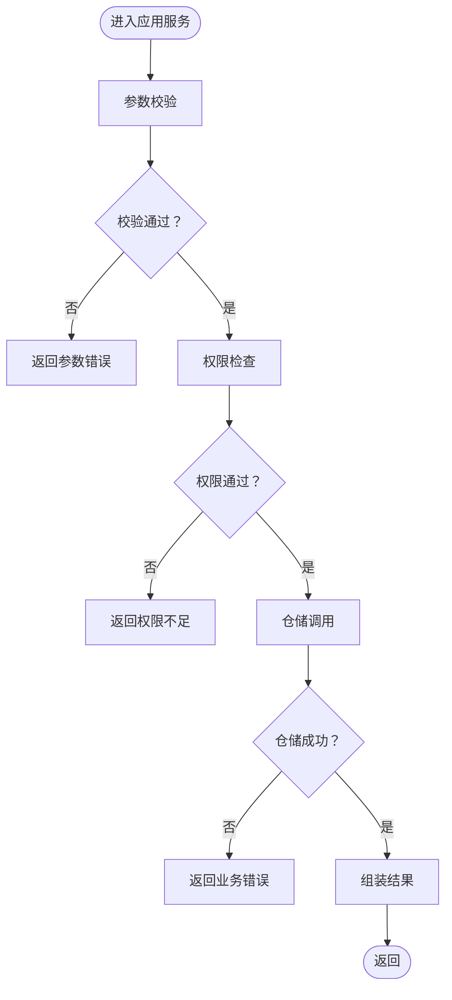
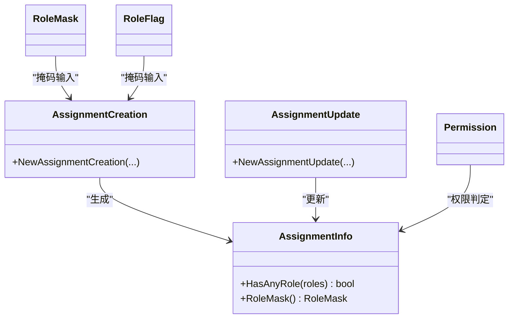
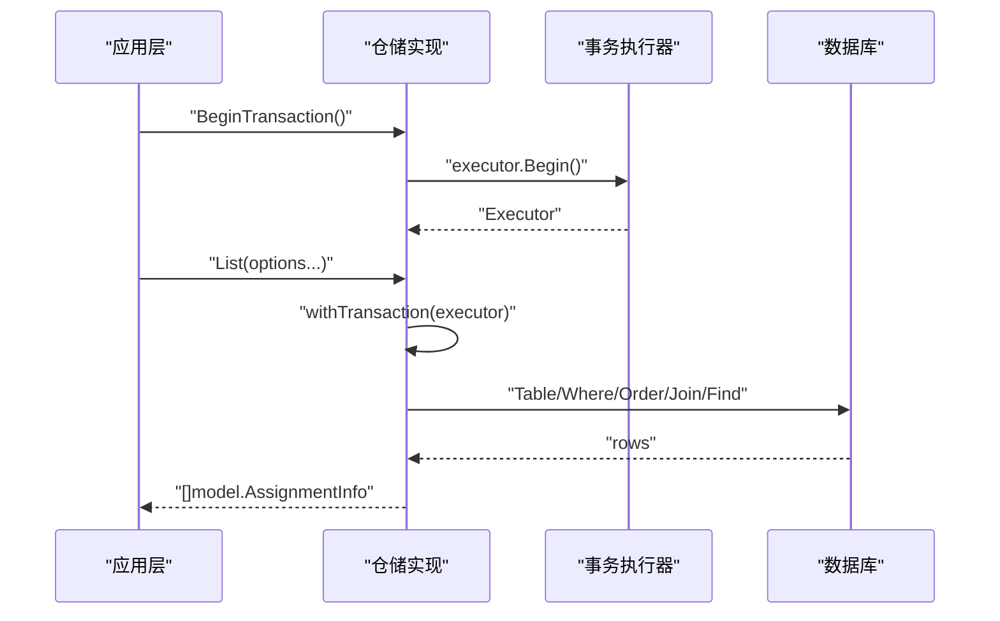
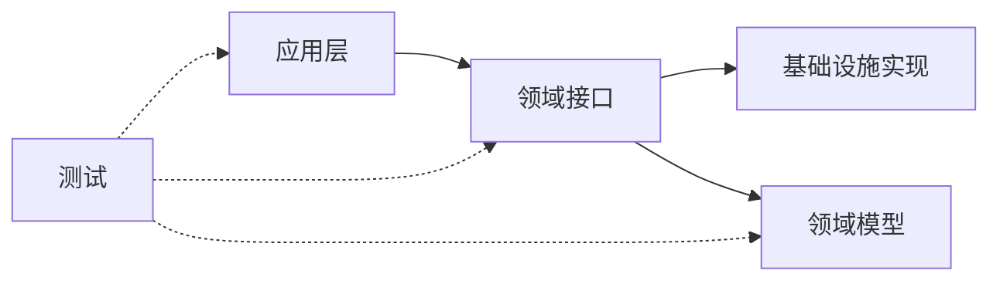

# 单元测试

<cite>
**本文引用的文件**
- [internal/application/assignment.go](file://internal/application/assignment.go)
- [internal/application/error.go](file://internal/application/error.go)
- [internal/domain/repository/assignment.go](file://internal/domain/repository/assignment.go)
- [internal/domain/repository/types.go](file://internal/domain/repository/types.go)
- [internal/infrastructure/repository/assignment.go](file://internal/infrastructure/repository/assignment.go)
- [internal/domain/model/assignment.go](file://internal/domain/model/assignment.go)
- [internal/domain/model/role.go](file://internal/domain/model/role.go)
- [internal/domain/model/permission.go](file://internal/domain/model/permission.go)
- [internal/domain/model/workflow.go](file://internal/domain/model/workflow.go)
- [internal/value/assignment.go](file://internal/value/assignment.go)
- [internal/infrastructure/repository/unit.go](file://internal/infrastructure/repository/unit.go)
- [.copilot-skill/build-application-closed-loop/SKILL.md](file://.copilot-skill/build-application-closed-loop/SKILL.md)
- [go.mod](file://go.mod)
</cite>

## 目录
1. [简介](#简介)
2. [项目结构](#项目结构)
3. [核心组件](#核心组件)
4. [架构总览](#架构总览)
5. [详细组件分析](#详细组件分析)
6. [依赖分析](#依赖分析)
7. [性能考虑](#性能考虑)
8. [故障排查指南](#故障排查指南)
9. [结论](#结论)
10. [附录](#附录)

## 简介
本文件系统性梳理漫画翻译协作平台的单元测试设计与实现方法，覆盖应用层服务、领域层模型与值对象、基础设施层仓储接口三层。重点说明：
- 应用层服务类的测试策略：业务逻辑验证、参数校验、异常处理与权限检查。
- 领域层模型与值对象的测试方法：数据验证、业务规则与边界条件。
- 基础设施层仓储接口的 Mock 测试：数据库操作模拟、查询条件与事务处理验证。
- 测试用例设计原则、覆盖率要求与最佳实践，并给出基于 Go 标准库 testing 包与常见 Mock 框架的实施建议。

## 项目结构
项目采用分层架构：API 层（HTTP 处理器）、应用层（服务用例）、领域层（模型/值对象/服务）、基础设施层（仓储/GORM 实现）。单元测试应按层解耦，通过接口注入与 Mock 替换实现隔离测试。

**图表来源**
- [internal/application/assignment.go:1-358](file://internal/application/assignment.go#L1-L358)
- [internal/domain/repository/assignment.go:1-15](file://internal/domain/repository/assignment.go#L1-L15)
- [internal/domain/repository/types.go:1-12](file://internal/domain/repository/types.go#L1-L12)
- [internal/domain/model/assignment.go:1-190](file://internal/domain/model/assignment.go#L1-L190)
- [internal/domain/model/permission.go:1-845](file://internal/domain/model/permission.go#L1-L845)
- [internal/domain/model/role.go:1-56](file://internal/domain/model/role.go#L1-L56)
- [internal/infrastructure/repository/assignment.go:1-143](file://internal/infrastructure/repository/assignment.go#L1-L143)
- [internal/infrastructure/repository/unit.go:1-52](file://internal/infrastructure/repository/unit.go#L1-L52)

**章节来源**
- [internal/application/assignment.go:1-358](file://internal/application/assignment.go#L1-L358)
- [internal/domain/repository/assignment.go:1-15](file://internal/domain/repository/assignment.go#L1-L15)
- [internal/domain/repository/types.go:1-12](file://internal/domain/repository/types.go#L1-L12)
- [internal/infrastructure/repository/assignment.go:1-143](file://internal/infrastructure/repository/assignment.go#L1-L143)
- [internal/infrastructure/repository/unit.go:1-52](file://internal/infrastructure/repository/unit.go#L1-L52)

## 核心组件
- 应用层服务：AssignmentApplication 提供章节分配列表、我的分配列表、创建、更新、删除等用例；贯穿参数校验、权限检查、仓储调用与组装结果。
- 领域层模型：AssignmentInfo/Creation/Update 封装分配实体的状态与行为；RoleMask/RoleFlag 表达角色集合；Permission 模块提供细粒度权限判定。
- 值对象层：AssignmentInfo/List*Args/CreateChapterAssignmentArgs 等 DTO，承担输入校验职责。
- 基础设施仓储：AssignmentRepository 接口与 GORM 实现，支持事务、查询选项与 CRUD。

**章节来源**
- [internal/application/assignment.go:20-46](file://internal/application/assignment.go#L20-L46)
- [internal/domain/model/assignment.go:5-190](file://internal/domain/model/assignment.go#L5-L190)
- [internal/domain/model/role.go:1-56](file://internal/domain/model/role.go#L1-L56)
- [internal/domain/model/permission.go:540-621](file://internal/domain/model/permission.go#L540-L621)
- [internal/value/assignment.go:9-131](file://internal/value/assignment.go#L9-L131)
- [internal/domain/repository/assignment.go:5-14](file://internal/domain/repository/assignment.go#L5-L14)
- [internal/infrastructure/repository/assignment.go:10-143](file://internal/infrastructure/repository/assignment.go#L10-L143)

## 架构总览
下图展示应用层服务调用领域与基础设施层的典型流程，便于设计测试场景与断言点。

**图表来源**
- [internal/application/assignment.go:92-157](file://internal/application/assignment.go#L92-L157)
- [internal/domain/model/permission.go:553-579](file://internal/domain/model/permission.go#L553-L579)
- [internal/infrastructure/repository/assignment.go:61-80](file://internal/infrastructure/repository/assignment.go#L61-L80)

## 详细组件分析

### 应用层服务：AssignmentApplication 单元测试策略
- 测试目标
  - 参数校验：验证 List/My/ListChapter/Create/Update 等 Args 的 Validate 行为与错误消息。
  - 权限检查：通过 Mock 权限加载函数，验证 PermAssignment* 的 Check 返回值对业务流的影响。
  - 仓储交互：通过 Mock AssignmentRepository，断言查询选项、分页、包含关系、创建/更新/删除调用。
  - 异常处理：断言错误码与日志级别，确保客户端错误与内部错误分类清晰。
- 关键断言点
  - 参数非法：返回“参数错误”或“权限不足”等明确错误。
  - 权限不足：阻止后续仓储调用。
  - 正常路径：返回预期结果，记录调试日志。
- Mock 设计
  - 使用接口注入，将 OSSClient、Member/Comic/Workset/Chapter/Assignment 仓储替换为 Mock。
  - 对权限加载函数（OnLoad*）进行行为控制，返回成功/失败以驱动不同分支。
- 覆盖率要求
  - 参数校验：所有 Validate 失败分支。
  - 权限分支：Check 返回 true/false 的两条路径。
  - 仓储分支：List/Exist/Create/Update/Delete 各自的正常与错误路径。
  - 边界条件：空结果、最大分页、包含关系开关等。

**图表来源**
- [internal/application/assignment.go:92-157](file://internal/application/assignment.go#L92-L157)
- [internal/application/assignment.go:214-265](file://internal/application/assignment.go#L214-L265)
- [internal/application/assignment.go:267-357](file://internal/application/assignment.go#L267-L357)
- [internal/application/error.go:3-7](file://internal/application/error.go#L3-L7)

**章节来源**
- [internal/application/assignment.go:92-157](file://internal/application/assignment.go#L92-L157)
- [internal/application/assignment.go:214-265](file://internal/application/assignment.go#L214-L265)
- [internal/application/assignment.go:267-357](file://internal/application/assignment.go#L267-L357)
- [internal/application/error.go:3-7](file://internal/application/error.go#L3-L7)

### 领域层模型与值对象：单元测试方法
- AssignmentInfo/Creation/Update
  - 测试点：HasAnyRole、RoleMask、NewAssignmentCreation、NewAssignmentUpdate 的时间戳保留与替换逻辑。
  - 边界条件：空时间戳、全角色与部分角色组合、重复角色掩码。
- RoleMask/RoleFlag
  - 测试点：MaskRoles/UnmaskRoles 的互逆性、位运算正确性。
- 权限模块 Permission
  - 测试点：各 Perm* 的 Check 在不同 OnLoad* 返回下的分支覆盖，含超级管理员、团队管理员、成员关系与分配关系。
- 值对象 Args
  - 测试点：Validate 对空指针、必填字段、分页参数的校验。
- 工作流模型
  - 测试点：IsValidWorkflowCombination 对不同 Workflow/Status 的合法组合判定。

**图表来源**
- [internal/domain/model/assignment.go:57-190](file://internal/domain/model/assignment.go#L57-L190)
- [internal/domain/model/role.go:19-56](file://internal/domain/model/role.go#L19-L56)
- [internal/domain/model/permission.go:540-621](file://internal/domain/model/permission.go#L540-L621)
- [internal/value/assignment.go:45-130](file://internal/value/assignment.go#L45-L130)
- [internal/domain/model/workflow.go:24-35](file://internal/domain/model/workflow.go#L24-L35)

**章节来源**
- [internal/domain/model/assignment.go:57-190](file://internal/domain/model/assignment.go#L57-L190)
- [internal/domain/model/role.go:19-56](file://internal/domain/model/role.go#L19-L56)
- [internal/domain/model/permission.go:540-621](file://internal/domain/model/permission.go#L540-L621)
- [internal/value/assignment.go:45-130](file://internal/value/assignment.go#L45-L130)
- [internal/domain/model/workflow.go:24-35](file://internal/domain/model/workflow.go#L24-L35)

### 基础设施层仓储接口：Mock 测试实现
- 目标
  - 验证查询选项链式构建、分页、包含关系、事务上下文传递与 CRUD 行为。
- Mock 方法
  - 使用接口注入替换具体 GORM 执行器，构造最小化 Mock Executor，返回预设结果或错误。
  - 对 QueryOption 进行行为验证，确保过滤条件、排序、包含关系被正确应用。
  - 对 Transactor 接口进行验证，确保 BeginTransaction 被调用且上下文传递正确。
- 关键断言
  - 查询：First/Find/Count 的调用顺序与参数匹配。
  - 写入：Create/Updates/Delete 的参数映射与返回值。
  - 锁定：LockByComicID/LockByPageID 的 SQL 行为与锁强度。
- 事务处理
  - 通过 withTransaction 判定是否使用传入执行器或默认执行器，确保事务一致性。

**图表来源**
- [internal/infrastructure/repository/assignment.go:18-27](file://internal/infrastructure/repository/assignment.go#L18-L27)
- [internal/infrastructure/repository/assignment.go:61-80](file://internal/infrastructure/repository/assignment.go#L61-L80)
- [internal/domain/repository/types.go:9-11](file://internal/domain/repository/types.go#L9-L11)

**章节来源**
- [internal/infrastructure/repository/assignment.go:18-27](file://internal/infrastructure/repository/assignment.go#L18-L27)
- [internal/infrastructure/repository/assignment.go:61-80](file://internal/infrastructure/repository/assignment.go#L61-L80)
- [internal/domain/repository/types.go:9-11](file://internal/domain/repository/types.go#L9-L11)

## 依赖分析
- 应用层依赖领域模型与仓储接口，不直接依赖基础设施实现，便于测试替换。
- 领域层不依赖外部系统，职责纯粹。
- 基础设施层依赖 GORM，但通过接口抽象与 Executor 抽象屏蔽具体实现细节。
- 单元测试通过接口注入与 Mock，避免真实数据库依赖。

**图表来源**
- [internal/application/assignment.go:3-18](file://internal/application/assignment.go#L3-L18)
- [internal/domain/repository/assignment.go:3-14](file://internal/domain/repository/assignment.go#L3-L14)
- [internal/infrastructure/repository/assignment.go:3-8](file://internal/infrastructure/repository/assignment.go#L3-L8)

**章节来源**
- [internal/application/assignment.go:3-18](file://internal/application/assignment.go#L3-L18)
- [internal/domain/repository/assignment.go:3-14](file://internal/domain/repository/assignment.go#L3-L14)
- [internal/infrastructure/repository/assignment.go:3-8](file://internal/infrastructure/repository/assignment.go#L3-L8)

## 性能考虑
- 测试中尽量使用内存数据库或轻量级 Mock，避免真实数据库 IO。
- 对复杂查询选项链进行组合测试，减少冗余查询。
- 控制测试并发度，避免事务冲突与锁竞争。
- 使用基准测试（Benchmark）验证关键路径的性能瓶颈。

## 故障排查指南
- 参数校验失败
  - 现象：返回“参数错误”，日志包含校验失败信息。
  - 排查：确认 Args.Validate 的所有分支覆盖，检查必填字段与分页参数。
- 权限检查失败
  - 现象：返回“权限不足”，日志提示权限检查失败。
  - 排查：验证 OnLoad* 函数返回值与权限判定逻辑。
- 仓储调用异常
  - 现象：返回业务错误，日志包含仓储错误。
  - 排查：确认 Mock 执行器返回的错误类型与期望一致；检查查询选项与事务上下文。
- 事务未生效
  - 现象：写入未提交或丢失上下文。
  - 排查：确认 BeginTransaction 调用与 withTransaction 逻辑；确保传入执行器被使用。

**章节来源**
- [internal/application/assignment.go:99-102](file://internal/application/assignment.go#L99-L102)
- [internal/application/assignment.go:120-122](file://internal/application/assignment.go#L120-L122)
- [internal/application/assignment.go:146-149](file://internal/application/assignment.go#L146-L149)
- [internal/infrastructure/repository/assignment.go:18-27](file://internal/infrastructure/repository/assignment.go#L18-L27)

## 结论
通过分层解耦与接口抽象，本项目为单元测试提供了良好的可测性。建议以“参数校验—权限检查—仓储交互—异常处理”为主线设计测试用例，结合 Mock 与最小化执行器，确保高覆盖率与高稳定性。同时，将事务与查询选项作为重点验证对象，保障业务一致性与性能。

## 附录
- 测试用例设计原则
  - 单一职责：每个测试聚焦一个行为或分支。
  - 可重复性：使用 Mock 与确定性输入，避免随机性。
  - 可读性：测试命名清晰表达前置条件、动作与期望。
  - 覆盖率：关键路径与边界条件必须覆盖。
- 覆盖率要求
  - 参数校验：100% 失败分支覆盖。
  - 权限分支：true/false 各一条。
  - 仓储 CRUD：每条路径至少一次。
  - 事务：BeginTransaction 与上下文传递验证。
- 最佳实践
  - 使用 Go 标准库 testing 包组织测试；必要时引入 testify/mock 或同类框架。
  - 为每个接口编写 TestSuite，复用 Mock 与辅助函数。
  - 对复杂流程绘制序列图与流程图，指导测试场景设计。
- 参考实现位置
  - 应用层服务：[internal/application/assignment.go:1-358](file://internal/application/assignment.go#L1-L358)
  - 领域模型与权限：[internal/domain/model/assignment.go:1-190](file://internal/domain/model/assignment.go#L1-L190)、[internal/domain/model/permission.go:1-845](file://internal/domain/model/permission.go#L1-L845)
  - 值对象 Args：[internal/value/assignment.go:1-131](file://internal/value/assignment.go#L1-L131)
  - 仓储接口与实现：[internal/domain/repository/assignment.go:1-15](file://internal/domain/repository/assignment.go#L1-L15)、[internal/infrastructure/repository/assignment.go:1-143](file://internal/infrastructure/repository/assignment.go#L1-L143)
  - 事务与类型别名：[internal/domain/repository/types.go:1-12](file://internal/domain/repository/types.go#L1-L12)
  - 单元测试流程参考：[internal/infrastructure/repository/unit.go:1-52](file://internal/infrastructure/repository/unit.go#L1-L52)
  - 分层闭环与测试建议：[.copilot-skill/build-application-closed-loop/SKILL.md:43-49](file://.copilot-skill/build-application-closed-loop/SKILL.md#L43-L49)
  - 项目依赖与工具链：[go.mod:1-113](file://go.mod#L1-L113)