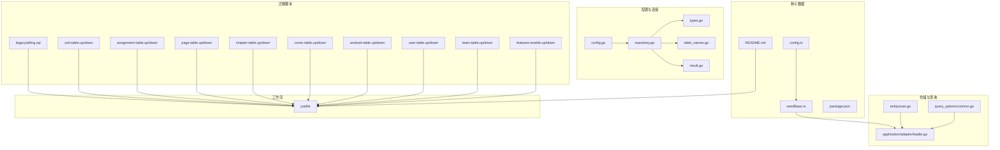
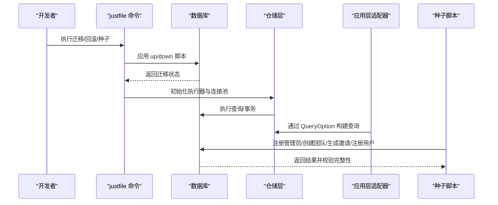
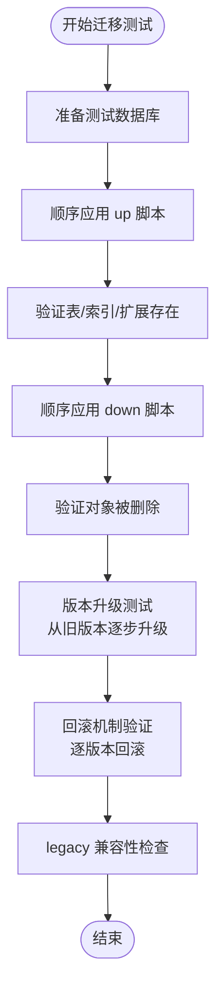
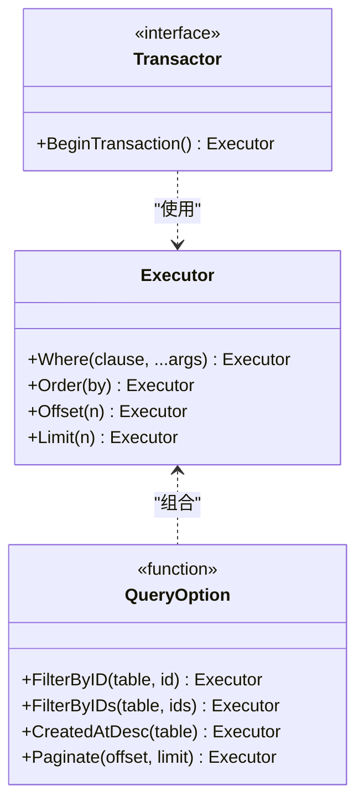
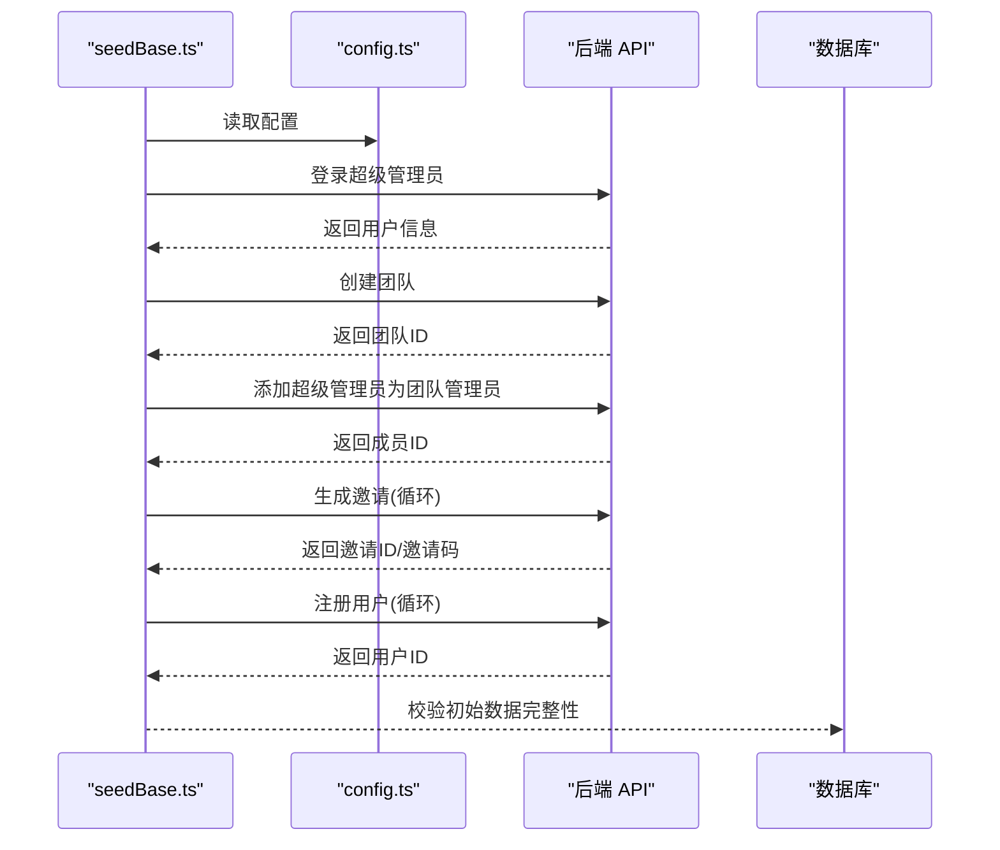
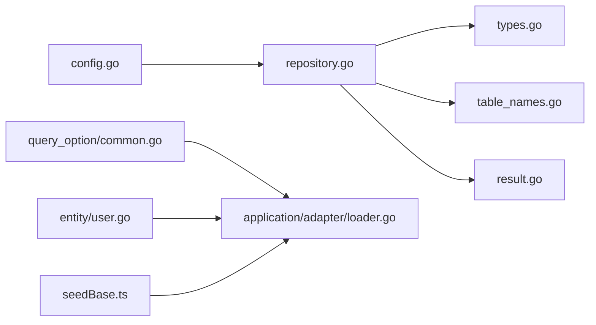

# 数据库测试

<cite>
**本文引用的文件**
- [migrations/20260301065010_features-enable.up.sql](file://migrations/20260301065010_features-enable.up.sql)
- [migrations/20260301065010_features-enable.down.sql](file://migrations/20260301065010_features-enable.down.sql)
- [migrations/20260301065012_team-table.up.sql](file://migrations/20260301065012_team-table.up.sql)
- [migrations/20260301065012_team-table.down.sql](file://migrations/20260301065012_team-table.down.sql)
- [migrations/20260301065022_user-table.up.sql](file://migrations/20260301065022_user-table.up.sql)
- [migrations/20260301065022_user-table.down.sql](file://migrations/20260301065022_user-table.down.sql)
- [migrations/20260306101211_workset-table.up.sql](file://migrations/20260306101211_workset-table.up.sql)
- [migrations/20260306101211_workset-table.down.sql](file://migrations/20260306101211_workset-table.down.sql)
- [migrations/20260306101212_comic-table.up.sql](file://migrations/20260306101212_comic-table.up.sql)
- [migrations/20260306101212_comic-table.down.sql](file://migrations/20260306101212_comic-table.down.sql)
- [migrations/20260306101213_chapter-table.up.sql](file://migrations/20260306101213_chapter-table.up.sql)
- [migrations/20260306101213_chapter-table.down.sql](file://migrations/20260306101213_chapter-table.down.sql)
- [migrations/20260306101214_page-table.up.sql](file://migrations/20260306101214_page-table.up.sql)
- [migrations/20260306101214_page-table.down.sql](file://migrations/20260306101214_page-table.down.sql)
- [migrations/20260306101215_assignment-table.up.sql](file://migrations/20260306101215_assignment-table.up.sql)
- [migrations/20260306101215_assignment-table.down.sql](file://migrations/20260306101215_assignment-table.down.sql)
- [migrations/20260306101216_unit-table.up.sql](file://migrations/20260306101216_unit-table.up.sql)
- [migrations/20260306101216_unit-table.down.sql](file://migrations/20260306101216_unit-table.down.sql)
- [legacy/migrations/allmg.sql](file://legacy/migrations/allmg.sql)
- [justfile](file://justfile)
- [internal/config/config.go](file://internal/config/config.go)
- [internal/infrastructure/repository/repository.go](file://internal/infrastructure/repository/repository.go)
- [internal/domain/repository/types.go](file://internal/domain/repository/types.go)
- [internal/infrastructure/repository/table_names.go](file://internal/infrastructure/repository/table_names.go)
- [internal/infrastructure/repository/result.go](file://internal/infrastructure/repository/result.go)
- [internal/infrastructure/repository/entity/user.go](file://internal/infrastructure/repository/entity/user.go)
- [internal/infrastructure/repository/query_option/common.go](file://internal/infrastructure/repository/query_option/common.go)
- [internal/application/adapter/loader.go](file://internal/application/adapter/loader.go)
- [script/seed/README.md](file://script/seed/README.md)
- [script/seed/config.ts](file://script/seed/config.ts)
- [script/seed/seedBase.ts](file://script/seed/seedBase.ts)
- [script/seed/package.json](file://script/seed/package.json)
</cite>

## 目录
1. 引言
2. 项目结构
3. 核心组件
4. 架构总览
5. 详细组件分析
6. 依赖分析
7. 性能考虑
8. 故障排查指南
9. 结论
10. 附录

## 引言
本文件聚焦于漫画翻译协作平台数据库层的测试策略与验证方法，覆盖数据库迁移测试、仓储层测试设计原则、种子数据测试、数据库性能测试以及测试工具使用指南。目标是帮助开发者在不直接阅读代码的情况下，系统理解如何验证数据库层的正确性、稳定性与性能表现。

## 项目结构
数据库相关的关键目录与文件：
- 迁移脚本：位于 migrations 与 legacy/migrations，采用时间戳+功能命名的 up/down 脚本，确保幂等与可回滚。
- 配置与连接：通过配置加载与 GORM 初始化，提供连接池参数控制。
- 仓储层：定义执行器类型、事务接口与查询选项，统一查询构建与表名常量。
- 种子数据：通过脚本生成初始团队、邀请、成员与用户，便于端到端与回归测试。
- 工作流命令：通过 justfile 提供迁移与种子脚本的便捷执行入口。

图表来源
- [migrations/20260301065010_features-enable.up.sql:1-2](file://migrations/20260301065010_features-enable.up.sql#L1-L2)
- [migrations/20260301065012_team-table.up.sql](file://migrations/20260301065012_team-table.up.sql)
- [migrations/20260301065022_user-table.up.sql](file://migrations/20260301065022_user-table.up.sql)
- [migrations/20260306101211_workset-table.up.sql](file://migrations/20260306101211_workset-table.up.sql)
- [migrations/20260306101212_comic-table.up.sql](file://migrations/20260306101212_comic-table.up.sql)
- [migrations/20260306101213_chapter-table.up.sql](file://migrations/20260306101213_chapter-table.up.sql)
- [migrations/20260306101214_page-table.up.sql](file://migrations/20260306101214_page-table.up.sql)
- [migrations/20260306101215_assignment-table.up.sql](file://migrations/20260306101215_assignment-table.up.sql)
- [migrations/20260306101216_unit-table.up.sql](file://migrations/20260306101216_unit-table.up.sql)
- [legacy/migrations/allmg.sql:1-16](file://legacy/migrations/allmg.sql#L1-L16)
- [internal/config/config.go:85-100](file://internal/config/config.go#L85-L100)
- [internal/infrastructure/repository/repository.go:11-29](file://internal/infrastructure/repository/repository.go#L11-L29)
- [internal/domain/repository/types.go:5-11](file://internal/domain/repository/types.go#L5-L11)
- [internal/infrastructure/repository/table_names.go:6-17](file://internal/infrastructure/repository/table_names.go#L6-L17)
- [internal/infrastructure/repository/result.go:5-5](file://internal/infrastructure/repository/result.go#L5-L5)
- [internal/infrastructure/repository/query_option/common.go:15-50](file://internal/infrastructure/repository/query_option/common.go#L15-L50)
- [internal/infrastructure/repository/entity/user.go:9-57](file://internal/infrastructure/repository/entity/user.go#L9-L57)
- [internal/application/adapter/loader.go:10-70](file://internal/application/adapter/loader.go#L10-L70)
- [script/seed/README.md:1-16](file://script/seed/README.md#L1-L16)
- [script/seed/config.ts:1-16](file://script/seed/config.ts#L1-L16)
- [script/seed/seedBase.ts:11-79](file://script/seed/seedBase.ts#L11-L79)
- [script/seed/package.json:1-10](file://script/seed/package.json#L1-L10)
- [justfile:24-38](file://justfile#L24-L38)

章节来源
- [justfile:1-38](file://justfile#L1-L38)
- [internal/config/config.go:85-100](file://internal/config/config.go#L85-L100)
- [internal/infrastructure/repository/repository.go:11-29](file://internal/infrastructure/repository/repository.go#L11-L29)
- [internal/domain/repository/types.go:5-11](file://internal/domain/repository/types.go#L5-L11)
- [internal/infrastructure/repository/table_names.go:6-17](file://internal/infrastructure/repository/table_names.go#L6-L17)
- [internal/infrastructure/repository/result.go:5-5](file://internal/infrastructure/repository/result.go#L5-L5)
- [internal/infrastructure/repository/query_option/common.go:15-50](file://internal/infrastructure/repository/query_option/common.go#L15-L50)
- [internal/infrastructure/repository/entity/user.go:9-57](file://internal/infrastructure/repository/entity/user.go#L9-L57)
- [internal/application/adapter/loader.go:10-70](file://internal/application/adapter/loader.go#L10-L70)
- [script/seed/README.md:1-16](file://script/seed/README.md#L1-L16)
- [script/seed/config.ts:1-16](file://script/seed/config.ts#L1-L16)
- [script/seed/seedBase.ts:11-79](file://script/seed/seedBase.ts#L11-L79)
- [script/seed/package.json:1-10](file://script/seed/package.json#L1-L10)

## 核心组件
- 数据库配置与连接
  - 通过环境变量加载数据库连接串与连接池参数，初始化 GORM 执行器并设置最大空闲/最大打开连接数。
- 仓储执行器与事务接口
  - 定义 Executor 类型与 Transactor 接口，统一查询构建与事务开启能力。
- 查询选项与表名常量
  - 提供通用过滤、排序、分页与 ID 精确筛选的 QueryOption；导出表名常量，避免裸字符串污染应用层。
- 实体模型与结果常量
  - 定义用户信息、凭据与插入行等实体映射；导出记录未找到错误常量。
- 种子数据脚本
  - 自动注册超级管理员、创建团队、生成角色邀请、注册用户，形成可重复的初始状态。

章节来源
- [internal/config/config.go:85-100](file://internal/config/config.go#L85-L100)
- [internal/infrastructure/repository/repository.go:11-29](file://internal/infrastructure/repository/repository.go#L11-L29)
- [internal/domain/repository/types.go:5-11](file://internal/domain/repository/types.go#L5-L11)
- [internal/infrastructure/repository/table_names.go:6-17](file://internal/infrastructure/repository/table_names.go#L6-L17)
- [internal/infrastructure/repository/result.go:5-5](file://internal/infrastructure/repository/result.go#L5-L5)
- [internal/infrastructure/repository/query_option/common.go:15-50](file://internal/infrastructure/repository/query_option/common.go#L15-L50)
- [internal/infrastructure/repository/entity/user.go:9-57](file://internal/infrastructure/repository/entity/user.go#L9-L57)
- [script/seed/seedBase.ts:11-79](file://script/seed/seedBase.ts#L11-L79)

## 架构总览
数据库测试贯穿“迁移—仓储—应用—API”的全链路，测试策略如下：
- 迁移测试：验证 up/down 幂等、版本升级/回滚一致性与索引/约束存在性。
- 仓储测试：验证查询构建、数据操作与事务边界。
- 种子测试：验证初始数据生成与完整性。
- 性能测试：验证查询优化、索引有效性与并发访问稳定性。
- 工具与流程：通过 justfile 提供迁移与种子执行入口，结合外部工具完成自动化验证。

图表来源
- [justfile:24-38](file://justfile#L24-L38)
- [internal/infrastructure/repository/repository.go:11-29](file://internal/infrastructure/repository/repository.go#L11-L29)
- [internal/infrastructure/repository/query_option/common.go:15-50](file://internal/infrastructure/repository/query_option/common.go#L15-L50)
- [internal/application/adapter/loader.go:10-70](file://internal/application/adapter/loader.go#L10-L70)
- [script/seed/seedBase.ts:11-79](file://script/seed/seedBase.ts#L11-L79)

## 详细组件分析

### 数据库迁移测试
- 目标
  - 验证每个 up/down 脚本的幂等性与可逆性。
  - 验证版本升级后表结构、索引、约束与扩展存在。
  - 验证回滚后状态恢复至目标版本。
- 实施流程
  - 准备测试数据库实例（建议使用临时容器或专用测试库）。
  - 顺序应用 up 脚本，逐个验证表、索引、扩展是否按预期创建。
  - 逐个应用 down 脚本，验证对象被正确删除。
  - 使用 justfile 的迁移命令进行批量验证。
- 关键点
  - 严格遵守 up 脚本幂等与 down 脚本可逆。
  - 对扩展（如文本搜索扩展）进行启用/禁用验证。
  - 对 legacy 表进行兼容性检查，确保不会破坏现有结构。

图表来源
- [migrations/20260301065010_features-enable.up.sql:1-2](file://migrations/20260301065010_features-enable.up.sql#L1-L2)
- [migrations/20260301065010_features-enable.down.sql:1-2](file://migrations/20260301065010_features-enable.down.sql#L1-L2)
- [legacy/migrations/allmg.sql:1-16](file://legacy/migrations/allmg.sql#L1-L16)
- [justfile:24-38](file://justfile#L24-L38)

章节来源
- [migrations/20260301065010_features-enable.up.sql:1-2](file://migrations/20260301065010_features-enable.up.sql#L1-L2)
- [migrations/20260301065010_features-enable.down.sql:1-2](file://migrations/20260301065010_features-enable.down.sql#L1-L2)
- [legacy/migrations/allmg.sql:1-16](file://legacy/migrations/allmg.sql#L1-L16)
- [justfile:24-38](file://justfile#L24-L38)

### 仓储层测试设计原则
- 查询语句测试
  - 使用 QueryOption 构建复杂查询，覆盖 ID 精确匹配、范围筛选、排序与分页。
  - 验证裸字段与表名前缀的使用规范，确保查询选项包内不出现裸字段。
- 数据操作验证
  - 验证插入、更新、删除的原子性与一致性，结合事务上下文进行测试。
  - 使用 Exec 调用原生 SQL 时，确保参数绑定与错误处理完备。
- 事务处理测试
  - 在测试中开启事务并在用例结束后回滚，保证测试隔离与可重复性。
  - 验证 Transactor 接口的 BeginTransaction 能力与错误传播。

图表来源
- [internal/domain/repository/types.go:5-11](file://internal/domain/repository/types.go#L5-L11)
- [internal/infrastructure/repository/query_option/common.go:15-50](file://internal/infrastructure/repository/query_option/common.go#L15-L50)

章节来源
- [internal/domain/repository/types.go:5-11](file://internal/domain/repository/types.go#L5-L11)
- [internal/infrastructure/repository/query_option/common.go:15-50](file://internal/infrastructure/repository/query_option/common.go#L15-L50)

### 种子数据测试
- 目标
  - 自动生成初始团队、邀请、成员与用户，形成可重复的初始状态。
  - 验证超级管理员权限、角色分配与邀请流程。
- 实施要点
  - 通过配置文件设置 API 地址、默认密码与团队信息。
  - 种子脚本按序执行：登录超级管理员 → 创建团队 → 添加超级管理员为团队管理员 → 生成邀请 → 注册用户。
  - 校验返回的 ID/邀请码等关键字段，确保数据完整性。
- 工具与命令
  - 使用 justfile 的种子命令一键执行。
  - 依赖 Bun 运行时与 TypeScript 支持。

图表来源
- [script/seed/seedBase.ts:11-79](file://script/seed/seedBase.ts#L11-L79)
- [script/seed/config.ts:1-16](file://script/seed/config.ts#L1-L16)
- [script/seed/README.md:1-16](file://script/seed/README.md#L1-L16)
- [script/seed/package.json:1-10](file://script/seed/package.json#L1-L10)

章节来源
- [script/seed/seedBase.ts:11-79](file://script/seed/seedBase.ts#L11-L79)
- [script/seed/config.ts:1-16](file://script/seed/config.ts#L1-L16)
- [script/seed/README.md:1-16](file://script/seed/README.md#L1-L16)
- [script/seed/package.json:1-10](file://script/seed/package.json#L1-L10)

### 数据库性能测试
- 查询优化测试
  - 针对高频查询（按创建时间排序、ID 精确匹配、ID 列表筛选）进行基准测试。
  - 比较不同查询路径的执行计划与耗时，识别潜在瓶颈。
- 索引有效性验证
  - 验证常用过滤字段（如 QQ、ID）上的索引是否存在且有效。
  - 对模糊匹配场景（如文本搜索扩展）进行性能评估。
- 并发访问测试
  - 模拟多用户同时读写，观察锁等待与死锁情况。
  - 结合连接池参数（最大空闲/最大打开连接）调整与验证。

章节来源
- [internal/infrastructure/repository/query_option/common.go:15-50](file://internal/infrastructure/repository/query_option/common.go#L15-L50)
- [migrations/20260301065010_features-enable.up.sql:1-2](file://migrations/20260301065010_features-enable.up.sql#L1-L2)
- [internal/config/config.go:85-100](file://internal/config/config.go#L85-L100)
- [internal/infrastructure/repository/repository.go:25-26](file://internal/infrastructure/repository/repository.go#L25-L26)

### 测试工具使用指南
- 迁移工具
  - 使用 sqlx migrate 命令进行迁移与回滚，配合 justfile 的别名简化操作。
- 数据库模拟
  - 在单元测试中使用内存数据库或轻量级替代（如 SQLite）模拟 PostgreSQL 行为，确保查询构建逻辑可测。
- 自动化脚本
  - 通过 justfile 的迁移与种子命令，串联 CI/CD 流水线，实现自动化验证。
- 种子脚本
  - 使用 Bun 运行种子脚本，确保依赖安装与执行环境一致。

章节来源
- [justfile:24-38](file://justfile#L24-L38)
- [script/seed/README.md:1-16](file://script/seed/README.md#L1-L16)
- [script/seed/package.json:1-10](file://script/seed/package.json#L1-L10)

## 依赖分析
- 配置与连接
  - 配置加载依赖环境变量；GORM 初始化依赖数据库 URL 与连接池参数。
- 仓储与查询
  - 查询选项依赖表名常量，避免硬编码；Transactor 提供事务能力。
- 应用适配器
  - 适配器通过仓储接口与查询选项组合，形成稳定的用例加载流程。
- 种子脚本
  - 依赖配置与后端 API，形成端到端的初始数据注入。

图表来源
- [internal/config/config.go:85-100](file://internal/config/config.go#L85-L100)
- [internal/infrastructure/repository/repository.go:11-29](file://internal/infrastructure/repository/repository.go#L11-L29)
- [internal/domain/repository/types.go:5-11](file://internal/domain/repository/types.go#L5-L11)
- [internal/infrastructure/repository/table_names.go:6-17](file://internal/infrastructure/repository/table_names.go#L6-L17)
- [internal/infrastructure/repository/result.go:5-5](file://internal/infrastructure/repository/result.go#L5-L5)
- [internal/infrastructure/repository/query_option/common.go:15-50](file://internal/infrastructure/repository/query_option/common.go#L15-L50)
- [internal/infrastructure/repository/entity/user.go:9-57](file://internal/infrastructure/repository/entity/user.go#L9-L57)
- [internal/application/adapter/loader.go:10-70](file://internal/application/adapter/loader.go#L10-L70)
- [script/seed/seedBase.ts:11-79](file://script/seed/seedBase.ts#L11-L79)

章节来源
- [internal/config/config.go:85-100](file://internal/config/config.go#L85-L100)
- [internal/infrastructure/repository/repository.go:11-29](file://internal/infrastructure/repository/repository.go#L11-L29)
- [internal/domain/repository/types.go:5-11](file://internal/domain/repository/types.go#L5-L11)
- [internal/infrastructure/repository/table_names.go:6-17](file://internal/infrastructure/repository/table_names.go#L6-L17)
- [internal/infrastructure/repository/result.go:5-5](file://internal/infrastructure/repository/result.go#L5-L5)
- [internal/infrastructure/repository/query_option/common.go:15-50](file://internal/infrastructure/repository/query_option/common.go#L15-L50)
- [internal/infrastructure/repository/entity/user.go:9-57](file://internal/infrastructure/repository/entity/user.go#L9-L57)
- [internal/application/adapter/loader.go:10-70](file://internal/application/adapter/loader.go#L10-L70)
- [script/seed/seedBase.ts:11-79](file://script/seed/seedBase.ts#L11-L79)

## 性能考虑
- 连接池参数
  - 合理设置最小空闲连接与最大打开连接，避免高并发下的连接争用。
- 查询优化
  - 使用查询选项构建高效查询，优先利用索引字段进行过滤与排序。
- 索引策略
  - 对高频过滤字段建立合适索引，平衡写入性能与读取性能。
- 并发控制
  - 在事务中尽量缩短持有锁的时间，减少长事务导致的阻塞。

## 故障排查指南
- 迁移失败
  - 检查数据库 URL 与环境变量是否正确；确认脚本幂等性与依赖顺序。
- 连接问题
  - 核对连接池参数与数据库可达性；查看初始化日志中的错误信息。
- 查询异常
  - 使用查询选项包提供的过滤/排序/分页函数，避免裸字段与不完整表名前缀。
- 种子脚本失败
  - 检查 API 地址、默认密码与团队配置；确认网络连通与后端服务状态。

章节来源
- [internal/config/config.go:91-100](file://internal/config/config.go#L91-L100)
- [internal/infrastructure/repository/repository.go:11-29](file://internal/infrastructure/repository/repository.go#L11-L29)
- [internal/infrastructure/repository/query_option/common.go:9-13](file://internal/infrastructure/repository/query_option/common.go#L9-L13)
- [script/seed/config.ts:1-16](file://script/seed/config.ts#L1-L16)

## 结论
通过系统化的迁移测试、仓储层测试、种子数据测试与性能测试，可以有效保障数据库层的正确性、稳定性与性能表现。借助 justfile 的自动化命令与种子脚本，能够快速搭建可重复的初始状态，并在 CI/CD 中持续验证数据库变更的安全性与兼容性。

## 附录
- 迁移脚本清单（按时间戳命名）
  - features-enable：启用扩展
  - team-table：团队表
  - user-table：用户表
  - workset-table：工作集表
  - comic-table：漫画表
  - chapter-table：章节表
  - page-table：页面表
  - assignment-table：任务分配表
  - unit-table：单元表
- legacy 表：allmg.sql（兼容性检查）

章节来源
- [migrations/20260301065010_features-enable.up.sql:1-2](file://migrations/20260301065010_features-enable.up.sql#L1-L2)
- [migrations/20260301065012_team-table.up.sql](file://migrations/20260301065012_team-table.up.sql)
- [migrations/20260301065022_user-table.up.sql](file://migrations/20260301065022_user-table.up.sql)
- [migrations/20260306101211_workset-table.up.sql](file://migrations/20260306101211_workset-table.up.sql)
- [migrations/20260306101212_comic-table.up.sql](file://migrations/20260306101212_comic-table.up.sql)
- [migrations/20260306101213_chapter-table.up.sql](file://migrations/20260306101213_chapter-table.up.sql)
- [migrations/20260306101214_page-table.up.sql](file://migrations/20260306101214_page-table.up.sql)
- [migrations/20260306101215_assignment-table.up.sql](file://migrations/20260306101215_assignment-table.up.sql)
- [migrations/20260306101216_unit-table.up.sql](file://migrations/20260306101216_unit-table.up.sql)
- [legacy/migrations/allmg.sql:1-16](file://legacy/migrations/allmg.sql#L1-L16)
- [justfile:24-38](file://justfile#L24-L38)