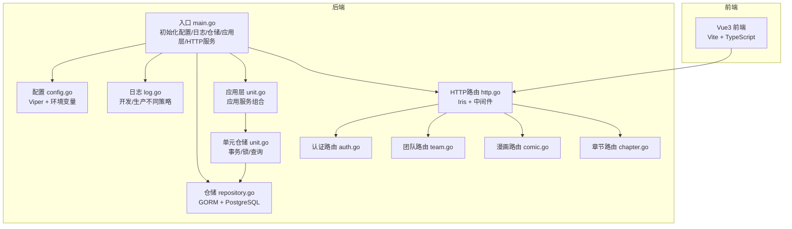
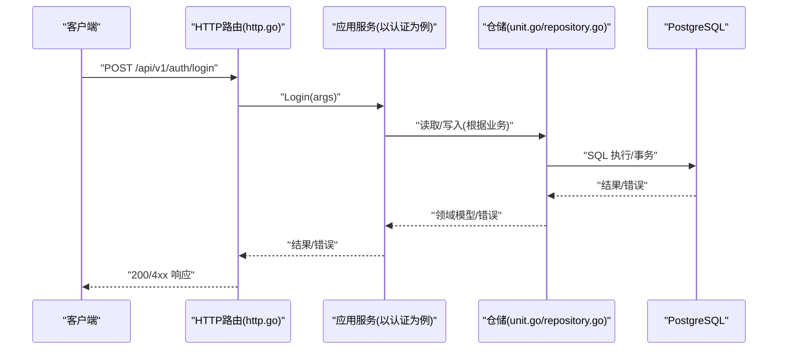
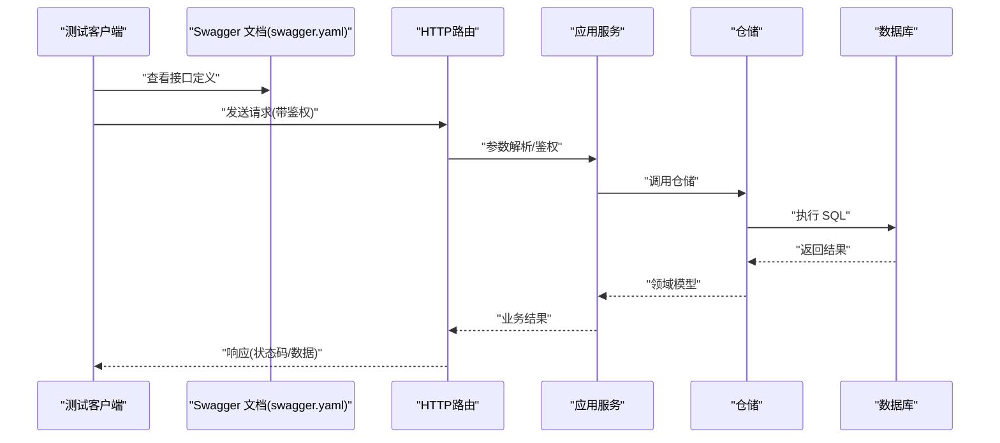
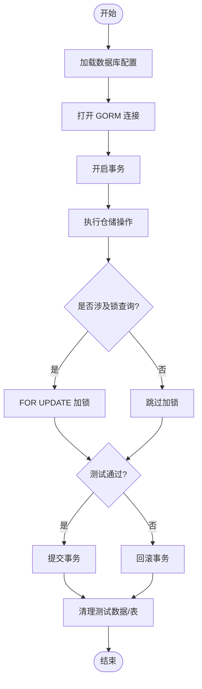
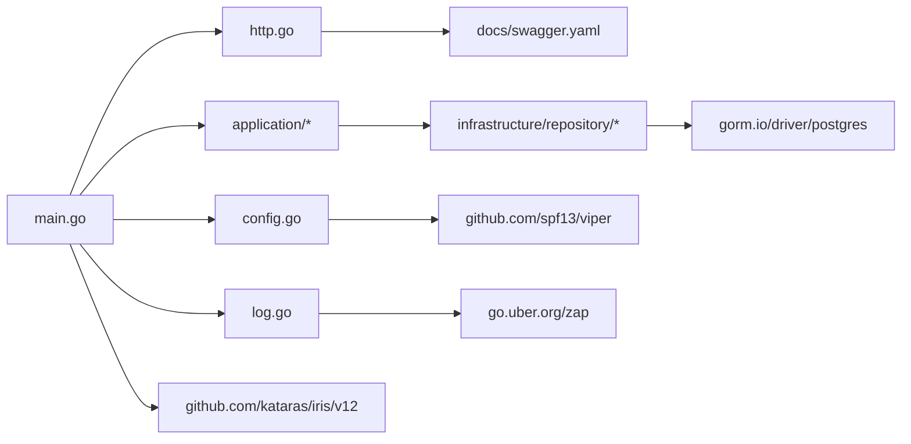

# 测试策略

<cite>
**本文引用的文件**
- [main.go](file://main.go)
- [go.mod](file://go.mod)
- [docs/swagger.yaml](file://docs/swagger.yaml)
- [internal/config/config.go](file://internal/config/config.go)
- [internal/log/log.go](file://internal/log/log.go)
- [internal/api/http/http.go](file://internal/api/http/http.go)
- [internal/api/http/auth.go](file://internal/api/http/auth.go)
- [internal/api/http/team.go](file://internal/api/http/team.go)
- [internal/api/http/comic.go](file://internal/api/http/comic.go)
- [internal/api/http/chapter.go](file://internal/api/http/chapter.go)
- [internal/infrastructure/repository/repository.go](file://internal/infrastructure/repository/repository.go)
- [internal/infrastructure/repository/unit.go](file://internal/infrastructure/repository/unit.go)
- [internal/application/unit.go](file://internal/application/unit.go)
- [migrations/20260306101216_unit-table.down.sql](file://migrations/20260306101216_unit-table.down.sql)
- [migrations/20260301065012_team-table.down.sql](file://migrations/20260301065012_team-table.down.sql)
- [migrations/20260301065022_user-table.down.sql](file://migrations/20260301065022_user-table.down.sql)
- [script/seed/README.md](file://script/seed/README.md)
- [script/seed/package.json](file://script/seed/package.json)
- [script/seed/config.ts](file://script/seed/config.ts)
- [script/seed/http.ts](file://script/seed/http.ts)
- [script/seed/api/auth.ts](file://script/seed/api/auth.ts)
- [script/seed/api/team.ts](file://script/seed/api/team.ts)
- [script/seed/api/member.ts](file://script/seed/api/member.ts)
- [script/seed/api/invitation.ts](file://script/seed/api/invitation.ts)
</cite>

## 目录
1. [引言](#引言)
2. [项目结构](#项目结构)
3. [核心组件](#核心组件)
4. [架构总览](#架构总览)
5. [详细组件分析](#详细组件分析)
6. [依赖分析](#依赖分析)
7. [性能考虑](#性能考虑)
8. [故障排查指南](#故障排查指南)
9. [结论](#结论)
10. [附录](#附录)

## 引言
本测试策略面向“漫画翻译协作平台”，目标是建立覆盖单元测试、集成测试、端到端测试与回归测试的完整测试体系，确保代码质量与系统稳定性。策略涵盖：
- 单元测试：设计原则、Mock对象使用、覆盖率要求
- 集成测试：API测试流程、数据库测试策略
- 端到端测试：场景设计、用户流程验证、回归测试机制
- 测试数据管理、测试环境隔离、持续集成中的测试自动化
- 性能测试、安全测试、兼容性测试最佳实践
- 通过测试金字塔构建高质量交付体系

## 项目结构
后端采用 Go 语言，基于 Iris 框架提供 REST API，使用 GORM 连接 PostgreSQL，配置由 Viper 与环境变量驱动，日志通过 Zap 输出。前端为 Vue3 应用，使用 TypeScript/Vite 构建。

图表来源
- [main.go:25-145](file://main.go#L25-L145)
- [internal/config/config.go:11-59](file://internal/config/config.go#L11-L59)
- [internal/log/log.go:13-83](file://internal/log/log.go#L13-L83)
- [internal/api/http/http.go:16-151](file://internal/api/http/http.go#L16-L151)
- [internal/api/http/auth.go:22-72](file://internal/api/http/auth.go#L22-L72)
- [internal/api/http/team.go:23-288](file://internal/api/http/team.go#L23-L288)
- [internal/api/http/comic.go:25-188](file://internal/api/http/comic.go#L25-L188)
- [internal/api/http/chapter.go:25-184](file://internal/api/http/chapter.go#L25-L184)
- [internal/infrastructure/repository/repository.go:11-29](file://internal/infrastructure/repository/repository.go#L11-L29)
- [internal/infrastructure/repository/unit.go:12-52](file://internal/infrastructure/repository/unit.go#L12-L52)
- [internal/application/unit.go:46-76](file://internal/application/unit.go#L46-L76)

章节来源
- [main.go:25-145](file://main.go#L25-L145)
- [internal/config/config.go:11-59](file://internal/config/config.go#L11-L59)
- [internal/log/log.go:13-83](file://internal/log/log.go#L13-L83)
- [internal/api/http/http.go:16-151](file://internal/api/http/http.go#L16-L151)

## 核心组件
- 配置与环境
  - 通过 Viper 读取 app_config.json，结合环境变量加载 JWT 密钥、数据库连接、服务器地址等
  - 支持 development/production 环境差异
- 日志
  - 开发环境彩色控制台输出，生产环境 JSON + 文件轮转，统一替换全局 Logger
- HTTP 服务
  - Iris 默认中间件 + 请求追踪 + panic 恢复
  - 路由按模块划分（认证、用户、团队、成员、邀请、漫画、工作集、章节、页面、分配、单元）
  - Swagger UI 仅在非生产环境启用
- 数据库与仓储
  - GORM + PostgreSQL，连接池参数由配置注入
  - 仓储层封装 Executor，支持 BeginTransaction、Locking 查询、条件过滤
- 应用层
  - 应用服务组合多个仓储，构造业务流程，如单元保存、章节分配等
  - 对依赖项进行非空断言，保证依赖注入完整性

章节来源
- [internal/config/config.go:11-59](file://internal/config/config.go#L11-L59)
- [internal/log/log.go:13-83](file://internal/log/log.go#L13-L83)
- [internal/api/http/http.go:16-151](file://internal/api/http/http.go#L16-L151)
- [internal/infrastructure/repository/repository.go:11-29](file://internal/infrastructure/repository/repository.go#L11-L29)
- [internal/infrastructure/repository/unit.go:12-52](file://internal/infrastructure/repository/unit.go#L12-L52)
- [internal/application/unit.go:46-76](file://internal/application/unit.go#L46-L76)

## 架构总览
下图展示从 HTTP 请求到应用层、仓储层与数据库的调用链路，以及 Swagger 文档的启用位置。

图表来源
- [internal/api/http/http.go:16-151](file://internal/api/http/http.go#L16-L151)
- [internal/api/http/auth.go:22-72](file://internal/api/http/auth.go#L22-L72)
- [internal/application/unit.go:46-76](file://internal/application/unit.go#L46-L76)
- [internal/infrastructure/repository/unit.go:12-52](file://internal/infrastructure/repository/unit.go#L12-L52)
- [internal/infrastructure/repository/repository.go:11-29](file://internal/infrastructure/repository/repository.go#L11-L29)

## 详细组件分析

### 单元测试设计原则与覆盖率
- 设计原则
  - 以行为驱动：围绕应用服务的业务行为编写测试，关注输入、处理、输出与副作用
  - 最小依赖：通过接口抽象仓储与外部服务，便于注入 Mock
  - 可重复性：测试数据与环境隔离，避免跨用例耦合
  - 易维护：测试命名清晰、断言明确、错误信息可诊断
- Mock 对象使用
  - 仓储接口：使用 MockExecutor 替换真实 GORM 执行器，模拟查询/写入/错误
  - 外部服务：Mock OSS 客户端（如 R2），模拟预签名 URL 与上传确认
  - 应用服务：对依赖的多个仓储分别 Mock，确保单一职责测试
- 覆盖率要求
  - 业务函数：语句覆盖率 ≥ 80%，分支覆盖率 ≥ 60%
  - 关键路径：错误处理与边界条件必须覆盖
  - 仓储层：对复杂查询与事务逻辑进行重点覆盖

章节来源
- [internal/infrastructure/repository/unit.go:12-52](file://internal/infrastructure/repository/unit.go#L12-L52)
- [internal/infrastructure/repository/repository.go:11-29](file://internal/infrastructure/repository/repository.go#L11-L29)
- [internal/application/unit.go:46-76](file://internal/application/unit.go#L46-L76)

### 集成测试：API 测试流程
- 路由与中间件
  - 验证鉴权中间件是否正确拦截未登录请求
  - 验证 Swagger UI 在非生产环境可用
- 认证流程
  - POST /api/v1/auth/login：校验参数解析、JWT 生成、响应结构
  - POST /api/v1/auth/register：校验邀请码、角色、密码强度、返回令牌
- 团队与成员
  - 创建团队、查询我的团队、更新团队、头像上传预留与确认
  - 成员加入、角色变更、移除成员
- 漫画与章节
  - 列表/创建/更新/删除漫画与章节，含 includes 参数与工作流状态更新
- 数据库一致性
  - 通过事务包裹测试，回滚以保持干净状态
  - 使用迁移脚本初始化/清理表结构

图表来源
- [docs/swagger.yaml:645-800](file://docs/swagger.yaml#L645-L800)
- [internal/api/http/http.go:16-151](file://internal/api/http/http.go#L16-L151)
- [internal/api/http/auth.go:22-72](file://internal/api/http/auth.go#L22-L72)
- [internal/api/http/team.go:23-288](file://internal/api/http/team.go#L23-L288)
- [internal/api/http/comic.go:25-188](file://internal/api/http/comic.go#L25-L188)
- [internal/api/http/chapter.go:25-184](file://internal/api/http/chapter.go#L25-L184)

章节来源
- [docs/swagger.yaml:645-800](file://docs/swagger.yaml#L645-L800)
- [internal/api/http/http.go:16-151](file://internal/api/http/http.go#L16-L151)
- [internal/api/http/auth.go:22-72](file://internal/api/http/auth.go#L22-L72)
- [internal/api/http/team.go:23-288](file://internal/api/http/team.go#L23-L288)
- [internal/api/http/comic.go:25-188](file://internal/api/http/comic.go#L25-L188)
- [internal/api/http/chapter.go:25-184](file://internal/api/http/chapter.go#L25-L184)

### 数据库测试策略
- 连接与池化
  - 通过配置注入 DATABASE_URL，设置最小空闲与最大连接数
- 事务与并发
  - 仓储支持 BeginTransaction，单元测试中开启事务并回滚
  - 锁查询使用 FOR UPDATE，验证并发场景下的数据一致性
- 迁移与清理
  - 使用迁移脚本初始化/删除表结构，确保测试环境一致
  - 清理阶段删除测试数据，避免污染

图表来源
- [internal/infrastructure/repository/repository.go:11-29](file://internal/infrastructure/repository/repository.go#L11-L29)
- [internal/infrastructure/repository/unit.go:28-42](file://internal/infrastructure/repository/unit.go#L28-L42)
- [migrations/20260306101216_unit-table.down.sql:1-1](file://migrations/20260306101216_unit-table.down.sql#L1-L1)
- [migrations/20260301065012_team-table.down.sql:1-1](file://migrations/20260301065012_team-table.down.sql#L1-L1)
- [migrations/20260301065022_user-table.down.sql:1-1](file://migrations/20260301065022_user-table.down.sql#L1-L1)

章节来源
- [internal/infrastructure/repository/repository.go:11-29](file://internal/infrastructure/repository/repository.go#L11-L29)
- [internal/infrastructure/repository/unit.go:28-42](file://internal/infrastructure/repository/unit.go#L28-L42)

### 端到端测试：场景设计与回归机制
- 场景设计
  - 新用户注册并登录，创建团队，邀请成员，创建漫画与章节，预留页面并上传，保存单元，分配任务，推进工作流
  - 团队头像上传流程：预留 -> 客户端上传 -> 确认
- 用户流程验证
  - 基于 Swagger 文档定义的请求/响应结构，逐环节断言
  - 鉴权中间件生效，未授权访问返回 401/403
- 回归测试机制
  - 将常用场景封装为测试用例集，定期运行
  - 使用测试数据种子脚本快速准备初始数据

章节来源
- [docs/swagger.yaml:645-800](file://docs/swagger.yaml#L645-L800)
- [internal/api/http/http.go:16-151](file://internal/api/http/http.go#L16-L151)

### 测试数据管理与环境隔离
- 测试数据种子
  - 提供种子脚本，支持认证、团队、成员、邀请等数据初始化
  - 通过配置文件与 HTTP 工具封装，便于 CI 中一键导入
- 环境隔离
  - 开发/生产环境日志与 Swagger 行为不同
  - 数据库连接通过环境变量隔离，CI 使用独立数据库实例

章节来源
- [script/seed/README.md](file://script/seed/README.md)
- [script/seed/package.json](file://script/seed/package.json)
- [script/seed/config.ts](file://script/seed/config.ts)
- [script/seed/http.ts](file://script/seed/http.ts)
- [script/seed/api/auth.ts](file://script/seed/api/auth.ts)
- [script/seed/api/team.ts](file://script/seed/api/team.ts)
- [script/seed/api/member.ts](file://script/seed/api/member.ts)
- [script/seed/api/invitation.ts](file://script/seed/api/invitation.ts)
- [internal/log/log.go:13-83](file://internal/log/log.go#L13-L83)
- [internal/config/config.go:91-100](file://internal/config/config.go#L91-L100)

### 持续集成中的测试自动化
- 单元测试
  - 在 CI 中执行 go test，收集覆盖率报告
- 集成测试
  - 启动 PostgreSQL 容器，执行迁移，运行集成测试
- 端到端测试
  - 启动后端服务与前端静态资源，执行 E2E 测试套件
- 报告与门禁
  - 覆盖率低于阈值或测试失败阻断合并

（本节为通用实践建议，不直接分析具体文件）

### 性能测试、安全测试与兼容性测试
- 性能测试
  - 基准测试：针对高频 API（如分页列表、工作流状态更新）进行压测
  - 并发测试：验证 FOR UPDATE 锁与事务并发下的吞吐与延迟
- 安全测试
  - 鉴权绕过检测：验证未携带/伪造 Token 的请求被拒绝
  - 参数注入：对 SQL 注入与 NoSQL 注入进行压力测试
- 兼容性测试
  - 多浏览器/设备下的前端交互验证
  - API 版本演进下的向后兼容性检查

（本节为通用实践建议，不直接分析具体文件）

## 依赖分析
后端依赖主要集中在框架、配置、日志、数据库与加密库上，整体依赖清晰，模块边界明确。

图表来源
- [go.mod:5-18](file://go.mod#L5-L18)
- [main.go:12-23](file://main.go#L12-L23)
- [internal/api/http/http.go:16-151](file://internal/api/http/http.go#L16-L151)
- [docs/swagger.yaml:1-20](file://docs/swagger.yaml#L1-L20)

章节来源
- [go.mod:5-18](file://go.mod#L5-L18)
- [main.go:12-23](file://main.go#L12-L23)

## 性能考虑
- 数据库连接池
  - 通过配置设置最小空闲与最大连接，避免高并发下的连接争用
- 事务与锁
  - 对热点表使用 FOR UPDATE 明确加锁范围，减少死锁概率
- 日志级别
  - 生产环境提升日志级别，降低 I/O 压力

章节来源
- [internal/config/config.go:85-100](file://internal/config/config.go#L85-L100)
- [internal/infrastructure/repository/unit.go:32-42](file://internal/infrastructure/repository/unit.go#L32-L42)
- [internal/log/log.go:52-83](file://internal/log/log.go#L52-L83)

## 故障排查指南
- 配置加载失败
  - 检查 app_config.json 是否存在且可解析，环境变量是否齐全
- 数据库连接异常
  - 校验 DATABASE_URL，确认连接池参数合理
- 日志输出不符合预期
  - 确认 APP_ENVIRONMENT，区分开发/生产日志策略
- Swagger 不可用
  - 确认非生产环境，且路由已初始化

章节来源
- [internal/config/config.go:29-59](file://internal/config/config.go#L29-L59)
- [internal/infrastructure/repository/repository.go:11-29](file://internal/infrastructure/repository/repository.go#L11-L29)
- [internal/log/log.go:13-83](file://internal/log/log.go#L13-L83)
- [internal/api/http/http.go:153-166](file://internal/api/http/http.go#L153-L166)

## 结论
通过测试金字塔的分层设计与自动化流水线，结合严格的 Mock 与覆盖率要求、完善的数据库测试策略、端到端场景与回归机制，能够有效保障平台在功能正确性、性能稳定性与安全性方面的质量目标。建议在 CI 中强制执行覆盖率门禁与安全扫描，持续优化测试用例与数据种子，确保交付体系稳健可靠。

## 附录
- 测试金字塔
  - 单元测试：快速、稳定、可重复
  - 集成测试：验证模块间协作与数据库一致性
  - 端到端测试：覆盖真实用户流程与业务闭环
- 建议的测试目录结构
  - internal/application/*_test.go
  - internal/infrastructure/repository/*_test.go
  - internal/api/http/*_test.go
  - e2e/*_spec.js 或对应测试框架文件
- 种子数据与环境
  - 使用 seed 脚本初始化测试数据，配合独立数据库实例